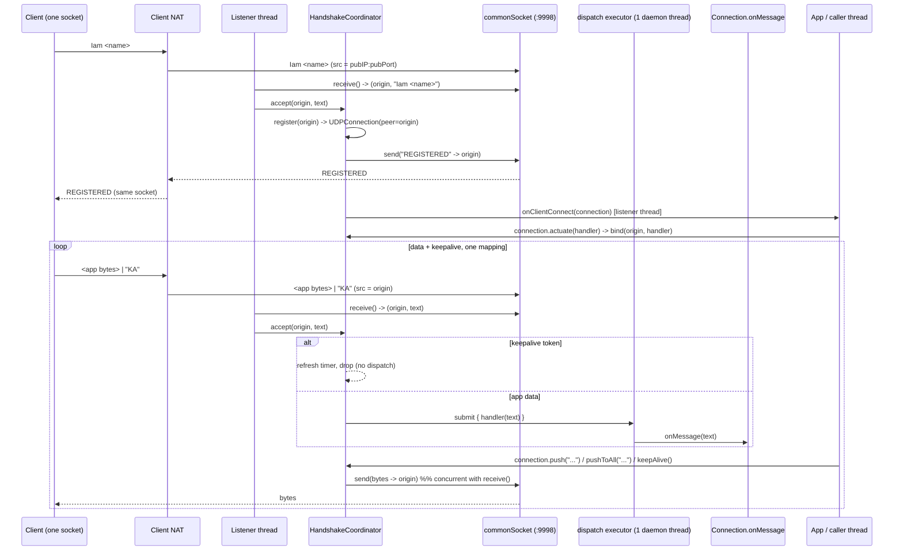

# Issue #1 Tier 2 — data-path NAT traversal

## Header / Association

- **Covers:** `SpartanLaboratories/WebTools#1` — *"Handshake replies to the
  client-claimed address, not the datagram source: breaks any NAT'd client"* —
  **Tier 2 only** (the data path). Tier 1, the handshake fix, shipped in PR #2 as
  `2.0.0b`.
- **Parent design:** [`issue-1-nat-traversal-plan.md`](./issue-1-nat-traversal-plan.md)
  (root-cause table, problems #1–#5, the B1 vs B2 comparison in §3).
- **Tier 1 as-built:** [`issue-1-tier-1-implementation.md`](./issue-1-tier-1-implementation.md).
- **Branch:** `fix/issue-1-tier-2-multiplex` (off `master`).
- **Commit:** TBD — this plan document is to be committed **in the same commit as
  the first implementation stage that touches production code** (commit 2 in §9)
  so `git log --follow` binds the two.
- **PR:** TBD.
- **Status:** planning only. No code written. **All design decisions are
  settled** — see §10; there are no remaining blocking decisions.
- **Target version:** `2.0.0c` (the 2.0.0 line is still pre-release: `2.0.0a`,
  `2.0.0b`). The bare `2.0.0` tag is reserved until the downstream client repos
  have integrated and the cross-NAT UAT (§6) is signed off. See §10 D4.
- **Related:** new `docs/issue-1-tier-2-uat.md` (Level 5 procedure, created by
  this work).

---

## 1. Context

### 1.1 What Tier 1 left unsolved

Tier 1 made the **handshake** follow the datagram source. The **data path** did
not change. After Tier 1:

- `HandshakeCoordinator` still allocates a dedicated port pair per client via
  `HandshakeProtocol.portPairFor(index)`
  (`src/main/kotlin/com/spartanlabs/webtools/HandshakeProtocol.kt:68`): send
  `9999 - 2n - 2`, receive one below.
- The `TXRXON <sendPort> <receivePort>` reply
  (`HandshakeProtocol.kt:79`) tells the client to talk on that fixed pair.
- `newConnection` builds `UDPConnection(name, origin.address, ports.sendPort,
  ports.receivePort)` (`MultiConnectionUDPServer.kt:73-75`), which constructs a
  `UDPSendReceiveServer(address, sendPort, receivePort)`
  (`UDPConnection.kt:26`).
- `UDPSendReceiveServer` (`UDPSendReceiveServer.kt:29-32`) binds
  `DatagramSocket(listenPort)` and a separate ephemeral `sendSocket`, and
  `send()` targets `targetAddress:sendPort` — a fixed remote port
  (`UDPSendReceiveServer.kt:49`).

### 1.2 Root cause of the remaining break (parent plan problems #4 and #5)

- **#4 — one NAT hole per port, none of which exist.** Every client needs a
  distinct inbound NAT mapping for each dedicated port. A NAT rewrites the
  client's source port, so the fixed pair the server was told to use
  (`9997/9996`, …) has no mapping on the client's NAT. Server→client datagrams
  are dropped.
- **#5 — the server speaks first.** The dedicated `UDPSendReceiveServer` (and any
  `onClientConnect` that calls `push`) transmits before the client has sent
  anything from the dedicated ports, so even a correctly-guessed port has no
  mapping yet.

Net effect: the handshake completes from behind NAT, but no data flows back to
the client. Confirmed by the Tier 1 UAT
([`issue-1-tier-1-uat.md`](./issue-1-tier-1-uat.md) §2), which records this as the
accepted Tier 1 limitation.

### 1.3 Goal / acceptance criteria

1. A client behind a typical (full-cone / restricted-cone / port-restricted) NAT
   can exchange datagrams **both ways** with a `MultiConnectionUDPServer` on a
   public IP, after only sending the initial `Iam`.
2. The server never transmits to a client on a 5-tuple the client has not opened.
3. One NAT mapping per client covers handshake, server broadcasts, and
   bidirectional data.
4. No dedicated per-client UDP port is bound on the server (so the server is
   hostable behind a single-port container / L4 UDP load balancer — a secondary
   benefit called out in the issue).
5. The client can keep its single NAT mapping warm; WebTools ships a helper for
   sending the keepalive datagram (`Connection.keepAlive()`).
6. Loopback CI proves the mechanism; true cross-NAT is a documented manual UAT
   (same split Tier 1 used).
7. `kotlin.Result`-based error handling and structured slf4j logging throughout,
   per the repo rules.

Symmetric NAT between two peers that both need to learn a port remains out of
scope (no relay / STUN / TURN) — noted in §7.

---

## 2. Design (settled — Option B1, single-socket multiplex)

### 2.1 Approach

The server keeps exactly **one** socket — `commonSocket` on `COMMON_LISTEN_PORT`
(9998) — and multiplexes *all* client traffic over it: the `Iam` handshake, the
reply, `pushToAll` broadcasts, per-client bidirectional data, and keepalives.
Connections are keyed by the client's datagram source `InetSocketAddress` (its
post-NAT address+port). Because that key is exactly the 5-tuple the client's
`Iam` opened and keeps open, every server→client datagram rides an existing NAT
mapping and the server never speaks first.

The dedicated port pair, `HandshakeProtocol.portPairFor`, the whole `TXRXON`
reply verb and its port arguments, `UDPConnection`'s ownership of a
`UDPSendReceiveServer`, and the `ab53747` "step ports by 2" fix all disappear.

The handshake reply becomes the **single token `REGISTERED`** (no arguments): it
means *"you are registered; keep using this same socket for all traffic to port
9998."*



### 2.2 Concurrency model

- **One** long-lived daemon listener thread, as today. It only *demultiplexes*:
  `receive()` → classify (`Iam` / keepalive / data) → either run the (fast,
  socket-free) handshake state machine inline, drop the keepalive, or hand the
  payload to the dispatch executor.
- **Dispatch executor** (new): a **single-threaded** daemon `ExecutorService`
  (`Executors.newSingleThreadExecutor`, thread name `mcups-dispatch`, daemon)
  invokes `Connection.onMessage` callbacks. Rationale: under B1 all client data
  arrives on one thread, so a slow/blocking handler would otherwise stall *every*
  client and the handshake. Single-threaded so per-client message ordering is
  preserved; the handshake is never affected because it runs inline on the
  listener thread. Accepted trade-off: a slow handler delays delivery to *other*
  clients — documented as the "handlers must return promptly" contract
  (Boundary Ring). A per-peer-serialized pool is a measured-need follow-up (§11).
- `commonSocket`: received on only by the listener thread; sent on from the
  listener thread (reply + keepalive-nothing) and arbitrary caller threads
  (`push`, `pushToAll`, `keepAlive`). JDK `DatagramSocket` permits a concurrent
  `send` during a `receive`, and each `send` is one atomic datagram — unchanged
  from Tier 1, keep the Boundary-Ring KDoc note.
- The registry (origin → `Registration`) stays copy-on-write for iteration
  (`pushToAll`, `stop`); the per-registration handler reference is `@Volatile`,
  written by `actuate`/`terminate` and read by the listener thread.

### 2.3 New / changed types

| Type | Kind | Change |
|------|------|--------|
| `Connection` | public interface | drop `address: InetAddress`, `sendPort: Int`, `receivePort: Int`; add `peer: InetSocketAddress`; add `fun keepAlive(): Result<Unit>`. **Breaking.** |
| `UDPConnection` | public class | repurposed: a socket-free handle over the shared channel. Constructor becomes `internal`. `push` / `keepAlive` delegate to the shared send; `actuate` / `terminate` bind / unbind a handler. **Breaking.** |
| `ClientChannel` | new `internal` interface | the narrow seam `UDPConnection` needs: `send(bytes, to)`, `bind(peer, onMessage)`, `unbind(peer)`. Lets `UDPConnection` be unit-tested with a fake. |
| `CommonChannel` | new `internal` class | wraps the single `DatagramSocket`: `receive(buffer): Result<Inbound>`, `send(bytes, to): Result<Unit>`, `closeResult(): Result<Unit>`. |
| `HandshakeProtocol` | `internal object` | remove `REPLY_VERB`, `DEDICATED_PORT_BASE`, `PortPair`, `portPairFor`, both `txrxonReply` overloads. Add `REGISTERED_REPLY = "REGISTERED"`, `KEEPALIVE_TOKEN = "KA"`, `isHandshake(tokens)`, `isKeepAlive(text)`. Keep `VERB`, `parseHandshake`, `extraTokenCount`. |
| `HandshakeCoordinator` | `internal` class — **name kept** | keeps the handshake state machine; **also** routes inbound data (`accept(origin, text)`), drops keepalives, owns the handler binding, and implements `ClientChannel`. KDoc widened to reflect the enlarged role; type name unchanged. |
| `Registration` | `internal` class | `connection` only; `origin` is `connection.peer`. Gains `@Volatile var onMessage`. |
| `Registrations` | `internal` class | unchanged shape; `findByOrigin` stays. |
| `MultiConnectionUDPServer` | public abstract class | receive loop demuxes handshake / keepalive / data; `newConnection` factory drops ports and gains a `ClientChannel` arg; owns the dispatch executor; `stop()` also shuts the executor. |
| `UDPSendReceiveServer` | public class | **untouched** — retained for standalone bidirectional-socket use. |
| `resolveLocalAddress()` | public fn | untouched (already only informational post-Tier-1). |

### 2.4 Wire-protocol change

| Direction | Tier 1 (`2.0.0b`) | Tier 2 (`2.0.0c`) |
|-----------|-------------------|-------------------|
| client → server, port 9998 | `Iam <name>` | `Iam <name>` (unchanged) |
| server → client (reply target = `Iam` source) | `TXRXON <sendPort> <receivePort>` | **`REGISTERED`** (single token, no arguments) |
| data client → server | on dedicated `receivePort` | on port 9998, from the same socket the `Iam` was sent from |
| data server → client | from dedicated `sendSocket` to `addr:sendPort` | from `commonSocket` to the `Iam` source addr+port |
| keepalive client → server | n/a | `KA` on port 9998 from the same socket (~20 s idle cadence); server drops it without dispatching |
| `pushToAll` broadcast | to each client's learned handshake origin | unchanged (already correct) |

The `TXRXON` verb is **removed entirely** — a client now waits for the literal
token `REGISTERED`. A retransmitted `Iam` from a known origin re-sends
`REGISTERED` and does **not** re-register (Tier 1 behaviour, retained).

### 2.5 `Connection.keepAlive()` — shape and semantics (settled)

`keepAlive()` is a **one-shot**: `fun keepAlive(): Result<Unit>`. It sends one
minimal datagram — the bytes of `HandshakeProtocol.KEEPALIVE_TOKEN` (`"KA"`) — to
`peer` over the shared channel and returns the send `Result`. It owns **no**
timer, thread, or loop; the caller schedules it on its own cadence.

Rationale for one-shot over an owned loop: an owned loop would need its own
`ScheduledExecutorService`, lifecycle (`start`/`stop`), and failure policy, all
duplicating machinery the caller usually already has (a game loop, a scheduler).
The one-shot composes into whatever the caller runs and stays trivially testable.
The ~20 s cadence is a documented requirement (README + UAT), not something
WebTools enforces.

Direction note (documented honestly in the KDoc and README): the `Connection`
handle currently lives on the **server** side, so `serverConnection.keepAlive()`
is a server→client datagram. That refreshes the mapping timer on
endpoint-independent-filtering (full-cone / restricted-cone) NATs and lets the
server verify its send path, but it does **not** reliably refresh
port-restricted or symmetric NATs. The authoritative keepalive must be sent by
the **client** on its socket every ~20 s (the client is a downstream repo, §8);
`Connection.keepAlive()` is the shared primitive both sides use, and the server
drops any inbound `KA` it receives.

### 2.6 Rejected alternative — Option B2 (port learning)

Keep the dedicated-pair model; `UDPSendReceiveServer` gains a "learn the target
from the first inbound datagram" mode and refuses to `send` before it has
learned; the client primes every dedicated port. **Rejected** (§10 D1): still one
NAT mapping *per port per client*, the server still binds N ports (not
load-balancer friendly), more complexity on the client (prime + keepalive every
port), and it still changes `Connection`'s public shape — so it buys no
compatibility over B1 while solving less. B1 also deletes net code.

---

## 3. File-by-file changes

All paths under `src/main/kotlin/com/spartanlabs/webtools/` unless stated.

### 3.1 `Connection.kt`

- Remove `import java.net.InetAddress`; add `import java.net.InetSocketAddress`.
- Interface body:
  ```kotlin
  interface Connection {
      val name: String
      /** The client's post-NAT endpoint, learned from its `Iam` datagram; every
       *  datagram to this client is addressed here. */
      val peer: InetSocketAddress

      fun actuate(onMessage: (message: String) -> Unit): Result<Unit>
      fun terminate(): Result<Unit>
      fun push(message: String): Result<Unit>

      /**
       * Sends one minimal keepalive datagram to [peer] to keep its NAT mapping
       * warm. A one-shot: the caller schedules it (recommended ~20 s idle
       * cadence). Owns no timer or thread.
       * @return [Result.success] if the datagram was sent, or the failure that prevented it
       */
      fun keepAlive(): Result<Unit>
  }
  ```
- KDoc: replace the `address` / `sendPort` / `receivePort` `@property` docs with
  `peer`; note `actuate` now just *registers* a handler (no socket is bound) and
  the handler runs on the server's single-threaded dispatch executor; document
  the `keepAlive()` direction caveat from §2.5.

### 3.2 `HandshakeProtocol.kt`

- **Delete:** `REPLY_VERB`, `DEDICATED_PORT_BASE`, `PortPair`, `portPairFor`,
  `txrxonReply(PortPair)`, `txrxonReply(sendPort, receivePort)`.
- **Keep:** `VERB` (`"Iam"`), `NAME_INDEX`, `MIN_TOKENS`, `parseHandshake`,
  `extraTokenCount`.
- **Add:**
  ```kotlin
  /** The entire server handshake reply: a single token, no arguments. */
  const val REGISTERED_REPLY = "REGISTERED"

  /** The token a client sends on an idle interval to keep its NAT mapping warm. */
  const val KEEPALIVE_TOKEN = "KA"

  /** True if [tokens] opens a handshake (verb match only; validity is [parseHandshake]'s job). */
  fun isHandshake(tokens: List<String>): Boolean = tokens.firstOrNull() == VERB

  /** True if [text] is a bare keepalive datagram (to be dropped, never dispatched). */
  fun isKeepAlive(text: String): Boolean = text == KEEPALIVE_TOKEN
  ```
- Update the object KDoc: drop the "how each connection's dedicated port pair is
  allocated" and "how the `TXRXON` reply body is rendered" clauses; describe the
  `REGISTERED` reply and the `KA` keepalive token instead.

### 3.3 `CommonChannel.kt` (new, `internal`)

```kotlin
internal data class Inbound(val origin: InetSocketAddress, val text: String)

internal class CommonChannel(port: Int) {
    private val socket = DatagramSocket(port)
    val localPort: Int get() = socket.localPort

    /** Blocks until a datagram arrives; [Result.failure] on a SocketException
     *  (socket closed) or decode failure. [buffer] is caller-owned and reused. */
    fun receive(buffer: ByteArray): Result<Inbound>

    /** One atomic datagram to [to]. Safe to call concurrently with [receive]. */
    fun send(bytes: ByteArray, to: InetSocketAddress): Result<Unit>

    fun closeResult(): Result<Unit>   // runCatching { socket.close() }
}
```

- All three methods `runCatching { … }.onFailure { log … }`.
- Boundary-Ring KDoc: single UDP socket, concurrent send-during-receive is
  supported, every datagram is addressed to a caller-supplied post-NAT endpoint.

### 3.4 `ClientChannel.kt` (new, `internal` interface)

```kotlin
internal interface ClientChannel {
    fun send(bytes: ByteArray, to: InetSocketAddress): Result<Unit>
    fun bind(peer: InetSocketAddress, onMessage: (String) -> Unit)
    fun unbind(peer: InetSocketAddress)
}
```

Implemented by `HandshakeCoordinator` (§3.6). Exists so `UDPConnection` has one
mockable collaborator.

### 3.5 `UDPConnection.kt` (rewrite)

```kotlin
class UDPConnection internal constructor(
    override val name: String,
    override val peer: InetSocketAddress,
    private val channel: ClientChannel,
) : Connection {

    override fun actuate(onMessage: (message: String) -> Unit): Result<Unit> =
        runCatching { channel.bind(peer, onMessage) }
            .onFailure { log.error("Could not actuate connection '{}'", name, it) }

    override fun terminate(): Result<Unit> =
        runCatching { channel.unbind(peer) }
            .onFailure { log.error("Could not terminate connection '{}'", name, it) }

    override fun push(message: String): Result<Unit> =
        channel.send(message.toByteArray(Charsets.UTF_8), peer)
            .onFailure { log.error("Connection '{}' could not push a message", name, it) }

    override fun keepAlive(): Result<Unit> =
        channel.send(KEEPALIVE_BYTES, peer)
            .onFailure { log.error("Connection '{}' could not send a keepalive", name, it) }

    private companion object {
        private val log = LoggerFactory.getLogger(UDPConnection::class.java)
        private val KEEPALIVE_BYTES = HandshakeProtocol.KEEPALIVE_TOKEN.toByteArray(Charsets.UTF_8)
    }
}
```

- Removes the `UDPSendReceiveServer` field, the `InetAddress` import, the
  `sendPort` / `receivePort` params.
- Constructor is `internal` — only `MultiConnectionUDPServer`'s factory builds
  these. Standalone bidirectional-socket users take `UDPSendReceiveServer`
  directly.
- Component-Ring KDoc: rewrite the `@property` block; state that `push` /
  `keepAlive` address `peer` over the server's shared socket and that the
  connection owns no socket or thread of its own.

### 3.6 `HandshakeCoordinator.kt` (name kept; role widened)

- **Do not rename the file or class** (§10 D6). Update its KDoc: it is now the
  handshake state machine **and** the inbound-datagram router **and** the
  `ClientChannel` implementation.
- Constructor collaborators change:
  ```kotlin
  internal class HandshakeCoordinator(
      private val newConnection: (name: String, peer: InetSocketAddress, channel: ClientChannel) -> Connection,
      private val send: (bytes: ByteArray, to: InetSocketAddress) -> Result<Unit>,
      private val onRegistered: (Connection) -> Unit,
      private val dispatch: (block: () -> Unit) -> Unit,   // hands work to the single-threaded executor
  ) : ClientChannel
  ```
  - `newConnection` loses the `PortPair` argument, gains `channel` — the
    coordinator passes `this` as that argument, so `UDPConnection` gets its
    `ClientChannel` without a lazy/lateinit dance.
  - `reply` (String) is replaced by `send` (bytes) — the coordinator owns UTF-8
    encoding of `REGISTERED`.
- New `accept` — the single entry point the listener loop calls:
  ```kotlin
  fun accept(origin: InetSocketAddress, text: String): Result<Unit> = when {
      HandshakeProtocol.isKeepAlive(text) -> Result.success(Unit)
          .also { log.trace("Keepalive from {}", origin) }
      HandshakeProtocol.isHandshake(text.split(' ')) -> handleHandshake(origin, text.split(' '))
      else -> deliverData(origin, text)
  }
  ```
- `handleHandshake` = the current `handle`'s `Iam` branch, minus port allocation:
  - known origin → re-send `REGISTERED` bytes to `origin`.
  - new origin → `newConnection(name, origin, this)`;
    `registrations.add(Registration(connection))`;
    `send(REGISTERED_BYTES, origin).map { onRegistered(connection) }`.
- `deliverData`:
  ```kotlin
  private fun deliverData(origin: InetSocketAddress, text: String): Result<Unit> {
      val registration = registrations.findByOrigin(origin)
          ?: return Result.success(Unit).also { log.debug("Dropped datagram from unregistered {}", origin) }
      val handler = registration.onMessage
          ?: return Result.success(Unit).also { log.debug("No handler bound for {}, dropping", origin) }
      return runCatching { dispatch { runCatching { handler(text) }.onFailure { log.warn("Handler for {} threw", origin, it) } } }
  }
  ```
- `ClientChannel` impl:
  - `send` → the injected `send`.
  - `bind(peer, onMessage)` → `registrations.findByOrigin(peer)?.onMessage = onMessage`.
  - `unbind(peer)` → `registrations.findByOrigin(peer)?.onMessage = null`.
- `actuateAll(onMessage)` — keep; it now just binds the shared callback on every
  registration (no socket to start): fold over `snapshot()` calling
  `it.connection.actuate(onMessage)`.
- `broadcast(message)` — unchanged in spirit; uses the injected `send` with
  encoded bytes to each `registration.connection.peer`.
- `terminateAll()` — unchanged (terminates every connection even if one fails);
  `terminate` now just unbinds.
- Remove all `HandshakeProtocol.txrxonReply` / `replyBodyFor` usage; add
  `private val REGISTERED_BYTES = HandshakeProtocol.REGISTERED_REPLY.toByteArray(Charsets.UTF_8)`
  in a `private companion object`.

### 3.7 `Registrations.kt`

- `Registration`:
  ```kotlin
  internal class Registration(val connection: Connection) {
      val origin: InetSocketAddress get() = connection.peer
      @Volatile var onMessage: ((String) -> Unit)? = null
  }
  ```
- `Registrations` unchanged: `add`, `size`, `findByOrigin`, `snapshot`.
  `findByOrigin` still matches `origin` by value (now via `connection.peer`).

### 3.8 `MultiConnectionUDPServer.kt`

- Field changes:
  - `commonSocket: DatagramSocket` → `private val commonChannel = CommonChannel(COMMON_LISTEN_PORT)`.
  - Add `private val dispatchExecutor: ExecutorService =
    Executors.newSingleThreadExecutor { r -> Thread(r, "mcups-dispatch").apply { isDaemon = true } }`.
  - `coordinator`:
    ```kotlin
    private val coordinator = HandshakeCoordinator(
        newConnection = { name, peer, channel -> UDPConnection(name, peer, channel) },
        send = commonChannel::send,
        onRegistered = ::onClientConnect,
        dispatch = dispatchExecutor::execute,
    )
    ```
- `handshakeLoop()` → `receiveLoop()`:
  ```kotlin
  private fun receiveLoop() {
      val buffer = ByteArray(RECEIVE_BUFFER_BYTES)
      while (listening) {
          commonChannel.receive(buffer)
              .flatMap { (origin, text) -> coordinator.accept(origin, text) }
              .onFailure { cause ->
                  if (cause is SocketException) listening = false
                  else log.warn("Failed to handle incoming datagram: {}", cause.message, cause)
              }
      }
  }
  ```
- `replyToOrigin` — **delete** (the coordinator owns replies via `send`).
- `pushToAll(message)` → `coordinator.broadcast(message)` (call site unchanged).
- `start(onClientMessage)` → `coordinator.actuateAll(onClientMessage)` (call site
  unchanged; semantics now "bind this handler on every registration").
- `stop()`:
  - `coordinator.terminateAll()` first (unbinds every handler),
  - `listening = false`, join the listener thread,
  - `commonChannel.closeResult()`,
  - `runCatching { dispatchExecutor.shutdownNow() }.map { }` — new step, folded
    into the return chain so a partial failure still releases the port.
- Companion: keep `COMMON_LISTEN_PORT`, `RECEIVE_BUFFER_BYTES`,
  `LISTENER_JOIN_TIMEOUT_MILLIS`. No new public constants.
- Class KDoc: rewrite — one socket, all traffic multiplexed by source endpoint;
  no dedicated ports; reply is `REGISTERED`; the server never transmits on an
  unopened 5-tuple; keepalive tokens are dropped; the single-threaded dispatch
  executor and the "handlers must return promptly / may delay other clients"
  contract (Boundary Ring). **Delete** the "### Known limitation" section (that
  *was* this issue). Change "Tracked as …#1 (Tier 2)" to "resolved in …#1
  Tier 2".

### 3.9 `build.gradle.kts`

- `coordinates("io.github.spartanlaboratories", "WebTools", "2.0.0c")`.
- Add `"e2e" to "Level 4b - end-to-end system integration tests"` to the
  level-task list (§4.5 adds the first 4b test).
- The `e2eTest` task binds the common port, so extend the port-lock condition:
  `if (tag == "integration" || tag == "e2e") usesService(commonUdpPortLock)`.

### 3.10 `README.md`

Required — the wire protocol and the component behaviour both change.

- **Install** snippet version → `2.0.0c`.
- **Components** table: `UDPConnection` row → "a socket-free handle to one
  multiplexed client of a `MultiConnectionUDPServer`; owns no socket". Keep
  `UDPSendReceiveServer` (still the standalone primitive).
- **UDP handshake protocol** section:
  - reply row: `TXRXON <sendPort> <receivePort>` → **`REGISTERED`** (single
    token).
  - add a data row: data flows both ways over `COMMON_LISTEN_PORT` from the
    client's handshake socket; the server addresses every datagram to the
    client's post-NAT source, so **the data path traverses NAT** and the server
    binds no per-client ports.
  - add a keepalive row: client sends `KA` on ~20 s idle cadence from the same
    socket to hold the NAT mapping; `Connection.keepAlive()` is the helper for
    it; the server drops inbound `KA` without dispatching.
  - **delete** the "Known limitation" paragraph.
- **Build & test**: add `./gradlew e2eTest  # Level 4b - full-stack flows`.

### 3.11 `docs/issue-1-nat-traversal-plan.md`

- §3: mark **Option B1 as chosen and implemented**; note the reply verb landed as
  `REGISTERED` (not the `OK`/token placeholder the parent sketch used); link this
  doc.
- §5 sequencing: tick items 3–5; note the final `2.0.0` tag is pending downstream
  integration.

### 3.12 `docs/issue-1-tier-2-uat.md` (new) — see §6.

---

## 4. Test plan (5-level hierarchy)

Test root: `src/test/kotlin/com/spartanlabs/testing/<level>/webtools/`. Every
class carries the matching `@Tag`. Shared fixtures under `testing/support/webtools/`.

### 4.0 Fixtures

- **`testing/support/webtools/FakeConnection.kt`** — update to the new
  `Connection` shape: `peer: InetSocketAddress` instead of
  `address`/`sendPort`/`receivePort`; record the last `onMessage` passed to
  `actuate`; add `keepAliveCalls` counter and a configurable `keepAliveResult`.
- **`testing/support/webtools/FakeClientChannel.kt`** (new) — records
  `send(bytes, to)` calls (as decoded strings + target), `bind`/`unbind` calls,
  and lets a test invoke a bound handler. Backs the socket-free `UDPConnection`
  tests.

### 4.1 Level 1 — gating (`testing.gating.webtools`)

| Class | Behaviours locked down |
|-------|------------------------|
| `HandshakeProtocolGatingTest` (update) | `parseHandshake` name / nameless-reject unchanged; **`REGISTERED_REPLY == "REGISTERED"`**; `isHandshake` true for `["Iam", …]`, false otherwise; `isKeepAlive("KA")` true, `isKeepAlive("Iam x")` false. Remove the two port-pair cases and the `TXRXON` shape case. |
| `HandshakeCoordinatorGatingTest` (update) | first `Iam` registers + sends exactly one reply to `origin` whose bytes decode to `"REGISTERED"`; retransmit from same origin does not add a second registration; a `KA` from a registered origin is dropped (success, no dispatch); a non-`Iam` datagram from an unregistered origin is dropped; `Registrations.findByOrigin` round-trips. |

### 4.2 Level 2 — component (`testing.component.webtools`), socket-free

| Class | Behaviours |
|-------|------------|
| `HandshakeCoordinatorTest` (rewrite) | new-vs-retransmit; `newConnection` called with `(name, peer, channel)` and no ports; reply bytes decode to `"REGISTERED"`; `onRegistered` fires once, only after a successful `send`; `send`-failure path still registers but skips `onRegistered`; **`accept` routes a non-`Iam`, non-`KA` datagram to the bound handler via `dispatch`**; **`accept` drops a `KA` datagram — no dispatch, success**; **datagram for an unregistered origin dropped**; **datagram for a registered-but-not-actuated origin dropped**; a throwing handler does not propagate out of `accept`; `bind`/`unbind` toggle delivery; `broadcast` hits every peer, first failure reported; `terminateAll` unbinds every connection even when one fails; `snapshot` order. Use a synchronous `dispatch = { it() }`. |
| `UDPConnectionTest` (**moved** from `integration` → `component` in commit 1, then rewritten in commit 2) | `push` encodes UTF-8 and calls `channel.send(bytes, peer)`, propagating the `Result`; **`keepAlive` calls `channel.send` with the `"KA"` bytes to `peer`, propagating the `Result`** (incl. the failure path); `actuate` calls `channel.bind(peer, handler)`; `terminate` calls `channel.unbind(peer)`; `name`/`peer` exposed as constructed. Uses `FakeClientChannel`. No socket. |
| `RegistrationsTest` (update) | construct `Registration(FakeConnection(...))`; `origin` reads through to `connection.peer`; `onMessage` defaults null and is settable; `findByOrigin` by value; `snapshot` order + detached copy. |

### 4.3 Level 3 — integration (`testing.integration.webtools`), real sockets / loopback

| Class | Behaviours |
|-------|------------|
| `CommonChannelTest` (new) | bind → `localPort` correct; `send` then `receive` on a second `CommonChannel` round-trips text + observes the real source `InetSocketAddress`; `receive` after `closeResult()` yields `Result.failure(SocketException)`; a `send` from one thread while another is blocked in `receive` both succeed. |
| `MultiConnectionUDPServerTest` (rewrite) | Single shared server on 9998, `@TestInstance(PER_CLASS)`, ordered, one `DatagramSocket` per simulated client. **(a)** `Iam` → reply is exactly `"REGISTERED"` (one token, no `/`, no digits), connection registered, `connection.peer` == the client socket's local `InetSocketAddress`. **(b)** payload address token still ignored. **(c)** retransmit idempotent, still `"REGISTERED"`, no second registration. **(d)** after `actuate`, an app datagram from the client socket is delivered to the handler (inbound demux by source key). **(e)** `connection.push("x")` arrives back on that **same** client socket (server→client rides the one mapping). **(f)** `connection.keepAlive()` puts a `KA` datagram on the wire to the client (assert the client socket receives `"KA"`), and a `KA` **from** the client is consumed by the server without reaching the handler and without wedging the listener. **(g)** `server.pushToAll` reaches every client socket. **(h)** two clients: a datagram from client A is delivered only to A's handler, never B's. **(i)** data from an unregistered socket is silently dropped, listener survives. **(j)** the server can `push` to a client that has sent nothing since its `Iam` ("server never needs to speak first"). **(k)** malformed / empty / unknown-verb / oversized datagrams don't wedge the listener. **(l)** `stop()` terminates, closes the socket, shuts the executor; post-stop `Iam` gets no reply. |
| `UDPSendReceiveServerTest` | unchanged (standalone primitive, untouched by B1). |

Remove `UDPConnectionTest` from this package (moved to L2 in commit 1). Remove
every reference to a dedicated port pair, to `TXRXON`, and to
`MultiConnectionUDPServer` internal port constants.

### 4.4 Level 4a — deterministic (`testing.deterministic.webtools`)

| Class | Behaviours |
|-------|------------|
| `HandshakeProtocolTest` (update) | keep the `parseHandshake` / `extraTokenCount` exhaustive cases; **delete** all `portPairFor` / `PortPair` / `txrxonReply` cases; add: `REGISTERED_REPLY` and `KEEPALIVE_TOKEN` are the exact literals; `isHandshake` truth table over `Iam`, `iam`, `""`, `HELLO`, `KA`; `isKeepAlive` truth table over `KA`, `ka`, `KA x`, `""`, `Iam x`. |

### 4.5 Level 4b — e2e (`testing.e2e.webtools`) — new level for this repo

| Class | Behaviours |
|-------|------------|
| `MultiConnectionUDPServerE2ETest` (new) | Full flow over loopback with a real `MultiConnectionUDPServer` subclass and **three** concurrent simulated clients: each handshakes (asserts `"REGISTERED"`), actuates, then a scripted exchange — clients send N messages each, server echoes via `connection.push` and periodically `pushToAll`s; each client also runs `connection.keepAlive()`… (server side) between messages; assert every client receives its own echoes and all broadcasts, in order, with no cross-talk, that keepalive datagrams never surface as app messages, and that the server bound exactly one UDP port for the whole session. Tear down via `stop()`; assert a fresh bind on 9998 then succeeds. |

Add the `e2eTest` Gradle task (§3.9).

### 4.6 Level 4c — non-functional (`testing.nonfunctional.webtools`)

| Class | Behaviours |
|-------|------------|
| `HandshakeNonFunctionalTest` (update) | keep "retransmit storm from one origin → one connection, one reply each"; keep "reply target is only ever the datagram origin, never a payload address". Add: **after 50 registrations against a real server, a bind on each former dedicated port (9997, 9996, 9995 …) succeeds** — i.e. the server binds exactly one socket regardless of client count. Add: with the single-threaded dispatch executor, **per-client message order is preserved under a burst** (send 500 ordered messages from one client, assert the handler sees 1..500 in order); document the accepted cross-client head-of-line-blocking trade-off in the test KDoc. Add: a `KA` storm from one origin creates no registrations and is never dispatched. |

### 4.7 Level 5 — UAT (`testing.uat.webtools`)

| Class | Behaviours |
|-------|------------|
| `MultiConnectionUDPServerUatTest` (update) | Keep test 1 (handshake from behind NAT — still valid; assert reply is `REGISTERED`). **Flip test 2**: `the dedicated data channel is known not to traverse NAT yet` → `a NAT'd client exchanges data both ways over the single multiplexed port`, `@Disabled`, pointing at `docs/issue-1-tier-2-uat.md`. **Add test 3**: `the NAT mapping survives a multi-minute session driven by Connection.keepAlive() plus a client-side keepalive`, `@Disabled`. |

### 4.8 What cannot be automated

- Behaviour against a **real** NAT (any cone type), carrier-grade NAT, and NAT
  mapping-timeout behaviour — loopback has no NAT. Covered by the manual
  `docs/issue-1-tier-2-uat.md` (§6), same approach Tier 1 took.
- Whether a server→client `Connection.keepAlive()` alone refreshes a given real
  NAT (it does for cone NATs, not for port-restricted/symmetric) — UAT §4
  records the observed behaviour per router.
- Throughput / latency under real internet loss/jitter — out of scope.

---

## 5. Documentation impact (Audience-Reach rings)

| Ring | What moves with this change |
|------|-----------------------------|
| Inner Core | Level-1 inline comments: why the receive loop classifies (`KA` / `Iam` / data) before dispatching; why `deliverData` drops unknown origins; why the dispatch executor is single-threaded; why `keepAlive()` is a one-shot. |
| Component Ring (KDoc) | `Connection` (new `peer`, `keepAlive()` + its direction caveat, `actuate` = register-not-bind), `UDPConnection` (socket-free handle), `HandshakeCoordinator` (widened role — **name unchanged**), `CommonChannel`, `ClientChannel`, `HandshakeProtocol` (`REGISTERED_REPLY` / `KEEPALIVE_TOKEN` / `isHandshake` / `isKeepAlive`, removed port + `TXRXON` API), `MultiConnectionUDPServer` (rewrite protocol + concurrency paragraphs, delete "Known limitation"). |
| Boundary Ring | `README.md` "UDP handshake protocol" rewrite (data path NAT-traversable, `REGISTERED` reply, `KA` keepalive + ~20 s cadence, no per-client ports); `MultiConnectionUDPServer` KDoc concurrency/side-effect notes; `docs/issue-1-nat-traversal-plan.md` status. |
| Architectural Outer Layer | The Mermaid diagram in §2.1 is the canonical topology for the multiplexed server; add a pointer from `docs/issue-1-tier-1-implementation.md` §3a noting its diagram is superseded for Tier 2. `docs/issue-1-tier-2-uat.md` (new) is the Level-5 architecture-facing artefact. |

README currency: covered by §3.10 — the same commit that changes the protocol
updates the README.

---

## 6. `docs/issue-1-tier-2-uat.md` (new, Level 5 procedure)

Mirror the Tier 1 UAT doc's structure. Contents:

- **Covers:** `SpartanLaboratories/WebTools#1` Tier 2; executable scaffold
  `src/test/kotlin/com/spartanlabs/testing/uat/webtools/MultiConnectionUDPServerUatTest.kt`.
- **Prerequisites:** Host S with public routable IPv4 + inbound UDP 9998 open,
  running a `MultiConnectionUDPServer` subclass that echoes and calls
  `connection.keepAlive()` on a ~20 s schedule; Host C behind a home NAT, not on
  the same LAN, not on a VPN, sending its own `KA` every ~20 s idle.
- **Section 1 — handshake from behind NAT** (regression of Tier 1): reply must be
  the token `REGISTERED`; S logs the client's post-NAT address.
- **Section 2 — bidirectional data over the single port** *(must pass — the Tier 2
  deliverable)*: from the same socket that sent `Iam`, C sends `hello-from-C`;
  S's handler logs it and `push`es `hello-from-S` back; C receives it on that
  socket within 2 s. PASS / FAIL / partial (one direction only) table.
- **Section 3 — broadcast:** `server.pushToAll` reaches C.
- **Section 4 — mapping longevity:** run for 5 min. Sub-cases: (a) client-side
  `KA` every 20 s + server idle — data still flows; (b) server-side
  `Connection.keepAlive()` only, client idle — record whether C's router keeps
  the mapping (expected: yes for cone NAT, no for symmetric); (c) deliberate
  60 s total silence — record whether the mapping survived.
- **Section 5 — two clients behind one NAT:** both C1 and C2 (distinct source
  ports) register and exchange data without cross-talk.
- **Sign-off table:** date/evaluator, Host S addr/OS, Host C ISP/router, each
  section verdict, observed NAT type/timeout, release-readiness call for the bare
  `2.0.0` tag.

---

## 7. Risks & edge cases

- **Breaking API change (published library).** `Connection.address` /
  `Connection.sendPort` / `Connection.receivePort` are removed;
  `Connection.keepAlive()` is added (any existing implementer must implement it);
  `UDPConnection`'s public constructor becomes `internal`. Per
  `api-evolution-clean-break` (WebTools is on Maven Central): clean break, no
  deprecated shims, rides the in-progress `2.0.0` major — no *further* major
  bump, pre-release qualifier advances `2.0.0b` → `2.0.0c`. Code reading
  `connection.address` moves to `connection.peer.address`;
  `sendPort`/`receivePort` have no successor (there are no per-client ports).
- **Wire-protocol break.** A `2.0.0b` client waits for `TXRXON` and parses two
  port arguments; it will never match the bare `REGISTERED` token and never
  receives data on a dedicated port. Must land in lockstep with the downstream
  client change (§8). No mixed-version operation is supported — acceptable
  pre-1.0.
- **Cross-client head-of-line blocking.** One listener thread + one dispatch
  thread. A slow handler for client A delays delivery to client B. The handshake
  is never blocked (runs inline, pure/fast). Mitigation: documented
  "handlers must return promptly" contract; per-peer-serialized pool is a
  measured-need follow-up (§11).
- **`keepAlive()` direction.** On the server side it is server→client and does
  **not** reliably refresh port-restricted/symmetric NATs; the authoritative
  keepalive is client→server (§8). Documented in the `Connection` KDoc, README,
  and UAT §4 so no one assumes the server helper alone is sufficient.
- **NAT mapping timeout.** With no per-connection socket, the client's single
  mapping must be kept warm (client `KA` every ~20 s). If it lapses,
  server→client silently fails until the client sends again.
- **`KA` collision with app data.** An app that legitimately sends the exact
  two-byte payload `"KA"` as a message would have it silently swallowed.
  Acceptable: the token is documented, and app protocols on top of this layer
  control their own payloads. Noted in the `HandshakeProtocol` KDoc.
- **Symmetric NAT on the server.** B1 assumes the server is on a routable IP. A
  server behind symmetric NAT needs a rendezvous/relay — out of scope, noted in
  README.
- **`push` / `pushToAll` / `keepAlive` before `actuate`.** A datagram to a
  registered but un-actuated client is delivered on the wire but has no handler
  if it is inbound app data — dropped with a debug log (same shape as Tier 1's
  "broadcast before handshake").
- **Handler exceptions.** Handlers run on the executor wrapped in `runCatching`
  (§3.6 `deliverData`), so a throwing handler cannot kill the dispatch thread or
  the receive loop.
- **Port-lock in CI.** `e2eTest` also binds 9998 — must join the
  `commonUdpPortLock` shared service (§3.9) or parallel Gradle workers
  `BindException`.
- **Cross-repo lockstep (§8).**

---

## 8. Cross-repo impact — `MyGameTools` / `MyGameServer` (downstream consumers)

These repos hold the **client** side of the wire protocol. They are downstream
consumers of WebTools — this plan **reports** the coordination required; it does
not propose filing issues against them.

Coordination needed, to land in lockstep with the `2.0.0c` bump:

1. **Reply parsing.** Stop waiting for `TXRXON` and stop parsing
   `<sendPort> <receivePort>`. Treat the single token `REGISTERED` as
   "registered".
2. **Data path.** Send and receive all game data on the **same** `DatagramSocket`
   that sent `Iam`, addressed to the server's `COMMON_LISTEN_PORT` (9998). Remove
   any code that opens a dedicated client-side send/receive port pair from the
   reply.
3. **Keepalive.** Send the token `KA` on that socket every ~20 s of idle time so
   the NAT mapping stays alive. (If the client also uses WebTools' `Connection`
   type in future, `Connection.keepAlive()` is the shared primitive; today the
   client sends `KA` directly.)
4. **`resolveLocalAddress()` in the handshake.** Already only informational after
   Tier 1; can now be dropped from the `Iam` payload entirely (the server ignores
   trailing tokens regardless).

Executor actions before implementation:
- `grep` both repos for the handshake client: `Iam`, `TXRXON`, `9998`,
  `COMMON_LISTEN_PORT`, `UDPSendReceiveServer`, `UDPConnection`, `sendPort`,
  `receivePort` — enumerate the concrete call sites.
- Confirm current org ownership of each repo (`gh repo view MyGameTools`,
  `gh repo view MyGameServer`) — repos move between `SpartanLabsGaming` and
  `SpartanLaboratories`.
- Decide the merge order: WebTools `2.0.0c` to Maven Central first, then each
  client repo bumps its dependency and adapts in one commit; or develop the
  client change against a WebTools `-SNAPSHOT` and release together.
- The bare `2.0.0` WebTools tag waits until both client repos are on `2.0.0c` and
  the cross-NAT UAT (§6) has passed (§10 D4).

---

## 9. Version control

- **Branch:** `fix/issue-1-tier-2-multiplex`, off `master`.
- **Pre-existing working-tree noise:** `.idea/workspace.xml` is already modified
  in the working tree — **not** part of this work; leave it out of every commit
  here (stash it first if convenient).
- **Commit trailers** (every commit):
  ```
  Co-Authored-By: Claude Sonnet 5 <noreply@anthropic.com>
  Claude-Session: https://claude.ai/code/session_01UF3s6ix6rNpJBxBvy3GSLz
  ```
- **Commit sequence:**
  1. `test: move UDPConnection tests to component level ahead of the multiplex refactor`
     — pure move of `UDPConnectionTest.kt` from
     `src/test/kotlin/com/spartanlabs/testing/integration/webtools/` to
     `.../component/webtools/`, package + `@Tag` changed to `component`, still
     compiling against the **current** API (so commit 2's behavioural rewrite has
     a clean diff). No production changes.
  2. `feat!: multiplex all client traffic over the common UDP socket (Issue #1 Tier 2)`
     — all of §3 (production), all of §4 (test rewrites + new
     `CommonChannelTest`, `MultiConnectionUDPServerE2ETest`, `FakeClientChannel`),
     §3.9 (`build.gradle.kts` version + `e2e` task), §3.10 (`README.md`), §3.11
     (`docs/issue-1-nat-traversal-plan.md`), §6 (`docs/issue-1-tier-2-uat.md`),
     **and this plan document** (`docs/issue-1-tier-2-plan.md`) — so
     `git log --follow` on the plan binds it to the implementation. The `feat!`
     marker records the breaking change. `./gradlew build` (all levels) green
     before committing.
  3. *(after merge)* update this doc's `Commit:` / `PR:` header fields with the
     real SHA(s) and PR number, and tick `docs/issue-1-nat-traversal-plan.md` §5.
- **No push, no PR, no release** until the user asks. When asked to share:
  prompt the user to (a) comment on issue #1 that Tier 2 has landed, (b)
  coordinate the `MyGameTools` / `MyGameServer` client change per §8, (c) decide
  the `2.0.0c` → `2.0.0` promotion.

---

## 10. Open decisions — ALL RESOLVED

No blocking decisions remain. Recorded here as the settled design.

**D1 — Option B1 (single-socket multiplex) vs B2 (port learning).**
**RESOLVED: B1.** Fully specified in §2–§4. B2 is documented as the rejected
alternative in §2.6: it still needs one NAT mapping per port per client, still
binds N server ports (not load-balancer friendly), pushes prime-every-port +
keepalive-every-port onto the client repos, and still breaks `Connection`'s
public shape — so it buys no compatibility while solving less, and B1 additionally
deletes net code.

**D2 — Handshake reply token.**
**RESOLVED: a new single token `REGISTERED`, no arguments.** `TXRXON` /
`REPLY_VERB` and all port arguments are removed from `HandshakeProtocol` and
everywhere else (§3.2, §3.6). Class KDoc, README protocol table (§3.10), and
every reply assertion in the test plan (§4.1–§4.7) updated. The client learns
"you are registered; use this same socket for all traffic to port 9998."

**D3 — Dispatch executor threading.**
**RESOLVED: single-threaded daemon `ExecutorService`** (`Executors
.newSingleThreadExecutor`, thread `mcups-dispatch`, daemon). Preserves per-client
message ordering; handshake unaffected (runs inline on the listener thread).
Cross-client head-of-line blocking is an accepted, documented trade-off (§2.2,
§7); a per-peer-serialized pool is a measured-need follow-up (§11).

**D4 — Version.**
**RESOLVED: ship as `2.0.0c`** (§3.9 `build.gradle.kts`). The bare `2.0.0` tag is
reserved until `MyGameTools` / `MyGameServer` are on `2.0.0c` and the cross-NAT
UAT (§6) is signed off, then the same tree is promoted to `2.0.0` (§8, §9
commit 3).

**D5 — `Connection.keepAlive()`.**
**RESOLVED: in scope, as a one-shot `keepAlive(): Result<Unit>`.** It sends one
`HandshakeProtocol.KEEPALIVE_TOKEN` (`"KA"`) datagram to `peer` over the shared
channel and returns the send `Result`; it owns no timer, thread, or loop — the
caller drives it on a ~20 s idle cadence (rationale in §2.5). Added to the
`Connection` interface (§3.1) and implemented by `UDPConnection` (§3.5). Tested
at Level 2 (pure call → `channel.send` with the `"KA"` bytes, incl. failure path,
§4.2) and Level 3 (the datagram actually leaves on the wire and a client `KA` is
consumed without dispatch, §4.3 case (f)). The ~20 s client cadence is documented
in `README.md` (§3.10) and `docs/issue-1-tier-2-uat.md` (§6 Section 4). The
server-side direction caveat (server→client `keepAlive()` does not refresh
port-restricted/symmetric NATs; the authoritative keepalive is client→server) is
documented in the `Connection` KDoc, README, and UAT.

**D6 — Rename `HandshakeCoordinator`.**
**RESOLVED: DENIED — name kept.** The file and class stay
`HandshakeCoordinator` (§3.6). Its responsibilities widen (handshake state
machine + inbound-datagram router + `ClientChannel` implementation) and its KDoc
is rewritten to say so, but the type name does not change. Test class names stay
`HandshakeCoordinatorTest` / `HandshakeCoordinatorGatingTest`.

**D7 — Prep commit for moving `UDPConnectionTest`.**
**RESOLVED: yes — separate prep commit** (§9 commit 1): a pure test-file move
(`integration` → `component` package + tag) against the current API, so the
behavioural rewrite in commit 2 diffs cleanly.

---

## 11. Sequencing & follow-ups

**Order of operations:**
1. Enumerate the `MyGameTools` / `MyGameServer` client call sites (§8) so the
   lockstep change is fully scoped before touching WebTools.
2. Commit 1: move `UDPConnectionTest` to `testing.component`.
3. Commit 2: production + tests + README + docs + `2.0.0c` bump + `e2e` task +
   this plan doc. `./gradlew build` green (all levels) before committing.
4. On the user's say-so: publish `2.0.0c`, coordinate the client repos, comment
   on issue #1.
5. After both client repos are on `2.0.0c` and UAT §6 passes: promote the same
   tree to `2.0.0`, fill this doc's header, tick the parent plan.

**Deliberately left for later:**
- Per-peer-serialized dispatch pool (D3 follow-up) — only if a measured workload
  shows a slow consumer starving others.
- An owned-loop keepalive scheduler on top of the one-shot `keepAlive()` — only
  if a caller without its own scheduler needs it.
- A client-side `Connection` / `MultiConnectionUDPClient` type in WebTools so the
  downstream repos stop hand-rolling the socket — larger, separate work.
- STUN/TURN/relay for a server behind symmetric NAT — separate, much larger; not
  tracked by issue #1.
- A `4b` e2e harness for the other WebTools components (`Connector`, `WebViewer`)
  — this plan only creates the `e2e` level and its first test.
