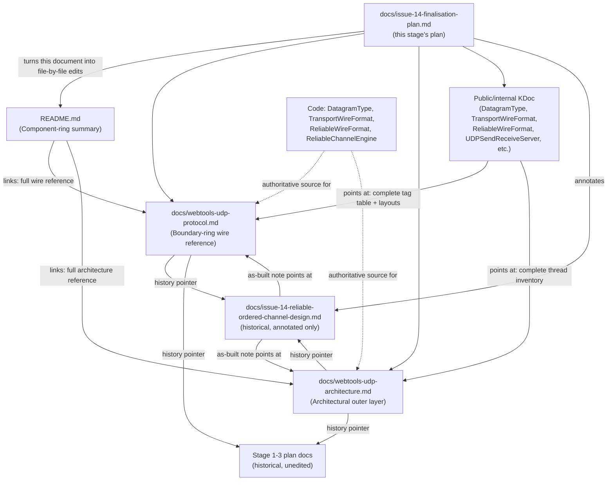

# Issue #14 Stage 4 — finalisation (docs + version) architecture

## Header / Association

- **Covers:** `SpartanLaboratories/WebTools#14` — *"Design discussion: a
  reliable-ordered sub-channel over the UDP transport"* — **Stage 4: docs +
  version finalisation**, the fourth and last of the staged `2.0.0` PR series
  (Stage 1 = PR #30, Stage 2 = PR #32, Stage 3 = PR #35 per
  `docs/issue-14-reliable-channel-api-plan.md` §11).
- **What this document is:** a **systems design record** for the last stage of
  an already-decided body of work — there is no "should we do this" question
  left; D1–D10 were resolved in `docs/issue-14-reliable-ordered-channel-design.md`
  §13 and the Stage 1–3 plans executed them. It is **not**
  `docs/webtools-udp-architecture.md`, one of the two evergreen documents this
  stage creates — this document describes how Stage 4's *documentation and
  version work* is organised; the evergreen doc describes the *transport*.
  There is no file-by-file text here and no prose draft of README or protocol
  content — that is `docs/issue-14-finalisation-plan.md`.
- **Baseline:** research and design were done against `webtools-udp`
  `2.0.0-alpha4` on `feat/2.0-framed-transport`; Stage 4 itself starts from
  `2.0.0-alpha5`, after the prerequisite guard (§9). Research baseline:
  HEAD `4a70ba4`. Working tree clean at time of writing.
- **Branch model:** unchanged from Stage 1–3 precedent
  (`docs/issue-34-probe-cadence-architecture.md` Header): a short-lived branch
  off the long-lived integration branch `feat/2.0-framed-transport`, PR into
  the integration branch, branch deleted after merge. This stage additionally
  defines the **last two links** in that chain: a `docs:` header-backfill PR
  (precedent #31/#33/#36), then the `manager`'s PR
  `feat/2.0-framed-transport` → `master` with `Closes
  SpartanLaboratories/WebTools#14`, a **merge commit** (not squash), and
  deletion of the integration branch. See §9 for the full landing order.
- **Target version:** `webtools-udp` `2.0.0`, from the `2.0.0-alpha5` that
  the prerequisite #40 (the channel-byte guard) leaves (§9).
- **Status:** design complete. The implementation plan
  (`docs/issue-14-finalisation-plan.md`) is written and aligned against this
  document (§14), and was updated after the maintainer resolved every open
  decision on 2026-09-24 (§10, §15). **No open decision remains.** Execution
  is blocked only on the prerequisite **`issue-40-channel-byte-guard`** (§9):
  - it is filed as
    [SpartanLaboratories/WebTools#40](https://github.com/SpartanLaboratories/WebTools/issues/40);
  - it is planned in `docs/issue-40-channel-byte-guard-architecture.md` and
    `docs/issue-40-channel-byte-guard-plan.md`;
  - it must be implemented and merged into `feat/2.0-framed-transport`
    before the Stage-4 branch is cut.

  This document and that plan **ride the first Stage-4 commit** together, per
  the #8–#13 / Stage 1–3 convention of committing a stage's own plan
  alongside its work.
- **Related docs:**
  - `docs/issue-14-reliable-ordered-channel-design.md` — the design this stage
    annotates in place (§6.2/§6.3, §7.8, D10; never rewritten).
  - `docs/issue-14-reliable-ordered-channel-plan.md`,
    `docs/issue-14-reliable-engine-plan.md`,
    `docs/issue-14-reliable-channel-api-plan.md` — Stages 1–3; historical,
    not edited by this stage.
  - `docs/issue-34-probe-cadence-architecture.md` — the house format this
    document follows, and the source of `TransportWireFormat.MIN_PROBE_INTERVAL_MILLIS`
    and the `LinkQualityTracker.snapshot()` sweep-first behaviour this stage's
    protocol/architecture docs must describe as already-shipped fact.
  - **§13 of this document** — the design resolutions R1–R15 referenced
    throughout; **Appendix A** — the verified as-built fact base (every fact
    with a `path:line` citation) that the two evergreen docs are written from.
    Both were produced by the Stage-4 planning research (six research passes,
    spot-checked against the code by the planner) and are reproduced here so
    this record is self-contained.

---

## 1. Requirements

### 1.1 The settled ask

Finalise `webtools-udp` for `2.0.0`:
- README currency (install version, API-stability note, the `0x80` direction
  row, the handshake example, the reliable-channel section, the "created
  lazily" correction, "Migrating to 2.0");
- two new evergreen reference docs (`docs/webtools-udp-protocol.md`,
  `docs/webtools-udp-architecture.md`);
- comment-only KDoc cleanup and Stable-Core tier lines;
- dated as-built annotations on the design doc;
- the version bump `2.0.0-alpha5` → `2.0.0` with its `build.gradle.kts`
  comment-block entry;
- the process to reach a `master` merge (performed later, by the `manager`)
  plus a maintainer-gated Maven publish.

The only production code change in Stage 4 is the one-line naming of the
server's listener thread (B7). The channel-byte guard is a separate
prerequisite fix (B6, §9), not part of this stage.

### 1.2 Binding constraints (maintainer answers to the Stage-4 interview, 2026-09-24 — binding, not revisited here)

- **B1 — stability tier.** The whole `webtools-udp` `2.0` public surface is
  **Stable Core** (full semver; breaking changes only in a major). No
  annotation/marker code (no `@SupportedExtension`, no `@RequiresOptIn`). The
  tier is stated in KDoc on `DeliveryMode`, `UdpChannel`, `ReliableSendFailure`,
  `ReliableWindowFullException`, `ReliableMessageTooLargeException`, plus a
  short README "API stability" note. `DeliveryMode`'s KDoc additionally states
  that new modes may be added in a **minor**, so consumers should keep an
  `else` branch in any `when` over it.
- **B2 — D10 is dropped.** The interim app-level ack/retransmit README note
  (design §3.2/§13) is superseded by the shipped channel; recorded only as a
  dated note on the design doc; **no README content**.
- **B3 — two new evergreen docs**, non-issue-numbered:
  `docs/webtools-udp-protocol.md` (complete, self-contained, **descriptive**
  wire reference — not RFC-2119 normative; tuning values marked informative)
  and `docs/webtools-udp-architecture.md` (components, the full thread
  inventory including the server listener — named `mcups-listener` by B7 —
  and `mcup{c,s}-retransmit`, lifecycles, inbound dispatch flow, and a corrected
  ack/retransmit sequence diagram reflecting what was built). README keeps its
  protocol table as a summary and links to both.
- **B4 — stale-docs cleanup**, named scope only: comment-only KDoc cleanup of
  "Stage 1/2/3" process language in `DatagramType.kt`, `TransportWireFormat.kt`,
  `ReliableWireFormat.kt`, `UDPSendReceiveServer.kt`; dated "as built"
  corrective notes on the design doc's Status line, §6.2/§6.3, and §7.8,
  each pointing at `docs/webtools-udp-protocol.md` / `-architecture.md` as
  authoritative. Annotate in place, never rewrite.
- **B5 — process.** `2.0.0` lands as its own `build:` commit in the Stage-4 PR
  into `feat/2.0-framed-transport`, with a `2.0.0` entry appended to the
  `build.gradle.kts` version-comment block; then a `docs:` header-backfill PR;
  then, later, the `manager`'s PR `feat/2.0-framed-transport` → `master`
  (`Closes SpartanLaboratories/WebTools#14`, merge commit, branch deletion,
  resolution comment). Maven Central publish of `2.0.0` is a separate,
  maintainer-triggered step, not a gate on the Stage-4 PR or the master merge.
  No CHANGELOG file. Stage 1–3 plan docs stay historical and unedited. No
  production code change in Stage 4 — **except B7's listener-thread name**.

### 1.3 Binding constraints (maintainer decisions on this document's open decisions, 2026-09-24)

- **B6 — the four decisions of §10, all resolved:**
  - **OD-1 = (a).** The minor-release growth caveat covers `DeliveryMode`,
    `DatagramType` and `DisconnectReason`, and the README's stability note
    names all three.
  - **OD-2 = (a).** The eight deprecated members stay compiling at
    `WARNING` for all of `2.x` and leave the public surface at `3.0.0`. The
    optional `ERROR` step is out of scope for good.
  - **OD-3 = all of (i), (ii), (iii).**
  - **OD-4 = (a).** The channel-byte guard lands first, under its own issue
    (now #40, unit `issue-40-channel-byte-guard`), with tests, taking the
    version to `2.0.0-alpha5`. Stage 4 then documents "dropped" as the
    contract and moves the version to `2.0.0`.
- **B7 — the unnamed server listener thread** (`MultiConnectionUDPServer.kt:306-310`)
  is named `mcups-listener` **inside Stage 4**, as a zero-risk one-line
  drive-by matching every other thread's naming. This is the single
  exception to B5's "no production code change".
- **B8 — the empty-handshake-name defect and the client origin-screening
  gap** are filed as
  [#38](https://github.com/SpartanLaboratories/WebTools/issues/38) and
  [#39](https://github.com/SpartanLaboratories/WebTools/issues/39). They are
  **not** addressed in Stage 4 and get their own planning passes later.
  Stage 4's protocol doc may only *describe* their current behaviour.

---

## 2. Research findings applied

Only the conclusions that actually shaped this document's structure (full
detail: Appendix A for facts, §13 for resolutions):

1. **The design doc's §7.8 diagram and its client/server engine-creation
   description are wrong as a picture of what shipped**, and the Stage-3 plan's
   diagram, while closer, is still generic and omits the client/server
   asymmetry (Appendix A.2 "Diagram check", A.3 "Design doc"). This is why
   `docs/webtools-udp-architecture.md` is scoped to draw the **as-built**
   sequence from scratch (Appendix A.2, numbered steps 1–8) rather than
   promoting §7.8, and why the design doc gets an annotation pointing away
   from itself rather than a redraw in place (B4/R9).
2. **Tuning values and contract values are different kinds of fact and must
   be visibly marked apart** (Stage-3 OD-5, R11): window 256, RTO
   floor/cap, retransmit tick and cap are internal tuning a maintainer may
   change without a major; the tag values, wire layouts, byte order, the
   version token, the 250 ms probe floor, and the 1024/8192 message cap are
   the actual contract. This drove the protocol doc's structure (§4 below) and
   is the reason it is "descriptive," not RFC-2119 normative — the doc must be
   able to say "this is what the code does" for the tuning numbers without
   promising they stay put.
3. **KDoc cross-references in this repo are backticked repo-relative paths**,
   already the idiom at `MultiConnectionUDPServer.kt`'s citations of
   `docs/issue-12-...` (R5). This fixes how every new
   code-to-evergreen-doc pointer is written (§4), rather than inventing a
   markdown-link or `@see`-URL convention for this stage alone.
4. **Prior art for the protocol reference's shape** — conventions first, a
   packet catalogue, one section per datagram type (layout + semantics +
   behaviour), then state/versioning and an explicit reserved-range section —
   is convergent across netcode.io's
   [`STANDARD.md`](https://github.com/networkprotocol/netcode/blob/master/STANDARD.md),
   Valve's
   [`SNP_WIRE_FORMAT.md`](https://github.com/ValveSoftware/GameNetworkingSockets/blob/master/src/steamnetworkingsockets/clientlib/SNP_WIRE_FORMAT.md)
   (whose "reserved lead bytes" and "what an older decoder does" sections are
   the closest analogue to this protocol's tag byte), QUIC
   [RFC 9000](https://www.rfc-editor.org/rfc/rfc9000.html) §1.3/§12/§17, and
   Aeron's
   [transport protocol specification](https://github.com/aeron-io/aeron/wiki/Transport-Protocol-Specification).
   Because every field here is byte-aligned, byte layouts are markdown offset
   tables, not ASCII bit diagrams (R10).
5. **Stability wording** follows the
   [kotlinx.coroutines compatibility guide](https://github.com/Kotlin/kotlinx.coroutines/blob/master/docs/topics/compatibility.md)
   convention that *Stable* is the unmarked default tier, and the Kotlin 1.7
   rule that a non-exhaustive `when` over an enum is a compile error
   ([compatibility guide 1.7](https://kotlinlang.org/docs/compatibility-guide-17.html))
   — which is why the `DeliveryMode` growth caveat is phrased as "keep an
   `else` branch" and makes no claim about runtime behaviour of
   already-compiled code (R12).

---

## 3. The systems — documentation artefacts as systems

Per the brief, the documentation and process artefacts *are* the systems for
this stage. Each below: audience (Audience-Reach ring), what it owns, what it
must not duplicate, and its update rule going forward.

### 3.1 README.md

- **Audience:** every consumer's first read — the **Component ring** boundary
  as experienced from outside the module (a summary, not the full contract).
- **Owns:** the three-artifact overview; the install snippet (now `2.0.0`, no
  pre-release wording); a component table (types + one-line purpose, no full
  signatures); a protocol *summary* table (direction/message/destination,
  kept — not removed, per B3/R4); worked examples for every opt-in feature,
  including the reliable channel; the "API stability" note (module-scoped,
  R3); "Migrating to 2.0."
- **Does NOT own / must not duplicate:** the full wire byte layout (owned by
  the protocol doc); the complete thread inventory and lifecycle detail (owned
  by the architecture doc); per-member KDoc contracts (owned by the code).
  The README **keeps** its consumer-facing behavioural prose (NAT addressing,
  `admit`, supersede, `terminate`, the keepalive obligation, per-feature
  thread mentions) — there is no wholesale move of prose out of it (R4).
  Where a README statement is **wrong** (the `0x80` direction row, the
  "created lazily on the first `channel(...)` call" line) it is corrected in
  place, and each section that summarises the wire or the threading model
  gains a link to the owning evergreen doc for the complete picture.
- **Update rule:** the existing README-currency rule (`README.md:12` and
  practice throughout this repo) — a README-visible fact changes in the same
  commit as whatever changed it. This stage is the one place that rule
  applies to *documentation-only* facts (a version number, a stale statement)
  rather than to new code.

### 3.2 `docs/webtools-udp-protocol.md` (new)

- **Audience:** **Boundary ring** — anyone building or debugging a
  second implementation, a test harness, or a packet-level tool against this
  wire protocol. The authoritative wire contract for protocol version 2.
- **Owns:** every byte-level fact: the datagram-type tag table (mirrors, does
  not replace, `DatagramType`'s own KDoc — see §4), the handshake grammar
  including its as-built quirk (empty name via consecutive spaces), the
  handling of reserved/unframed/malformed input (including the server/client
  log-level asymmetry for reserved tags), every per-tag layout
  with offset tables, the ack/ackBits meaning, the retransmit and RTO
  contract split into contract-vs-informative, the origin-screening
  asymmetry, receive limits. Self-contained: a reader should not need the
  design doc or the source to understand the wire.
- **Does NOT own:** thread names, lock order, lifecycles, or dispatch-executor
  behaviour (architecture doc); the enum tag *values themselves* as compiled
  Kotlin (owned by `DatagramType`/`ReliableWireFormat` in code — this doc
  restates them for a reader without the source, and code is authoritative on
  conflict, §4).
- **Update rule: evergreen, not issue-numbered.** Any future wire-affecting
  change edits this file directly — a new `DeliveryMode`, a new reserved-tag
  allocation, or the fixes for #38 and #39, whose current behaviour it
  describes. It is not re-created per issue, unlike the `issue-N-*` plan
  docs.

### 3.3 `docs/webtools-udp-architecture.md` (new)

- **Audience:** **Architectural outer layer** — a maintainer reasoning about
  concurrency, a new contributor onboarding into the module's thread model,
  an AI agent or reviewer checking a proposed change against the existing
  topology.
- **Owns:** the component inventory (server, client, `HandshakeCoordinator`,
  `ReliableChannelEngine`, `PeriodicScheduler`, etc.), the **full** thread
  table (11 threads, all named once B7 names the server listener
  `mcups-listener` — at most 6 server-side, 5 client-side; Appendix A.2),
  lock order and contention,
  lifecycle sequencing (`stop()` ordering
  on both sides), the inbound dispatch flow, and the as-built ack/retransmit
  sequence diagram (Mermaid `sequenceDiagram`, replacing design §7.8 as the
  canonical picture).
- **Does NOT own:** wire byte layout (protocol doc); consumer-facing "how do
  I use this" examples (README).
- **Update rule:** evergreen; edited directly whenever a thread, lock, or
  lifecycle changes — this is the doc a future `MultiConnectionUDPServer`
  concurrency change must update, not the design doc.

### 3.4 Public/internal KDoc (Component ring)

- **Audience:** an IDE-bound consumer or contributor reading a type/member
  in-editor.
- **Owns:** the per-member contract (`@param`/`@return`/`@throws` where used,
  though this repo's existing style favours prose KDoc over tag-heavy blocks
  — see `TransportWireFormat.kt` as read); the Stable Core tier statement on
  the five B1-named types; the `DeliveryMode` minor-growth caveat; a
  cross-reference to the evergreen docs for anything that needs the full
  wire or architecture picture (using the repo's existing backticked-path
  convention, R5) rather than restating it.
- **Does NOT own:** the complete wire reference or the complete thread
  picture — a KDoc block should point at, not duplicate, `docs/webtools-udp-protocol.md`
  / `-architecture.md` once those exist. This is why B4's cleanup replaces
  `TransportWireFormat`'s stale reserved-tag row and the `ReliableWireFormat`
  pointer with one sentence plus a link (R6), rather than fixing the row's
  content in place.
- **Update rule:** any KDoc block making a factual claim about the wire or
  the thread model becomes stale the moment those change elsewhere; the
  evergreen docs are updated first, and any KDoc that would then be
  redundant is trimmed to a pointer, not left duplicating the (now corrected)
  fact.

### 3.5 The design and stage-plan records (historical)

- **Audience:** a reader reconstructing *why* the shipped shape is what it
  is — decision history, not current fact.
- **Owns:** the original options, the recommendation, the resolved decisions
  D1–D10, and (after this stage) dated "as-built" annotations at the specific
  points B4/R9 name.
- **Does NOT own:** current behaviour. Every corrected fact states "as-built,
  see `docs/webtools-udp-protocol.md`" rather than being rewritten to match
  the code — the document remains a record of what was decided, not a
  second copy of what exists.
- **Update rule:** annotated in place only, per the Stage-3 §4.20 rule this
  stage extends (B4). Stage 1–3 plan docs (`docs/issue-14-reliable-ordered-channel-plan.md`,
  `-reliable-engine-plan.md`, `-reliable-channel-api-plan.md`) get **no** edit
  at all in this stage — they are execution records of stages already merged,
  and B5 says so explicitly.

### 3.6 Build metadata (`webtools-udp/build.gradle.kts`)

- **Audience:** anyone reading the release history of this coordinate — the
  substitute for a CHANGELOG (B5: none is added).
- **Owns:** the `version = "..."` line and the append-only comment ladder
  above it, one entry per shipped version, each stating what changed and why.
- **Does NOT own:** anything not tied to a version bump; it is not a design
  rationale document (that's the design/plan docs) and not a reference (the
  evergreen docs).
- **Update rule:** every version bump appends one comment-block entry
  immediately before changing `version = `; existing entries are never
  edited (matches the `alpha1`...`alpha4` precedent already in the file).

### 3.7 The release / version-control flow

- **Audience:** the maintainer and the `manager` agent executing the merge.
- **Owns:** the sequence of PRs (the prerequisite channel-byte guard PR →
  Stage-4 PR → header-backfill PR → master merge → gated publish) and which
  commit in that sequence carries which artefact.
- **Does NOT own:** the artefacts' content — this is process, not prose.
- **Update rule:** fixed by this document (§9) and by
  `docs/issue-14-finalisation-plan.md`'s commit-by-commit detail; not a
  living document once executed.

---

## 4. Authority and single-source-of-truth rules

**Precedence order, most authoritative first:**

1. **Code** — the compiled `DatagramType`, `TransportWireFormat`,
   `ReliableWireFormat`, and the running engine's behaviour. Always wins a
   conflict.
2. **The two evergreen references** (`docs/webtools-udp-protocol.md`,
   `docs/webtools-udp-architecture.md`) — the human-readable restatement of
   the code's contract, kept current by the update rules in §3.
3. **README.md** — a summary of (2), never a second source of the same
   fact in more detail than a summary needs.
4. **KDoc** — restates the contract for the specific symbol it documents,
   points at (2) for anything wider.

The design doc (`docs/issue-14-reliable-ordered-channel-design.md`) sits
**outside this ladder** — it is historical, annotated only, and a reader is
explicitly redirected off it toward (2) wherever B4 requires (§3.5).

**Per-fact ownership (the specific cases the brief calls out):**

| Fact | Owner | Everyone else |
|---|---|---|
| Tag → value allocation (`DatagramType` value space) | `DatagramType.kt`'s own KDoc (in-code source of truth, kept as the value-space table per R6) **and** `docs/webtools-udp-protocol.md` (the same table, restated for a reader without the source) | `TransportWireFormat.kt` drops its own copy of the reserved-tag row in favour of one sentence pointing at `[DatagramType]` and the protocol doc (R6); the README table lists only the **live** tags it needs for its worked examples, and links to the protocol doc for the full space |
| Reliable header byte layout | `ReliableWireFormat` (internal, keeps its layout block for maintainers) **and** the protocol doc (public-facing) | README states only that a reliable frame is acked/retransmitted, not its byte layout |
| Thread names and count | `docs/webtools-udp-architecture.md` | Class KDoc on `MultiConnectionUDPServer`/`MultiConnectionUDPClient` may name a thread inline where relevant to a specific method's behaviour, but the *complete* table lives only in the architecture doc |
| Tuning values (window, RTO floor/cap, tick, retransmit cap) | `docs/webtools-udp-protocol.md`'s "Tuning values (informative, not contract)" table (R11) | Nowhere else states these as a promise; internal KDoc may reference them as implementation detail |
| Contract values (tags, layouts, byte order, version token, 250 ms probe floor, 1024/8192 message cap) | Code (`const val`s) is authoritative; the protocol doc/README/KDoc all restate the same figure, never a derived or rounded one | — |
| Stability tier | KDoc on each of the five B1-named types (Stable Core statement), the minor-release growth caveat on `DeliveryMode`, `DatagramType` and `DisconnectReason` (B6/OD-1), **and** the README "API stability" note, which states the tier and names the three growable enums in one place | The protocol/architecture docs do not restate tier — that is a Component-ring/README concern, not a wire or topology fact. The protocol doc's version rules (a `2.x` minor may allocate a reserved tag) are the wire-side counterpart of the `DatagramType` caveat |
| Channel-byte handling | The code of the prerequisite guard (§9), described by the protocol doc's "Channel byte" section as contract | The guard owns the `DEFAULT_*_CHANNEL` KDoc it changes; Stage 4 only fills that KDoc if the guard did not (§13 R15) |

**Cross-references (R5):** every code-to-evergreen-doc pointer is a
backticked repo-relative path, e.g. `` `docs/webtools-udp-protocol.md` ``,
matching `MultiConnectionUDPServer.kt`'s existing citation style. Not a
markdown link, not an `@see` URL, and no `@since` tag (unused in this repo;
no Dokka configured; the `build.gradle.kts` comment ladder is the version
record).

---

## 5. Relationships — the documentation link graph

Per R13: every node and edge label that contains `:`, `/`, `-` or
parentheses is double-quoted; line breaks inside a node label use ` `
(GitHub's renderer does not interpret `\n`); no label contains a bare `end`
or a `;`. This diagram must still be re-validated in the PR's GitHub preview
before merge (verification item, §7).

---

## 6. Scope boundary

**In scope (this stage):**
- README.md currency edits named in §1.1/§1.2.
- The two new evergreen docs, created in full.
- Comment-only KDoc edits:
  - the B4-named cleanup in the four files;
  - the B1 Stable Core tier lines on the five types;
  - the growth caveat on `DeliveryMode`, `DatagramType` and `DisconnectReason`
    (OD-1);
  - the extra stale-KDoc fixes and class-KDoc pointers (OD-3 (i), (ii)).
- Dated as-built annotations on the design doc at the B4-named points and the
  six further divergences (OD-3 (iii)).
- The `2.0.0` version bump (from `2.0.0-alpha5`) and its `build.gradle.kts`
  comment entry.
- **The one production change: naming the server listener thread
  `mcups-listener` (B7), with its integration and e2e test updates.**

**Out of scope:**
- **The channel-byte guard (#40).** It is a prerequisite with its own issue,
  plan and PR (§9). Stage 4 depends on it and documents it, but does not
  implement it. #40's own documents ride #40's commits, not Stage 4's.
- Any other production code change — no behaviour change in `src/main`
  beyond B7's thread name.
- Tests beyond B7's two (Appendix A.3 "Tests": nothing reads README, the
  Gradle version, or KDoc text).
- **#38 and #39** (B8): no code change for either. The protocol doc only
  describes their current behaviour and links the issues.
- A CHANGELOG file — the `build.gradle.kts` comment ladder remains the only
  release-history record (B5).
- Stage 1–3 plan docs — historical, unedited.
- The `@Disabled` UAT test file's `2.0.0-alpha1`/`alpha3+` scenario labels —
  historical scenario names in a test file, not documentation.
- The inner-core `//` pointers to "(Stage 2 contract)" / "(§3.12 of the
  Stage-3 plan)" (`HandshakeCoordinator.kt:190`,
  `MultiConnectionUDPClient.kt:538`, `:554`) — left as maintainer history
  pointers (pointing a maintainer at the design record is what an inner-core
  comment is for), per the maintainer's OD-3 answer.
- Filing any issue — this pipeline files none. (#38, #39 and #40 were filed
  outside it.)
- The `master` merge itself and the Maven Central publish — both are later,
  separately gated steps this document's decomposition (§9) accounts for but
  does not perform.

---

## 7. Verification approach (systems level)

- **Public-API invariance.** No edit in this stage may change a signature,
  including B7's rename, which only sets a thread name inside the
  constructor. So the built classes must have identical `javap -p` signature
  dumps before the first Stage-4 commit and after the last, compared for the
  whole module, not spot-checked per file. Any non-empty diff blocks the
  commit.
- **Comment-only proof for the KDoc commit.** `javap -p` cannot see method
  bodies, so the KDoc commit's `src/main` diff is also checked line by line:
  every added or removed line must be a comment line. B7's commit is checked
  the same way and must contain exactly the one `name = "mcups-listener"`
  code line.
- **Full test suite green** at all five levels (`./gradlew build`, `uatTest`
  `@Disabled` as already established), including B7's two new assertions: a
  Level-3 test that the listener is a daemon named `mcups-listener`, and a
  Level-4b assertion that no `mcups-listener` survives `stop()`. The suite
  also catches an accidental production edit the other two checks might
  miss.
- **README/doc link and anchor resolution.** Every new cross-reference
  (README → protocol doc, README → architecture doc, KDoc → both, design doc
  → both) resolves to an existing file and, where it names a heading anchor,
  an existing heading. Checked by hand or a link-checker; no broken relative
  path ships.
- **Mermaid rendering in the GitHub PR preview.** Every committed diagram —
  the new architecture doc's flowchart and sequence diagram, this document's
  link graph (§5), and the plan's commit flow — is rendered and visually
  checked in the PR's file view before merge, per R13. GitHub's Mermaid
  renderer has failure modes (bare `end`, unescaped punctuation in labels,
  semicolons in `sequenceDiagram` text) that do not show up as a build
  failure.
- **The docs match the merged guard.** Before writing the protocol doc's
  "Channel byte" section and the architecture doc's channel-byte branches,
  the executor reads the merged guard's code and tests. If they differ from
  §9's contract, the executor stops and reports; the docs follow the code,
  never the plan.
- **README snippets compile against `2.0.0` without deprecation warnings.**
  The "Client-side usage", "Handshake screening & credentials" and
  "Reliable-ordered channel" examples use only the non-deprecated
  channel-form API (`channel(mode).send`/`actuate`),
  so a consumer copying them from a `2.0.0` README sees no `WARNING`-level
  deprecation on first use. The one deliberately-deprecated line kept for
  migration reference (per Stage-3 precedent, `README.md:355-356`) is excluded
  from this check by design — it is commented out, not live code.
- **A Level-5 documentation walkthrough.** A human (or an AI agent standing
  in) starts from the README as a first-time consumer, follows every link
  the README, the two evergreen docs, and the KDoc make to each other, and
  confirms the resulting picture is internally consistent and matches what
  the code does — the UAT-equivalent for documentation, since there is no
  running system to exercise.

---

## 8. Extension & stability

No new public surface is introduced in this stage. B7's rename changes a
thread name, not an API, so there is no new seam to tier. What this stage
*records* in KDoc is the tier decision B1 already made for surface that
shipped in Stages 1–3:

- `DeliveryMode` (`DeliveryMode.kt:8`) — **Stable Core**, with the additional
  minor-growth caveat (consumers keep an `else` branch). An `enum class`, so
  the set is closed per release; the caveat documents that a later minor may
  enlarge it. Per OD-1 = (a), `DatagramType` and `DisconnectReason` carry the
  same caveat, since a new mode needs a new tag in the same minor.
- `UdpChannel` (`UdpChannel.kt:13`) — **Stable Core**. Infrastructure
  interface (a delivery-mode-scoped view), already following the
  interface-plus-supplied-implementation shape: `UnreliableConnectionChannel`
  and `UnsupportedUdpChannel` (`UdpChannel.kt:72`, `:87`),
  `ReliableConnectionChannel` (`UDPConnection.kt:153`), and the client's two
  lazily-created handles (`MultiConnectionUDPClient.kt:399-419`).
- `ReliableSendFailure` (`ReliableSendFailure.kt:12`, `abstract class`) and
  its two subtypes `ReliableWindowFullException` / `ReliableMessageTooLargeException`
  — **Stable Core**. An intentionally open exception hierarchy (Stage-3 OD-2,
  `docs/issue-14-reliable-channel-api-plan.md` §10), matching this repo's
  "reach for sealed only where the closed set is part of the contract" rule —
  here the set is explicitly *not* closed, so a future reliable-send failure
  can join without an exhaustive-`when` break.
- `DatagramType`, `TransportWireFormat`, `IncompatibleProtocolException`,
  `HandshakeWireFormat.registeredMessage`/`registeredProtocolVersion`,
  `Connection.channel`, `MultiConnectionUDPClient.channel`, `startReliable`,
  `pushToAllReliable`, `reliableMaxMessageBytes` — also confirmed **Stable
  Core** (B1). They do not get a *new* KDoc tier line: B1 names only the
  five types above for the explicit statement, and the README "API
  stability" note covers the whole module. `DatagramType` and
  `DisconnectReason` do get the growth caveat (OD-1 = (a)).

No `@SupportedExtension` or `@RequiresOptIn` markers exist or are added
anywhere in this module, per B1 — the whole `2.0` surface is one tier.

---

## 9. Decomposition

Two units. **This document plans only `issue-14-finalisation`**, feeding
`docs/issue-14-finalisation-plan.md`. The other, **`issue-40-channel-byte-guard`**,
is a production fix the maintainer placed under its own issue (OD-4 = (a),
B6). It is filed as
[SpartanLaboratories/WebTools#40](https://github.com/SpartanLaboratories/WebTools/issues/40)
and was planned by its own pass in
`docs/issue-40-channel-byte-guard-architecture.md` and
`docs/issue-40-channel-byte-guard-plan.md`. It must merge before Stage 4
starts. No architecture halt was needed for the second unit: the maintainer
had already decided its scope and its separation.

Argument for not splitting `issue-14-finalisation` further: it touches a
small, fully enumerated set of files and carries almost no test risk (§7),
since everything but B7's one line is comment or doc. Splitting by artefact
(e.g. a "protocol doc" unit and a "README" unit) would manufacture seams
between documents that this stage's whole point is to keep in sync. They
are drafted and reviewed together because the README must link to the
protocol and architecture docs it is written against. B7's rename is too
small to be a unit of its own and was folded in by the maintainer; it gets
its own `fix:` + `test:` commits so the KDoc commit stays verifiably
comment-only (R14).

| Slug | Scope | Depends on | Landing order |
|---|---|---|---|
| `issue-40-channel-byte-guard` *(prerequisite; #40, planned separately in `docs/issue-40-channel-byte-guard-*.md` — not planned here)* | Receivers drop a non-zero-channel `0x90`/`0xA0`/`0xA1` frame with a WARN. The check comes after the branch's origin screening where it has one (the client's `0x90` branch has none, #39) and before any delivery, ack processing or engine creation, on both server and client. Tests at every applicable level. It owns the `DEFAULT_*_CHANNEL` KDoc it changes. Its own `build:` bump `2.0.0-alpha4` → `2.0.0-alpha5`. The exact contract is plan §9 / R15, and #40's plan adopts it. | — (filed and planned) | First, as its own PR (`fix/issue-40-channel-byte-guard`, `Refs #40`) into `feat/2.0-framed-transport` |
| `issue-14-finalisation` | README currency; the two new evergreen docs; B4 KDoc cleanup, B1 tier lines, the three growth caveats and the OD-3 extras; design-doc as-built annotations; B7's listener-thread name and its tests; the `2.0.0` bump + comment-block entry; this document and the plan. **Five commits in one PR** (R14): `fix:` (B7 rename + both planning docs), `test:` (B7's tests), `docs:` (references + README + design notes + version-comment entry), `docs:` (comment-only KDoc), `build:` (version line). | `issue-40-channel-byte-guard` merged (its behaviour is what the protocol doc states as contract; its `alpha5` is the starting version) | The Stage-4 PR, into `feat/2.0-framed-transport` |
| *(process, not a plannable unit)* header-backfill PR | Backfill `Commit:`/`PR:`/`Status:` in `docs/issue-14-finalisation-plan.md`'s header (and this document's `Status:` line), per the #31/#33/#36 precedent. | `issue-14-finalisation` merged | Immediately after the Stage-4 PR merges |
| *(process, not a plannable unit)* `manager`'s master merge | `feat/2.0-framed-transport` → `master`, merge commit, `Closes SpartanLaboratories/WebTools#14`, delete integration + stage branches, post resolution comment. | header-backfill PR merged | After header-backfill |
| *(process, not a plannable unit)* gated Maven publish | Maintainer-triggered publish of `2.0.0` to Maven Central. | master merge complete (recommended: Level-5 UAT run first, not a hard gate) | Whenever the maintainer chooses; not gated on this stage's PRs |

---

## 10. Decisions (raised by the Stage-4 research; resolved by the maintainer 2026-09-24)

All four are **resolved** — see B6 (§1.3) for the answers: OD-1 = (a),
OD-2 = (a), OD-3 = all three, OD-4 = (a). The questions are kept below as
the record of what was decided and why. The recommendation shown for each is
the option the maintainer chose.

- **OD-1 — enum growth vs Stable Core.** B1 gives the minor-release growth
  caveat to `DeliveryMode` only. But any new `DeliveryMode` (e.g. the
  roadmap's unreliable-sequenced mode, design §14 #4) needs a new wire tag in
  the reserved `0x91`–`0x9F` range, i.e. a new `DatagramType` entry in the
  same minor — and `DatagramType` was confirmed Stable Core without the
  caveat. `DisconnectReason` (a pre-2.0 enum) would likewise grow with the
  reserved "graceful close" control tag.
  - (a) Extend the same KDoc caveat to `DatagramType` (and `DisconnectReason`);
    the README stability note names all of them. *Recommended.* Without it,
    the `DeliveryMode` caveat cannot actually be used.
  - (b) Caveat only `DeliveryMode`, as answered. A mode needing a new tag
    then waits for `3.0.0`.
  - (c) Extend to `DatagramType` only.
  - **Gates:** the exact wording of the KDoc tier lines on `DatagramType` (and
    possibly `DisconnectReason`), and the README "API stability" note's list
    of named types. Does not gate anything else in this stage.
- **OD-2 — the deprecation ladder vs Stable Core.** The Stage-3 plan (§3.11,
  OD-4) kept an optional step: raise the eight deprecated members to
  `DeprecationLevel.ERROR` "in a later `2.x`" if adoption stalls. Under Stable
  Core ("breaking changes only in a major"), `ERROR` is source-breaking.
  - (a) The stability note says the eight stay fully functional at `WARNING`
    for all of `2.x` and leave the public surface only at `3.0.0`.
    *Recommended.* This closes the optional `ERROR` step.
  - (b) The stability note names an explicit exception: deprecated members
    may be escalated to `ERROR` in a `2.x` minor (binary-compatible,
    source-breaking), per the kotlinx.coroutines deprecation-cycle
    convention.
  - **Gates:** one sentence in the README "API stability" note and in
    "Migrating to 2.0" describing the deprecation ladder's ceiling. Does not
    gate the two evergreen docs or the KDoc cleanup.
- **OD-3 — stale docs found beyond B4's named scope.** Comment/doc-only, zero
  behaviour risk:
  - (i) the stale pre-2.0 token vocabulary (`KA`, `PING <seq>`), the wrong
    "both ends on `1.6.0`+" probe requirement, the false `reliableEngine()`
    KDoc, and the same false engine-creation claim in the **public** class
    KDoc of `MultiConnectionUDPClient` (`:126-128`) and
    `MultiConnectionUDPServer` (`:143-146`) — added in the alignment pass,
    §14 — in `Connection.kt`, `UDPConnection.kt`, `DisconnectReason.kt`,
    `ClientChannel.kt`, `Registrations.kt`, `LinkQualityTracker.kt`,
    `MultiConnectionUDPClient.kt` and `MultiConnectionUDPServer.kt`;
  - (ii) a one-line pointer to the two new docs in the `MultiConnectionUDPServer`
    / `MultiConnectionUDPClient` class KDoc;
  - (iii) the additional design-doc divergences listed in Appendix A.3
    ("Additional as-built divergences") — §6.3's ack-timer language, §7.3's
    RTO formula and "configurable floor", §7.4/§7.5's "configurable" window
    language, §11's stale-slot mitigation, §12's "squash-or-merge" language,
    §14's "Immediate" wording.
  - Options: all three *(recommended)* / a subset / none. The inner-core `//`
    pointers ("(Stage 2 contract)", "(§3.12 of the Stage-3 plan)") are left
    regardless of this answer (§6, out of scope).
  - **Gates:** whether §6's scope boundary includes (i)/(ii)/(iii), i.e. how
    many *additional* files beyond the four B4-named ones get a KDoc touch,
    and how long the design doc's as-built status block gets (R9: "if OD-3 =
    yes, the status block also lists the additional divergences").
- **OD-4 — channel byte handling (forward-compatibility hazard, release
  timing).** `2.0.0` receivers ignore the channel byte on
  `0x90`/`0xA0`/`0xA1`. A later `2.x` peer using a non-zero reliable channel
  (roadmap: multiple reliable channels, design §14 #3) would have its
  channel-N traffic fed into a `2.0.0` peer's channel-0 reorder buffer —
  delivering wrong messages and dropping the real ones as duplicates.
  - (a) Before the `2.0.0` cut: a separate fix under its own issue —
    receivers drop non-zero-channel frames with a WARN, plus tests, on the
    integration branch. The protocol doc then documents "dropped."
    *Recommended* — this is the last chance before the wire contract is
    frozen as Stable Core.
  - (b) Ship as-is; the protocol doc documents "ignored; always `0x00`; a
    future multi-channel feature must not send a non-zero channel to a peer
    that has not signalled support."
  - Either way the KDoc's "emits or accepts" is corrected (in scope now,
    regardless of which answer).
  - **Gates:** (i) whether a channel-byte guard unit (now
    `issue-40-channel-byte-guard`) exists as a pre-Stage-4 unit (§9); (ii) the
    starting alpha number for Stage 4's
    version bump (`alpha5` if (a), `alpha4` if (b)); (iii) the exact wording
    of the protocol doc's channel-byte section.
  - **Resolved (a):** the guard exists (§9), Stage 4 starts from `alpha5`,
    and the protocol doc says "dropped".

---

## 11. Defects surfaced during planning — status after the maintainer's decisions

1. **Receivers ignore the channel byte** → **filed as
   [#40](https://github.com/SpartanLaboratories/WebTools/issues/40)**. It is
   the prerequisite `issue-40-channel-byte-guard` (§9, OD-4 = (a)), planned
   in `docs/issue-40-channel-byte-guard-plan.md`.
2. **The handshake parser accepts an empty name** when the `Iam` line
   contains consecutive spaces (`HandshakeProtocol.parseHandshake` +
   `split(' ')`) → **filed as
   [#38](https://github.com/SpartanLaboratories/WebTools/issues/38)**. Not
   in Stage 4 (B8); the protocol doc describes it and links the issue.
3. **The server's common listener thread is unnamed**
   (`MultiConnectionUDPServer.kt:306-310`) → **fixed in Stage 4** (B7): it
   is named `mcups-listener`.
4. **The client's keepalive, probe and `0x90` branches accept datagrams from
   any source**; only the reliable branch checks `serverEndpoint` → **filed
   as [#39](https://github.com/SpartanLaboratories/WebTools/issues/39)**. Not
   in Stage 4 (B8); the protocol doc describes it and links the issue.

---

## 12. Risks at the systems level

- **Doc/code drift.** The single biggest risk this stage exists to close for
  `2.0.0`'s launch, and the one it can reopen if the ownership rules in §4
  are not followed by later changes. Mitigation: one owner per fact (§4's
  table), and every new cross-reference pointing at the owning doc rather
  than restating its content (§3, §5).
- **A Mermaid render failure** in the new architecture doc's sequence
  diagram or this document's link-graph diagram, per GitHub's known Mermaid
  quirks (bare `end`, unescaped punctuation, semicolons in
  `sequenceDiagram` text) — mitigated by R13's rules and the required PR
  preview check (§7).
- **A README install line naming an unpublished version.** `2.0.0` is not on
  Maven Central at the time this stage lands (the Maven-gated publish is a
  later, separate step, §9). Precedent: `1.2.0`–`1.6.0` were also never
  individually published as standalone Maven Central releases before being
  superseded by later versions on the same coordinate, and this was
  previously accepted (`docs/issue-34-probe-cadence-architecture.md` §1.3.1).
  Acceptable here for the same reason; the README's job is to state the
  version a consumer building from `master` (post-merge) gets, not to assert
  it is already on Maven Central.
- **The prerequisite #40.** #40 is filed and planned; Stage 4 cannot start
  until it is implemented and merged. Its behaviour is what the protocol doc
  will state as contract. If the merged code differs from R15's contract
  (order of checks, WARN level, no engine creation), the docs must follow
  the code; the executor stops and reports rather than writing the plan's
  text. #40 also edits some of the same files as Stage 4, which moves line
  anchors. Its D10(c) leaves every block Stage 4 quotes untouched, and its
  D10(a) writes Stage 4's own `DEFAULT_*_CHANNEL` text. The plan quotes the
  current text for every edit, so edits are re-anchored by content, not by
  line number.
- **A comment-only change accidentally touching code.** Every file this
  stage edits also contains real production logic (`DatagramType.kt`,
  `TransportWireFormat.kt`, `ReliableWireFormat.kt`, `UDPSendReceiveServer.kt`,
  and the rest), so an edit slipping outside a comment/KDoc block is a real
  hazard, not a hypothetical one. Mitigated by the `javap -p` signature diff
  across the PR, the comment-lines-only check on the KDoc commit, the
  one-line check on B7's commit (§7), and the full test suite.
- **B7's rename.**
  - Thread-name assertions all use exact names (verified at `4a70ba4` —
    none matches by prefix), so the rename cannot break an existing test.
  - `stop()` joins the listener for at most 1 s before it closes the socket,
    so a `mcups-listener` can outlive `stop()` briefly. The new absence
    assertion polls rather than checking once.
- **Cross-repo impact:** not raised here, per standing instruction —
  downstream projects handle their own adoption of `2.0.0`.

---

## 13. Design resolutions (R1–R15)

The Stage-4 planner's resolutions of points the binding constraints left
open, and of disagreements between research passes. Each is settled; the
plan implements them as written.

- **R1 — engine creation.** The client's `ReliableChannelEngine` is created
  on the first reliable **send** or the first inbound `0xA0`/`0xA1` from
  `serverEndpoint` — **not** on `channel(RELIABLE_ORDERED).actuate*`
  (`MultiConnectionUDPClient.kt:410-419`, `:463-473`). The server creates it
  on the first send, the first `bindReliable` (`actuate*` / `startReliable`),
  or the first inbound reliable datagram from a registered origin
  (`HandshakeCoordinator.kt:302-312`, `:440-465`). **After #40**, the inbound
  trigger on both sides is a **channel-`0x00`** `0xA0`/`0xA1` only. A
  non-zero-channel frame is dropped before `reliableEngineFor` /
  `reliableEngine()` is reached (#40 D4/D6), so every engine-creation
  statement Stage 4 ships says "channel `0x00`" (plan §3.1, §3.2, §4a, §4d).
- **R2 — client malformed `0x81`.** WARN-logged and dropped
  (`MultiConnectionUDPClient.kt:528`), the same as the server
  (`HandshakeCoordinator.kt:162-163`).
- **R3 — README "API stability" placement.** Directly under the
  `### webtools-udp` component table: the README covers three artifacts and
  the tier decision is `webtools-udp`'s alone.
- **R4 — README protocol section.** Keep the table and its consumer-facing
  behavioural prose; add a lead-in pointing at both new docs; correct the
  `0x80` row. No wholesale move of prose out of the README (B3: the README
  *keeps* its protocol table as a summary).
- **R5 — cross-reference form.** KDoc points at a doc with a backticked
  repo-relative path (e.g. `` `docs/webtools-udp-protocol.md` ``) — this
  repo's existing convention. No markdown links or `@see` URLs in KDoc; no
  `@since` (never used here, no Dokka configured, and the `build.gradle.kts`
  ladder is the version record). Markdown documents link each other with
  relative markdown links.
- **R6 — tag-table ownership in code.** `DatagramType` keeps its value-space
  table as the in-code source of truth (the "Introduced" column is dropped;
  the "Stage-1 peer" paragraph becomes the 2.x reserved-tag rule: the server
  drops at WARN, the client at DEBUG, neither dispatches).
  `TransportWireFormat` keeps rows only for the datagrams it encodes (`0x80`,
  `0x81`, `0x82`, `0x90`) and replaces its stale reserved row and its pointer
  at the internal `ReliableWireFormat` with one sentence: every other tag is
  listed in `[DatagramType]` and the complete wire reference is
  `docs/webtools-udp-protocol.md`. `ReliableWireFormat` (internal) keeps its
  layout block for maintainers, drops the stage narration, points to the
  protocol doc instead of "design doc §6.2", and corrects "emits or
  accepts".
- **R7 — the evergreen docs' header.** Both are references, not process
  records. A light header: what the document covers; "applies to
  `webtools-udp` `2.x` — wire protocol version `2`"; an authority statement
  (code wins on conflict; this document is kept current with it); history
  pointers to the Issue #14 design and plan documents. No
  Covers/Branch/Commit/PR/Status association block.
- **R8 — as-built truth, quirks included.** The protocol doc describes what
  the code does. The as-built quirks get clearly marked notes:
  - the empty-name acceptance on consecutive spaces (an open defect, #38);
  - the server/client log-level asymmetry for reserved tags;
  - the client's origin screening covering the reliable branch only (an open
    defect, #39).

  The channel-byte drop is stated as **contract**, since the guard has
  shipped (OD-4 = (a)). The doc invents no guarantee the code does not keep,
  and describes #38/#39 without promising their fixes.
- **R9 — design-doc annotations.** In place, never rewritten:
  - one dated "As-built status" block directly under the header's Status
    line, listing every annotated section;
  - short dated inline notes at §6.2 (ack meaning), §7.8 (diagram superseded
    by `docs/webtools-udp-architecture.md`), and D10 (§3.2 and §13:
    superseded by the shipped channel);
  - per OD-3 (iii), the six further divergences: §6.3, §7.3, §7.4/§7.5, §11,
    §12 and §14.
- **R10 — byte-layout notation.** Markdown offset tables (Offset | Size |
  Field | Type | Meaning); the protocol is byte-aligned, so no ASCII bit
  diagrams.
- **R11 — contract vs tuning.** Tuning values carry one consistent
  "*Informative*" marker and are gathered in a single "Tuning values
  (informative, not contract)" table. Contract values — tags, layouts, byte
  order, the version token, the 250 ms probe floor, the 1024/8192 message
  cap — are stated plainly.
- **R12 — the growth caveat** (`DeliveryMode`, and per OD-1 = (a) also
  `DatagramType` and `DisconnectReason`). A future **minor** release may add
  an entry, so keep an `else` branch in every `when` over it. Make no claim
  about the runtime behaviour of already-compiled code. Since Kotlin 1.7 a
  non-exhaustive `when` over an enum is a compile error for statements and
  expressions alike; `else` protects both.
- **R13 — Mermaid on GitHub.** In a `flowchart`, double-quote every node and
  edge label containing `:`, `()`, `[]`, `/` or `;`, never use a bare `end`
  in a label, and break lines with ` ` (not `\n`). In a
  `sequenceDiagram`, the text after a message's `:` (and after `alt`,
  `else`, `loop`, `opt`, `Note … :`) is literal — write it **unquoted**, with
  no `;` anywhere and no line beginning with the word `end` other than a
  block terminator; use participant aliases. Validate every diagram in the
  PR's GitHub preview.
- **R14 — Stage-4 commit structure.** Five commits in one PR:
  1. `fix:` — B7's rename, plus both planning docs, so the plan rides the
     first implementation commit as in every prior stage;
  2. `test:` — B7's tests;
  3. `docs:` — both evergreen docs, the README, the design-doc notes and the
     `2.0.0` version-comment entry;
  4. `docs:` — the comment-only KDoc;
  5. `build:` — the version line only.

  The rename gets its own commits, rather than riding the KDoc commit, so
  that commit 4 can be proved comment-only line by line (§7). This is the
  maintainer's "fold the rename into Stage 4" realised as commits of the
  Stage-4 PR.
- **R15 — the guard's interface contract**, which Stage 4 documents and #40's
  planning pass (`docs/issue-40-channel-byte-guard-architecture.md`) adopted
  as its requirements 1–8:
  - **Drop and log.** A `0x90`, `0xA0` or `0xA1` whose channel byte is not
    `0x00` is dropped with a **WARN**, on server and client.
  - **Order.** Where a branch screens origin — every server branch, and the
    client's reliable branch — the check runs **after** that screening, so
    strangers keep their DEBUG drop and cannot flood WARNs. The client's
    `0x90` branch has **no** origin screening (#39), so there the check
    applies to every `0x90`, whatever its source. On every branch the check
    runs **before** any payload delivery, ack processing or reliable-engine
    creation.
  - **Unchanged.** Liveness stamping and channel-`0x00` behaviour.
  - **KDoc and version.** The guard rewrites the `DEFAULT_*_CHANNEL` KDoc
    whose truth it changes, and takes the version `2.0.0-alpha4` →
    `2.0.0-alpha5` in its own `build:` commit. #40 does this with Stage 4's
    own text verbatim (its D10(a)).

  The full text is plan §9. #40's placements (D3–D6) and WARN texts (D9)
  satisfy it.

---

## 14. Cross-plan alignment (planner, 2026-09-24)

There is one plan, `docs/issue-14-finalisation-plan.md`, so there are no
parallel drafts to reconcile; the pass checked the plan against this
document, the binding constraints, and the code.

**What was checked.**
- *Seams:* the only seam is with the then-conditional channel-byte guard
  unit (§9; now `issue-40-channel-byte-guard`). The plan's §9 states the
  same contract as this document:
  - drop non-zero-channel `0x90`/`0xA0`/`0xA1` with a WARN;
  - leave the version at `2.0.0-alpha5`;
  - merge before the Stage-4 branch is cut.
- *Gaps:* the header backfill, the master merge, the resolution comment on #14
  and the Maven publish are all owned, and each is marked as a later or gated
  step, never performed by the plan.
- *Contradictions:* doc names, branch name, commit split, precedence ladder,
  stability wording and the placement of every artefact agree with §3–§4 and
  R1–R13.
- *Ordering:* the plan's §11 matches §9's landing order.
- *Coverage:*
  - every B1–B5 answer maps to a numbered acceptance criterion (plan §1.2);
  - every §10 open decision maps to printed variant text;
  - every adoption verdict (§3–§4, Appendix A.3) maps to a file-by-file edit
    or an explicit, gated or "left" decision.
- *Standards:*
  - exact before/after text for every README, KDoc and design-doc edit;
  - a per-level verification plan with commands;
  - documentation rings;
  - README currency;
  - commit split and trailer rules.
- *Facts:* every "Current" text block the plan quotes from `src/main` was
  compared with the file at `4a70ba4` and matches.

**What the pass changed in the plan.**
1. **README placement.** The "API stability" note moved to *after* the
   `webtools-udp` component table, per R3, instead of between the heading and
   the table. Its OD-1/OD-2 variant sentences are now written out in full.
2. **Protocol doc (plan §3.1) — additions:**
   - a transport/addressing/size-limits subsection;
   - the client side of the handshake grammar;
   - the retransmission and RTO mechanism (Karn, per-message backoff, the
     standalone-ack rule, unreported first-send failure) — previously
     missing;
   - handler delivery;
   - a "no disconnect datagram" statement;
   - wire-version rules (with an OD-1 variant);
   - a bare-`Iam` row in the malformed-input table.
3. **Protocol doc (plan §3.1) — corrections:**
   - the default keepalive/probe intervals are public API constants, so they
     were moved out of the informative tuning table;
   - relative-link history headers with full file names;
   - planning labels (R1, §-numbers of this document) removed from text that
     ships in the evergreen docs.
4. **Architecture doc (plan §3.2):**
   - The inbound-dispatch flowchart was redrawn to match the code: liveness is
     stamped in `accept` for every datagram, not only keepalives; `0x82` calls
     `completeProbe`, not `applyAck`; the not-`Iam` WARN branch was added; and
     HTML entities and `;` were removed from labels.
   - The reliable `sequenceDiagram` was rewritten. The server listener was
     named `mcups-listener`, but it is **unnamed**. The coordinator was
     missing, and the size check was attributed to the engine. It also used
     quoted message text, which GitHub renders literally.
   - The component map was completed with a visibility column; a "no goodbye
     on the wire" lifecycle note was added.
5. **KDoc:**
   - `DatagramType.kt:11-12` ("later stages of the `2.x` series") was missed.
     It is now fixed under B4.
   - The OD-1-gated `DisconnectReason` caveat now has exact text (plan
     §4b.5).
   - The meta-sentence "this makes no claim about runtime behaviour" was
     removed from the KDoc text. R12 is satisfied by not making such a claim,
     not by saying so.
   - The plan-writer flagged that the public class KDoc of
     `MultiConnectionUDPClient` (`:126-128`) and `MultiConnectionUDPServer`
     (`:143-146`) repeat the false engine-creation claim. Both are folded into
     OD-3(i) with exact replacement text (plan §4d), rather than left as an
     unowned defect. §10's OD-3(i) and Appendix A.3 are updated to match.
6. **Design-doc annotations (plan §4f):**
   - The §6.2 note's insertion point was *inside* the layout code block, which
     would have broken it. It now goes after the closing fence.
   - The OD-3(iii) §6.3 standalone-ack-timer note was missing, although the
     status block claimed it; it has been added.
   - A two-space nesting rule was added for notes inserted inside bulleted
     lists.
   - "B2" labels were removed from text shipped into the design doc.
   - The status note now also credits the Issue #34 fix.
7. **Build ladder (plan §4g).** The `2.0.0` comment entry was rewritten as a
   release summary relative to `1.6.0` — what `2.0.0` is — instead of a list
   of Stage-4 doc edits.
8. **Migration bullets.** Two README "Migrating to 2.0" bullets were fixed:
   - The probe bullet named the internal `scheduleProbe`. It now names the
     public `startProbe`, and records the cadence and `linkQuality()`
     behaviour changes.
   - The rebind bullet now says `channel(UNRELIABLE).actuate*`, not "a
     `channel(...)`". It now also states what `1.6.0` actually did: it
     started a second listener, checked against `master`.
9. **Verification (plan §6):**
   - A comment-lines-only `git diff HEAD` check now pairs with the `javap -p`
     check, which sees signatures but not method bodies.
   - The README-snippet check is now an IDE scratch file. `kotlinc` is not on
     the path, and `-Xlint` is a `javac` flag.
   - The Mermaid check now covers every committed diagram.
10. **Version control (plan §8):** commit subjects shortened to the repo's
    length; the #14 resolution comment links each doc both as `blob/master`
    and as a merge-SHA permalink.

**Shared risks that remained after this pass** (the first has since been
resolved — see §15):
- *(Resolved 2026-09-24.)* The four open decisions gated text in both new
  docs, the README and the KDoc.
- **Line numbers** throughout the plan are from `4a70ba4` and drift with any
  intervening change — the prerequisite guard will move several. The plan
  anchors every edit on quoted "Current" text as well as on the line number,
  for this reason.
- **Rendering.** The Mermaid diagrams and relative links are checked only in
  the PR preview; a GitHub renderer change can still break a diagram later.
- **Doc/code drift after 2.0.0.** This is the standing risk the two
  evergreen docs create. Their own update rule (§3.2–§3.3) is the only guard,
  and it depends on the next change's author following it.

---

## 15. Post-decision update (planner, 2026-09-25)

The maintainer resolved OD-1…OD-4 on 2026-09-24 and gave three further
directions (B6–B8, §1.3). This document and the plan were updated to match.
No new conflict was found.

**This document:**
- the header (target version, status, blocking prerequisite);
- §1.1 and §1.3 (new B6–B8);
- §3.2/§3.3 (update rule; all threads named);
- §4 (the ownership table gains the growth caveats and the channel byte);
- §6 (scope: B7 in, the guard, #38 and #39 out);
- §7 (verification for one intentional code line, and "docs follow the
  merged guard");
- §8 (the three caveats);
- §9 (the guard is now a required prerequisite with its own issue and plan;
  five commits);
- §10 (resolved);
- §11 (defect statuses);
- §12 (guard and rename risks replace the OD-4-timing risk);
- §13 (R8, R9 and R12 updated; R14 commit structure and R15 guard contract
  added);
- Appendix A (annotated where Stage 4 or the guard changes the as-built
  facts).

**The plan (`docs/issue-14-finalisation-plan.md`):**
- **Every OD variant block was removed.** Only the chosen text remains, so
  the executor makes no choice:
  - the README stability note names `DeliveryMode`, `DatagramType` and
    `DisconnectReason`, and says the deprecated members stay compiling at
    `WARNING` through 2.x;
  - the `DatagramType` and `DisconnectReason` caveats are unconditional;
  - the §4d, §4e and all §4f annotations are unconditional;
  - the protocol doc's "Channel byte" section states the drop as contract,
    with a new malformed-input row;
  - the §4g ladder entry and version line go from `alpha5`.
- **B7 added** as §4h (the one production line, plus its KDoc mention) and
  §4i (a Level-3 test that the listener is a daemon named `mcups-listener`,
  a polled absence check after `stop()`, and an extended Level-4b
  residual-thread assertion). The architecture-doc content was updated to
  match: the thread table, the flowchart and the sequence participant now
  name `mcups-listener`, and the flowchart gains the two channel-byte
  decisions.
- **§6 verification restructured for five commits.** The `javap` check spans
  the PR, the comment-lines-only check applies to the KDoc commit, and a
  one-line check applies to the rename commit.
- **§9 now states the guard contract (R15)** as a hard prerequisite. That
  covers ownership of the `DEFAULT_*_CHANNEL` KDoc; §4b.2/§4b.3 apply their
  text only if the guard did not rewrite those lines.
- **#38/#39 (B8):** the protocol doc's as-built notes describe both and link
  the issues; no code or test touches either. The plan's §7 and §11 say so,
  and the #14 resolution comment will note both stay open.

**Items for the maintainer or coordinator, not conflicts:**
- *(Since done — see below.)* The guard's GitHub issue had not yet been
  filed.
- The rename is "folded into Stage 4" as its own `fix:` + `test:` commits
  inside the Stage-4 PR, not merged into a docs commit (R14), so the KDoc
  commit stays provably comment-only.

**Follow-up update (planner, 2026-09-25) — the guard is now #40.**
- **Filed and planned.** The guard is filed as
  [SpartanLaboratories/WebTools#40](https://github.com/SpartanLaboratories/WebTools/issues/40)
  and planned by a sibling run in
  `docs/issue-40-channel-byte-guard-architecture.md` and
  `docs/issue-40-channel-byte-guard-plan.md`, unit
  `issue-40-channel-byte-guard`, branch `fix/issue-40-channel-byte-guard`.
- **Placeholders replaced.** Every placeholder here and in the plan
  ("`issue-14-channel-byte-guard`", "not yet filed") now points at #40 and
  those documents.
- **Checked against #40.** Its requirements 1–8 match R15. Its placements
  D3–D6, WARN texts D9, `Result.success` drop D8 and three-commit shape D12
  satisfy the plan's §9 contract. Its D10(a) writes the plan's own
  §4b.2/§4b.3 `DEFAULT_*_CHANNEL` text verbatim, so those two Stage-4 edits
  are now verify-only. Its D10(c) leaves every other block the plan quotes
  untouched.
- **Two corrections #40's alignment pass flagged:**
  1. **Engine creation after #40.** Only a **channel-`0x00`** inbound
     `0xA0`/`0xA1` creates a reliable engine. That is now said everywhere
     Stage 4 describes engine creation: R1, and the plan's §3.1 section 6,
     §3.2 section 7, the sequence diagram, §4a's README text, and §4d's three
     engine-creation KDoc replacements (client `reliableEngine()`, client
     class KDoc, server class KDoc).
  2. **The client's `0x90` branch has no origin screening (#39).** The
     plan's client-side flowchart prose, the protocol doc's "Channel byte"
     text, the malformed-input table row and R15 no longer imply otherwise.
     The channel check on that branch applies to every `0x90`, whatever its
     source.
- **Precision taken from #40:** the protocol doc's malformed-input section
  now also says which drop wins for a frame that is both truncated and on a
  non-zero channel (plan §3.1 section 8): length first on `0x90`, channel
  first on `0xA0`/`0xA1` (#40 D2/D5).
- **Still blocking Stage 4:** only #40 being implemented and merged. At the
  time of this update, #40's implementation is in progress in the shared
  working tree: uncommitted edits to five `src/main` files and several
  tests, not made by this planner. Those belong to #40's own commits. The
  Stage-4 docs stay untracked, and must not be staged into #40's commits.

---

## Appendix A — Verified as-built fact base

Paths are relative to
`webtools-udp/src/main/kotlin/com/spartanlabs/webtools/udp/` unless given in
full. Every fact was read from the code at `4a70ba4`; the executor re-verifies
each cited line before relying on it (line numbers drift). Two facts here
change before the evergreen docs are written: the channel-byte handling (the
guard, R15) and the server listener's name (B7). Both are marked where they
appear.

### A.1 Wire protocol (for `docs/webtools-udp-protocol.md`)

**Addressing.**
- The server binds `COMMON_LISTEN_PORT` `9998` (`MultiConnectionUDPServer.kt:540`).
- Every server datagram goes to the client's observed post-NAT source
  (`CommonChannel.kt:71`, `:89-91`).
- The client uses one socket for the handshake and the session
  (`MultiConnectionUDPClient.kt:16-29`, `:194-195`).

**Handshake — plain UTF-8 text, unframed.**
- The server trims the datagram text (`CommonChannel.kt:78`) and splits it on
  the single U+0020 character (`HandshakeCoordinator.kt:202`).
- `parseHandshake` requires `tokens[0] == "Iam"` and at least two tokens.
  `name = tokens[1]`; `credential = tokens[2]` or `""`; extra tokens are
  ignored with a DEBUG log (`HandshakeProtocol.kt:55-69`,
  `HandshakeCoordinator.kt:218-221`).
- *As-built quirk:* consecutive spaces produce empty tokens, so `Iam  x`
  registers name `""` with credential `x`. The name is not validated beyond
  presence.
- `HandshakeWireFormat.handshakeMessage` documents that name and credential
  must be whitespace-free (`HandshakeWireFormat.kt:59-73`).
- Accepted reply: `REGISTERED 2` (`HandshakeWireFormat.kt:79`).
- `registeredProtocolVersion` (`:91-99`) is strict:
  - a bare `REGISTERED` → `1`;
  - exactly one canonical decimal token → that number;
  - `02`, `2 3`, `x` or a trailing space → `null`.
- `isRegistered` holds only when that version is `2`.
- Refusal: `REFUSED <reason>`, or a bare `REFUSED`. The reason is trimmed and
  control/whitespace runs are collapsed to one space (`:117-120`).
- Server handshake handling (`HandshakeCoordinator.kt:218-267`):
  - An `Iam` from an already-registered origin gets `REGISTERED 2` again,
    with no `admit`.
  - An `Iam` from a new origin runs `admit` first, inline on the listener
    thread.
    - `Refused` → the server replies `REFUSED <reason>` and registers nothing.
    - `Admitted` → a same-name registration under another origin is
      superseded. It is removed, its keepalive/probe/retransmit schedules are
      cancelled, its engine is closed, `onClientDisconnect(SUPERSEDED)` fires
      and it is `terminate()`d. Then the new origin is registered,
      `REGISTERED 2` is sent, and `onClientConnect` fires inline.
- Client `handshake()` is one-shot and blocking, with a default timeout of
  4000 ms (`MultiConnectionUDPClient.kt:790`) and no built-in retry. Reply
  handling:
  - `REFUSED` → `HandshakeRefusedException`;
  - `REGISTERED 2` → success;
  - bare `REGISTERED`, or `REGISTERED n` with n ≠ 2 → `IncompatibleProtocolException(remote, local = 2)`;
  - anything else → `IllegalStateException`.
- Cross-version outcomes (`HandshakeWireFormat.kt:29-33`):
  - 2.0 ↔ 2.0 → success.
  - 2.0 client → 1.x server → `IncompatibleProtocolException(1, 2)`.
  - 1.x client → 2.0 server → the client fails with `IllegalStateException`,
    but the server has **already registered it and fired `onClientConnect`**.
    That transient registration is removed only by idle detection, a
    supersede or `terminate()`.

**Tag byte — byte 0 of every post-handshake datagram** (`DatagramType.kt:14-26`;
exhaustively tested by `testing/deterministic/.../DatagramTypeTest.kt`).
- `0x00`–`0x7F`: handshake text only.
- Live tags:
  - `0x80` `KEEPALIVE`;
  - `0x81` `PROBE_PING`;
  - `0x82` `PROBE_PONG`;
  - `0x90` `UNRELIABLE`;
  - `0xA0` `RELIABLE_DATA`;
  - `0xA1` `RELIABLE_ACK`.
- Reserved:
  - `0x83`–`0x8F` control;
  - `0x91`–`0x9F` unreliable variants;
  - `0xA2`–`0xAF` reliable-channel control;
  - `0xB0`–`0xFF` unallocated.
- Server handling (`HandshakeCoordinator.kt:196-206`):
  - a reserved tag → WARN, dropped;
  - byte 0 < `0x80` and not `Iam` → WARN "sender may be pre-2.0", dropped.
- Client handling (`MultiConnectionUDPClient.kt:566-573`):
  - a reserved tag → **DEBUG**, dropped;
  - byte 0 < `0x80` → WARN, dropped.

**Layouts** — all multi-byte integers are big-endian.

| Tag | Layout | Size | Parse failure |
|---|---|---|---|
| `0x80` | `[0x80]` | exactly 1 | — |
| `0x81` | `[0x81][seq: u64]` | exactly 9 | server and client: WARN, dropped (`HandshakeCoordinator.kt:162-163`, `MultiConnectionUDPClient.kt:528`) |
| `0x82` | `[0x82][seq: u64]`, echoing the ping's `seq` | exactly 9 | silently ignored on both sides |
| `0x90` | `[0x90][channel: u8][payload…]` | at least 2; an empty payload is allowed | WARN, dropped |
| `0xA0` | `[0xA0][channel: u8][seq: u16][ack: u16][ackBits: u32][payload…]` | at least 10 | engine WARN, dropped; never throws (`ReliableChannelEngine.kt:99-104`) |
| `0xA1` | `[0xA1][channel: u8][ack: u16][ackBits: u32]` | **exactly** 8 | engine WARN, dropped |

Sources: `TransportWireFormat.kt:78-149`, `ReliableWireFormat.kt:13-29`, `:53-56`.

- Probe replies:
  - The server answers a valid `0x81` only from a registered origin; an
    unregistered one is dropped at DEBUG with no reply
    (`HandshakeCoordinator.kt:155-166`).
  - The client answers every valid `0x81` inline, with no origin check
    (`MultiConnectionUDPClient.kt:524-528`).
- A `0x90` payload goes to the bytes handler verbatim, or to the text handler
  UTF-8-decoded and `.trim()`ed (`HandshakeCoordinator.kt:176-183`,
  `:270-291`; `MultiConnectionUDPClient.kt:535-542`).

**Channel byte.**
- Senders always emit `0x00`.
- **Receivers never read it.** The `0x90` payload is stripped regardless of
  the byte; the reliable engine never reads `header.channel`
  (`ReliableChannelEngine.kt:97-130`).
- A non-zero value is therefore processed as `0x00`. No test covers this.
- **Changes before Stage 4** (OD-4 = (a)): the prerequisite guard makes
  receivers drop a non-zero channel with a WARN, per R15. Stage 4 documents
  the guard's behaviour, not this `4a70ba4` fact.

**Origin screening.**
- Server:
  - `0x90` from an unregistered origin → DEBUG, dropped (`HandshakeCoordinator.kt:271-272`);
  - `0xA0`/`0xA1` from an unregistered origin → DEBUG, dropped, and no engine
    is created (`:185-189`).
- Client: **only the reliable branch** checks `origin == serverEndpoint`
  (`MultiConnectionUDPClient.kt:544-553`).

**Keepalive.**
- Either side may send it. The client's is authoritative for NAT; a
  server → client keepalive refreshes only cone NATs.
- It is idle-aware: sent once output has been idle for at least the interval
  (default 20 000 ms).
- It is polled at a quarter of the interval, clamped to 250–5000 ms, so it
  can be up to one poll late (`KeepAlive.kt:10-44`).
- The receiver drops it at TRACE.
- With idle detection on, **any** inbound datagram from a registered origin
  stamps its liveness before it is classified (`HandshakeCoordinator.kt:138-145`).

**Probe.**
- Opt-in. It runs at an exact cadence (`scheduleTick`, since #34).
- The interval must be at least `TransportWireFormat.MIN_PROBE_INTERVAL_MILLIS`
  = 250 ms; a shorter one is **rejected** with `IllegalArgumentException`
  (`TransportWireFormat.kt:53-60`). The default is 1000 ms.
- Loss horizon: 3 intervals (`Rtt.LOSS_HORIZON_INTERVALS`).
- EWMA constants: α = 1/8, β = 1/4 (`Rtt.kt:11-18`).

**Reliable channel** (`ReliableChannelEngine.kt`, `ReliableRetransmitBuffer.kt`,
`ReliableReorderBuffer.kt`, `ReliableRtoEstimator.kt`).
- **Sequence numbers.** Each direction has its own 16-bit sequence space,
  compared with RFC 1982 serial arithmetic. The first seq is `0`.
- **`ack` and `ackBits`.**
  - `ack` is the **highest sequence received at all, gaps allowed**.
  - Bit `n` of `ackBits` set ⇒ `ack − n − 1` was also received (delivered or
    buffered) (`ReliableReorderBuffer.kt:102-126`).
  - Before anything has been received, the pair is the sentinel `(0xFFFF, 0)`.
- **Piggybacked acks.** Every `0xA0` sent, fresh or retransmitted, carries
  the current `(ack, ackBits)` and clears `ackPending`.
- **`ackPending`.** Every well-formed inbound `0xA0` sets it, including
  duplicates and out-of-window ones.
- **Standalone `0xA1`.** Sent on a retransmit tick only if nothing was due
  for retransmit, `ackPending` is set, and the pair is not the sentinel
  (`ReliableChannelEngine.kt:150-165`).
- **Order of processing.** For an inbound `0xA0`, ack processing runs before
  delivery (`:99-113`).
- **Retransmit.**
  - An entry is due when `now − lastSent ≥ entry.rtoMillis`.
  - Each retransmit doubles that entry's own RTO, capped at 5000 ms.
  - At most 32 entries are retransmitted per tick.
  - The tick is 50 ms.
- **RTO.**
  - A private estimator per connection, separate from the probe's.
  - Before any sample, RTO = 200 ms.
  - The first sample `s` seeds SRTT = `s`, RTTVAR = `s/2`; after that the
    RFC 6298 EWMA applies.
  - RTO = SRTT + 4·RTTVAR, clamped to [200, 5000] ms, with no
    clock-granularity term.
  - Karn: a retransmitted entry yields no sample.
- **Window.** 256, shared between the in-flight cap and the receive reorder
  window.
  - A full window → `ReliableWindowFullException(inFlight = 256)`; there is
    no absorb queue.
  - Receive side:
    - `seq == cursor` → delivered, then buffered successors drain;
    - ahead within the window → buffered;
    - beyond the window → dropped (the sender retransmits);
    - duplicate → dropped (still re-acked).
- **Tuning — informative (Stage-3 OD-5):** window 256; RTO floor 200 ms / cap
  5000 ms; 50 ms tick; 32 retransmits per tick; the keepalive poll clamp.
- **Contract:** `reliableMaxMessageBytes`, default 1024, maximum 8192,
  validated to 1..8192 in both constructors.
  - The cap is checked **before** the engine, so an oversize send never
    sequences, buffers or transmits.
  - It fails with `ReliableMessageTooLargeException`.
- **Teardown.**
  - `terminate()`, a supersede, client `stop()` and server `stop()` (via
    `terminateAll`) all close the engine and discard every in-flight and
    buffered message.
  - A client reliable send after `stop()` → `IllegalStateException("client stopped")`
    (`MultiConnectionUDPClient.kt:485`).
  - A server reliable send to an unregistered peer → `IllegalStateException`
    (`HandshakeCoordinator.kt:440-441`).
  - Idle `TIMEOUT` only notifies; the engine stays intact.
  - Retransmits never refresh the peer's inbound liveness
    (`testing/integration/.../MultiConnectionUDPReliableLivenessTest.kt`).

**Receive limits.**
- Maximum UDP payload: 65507.
- `receiveBufferBytes` is 512..65507, default 65507.
- A datagram that fills a smaller buffer is delivered truncated, with a WARN.
- The ~1200-byte path-MTU advisory is documentation only.

### A.2 Architecture (for `docs/webtools-udp-architecture.md`)

**Threads** (names at `MultiConnectionUDPServer.kt:218`, `:226`, `:236`,
`:247`, `:279`, `:306-310`; `MultiConnectionUDPClient.kt:177`, `:206`,
`:445`):

| Side | Thread | Created | Runs |
|---|---|---|---|
| server | common listener — **unnamed** at `4a70ba4` (JVM default `Thread-N`; `MultiConnectionUDPServer.kt:306-310` sets no name). **Stage 4 names it `mcups-listener` (B7)**, and the evergreen doc lists it under that name | eagerly, at construction | receive; `accept` (liveness stamp); the tag switch; the handshake, including `admit` and `onClientConnect`; inline `0x82` replies; reliable ack processing |
| server | `mcups-dispatch` | eagerly | every message handler (unreliable and reliable) and `onClientDisconnect` (marshalled at `MultiConnectionUDPServer.kt:259-264`) |
| server | `mcups-liveness` | at construction, only if `idleTimeoutMillis > 0` | the idle sweep |
| server | `mcups-keepalive` / `mcups-probe` / `mcups-retransmit` | lazily: the first `startKeepAlive`, the first `startProbe`, the first reliable engine | their ticks — keepalive on the poll-divided `schedule`, probe and retransmit on the exact `scheduleTick` |
| client | `mcupc-listener` | lazily, on the first `ensureListening()` (`start`, `startBytes`, any `channel(…).actuate*`) | receive; the tag switch; inline `0x82` replies; reliable ack processing |
| client | `mcupc-dispatch` | eagerly | handlers |
| client | `mcupc-keepalive` / `mcupc-probe` / `mcupc-retransmit` | lazily | their ticks |

- At most 6 threads on the server and 5 on the client, all daemon.
- A reliable message's first transmission runs on the **caller's** thread,
  inside `send`.
- Retransmits and standalone acks run on the side's `retransmit` thread.

**Locks and ordering.**
- `ReliableChannelEngine` is `@Synchronized`. Lock order is always engine →
  buffer, never reversed.
- Three threads contend for the engine: the app thread (send), the listener
  (inbound) and the retransmit tick. The 32-per-tick cap bounds how long the
  tick holds the lock.
- `reliableEngineFor`, `reliableEngine()` and `ensureListening()` are
  `@Synchronized`; `ensureListening()` is idempotent.
- Each side has one single-threaded dispatch executor, which serialises
  unreliable **and** reliable delivery. Head-of-line blocking on the reliable
  plane therefore also delays unreliable delivery to that connection.

**Lifecycles** (`MultiConnectionUDPServer.kt:504-530`).
- **Server `stop()`:** `stopNotifying` → `terminateAll` → listener join
  (≤ 1 s) → close the socket → liveness → keepalive → probe → retransmit →
  dispatch.
  - Every step runs even if an earlier one fails.
  - **No `onClientDisconnect` fires.**
- **Client `stop()`:** `stopped = true` → `listening = false` → join →
  keepalive → probe → retransmit → `engine.close()` → close the socket →
  dispatch.
  - Each step is its own `runCatching`.
- **Connection:** register, then one of:
  - a supersede → `SUPERSEDED`;
  - `terminate()` → `TERMINATED`;
  - the idle sweep → `TIMEOUT`, which only notifies; the connection stays
    addressable.

**Diagram check.**
- The design's §7.8 diagram (`docs/issue-14-reliable-ordered-channel-design.md:479-506`)
  is wrong. It shows a `sendReliable(msg)` API that never shipped, and it
  omits:
  - the size check;
  - `ackPending`;
  - the listener/dispatch split;
  - the 32-per-tick cap.
- The Stage-3 plan's §3.9 diagram (`docs/issue-14-reliable-channel-api-plan.md:779-822`)
  is close but generic (`mcup?-*`). It does not show that the client and
  server create the engine differently.

**As-built reliable sequence (server side).** The client is the mirror image
with `mcupc-*` names, except that binding a client handler creates nothing.
1. The app calls `connection.channel(RELIABLE_ORDERED).send(bytes)`.
2. Size check. Over the cap → `failure(ReliableMessageTooLargeException)`,
   and nothing else happens.
3. `reliableEngineFor(reg)`. If there is no engine yet, one is created and
   `scheduleTick(peer, 50 ms)` is armed on `mcups-retransmit`.
4. `engine.sendReliable`. A full window → `failure(ReliableWindowFullException(256))`,
   and nothing else happens.
5. Accepted:
   - an `0xA0` goes out on the app thread with the current `(ack, ackBits)`;
   - `ackPending := false`;
   - success is returned, meaning "accepted for delivery", not "on the wire".
6. A peer `0xA0`/`0xA1` arrives on the listener, which in turn:
   - checks the origin with `findByOrigin`;
   - calls `reliableEngineFor`, which creates the engine here in the
     receive-only case;
   - calls `onInboundDatagram`: `applyAck` (Karn samples), then, for an
     `0xA0`, `ackPending := true` and the reorder buffer → in-order payloads.
7. The listener hands each payload, in order, to `mcups-dispatch`, which calls
   `onReliable(payload)`.
8. Every 50 ms on `mcups-retransmit`:
   - due entries (at most 32) are resent with a doubled RTO, and
     `ackPending := false`;
   - otherwise, if `ackPending` is set and the pair is not the sentinel, an
     `0xA1` is sent;
   - otherwise nothing happens.

### A.3 Existing-documentation defects (blast radius)

**README.md.**
- `:19` The install line says `2.0.0-alpha3`, but the build is `alpha4` —
  the version drifted with #34.
- `:28-31` Wording says the line is "currently a pre-release".
- `:94` The `0x80` row reads `client → server`. It should read
  `client ↔ server`, since the server also sends keepalives
  (`Connection.keepAlive` / `startKeepAlive`); note that the client's is the
  authoritative one.
- `:220-226` A live example calls the deprecated `client.start { }` — the
  only such snippet. At `:355-356` the old spelling appears deliberately, in a
  comment.
- `:295-341` The reliable section never mentions:
  - congestion control;
  - that there is one reliable channel per connection;
  - that there is no session resume.
- `:331-333` "created lazily — on the first `channel(RELIABLE_ORDERED)`
  call…" is **wrong**. The accessor creates nothing (see R1 for what does).
- There is no "API stability" note and no link to either new doc.
- "Migrating to 2.0" is missing:
  - the new `reliableMaxMessageBytes` constructor parameter;
  - the probe-interval floor: `startProbe` below 250 ms now fails, where
    1.6.0 clamped it silently — and 1.6.0 also probed four times too fast at
    the default;
  - the client `start`/`startBytes` rebind-on-second-call change.
- The full per-version record is the `webtools-udp/build.gradle.kts`
  version-comment block (`:23-70`).

**KDoc — the four B4 files.**
- `DatagramType.kt`: `:14-26` has an "Introduced: Stage 1/2" column; `:33-35`
  has "A Stage-1 peer…".
- `TransportWireFormat.kt`:
  - `:17` says "(Stage 1: always `0x00`)";
  - `:18` has a reserved row `0x83–0x8F, 0x91–0xFF`, "dropped with a WARN by a
    Stage-1 peer". It is **wrong**: it spans the live `0xA0`/`0xA1`, and the
    client drops reserved tags at DEBUG, not WARN;
  - `:28-30` calls `0xA0`/`0xA1` reserved and points at the internal type;
  - `:36` says "the only value Stage 1 emits or accepts", and "accepts" is
    false;
  - `:129-130` says "Stage 1 only ever emits".
- `ReliableWireFormat.kt` (internal):
  - `:5` says "(design doc §6.2)";
  - `:7` says "keeps Stage 3's dispatch-wiring diff clean";
  - `:37` says "emits or accepts", and "accepts" is false;
  - `:64` and `:88` say "this stage only ever emits".
- `UDPSendReceiveServer.kt:38` points readers at the Stage-3 plan.

**Beyond B4's named scope (OD-3).**
- Public KDoc:
  - `Connection.kt:179` (`KA`);
  - `Connection.kt:215-224` (`PING`/`PONG` as text tokens, and "The probe
    requires both ends on `1.6.0`+" — in 2.0 both ends need 2.0.0+);
  - `UDPConnection.kt:100`, `:122-123`;
  - `DisconnectReason.kt:9`.
- Internal KDoc:
  - `ClientChannel.kt:52`, `:71` ("one `PING <seq>` is sent");
  - `Registrations.kt:20`, `:25`;
  - `LinkQualityTracker.kt:51` ("`PING` token");
  - `MultiConnectionUDPClient.kt:210`;
  - `MultiConnectionUDPClient.kt:455-462` — the private KDoc on
    `reliableEngine()` claims `actuate*` creates the engine, which is false.
- Public class KDoc with the same false engine-creation claim (found by the
  plan-writer, folded into OD-3(i) by the alignment pass, §14):
  - `MultiConnectionUDPClient.kt:126-128` ("Lazily created on the first
    `channel(RELIABLE_ORDERED)` call or the first inbound `0xA0`/`0xA1`");
  - `MultiConnectionUDPServer.kt:143-146` (the same claim, per connection).
- Process narration found in a B4 file beyond the lines listed above:
  `DatagramType.kt:11-12` ("so later stages of the `2.x` series slot in") —
  fixed under B4 in the plan (§4b.1).
- Adoption candidates:
  - the `MultiConnectionUDPServer` class KDoc (`:11-184`), which cites five
    issue-plan docs for its concurrency model;
  - the `MultiConnectionUDPClient` class KDoc (`:12-152`).

**Design doc** (`docs/issue-14-reliable-ordered-channel-design.md`).
- Named by B4/B2:
  - the Status line, `:19-24`;
  - §6.2/§6.3 ack meaning, `:335-336`, and the diagram comment at `:495`;
  - §7.8, `:479-506`;
  - D10, §3.2 `:166-168` and §13 `:663`.
- **Additional as-built divergences (OD-3 iii):**
  - §6.3 standalone-ack timer "a few tens of ms" (`:358-361`) — as built, the
    ack is coalesced onto the 50 ms tick behind the `ackPending` guard;
  - §7.3 RTO formula with a clock-granularity term (`:406-409`), and
    "configurable floor" (`:413-414`) — Stage-3 OD-3 kept only the message
    cap public;
  - §7.4/§7.5 "configurable" window (`:429-431`, `:439-442`);
  - §11 stale-slot mitigation (`:584-586`) — as built, this is prevented
    structurally, because the ring is the window;
  - §12 "squash-or-merge" (`:618-623`) — every merge has been a merge commit;
  - §14 "Immediate" (`:667-672`).
- §8's "~8 KB" is accurate (8192). The §5 Option A note already exists from
  Stage 3.

**Version sites.**
- `webtools-udp/build.gradle.kts:71` (`version`) — change it.
- `webtools-udp/build.gradle.kts:23-70` — append a `2.0.0` entry; don't edit
  the alpha entries.
- `README.md:19`, `:28` — change them.
- The `@Disabled` UAT script labels in
  `testing/uat/.../MultiConnectionUDPServerUatTest.kt` (`2.0.0-alpha1`,
  `alpha3+`) are historical scenario names — leave them.

**Tests.**
- Nothing reads the README, the Gradle version or KDoc text, so there is zero
  test-breakage risk.
- No literal `javap` command is recorded in the repo, so the plan defines one.

---
