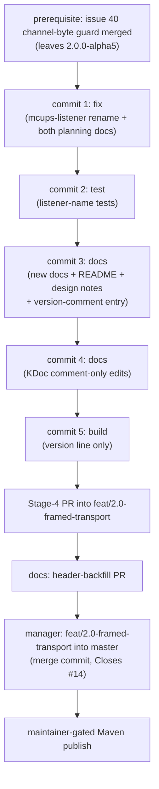
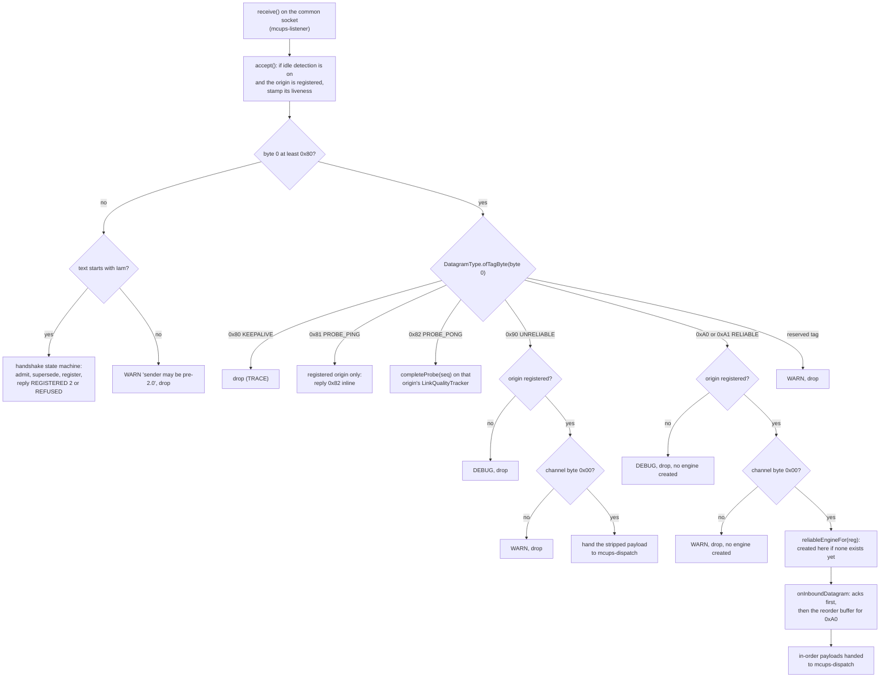
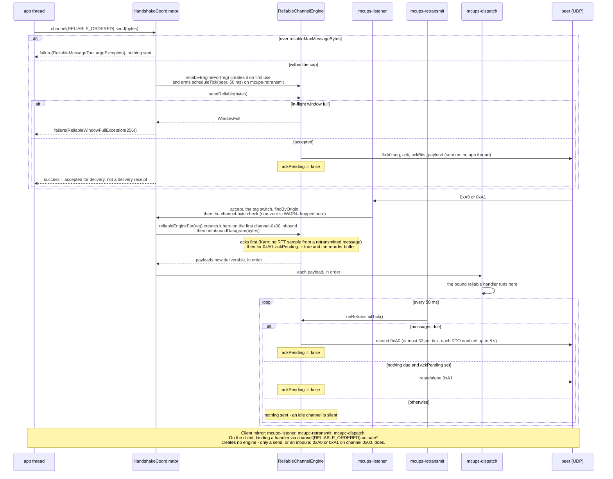

# Issue #14 Stage 4 — finalisation (docs + version) implementation plan

## Header / Association

- **Covers:** `SpartanLaboratories/WebTools#14` — *"Design discussion: a
  reliable-ordered sub-channel over the UDP transport"* — **Stage 4: docs +
  version finalisation**, the fourth and last of the staged `2.0.0` PR series
  (Stage 1 = PR #30, Stage 2 = PR #32, Stage 3 = PR #35).
- **What this document is:** the file-by-file implementation plan for the
  unit `issue-14-finalisation`. It turns
  `docs/issue-14-finalisation-architecture.md` into exact edits a developer
  executes without a design decision of their own. The maintainer resolved
  every open decision on 2026-09-24 (§10); only the chosen text is printed.
- **Architecture:** `docs/issue-14-finalisation-architecture.md`, unit
  `issue-14-finalisation` (architecture §9). The other unit there,
  `issue-40-channel-byte-guard`, is a production fix under
  `SpartanLaboratories/WebTools#40`, planned separately in
  `docs/issue-40-channel-byte-guard-architecture.md` and
  `docs/issue-40-channel-byte-guard-plan.md`. This plan depends on it (§9)
  and does not plan it.
- **Baseline:** `webtools-udp` **`2.0.0-alpha5`** on
  `feat/2.0-framed-transport` — that is, `4a70ba4` (`2.0.0-alpha4`, full
  suite green) plus the merged channel-byte guard. Every line number and
  "Current" text block in this plan was taken at `4a70ba4`; the guard moves
  some of them, so re-verify each edit's anchor against the branch tip before
  applying it (every edit quotes its current text for exactly this reason).
- **Branch:** `docs/issue-14-stage4-finalisation` (off
  `feat/2.0-framed-transport`, cut only **after** the guard has merged;
  deleted local + remote after merge).
- **Commits:** `5099e14` (fix) / `b9f3797` (test) / `3b89a1a` (docs) /
  `101de90` (docs) / `d1a0de9` (build). **PR:** #44, merged into
  `feat/2.0-framed-transport` as `5fb8e61`. **Status:** done — on
  `feat/2.0-framed-transport` as `webtools-udp` `2.0.0`, not yet published to
  Maven Central; Issue #14 not yet closed (closes on the `master` merge).
- **This plan document and the architecture document ride the first Stage-4
  commit together**, so `git log --follow` binds design to code (architecture
  Header; precedent: PRs #31/#33/#36's header-backfill convention, and
  Stage 3's plan riding commit `a988834`).
- **Target version:** `webtools-udp` **`2.0.0`**, from the `2.0.0-alpha5` the
  channel-byte guard leaves.
- **Related docs:** `docs/issue-14-reliable-ordered-channel-design.md` (annotated
  in place, §4f); `docs/issue-14-reliable-ordered-channel-plan.md`,
  `docs/issue-14-reliable-engine-plan.md`,
  `docs/issue-14-reliable-channel-api-plan.md` (Stages 1–3, historical,
  untouched); `docs/issue-34-probe-cadence-plan.md` (the house format this
  document follows); the two new evergreen docs this plan creates,
  `docs/webtools-udp-protocol.md` and `docs/webtools-udp-architecture.md`.
- **Prerequisite:** [#40](https://github.com/SpartanLaboratories/WebTools/issues/40)
  — *"webtools-udp 2.0: receivers must drop non-zero channel-byte frames
  before the Stable Core freeze"*. It is planned in
  `docs/issue-40-channel-byte-guard-architecture.md` and
  `docs/issue-40-channel-byte-guard-plan.md` (unit
  `issue-40-channel-byte-guard`, branch `fix/issue-40-channel-byte-guard`)
  (§9). **Related but out of scope:**
  [#38](https://github.com/SpartanLaboratories/WebTools/issues/38) and
  [#39](https://github.com/SpartanLaboratories/WebTools/issues/39) (§10).

---

## 1. Context

### 1.1 The settled ask

Finalise `webtools-udp` for `2.0.0`: README currency, two new evergreen
reference docs, comment-only KDoc cleanup and Stable-Core tier lines, dated
as-built annotations on the design doc, the version bump, and the process to
reach a `master` merge (performed later, by the `manager`) plus a
maintainer-gated Maven publish. There is exactly **one production code
change**: the server's common listener thread gets the name `mcups-listener`
(B7, a one-line drive-by the maintainer folded in), with its tests.
Everything else in `src/main` is comment-only. Every binding constraint
(B1–B7) and design resolution (R1–R15) in the architecture document is
authoritative; this plan does not revisit them.

### 1.2 Acceptance criteria

1. `README.md:19`'s install line reads `2.0.0`, and `:28-31`'s "currently a
   pre-release" wording is gone.
2. A new "API stability" note appears in `README.md` directly under the
   `### webtools-udp` component table (§4a). It says the whole 2.x public
   surface is Stable Core, names `DeliveryMode`, `DatagramType` and
   `DisconnectReason` as enums that may gain entries in a minor release
   (keep an `else` branch), and says the eight deprecated members stay
   compiling at `WARNING` for all of 2.x and leave the public surface only
   at 3.0.0.
3. `README.md`'s protocol table keeps its rows and prose (no wholesale
   removal), gains a lead-in linking both new evergreen docs, and its `0x80`
   row reads `client ↔ server`, not `client → server`.
4. `README.md`'s handshake-screening example calls
   `client.channel(DeliveryMode.UNRELIABLE).actuate` instead of the deprecated
   `client.start { }`; no live README snippet calls a deprecated member.
5. `README.md`'s reliable-channel section states plainly that there is no
   congestion control, no fragmentation, one reliable channel per connection,
   and no session resume across a rebind or supersede; its "created lazily on
   the first `channel(...)` call" sentence is corrected to match R1.
6. `README.md`'s "Migrating to 2.0" section states the new
   `reliableMaxMessageBytes` parameter, the 250 ms probe floor, and the
   client `start`/`startBytes` rebind change, with the wire break still listed
   first.
7. `docs/webtools-udp-protocol.md` exists: a complete, self-contained,
   descriptive (not RFC-2119 normative) wire reference with tuning values
   marked informative, covering every fact in architecture Appendix A.1 as
   updated by the merged channel-byte guard. The guard's behaviour —
   non-zero-channel datagrams dropped with a WARN — is stated as contract.
8. `docs/webtools-udp-architecture.md` exists: components, the full 11-thread
   inventory (every thread named, the server listener as `mcups-listener`),
   lifecycles, the inbound dispatch flow, and a corrected Mermaid
   `sequenceDiagram` of the as-built ack/retransmit loop (Appendix A.2).
9. `DatagramType.kt`, `TransportWireFormat.kt`, `ReliableWireFormat.kt`, and
   `UDPSendReceiveServer.kt` carry no more "Stage 1/2/3" process language,
   and every stale or wrong statement in them (§4b.1–§4b.4) is corrected,
   comment-only. The extra KDoc sets are all executed: the `DatagramType`
   and `DisconnectReason` growth caveats (§4b.1, §4b.5), the stale-vocabulary
   and engine-creation fixes (§4d), and the class-KDoc pointers (§4e).
10. `DeliveryMode`, `UdpChannel`, `ReliableSendFailure`,
    `ReliableWindowFullException`, and `ReliableMessageTooLargeException`
    each carry a Stable Core KDoc statement; `DeliveryMode`, `DatagramType`
    and `DisconnectReason` each carry the minor-growth caveat (R12).
11. The design doc gains dated "As built (Stage 4, ...)" annotations at its
    Status line, §6.2, §6.3, §7.3, §7.5, §7.8, §11, §12, §14, and D10 (§3.2
    and §13) — inserted, nothing existing rewritten or deleted.
12. `webtools-udp/build.gradle.kts` gains one `2.0.0` entry appended to the
    version-comment ladder (existing entries, including the guard's `alpha5`
    entry, untouched) and its `version =` line changes from `"2.0.0-alpha5"`
    to `"2.0.0"`.
13. The server's common listener thread is named `mcups-listener` (§4h), and
    an integration test and an e2e test assert it (§4i). That is the only
    production code change. Every other changed `src/main` line is a comment
    line (§6's check on the KDoc commit prints nothing). A `javap -p` diff
    across every class of the module, taken before the first commit and after
    the last, is empty. The full suite stays green.
14. Every new cross-reference (README → new docs, KDoc → new docs, design
    doc → new docs) resolves to an existing file and heading.
15. Every new Mermaid diagram renders in the PR's GitHub preview (R13's
    quoting/escaping rules followed in the source).
16. Five commits land in the Stage-4 PR, each with the file set and subject
    given in §8; the PR targets `feat/2.0-framed-transport`, never `master`.
17. Nothing in this PR addresses #38 (empty handshake name) or #39 (client
    origin screening). The protocol doc only describes their as-built
    behaviour and points at the issues.

---

## 2. Design

Per architecture §3–§4, the documentation and process artefacts *are* the
systems for this stage, each with an owner and an update rule: `README.md`
(Component-ring summary — install snippet, component table, protocol
*summary*, worked examples, "API stability" note); `docs/webtools-udp-protocol.md`
(Boundary-ring, the complete byte-level wire contract, evergreen, edited
directly by any future wire-affecting change); `docs/webtools-udp-architecture.md`
(Architectural outer layer, the complete thread/lock/lifecycle picture,
evergreen); public/internal KDoc (Component ring, the per-symbol contract,
points at the evergreen docs rather than restating them); the design and
stage-plan records (historical, annotated in place only, never rewritten);
`webtools-udp/build.gradle.kts` (the append-only version ladder, the
CHANGELOG substitute). Precedence on conflict, most authoritative first: code
→ the two evergreen docs → README → KDoc; the design doc sits **outside** this
ladder, historical only (architecture §4).

This plan does not re-derive those rules; it applies them. Every file-by-file
edit below names which of these six systems it belongs to, so the executor
never has to guess which document should own a fact it is tempted to
duplicate.

**Staging.** The work lands as **five ordered commits inside one PR**
(architecture §9, R14), after the separate #40 channel-byte guard PR has
merged:

1. `fix:` — the one production change: name the server's common listener
   thread `mcups-listener` (§4h), plus both planning docs. The plan rides the
   first implementation commit, as in every prior stage, so `git log --follow`
   binds the plan to the code it describes.
2. `test:` — the tests that lock that name in (§4i).
3. `docs:` — both new evergreen docs, the README edits, the design-doc
   annotations, and the `build.gradle.kts` version-**comment** entry only
   (not the `version =` line — see §8's commit ordering note).
4. `docs:` — the comment-only KDoc edits (§4b–§4e). This commit must be
   verifiably comment-only (§6), which is why the rename is not in it.
5. `build:` — the `version =` line only.



---

## 3. File-by-file changes — new documents

### 3.1 `docs/webtools-udp-protocol.md` (new — Boundary ring, owned per §3.2 above)

Header per R7 (no Covers/Branch/Commit/PR/Status block):

```markdown
# webtools-udp wire protocol

Applies to `webtools-udp` `2.x` — wire protocol version `2`. This is a
descriptive reference, not an RFC-2119 normative specification: it states
what the code does, including its as-built quirks, and marks tuning values
as informative where they are not part of the contract. Code
(`DatagramType`, `TransportWireFormat`, `ReliableWireFormat`) is authoritative
on any conflict with this document. The threads, locks and lifecycles behind
these bytes are in [webtools-udp-architecture.md](webtools-udp-architecture.md).

History (decision records, not current fact):
[design](issue-14-reliable-ordered-channel-design.md) ·
[Stage 1 plan](issue-14-reliable-ordered-channel-plan.md) ·
[Stage 2 plan](issue-14-reliable-engine-plan.md) ·
[Stage 3 plan](issue-14-reliable-channel-api-plan.md) ·
[Stage 4 plan](issue-14-finalisation-plan.md) ·
[Issue #34 probe-cadence fix](issue-34-probe-cadence-architecture.md).
```

(Both evergreen docs live in `docs/`, so links between `docs/` files are
relative markdown links by bare file name, R5; the README links them as
`docs/<file>.md`.)

**Section outline, in this order** (R7/architecture §2 finding 4 — netcode.io
`STANDARD.md`-shaped: conventions, catalogue, per-datagram sections, then
state/versioning and reserved ranges):

1. Scope & audience
2. Conventions, transport & size limits
3. Handshake
4. Tag catalogue (byte 0)
5. Per-datagram sections: `0x80` KEEPALIVE, `0x81`/`0x82` PROBE_PING/PONG,
   `0x90` UNRELIABLE, `0xA0` RELIABLE_DATA, `0xA1` RELIABLE_ACK
6. Reliable-channel behaviour (acks, retransmit, RTO, window, teardown)
7. Tuning values (informative, not contract)
8. Malformed / unexpected input
9. Versioning & cross-version behaviour
10. Reserved ranges & extension rules
11. Glossary

Each section below gives either the **verbatim table** to use, or the exact
facts the prose must state with their `path:line` source (re-verify each
against the current file before writing it down — line numbers drift from
`4a70ba4`).

#### 1. Scope & audience

- One paragraph: this document is the complete, self-contained wire
  reference for `webtools-udp` `2.x`; a reader should never need the design
  doc or the source to understand the wire (architecture §3.2).
- States the precedence rule: code wins on conflict (architecture §4).

#### 2. Conventions, transport & size limits

- All multi-byte integers are big-endian (`TransportWireFormat.kt:78-149`,
  `ReliableWireFormat.kt:13-29`).
- Byte-layout tables use `Offset | Size | Field | Type | Meaning` (R10); no
  ASCII bit diagrams, because every field here is byte-aligned.
- "Contract" vs "informative" — contract values (tags, layouts, byte order,
  the version token, the 250 ms probe floor, the 1024/8192 message cap) are
  stated plainly; tuning values (window, RTO floor/cap, retransmit tick/cap)
  carry an explicit *Informative* marker and live only in §7 (R11).
- **Transport & addressing:** plain UDP. The server binds one common port,
  `9998` (`MultiConnectionUDPServer.COMMON_LISTEN_PORT`,
  `MultiConnectionUDPServer.kt:540`), and serves every client on it. The
  client uses exactly one socket for the handshake and the whole session
  (`MultiConnectionUDPClient.kt:16-29,194-195`). Every server datagram is
  addressed to the client's **observed post-NAT source** address and port,
  never to anything carried in a payload (`CommonChannel.kt:71,89-91`) —
  which is what lets the session traverse NAT.
- **Size limits:** one application message is one datagram — there is no
  fragmentation at any layer of this protocol. The largest UDP payload over
  IPv4 is 65507 bytes (`MultiConnectionUDPServer.MAX_UDP_PAYLOAD_BYTES`); every
  receiver's buffer is `receiveBufferBytes`, 512..65507, default 65507, and a
  datagram that fills a smaller buffer is delivered **truncated**, with a WARN.
  Keep datagrams under the ~1200-byte path MTU for real-network use
  (documentation advice, not enforced). Framing overhead on application data:
  2 bytes for unreliable (`0x90` + channel), 10 bytes for reliable (`0xA0`
  header). Control datagrams are small and fixed-size: a keepalive is 1 byte,
  a probe 9, a standalone ack 8.

#### 3. Handshake

Plain UTF-8 text, unframed. State each of the following as fact, with its
citation:

- What a client sends: `Iam <name>` or `Iam <name> <credential>`, tokens
  separated by a single space, to the server's common port from the socket it
  will use for the session. `name` must be non-empty and whitespace-free;
  `credential` is optional, whitespace-free, opaque to the library, and
  travels in cleartext (`HandshakeWireFormat.kt:14-22,59-73`).
- The server trims the datagram text (`CommonChannel.kt:78`) and splits on a
  single U+0020 (`HandshakeCoordinator.kt:202`).
- `parseHandshake` requires `tokens[0] == "Iam"` and at least two tokens;
  `name = tokens[1]`; `credential = tokens[2]` or `""`; extra tokens ignored
  at DEBUG (`HandshakeProtocol.kt:55-69`, `HandshakeCoordinator.kt:218-221`).
- **As-built quirk (state it as current behaviour, not a guarantee):**
  consecutive spaces produce empty tokens, so `Iam  x` registers name `""`
  with credential `x`; the name is not validated beyond presence. Say it is an
  open defect, tracked as
  [SpartanLaboratories/WebTools#38](https://github.com/SpartanLaboratories/WebTools/issues/38).
  Describe it only — this stage does not fix it.
- Accepted reply: `REGISTERED 2` (`HandshakeWireFormat.kt:79`).
  `registeredProtocolVersion` (`:91-99`) is strict: a bare `REGISTERED` → `1`;
  exactly one canonical decimal token → that number; `02`, `2 3`, `x`, or a
  trailing space → `null`. `isRegistered` holds only when that version is `2`.
- Refusal: `REFUSED <reason>`, or a bare `REFUSED`; the reason is trimmed and
  control/whitespace runs collapsed to one space (`HandshakeWireFormat.kt:117-120`).
- Server handshake handling (`HandshakeCoordinator.kt:218-267`): an `Iam` from
  an already-registered origin gets `REGISTERED 2` again with no `admit`; an
  `Iam` from a new origin runs `admit` inline first — `Refused` replies
  `REFUSED <reason>` and registers nothing; `Admitted` supersedes any
  same-name registration under another origin (cancelling its schedules,
  closing its engine, firing `onClientDisconnect(SUPERSEDED)`, `terminate()`ing
  it), then registers the new origin, replies `REGISTERED 2`, and fires
  `onClientConnect` inline.
- Client `handshake()` is one-shot and blocking, default timeout 4000 ms
  (`MultiConnectionUDPClient.kt:790`), no built-in retry. `REFUSED` →
  `HandshakeRefusedException`; `REGISTERED 2` → success; bare `REGISTERED`, or
  `REGISTERED n` with `n != 2` → `IncompatibleProtocolException(remote, local=2)`;
  anything else → `IllegalStateException`.

#### 4. Tag catalogue (byte 0)

Verbatim table (mirrors `DatagramType`'s own value-space table post-R6, without
the dropped "Introduced" column):

```markdown
| Byte 0        | Entry           | Plane    |
|---------------|-----------------|----------|
| `0x00`–`0x7F` | *(none)*        | handshake text only — not a valid post-handshake tag |
| `0x80`        | `KEEPALIVE`     | control  |
| `0x81`        | `PROBE_PING`    | control  |
| `0x82`        | `PROBE_PONG`    | control  |
| `0x83`–`0x8F` | *reserved*      | control — future transport control (MTU probe, graceful close, …) |
| `0x90`        | `UNRELIABLE`    | app data |
| `0x91`–`0x9F` | *reserved*      | app data — future unreliable variants (unreliable-sequenced, newest-wins) |
| `0xA0`        | `RELIABLE_DATA` | app data |
| `0xA1`        | `RELIABLE_ACK`  | app data |
| `0xA2`–`0xAF` | *reserved*      | app data — reliable-channel control (SACK ranges, window updates, channel open/close) |
| `0xB0`–`0xFF` | *reserved*      | unallocated |
```

Source: `DatagramType.kt:9-27` (as corrected by §4b.1 below), Appendix A.1.
State plainly: every live tag is `>= 0x80`, so it cannot collide with the
ASCII first byte of `Iam` (`0x49`) or `REGISTERED`/`REFUSED` (`0x52`).

#### 5. Per-datagram sections

One subsection per live tag; each gets an offset table (R10) plus its
send/receive rules. **Verbatim tables:**

**`0x80` KEEPALIVE**

```markdown
| Offset | Size | Field | Type | Meaning |
|---|---|---|---|---|
| 0 | 1 | tag | u8 | `0x80` |
```

No body. Either side may send it (state: the client's is authoritative for
NAT purposes; a server → client keepalive refreshes only cone NATs). Idle-aware:
sent once output has been idle for at least the interval (default 20 000 ms),
polled at a quarter of the interval clamped to 250–5000 ms (`KeepAlive.kt:10-44`)
— so it can fire up to one poll late. The receiver drops it at TRACE. With
idle detection on, **any** inbound datagram from a registered origin stamps
its liveness before classification (`HandshakeCoordinator.kt:138-145`).

**`0x81` PROBE_PING / `0x82` PROBE_PONG**

```markdown
| Offset | Size | Field | Type | Meaning |
|---|---|---|---|---|
| 0 | 1 | tag | u8 | `0x81` (ping) or `0x82` (pong) |
| 1 | 8 | seq | u64 (big-endian) | the prober's sequence number; a `0x82` echoes the `0x81`'s value verbatim |
```

9 bytes total, either direction. Opt-in; runs at an **exact** cadence
(`scheduleTick`, since Issue #34) — `intervalMillis` must be `>=
TransportWireFormat.MIN_PROBE_INTERVAL_MILLIS` (250 ms; a lower value is
**rejected** with `IllegalArgumentException`, not clamped); default 1000 ms.
The server answers a valid `0x81` only from a registered origin — an
unregistered one is dropped at DEBUG with no reply
(`HandshakeCoordinator.kt:155-166`); **the client answers every valid `0x81`
inline, with no origin check** (`MultiConnectionUDPClient.kt:524-528`) — part
of the client origin-screening gap tracked as #39 (link it); describe it
only. State the RTT estimator constants: loss
horizon 3 intervals (`Rtt.LOSS_HORIZON_INTERVALS`); EWMA α = 1/8, β = 1/4
(`Rtt.kt:11-18`) — cross-reference §7, these are informative tuning, not
contract.

**`0x90` UNRELIABLE**

```markdown
| Offset | Size | Field | Type | Meaning |
|---|---|---|---|---|
| 0 | 1 | tag | u8 | `0x90` |
| 1 | 1 | channel | u8 | always `0x00` in `2.x`; any other value is dropped — see "Channel byte" below |
| 2 | variable (>= 0) | payload | bytes | application payload, verbatim |
```

Minimum size 2 (an empty payload is allowed). Malformed (< 2 bytes): WARN,
dropped, on both sides. The payload goes to the bytes handler verbatim, or
the text handler UTF-8-decoded and `.trim()`ed
(`HandshakeCoordinator.kt:176-183,270-291`; `MultiConnectionUDPClient.kt:535-542`).
Server: from an unregistered origin → DEBUG, dropped
(`HandshakeCoordinator.kt:271-272`).

**`0xA0` RELIABLE_DATA**

```markdown
| Offset | Size | Field | Type | Meaning |
|---|---|---|---|---|
| 0 | 1 | tag | u8 | `0xA0` |
| 1 | 1 | channel | u8 | always `0x00` in `2.x`; any other value is dropped — see "Channel byte" below |
| 2 | 2 | seq | u16 (big-endian) | this datagram's sequence number (RFC 1982 serial arithmetic) |
| 4 | 2 | ack | u16 (big-endian) | the highest sequence received **at all** from the peer — gaps allowed, never "highest in-order" |
| 6 | 4 | ackBits | u32 (big-endian) | bit *n* set ⇒ `ack − n − 1` was also received (delivered or buffered) |
| 10 | variable (>= 0) | payload | bytes | one application message |
```

Minimum size 10. Malformed (< 10 bytes): engine WARN, dropped; **never
throws** (`ReliableChannelEngine.kt:99-104`). Ack processing runs **before**
delivery on every inbound `0xA0` (`:99-113`). Every well-formed inbound `0xA0`
sets `ackPending`, including duplicates and out-of-window ones. Server: from
an unregistered origin → DEBUG, dropped, **no engine created**
(`HandshakeCoordinator.kt:185-189`).

**`0xA1` RELIABLE_ACK**

```markdown
| Offset | Size | Field | Type | Meaning |
|---|---|---|---|---|
| 0 | 1 | tag | u8 | `0xA1` |
| 1 | 1 | channel | u8 | always `0x00` in `2.x`; any other value is dropped — see "Channel byte" below |
| 2 | 2 | ack | u16 (big-endian) | the highest sequence received **at all** from the peer — gaps allowed |
| 4 | 4 | ackBits | u32 (big-endian) | bit *n* set ⇒ `ack − n − 1` was also received |
```

**Exactly** 8 bytes, no payload. Malformed (!= 8 bytes): engine WARN, dropped.
Sent on a retransmit tick only if nothing was due for retransmit, `ackPending`
is set, and the pair is not the sentinel `(0xFFFF, 0)` (before anything has
been received) (`ReliableChannelEngine.kt:150-165`).

**Channel byte** — its own subsection, as plain prose (OD-4 = (a), resolved).
**Before writing it, confirm the merged #40 code behaves exactly as §9's
contract says**, including the WARN text of its D9. If it does not, stop and
report the difference rather than documenting behaviour the code does not
have. Then write:

```markdown
The channel byte (byte 1 of every `0x90`, `0xA0` and `0xA1` datagram) is
always `0x00` in `2.x`; wire protocol 2 has one unreliable and one reliable
channel. A receiver drops any such datagram whose channel byte is not `0x00`
and logs it at WARN; the log line names the channel byte and the datagram's
origin. It takes no other action: nothing is delivered, no acknowledgement
in it is processed, and no reliable channel is created for it.

Where the receiver screens a datagram's origin — every server branch, and
the client's reliable branch — the check comes after that screening, so a
datagram from an unknown source is still dropped at DEBUG whatever its
channel byte. The client's `0x90` branch does no origin screening (an open
defect, see #39), so there the check applies to every `0x90`, whatever its
source.

A future multi-channel feature must not send a non-zero channel to a peer
that has not signalled support for it — a `2.x` peer without it drops that
traffic.
```

(Write #39 as a full link, as in the malformed-input table below.) Source:
the merged #40 code and tests — cite #40 and its PR in the PR body, not in
this doc. Senders always emit `0x00`
(`TransportWireFormat.DEFAULT_UNRELIABLE_CHANNEL`,
`ReliableWireFormat.DEFAULT_RELIABLE_CHANNEL`).

#### 6. Reliable-channel behaviour

State as contract (not the §7 tuning table): sequence numbers are per
direction, 16-bit, RFC 1982 serial arithmetic, first seq `0`; the ack/ackBits
semantics above (repeat once more here for a reader who jumped straight to
this section: **highest sequence received at all, gaps allowed** — never
"highest in-order"); piggybacked acks on every `0xA0`; a standalone `0xA1` per
the rule above; oversize send fails before the engine ever sequences,
buffers, or transmits, with `ReliableMessageTooLargeException`
(`reliableMaxMessageBytes`, default 1024, max 8192, validated `1..8192` in
both constructors); a full window fails immediately with
`ReliableWindowFullException(inFlight)`, no absorb queue; receive-side
`seq == cursor` delivers and drains buffered successors, ahead-within-window
buffers, beyond-window drops (sender retransmits), duplicate drops (still
re-acked); teardown (`terminate()`, a supersede, `stop()` on either side)
closes the engine and discards every in-flight/buffered message; a client
reliable send after `stop()` → `IllegalStateException("client stopped")`
(`MultiConnectionUDPClient.kt:485`); a server reliable send to an
unregistered peer → `IllegalStateException`
(`HandshakeCoordinator.kt:440-441`); idle `TIMEOUT` only notifies, the engine
stays intact; retransmits never refresh the peer's inbound liveness. There is
no disconnect datagram in wire protocol 2: teardown on one side sends the
peer nothing, and un-acked reliable data is simply discarded.

Also state, as the retransmission and timing **mechanism** (the numbers
themselves are §7's informative values — reference them, do not restate them
as contract):

- The first transmission of an accepted message happens immediately, inside
  the `send` call. A send that fails at the socket is not reported to the
  caller — the message is already buffered and the next retransmit tick
  retries it (`ReliableChannelEngine.kt:71-85`).
- An acknowledgement removes a buffered message when `ack` equals its seq
  exactly, or when bit *n* of `ackBits` is set for seq `ack − n − 1`
  (`ReliableRetransmitBuffer.kt:73-101`).
- A message is due for retransmission once its own retransmission timeout
  (RTO) has elapsed since it was last sent; each retransmission doubles that
  message's own RTO, up to the RTO cap. A retransmit tick resends at most a
  fixed number of due messages; if nothing is due and an inbound `0xA0` has
  arrived since this side last acked, the tick sends one standalone `0xA1`
  instead; otherwise an idle channel sends nothing at all
  (`ReliableRetransmitBuffer.kt:103-136`, `ReliableChannelEngine.kt:150-165`).
- The RTO follows RFC 6298: a per-connection estimator (independent of the
  link-quality probe's) seeds SRTT = the first sample and RTTVAR = half of
  it, then applies the α = 1/8, β = 1/4 EWMA; RTO = SRTT + 4·RTTVAR, clamped
  to [floor, cap], with **no** clock-granularity term; before the first
  sample the RTO is the floor. Karn's algorithm applies: a message that was
  retransmitted yields no RTT sample when acked
  (`ReliableRtoEstimator.kt:39-59`, `Rtt.kt`).
- Delivered payloads reach the reliable handler in order, on the side's
  dispatch thread: bytes verbatim via `actuateBytes`, or UTF-8-decoded and
  `.trim()`ed via `actuate` (`UdpChannel.kt:39-50`). With no reliable handler
  bound, delivered payloads are dropped at DEBUG — but they are still acked.
- Either side's engine exists only once that side's reliable channel is in
  use — link to the Lifecycles section of
  [webtools-udp-architecture.md](webtools-udp-architecture.md) for the exact
  creation rules rather than restating them. It is also created on an
  inbound reliable datagram on channel `0x00`, so a peer that never opened
  the channel still acknowledges. A non-zero-channel frame never creates one;
  it is dropped first (see "Channel byte").

#### 7. Tuning values (informative, not contract)

Verbatim table (R11):

```markdown
| Value | Default | Why informative |
|---|---|---|
| In-flight / reorder window | 256 | shared bound between send and receive sides; a maintainer may retune without a major |
| RTO floor | 200 ms | internal estimator parameter |
| RTO cap | 5000 ms | internal estimator parameter |
| Retransmit tick | 50 ms | internal scheduling cadence |
| Max retransmits per tick | 32 | internal scheduling cadence |
| Keepalive poll clamp | 250–5000 ms | internal scheduling cadence |
| Probe loss horizon | 3 probe intervals | estimator internals |
| RTT EWMA constants | α = 1/8, β = 1/4 | estimator internals |
```

Immediately below the table, add two short paragraphs:

- **Not tuning, but not wire contract either:** the default keepalive
  interval (20 000 ms, `TransportWireFormat.DEFAULT_KEEPALIVE_INTERVAL_MILLIS`)
  and default probe interval (1000 ms,
  `TransportWireFormat.DEFAULT_PROBE_INTERVAL_MILLIS`) are public API
  constants, governed by the README's API-stability note like any other
  public member. On the wire, a peer may send keepalives and probes at any
  cadence it chooses.
- **Contract**, restated so a reader does not have to cross-reference: the
  tag values, the wire layouts and byte order above,
  `FRAMED_PROTOCOL_VERSION = 2`,
  `TransportWireFormat.MIN_PROBE_INTERVAL_MILLIS = 250`,
  `UdpChannel.DEFAULT_MAX_RELIABLE_MESSAGE_BYTES = 1024`, and
  `UdpChannel.MAX_RELIABLE_MESSAGE_BYTES = 8192`.

#### 8. Malformed / unexpected input

Verbatim table (union of the Layouts "Parse failure" column, the reserved-tag
rule, and the origin-screening rules, Appendix A.1):

```markdown
| Condition | Server | Client |
|---|---|---|
| Reserved tag (`0x83`–`0x8F`, `0x91`–`0x9F`, `0xA2`–`0xAF`, `0xB0`–`0xFF`) | WARN, dropped | DEBUG, dropped |
| Byte 0 `< 0x80` and the text does not start with the `Iam` token | WARN ("sender may be pre-2.0"), dropped | WARN, dropped |
| `Iam` with no name token (a bare `Iam`) | handshake parse failure, logged at WARN by the listener ("Failed to handle incoming datagram"), nothing registered, no reply | *(not applicable — the client never receives `Iam`)* |
| `0x81` malformed (not exactly 9 bytes) | WARN, dropped | WARN, dropped |
| `0x82` malformed | silently ignored | silently ignored |
| `0x90` malformed (< 2 bytes) | WARN, dropped | WARN, dropped |
| `0xA0` malformed (< 10 bytes) | engine WARN, dropped; never throws | engine WARN, dropped; never throws |
| `0xA1` malformed (`!= 8` bytes) | engine WARN, dropped | engine WARN, dropped |
| `0x90` from an unregistered origin | DEBUG, dropped | *(client has no per-origin registration)* |
| `0xA0`/`0xA1` from an unregistered origin | DEBUG, dropped, no engine created | *(as above)* |
| `0x90`/`0xA0`/`0xA1` whose channel byte is not `0x00` | after origin screening: WARN, dropped; no delivery, no ack processing, no engine created | reliable: after the `serverEndpoint` check, WARN, dropped, no engine created; `0x90`: every such datagram (no origin screening, #39), WARN, dropped |
| Datagram from an origin other than the peer of record | *(server addresses per-registration; not applicable)* | only the **reliable** (`0xA0`/`0xA1`) branch checks `origin == serverEndpoint`; `0x80`/`0x81`/`0x82`/`0x90` are processed regardless of source — an open defect, tracked as #39 |
| Datagram larger than the configured receive buffer | delivered truncated, WARN | delivered truncated, WARN |
```

Under the table, write #39 as a full link
(`[#39](https://github.com/SpartanLaboratories/WebTools/issues/39)`); the
table cell uses the short form so the column stays narrow. Describe the
origin-screening gap only — this stage does not fix it.

Also under the table, state which drop wins when a datagram is **both
truncated and on a non-zero channel**, as #40's plan orders them. Confirm it
against the merged code first.
- **`0x90`:** the length check comes first. A `0x90` under 2 bytes has no
  channel byte, so it is a malformed drop.
- **`0xA0`/`0xA1`:** the channel check comes first. It reads byte 1 on its
  own, so a truncated frame with a non-zero byte 1 gets the channel WARN and
  never reaches the engine. Only a truncated frame on channel `0x00` (or one
  too short to have a byte 1) gets the engine's malformed WARN.

Source: `docs/issue-40-channel-byte-guard-architecture.md`, D2, D5 and its
"checking only well-formed headers" alternative.

#### 9. Versioning & cross-version behaviour

Verbatim table:

```markdown
| Client | Server | Outcome |
|---|---|---|
| `2.0` | `2.0` | success |
| `2.0` | `1.x` | client `handshake()` fails with `IncompatibleProtocolException(remote=1, local=2)` |
| `1.x` | `2.0` | client fails with `IllegalStateException`, but **the server has already registered it and fired `onClientConnect`** — that transient registration is removed only by idle detection, a supersede, or `terminate()` |
```

Source: `HandshakeWireFormat.kt:29-33`, Appendix A.1.

Below the table, state the version rules, verbatim:

```markdown
`REGISTERED 2` names wire protocol version `2`, which every `2.x` release
speaks. Changing the layout or meaning of any existing datagram is a new
wire-protocol version, and so a new library major. A later `2.x` minor may
allocate a new datagram type from a reserved range (see *Reserved ranges &
extension rules*); an older `2.x` peer drops that datagram (see *Malformed /
unexpected input*), so a feature built on a new type works only when both
ends support it.
```

#### 10. Reserved ranges & extension rules

Restate the reserved bands from the tag catalogue as an explicit extension
contract: `0x83`–`0x8F` (future transport control), `0x91`–`0x9F` (future
unreliable variants), `0xA2`–`0xAF` (future reliable-channel control),
`0xB0`–`0xFF` (unallocated). Then write, verbatim: "A receiver never
dispatches a reserved tag (see *Malformed / unexpected input*). Allocating a
reserved tag changes the wire protocol, and this document is updated in the
same change that allocates it." (This document is evergreen — architecture
§3.2's update rule — which is why it says so itself.)

#### 11. Glossary

Short definitions: datagram-type tag, reliable channel, in-flight window,
reorder buffer, RTO, Karn's algorithm, piggybacked ack, standalone ack,
sentinel ack pair, supersede, idle sweep.

---

### 3.2 `docs/webtools-udp-architecture.md` (new — Architectural outer layer)

Header per R7, same shape as §3.1's:

```markdown
# webtools-udp architecture

Applies to `webtools-udp` `2.x`. How the module is put together: its
components, every thread it can start, the locks and the delivery-ordering
guarantees, the server, client and connection lifecycles, and the path a
datagram takes in each direction. The bytes themselves are specified in
[webtools-udp-protocol.md](webtools-udp-protocol.md). Code is authoritative on
any conflict with this document.

History (decision records, not current fact):
[design](issue-14-reliable-ordered-channel-design.md) (its §7.8 diagram is
superseded by §9 below) ·
[Stage 1 plan](issue-14-reliable-ordered-channel-plan.md) ·
[Stage 2 plan](issue-14-reliable-engine-plan.md) ·
[Stage 3 plan](issue-14-reliable-channel-api-plan.md) ·
[Stage 4 plan](issue-14-finalisation-plan.md) ·
[Issue #34 probe-cadence fix](issue-34-probe-cadence-architecture.md).
```

**Section 1, Scope & audience** — one paragraph: for a maintainer reasoning
about concurrency, a contributor onboarding into the thread model, and a
reviewer checking a proposed change against the existing topology; any
change to a thread, lock or lifecycle updates this document directly.

**Section outline:**

1. Scope & audience
2. Component map
3. Thread inventory
4. Outbound send paths
5. Opt-in / zero-cost features
6. Inbound dispatch flow (Mermaid `flowchart`)
7. Lifecycles (server `stop()`, client `stop()`, connection states,
   reliable-engine creation/teardown)
8. Concurrency & ordering (locks, lock order, head-of-line blocking)
9. The as-built reliable sequence (Mermaid `sequenceDiagram`)
10. `UDPSendReceiveServer` note

#### 2. Component map

Verbatim table:

```markdown
| Component | Visibility | Role |
|---|---|---|
| `MultiConnectionUDPServer` | public (abstract) | Binds the common port; owns the listener and dispatch threads and the three lazily-created schedulers; exposes `start*` / `pushToAll*` / `stop`; subclass hooks `onClientConnect`, `admit`, `onClientDisconnect` |
| `MultiConnectionUDPClient` | public | One socket; `handshake`; its own listener and dispatch threads; `channel(mode)`; keepalive/probe conveniences; at most one reliable engine |
| `Connection` / `UDPConnection` | public / public (internal constructor) | One named peer: `channel(mode)`, the deprecated `push`/`actuate*`, `terminate`, keepalive/probe control. `UDPConnection` is the production implementation — it owns no socket and delegates to `ClientChannel` |
| `UdpChannel` / `DeliveryMode` | public | The delivery-mode-scoped send/bind view, and the mode enum |
| `Admission`, `DisconnectReason`, `LinkQuality` | public | `admit`'s result, the disconnect reasons, the probe's snapshot value |
| `HandshakeWireFormat`, `TransportWireFormat`, `DatagramType` | public | The handshake text format, the framed control/unreliable codec, the tag-byte enum |
| `HandshakeRefusedException`, `IncompatibleProtocolException`, `ReliableSendFailure` (+ `ReliableWindowFullException`, `ReliableMessageTooLargeException`) | public | Typed `Result.failure` payloads — never thrown |
| `UDPSendReceiveServer` | public | A standalone two-socket primitive **outside** the connection stack (§10) |
| `HandshakeCoordinator` | internal | The server's handshake state machine, tag-byte router and `ClientChannel` implementation; owns `Registrations` |
| `ClientChannel` | internal | The seam through which `UDPConnection` reaches the coordinator: send, bind, deregister, keepalive, probe, reliable |
| `Registrations` / `Registration` | internal | Copy-on-write registry of connected clients and their per-peer state (handlers, liveness stamps, reliable engine, link-quality tracker) |
| `CommonChannel` | internal | Wraps the server's one socket |
| `PeriodicSchedule` / `PeriodicScheduler` | internal | The per-endpoint repeating-task seam: `schedule` (poll-divided, keepalive) and `scheduleTick` (exact cadence, probe and retransmit), each backed by one lazily-created daemon executor |
| `ReliableChannelEngine` | internal | One reliable plane per connection: send, ack processing, retransmit tick, reorder, close |
| `ReliableRetransmitBuffer`, `ReliableReorderBuffer`, `ReliableRtoEstimator`, `ReliableWireFormat`, `SerialSequence` | internal | The engine's parts: the in-flight window, the receive reorder window, the private RTO estimator, the `0xA0`/`0xA1` codec, RFC 1982 arithmetic |
| `LinkQualityTracker`, `Rtt`, `KeepAlive`, `Liveness`, `HandshakeProtocol` | internal | The probe's estimator, RTT/RTO maths, keepalive and idle-sweep timing rules, `Iam` parsing |
| `UnreliableConnectionChannel`, `UnsupportedUdpChannel`, `ReliableConnectionChannel` | internal | The `UdpChannel` implementations behind `Connection.channel` |
```

Ownership, stated below the table: the server owns one `HandshakeCoordinator`,
which owns `Registrations` (0..N `Registration`s); each `Registration` may own
one `ReliableChannelEngine` and one `LinkQualityTracker`. A client owns at
most one of each for its single server session
(`MultiConnectionUDPServer.kt:254`, `Registrations.kt:50,87`).

#### 3. Thread inventory

Verbatim table (Appendix A.2 — 11 threads, every one named once §4h names
the server listener `mcups-listener`; at most 6 server-side, 5 client-side,
all daemon):

```markdown
| Side | Thread | Created | Runs |
|---|---|---|---|
| server | `mcups-listener` | eagerly, at construction | receive; `accept` (liveness stamp); the tag switch; the handshake including `admit`/`onClientConnect`; inline `0x82` replies; reliable ack processing |
| server | `mcups-dispatch` | eagerly | every message handler (unreliable and reliable) and `onClientDisconnect` |
| server | `mcups-liveness` | at construction, only if `idleTimeoutMillis > 0` | the idle sweep |
| server | `mcups-keepalive` | lazily, on the first `startKeepAlive` | the keepalive tick, poll-divided (`KeepAlive.pollIntervalMillis`) |
| server | `mcups-probe` | lazily, on the first `startProbe` | the probe tick, exact cadence (`scheduleTick`) |
| server | `mcups-retransmit` | lazily, on the first reliable engine | the retransmit tick, exact cadence (`scheduleTick`) |
| client | `mcupc-listener` | lazily, on the first `ensureListening()` (`start`, `startBytes`, any `channel(...).actuate*`) | receive; the tag switch; inline `0x82` replies; reliable ack processing |
| client | `mcupc-dispatch` | eagerly | handlers |
| client | `mcupc-keepalive` | lazily | the keepalive tick |
| client | `mcupc-probe` | lazily | the probe tick |
| client | `mcupc-retransmit` | lazily | the retransmit tick |
```

State plainly beneath the table: a reliable message's first transmission runs
on the **caller's** thread, inside `send`; retransmits and standalone acks run
on the side's own `-retransmit` thread.

#### 4. Outbound send paths

Verbatim table:

```markdown
| Traffic | Runs on |
|---|---|
| First transmission of an unreliable `send`/`push`/`pushToAll` | caller's thread |
| First transmission of a reliable `send` (`0xA0`) | caller's thread |
| A retransmitted `0xA0` / a standalone `0xA1` | the side's `-retransmit` thread |
| An inline `0x82` probe reply | the listener thread |
| A scheduled keepalive `0x80` | the side's `-keepalive` thread |
| A one-shot keepalive (`sendKeepAlive()` / `Connection.keepAlive()`) | caller's thread |
| A scheduled probe `0x81` | the side's `-probe` thread |
| The client's `Iam` handshake datagram | caller's thread (`handshake()` blocks until the reply or the timeout) |
| `REGISTERED`/`REFUSED` handshake reply | the listener thread (server-side) |
```

#### 5. Opt-in / zero-cost features

Verbatim table:

```markdown
| Feature | Thread(s) | Created |
|---|---|---|
| Idle-connection detection | `mcups-liveness` | at construction, only if `idleTimeoutMillis > 0` |
| Scheduled keepalive | `mcup{c,s}-keepalive` | lazily, on the first `startKeepAlive` |
| Link-quality probe | `mcup{c,s}-probe` | lazily, on the first `startProbe` |
| Reliable-ordered channel | `mcup{c,s}-retransmit` | lazily, on first engine creation (§7 below) |
```

A consumer that opts into none of these pays for no extra thread and no
per-datagram cost beyond the tag switch.

#### 6. Inbound dispatch flow

Server flowchart (R13: quoted labels, `<br/>` not `\n`, no bare `end`, no `;`
in text, aliases used implicitly via short IDs):



The two "channel byte 0x00?" decisions are #40's (§9). On the server, #40
puts the `0x90` check inside `deliverData`, right after the registration
lookup (its D3). The reliable check sits after the `reg == null` check and
before `reliableEngineFor` (its D4). Draw them where the merged code actually
checks. If it differs from §9's contract, stop and report instead of drawing
it.

Immediately below the diagram, state the client's differences in prose (not
inside the diagram, since flowcharts have no note syntax):
- The client's loop runs on `mcupc-listener`.
- There is no liveness stamp and no handshake branch. The client reads its
  one `REGISTERED`/`REFUSED` reply inside `handshake()`, before the listener
  starts, so a byte-0 `< 0x80` datagram in the session is simply
  WARN-dropped.
- There is no per-origin registration table, so the "origin registered?"
  branches do not apply. **Only the reliable branch screens origin**
  (`origin == serverEndpoint`). The `0x80`, `0x81`, `0x82` and `0x90`
  branches have **no origin screening at all** — any source's datagram is
  processed (the gap tracked as #39).
- The channel-byte check runs on both data branches, but differently:
  - **reliable branch:** inside the `serverEndpoint` check, before the engine
    is touched (#40 D6), so a non-server source is still dropped at DEBUG
    whatever its channel byte;
  - **`0x90` branch:** it has no origin screening to come after, so the check
    applies to **every** `0x90`, whatever its source (#40 D5). A stranger's
    non-zero-channel `0x90` therefore gets the channel WARN, which names the
    datagram's actual origin (#40 D9).
- The client answers every valid `0x81`.
- The client's reserved-tag drop is DEBUG, not WARN
  (`MultiConnectionUDPClient.kt:500-584` at `4a70ba4`; re-verify after #40,
  which reshapes this loop).

#### 7. Lifecycles

State verbatim (Appendix A.2):

- **Server `stop()`:** `stopNotifying` → `terminateAll` → listener join (<= 1 s)
  → close the socket → liveness → keepalive → probe → retransmit → dispatch.
  Every step runs even if an earlier one fails. **No `onClientDisconnect`
  fires.**
- **Client `stop()`:** `stopped = true` → `listening = false` → join →
  keepalive → probe → retransmit → `engine.close()` → close the socket →
  dispatch. Each step is its own `runCatching`.
- **Connection states:** register, then one of: a supersede → `SUPERSEDED`;
  `terminate()` → `TERMINATED`; the idle sweep → `TIMEOUT`, notify-only, the
  connection stays addressable.
- **No goodbye on the wire:** neither `terminate()` nor either side's `stop()`
  sends the peer anything — wire protocol 2 has no disconnect datagram (a
  graceful close is one of the reserved future control tags). A peer learns
  that the other side has gone only through its own idle detection.
- **Reliable-engine creation/teardown:**
  - **Client:** created on the first reliable **send**, or on the first
    inbound `0xA0`/`0xA1` that comes from `serverEndpoint` **on channel
    `0x00`** — **not** on `channel(RELIABLE_ORDERED).actuate*`.
  - **Server:** created on the first send, the first `bindReliable`
    (`actuate*`/`startReliable`), or the first inbound `0xA0`/`0xA1` on
    channel `0x00` from a registered origin.
  - **Neither side** creates an engine for a non-zero-channel frame, which
    is dropped before the engine is reached (#40).
  - **Teardown:** either side's `terminate()`, a supersede, or `stop()`
    closes the engine and discards every in-flight or buffered message.

#### 8. Concurrency & ordering

State verbatim (Appendix A.2 "Locks and ordering"):

- `ReliableChannelEngine` is `@Synchronized`. Lock order is always **engine →
  buffer**, never reversed.
- Three threads contend for the engine per connection: the app thread
  (`send`), the listener (inbound), and the retransmit tick. The 32-per-tick
  cap bounds how long the tick holds the lock.
- `reliableEngineFor`, `reliableEngine()`, and `ensureListening()` are
  `@Synchronized`; `ensureListening()` is idempotent.
- Each side has **one** single-threaded dispatch executor, serialising
  unreliable **and** reliable delivery. **Head-of-line blocking on the
  reliable plane therefore also delays unreliable delivery to that
  connection.**

#### 9. The as-built reliable sequence

Server-side, from Appendix A.2's numbered steps 1–8. R13-compliant: in a
`sequenceDiagram` everything after a message's `:` (and after `alt`/`else`/
`loop`/`opt`/`Note ... :`) is literal text, so it is written **without**
quotes, with `<br/>` for line breaks, no `;` anywhere, and no line beginning
with the word `end` other than the block terminators; participants use
aliases. `Coord` is not a thread — it is the `HandshakeCoordinator` code the
calling thread runs.



#### 10. `UDPSendReceiveServer` note

State plainly: this type deliberately has **no** `DeliveryMode`/`UdpChannel`
surface and never will. It is a standalone two-socket primitive (a separate
`sendSocket` and `listenSocket`) with no handshake and no registration —
there is no `Connection` to key a `ReliableChannelEngine` or a retransmit
schedule to. Giving it one would mean standing up a second, parallel
reliability stack for a primitive nobody builds a session on. Source:
`UDPSendReceiveServer.kt:30-38` (as corrected by §4b.4 below).

---

## 4. File-by-file changes — README, KDoc, design doc, build file

### 4a. `README.md`

Ring: **Component-ring summary** (§3.1 above). Every edit below rides commit
3 (§8). Anchors are `heading — current line` from the version read at
`4a70ba4`. #40 makes no README change (its D11), but re-verify line numbers
and current text before editing anyway.

**Install line — heading "## Install", `README.md:19`.**

Current:
```
    implementation("io.github.spartanlaboratories:webtools-udp:2.0.0-alpha3")
```
Replace with:
```
    implementation("io.github.spartanlaboratories:webtools-udp:2.0.0")
```

**Pre-release wording — same section, `README.md:28-31`.**

Current:
```
`webtools-udp 2.0.0` (currently a pre-release `2.0.0-alphaN` series on the `2.x` integration
branch) is a **wire break** for everything after the handshake — see [Migrating to
2.0](#migrating-to-20). Both ends of a connection must be on `2.0.0`+; a `1.x` ↔ `2.x` pairing
fails the handshake cleanly instead of exchanging data either side can parse.
```
Replace with:
```
`webtools-udp 2.0.0` is a **wire break** for everything after the handshake — see [Migrating to
2.0](#migrating-to-20). Both ends of a connection must be on `2.0.0`+; a `1.x` ↔ `2.x` pairing
fails the handshake cleanly instead of exchanging data either side can parse. See
[`docs/webtools-udp-protocol.md`](docs/webtools-udp-protocol.md) for the complete wire reference
and [`docs/webtools-udp-architecture.md`](docs/webtools-udp-architecture.md) for the component,
thread, and lifecycle picture.
```

**API stability note (R3) — new, inserted directly under the `### webtools-udp`
component table**, i.e. after its last row (`| \`resolveLocalAddress()\` | … |`,
`README.md:66`) and before the `### webtools-scraping` heading (`:68`), with one
blank line on each side.

Insert (OD-1 = (a) and OD-2 = (a), resolved):
```
**API stability.** The whole `webtools-udp` `2.x` public surface — including `DeliveryMode`,
`DatagramType`, `DisconnectReason`, `UdpChannel`, `ReliableSendFailure` and its subtypes, and
every other public type — is **Stable Core**: breaking changes only in a major. `DeliveryMode`,
`DatagramType`, and `DisconnectReason` may each gain a new entry in a **minor** release; keep an
`else` branch in any `when` over one of them. The eight members deprecated in `2.0.0` (see
[Migrating to 2.0](#migrating-to-20)) stay fully functional — still compiling, deprecated at
`WARNING` only — for all of `2.x`, and leave the public surface only at `3.0.0`.
```

The "Deprecations in 2.0" paragraph of "Migrating to 2.0"
(`README.md:390-400`) is **not** edited: it already says the eight remain
fully functional and leave at 3.0.0, which matches.

**Protocol section lead-in + `0x80` row (R4) — heading "## UDP transport
protocol", inserted after `README.md:85` and before the table at `:87`.**

Insert, as its own paragraph immediately before the table:
```
This section summarises the wire; [`docs/webtools-udp-protocol.md`](docs/webtools-udp-protocol.md)
is the complete, self-contained wire reference (every datagram's byte layout, the as-built
quirks, and the malformed-input handling), and
[`docs/webtools-udp-architecture.md`](docs/webtools-udp-architecture.md) covers the threads,
locks, and lifecycles that move these bytes.

```
Then correct the table row at `README.md:94`:

Current:
```
| client → server | `0x80` — keepalive (`KEEPALIVE`, ~20 s idle cadence) | port `9998`, from the same socket |
```
Replace with:
```
| client ↔ server | `0x80` — keepalive (`KEEPALIVE`, ~20 s idle cadence) | port `9998`, from the same socket |
```

**Handshake screening example — heading "### Handshake screening &
credentials", `README.md:220-226`.**

Current:
```kotlin
val client = MultiConnectionUDPClient(serverAddress)
client.handshake("alice", credential = base64UrlToken).fold(
    onSuccess = { client.start { msg -> /* ... */ } },
    onFailure = { ex -> if (ex is HandshakeRefusedException) showError(ex.reason) },
)
```
Replace with:
```kotlin
val client = MultiConnectionUDPClient(serverAddress)
client.handshake("alice", credential = base64UrlToken).fold(
    onSuccess = { client.channel(DeliveryMode.UNRELIABLE).actuate { msg -> /* ... */ } },
    onFailure = { ex -> if (ex is HandshakeRefusedException) showError(ex.reason) },
)
```
(This is the only live README snippet calling a deprecated member; the
`start { }` example at `README.md:355-356` is already a comment, kept
deliberately per Stage-3 precedent — no change there.)

**Reliable-channel section — heading "### Reliable-ordered channel",
`README.md:331-336`, corrected per R1, plus links and the "Limits in 2.0"
block.**

Current:
```
The channel is created lazily — on the first `channel(RELIABLE_ORDERED)` call *or* the first
inbound reliable datagram, whichever comes first — and arms one shared `mcups-retransmit` /
`mcupc-retransmit` daemon thread per side (created only once a reliable channel is actually
used). A `terminate()`, a same-name supersede, or `stop()` on either side discards any un-acked
data and resets the channel; a send after teardown fails its `Result`. Both ends must be on
`webtools-udp` `2.0.0`+ — a pre-`2.0.0` peer never emits or answers `0xA0`/`0xA1`.
```
Replace with:
```
The channel is created lazily. On the client, the first reliable `send` *or* the first inbound
`0xA0`/`0xA1` on channel `0x00` from the server creates it — obtaining the handle via
`channel(RELIABLE_ORDERED)` or binding its handler alone does not. On the server, the first
reliable `send` to a peer, the first `startReliable`/`actuate*` binding on that peer's channel,
or the first inbound reliable datagram on channel `0x00` from a registered peer creates it. (A
datagram on any other channel is dropped with a WARN and creates nothing.) Either way it arms one
shared `mcups-retransmit` /
`mcupc-retransmit` daemon thread per side (created only once a reliable channel is actually used
on that side). See [`docs/webtools-udp-architecture.md`](docs/webtools-udp-architecture.md) for
the complete creation/teardown picture. A `terminate()`, a same-name supersede, or `stop()` on
either side discards any un-acked data and resets the channel; a send after teardown fails its
`Result`. Both ends must be on `webtools-udp` `2.0.0`+ — a pre-`2.0.0` peer never emits or answers
`0xA0`/`0xA1`.

**Limits in `2.0`.** Stated loudly because it is the biggest limitation of this feature: **there
is no congestion control** — no cwnd, no pacing, no loss-triggered rate reduction. Under
sustained loss the channel retransmits at RTO-backoff cadence up to the in-flight window, then
fails sends; this is adequate for a low-rate discrete-event stream and inadequate for a
genuinely congested path. In addition: **no fragmentation** — an oversize message fails
immediately with `ReliableMessageTooLargeException` rather than being split; **one reliable
channel per connection** — there is no channel id a consumer can choose; and **no session
resume** — a `terminate()`, a same-name supersede (NAT rebind), or `stop()` discards all
in-flight and buffered reliable data and resets the channel, and a fresh registration always
gets a fresh channel. See [`docs/webtools-udp-protocol.md`](docs/webtools-udp-protocol.md) for
the wire-level detail behind each of these.
```

**"Migrating to 2.0" — heading "### Migrating to 2.0", insert after the
existing three bullets at `README.md:379-388` and before the "**Deprecations
in 2.0.**" paragraph at `:390`.**

Insert, as three new bullets (wire break stays listed first, unchanged):
```
- **New constructor parameter `reliableMaxMessageBytes`** on both `MultiConnectionUDPServer` and
  `MultiConnectionUDPClient`: the reliable-channel payload cap, default 1024 bytes, validated to
  `1..8192`. An oversize reliable `send` fails with `ReliableMessageTooLargeException`.
- **The link-quality probe runs at its configured interval, with a 250 ms floor.** `startProbe`
  (on `Connection` and on `MultiConnectionUDPClient`) now fails with `IllegalArgumentException`
  for an `intervalMillis` below `TransportWireFormat.MIN_PROBE_INTERVAL_MILLIS` (250 ms) instead
  of silently running at 250 ms, and sends exactly one probe per interval — `1.6.0` probed up to
  four times too often (exactly 4× at the 1 s default), so `probesSent` and `packetLossRatio`
  differ from `1.6.0` at the same settings. `linkQuality()` now counts a probe as lost once it
  is overdue as of the call.
- **A second `MultiConnectionUDPClient.start` / `startBytes` call now rebinds the handler**
  instead of starting a second listener: the last call to `start`, `startBytes`, or
  `channel(DeliveryMode.UNRELIABLE).actuate*` wins, and only the first of them starts the
  listener thread.
```

### 4b. Comment-only KDoc — the B4 set (four files) plus the two OD-1 caveats

Ring: **Component ring** (§3.4). Every KDoc edit in §4b–§4e rides commit 4
(§8), which must be comment-only; verify with the `javap -p` and
comment-lines checks (§6). #40 merges first. Per its D10 it rewrites the two
`DEFAULT_*_CHANNEL` lines (with this plan's own text) and leaves every other
block this plan quotes untouched; only line numbers move (§9). Each edit
below quotes the text it replaces. If that exact text is no longer there,
re-read the block, apply the same intent to what is there now, and note it
in the PR body.

#### 4b.1 `DatagramType.kt` (public)

**The value-space lead-in (`DatagramType.kt:11-12`) — "later stages" is
process narration.**

Current:
```kotlin
 * The tag space is partitioned by plane so later stages of the `2.x` series slot
 * in with no further wire break:
```
New:
```kotlin
 * The tag space is partitioned by plane, with whole ranges reserved so that a
 * datagram type can be added later without changing any existing layout:
```

**The value-space table (`DatagramType.kt:14-26`) — drop the "Introduced"
column (R6).**

Current:
```kotlin
 * | Byte 0        | Entry        | Plane      | Introduced |
 * |---------------|--------------|------------|------------|
 * | `0x00`–`0x7F` | *(none)*     | —          | not a valid tag — the text handshake bootstrap only (`Iam` / `REGISTERED` / `REFUSED`) |
 * | `0x80`        | [KEEPALIVE]  | control    | Stage 1    |
 * | `0x81`        | [PROBE_PING] | control    | Stage 1    |
 * | `0x82`        | [PROBE_PONG] | control    | Stage 1    |
 * | `0x83`–`0x8F` | *reserved*   | control    | future transport control (MTU probe, graceful close, …) |
 * | `0x90`        | [UNRELIABLE] | app data   | Stage 1    |
 * | `0x91`–`0x9F` | *reserved*   | app data   | future unreliable variants (unreliable-sequenced, newest-wins) |
 * | `0xA0`        | [RELIABLE_DATA] | app data | Stage 2 |
 * | `0xA1`        | [RELIABLE_ACK] | app data | Stage 2 |
 * | `0xA2`–`0xAF` | *reserved*   | app data   | reliable-channel control (SACK ranges, window updates, channel open/close) |
 * | `0xB0`–`0xFF` | *reserved*   | —          | unallocated |
```
New:
```kotlin
 * | Byte 0        | Entry           | Plane    |
 * |---------------|-----------------|----------|
 * | `0x00`–`0x7F` | *(none)*        | handshake text only — not a valid post-handshake tag |
 * | `0x80`        | [KEEPALIVE]     | control  |
 * | `0x81`        | [PROBE_PING]    | control  |
 * | `0x82`        | [PROBE_PONG]    | control  |
 * | `0x83`–`0x8F` | *reserved*      | control — future transport control (MTU probe, graceful close, …) |
 * | `0x90`        | [UNRELIABLE]    | app data |
 * | `0x91`–`0x9F` | *reserved*      | app data — future unreliable variants (unreliable-sequenced, newest-wins) |
 * | `0xA0`        | [RELIABLE_DATA] | app data |
 * | `0xA1`        | [RELIABLE_ACK]  | app data |
 * | `0xA2`–`0xAF` | *reserved*      | app data — reliable-channel control (SACK ranges, window updates, channel open/close) |
 * | `0xB0`–`0xFF` | *reserved*      | unallocated |
 *
 * The complete, self-contained wire reference — including every datagram's byte layout, the
 * ack/retransmit contract, and the malformed-input table — is `docs/webtools-udp-protocol.md`.
```

**The "Stage-1 peer" paragraph (`DatagramType.kt:33-35`) → the 2.x
reserved-tag rule (R6).**

Current:
```kotlin
 * A Stage-1 peer that receives a reserved tag drops it with a WARN: it is a
 * same-major peer running a later stage, which a Stage-1 ↔ Stage-1 session never
 * produces.
```
New:
```kotlin
 * A reserved tag is dropped, never dispatched: the server logs it at WARN, the client at
 * DEBUG. See `docs/webtools-udp-protocol.md` for the complete reserved-range table and the
 * full malformed-input handling.
```

**Growth caveat (OD-1 = (a), resolved).** Append one paragraph after the
reserved-tag-rule paragraph above:
```kotlin
 *
 * A future **minor** release may add a live tag from one of the reserved ranges above (e.g. a
 * new [DeliveryMode]'s wire representation). Keep an `else` branch in any `when` over
 * [DatagramType] or over `ofTagByte`'s result.
```

#### 4b.2 `TransportWireFormat.kt` (public)

**The datagram-tag table (`TransportWireFormat.kt:12-18`) — drop the reserved
row; the "Boundary note" pointer at `:28-30` — replace with one sentence
(R6).**

Current (table plus the paragraph that follows the "Boundary note" heading):
```kotlin
 * | Byte 0        | Entry                     | Rest of datagram |
 * |---------------|---------------------------|------------------|
 * | `0x80`        | [DatagramType.KEEPALIVE]   | *(empty)* |
 * | `0x81`        | [DatagramType.PROBE_PING]  | 8-byte big-endian `uint64` probe sequence |
 * | `0x82`        | [DatagramType.PROBE_PONG]  | 8-byte big-endian `uint64` probe sequence (echoed) |
 * | `0x90`        | [DatagramType.UNRELIABLE]  | `[channel:1]` (Stage 1: always `0x00`) + payload verbatim |
 * | `0x83`–`0x8F`, `0x91`–`0xFF` | *reserved* | dropped with a WARN by a Stage-1 peer |
 *
 * ### Boundary note
 * This is a wire break: there is **no** `1.x` ↔ `2.x` post-handshake interop.
 * Both ends must be on `webtools-udp` `2.0.0`+. A cross-major peer is caught at
 * the handshake — the server's `REGISTERED` reply carries
 * [FRAMED_PROTOCOL_VERSION] (`REGISTERED 2`) and a mismatch fails
 * `MultiConnectionUDPClient.handshake` cleanly with an
 * [IncompatibleProtocolException].
 *
 * The `0xA0`/`0xA1` reliable-channel frames this object's value-space table
 * reserves are encoded/decoded by `ReliableWireFormat`, not here — see that
 * type for the reliable header layout.
 */
```
New:
```kotlin
 * | Byte 0        | Entry                     | Rest of datagram |
 * |---------------|---------------------------|------------------|
 * | `0x80`        | [DatagramType.KEEPALIVE]   | *(empty)* |
 * | `0x81`        | [DatagramType.PROBE_PING]  | 8-byte big-endian `uint64` probe sequence |
 * | `0x82`        | [DatagramType.PROBE_PONG]  | 8-byte big-endian `uint64` probe sequence (echoed) |
 * | `0x90`        | [DatagramType.UNRELIABLE]  | `[channel:1]` (`2.0`: always `0x00`) + payload verbatim |
 *
 * ### Boundary note
 * This is a wire break: there is **no** `1.x` ↔ `2.x` post-handshake interop.
 * Both ends must be on `webtools-udp` `2.0.0`+. A cross-major peer is caught at
 * the handshake — the server's `REGISTERED` reply carries
 * [FRAMED_PROTOCOL_VERSION] (`REGISTERED 2`) and a mismatch fails
 * `MultiConnectionUDPClient.handshake` cleanly with an
 * [IncompatibleProtocolException].
 *
 * Every other byte 0 — including the reliable-channel `0xA0`/`0xA1` frames — is listed in
 * [DatagramType]'s own value-space table; the complete wire reference is
 * `docs/webtools-udp-protocol.md`.
 */
```

**`DEFAULT_UNRELIABLE_CHANNEL` KDoc (`TransportWireFormat.kt:36`) — the old
text's "accepts" was false, and #40 changes what receivers do (OD-4 =
(a)).** #40 rewrites this line itself, with exactly the "New" text below
(its D10(a)), so after #40 merges this edit is expected to be
**verify-only**: confirm the line reads as "New" and move on. Apply the text
only if the line still reads as quoted under "Current". If it reads as
anything else, stop and report.

Current (at `4a70ba4`):
```kotlin
    /** The v1 unreliable channel id — the only value Stage 1 emits or accepts. */
```
New:
```kotlin
    /**
     * The unreliable channel id this build emits, always `0x00`. A receiver drops a datagram
     * whose channel byte is non-zero, with a WARN; see `docs/webtools-udp-protocol.md` for the
     * full channel-byte contract.
     */
```

**`unreliableDatagram`'s `@param channel` (`TransportWireFormat.kt:129-130`) —
drop "Stage 1".**

Current:
```kotlin
     * @param channel the unreliable channel id; Stage 1 only ever emits
     * [DEFAULT_UNRELIABLE_CHANNEL]
```
New:
```kotlin
     * @param channel the unreliable channel id; this build only ever emits
     * [DEFAULT_UNRELIABLE_CHANNEL]
```

#### 4b.3 `ReliableWireFormat.kt` (internal)

**Class KDoc (`ReliableWireFormat.kt:3-9`) — drop the design-doc citation and
the stage narration (R6).**

Current:
```kotlin
/**
 * The reliable-ordered channel's wire header codec: the `0xA0` reliable-data
 * frame and the `0xA1` standalone-ack frame (design doc §6.2). A separate
 * `internal` object rather than an extension of the public
 * [TransportWireFormat] — keeps Stage 3's dispatch-wiring diff clean, and
 * mirrors the `Rtt.kt`-beside-`LinkQualityTracker.kt` precedent of a pure
 * wire/math helper living next to the stateful type that consumes it.
 *
```
New:
```kotlin
/**
 * The reliable-ordered channel's wire header codec: the `0xA0` reliable-data
 * frame and the `0xA1` standalone-ack frame. See `docs/webtools-udp-protocol.md`
 * for the complete wire reference. A separate `internal` object rather than an
 * extension of the public [TransportWireFormat] — mirrors the
 * `Rtt.kt`-beside-`LinkQualityTracker.kt` precedent of a pure wire/math helper
 * living next to the stateful type that consumes it.
 *
```
(The `### Layout` block that follows, lines `:11-34`, is unchanged — it is
the maintainer-facing internal layout block R6 says to keep.)

**`DEFAULT_RELIABLE_CHANNEL` KDoc (`ReliableWireFormat.kt:37`) — same rule
as §4b.2's `DEFAULT_UNRELIABLE_CHANNEL`.** #40 writes exactly the "New" text
below (its D10(a)), so this is expected to be verify-only. Apply it only if
the line still reads as quoted; stop and report if it reads as anything
else.

Current (at `4a70ba4`):
```kotlin
    /** The v1 reliable channel id — the only value this stage emits or accepts. */
```
New:
```kotlin
    /**
     * The reliable channel id this build emits, always `0x00`. A receiver drops a datagram
     * whose channel byte is non-zero, with a WARN; see `docs/webtools-udp-protocol.md` for the
     * full channel-byte contract.
     */
```

**`reliableDataDatagram`'s `@param channel` (`ReliableWireFormat.kt:64`) and
`reliableAckDatagram`'s `@param channel` (`:88`) — drop "this stage".**

Both occurrences, current:
```kotlin
     * @param channel the reliable channel id; this stage only ever emits [DEFAULT_RELIABLE_CHANNEL]
```
New (apply at both lines):
```kotlin
     * @param channel the reliable channel id; this build only ever emits [DEFAULT_RELIABLE_CHANNEL]
```

#### 4b.4 `UDPSendReceiveServer.kt` (public)

**The stage-plan pointer (`UDPSendReceiveServer.kt:38`) → the evergreen
architecture doc (R6's "trim to a pointer" rule).**

Current:
```kotlin
 * both; giving this type one would mean standing up a second, parallel
 * reliability stack for a primitive nobody builds a session on. See the
 * Issue #14 Stage 3 plan §3.8 / §11 for the full reasoning.
 */
```
New:
```kotlin
 * both; giving this type one would mean standing up a second, parallel
 * reliability stack for a primitive nobody builds a session on. See
 * `docs/webtools-udp-architecture.md` for the full reasoning.
 */
```

#### 4b.5 `DisconnectReason.kt` (public) — growth caveat (OD-1 = (a), resolved)

Append one paragraph to the enum's class KDoc (after `DisconnectReason.kt:4-5`,
before the closing `*/` at `:6`):

Current:
```kotlin
/**
 * Why a [Connection] managed by a [MultiConnectionUDPServer] stopped being
 * addressable, as reported to [MultiConnectionUDPServer.onClientDisconnect].
 */
```
New:
```kotlin
/**
 * Why a [Connection] managed by a [MultiConnectionUDPServer] stopped being
 * addressable, as reported to [MultiConnectionUDPServer.onClientDisconnect].
 *
 * A future **minor** release may add a new reason (e.g. for a graceful close);
 * keep an `else` branch in any `when` over [DisconnectReason].
 */
```
(`DisconnectReason.kt` is also touched by §4d's `KA` fix at `:9`; the two
edits are independent and both land in commit 4.)

### 4c. Comment-only KDoc — B1 Stable Core tier lines + `DeliveryMode` caveat

Ring: **Component ring**. Rides commit 4. Five files, per B1.

**`DeliveryMode.kt` — Stable Core + growth caveat (R12).**

Current:
```kotlin
/**
 * Which delivery guarantee a [UdpChannel] provides. Each entry has its own
 * sequence space and its own inbound handler (see [Connection.channel] /
 * [UdpChannel.actuateBytes]).
 */
enum class DeliveryMode {
```
New:
```kotlin
/**
 * Which delivery guarantee a [UdpChannel] provides. Each entry has its own
 * sequence space and its own inbound handler (see [Connection.channel] /
 * [UdpChannel.actuateBytes]).
 *
 * **Stable Core.** Full semver guarantee — breaking changes only in a major. A future
 * **minor** release may add a new entry (e.g. an unreliable-sequenced mode); keep an `else`
 * branch in any `when` over [DeliveryMode] so a new entry does not fail your build.
 */
enum class DeliveryMode {
```

**`UdpChannel.kt` — Stable Core, on the interface KDoc.**

Current:
```kotlin
/**
 * A delivery-mode-scoped view of one connection: send under this mode's
 * guarantees, and bind the handler for traffic that arrives under it.
 * Stateless and cheap - hold it, or fetch it per call; either is correct.
 *
 * Reachable as `connection.channel(mode)` on the server side and
 * `client.channel(mode)` on the client side. `channel(...)` itself is an
 * accessor, not a fallible operation - it always returns a handle; the
 * [Result] lives on [send] / [actuate] / [actuateBytes].
 */
interface UdpChannel {
```
New:
```kotlin
/**
 * A delivery-mode-scoped view of one connection: send under this mode's
 * guarantees, and bind the handler for traffic that arrives under it.
 * Stateless and cheap - hold it, or fetch it per call; either is correct.
 *
 * Reachable as `connection.channel(mode)` on the server side and
 * `client.channel(mode)` on the client side. `channel(...)` itself is an
 * accessor, not a fallible operation - it always returns a handle; the
 * [Result] lives on [send] / [actuate] / [actuateBytes].
 *
 * **Stable Core.** Full semver guarantee — breaking changes only in a major.
 */
interface UdpChannel {
```

**`ReliableSendFailure.kt` — Stable Core, on the class KDoc.**

Current:
```kotlin
/**
 * The supertype of every failure a reliable [UdpChannel.send] can report.
 * Deliberately **open, not sealed**: a caller can `catch`/`is`-check one type
 * today, and a future reliable-send failure can join this hierarchy in a minor
 * version without breaking anyone's exhaustive `when`. `abstract` because
 * nothing should ever construct or throw the bare supertype - only
 * [ReliableWindowFullException] and [ReliableMessageTooLargeException] do,
 * and only ever as a [Result.failure] payload, never thrown.
 */
abstract class ReliableSendFailure(message: String) : Exception(message)
```
New:
```kotlin
/**
 * The supertype of every failure a reliable [UdpChannel.send] can report.
 * Deliberately **open, not sealed**: a caller can `catch`/`is`-check one type
 * today, and a future reliable-send failure can join this hierarchy in a minor
 * version without breaking anyone's exhaustive `when`. `abstract` because
 * nothing should ever construct or throw the bare supertype - only
 * [ReliableWindowFullException] and [ReliableMessageTooLargeException] do,
 * and only ever as a [Result.failure] payload, never thrown.
 *
 * **Stable Core.** Full semver guarantee — breaking changes only in a major; the hierarchy
 * stays open rather than sealed, so a new subtype is additive, never breaking.
 */
abstract class ReliableSendFailure(message: String) : Exception(message)
```

**`ReliableWindowFullException.kt` — Stable Core, on the class KDoc.**

Current:
```kotlin
/**
 * The reliable in-flight window is full - [inFlight] messages are already
 * awaiting acknowledgement. Never thrown; only ever the payload of a
 * [Result.failure] from `UdpChannel.send` on a reliable channel - the sibling
 * of [HandshakeRefusedException] in that respect. This is backpressure, not an
 * error: retry after the next retransmit tick, coalesce the message with a
 * later one, or drop it.
 * @property inFlight how many messages were unacked when the send was rejected
 */
```
New:
```kotlin
/**
 * The reliable in-flight window is full - [inFlight] messages are already
 * awaiting acknowledgement. Never thrown; only ever the payload of a
 * [Result.failure] from `UdpChannel.send` on a reliable channel - the sibling
 * of [HandshakeRefusedException] in that respect. This is backpressure, not an
 * error: retry after the next retransmit tick, coalesce the message with a
 * later one, or drop it.
 *
 * **Stable Core.** Full semver guarantee — breaking changes only in a major.
 * @property inFlight how many messages were unacked when the send was rejected
 */
```

**`ReliableMessageTooLargeException.kt` — Stable Core, on the class KDoc.**

Current:
```kotlin
/**
 * A reliable message exceeded the configured cap. Never thrown; only ever the
 * payload of a [Result.failure] from `UdpChannel.send` on a reliable channel.
 * v1 does not fragment (design doc §8): split the message yourself, or raise
 * `reliableMaxMessageBytes` up to [UdpChannel.MAX_RELIABLE_MESSAGE_BYTES] at
 * the consumer's own IP-fragmentation risk. Unlike [ReliableWindowFullException],
 * this keeps its stack trace - it signals a programming or configuration
 * mistake, where the trace is the diagnostic.
 * @property sizeBytes the size of the rejected message, in bytes
 * @property capBytes the configured cap that [sizeBytes] exceeded, in bytes
 */
```
New (also drops the "design doc §8" citation per R5's backticked-path
convention, replacing it with the protocol doc):
```kotlin
/**
 * A reliable message exceeded the configured cap. Never thrown; only ever the
 * payload of a [Result.failure] from `UdpChannel.send` on a reliable channel.
 * `2.0` does not fragment (`docs/webtools-udp-protocol.md`): split the message yourself, or
 * raise `reliableMaxMessageBytes` up to [UdpChannel.MAX_RELIABLE_MESSAGE_BYTES] at the
 * consumer's own IP-fragmentation risk. Unlike [ReliableWindowFullException], this keeps its
 * stack trace - it signals a programming or configuration mistake, where the trace is the
 * diagnostic.
 *
 * **Stable Core.** Full semver guarantee — breaking changes only in a major.
 * @property sizeBytes the size of the rejected message, in bytes
 * @property capBytes the configured cap that [sizeBytes] exceeded, in bytes
 */
```

### 4d. Comment-only KDoc — stale vocabulary and engine-creation fixes (OD-3 (i), resolved)

Stale pre-2.0 token vocabulary (`KA`, `PING <seq>`), the wrong "both ends on
`1.6.0`+" probe requirement, and the false engine-creation claims. Rides
commit 4 alongside §4b/§4c.

**`Connection.kt:179` — `KA` → `0x80` keepalive.**

Current:
```kotlin
     * ~[intervalMillis] of output silence toward [peer] the server sends one `KA`
     * datagram, until [stopKeepAlive], [terminate], or server `stop()`.
```
New:
```kotlin
     * ~[intervalMillis] of output silence toward [peer] the server sends one `0x80` keepalive
     * datagram, until [stopKeepAlive], [terminate], or server `stop()`.
```

**`Connection.kt:215-224` — `PING`/`PONG` + the `1.6.0` requirement.**

Current:
```kotlin
     * Starts an opt-in link-quality probe toward [peer]: every [intervalMillis] the
     * server sends one `PING`, and each `PONG` updates a smoothed RTT / jitter /
     * loss estimate readable via [linkQuality]. Runs until [stopProbe], [terminate],
     * or server `stop()`. Server -> client `PING` reaches the client whenever the
     * session is live (the client is actively holding its own mapping open); the
     * same cone-NAT caveat as [keepAlive] applies if the client has gone silent.
     *
     * The probe requires both ends on `1.6.0`+: a pre-`1.6.0` peer does not answer
     * `PING`, so `packetLossRatio` climbs toward `1.0` and a consumer that opted in
     * against such a peer should not have.
```
New:
```kotlin
     * Starts an opt-in link-quality probe toward [peer]: every [intervalMillis] the
     * server sends one `0x81` probe datagram, and each `0x82` reply updates a smoothed
     * RTT / jitter / loss estimate readable via [linkQuality]. Runs until [stopProbe],
     * [terminate], or server `stop()`. Server -> client `0x81` reaches the client
     * whenever the session is live (the client is actively holding its own mapping
     * open); the same cone-NAT caveat as [keepAlive] applies if the client has gone
     * silent.
     *
     * The probe requires both ends on `webtools-udp` `2.0.0`+ (as does every framed
     * datagram): a pre-`2.0.0` peer never emits or answers `0x81`/`0x82`, so
     * `packetLossRatio` climbs toward `1.0` and a consumer that opted in against such
     * a peer should not have.
```

**`UDPConnection.kt:100` — `KA` → `0x80` keepalive.**

Current:
```kotlin
     * `mcups-keepalive` executor via [ClientChannel], which sends an idle-aware `KA`
     * to [peer] on the given cadence.
```
New:
```kotlin
     * `mcups-keepalive` executor via [ClientChannel], which sends an idle-aware `0x80`
     * keepalive to [peer] on the given cadence.
```

**`UDPConnection.kt:122-123` — `PING`/`PONG`.**

Current:
```kotlin
     * `mcups-probe` executor via [ClientChannel], which sends a periodic `PING` to
     * [peer] and folds each `PONG` into a per-connection estimator.
```
New:
```kotlin
     * `mcups-probe` executor via [ClientChannel], which sends a periodic `0x81` probe to
     * [peer] and folds each `0x82` reply into a per-connection estimator.
```

**`DisconnectReason.kt:9` — `KA` → `0x80` keepalive.**

Current:
```kotlin
     * No datagram (data or `KA`) arrived from the peer within the configured
     * idle threshold. The registration is left in place - notify-only.
```
New:
```kotlin
     * No datagram (data or a `0x80` keepalive) arrived from the peer within the configured
     * idle threshold. The registration is left in place - notify-only.
```

**`ClientChannel.kt:52` — `KA` → `0x80` keepalive.**

Current:
```kotlin
     * Arms (or re-arms) an idle-aware background keepalive toward [peer]: every
     * ~[intervalMillis] of output silence one `KA` datagram is sent, until
```
New:
```kotlin
     * Arms (or re-arms) an idle-aware background keepalive toward [peer]: every
     * ~[intervalMillis] of output silence one `0x80` keepalive datagram is sent, until
```

**`ClientChannel.kt:71` — `PING <seq>` / `PONG`.**

Current:
```kotlin
     * Arms (or re-arms) an opt-in link-quality probe toward [peer]: every
     * [intervalMillis] one `PING <seq>` is sent, and each matching `PONG` updates a
```
New:
```kotlin
     * Arms (or re-arms) an opt-in link-quality probe toward [peer]: every
     * [intervalMillis] one `0x81` probe datagram is sent, and each matching `0x82`
     * reply updates a
```

**`Registrations.kt:20` — `KA` → `0x80` keepalive.**

Current:
```kotlin
 * @property lastInboundAt monotonic `System.nanoTime()` of the last inbound
 * datagram from this origin (data or `KA`); seeded at construction. Written by
```
New:
```kotlin
 * @property lastInboundAt monotonic `System.nanoTime()` of the last inbound
 * datagram from this origin (data or a `0x80` keepalive); seeded at construction. Written by
```

**`Registrations.kt:25` — `KA` → `0x80` keepalive.**

Current:
```kotlin
 * server sent to this origin (data, broadcast, or `KA`); seeded at construction.
```
New:
```kotlin
 * server sent to this origin (data, broadcast, or a `0x80` keepalive); seeded at construction.
```

**`LinkQualityTracker.kt:51` — `PING` token.**

Current:
```kotlin
     * Records a new outstanding probe and returns its sequence number for the
     * `PING` token. Evicts the oldest probe once the ring is full.
```
New:
```kotlin
     * Records a new outstanding probe and returns its sequence number for the
     * `0x81` probe datagram. Evicts the oldest probe once the ring is full.
```

**`MultiConnectionUDPClient.kt:210` — `KA` → `0x80` keepalive.**

Current:
```kotlin
     * Monotonic `nanoTime` of the last datagram this client put on the wire (data
     * or `KA`); read by the keepalive tick, written by [send], hence `@Volatile`.
```
New:
```kotlin
     * Monotonic `nanoTime` of the last datagram this client put on the wire (data
     * or a `0x80` keepalive); read by the keepalive tick, written by [send], hence `@Volatile`.
```

**`MultiConnectionUDPClient.kt:455-462` — the false `reliableEngine()` KDoc
(R1).**

Current:
```kotlin
    /**
     * This client's [ReliableChannelEngine], minting it and arming its
     * `mcupc-retransmit` tick on first use: created lazily on the *first* of an
     * app-thread `channel(RELIABLE_ORDERED).send`/`actuate*` call or an inbound
     * `0xA0`/`0xA1` (mirrors [HandshakeCoordinator.reliableEngineFor]).
     * `@Synchronized` so a listener-thread inbound and an app-thread send cannot
     * mint two engines.
     */
```
New:
```kotlin
    /**
     * This client's [ReliableChannelEngine], minting it and arming its
     * `mcupc-retransmit` tick on first use: created lazily on the *first* of an
     * app-thread `channel(RELIABLE_ORDERED).send` call or an inbound `0xA0`/`0xA1`
     * on channel `0x00` from the server (mirrors [HandshakeCoordinator.reliableEngineFor]);
     * a frame on any other channel is dropped before reaching here, and binding a
     * handler via `channel(RELIABLE_ORDERED).actuate*` alone creates nothing.
     * `@Synchronized` so a listener-thread inbound and an app-thread send cannot
     * mint two engines.
     */
```
(#40 does not edit this block — its D10(b) list covers only the receive
loop's one-line KDoc in this file — so the "Current" text above is what
Stage 4 finds.)

**`MultiConnectionUDPClient.kt:126-128` — the class KDoc's engine-creation
sentence (R1; the same false claim as the private KDoc above, in public
KDoc).** *(Added by the planner's alignment pass — see architecture §14.)*

Current:
```kotlin
 * inherent head-of-line blocking. Lazily created on the first
 * `channel(RELIABLE_ORDERED)` call or the first inbound `0xA0`/`0xA1`, whichever
 * comes first; a send after [stop] fails with [IllegalStateException].
```
New:
```kotlin
 * inherent head-of-line blocking. The channel's engine is created lazily, on the
 * first reliable `send` or the first inbound `0xA0`/`0xA1` on channel `0x00`
 * from the server, whichever comes first - obtaining the handle or binding its
 * handler alone creates nothing, and a frame on any other channel is dropped
 * without creating one; a send after [stop] fails with [IllegalStateException].
```

**`MultiConnectionUDPServer.kt:143-146` — the class KDoc's engine-creation
sentence (R1).** *(Added by the planner's alignment pass — see architecture
§14.)*

Current:
```kotlin
 * inherent head-of-line blocking. Lazily created per connection, on either the
 * first `channel(RELIABLE_ORDERED)` call or the first inbound `0xA0`/`0xA1` for
 * that peer, whichever comes first - one `mcups-retransmit` daemon thread backs
 * every connection's retransmit tick.
```
New:
```kotlin
 * inherent head-of-line blocking. Each connection's engine is created lazily, on
 * the first reliable `send` to that peer, the first `startReliable` /
 * `channel(RELIABLE_ORDERED).actuate*` binding for it, or the first inbound
 * `0xA0`/`0xA1` on channel `0x00` from it, whichever comes first - obtaining
 * the handle alone creates nothing, and a frame on any other channel is
 * dropped without creating one. One `mcups-retransmit` daemon thread backs
 * every connection's retransmit tick.
```
(#40 does not edit this block, since it does not touch
`MultiConnectionUDPServer.kt`. B7's commit 1 edits a different line of the
same class KDoc, the Concurrency section, so the "Current" text above is what
commit 4 finds.)

### 4e. Comment-only KDoc — class-KDoc pointers to the new docs (OD-3 (ii), resolved)

A one-line pointer to the two new evergreen docs in each server/client class
KDoc. Rides commit 4.

**`MultiConnectionUDPServer.kt` class KDoc — insert after the existing
"See the sequence diagram..." paragraph (`:182-184`) and before the closing
`*/` (`:185`).**

Insert:
```kotlin
 *
 * See `docs/webtools-udp-protocol.md` for the complete wire reference and
 * `docs/webtools-udp-architecture.md` for the complete thread/lifecycle picture this KDoc
 * only summarises.
```

**`MultiConnectionUDPClient.kt` class KDoc — insert after the "Reliable-ordered
channel" paragraph (`:121-128`) and before the `@param serverAddress` block
(`:130`).**

Insert:
```kotlin
 *
 * See `docs/webtools-udp-protocol.md` for the complete wire reference and
 * `docs/webtools-udp-architecture.md` for the complete thread/lifecycle picture this KDoc
 * only summarises.
 *
```

(Both class KDocs' inaccurate engine-creation sentences are corrected in §4d.)

### 4f. `docs/issue-14-reliable-ordered-channel-design.md` — as-built
annotations (R9)

Ring: **historical record**, annotated in place, never rewritten (§3.5).
Rides commit 3 (the docs commit). All eleven annotations below are executed
(OD-3 (iii) resolved yes). **Fill rule for `<DATE>`:** the date you create
commit 3, in `YYYY-MM-DD` (`date +%F` at commit time); do **not** use the
planning date if they differ. Use the same literal date string in every
annotation below.

**Placement rule for every annotation below.** Each is a markdown blockquote
of its own, separated by one blank line from what precedes and follows it.
When the insertion point is **inside a bulleted list** (after one bullet and
before the next), indent every line of the blockquote by **two spaces**
(`  > …`) so it nests under the preceding bullet instead of splitting the
list. Never insert inside a fenced code block. The relative links in the
annotations (`webtools-udp-protocol.md`, …) resolve because the design doc
lives in `docs/` too.

**1. Status-line block — insert after the existing Status bullet (ends at
line 24, "No code written yet, no production file touched.") and before the
"**Current baseline:**" bullet (line 25)** — nested under the Status bullet
(two-space indent, per the placement rule).

Insert (replace `#<P40>` with #40's merged PR number, and `#<S4>` with the
Stage-4 PR's number once it is open):
```markdown
  > **As built (Stage 4, <DATE>):** implemented as `webtools-udp` `2.0.0`
  > through Issue #14's four staged PRs (#30, #32, #35 and #<S4>), the Issue #34
  > probe-cadence fix (#37), and the Issue #40 channel-byte guard (#<P40>). The as-built
  > wire protocol and architecture are documented in
  > [webtools-udp-protocol.md](webtools-udp-protocol.md) and
  > [webtools-udp-architecture.md](webtools-udp-architecture.md), which are
  > authoritative wherever this design record differs from them. Known
  > divergences are annotated in place below: §6.2, §6.3, §7.3, §7.4/§7.5,
  > §7.8, §11, §12, §14 and D10.
```
(If the Stage-4 PR number is not known when commit 3 is written, write
"the Stage-4 PR" and let the header-backfill PR replace it with the number.)

**2. §6.2 ack meaning — insert after the §6.2 layout code block's closing
fence (line 338 — the ack-meaning line itself, line 335, is *inside* the
code block) and before the "Reliable data overhead" bullet (line 340).**

Insert:
```markdown
> **As built (Stage 4, <DATE>):** `ack` is the highest sequence received **at
> all** from the peer, gaps allowed — never "highest in-order"; the bitfield
> meaning is as above. See [webtools-udp-protocol.md](webtools-udp-protocol.md)
> for the authoritative ack/ackBits contract.
```

**2b. §6.3 standalone-ack timer — insert after the "Standalone (`0xA1`)"
bullet (ends at line 361) and before "The 32-bit bitfield…" bullet (line
362)**, nested (two-space indent):
```markdown
  > **As built (Stage 4, <DATE>):** there is no separate ack-delay timer. The
  > standalone `0xA1` is coalesced onto the 50 ms retransmit tick and sent only
  > when an `0xA0` has arrived since this side last acknowledged (a delayed-ack
  > guard, RFC 1122 §4.2.3.2 style) — see
  > [webtools-udp-protocol.md](webtools-udp-protocol.md).
```

**3. §7.8 diagram — insert immediately after the Mermaid code block's closing
` ``` ` (line 506) and before the section-break `---` (line 508).**

Insert:
```markdown
> **As built (Stage 4, <DATE>):** this diagram is superseded by the as-built
> sequence diagram in [webtools-udp-architecture.md](webtools-udp-architecture.md),
> which reflects what shipped: the public entry point is
> `channel(RELIABLE_ORDERED).send`, not `sendReliable`, and the diagram adds the
> size check, `ackPending`, the listener/dispatch split, the 32-per-tick
> retransmit cap, and the client/server asymmetry in engine creation. The
> diagram's "ack=highest-in-order" is also superseded: `ack` is the highest
> sequence received at all, gaps allowed.
```

**4. D10 — two insertion points.**

At §3.2, insert after the paragraph ending at line 168 ("**Verdict:** …
until `2.0.0` lands.") and before the `### 3.3 Option (c)` heading (line
170):
```markdown
> **As built (Stage 4, <DATE>):** D10 is superseded. `webtools-udp` `2.0.0`
> ships the reliable-ordered channel this design describes, so the interim
> app-level pattern was never added to the README and will not be (maintainer
> decision, Stage 4).
```

At §13's decisions table, append to the **end of D10's Resolution cell**
(line 663) — a single-line append inside the existing table cell, since a
table cell cannot hold a line break:

Current cell text:
```
**RESOLVED — yes**, a short README snippet / note.
```
New cell text:
```
**RESOLVED — yes**, a short README snippet / note. **As built (Stage 4, <DATE>):** superseded by the shipped `2.0.0` reliable channel; no README content (maintainer decision, Stage 4).
```

**5. The additional divergences (OD-3 (iii), resolved) — six insertions in
all (item 2b above plus the five below), all in the same style, all in
commit 3.**

At §11 (Risks & edge cases), insert after the "Burst-loss ack edge cases"
bullet (ends at line 586) and before the "Sequence wraparound" bullet, nested
(two-space indent):
```markdown
  > **As built (Stage 4, <DATE>):** prevented structurally rather than by this
  > mitigation — the retransmit ring's capacity *is* the in-flight window, so a
  > slot can never be reused while its occupant is still unacked.
```

At §7.3 (RTO), insert after the "Cap" bullet (ends at line 416) and before
the "Backoff" bullet, nested (two-space indent):
```markdown
  > **As built (Stage 4, <DATE>):** the shipped RTO has no clock-granularity
  > term (`RTO = SRTT + 4·RTTVAR`, clamped to `[200, 5000]` ms), and the 200 ms
  > floor and 5000 ms cap are internal tuning, not configurable (Stage 3 kept
  > only the message-size cap public). See the tuning-values table in
  > [webtools-udp-protocol.md](webtools-udp-protocol.md).
```

At §7.5 (In-flight window), insert after its last bullet (ends at line 449)
and before the `### 7.6` heading — un-nested, since it closes the section;
this one note covers both §7.4's and §7.5's "configurable" wording:
```markdown
> **As built (Stage 4, <DATE>):** the window of §7.4 and §7.5 (256) is one
> shared value — the in-flight cap and the receive reorder window — and is
> internal tuning, not configurable. See the tuning-values table in
> [webtools-udp-protocol.md](webtools-udp-protocol.md).
```

At §12 (Version-control approach), insert after the "Branch model" bullet
(ends at line 624) and before the "Suggested PR series" bullet, nested
(two-space indent):
```markdown
  > **As built (Stage 4, <DATE>):** every Issue #14 stage PR, and the final
  > `feat/2.0-framed-transport` → `master` merge, uses a **merge commit**, never
  > a squash — the stage plans cite the stage commits by SHA.
```

At §14 (Sequencing & follow-ups), insert after the "Immediate" paragraph
(ends at line 672) and before the "Deliberately left for after v1" paragraph:
```markdown
> **As built (Stage 4, <DATE>):** the "Immediate" item is complete — the
> implementation plans and the staged `2.0.0-alphaN` series were delivered in
> four stages and closed out as `2.0.0`. The numbered follow-ups below remain
> open and unscheduled. The "multiple reliable channels" follow-up can reuse
> the reserved channel byte: `2.x` receivers drop a non-zero channel, so
> using it needs both ends to support it (see
> [webtools-udp-protocol.md](webtools-udp-protocol.md)).
```

### 4g. `webtools-udp/build.gradle.kts`

Ring: **build metadata** (§3.6). **Two separate edits in two separate
commits — do not combine them** (see §8's commit-ordering note, which
matches the `677da54`/`a988834` precedent: the comment-ladder entry lands
with the docs in commit 3, and the `version =` line changes alone in commit
5, so that commit's diff is exactly one line).

**Commit 3 — append the `2.0.0` comment entry**, immediately above the
existing `version = "2.0.0-alpha5"` line (the guard's bump; do not touch that
line yet, and do not edit any existing entry above it, including the guard's
`alpha5` entry):
```kotlin
// 2.0.0: the settled release of the 2.0.0-alpha1..alpha5 series above (Issue #14, Stage 4 of
// the 2.0 series). Relative to 1.6.0: a wire break - every post-handshake datagram is framed
// with a 1-byte DatagramType tag and the handshake reply is REGISTERED 2, so both ends must be
// on 2.0.0+; the public reliable-ordered channel (DeliveryMode / UdpChannel / channel(mode),
// typed ReliableSendFailure results, reliableMaxMessageBytes) beside the unreliable one, with
// eight older members deprecated at WARNING and still fully functional; the Issue #34
// probe-cadence fix with its 250 ms floor; and the channel-byte guard (receivers drop a
// non-zero channel byte). Stage 4 itself: the server's common listener thread is named
// mcups-listener; everything else is README, comment-only KDoc, two new reference docs
// (docs/webtools-udp-protocol.md, docs/webtools-udp-architecture.md) and dated as-built notes on
// the design doc. The whole public surface is Stable Core - see the README's API stability note.
```

**Commit 5 — change the version line only:**
```kotlin
version = "2.0.0-alpha5"
```
→
```kotlin
version = "2.0.0"
```
(The "before" text is whatever the tip of `feat/2.0-framed-transport` reads
after the guard merged — expected `"2.0.0-alpha5"`. If it reads anything
else, stop and report.)

### 4h. `MultiConnectionUDPServer.kt` — name the common listener thread (B7, production)

Ring: **Inner core / Component ring**. Rides commit 1 (§8). This is the one
production code change in Stage 4. It is a drive-by the maintainer folded in
because it is zero-risk and matches every other thread's naming: the server
listener was the only unnamed thread.

**The listener thread (`MultiConnectionUDPServer.kt:306-310`, `init` block).**

Current:
```kotlin
        commonListenerThread = Thread { receiveLoop() }.apply {
            isDaemon = true
            start()
        }
```
New (same shape as the client's `mcupc-listener`, `MultiConnectionUDPClient.kt:444-448`):
```kotlin
        commonListenerThread = Thread { receiveLoop() }.apply {
            name = "mcups-listener"
            isDaemon = true
            start()
        }
```

**The class KDoc's Concurrency section (`MultiConnectionUDPServer.kt:149`) —
name the thread where it is introduced.** This rides commit 1, not the
comment-only commit 4, because it describes the renamed code.

Current:
```kotlin
 * One long-lived daemon listener thread only *demultiplexes*: `receive()` ->
```
New:
```kotlin
 * One long-lived daemon listener thread (`mcups-listener`) only *demultiplexes*: `receive()` ->
```

The `log.info("Starting common listener thread on port {}", …)` line and the
`commonListenerThread` field keep their names. The WARN "Interrupted while
waiting for the common listener thread to stop" also stays: it still reads
correctly.

### 4i. Tests for the listener name (commit 2)

Both are edits to existing test classes; neither needs a new file.

- **Level 3 — `webtools-udp/src/test/kotlin/com/spartanlabs/testing/integration/webtools/udp/MultiConnectionUDPServerTest.kt`.**
  This PER_CLASS, ordered class shares one real server bound to the common
  port. Add a test ordered **before** `@Order(20)`'s
  `stop terminates connections closes the socket and shuts the executor`,
  at `@Order(19)` (free at `4a70ba4`, where orders 10–15 and 20 are used):
  ```kotlin
  @Test
  @Order(19)
  fun `the common listener thread is a daemon named mcups-listener`() {
      val listener = Thread.getAllStackTraces().keys.firstOrNull { it.name == "mcups-listener" && it.isAlive }
      assertNotNull(listener, "the server's common listener thread should be named mcups-listener")
      assertTrue(listener.isDaemon)
  }
  ```
  Then extend the `@Order(20)` stop test with one assertion after `stop()`:
  poll (up to 2 s, 20 ms steps) until no live thread named `mcups-listener`
  remains, then assert that. Polling is required: `stop()` joins the listener
  for at most 1 s **before** it closes the socket, so the listener can still
  be alive for a moment after `stop()` returns.
- **Level 4b — `webtools-udp/src/test/kotlin/com/spartanlabs/testing/e2e/webtools/udp/MultiConnectionUDPFramingE2ETest.kt`.**
  In the existing "no residual server thread after stop()" assertion (the
  server-side `none { … }` after `Thread.sleep(SETTLE_MILLIS)`, around
  `:91-96`), add `it.name == "mcups-listener"` to the checked names, next to
  `mcups-keepalive` and `mcups-probe`. If that assertion proves flaky
  because of the 1 s join window, raise it to a poll, the same as above. Do
  not lengthen `SETTLE_MILLIS` for the whole class.
- No other level changes. Level 1 has no pure logic to gate. The Level-2
  tests drive `HandshakeCoordinator` directly and never start the server's
  thread. The existing Level-4c tests assert other threads by exact name.

Verified at `4a70ba4`: no existing test matches thread names by prefix
(every assertion uses `it.name == "<exact>"`), so the rename cannot break an
existing test.

---

## 5. Documentation impact (Audience-Reach rings)

| Ring | Touched? | What moves with this change |
|---|---|---|
| **Inner core** | yes — minimal | The one code line of §4h. It needs no `//` comment: `name = "mcups-listener"` explains itself and matches the client's `mcupc-listener`. |
| **Component ring** (KDoc) | yes | The full §4b–§4e set: B4's four-file cleanup, B1's five Stable-Core statements, the growth caveats on `DeliveryMode`, `DatagramType` and `DisconnectReason`, the §4d stale-vocabulary and engine-creation fixes, and the §4e pointers. Also §4h's naming of the listener thread in the server's Concurrency section. Every new KDoc cross-reference is a backticked repo-relative path (R5), never a markdown link or `@since`. |
| **Boundary ring** (protocol) | **yes — new document.** | `docs/webtools-udp-protocol.md` becomes the sole owner of the complete wire byte layout; `README.md`'s protocol table stays a summary and links to it; `TransportWireFormat`/`ReliableWireFormat`/`DatagramType` KDoc points at it instead of restating it. |
| **Architectural outer layer** | **yes — new document.** | `docs/webtools-udp-architecture.md` becomes the sole owner of the thread inventory, lock order, and lifecycle sequencing; the design doc's §7.8 is annotated as superseded by it, never redrawn. |
| **README** | yes | §4a's edits — install version, API-stability note, protocol lead-in + `0x80` fix, the one deprecated live snippet, the reliable-channel corrections + "Limits in 2.0", and "Migrating to 2.0" — all ride commit 3. The listener rename needs no README change: the README never names that thread. |
| **Design record** | yes — annotations only | §4f's dated as-built notes; nothing existing is rewritten or deleted, per the Stage-3 §4.20 precedent this stage extends. |

---

## 6. Test plan (5-level hierarchy)

**Tests added or changed in this stage: exactly the two listener-name edits
of §4i** (Level 3 `MultiConnectionUDPServerTest`, Level 4b
`MultiConnectionUDPFramingE2ETest`), which cover the one production change
(§4h). Everything else is documentation. Nothing in the suite reads
`README.md`, the Gradle `version` string, or any KDoc text (architecture
Appendix A.3, "Tests"), so the documentation carries no test-breakage
surface. What it needs instead is **verification that the comment-only
commit stayed comment-only**, treated as this stage's Level-1 gate below.
All commands are Git Bash on Windows, run from the repo root
(`D:\Documents\Programming\WebTools`); every scratch artifact goes under
`webtools-udp/build/` (gitignored via the root `build/` pattern — confirmed
in `.gitignore`), never a tracked path.

**Level 1 — gating (run before each of commits 1–5, and again before opening
the PR):**

1. **Compile.**
   ```sh
   ./gradlew :webtools-udp:compileKotlin :webtools-udp:compileTestKotlin
   ```
2. **Existing gating suite:**
   ```sh
   ./gradlew :webtools-udp:gatingTest
   ```
3. **API-invariance check (`javap -p`, across the whole PR).** Before commit
   1, on the freshly cut branch:
   ```sh
   ./gradlew :webtools-udp:compileKotlin
   mkdir -p webtools-udp/build/api-check
   for f in $(find webtools-udp/build/classes/kotlin/main -name '*.class' | sort); do
     javap -p "$f"
   done > webtools-udp/build/api-check/before.txt
   ```
   After commit 4's KDoc edits are made (and again before opening the PR):
   ```sh
   ./gradlew :webtools-udp:compileKotlin
   for f in $(find webtools-udp/build/classes/kotlin/main -name '*.class' | sort); do
     javap -p "$f"
   done > webtools-udp/build/api-check/after.txt
   diff webtools-udp/build/api-check/before.txt webtools-udp/build/api-check/after.txt
   ```
   The `diff` **must be empty** — the listener rename sets a thread name
   inside the constructor and changes no signature. A non-empty diff blocks
   the commit: find the edit that escaped its comment block.
4. **Comment-lines-only check (commit 4).** `javap -p` sees signatures, not
   method bodies, so pair it with this check on the KDoc commit. Run it with
   commit 4's edits in the working tree (after commit 3 is committed). It
   must print nothing:
   ```sh
   git diff HEAD -U0 -- webtools-udp/src/main \
     | grep -E '^[+-]' | grep -vE '^(\+\+\+|---) ' \
     | grep -vE '^[+-][[:space:]]*(\*|/\*\*|\*/|//)'
   ```
   (`git diff HEAD` covers staged and unstaged edits alike.) Every added or
   removed line under `src/main` must be a KDoc/comment line (starting with
   `*`, `/**`, `*/` or `//` after indentation); any line it prints is a code
   change — undo it.
5. **Rename-only check (commit 1).** Run the same pipeline on commit 1's
   edits. It must print exactly one line, `+            name = "mcups-listener"`
   (indentation as in the file). Anything else under `src/main` in commit 1
   is out of scope.
6. **Relative-link and anchor check** over `README.md` and both new docs.
   No link-checker is currently vendored in this repo, so do it by hand (or
   with a throwaway Node/Python one-liner run outside the tracked tree) —
   every `[text](path)` and `[text](path#anchor)` this stage adds must resolve
   to an existing file and, for an anchor, an existing heading (slugified the
   way GitHub does: lowercase, spaces → `-`, punctuation stripped).
7. **README-snippet check (manual, recorded in the PR body).** Every live
   `kotlin` snippet in `README.md` must compile against the module with no
   deprecation warning — in particular the three this stage touches or relies
   on ("Handshake screening & credentials", "Reliable-ordered channel",
   "Client-side usage"). There is no snippet-extraction task in this repo and
   no `kotlinc` on the path, so check them in an **IntelliJ Kotlin scratch
   file** (File → New → Scratch File → Kotlin; scratch files live outside the
   project tree, so nothing is written to a tracked path), with "Use classpath
   of module" set to the `webtools-udp` main module. Declare the placeholders
   the snippets assume (`serverAddress: InetAddress`, `base64UrlToken: String`,
   `showError(String)`, `connection: Connection`) at the top of the scratch
   file, paste each snippet, and confirm the IDE reports no deprecation
   warning and no unresolved reference. The commented-out deprecated spelling
   kept deliberately at "Client-side usage" is a comment and is exempt. Record
   "README snippets checked in an IDE scratch file, no deprecation warnings"
   in the PR body.

**Level 2 — component.** No new or changed test. The rename is invisible to
the component tier, which drives `HandshakeCoordinator` directly. The
existing component suite must stay green.

**Level 3 — integration.** `MultiConnectionUDPServerTest`'s new `@Order(19)`
listener-name test and the extended `@Order(20)` stop test (§4i):
```sh
./gradlew :webtools-udp:integrationTest
```

**Level 4a / 4c.** No new or changed test; must stay green.

**Level 4b — e2e.** `MultiConnectionUDPFramingE2ETest`'s extended
residual-thread assertion (§4i):
```sh
./gradlew :webtools-udp:e2eTest
```

**Whole suite, before opening the PR:**
```sh
./gradlew :webtools-udp:test
./gradlew :webtools-udp:gatingTest :webtools-udp:componentTest :webtools-udp:integrationTest \
  :webtools-udp:deterministicTest :webtools-udp:e2eTest :webtools-udp:nonfunctionalTest
```
All must be green. A red result outside the two §4i tests means something
other than the one rename line was touched — treat it like a `javap` diff
failure.

**Mermaid.** Every Mermaid block this stage commits — the inbound-dispatch
`flowchart` and the reliable `sequenceDiagram` in
`docs/webtools-udp-architecture.md`, the link graph in
`docs/issue-14-finalisation-architecture.md` §5, and this plan's §2 commit
flow — must be visually confirmed rendering correctly in the PR's GitHub
file view ("Files changed" → "View file") before merge. Per R13, GitHub's
Mermaid renderer has failure modes (bare `end`, unescaped punctuation, `;` in
`sequenceDiagram` text) that no build step catches. A diagram that fails to
render is fixed in the same PR, never merged broken.

**Level 5 — UAT-equivalent documentation walkthrough (recommended, not a hard
gate on this PR).** A human or an AI agent starts at `README.md` as a
first-time consumer, follows every link it makes to
`docs/webtools-udp-protocol.md`, `docs/webtools-udp-architecture.md`, and the
touched KDoc, and confirms the resulting picture is internally consistent and
matches what the code at `feat/2.0-framed-transport` does. Also recommended,
separately, before the later maintainer-gated Maven publish (not this PR):
re-run the existing `@Disabled` Level-5 UAT scripts in
`MultiConnectionUDPServerUatTest.kt` against a real network, since this stage
changes nothing they exercise but they are the closest thing this module has
to a release-readiness signal.

**Cannot be automated.** Whether the new docs read well to a consumer who
has never seen the design doc — that is Level 5's whole point. Also whether
the protocol and architecture docs' channel-byte statements match the merged
guard exactly: the executor confirms that by reading the guard's code and
tests before writing them (§3.1, §3.2 section 6).

---

## 7. Risks & edge cases

- **Doc/code drift.** The risk this whole stage exists to close. Mitigated by
  one owner per fact (architecture §4's table) and by every new
  cross-reference pointing at the owning doc instead of restating its
  content.
- **A comment-only edit escaping into code.** Every file touched in §4b–§4e
  contains real production logic. Mitigated mechanically by the `javap -p`
  diff across the PR, the comment-lines-only check on commit 4 and the
  rename-only check on commit 1 (§6), plus the full suite.
- **The listener rename (§4h).**
  - *Tests matching thread names by prefix:* verified at `4a70ba4` that none
    do; every assertion uses an exact name. The executor re-checks after the
    guard merges (`grep -rn 'startsWith("mcup' webtools-udp/src/test`).
  - *The listener outliving `stop()` by up to ~1 s* (the join precedes the
    socket close): the new stop assertion polls rather than checking once
    (§4i).
  - *Log output:* log lines emitted from the listener now show
    `mcups-listener` instead of `Thread-N`. That is the point of the rename;
    no consumer can have depended on a JVM-assigned `Thread-N` name.
- **The #40 dependency (§9).** #40 is filed and planned; Stage 4 cannot
  start until it is implemented and merged. If the merged behaviour differs
  from §9's contract, or from #40's own plan, the protocol and architecture
  doc text of §3.1/§3.2 must follow the code, not this plan. The executor
  confirms before writing (§3.1 "Channel byte") and reports a difference
  rather than papering over it.
- **Mermaid render failure** in either new diagram, per GitHub's documented
  quirks (bare `end`, unescaped punctuation, `;` in `sequenceDiagram` text).
  Mitigated by R13's rules, applied throughout §3.2, and the required PR
  preview check (§6).
- **A README install line naming an unpublished version.** `2.0.0` is not on
  Maven Central when this stage lands (the publish is a later, separate,
  maintainer-gated step). Accepted per precedent — `1.2.0`–`1.6.0` were never
  individually published as standalone releases before being superseded, and
  the README's job is to state what a consumer building from `master`
  (post-merge) gets, not what is already on Maven Central.
- **Anchor drift from #40.** Per its plan, #40 edits:
  - the receive paths and several KDoc blocks in `HandshakeCoordinator.kt`
    and `MultiConnectionUDPClient.kt`;
  - the two `DEFAULT_*_CHANNEL` KDoc lines, plus a new accessor, in
    `TransportWireFormat.kt` / `ReliableWireFormat.kt`;
  - one KDoc sentence in `ReliableChannelEngine.kt`.

  It leaves every other block this plan quotes untouched (its D10(c)) and
  does not touch `MultiConnectionUDPServer.kt` or the README (its D11). So
  line numbers move, but quoted text should not. Every edit here quotes its
  current text. Where that text has moved or changed, apply the same intent
  to what is there now and note it in the PR body (§4b's preamble). Never
  apply an edit blindly by line number.
- **No wire, schema, or persisted-state change in this stage.** The wire
  change (the channel-byte drop) is the guard's, and lands before this PR.
  This stage's one code change sets a thread name. The version bump is a
  release designation only.
- **#38 and #39 stay open.** The protocol doc describes both as-built
  behaviours and links them. It must not promise their fixed behaviour, and
  this PR must not touch the code they concern.
- **Cross-repo impact:** not raised — per standing instruction, downstream
  projects handle their own adoption of `2.0.0`.
- **Pre-existing working-tree changes.** At planning time the tree is clean
  except for four untracked docs:
  - this plan and `docs/issue-14-finalisation-architecture.md` — they ride
    commit 1;
  - `docs/issue-40-channel-byte-guard-architecture.md` and
    `docs/issue-40-channel-byte-guard-plan.md` — they belong to #40's own
    commits and must already be on the branch, via #40's PR, before Stage 4
    starts.

  Never stage the #40 docs into a Stage-4 commit, and do not fold any other
  unrelated change into these commits.

---

## 8. Version control

- **Integration branch:** `feat/2.0-framed-transport` (already exists).
- **Prerequisite:** #40's PR (branch `fix/issue-40-channel-byte-guard`, per
  `docs/issue-40-channel-byte-guard-plan.md`) has merged into
  `feat/2.0-framed-transport`, leaving `2.0.0-alpha5` (§9). Do not cut the
  Stage-4 branch before that.
- **Stage-4 branch:** `docs/issue-14-stage4-finalisation`, off
  `feat/2.0-framed-transport` after #40 merged; deleted (local +
  remote) after merge. The `docs/` prefix follows the stage's dominant
  content, even though commit 1 is a one-line `fix:`.
- **PR target:** `feat/2.0-framed-transport` — **not** `master`.
- **Commit ordering note (precedent: `677da54`, the Stage-3 `build:` commit,
  whose diff is exactly the `version =` line, with its own commit message
  recording "the version-comment block landed with the code in the feat
  commit").** This stage follows the same split. The `2.0.0` comment-ladder
  entry (§4g's "Commit 3" text) is staged and committed as part of commit 3,
  the docs commit. The `version =` line change (§4g's "Commit 5" text) is
  staged and committed alone, last, as commit 5. Do not touch the
  `version =` line while building commit 3. Stage `build.gradle.kts` for
  commit 3 with the new comment block only, verify that
  `git diff --staged webtools-udp/build.gradle.kts` shows no change to the
  `version =` line, then commit.
- **Commit sequence** (subjects follow the repo's `type: … (Issue #14, Stage N)`
  style; bodies say *why*, and carry no AI attribution):
  1. `fix: name the server's common listener thread mcups-listener (Issue #14, Stage 4)`
     — paths: `webtools-udp/src/main/kotlin/com/spartanlabs/webtools/udp/MultiConnectionUDPServer.kt`
     (§4h: the `name =` line and the Concurrency-section KDoc mention only),
     `docs/issue-14-finalisation-architecture.md` and
     `docs/issue-14-finalisation-plan.md`. Both planning docs are untracked
     and land here, so `git log --follow` binds plan to code, as every prior
     stage did. The body says this is the maintainer-approved drive-by (B7):
     the server listener was the only unnamed thread.
  2. `test: cover the mcups-listener thread name (Issue #14, Stage 4)` —
     paths: `webtools-udp/src/test/kotlin/com/spartanlabs/testing/integration/webtools/udp/MultiConnectionUDPServerTest.kt`,
     `webtools-udp/src/test/kotlin/com/spartanlabs/testing/e2e/webtools/udp/MultiConnectionUDPFramingE2ETest.kt`
     (§4i).
  3. `docs: add the webtools-udp 2.0.0 protocol and architecture references (Issue #14, Stage 4)`
     — paths: `docs/webtools-udp-protocol.md` (new),
     `docs/webtools-udp-architecture.md` (new), `README.md` (§4a),
     `docs/issue-14-reliable-ordered-channel-design.md` (§4f), and
     `webtools-udp/build.gradle.kts` (comment-ladder entry only, per the note
     above).
  4. `docs: bring webtools-udp KDoc in line with the 2.0.0 release (Issue #14, Stage 4)`
     — comment-only. Paths, all under
     `webtools-udp/src/main/kotlin/com/spartanlabs/webtools/udp/`:
     - §4b: `DatagramType.kt`, `TransportWireFormat.kt`,
       `ReliableWireFormat.kt`, `UDPSendReceiveServer.kt`, `DisconnectReason.kt`;
     - §4c: `DeliveryMode.kt`, `UdpChannel.kt`, `ReliableSendFailure.kt`,
       `ReliableWindowFullException.kt`, `ReliableMessageTooLargeException.kt`;
     - §4d: `Connection.kt`, `UDPConnection.kt`, `ClientChannel.kt`,
       `Registrations.kt`, `LinkQualityTracker.kt`,
       `MultiConnectionUDPClient.kt`, `MultiConnectionUDPServer.kt`
       (`MultiConnectionUDPClient.kt` and `MultiConnectionUDPServer.kt` also
       carry the §4e pointers).

     Nothing else. §6's comment-lines-only check must print nothing for this
     commit.
  5. `build: bump webtools-udp to 2.0.0 (Issue #14, Stage 4)` — path:
     `webtools-udp/build.gradle.kts` (the `version =` line only,
     `2.0.0-alpha5` → `2.0.0`).
- **PR:** title after commit 3's subject, the stage's headline. The body:
  - lists the acceptance criteria from §1.2 as a checklist;
  - cites #40 and its PR as the merged prerequisite;
  - records the README-snippet check (§6);
  - notes any edit whose anchor moved after the guard (§4b preamble).

  It references the issue as **`Refs #14`, not `Closes #14`**: this PR targets
  `feat/2.0-framed-transport`, not the default branch, matching every prior
  Stage 1–3 / Issue #34 PR into this integration branch (none of #30–#37
  carries a closing keyword).
- **No AI attribution** on any commit or the PR body: no `Co-Authored-By`, no
  `Claude-Session`, no "Generated with" line, per the recorded project
  standing instruction.
- **After this PR merges:** the `docs:` header-backfill PR, branch
  `docs/issue-14-stage4-plan-header-backfill` (precedent #31/#33/#36),
  filling this plan's `Commit:`/`PR:` and `Status:`, and the architecture
  document's `Status:` line, with the real SHAs/PR number.
- **After header-backfill merges — performed later, by the `manager`, not by
  this plan:** the PR `feat/2.0-framed-transport` → `master`, body `Closes
  SpartanLaboratories/WebTools#14`, a **merge commit** (not squash — the
  stage-plan headers cite the stage commit SHAs, which a squash would
  orphan), then delete `feat/2.0-framed-transport` and any remaining stage
  branches, local and remote. The resolution comment on #14:
  - links every Issue #14 doc — the design doc, the Stage 1–3 plans, this
    plan, the architecture doc, and both evergreen docs — each twice, as a
    `blob/master` link and as a permalink pinned to the merge SHA;
  - names #40 (the channel-byte guard) and its PR as part of the release;
  - states the version (`2.0.0`) and that the Maven publish is a separate
    step;
  - notes that #38 and #39 remain open, and are not part of this release.
- **Maven Central publish of `2.0.0`** is a separate, maintainer-triggered
  step, not gated on either PR above.
- Backfill this document's `Commit:`/`PR:`/`Status:` once they exist (the
  header-backfill PR above), not before.

---

## 9. Interfaces with sibling units

The sibling is `issue-40-channel-byte-guard` (architecture §9). It is
required: the maintainer chose OD-4 = (a) on 2026-09-24. It is a production
change under
[SpartanLaboratories/WebTools#40](https://github.com/SpartanLaboratories/WebTools/issues/40),
planned by its own pass in `docs/issue-40-channel-byte-guard-architecture.md`
and `docs/issue-40-channel-byte-guard-plan.md`. This plan does not design it.

The contract below is what `issue-14-finalisation` depends on. #40's plan
adopts it: its requirements 1–8 and decisions D3–D12, and its §8 "Seam with
Issue #14 Stage 4". Checked on 2026-09-25 against the #40 documents:
- **Where the checks go.** The server `0x90` check sits inside
  `deliverData`, after the registration lookup (D3). The server reliable
  check sits after the `reg == null` origin check and before
  `reliableEngineFor` (D4). The client `0x90` check applies to every `0x90`
  (D5). The client reliable check sits inside the
  `origin == serverEndpoint` branch, before `reliableEngine()` (D6).
- **Result, WARN text and KDoc.** A dropped frame is `Result.success` (D8).
  The WARN texts are fixed (D9). #40 writes this plan's §4b.2/§4b.3 KDoc
  text **verbatim** onto the two `DEFAULT_*_CHANNEL` lines (D10(a)).
- **Delivery.** #40 lands as `fix:`/`test:`/`build:` on
  `fix/issue-40-channel-byte-guard`, taking the version to `2.0.0-alpha5`
  (D12).

**What `issue-14-finalisation` expects from `issue-40-channel-byte-guard`:**
- **Behaviour (both server and client):** a `0x90`, `0xA0` or `0xA1`
  datagram whose channel byte is not `0x00` is dropped and logged at
  **WARN**. Nothing is delivered from it, no acknowledgement in it is
  processed, and no reliable engine is created for it.
- **Order:** the check comes **after** each branch's existing origin
  screening and **before** any payload delivery, ack processing or engine
  creation. So a datagram from an unregistered origin (server) or a
  non-server origin (client reliable branch) keeps its existing DEBUG drop,
  whatever its channel byte, and strangers cannot trigger WARN floods. On
  the client's `0x90` branch, which has no origin screening (#39), the check
  applies to every `0x90`.
- **Unchanged:** liveness stamping (`accept` still stamps before
  classification, as for any inbound datagram) and everything about
  channel-`0x00` traffic.
- **Tests:** the guard carries its own tests at every applicable level. At
  minimum they cover a non-zero channel on each of the three tags, on each
  side, including "no engine created" and "no ack processed". This plan
  adds none for it.
- **Docs it owns:** the KDoc of `TransportWireFormat.DEFAULT_UNRELIABLE_CHANNEL`
  and `ReliableWireFormat.DEFAULT_RELIABLE_CHANNEL` describes the behaviour
  the guard changes, so the guard rewrites those lines itself. #40's D10(a)
  uses this plan's §4b.2/§4b.3 text verbatim, so those two Stage-4 edits
  are expected to be verify-only. #40 also rewrites six further KDoc blocks
  its change falsifies (its D10(b)). All of them are in
  `HandshakeCoordinator.kt`, `ReliableChannelEngine.kt` and
  `MultiConnectionUDPClient.receiveLoop`'s one-line KDoc, and none is a block
  this plan quotes.
- **Version:** its own `build:` commit takes `webtools-udp` from
  `2.0.0-alpha4` to **`2.0.0-alpha5`**, with an `alpha5` entry in the
  `build.gradle.kts` version-comment ladder. §4g then goes from `alpha5` to
  `2.0.0`.
- **Timing:** it merges into `feat/2.0-framed-transport` **before** the
  Stage-4 branch is cut. Stage 4 documents shipped behaviour, not a promise.

**What `issue-14-finalisation` provides to it:** the protocol doc's
"Channel byte" section (§3.1) and the malformed-input table row become the
permanent wire-level statement of what #40 does. A later reader of
`docs/webtools-udp-protocol.md` never has to find #40 to learn the receiver
behaviour. This plan also takes up the one drafting note #40's §8 hands
back: after #40, only a **channel-`0x00`** inbound `0xA0`/`0xA1` creates a
reliable engine. Every engine-creation statement in this plan's shipped text
says so — §3.1 section 6, §3.2 section 7 and the sequence note, §4a, and
§4d.

No other unit exists in this decomposition. The header backfill, the master
merge and the publish are process steps (§8), not units.

---

## 10. Decisions (resolved by the maintainer, 2026-09-24)

No open decision remains. Every gated section above now carries only the
chosen text.

- **OD-1 — enum growth vs Stable Core: (a).** The "may gain an entry in a
  minor release; keep an `else` branch" note goes on `DeliveryMode`,
  `DatagramType` **and** `DisconnectReason`, and the README's API stability
  note names all three. The reason: a new `DeliveryMode` needs a matching new
  `DatagramType` tag in the same minor release, and `DisconnectReason` could
  grow if the reserved graceful-close tag is used. Implemented in §4a,
  §4b.1, §4b.5, §4c and §3.1 section 9.
- **OD-2 — deprecation ladder: (a).** The eight deprecated members stay fully
  functional and compiling at `WARNING` for all of `2.x` and leave the
  public surface only at `3.0.0`. The Stage-3 plan's optional
  `DeprecationLevel.ERROR` step is **out of scope for good**, not deferred.
  Implemented in §4a; the "Deprecations in 2.0" paragraph is unchanged.
- **OD-3 — stale docs beyond the originally named scope: all three.**
  (i) the stale vocabulary, the probe-version line and the engine-creation
  claims (§4d); (ii) the class-KDoc pointers (§4e); (iii) the six extra
  design-doc passages (§4f items 2b and 5). The inner-core `//` pointers
  ("(Stage 2 contract)", "(§3.12 of the Stage-3 plan)") stay as they are.
- **OD-4 — channel byte: (a), fix before the cut.** A separate fix lands on
  the integration branch first — now filed as #40 and planned in
  `docs/issue-40-channel-byte-guard-plan.md`. Receivers drop
  non-zero-channel frames with a WARN, with test coverage, and it takes the
  version to `2.0.0-alpha5`. Stage 4 then moves it to `2.0.0`, and the
  protocol doc states "dropped" as the real contract. The "emits or accepts"
  KDoc is corrected either way (§4b.2, §4b.3 — in practice by #40 itself).
  The dependency and its contract are in §9.

**Also decided on 2026-09-24** (the three defects surfaced during planning):

- **B7 — the unnamed server listener thread** is fixed in Stage 4 itself,
  as a one-line drive-by: it is named `mcups-listener` (§4h, tests §4i,
  commits 1–2).
- **#38 — the handshake accepts an empty name** and **#39 — the client
  screens origins only on the reliable branch** are filed as their own
  issues. They are **not** addressed here and each gets its own planning
  pass later. The protocol doc only describes their current behaviour and
  links them.

---

## 11. Sequencing & follow-ups

**Order of operations:**

1. ~~File the channel-byte guard's issue~~ — **done: #40.**
2. ~~Plan the guard~~ — **done:** `docs/issue-40-channel-byte-guard-architecture.md`
   and `docs/issue-40-channel-byte-guard-plan.md`, aligned with §9's
   contract.
3. **Implement and land #40** per its plan on
   `fix/issue-40-channel-byte-guard` into `feat/2.0-framed-transport`: fix,
   tests, and its `build:` bump to `2.0.0-alpha5`. #40's own documents ride
   #40's commits, not Stage 4's.
4. Cut `docs/issue-14-stage4-finalisation` off `feat/2.0-framed-transport`.
   Take the `javap` baseline (§6).
5. Execute commits 1–5 in order (§8), running the Level-1 gate (§6) before
   each commit and the full suite at least once before opening the PR.
6. Open the Stage-4 PR into `feat/2.0-framed-transport`; validate every
   Mermaid diagram in the GitHub preview before requesting review.
7. After merge: the header-backfill PR. Then — later, by the `manager` — the
   `master` merge PR with the resolution comment. Then the maintainer-gated
   Maven publish (§8).

**The defects surfaced during planning (architecture §11) — status:**

1. Receivers ignore the channel byte → **filed as
   [#40](https://github.com/SpartanLaboratories/WebTools/issues/40)** and
   planned (`docs/issue-40-channel-byte-guard-plan.md`). It is a
   prerequisite of this stage (§9).
2. The handshake accepts an empty name when the `Iam` line contains
   consecutive spaces → **filed as
   [#38](https://github.com/SpartanLaboratories/WebTools/issues/38)**. Not
   in this stage; its own planning pass later.
3. The server's common listener thread is unnamed → **fixed in this stage**
   (§4h, B7).
4. The client's keepalive, probe and `0x90` branches accept datagrams from
   any source → **filed as
   [#39](https://github.com/SpartanLaboratories/WebTools/issues/39)**. Not
   in this stage; its own planning pass later.

**Follow-up left for later:** the Stage-3 plan's §11 `3.0.0` demotion of the
eight `WARNING`-deprecated members. Per OD-2 = (a) it goes straight from
`WARNING` in `2.x` to removal from the public surface in `3.0.0`, with no
intermediate `ERROR` step.

**When #38 or #39 is fixed:** its plan must update the as-built notes this
stage writes into `docs/webtools-udp-protocol.md`, because that doc is
evergreen (architecture §3.2).

**Optional follow-up, not in scope:** a gating test that the README install
version matches the Gradle `version` string — the `alpha3`/`alpha4` drift
this plan corrects (acceptance criterion 1, §1.2) is exactly what such a test
would have caught. Not built here; left as a candidate for whoever next
touches the version ladder.
