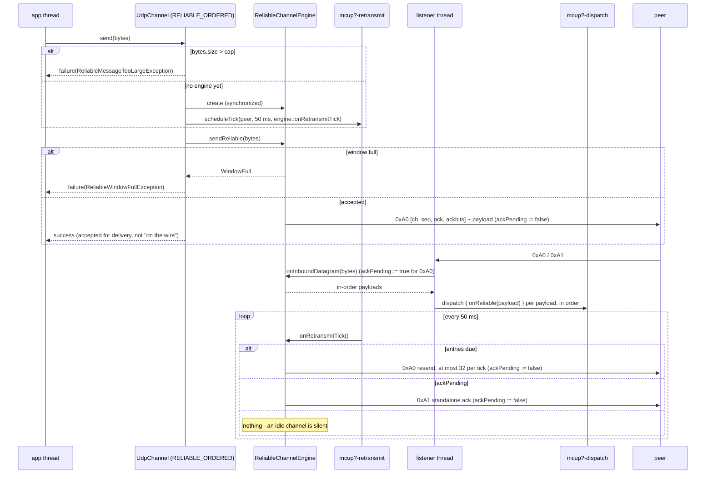

# Issue #14, Stage 3 — the public reliable channel API for `webtools-udp` 2.0.0

## Header / Association

- **Covers:** `SpartanLaboratories/WebTools#14` — *"Design discussion: a
  reliable-ordered sub-channel over the UDP transport"* (labels: `enhancement`,
  `question`). The maintainer resolved every design decision D1–D10 on
  2026-09-09 (design doc §13) and accepted the feature as the headline of
  `webtools-udp` **`2.0.0`**.
- **What this document is:** the **Stage 3** implementation plan of the staged
  `2.0.0-alphaN` series (design doc §12, item 3) — the **public channel API**
  (`DeliveryMode` / `UdpChannel`), its typed failures, and the socket plumbing
  that finally drives the Stage-2 engine. It is **the third of the four stage
  PRs** in the series: Stage 1 merged as **PR #30**, Stage 2 as **PR #32**
  (PRs #31 and #33 were doc-only header backfills and are not stages). Stage 4
  (docs + version finalisation) is not designed here — see §11.
- **Approved design:** `docs/issue-14-reliable-ordered-channel-design.md`
  §5 (API shape, Option A), §6.4 (dispatch), §7.5–§7.8 (window, size cap,
  teardown, flow), §8 (size cap), §9 (v1 scope), §13 (D2, D5, D6, D7).
  This plan turns those into a file-by-file change set and a 5-level test
  matrix for the public-API slice specifically.
- **Baseline:** `webtools-udp` `2.0.0-alpha2` on `feat/2.0-framed-transport`
  (Stage 1 merged as `5628fd8`, Stage 2 as `3519276`). Working tree clean at
  planning time.
- **Branch model:** the long-lived `2.x` integration branch
  `feat/2.0-framed-transport` (off `master`); this stage lands on a Stage-3
  branch **`feat/issue-14-reliable-channel-api`** off the integration branch,
  deleted after merge. The PR targets **`feat/2.0-framed-transport`**, never
  `master`.
- **This plan document** is committed in the same commit as the first Stage-3
  implementation commit, so `git log --follow` binds plan to code.
- **Branch:** `feat/issue-14-reliable-channel-api`
- **Commit:** TBD
- **PR:** TBD
- **Status:** planning only — no source, test, or build file touched by this
  document. **Every decision is resolved** — OD-1–OD-5 and OD-4a, all
  2026-09-18 (§10), together with the withdrawal of the standing clean-break
  policy. Nothing is outstanding; the plan is ready to hand to an implementer.
- **Revised 2026-09-20 after a verification pass** against the Stage-3 working
  tree. Two kinds of change, both recorded in **§12**: *(a)* seven passages
  corrected to match what the implementation actually (and correctly) does —
  A1–A7; *(b)* five **required fixes** the pass found — B2, B3, B5, B6, B7 —
  now written into the sections they belong to and binding on the implementer.
  §12 is the hand-off checklist; the body sections are the specification.
- **Revised again 2026-09-20 after a QA gate on the §6 test matrix.** Two
  defects in the matrix, not in the design, recorded as **D1–D2 in §12**: the
  OD-1 server-wide conveniences `startReliable` / `pushToAllReliable` had **no
  test allocated at any level**, and the B3 row named the wrong covering file.
  The fixes are two new/extended §6 rows; **test code is owed, nothing else.**
- **Target version:** `webtools-udp` `2.0.0-alpha2` → **`2.0.0-alpha3`** (§8).
  New public API, no new wire format (the `0xA0`/`0xA1` frames Stage 2 already
  defined go live on the socket for the first time). The Maven Central
  **publish** of `2.0.0-alpha3` stays a separate maintainer-gated step, per the
  Stage-1 OD-3 precedent — this plan covers the `version` declaration and the
  PR only.
- **Related docs:**
  - `docs/issue-14-reliable-ordered-channel-design.md` — the accepted design.
  - `docs/issue-14-reliable-ordered-channel-plan.md` — the Stage-1 plan
    (framing prefix); the structural template for this document.
  - `docs/issue-14-reliable-engine-plan.md` — the Stage-2 plan (internal
    engine); its §11 is this stage's starting brief.
  - `docs/issue-13-link-quality-probe-plan.md` — the `PeriodicScheduler` and
    RFC 6298 RTT machinery this stage hangs the retransmit tick onto.
  - `docs/issue-12-scheduled-keepalive-plan.md` — the lazily-created
    per-role scheduler idiom (`mcup{c,s}-keepalive`) this stage mirrors for
    `mcup{c,s}-retransmit`.

---

## 1. Context

### 1.1 Requirements / acceptance criteria

From design §5 / §7 / §8 / §9, D2 / D5 / D6 / D7, and the §12 definition of
Stage 3:

1. **A public channel-handle API (design D2, Option A).** `DeliveryMode`
   (`UNRELIABLE`, `RELIABLE_ORDERED`) and `UdpChannel` (`send` / `actuate`),
   reachable as `connection.channel(mode)` on the server side and
   `client.channel(mode)` on the client side.
2. **`Connection.channel` grows the published interface additively** — a
   **default-bodied** member, never an abstract one, per the #11/#12/#13
   idiom, so every existing `Connection` implementation (including consumer
   fakes) still compiles.
2a. **The old per-endpoint primitives are deprecated, not removed** (OD-4 and
   OD-4a, §3.11): four on `Connection` (`push(String)`, `push(ByteArray)`,
   `actuate`, `actuateBytes`) and four on `MultiConnectionUDPClient`
   (`send(String)`, `send(ByteArray)`, `start`, `startBytes`) ship fully
   working in `2.0.0` under `@Deprecated(WARNING)` with a `ReplaceWith` that
   compiles and preserves behaviour. The server-wide `start` / `startBytes` /
   `pushToAll` are **not** deprecated — they have no per-`Connection`-free
   replacement to point at.
2b. **Server-wide reliable conveniences ship** (OD-1, §4.10):
   `startReliable` and `pushToAllReliable`, the latter attempting every peer
   rather than short-circuiting.
3. **The reliable message-size cap (design D5):** default **1024 B** of
   application payload, configurable up to a hard maximum of **8192 B**;
   an oversize send fails with a typed `ReliableMessageTooLargeException`
   carried in `Result.failure`.
4. **In-flight-window backpressure (design D6):** a full window fails the send
   immediately with a typed `ReliableWindowFullException` in `Result.failure` —
   no internal absorb queue.
5. **Wire the Stage-2 `ReliableChannelEngine` into the real transport:**
   `UDPConnection` / `HandshakeCoordinator` / `MultiConnectionUDPClient` /
   `MultiConnectionUDPServer`. The `0xA0` / `0xA1` branches that Stage 2 left
   WARN/DEBUG-dropping become real dispatch.
6. **Create the lazily-created `mcup{c,s}-retransmit` `PeriodicScheduler`**
   that `ReliableChannelEngine.onRetransmitTick` was shaped for — one per side,
   its executor/thread created only once a reliable channel is actually used,
   mirroring `mcup{c,s}-keepalive` / `mcup{c,s}-probe`.
7. **Reliable delivery goes through the existing dispatch executor**
   (`mcup{c,s}-dispatch`), so the per-connection ordering contract holds and a
   slow reliable handler cannot stall the listener (design §6.4).
8. **Teardown discards un-acked reliable data** (design §7.7): `terminate()`,
   supersede, client `stop()`, and server `stop()` all cancel the retransmit
   tick and `close()` the engine; a send after teardown fails its `Result`.
9. **Zero cost when unused.** A consumer that never opens a reliable channel
   gets no engine, no buffers, no retransmit thread — exactly the
   keepalive/probe precedent.
10. **Out of Stage 3:** the README "reliable-ordered channel" *reference*
    section, the `docs/` protocol reference, the architecture section and the
    design §7.8 sequence diagram, and the `2.0.0` final cut — all Stage 4.
    Congestion control, fragmentation, multiple reliable channels, and session
    resume are out of `2.0.0` permanently (design §14, D7, D9).

### 1.2 The `Result`-vs-typed-exception question, reconciled

The scope brief flags an apparent clash: design D5/D6 name
`ReliableWindowFullException` / `ReliableMessageTooLargeException`, while
`.aiassistant/rules/CLAUDE.md` §2 says *"never throw raw exceptions for expected
failures"* and *"encapsulate all operational failures using the native `Result`
class"*.

**There is no genuine conflict, and this plan does not treat it as one.** The
rule forbids *throwing*; `Result.failure` structurally *requires* a `Throwable`
payload. A named exception subclass that is only ever constructed as a
`Result.failure` value is the rule's own idiom, and the repo already does
exactly this twice:

- `HandshakeRefusedException` — constructed only at
  `MultiConnectionUDPClient.kt:237`, inside `Result.failure(...)`; never
  `throw`n anywhere in the module.
- `IncompatibleProtocolException` — constructed only at
  `MultiConnectionUDPClient.kt:240`, likewise inside `Result.failure(...)`.

Stage 3's two new exception types are built to the same contract: **public,
documented, constructed only inside `Result.failure`, never thrown**, with the
KDoc stating that in as many words. The one genuine API call this left — whether
a caller should be able to branch over them as a hierarchy — was **resolved on
2026-09-18** (§10 OD-2): they share a common, deliberately **open**, `abstract`
supertype `ReliableSendFailure`, and `send` still returns `Result<Unit>`. §2
records why that middle path rather than the sealed hierarchy KEEP-0127
recommends.

### 1.3 Two findings from the merged code that shape this stage

Both were found by reading the merged Stage-1/Stage-2 code, not by reading the
plans; neither is in the design doc.

**(a) `PeriodicSchedule.schedule` cannot express a fast tick.**
`PeriodicScheduler.schedule(key, intervalMillis, tick)`
(`PeriodicScheduler.kt:61-73`) does **not** run `tick` every `intervalMillis`;
it runs it every `KeepAlive.pollIntervalMillis(intervalMillis)` — i.e.
`intervalMillis / 4`, **clamped to `250..5000` ms** (`KeepAlive.kt:25-26`). The
keepalive tick compensates by re-checking `KeepAlive.isDue` inside the task;
the probe tick does not. So the fastest tick this seam can produce today is
**250 ms** — far too coarse against the reliable channel's 200 ms RTO floor,
and impossible to express exactly. §3.5 adds an explicit `scheduleTick` method
to the `internal` `PeriodicSchedule` seam rather than abusing the keepalive
poll semantics. (The *probe*'s own consequence of this — it emits `0x81` at the
poll cadence, not the documented interval — is a **pre-existing defect outside
this stage's scope**; see §7 and §11.)

**(b) `ReliableChannelEngine.onRetransmitTick` emits a standalone ack on
*every* idle tick.** Its `else if (ack != SENTINEL_ACK || ackBitfield !=
SENTINEL_ACK_BITFIELD)` branch (`ReliableChannelEngine.kt:141-144`) is true
forever once the first inbound reliable datagram has been seen. Unwired, that
was invisible; wired to a real socket at a fast tick it would emit a
standalone `0xA1` several times a second, **forever**, on a channel that is
completely idle. That is not merely chatty — an outbound `0xA1` from the server
is an *inbound* datagram at the client and vice versa, so it would refresh
`Registration.lastInboundAt` on every sweep and **silently defeat Issue #10
idle detection** for any connection with an open reliable channel. §3.6 adds
the standard delayed-ack "pending" guard (RFC 1122 §4.2.3.2) so an ack is
emitted only when there is something new to acknowledge.

---

## 2. Prior art & best practices

Design §3 already surveyed the reliable-UDP library landscape and Stage 2
reused its algorithm sources (Gaffer/Fiedler selective ack, RFC 6298, RFC
1982). For the **public API shape specifically**, the research for this stage
adds:

- **Delivery mode is a per-call argument in *every* mature library checked —
  the handle shape is genuinely unprecedented here.** ENet:
  `enet_peer_send(peer, channelID, packet)`, reliability a per-packet
  `ENET_PACKET_FLAG_RELIABLE`
  ([docs](http://enet.bespin.org/group__peer.html)). LiteNetLib:
  `NetPeer.Send(data, channelNumber, deliveryMethod)` — channel and mode as two
  independent per-call parameters
  ([`NetPeer`](https://revenantx.github.io/LiteNetLib/api/LiteNetLib.NetPeer.html)).
  Lidgren: `NetConnection.SendMessage(msg, method, sequenceChannel)`
  ([docs](https://documentation.help/Lidgren.Network/98849292-699e-4e0f-cc9d-e4896f44071d.htm)).
  Godot: a mutable `transfer_mode` / `transfer_channel` property set *before*
  a parameterless `put_packet`
  ([`MultiplayerPeer`](https://docs.godotengine.org/en/stable/classes/class_multiplayerpeer.html)).
  Steamworks: `SendMessageToConnection(hConn, pData, cbData, nSendFlags, …)`,
  with "lanes" (`ConfigureConnectionLanes`) also selected **per message**, not
  held as a handle
  ([`isteamnetworkingsockets.h`](https://raw.githubusercontent.com/ValveSoftware/GameNetworkingSockets/master/include/steam/isteamnetworkingsockets.h)).
  **No surveyed library hands out a persistent channel object.** D2 resolved in
  favour of the handle anyway and this plan implements that resolution — but
  the absence of precedent is precisely why §3.1 keeps the handle a *thin,
  stateless view* over primitives that remain first-class (§3.8, §10 OD-4)
  rather than the only way to send. Treat this as a gap in the evidence, not a
  refutation of D2.
- **Inbound routing is one path with metadata, never a callback per mode.**
  ENet dequeues with `enet_peer_receive(peer, &channelID)` — one receive path,
  channel returned as an out-param. LiteNetLib's
  `OnNetworkReceive(peer, reader, channelNumber, deliveryMethod)` carries both
  as arguments
  ([`INetEventListener`](https://github.com/RevenantX/LiteNetLib/blob/master/LiteNetLib/INetEventListener.cs)).
  Godot exposes `get_packet_channel()` / `get_packet_mode()` describing the
  packet just polled. **No library asks the application to bind a separate
  callback per mode**, which is what §3.2 does. The trade-off is accepted for
  v1 (it keeps the API small and lets the two planes be handled by genuinely
  different code, which is the point of the split) — but §11 records that the
  later multi-channel stage will want the channel id surfaced to the handler,
  the shape everyone else already uses; the wire byte is already reserved.
- **Backpressure is reported synchronously as a closed set of outcomes.**
  Lidgren returns `enum NetSendResult { FailedNotConnected, Sent, Queued, Dropped }`
  ([source](https://github.com/lidgren/lidgren-network-gen3/blob/master/Lidgren.Network/NetSendResult.cs));
  Steamworks returns an `EResult` distinguishing `k_EResultLimitExceeded`
  ("already too much data queued to be sent" — the window-full signal) from
  `k_EResultInvalidParam` (message too large) and `k_EResultInvalidState` /
  `k_EResultNoConnection`
  ([header](https://raw.githubusercontent.com/ValveSoftware/GameNetworkingSockets/master/include/steam/isteamnetworkingsockets.h));
  ENet collapses everything into `-1`
  (`peer->state != ENET_PEER_STATE_CONNECTED || channelID >= channelCount ||
  dataLength > maximumPacketSize`). **None blocks, and none drops silently.**
  D6's immediate typed failure matches the two most explicit precedents; the
  fact that both express it as a *closed enum of outcomes* rather than an
  exception payload is the substance of §10 OD-2.
- **`kotlin.Result` as a public return type is fully supported** since Kotlin
  1.5; the 1.3–1.4 restriction and `-Xallow-result-return-type` are gone, and
  the Kotlin team explicitly abandoned the language-level integration the
  restriction was reserving room for
  ([KEEP-0127](https://github.com/Kotlin/KEEP/blob/main/proposals/stdlib/KEEP-0127-result.md)).
  Residual caveats, all of which **already apply to every public member of this
  module** so Stage 3 adds no new interop cost: `Result` is a `@JvmInline value
  class`, so `Result<Unit>` is boxed in generic position
  ([inline classes](https://kotlinlang.org/docs/inline-classes.html)), and a
  Java caller sees a bare `Object` it must cast, with the success payload
  arriving as `kotlin.Unit.INSTANCE` rather than `void`.
- **The Kotlin team's own guidance argues *against* exception-typed
  `Result` failures — recorded here because it bears directly on §10 OD-2.**
  KEEP-0127 states that `Result` "is **not** designed to represent
  domain-specific error conditions," and uses a near-identical scenario
  (`fun findUserByName(name: String): Result<User> // ERROR`) as its own
  counter-example, recommending a **sealed class hierarchy** wherever there is
  "a business need to distinguish different failures and process them in
  distinct ways" — which is exactly what `ReliableWindowFullException` vs
  `ReliableMessageTooLargeException` is for. Elizarov reinforces the same
  split (sealed hierarchies for multi-mode failures, nullables for yes/no)
  ([Kotlin and Exceptions](https://elizarov.medium.com/kotlin-and-exceptions-8062f589d07)).
  This did **not** override `.aiassistant/rules/CLAUDE.md` §2, which mandates
  `Result` for operational failures and which the repo already implements this
  way twice (§1.2). **Resolved 2026-09-18 on a middle path the KEEP does not
  discuss:** `send` keeps returning `Result<Unit>` — so the module's error
  protocol is untouched and the KEEP's "don't model domain errors *as* the
  result type" concern is not what is at stake — while the two failure payloads
  gain a **common, deliberately open, `abstract` supertype**
  (`ReliableSendFailure`). That answers the KEEP's actual motivation (a caller
  that must distinguish failure modes can do so against types, not string
  matching) without taking on what the KEEP's sealed recommendation costs a
  *published* library: exhaustiveness that every future failure mode would
  break. The KEEP contrasts only two shapes — `Result` + opaque exceptions, or
  a sealed domain type — and does not consider an open exception hierarchy
  carried inside `Result`. Recorded here so a later reader does not mistake
  this for the guidance being overlooked; see §10 OD-2 for the full resolution.
- **A `Throwable` costs its stack trace at *construction*, not at throw.**
  `fillInStackTrace()` runs when the exception object is created, so a
  `Result.failure(ReliableWindowFullException(...))` on a hot backpressure path
  pays the full cost of a thrown exception while never throwing
  ([Shipilëv, *Exceptional Performance*](https://shipilev.net/blog/2014/exceptional-performance/)).
  §4.3 therefore overrides `fillInStackTrace()` to return `this` on
  `ReliableWindowFullException` — the established no-op pattern for an
  exception used as a control-flow value — since a game loop can hit a full
  window every frame. `ReliableMessageTooLargeException` keeps its trace: it
  signals a programming or configuration mistake, where the trace is the
  diagnostic.
- **Delayed ACK, not per-tick ACK.** TCP's rule (RFC 1122 §4.2.3.2 —
  [RFC 1122](https://www.rfc-editor.org/rfc/rfc1122#section-4.2.3.2)) is that
  an ack is sent only when there is something to acknowledge, within a bounded
  delay. §3.6's `ackPending` guard is that rule, and it is what stops the idle
  `0xA1` heartbeat found in §1.3(b).
- **Send-after-disconnect is a reported outcome everywhere, never a silent
  no-op and never an exception.** ENet returns `-1` when
  `peer->state != ENET_PEER_STATE_CONNECTED`; Lidgren returns
  `NetSendResult.FailedNotConnected`; Steamworks returns
  `k_EResultInvalidState` / `k_EResultNoConnection`. Notably all three treat
  "not connected" as **the same kind of outcome** as "window full" — one result
  space, not an error channel. §3.3/§3.7 match that: a `UdpChannel` held across
  a `terminate()`, `stop()`, or supersede returns
  `Result.failure(IllegalStateException(...))` rather than silently buffering
  into a dead engine. (Handle *lifetime* itself has no precedent to borrow —
  no surveyed library exposes a channel handle separate from the connection,
  so §3.3's "the handle is a stateless view; the engine it reaches is what gets
  torn down" is our own call.)
- **Dispatch the inbound handler off the network thread, and say so in the
  KDoc.** LiteNetLib runs I/O on its own thread but queues events and fires
  `INetEventListener` callbacks only from the application's `PollEvents()` call
  ([issue #1](https://github.com/RevenantX/LiteNetLib/issues/1)); Steamworks
  documents that the one callback which *can* fire from any thread "MUST be
  fast and threadsafe." This module already has the stronger version of that
  guarantee — the single-threaded `mcup{c,s}-dispatch` executor — so §3.2
  keeps reliable delivery on it rather than inventing a second thread, and
  `UdpChannel.actuate`'s `@param` states the threading contract explicitly.

---

## 3. Design

### 3.1 The public surface

Three new public types, plus one new default-bodied member on `Connection` and
one new member on `MultiConnectionUDPClient`.

```kotlin
/** Which delivery guarantee a [UdpChannel] provides. */
enum class DeliveryMode { UNRELIABLE, RELIABLE_ORDERED }

/**
 * A delivery-mode-scoped view of one connection: send under this mode's
 * guarantees, and bind the handler for traffic that arrives under it.
 * Stateless and cheap - hold it, or fetch it per call; either is correct.
 */
interface UdpChannel {
    /** The delivery guarantee this handle provides. */
    val mode: DeliveryMode

    /**
     * Sends [bytes] under [mode]'s guarantees.
     *
     * For [DeliveryMode.RELIABLE_ORDERED], `Result.success` means **accepted
     * for reliable delivery** - buffered, sequenced, and retransmitted until
     * acked - not "already on the wire".
     */
    fun send(bytes: ByteArray): Result<Unit>

    /** UTF-8 convenience over [send]`(ByteArray)`. */
    fun send(message: String): Result<Unit> = send(message.toByteArray(Charsets.UTF_8))

    /**
     * Binds [onMessage] as the raw-bytes handler for inbound traffic on this
     * channel: an exact-length, undecoded, untrimmed copy of each message.
     * Per-mode: binding a reliable handler does not disturb the unreliable
     * one, and vice versa.
     */
    fun actuateBytes(onMessage: (bytes: ByteArray) -> Unit): Result<Unit>

    /**
     * Binds [onMessage] as the **text** handler for inbound traffic on this
     * channel: each message decoded as UTF-8 and `.trim()`ed, matching
     * [Connection.actuate]'s long-standing semantics exactly. For a binary or
     * whitespace-significant payload use [actuateBytes].
     */
    fun actuate(onMessage: (message: String) -> Unit): Result<Unit> =
        actuateBytes { onMessage(String(it, Charsets.UTF_8).trim()) }

    companion object {
        /** Default maximum reliable application payload, in bytes (design D5). */
        const val DEFAULT_MAX_RELIABLE_MESSAGE_BYTES = 1024

        /** Hard ceiling a consumer may raise the cap to, in bytes (design D5). */
        const val MAX_RELIABLE_MESSAGE_BYTES = 8192
    }
}
```

`channel(...)` is an **accessor, not a fallible operation** — it always returns
a handle; the `Result` lives on `send` / `actuate` / `actuateBytes`, exactly
where the repo puts it for `startKeepAlive` / `startProbe`. That keeps the
design doc's §5 Option A signature verbatim *and* the `Result` rule intact.

**Why the handler members are named `actuate` (String) / `actuateBytes` (bytes),
not a single `actuate(ByteArray)`.** *(Ratified by the maintainer 2026-09-18 —
see §7; design doc §5's sketch is superseded on this point.)*
The design doc's §5 sketch showed
`actuate(onMessage: (ByteArray) -> Unit)`, which would have **inverted this
module's own vocabulary** — `Connection.actuate` has always meant *text* and
`actuateBytes` *bytes* — so a consumer migrating off `Connection.actuate` would
meet a same-name member taking a different lambda type: code that compiles,
reads identically, and silently hands them bytes. Worse, OD-4 (§10) now
requires `Connection.actuate` to carry a `ReplaceWith` that **compiles**, and a
`(String) -> Unit` handler cannot be replaced by a `(ByteArray) -> Unit` one.
Adding a String *overload* beside the ByteArray one is not available either:
two overloads differing only in lambda parameter type make `channel.actuate { }`
an overload-resolution ambiguity at the call site — which is presumably why
`Connection` uses two distinct names in the first place.

So the channel mirrors `Connection` exactly: **`actuateBytes` is the single
abstract member** (verbatim bytes) and **`actuate` is a default** over it
(UTF-8 + `.trim()`). This is not merely convention-matching — it makes the
OD-4 replacement *semantically faithful*, because
`channel(UNRELIABLE).actuate(h)` ends up binding the bytes slot and trimming in
the wrapper, which is byte-for-byte the same observable behaviour as
`Connection.actuate(h)` binding the text slot and letting `deliverData` trim
(`HandshakeCoordinator.kt:168`). One trim either way, same string.

The send direction keeps the **overloaded** `send(ByteArray)` / `send(String)`,
because those differ in a non-lambda parameter type and so resolve
unambiguously — and because `Connection` itself overloads `push(String)` /
`push(ByteArray)`. The resulting asymmetry (send overloaded, actuate split by
name) is precisely the asymmetry `Connection` already has.

```kotlin
interface Connection {
    // ...existing members unchanged...

    /**
     * The delivery-mode-scoped handle for this connection. Each mode has its
     * own sequence space and its own inbound handler.
     *
     * The default implementation returns a working [DeliveryMode.UNRELIABLE]
     * handle over [push]/[actuateBytes], and, for
     * [DeliveryMode.RELIABLE_ORDERED], a handle whose operations fail with
     * [UnsupportedOperationException] - only the production [UDPConnection]
     * carries a reliable channel.
     */
    fun channel(mode: DeliveryMode): UdpChannel = when (mode) {
        DeliveryMode.UNRELIABLE -> UnreliableConnectionChannel(this)
        DeliveryMode.RELIABLE_ORDERED -> UnsupportedUdpChannel(
            DeliveryMode.RELIABLE_ORDERED,
            "This Connection has no reliable-ordered channel",
        )
    }
}
```

and, mirroring it on the client side:

```kotlin
class MultiConnectionUDPClient {
    /** The delivery-mode-scoped handle for this client's session with the server. */
    fun channel(mode: DeliveryMode): UdpChannel
}
```

Two new public exception types, sibling in style to `HandshakeRefusedException`
and constructed **only** inside `Result.failure` (§1.2):

```kotlin
/**
 * The supertype of every failure a reliable [UdpChannel.send] can report.
 * Open, not sealed, so a future failure mode can join in a minor version
 * without breaking an exhaustive `when`; `abstract` because nothing should
 * construct or throw the bare supertype (OD-2, resolved 2026-09-18).
 */
abstract class ReliableSendFailure(message: String) : Exception(message)

/**
 * The reliable in-flight window is full - [inFlight] messages are already
 * awaiting acknowledgement. Never thrown; only ever the payload of a
 * [Result.failure] from `UdpChannel.send` on a reliable channel.
 */
class ReliableWindowFullException(val inFlight: Int) : ReliableSendFailure(
    "The reliable in-flight window is full ($inFlight message(s) unacked); retry, coalesce, or drop",
)

/**
 * A reliable message exceeded the configured cap. Never thrown; only ever the
 * payload of a [Result.failure] from `UdpChannel.send` on a reliable channel.
 */
class ReliableMessageTooLargeException(val sizeBytes: Int, val capBytes: Int) : ReliableSendFailure(
    "Reliable message of $sizeBytes byte(s) exceeds the $capBytes-byte cap; " +
        "v1 does not fragment - split it or raise reliableMaxMessageBytes (max " +
        "${UdpChannel.MAX_RELIABLE_MESSAGE_BYTES})",
)
```

A caller who wants to branch writes
`when (val e = result.exceptionOrNull()) { is ReliableWindowFullException -> …; is ReliableMessageTooLargeException -> … }`;
a caller who only wants "the send was rejected for a reliable-channel reason"
checks `is ReliableSendFailure` once. `send` still returns `Result<Unit>`, so
the module's error protocol is unchanged.

### 3.2 Handler binding: a third handler slot, not a third meaning for the old ones

`Registration` today holds two mutually-exclusive handler slots (`onMessage`
text / `onBytes` raw, `Registrations.kt:43-47`) — binding one clears the other.
The reliable handler is **a third, independent slot**: the reliable and
unreliable sequence spaces are independent, so their handlers must be too.

- `Registration` gains `@Volatile var onReliable: ((ByteArray) -> Unit)?`.
- `channel(RELIABLE_ORDERED).actuateBytes(h)` sets **only** `onReliable`; its
  `actuate(String)` default wraps the same slot with a UTF-8 decode + trim.
- `channel(UNRELIABLE).actuateBytes(h)` delegates to the existing
  `actuateBytes` / `bindBytes`, so it keeps the existing text/bytes mutual
  exclusion — unchanged behaviour. `channel(UNRELIABLE).actuate(h)` therefore
  also lands on the *bytes* slot (trimming in the wrapper) rather than the text
  slot; §3.1 shows why that is observationally identical to today's
  `Connection.actuate`, which is what makes OD-4's `ReplaceWith` honest.
- `deliverReliable` mirrors `deliverData`: hand each delivered payload to the
  **dispatch executor**, in order, wrapped in `runCatching` so a throwing
  handler cannot kill `mcup{c,s}-dispatch`. No handler bound ⇒ DEBUG-log and
  drop, exactly as `deliverData` already does (`HandshakeCoordinator.kt:273`).

An important consequence of dispatching through the same single-threaded
executor: **reliable and unreliable delivery to one connection are serialised
relative to each other**, and the reliable stream's own order is the engine's
in-order output. That is the design §6.4 contract, and it is why reliable
delivery must not be hoisted onto its own thread.

### 3.3 Engine lifecycle: lazily created, on either side, by either trigger

One `ReliableChannelEngine` per direction-pair per connection — i.e. one per
`Registration` on the server and one per `MultiConnectionUDPClient`.

It is created lazily on the **first** of:

1. a `channel(RELIABLE_ORDERED).send(...)` or `.actuate(...)` call, or
2. an inbound `0xA0` / `0xA1` datagram for that peer.

Trigger (2) is not optional. If only trigger (1) created the engine, a peer
that opened a reliable channel and sent would get no acks from a peer whose
application never called `channel(RELIABLE_ORDERED)` — the sender's window
would fill and never drain. Creating on inbound makes the receiving side ack
correctly regardless of whether its application ever opened the channel;
delivered payloads with no bound handler are DEBUG-dropped (§3.2), which is
the right shape for "the peer is using a feature I am not listening to".

Creation is `@Synchronized` so two threads (a listener-thread inbound and an
app-thread send) cannot mint two engines for one peer. Creating the engine
**also arms the retransmit tick** for that peer (§3.5) — the two are one unit.

**The two sides are deliberately asymmetric about trigger (1), and are to stay
that way.** *(Recorded 2026-09-20; endorses what the implementation does —
see §12 A6.)*

| Side | `send` on the reliable handle | `actuateBytes` / `actuate` on the reliable handle |
|---|---|---|
| **Server** (`HandshakeCoordinator.bindReliable`, §4.9) | mints the engine, arms the tick | **also** mints the engine and arms the tick |
| **Client** (`MultiConnectionUDPClient`, §4.11) | mints the engine, arms the tick | binds `deliverReliable` and calls `ensureListening()` only — **no engine, no tick** until the first send or the first inbound `0xA0`/`0xA1` |

The client's laziness is the better behaviour of the two, not an oversight, and
it is safe for a reason that does not transfer to the server: a client has
exactly **one** peer, and the very call that binds the handler also starts the
listener, so the inbound trigger (2) in `receiveLoop` is guaranteed to be armed
and watching before any reliable datagram can arrive. A receive-only client
whose server never opens the channel therefore allocates nothing at all —
design §9's zero-cost promise in its strictest form. The server cannot lean on
the same argument: `actuateAllReliable` binds across *many* registrations, and
`bindReliable` is reachable per-peer, so minting there is the simple, uniform
rule. **Do not "fix" the client to match the server.** The only thing both
sides must guarantee is that an inbound `0xA0`/`0xA1` mints the engine, and
both do.

Teardown (design §7.7 — un-acked data is discarded, no lingering):

| Trigger | What happens |
|---|---|
| `Connection.terminate()` → `HandshakeCoordinator.deregister(peer)` | cancel the retransmit tick for `peer`; `engine.close()`; drop `onReliable` with the registration |
| same-name supersede (`handleHandshake`) | same, beside the existing `keepAliveSchedule.cancel` / `probeSchedule.cancel` calls |
| `MultiConnectionUDPServer.stop()` | `coordinator.shutRetransmit()` alongside `shutKeepAlive()` / `shutProbe()` |
| `MultiConnectionUDPClient.stop()` | `retransmit.shutdown()` and `reliableEngine?.close()`, as **two independent `runCatching` steps** — never one block, see §4.11 |
| idle `TIMEOUT` | **nothing** — `TIMEOUT` is notify-only and leaves the registration addressable (`MultiConnectionUDPServer` KDoc), so the channel survives exactly as `pushToAll` does |

Per D7, a **supersede resets the channel**: the new registration gets a fresh
engine with fresh sequence spaces. Session resume is deferred.

### 3.4 Inbound dispatch — the `0xA0` / `0xA1` branches go live

Both listeners currently WARN/DEBUG-drop `RELIABLE_DATA` / `RELIABLE_ACK`
(`HandshakeCoordinator.kt:176-179`, `MultiConnectionUDPClient.kt:359-363`).
Those branches become:

**Server (`HandshakeCoordinator.classify`):**

```
DatagramType.RELIABLE_DATA, DatagramType.RELIABLE_ACK -> {
    val reg = registrations.findByOrigin(origin)
        ?: return Result.success(Unit).also { log.debug("Reliable datagram from unregistered {}, dropped", origin) }
    val delivered = reliableEngineFor(reg).onInboundDatagram(bytes)   // never throws (Stage 2 contract)
    deliverReliable(reg, delivered)                                    // dispatch-executor, in order
}
```

**Client (`receiveLoop`)** — the origin guard below is **required**, not
optional *(added 2026-09-20; see §12 B2)*:

```
DatagramType.RELIABLE_DATA, DatagramType.RELIABLE_ACK -> {
    if (origin != serverEndpoint) {                      // mirrors the server's findByOrigin guard
        log.debug("Reliable datagram from non-server origin {}, dropped", origin)
    } else {
        reliableEngine().onInboundDatagram(bytes).forEach { payload -> dispatch { deliverReliable(payload) } }
    }
}
```

Ack processing therefore runs **on the listener thread** (cheap, bounded,
`@Synchronized` inside the engine) and delivery on the dispatch executor —
precisely design §6.4.

**Both sides screen the origin before the engine is touched.** On the server
`registrations.findByOrigin(origin)` already does it, so a stranger cannot make
it allocate an engine or a retransmit schedule. The client's socket is an
unconnected `DatagramSocket`, so it will happily read a datagram from *any*
source; without the guard above, one stray or spoofed `0xA0` would mint this
client's engine, its 256-slot buffers and its `mcupc-retransmit` thread, feed
attacker-chosen bytes into the reorder buffer, and hand payloads to the
application's reliable handler. The client knows its one legitimate peer
(`serverEndpoint`, `MultiConnectionUDPClient.kt:217`), so the check costs one
`InetSocketAddress.equals`.

Two implementation consequences, both load-bearing:

- **`receiveLoop` must carry the origin out of its `runCatching` block.** It
  currently returns only `packet.data.copyOf(packet.length)`; the block must
  yield the origin alongside the bytes (e.g. `packet.socketAddress to
  packet.data.copyOf(packet.length)`, destructured in `onSuccess`). The
  exact-length copy stays exactly as it is — the `DatagramPacket` and its
  backing buffer must not escape the block.
- **Scope is the reliable branch only.** The keepalive / probe / `0x90`
  branches keep today's behaviour; they are the pre-existing contract and
  allocate nothing per origin. Widening the guard to every branch is a separate
  change and is not part of this stage.

### 3.5 The `mcup{c,s}-retransmit` schedulers, and an honest tick seam

Each side gets one more lazily-created `PeriodicScheduler`, exactly mirroring
keepalive and probe:

- `MultiConnectionUDPServer`: `private val retransmitScheduler = PeriodicScheduler("mcups-retransmit")`,
  injected into `HandshakeCoordinator` as a new `retransmitSchedule: PeriodicSchedule`
  constructor parameter, shut in `stop()`.
- `MultiConnectionUDPClient`: `PeriodicScheduler("mcupc-retransmit")` supplied
  by the public constructor to the `internal` seam constructor as a new
  `retransmit: PeriodicSchedule` parameter, shut in `stop()`.

Because `PeriodicSchedule.schedule` cannot express a sub-250 ms cadence
(§1.3(a)), the `internal` seam gains one method rather than having the
retransmit caller pass an obfuscated `intervalMillis * 4`:

```kotlin
internal interface PeriodicSchedule {
    // ...schedule / cancel / shutdown unchanged...

    /**
     * Arms (or re-arms) a repeating task for [key] that runs every
     * [tickMillis], with **no** keepalive-style poll division - the cadence
     * asked for is the cadence delivered. The last call for a [key] wins, and
     * [key]'s task is cancelled by the same [cancel] as [schedule]'s.
     * @return [Result.failure] with [IllegalArgumentException] for a
     * non-positive [tickMillis], or [IllegalStateException] after [shutdown]
     */
    fun scheduleTick(key: InetSocketAddress, tickMillis: Long, tick: () -> Unit): Result<Unit>
}
```

`PeriodicScheduler` implements it by factoring the existing body into a private
`arm(key, pollMillis, tick)`; `schedule` calls
`arm(key, KeepAlive.pollIntervalMillis(intervalMillis), tick)` (byte-identical
behaviour to today) and `scheduleTick` calls `arm(key, tickMillis, tick)`.
No existing behaviour changes.

**Tick cadence: 50 ms** (`ReliableChannelEngine.DEFAULT_RETRANSMIT_TICK_MILLIS`).
Rationale: the RTO floor is 200 ms, so a 50 ms tick bounds retransmit lateness
at 25 % of the floor; with the §3.6 ack guard an idle channel's tick does
literally nothing, so 20 wake-ups/second on one shared daemon thread costs
nothing measurable. A faster tick buys granularity the 200 ms floor cannot use;
a slower one (the 250 ms this seam would otherwise force) would add up to a
full RTO of lateness.

### 3.6 The delayed-ack guard (required, not optional)

Per §1.3(b), `onRetransmitTick`'s standalone-ack branch must fire only when
there is something new to acknowledge. `ReliableChannelEngine` gains one
`Boolean`:

- `ackPending` is set `true` whenever `onInboundDatagram` processes a
  **`RELIABLE_DATA`** frame — *including* a duplicate or out-of-window one.
  Including duplicates is load-bearing: if this side's ack is lost, the peer
  retransmits, and that retransmit arrives as a duplicate. A guard that only
  tracked *state change* would then never re-ack, and the peer would retransmit
  forever. A guard keyed on "an `0xA0` arrived" always re-acks.
- `ackPending` is set `false` whenever this side emits an ack — piggybacked on
  an `0xA0` (a fresh `sendReliable` or a retransmit) or standalone as an `0xA1`.
- `onRetransmitTick` becomes: retransmit everything due (clearing `ackPending`,
  since each carries the ack) — else, **if `ackPending`**, send one standalone
  `0xA1` and clear it — else do nothing at all.
- `close()` clears it.

This is TCP's delayed-ack rule (RFC 1122 §4.2.3.2) with the tick as the delay
bound. The existing sentinel check stays as a second guard so nothing is ever
acked before the first receipt.

### 3.7 Bounded work per tick, and the lock the listener shares

`onRetransmitTick` is `@Synchronized` on the engine, and the listener thread
enters the same lock via `onInboundDatagram`. With a window of 256 and a
black-holed peer, one tick could issue 256 `socket.send` calls while holding
that lock — stalling the *whole server's* single listener thread, not just that
peer's traffic.

`ReliableRetransmitBuffer.dueForRetransmit` therefore gains a `limit: Int`
parameter and returns at most that many entries. The limit must be applied
*inside* `dueForRetransmit`, not by the caller: the method mutates each entry
it returns (bumps `lastSentAtNanos`, increments `retransmitCount`, doubles
`rtoMillis`), so entries dropped after the fact would be marked retransmitted
without ever reaching the wire. Default **32** per tick
(`ReliableChannelEngine.MAX_RETRANSMITS_PER_TICK`), which at the 50 ms tick
drains a full 256-message window in ≤ 400 ms while bounding the lock hold at
32 datagrams. It doubles as crude pacing — not congestion control (D9 stands),
just a ceiling on burst size.

### 3.8 Blast radius: does the old send path move onto `UdpChannel`?

`UdpChannel` is deliberately a **façade over** the existing primitives, not a
replacement for them, so the answer is "no refactor" for almost everything —
but the question is answered here **per file**, not waved past.

**Production — `webtools-udp/src/main/kotlin/com/spartanlabs/webtools/udp/`:**

| Member / call site | Refactor onto `UdpChannel` now? | Why |
|---|---|---|
| `Connection.push(String)` (`Connection.kt:100`) | **Kept as the working primitive, now `@Deprecated(WARNING)`** (§3.11). | `channel(UNRELIABLE)` is implemented *over* it, so it must keep working; the deprecation only points callers at the channel form. |
| `Connection.push(ByteArray)` (`Connection.kt:117`) | **Same — kept, `@Deprecated(WARNING)`.** | It is the default body `UnreliableConnectionChannel.send` calls. |
| `Connection.actuate` / `actuateBytes` (`Connection.kt:42`, `:68`) | **Same — kept, `@Deprecated(WARNING)`.** | Both now have a compiling, semantically faithful channel replacement (§3.1): `actuate` → `channel(UNRELIABLE).actuate`, `actuateBytes` → `channel(UNRELIABLE).actuateBytes`. |
| `UDPConnection.push` / `actuate` / `actuateBytes` (`UDPConnection.kt:38-60`) | **Kept; overrides carry the same `@Deprecated` and a `@Suppress`** (§4.8). | Overriding a deprecated interface member warns at the override site, so each needs suppressing even though the body is unchanged. |
| `UDPConnection.keepAlive` / `startKeepAlive` / `startProbe` / `linkQuality` | **No.** | Control-plane, not a delivery channel. Untouched this stage. |
| `MultiConnectionUDPClient.send(String)` / `send(ByteArray)` (`:391`, `:405`) | **Kept working, now `@Deprecated(WARNING)`** (§10 OD-4a, resolved). | Both re-point at a new private `sendUnreliable` (§4.11), which is also what the client's channel handle calls — so the deprecation introduces no self-warning and the `3.0.0` demotion to `internal` is a modifier change in place. |
| `MultiConnectionUDPClient.start` / `startBytes` (`:268`, `:288`) | **Refactored *internally*, signatures unchanged, and `@Deprecated(WARNING)`** (§10 OD-4a). | Both now route through `ensureListening()` + a `@Volatile` deliver field (§4.11) so `channel(…).actuate*` can start the listener too — which is also what makes their `ReplaceWith` honest, since `start` both binds *and* listens. Externally identical, with one documented improvement: a second `start`/`startBytes` call now rebinds instead of being undefined behaviour. Trim equivalence for `start` → `actuate` verified in §3.12. |
| `MultiConnectionUDPClient.sendDatagram` (`:415`) | **No — reused as-is.** | It is the client-side `sendRaw` handed to the engine. |
| `MultiConnectionUDPServer.pushToAll(String \| ByteArray)` (`:400`, `:413`) | **No — keep, explicitly *not* deprecated.** | Unreliable broadcast. `channel()` is per-`Connection`, so there is no replacement to point a `ReplaceWith` at — OD-4's stated scope limit. Gains a reliable sibling, `pushToAllReliable` (§4.10). |
| `MultiConnectionUDPServer.start` / `startBytes` (`:372`, `:387`) | **No — keep, explicitly *not* deprecated.** | Same reason: bind-on-every-connection conveniences with no per-`Connection` channel equivalent. Gains a reliable sibling, `startReliable` (§4.10). |
| `HandshakeCoordinator.broadcast(String \| ByteArray)` (`:408`, `:418`) | **No — keep.** | Backs `pushToAll`. |
| `HandshakeCoordinator.actuateAll` / `actuateAllBytes` (`:386`, `:398`) | **No — keep.** | Back `start` / `startBytes`. |
| `HandshakeCoordinator.deliverData` (`:254`) | **No — keep; gains a sibling.** | New `deliverReliable` beside it (§3.2); `deliverData`'s body is unchanged. |
| `HandshakeCoordinator.classify` (`:135`) | **Changed** — the `RELIABLE_DATA`/`RELIABLE_ACK` branch (§3.4). | That branch exists only to be replaced here; Stage 2 said so in its own comment. |
| `HandshakeCoordinator.send` / `ClientChannel.send` (`:279`, `ClientChannel.kt:19`) | **No — reused as-is.** | The engine's server-side `sendRaw`. Its `lastOutboundAt` stamp is *desirable*: reliable traffic and retransmits should defer a scheduled keepalive, exactly as any other outbound datagram does. |
| `CommonChannel.send` / `receive` (`CommonChannel.kt`) | **No — untouched.** | Raw socket seam below the framing layer. |
| `UDPSendReceiveServer.kt` | **No — and this is a deliberate decision, not an oversight.** | It is a standalone **two-socket** primitive with no handshake, no registration, and no `Connection`; a reliable channel needs a registered peer and a retransmit key. Giving it one would mean a second, parallel reliability stack. Recorded as an explicit non-goal in its KDoc, not silently skipped. |
| `Registration` / `Registrations.kt` | **Changed** — two new fields (§4.6). | Needed to hold the per-peer engine and reliable handler. |

**Tests** — 27 files exercise the old send/receive path. None of them is
*refactored* onto `UdpChannel`: they are the regression net proving the old
path still behaves identically now that a third delivery plane exists beside
it, and rewriting them onto the new API would delete exactly the coverage that
matters. Three exceptions: `FakeClientChannel` and `FakePeriodicSchedule` must
implement the new `internal` seam members (§4.15); `UDPConnectionTest` /
`HandshakeCoordinatorTest` gain reliable cases alongside their existing ones;
and every test that constructs a `HandshakeCoordinator` directly passes the two
new constructor arguments (`retransmitSchedule = FakePeriodicSchedule()`,
`reliableMaxMessageBytes = UdpChannel.DEFAULT_MAX_RELIABLE_MESSAGE_BYTES`) —
mechanical, but it touches every such file.

**One existing assertion becomes false and must be repointed**
*(recorded 2026-09-20; see §12 A3)*: `component/FramingComponentTest`'s
`a reserved 0xA0 inbound is dropped with a WARN` picked `0xA0` precisely
*because* it was reserved, and this stage makes it live. It moves to **`0xA2`**
— the first tag still reserved in `DatagramType`'s table (`0xA2`–`0xAF`,
"reliable-channel control: SACK ranges, window updates, channel open/close") —
with the test name and a comment updated to say why. This is the only old-path
assertion the stage invalidates; the reserved-tag *behaviour* it guards is
unchanged and must stay covered, so the case is repointed, never deleted. The
new reliable behaviour gets **new** files at every level (§6).

**Docs** — `README.md` gets a proportionate update (§5); the older
`docs/issue-*.md` plans are historical records of their own stages and are
**not** retro-edited, per the series precedent.

**Other modules** — `webtools-scraping` and `webtools-browser` do not depend on
`webtools-udp` (root `settings.gradle.kts`; no cross-module dependency in
either module's `build.gradle.kts`), so neither is affected.

### 3.9 Flow



### 3.10 Alternatives considered

| Option | Rejected because |
|---|---|
| **`fun channel(mode): Result<UdpChannel>`** | Puts the `Result` on an accessor that cannot fail, then makes every call site unwrap twice (`channel(...).getOrThrow().send(...)`). The repo's own idiom puts `Result` on the fallible *operation* (`startKeepAlive`, `linkQuality()` returns a plain nullable). §3.1's shape keeps the design doc's §5 signature exactly. |
| **Typed `sendReliable` / `actuateReliable` on `Connection`** (design §5 Option B) | Resolved against by D2, on its own merits: the handle is the shape multi-channel needs, and a typed pair would have to be migrated away from later. (D2's original argument leaned partly on the clean-break policy, now withdrawn — but the conclusion does not depend on it: a later migration is still churn the handle simply avoids.) |
| **A `ReliableChannelOptions` value type** carrying cap + window + RTO floor/cap | Four knobs of published surface for a v1 with one channel; three of them have no evidence-based default yet. §10 OD-3 keeps only the cap public for `2.0.0`; adding knobs later is additive, removing them is not. |
| **Create the engine only on `channel(RELIABLE_ORDERED)`, never on inbound** | A peer that opened the channel would get no acks from a peer whose app did not, and its window would wedge (§3.3). |
| **Let the client mint its engine from *any* inbound `0xA0`/`0xA1`** (i.e. accept that only the server screens the origin) | Rejected 2026-09-20 (§12 B2). The client's socket is unconnected, so a stray or spoofed reliable datagram would allocate the engine, its buffers and the `mcupc-retransmit` thread, and could reach the application's reliable handler. §3.4's `origin != serverEndpoint` check is the client-side counterpart of the server's `findByOrigin` and is required. |
| **`socket.connect(serverAddress, serverPort)` instead of an explicit origin check** | Would let the OS filter, but changes the socket's semantics for the whole session (including `handshake()`'s bounded-wait phase and the failure mode when the server is unreachable — a connected UDP socket can surface ICMP port-unreachable as an exception on send). A one-line equality check in the one branch that allocates is the proportionate fix. |
| **Deliver reliable payloads on the listener thread** | Breaks the design §6.4 ordering contract and lets a slow reliable handler stall the socket read loop for every client. |
| **A dedicated, faster standalone-ack timer** | Already rejected as Stage-2 OD-2; the §3.6 `ackPending` guard makes the coalesced tick cheap enough that a second timer buys nothing. |
| **Reuse `PeriodicSchedule.schedule` with `intervalMillis = 200`** | Silently yields a 250 ms tick (§1.3(a)) and encodes a keepalive-specific poll rule into an unrelated feature. |
| **Cap retransmits per tick in the engine, after `dueForRetransmit` returns** | `dueForRetransmit` already mutates the entries it returns, so the uncapped remainder would be marked sent without being sent (§3.7). |
| **Give `UDPSendReceiveServer` a reliable channel too** | It has no handshake, no registration, and two sockets — a second parallel reliability stack for a primitive nobody builds a session on (§3.8). |
| **Delete the per-`Connection` primitives outright in `2.0.0`** (what the withdrawn clean-break policy would have implied) | OD-4 resolved against it. `UnreliableConnectionChannel` delegates *to* `push` / `actuateBytes`, so deleting them would force a dependency inversion — the channel would have to grow its own send path — on top of churning all 27 old-path test files and every consumer, for no capability gain. The `@Deprecated` ladder of §3.11 reaches the same endpoint without a flag day. |
| **A single `UdpChannel.actuate(ByteArray)`, as the design doc §5 sketch showed** | Inverts the module's `actuate` = text / `actuateBytes` = bytes vocabulary, and makes OD-4's `ReplaceWith` for `Connection.actuate` impossible to write compilably. See §3.1. |
| **Overload `UdpChannel.actuate` for both `(String) -> Unit` and `(ByteArray) -> Unit`** | Two overloads differing only in lambda parameter type make `channel.actuate { }` an overload-resolution ambiguity at every call site that does not annotate its lambda. Distinct names are the only workable shape — which is why `Connection` has them. |

### 3.11 The deprecation ladder (OD-4 / OD-4a, resolved)

The standing clean-break policy ("break the signature and bump the major rather
than adding a deprecated shim") **was withdrawn on 2026-09-18**: `@Deprecated`
is now allowed for major reworks such as this one. Every place this plan
previously leaned on that policy has been rewritten, not softened.

**Eight members** are deprecated in `2.0.0` while remaining fully functional —
four on `Connection` (OD-4) and four on `MultiConnectionUDPClient` (OD-4a):

| Member | `ReplaceWith` expression |
|---|---|
| `Connection.push(message: String)` | `channel(DeliveryMode.UNRELIABLE).send(message)` |
| `Connection.push(bytes: ByteArray)` | `channel(DeliveryMode.UNRELIABLE).send(bytes)` |
| `Connection.actuate(onMessage)` | `channel(DeliveryMode.UNRELIABLE).actuate(onMessage)` |
| `Connection.actuateBytes(onMessage)` | `channel(DeliveryMode.UNRELIABLE).actuateBytes(onMessage)` |
| `MultiConnectionUDPClient.send(message: String)` | `channel(DeliveryMode.UNRELIABLE).send(message)` |
| `MultiConnectionUDPClient.send(bytes: ByteArray)` | `channel(DeliveryMode.UNRELIABLE).send(bytes)` |
| `MultiConnectionUDPClient.start(onMessage)` | `channel(DeliveryMode.UNRELIABLE).actuate(onMessage)` |
| `MultiConnectionUDPClient.startBytes(onMessage)` | `channel(DeliveryMode.UNRELIABLE).actuateBytes(onMessage)` |

Each carries `imports = ["com.spartanlabs.webtools.udp.DeliveryMode"]` so the
quick-fix compiles for an out-of-package caller. Every one of these expressions
compiles **and** preserves behaviour — which is only true because §3.1 named the
channel's handler members `actuate` / `actuateBytes` to match. The two `start`
rows carry one extra obligation the others do not: `start`/`startBytes` also
*begin listening*, so their replacements only hold because the client channel's
`actuate`/`actuateBytes` call `ensureListening()` (§4.11). The trim equivalence
behind `start` → `actuate` is verified in §3.12, not assumed from the server.

**Explicitly not deprecated:** `MultiConnectionUDPServer.start`, `startBytes`,
and `pushToAll` — `channel()` is per-`Connection`, so there is no replacement to
point at, and a `@Deprecated` with no `ReplaceWith` is a nag, not a migration.
Also untouched: `terminate`, `keepAlive`, `sendKeepAlive`, and the
keepalive/probe members on both sides — control-plane, which `channel()`
replaces none of.

**The ladder:**

| Version | Level | State |
|---|---|---|
| `2.0.0` | `DeprecationLevel.WARNING` | fully functional; a warning and a working quick-fix |
| a later `2.x` | `DeprecationLevel.ERROR` | **available as an intermediate step**, not scheduled here; still binary-present and callable under `@Suppress`, source-incompatible by default. Take it only if adoption stalls |
| `3.0.0` | removed from the public surface | see below |

**The `3.0.0` endpoint, stated accurately.** The intent is *demotion, not
deletion* — the implementations survive, only the public surface shrinks. One
Kotlin constraint shapes how: **a member of a public interface cannot be
`internal`** (interfaces permit `public` and, with a body, `private`; `internal`
and `protected` are rejected). So "mark them `internal`" is not mechanically
available on `Connection` itself. The workable `3.0.0` shape is therefore:

- remove the four members from the `Connection` **interface**;
- keep their bodies on `UDPConnection` as `internal` members (legal on a class);
- re-target `UnreliableConnectionChannel` from `Connection.push` /
  `Connection.actuateBytes` to the existing `internal` `ClientChannel.send` /
  `bindBytes` seam.

That last step is a few lines, **because Stage 3 already routes the reliable
path through exactly that seam** (§4.7) — the architecture this stage puts in
place is what makes the `3.0.0` demotion cheap. This is also the substance of
why demotion beat deletion: the channel delegates *to* the primitives, so
shrinking their visibility preserves the delegation, whereas deleting them
would force the channel to grow its own send and bind paths.

**The client's `3.0.0` endpoint is the easy case — do not apply the recipe
above to it.** `MultiConnectionUDPClient` is declared
`class MultiConnectionUDPClient internal constructor(` with **no `open`**, so it
is final, and `internal` *is* a legal modifier on a final class's members. Its
four deprecated members therefore become `internal` **in place** at `3.0.0`:
no interface surgery, no bodies to relocate, no delegation to re-point. The
`Connection` recipe above exists only because a public *interface* member cannot
be `internal`; a `3.0.0` planner who reads only that recipe and applies it here
would do a great deal of unnecessary work. Two endpoints, two mechanisms, same
outcome — the public surface shrinks and nothing is deleted.

**The repo will now warn against itself**, and the fix differs by site:

| Site | Treatment |
|---|---|
| `Connection.push(ByteArray)` default → `push(String)`; `actuateBytes` default → `actuate` | `@Suppress("DEPRECATION")` on each member. **Forced** — an interface has no private helper to redirect to. |
| `UDPConnection`'s four overrides | the **same `@Deprecated` as the interface member, and nothing more** — that annotation is itself the fix, so **no `@Suppress("OVERRIDE_DEPRECATION")`** here (§4.8). *Corrected 2026-09-20, §12 A4.* One unrelated suppression stays in the file: `push(String)` carries `@Suppress("DEPRECATION")` because its **body** calls the deprecated `push(bytes)`. |
| `UnreliableConnectionChannel` (`Connection` side) | class-level `@Suppress("DEPRECATION")`. **Forced** — it is a separate class over the public interface, so the deprecated members are the only ones it can reach. |
| `HandshakeCoordinator.actuateAll` / `actuateAllBytes` | `@Suppress("DEPRECATION")` on those two functions. Forced. |
| `MultiConnectionUDPClient.send(String)` → `send(ByteArray)`, and the client's own unreliable channel handle | **Avoided, not suppressed** — both re-point at a new `private fun sendUnreliable` (§4.11). A final class *does* have somewhere to redirect to, so it should. |
| `FakeConnection`'s four overrides | `@Suppress("OVERRIDE_DEPRECATION")` (§4.15). Forced **here and not on `UDPConnection`**, and the difference is the whole rule: the diagnostic reads *"overrides a deprecated member but is not marked as deprecated itself"*, so a production override that carries its own `@Deprecated` never trips it, while a test fixture that deliberately stays undeprecated must suppress it. |
| old-path test classes | class-level `@Suppress("DEPRECATION")` (§6). |

The rule throughout is **avoid the warning where the language allows it, and
otherwise suppress at the narrowest scope that works** — never a module-wide
compiler flag, so a genuinely new deprecation warning still surfaces.

### 3.12 The client's trim equivalence, verified

`Connection.actuate`'s replacement is behaviour-preserving because
`HandshakeCoordinator.kt:168` computes `String(payload, Charsets.UTF_8).trim()`
for the text slot. The client has a **separate inbound path**, so that does not
transfer by analogy and was checked against the code:

- `MultiConnectionUDPClient.kt:353` — the `UNRELIABLE` branch calls
  `deliver(payload, String(payload, Charsets.UTF_8).trim())`.
- `MultiConnectionUDPClient.kt:269` — `start(onMessage)` is
  `startWith { _, text -> dispatch { onMessage(text) } }`, i.e. it consumes
  exactly that `text`.

Character-for-character the same expression as the server's, over the same
value (the **stripped payload**). So `start(h)` →
`channel(UNRELIABLE).actuate(h)` is faithful: one UTF-8 decode, one `trim()`,
same string. No behaviour change, nothing to document as one.

**One trap for the §4.11 refactor.** `receiveLoop` computes a *second*,
unrelated trim at `MultiConnectionUDPClient.kt:334` —
`bytes to String(bytes, Charsets.UTF_8).trim()` — over the **whole datagram**,
a vestige of the pre-framing text era that the `UNRELIABLE` branch no longer
uses (it re-decodes just the payload at `:353`). An implementer restructuring
`startWith` into `@Volatile` deliver fields could easily reuse the
already-computed `text` from `:334` as an "optimisation". That would hand
handlers a string containing the decoded `0x90` tag and channel byte as
replacement characters — silently wrong, and it would break the equivalence
this whole `ReplaceWith` rests on. The payload-scoped decode at `:353` is
load-bearing and must stay.

---

## 4. File-by-file changes

All paths under `webtools-udp/src/main/kotlin/com/spartanlabs/webtools/udp/`
unless noted. Production changes ride Stage-3 commit 1 (§9).

### 4.1 `DeliveryMode.kt` (new, public)

`enum class DeliveryMode { UNRELIABLE, RELIABLE_ORDERED }`. Level-2 KDoc on the
type and **each entry**: `UNRELIABLE` — fire-and-forget, no acks, no ordering
beyond arrival order, the `0x90` frame, use for newest-wins state; and
`RELIABLE_ORDERED` — acked, retransmitted, delivered exactly once in send
order, the `0xA0`/`0xA1` frames, **head-of-line blocking is inherent**, use for
discrete events and never for bulk or latency-critical data.

### 4.2 `UdpChannel.kt` (new, public interface + internal adapters)

The `interface UdpChannel` of §3.1 with its `companion object` constants, plus
the adapters that back the `Connection` default (kept in this file so the
public type and its trivial implementations read together):

- `internal class UnreliableConnectionChannel(private val connection: Connection) : UdpChannel`
  — `mode = UNRELIABLE`; `send(bytes) = connection.push(bytes)`;
  `actuateBytes(h) = connection.actuateBytes(h)`; inherits the `send(String)`
  and `actuate(String)` defaults.
  **Carries `@Suppress("DEPRECATION")` at the class level** — both members it
  delegates to are deprecated by §3.11, and this is the one place in the module
  that *must* keep calling them, since the channel is defined as a façade over
  them. An inner-core comment says so, so the suppression does not read as
  someone silencing a warning they did not understand.
- `internal class UnsupportedUdpChannel(override val mode: DeliveryMode, private val reason: String) : UdpChannel`
  — `send(ByteArray)` and `actuateBytes` return
  `Result.failure(UnsupportedOperationException(reason))`, mirroring
  `Connection.startKeepAlive`'s default; the `send(String)` / `actuate(String)`
  defaults inherit that failure for free.

Level-2 KDoc on every member. **Logging:** none here — these are pure
delegations; the operations they delegate to already log their own failures.

### 4.3 `ReliableSendFailure.kt` + `ReliableWindowFullException.kt` (new, public)

Two files, one per type, per the repo's one-class-per-file habit.

`ReliableSendFailure.kt` — the common supertype OD-2 resolved on:

```kotlin
/**
 * The supertype of every failure a reliable [UdpChannel.send] can report.
 * Deliberately **open, not sealed**: a caller can `catch`/`is`-check one type
 * today, and a future reliable-send failure can join this hierarchy in a minor
 * version without breaking anyone's exhaustive `when`. `abstract` because
 * nothing should ever construct or throw the bare supertype.
 */
abstract class ReliableSendFailure(message: String) : Exception(message)
```

`ReliableWindowFullException.kt`:

```kotlin
class ReliableWindowFullException(val inFlight: Int) : ReliableSendFailure(...)
```

KDoc states explicitly: **never thrown**; only ever a `Result.failure` payload;
sibling of `HandshakeRefusedException`; what a caller should do (retry after a
tick, coalesce, or drop — this is backpressure, not an error).

**Overrides `fillInStackTrace(): Throwable = this`.** A `Throwable` pays for
its stack trace at *construction*, so an exception used purely as a
`Result.failure` value costs exactly what a thrown one costs (§2). A sender
looping at frame rate against a full window would construct one of these every
frame; the stack trace would name `UdpChannel.send` and nothing useful. An
inner-core comment records that this is deliberate and why, so it does not read
as an accident.

### 4.4 `ReliableMessageTooLargeException.kt` (new, public)

`class ReliableMessageTooLargeException(val sizeBytes: Int, val capBytes: Int) : ReliableSendFailure(...)`
as §3.1. KDoc: never thrown; v1 does not fragment (design §8); the cap is
`reliableMaxMessageBytes`, default `UdpChannel.DEFAULT_MAX_RELIABLE_MESSAGE_BYTES`,
raisable to `UdpChannel.MAX_RELIABLE_MESSAGE_BYTES` at the consumer's own IP
fragmentation risk.

### 4.5 `Connection.kt` (public — one new default member)

- Add `fun channel(mode: DeliveryMode): UdpChannel` with the §3.1 default body.
  **Default-bodied, never abstract** — the #11/#12/#13 additive-growth idiom.
- KDoc on `channel`: per-mode sequence spaces; per-mode handlers; what the
  default returns for each mode; that `UDPConnection` overrides it.
- **Deprecate four members** (§3.11, OD-4) with
  `@Deprecated(message, ReplaceWith(expr, "com.spartanlabs.webtools.udp.DeliveryMode"), DeprecationLevel.WARNING)`:

  ```kotlin
  @Deprecated(
      "Use channel(DeliveryMode.UNRELIABLE).send(...) - see the 2.0 channel API",
      ReplaceWith("channel(DeliveryMode.UNRELIABLE).send(message)", "com.spartanlabs.webtools.udp.DeliveryMode"),
  )
  fun push(message: String): Result<Unit>
  ```

  and the same shape for `push(bytes)` → `…send(bytes)`,
  `actuate(onMessage)` → `…actuate(onMessage)`, and
  `actuateBytes(onMessage)` → `…actuateBytes(onMessage)`. The bodies are
  **unchanged** — these still work, and the channel is implemented over them.
- **Two `@Suppress("DEPRECATION")` sites inside this file**, both on default
  bodies that call a now-deprecated sibling: `push(ByteArray)`'s default
  (`push(String(bytes, UTF_8))`, `Connection.kt:117`) and `actuateBytes`'s
  default (`actuate { … }`, `:69`). Narrowest scope — on the member, not the
  file.
- `terminate`, `keepAlive`, and the keepalive/probe members are **not**
  deprecated: they are control-plane, and `channel()` replaces none of them.

### 4.6 `Registrations.kt` (internal — two new fields on `Registration`)

```kotlin
/** The reliable handler bound via channel(RELIABLE_ORDERED).actuate, or null. */
@Volatile var onReliable: ((ByteArray) -> Unit)? = null

/** This connection's reliable engine, or null until one is first needed (§3.3). */
@Volatile var reliable: ReliableChannelEngine? = null
```

`@Volatile` for the same reason as the existing fields: written by the listener
or an app thread, read by the retransmit and dispatch threads. KDoc on both,
matching the class's existing per-property documentation style, and an
inner-core comment that `onReliable` is **not** mutually exclusive with
`onMessage`/`onBytes` (§3.2).

### 4.7 `ClientChannel.kt` (internal — three new members)

```kotlin
/**
 * Offers [bytes] to [peer]'s reliable-ordered channel, creating the engine and
 * arming its retransmit tick on first use.
 * @return success once accepted for reliable delivery (buffered and sequenced -
 * not necessarily already on the wire); failure with
 * [ReliableMessageTooLargeException] if [bytes] exceeds the cap,
 * [ReliableWindowFullException] if the in-flight window is full, or
 * [IllegalStateException] if [peer] is no longer registered
 */
fun sendReliable(peer: InetSocketAddress, bytes: ByteArray): Result<Unit>

/**
 * Binds [onMessage] as [peer]'s reliable-ordered inbound handler. Independent
 * of [bind]/[bindBytes]. No-op if [peer] is not registered.
 */
fun bindReliable(peer: InetSocketAddress, onMessage: (ByteArray) -> Unit): Result<Unit>

/** The configured reliable message-size cap, for the channel handle's pre-check KDoc/tests. */
val reliableMaxMessageBytes: Int
```

`bindReliable` returns `Result` (unlike `bind`/`bindBytes`, which return
`Unit`) because it must report "no registration" — the same shape
`scheduleProbe` already uses.

### 4.8 `UDPConnection.kt` (public — one override, two lazy handles)

```kotlin
override fun channel(mode: DeliveryMode): UdpChannel = when (mode) {
    DeliveryMode.UNRELIABLE -> unreliableChannel
    DeliveryMode.RELIABLE_ORDERED -> reliableChannel
}

private val unreliableChannel: UdpChannel by lazy { UnreliableConnectionChannel(this) }
private val reliableChannel: UdpChannel by lazy { ReliableConnectionChannel(clientChannel, peer) }
```

(The constructor property formerly named `channel` is renamed `clientChannel`,
per §7's flagged collision with the new `channel(mode)` member.)

with — note **two** parameters, not three *(corrected 2026-09-20, §12 B6)*:

```kotlin
/** [UdpChannel] over one [UDPConnection]'s reliable-ordered plane; all work delegates to [ClientChannel]. */
internal class ReliableConnectionChannel(
    private val clientChannel: ClientChannel,
    private val peer: InetSocketAddress,
) : UdpChannel {
    override val mode = DeliveryMode.RELIABLE_ORDERED
    override fun send(bytes: ByteArray): Result<Unit> = clientChannel.sendReliable(peer, bytes)
    override fun actuateBytes(onMessage: (ByteArray) -> Unit): Result<Unit> =
        clientChannel.bindReliable(peer, onMessage)
}
```

**The `connection` parameter is deliberately absent.** Every member of this
handle delegates to `ClientChannel` keyed by `peer`; a `Connection` reference
would be unused state, and an unused constructor property on an `internal`
class is exactly the kind of thing that later reads as "someone must have
needed this". If a future member genuinely needs the owning connection, add it
back then.

**The four deprecated overrides.** `UDPConnection.actuate` / `actuateBytes` /
`push(String)` / `push(ByteArray)` (`:38-60`) keep their bodies and each gains
the **same `@Deprecated` annotation as the interface member**, so a call through
a `UDPConnection`-typed reference warns identically to one through `Connection`.
**That annotation is the whole treatment — no `@Suppress` goes on these four**
*(corrected 2026-09-20, §12 A4)*. The diagnostic for overriding a deprecated
member reads *"overrides a deprecated member but is not marked as deprecated
itself"*, so an override that **is** marked never raises it; adding
`@Suppress("OVERRIDE_DEPRECATION")` alongside would suppress a warning that
does not fire and mislead the next reader. The contrast is `FakeConnection`
(§4.15), which stays undeprecated on purpose and therefore does need the
suppression. One suppression does belong in this file, for an unrelated reason:
`push(String)`'s **body** calls the now-deprecated `push(bytes)`, so it carries
`@Suppress("DEPRECATION")` with a comment saying which call it covers.

`by lazy` keeps design §9's "no allocation until a reliable channel is opened"
literally true, and makes the handle stable across calls so a consumer may hold
it. **Logging:** `send`/`actuate` failures are logged by `HandshakeCoordinator`
at the point of failure; the handle itself logs nothing, matching
`UDPConnection`'s other one-line delegations.

### 4.9 `HandshakeCoordinator.kt` (internal — the bulk of the stage)

- **Constructor:** new `retransmitSchedule: PeriodicSchedule` and
  `reliableMaxMessageBytes: Int` parameters (both documented in the class
  KDoc's existing `@param` list).
- **`classify`:** the `RELIABLE_DATA, RELIABLE_ACK` branch becomes §3.4's real
  dispatch. `log.debug` for an unregistered origin; the Stage-2 "no production
  capability here yet" comment is deleted.
- **New `@Synchronized private fun reliableEngineFor(reg: Registration): ReliableChannelEngine`**
  — returns `reg.reliable`, or mints `ReliableChannelEngine(sendRaw = { send(it, reg.origin) })`,
  stores it, and arms
  `retransmitSchedule.scheduleTick(reg.origin, ReliableChannelEngine.DEFAULT_RETRANSMIT_TICK_MILLIS) { engine.onRetransmitTick() }`.
  **Logs `log.info("Opened reliable-ordered channel for {}", reg.origin)`** —
  a lifecycle event, once per connection.
- **New `private fun deliverReliable(reg: Registration, payloads: List<ByteArray>): Result<Unit>`**
  — §3.2; `runCatching { dispatch { … } }` per payload, in order; DEBUG-logs
  and drops when `reg.onReliable == null`.
- **`ClientChannel.sendReliable(peer, bytes)`** —
  `registrations.findByOrigin(peer)` ?: `Result.failure(IllegalStateException("No registration for $peer"))`;
  size pre-check → `ReliableMessageTooLargeException`; then **bind the engine to
  a local `val`** and send through it:

  ```kotlin
  val engine = reliableEngineFor(reg)
  return when (engine.sendReliable(bytes)) {
      is ReliableChannelEngine.SendOutcome.Accepted -> Result.success(Unit)
      ReliableChannelEngine.SendOutcome.WindowFull -> {
          log.debug("Reliable in-flight window full for {}", peer)
          Result.failure(ReliableWindowFullException(engine.windowSize))
      }
  }
  ```

  **Required *(2026-09-20, §12 B3)*: the window-full branch reports
  `engine.windowSize`, never a re-read of `reg.reliable?.windowSize ?: 0`.**
  Re-reading the field goes back to mutable, `@Volatile` state that a concurrent
  `deregister` or supersede can have nulled between the send and the failure
  construction — which would report `inFlight = 0` on the one exception whose
  entire job is to tell the caller how many messages are in flight, i.e. a
  plausible-looking lie in a diagnostic. The engine that rejected the send is
  the engine whose window is full; hold it. The client side already does this
  (`MultiConnectionUDPClient.sendReliable`) — the two must match.
  **Logs `log.debug` on window-full** (a routine backpressure event, not an
  error) and **`log.warn` on too-large** (a programming/config mistake).
- **`ClientChannel.bindReliable(peer, onMessage)`** — sets `reg.onReliable`,
  touches `reliableEngineFor(reg)` so the tick is armed for the receive-only
  case, returns success; failure with `IllegalStateException` if unregistered.
  This eager mint is the **server-side** rule only; the client deliberately
  does not mirror it (§3.3's asymmetry table, §4.11).
- **`deregister(peer)`** — add `retransmitSchedule.cancel(peer)` and
  `reg?.reliable?.close()` beside the existing keepalive/probe cancels.
- **`handleHandshake` supersede branch** — the same two calls beside
  `keepAliveSchedule.cancel(stale.origin)` / `probeSchedule.cancel(stale.origin)`.
- **New `fun shutRetransmit()`** — `retransmitSchedule.shutdown()`, sibling of
  `shutKeepAlive` / `shutProbe`.
- **Required (§10 OD-1, resolved: add both):**
  `fun actuateAllReliable(onMessage: (ByteArray) -> Unit): Result<Unit>` and
  `fun broadcastReliable(bytes: ByteArray): Result<Unit>` — the latter with
  **attempt-every-peer** semantics (fold like `terminateAll`: run the send for
  every registration, return the first failure, **never** short-circuit),
  because a single peer's full in-flight window is routine and must not stop a
  broadcast reaching everyone else. Note this is deliberately *different* from
  `broadcast`'s existing short-circuit fold; both KDocs must say which they are.
- **`@Suppress("DEPRECATION")` on `actuateAll` (`:386`) and `actuateAllBytes`
  (`:398`)** — they call `connection.actuate` / `connection.actuateBytes`,
  deprecated by §3.11. Placed on those two functions only. Note this keeps the
  *public* `MultiConnectionUDPServer.start` / `startBytes` free of suppression:
  they are not deprecated and do not themselves call a deprecated member.
  `broadcast(ByteArray)` needs **no** suppression — it calls `send(datagram,
  peer)` directly, never `Connection.push` (verified, `:418-424`).
- **Class KDoc:** a sixth bullet for the reliable-channel seam, mirroring the
  existing keepalive and probe bullets.

### 4.10 `MultiConnectionUDPServer.kt` (public)

- **Constructor:** third `@JvmOverloads` parameter
  `reliableMaxMessageBytes: Int = UdpChannel.DEFAULT_MAX_RELIABLE_MESSAGE_BYTES`,
  `require`d into `1..UdpChannel.MAX_RELIABLE_MESSAGE_BYTES` in the existing
  `init` block, message in the same style as `receiveBufferBytes`'.
- `private val retransmitScheduler = PeriodicScheduler("mcups-retransmit")`,
  passed to the coordinator; `coordinator.shutRetransmit()` added to `stop()`'s
  chain beside `shutKeepAlive` / `shutProbe`.
- **Required (§10 OD-1, resolved: add both):**
  `fun startReliable(onClientMessage: (ByteArray) -> Unit): Result<Unit>` and
  `fun pushToAllReliable(bytes: ByteArray): Result<Unit>`, delegating to §4.9's
  coordinator methods, KDoc'd exactly like `startBytes` / `pushToAll` — with
  `pushToAllReliable`'s **attempt-every-peer, first-failure-reported** fold
  spelled out, and contrasted with `pushToAll`'s short-circuit, so the
  difference is documented rather than discovered.
- **Tested by** (§6, added 2026-09-20 — see §12 D1): component-tier
  `HandshakeCoordinatorReliableTest.kt` (fakes), integration-tier
  `MultiConnectionUDPReliableBroadcastTest.kt` (real sockets, happy path — added
  by a third QA pass), the E2E row `MultiConnectionUDPReliableBroadcastE2ETest.kt`,
  which is the only place the non-short-circuiting fold is actually proven, plus
  a second `@Disabled` UAT script. The matrix originally allocated these two
  functions **no test at any level**; do not let a future edit drop those rows
  without replacing them.
- `start`, `startBytes`, and `pushToAll` are **not** deprecated (§3.11): there
  is no per-`Connection`-free replacement to point a `ReplaceWith` at.
- **Class KDoc:** a "Reliable-ordered channel" paragraph in the feature list and
  a **sixth** daemon thread (`mcups-retransmit`) in the Concurrency section,
  written like the existing `mcups-keepalive` / `mcups-probe` entries — created
  only once a reliable channel is used, runs no application code.

### 4.11 `MultiConnectionUDPClient.kt` (public)

- **`internal` constructor:** new `retransmit: PeriodicSchedule` parameter; the
  public `@JvmOverloads` constructor supplies `PeriodicScheduler("mcupc-retransmit")`
  and gains a `reliableMaxMessageBytes: Int = UdpChannel.DEFAULT_MAX_RELIABLE_MESSAGE_BYTES`
  parameter, `require`d in `init` like `receiveBufferBytes`.
- **Listener refactor (§3.8):** replace `startWith(deliver)`'s captured-lambda
  parameter with two `@Volatile` fields —
  `private var deliverUnreliable: ((ByteArray, String) -> Unit)?` and
  `private var deliverReliable: ((ByteArray) -> Unit)?` — plus
  `@Synchronized private fun ensureListening(): Result<Unit>` that starts the
  listener thread **only if one is not already running**. `start` / `startBytes`
  set `deliverUnreliable` then call `ensureListening()`; their public
  signatures, return types, and observable behaviour are unchanged except that
  a second call now rebinds instead of being undefined.
- **New `@Volatile private var reliableEngine: ReliableChannelEngine?`** plus
  `@Synchronized private fun reliableEngine(): ReliableChannelEngine` that
  mints it with `sendRaw = ::sendDatagram` and arms
  `retransmit.scheduleTick(serverEndpoint, DEFAULT_RETRANSMIT_TICK_MILLIS) { engine.onRetransmitTick() }`.
  **Logs `log.info("Opened reliable-ordered channel to {}:{}", …)`.**
- **New `@Volatile private var stopped = false`**, set in `stop()`. The
  reliable `send` checks it first and returns
  `Result.failure(IllegalStateException("client stopped"))` — without it the
  engine would buffer into a closed socket and report success (design §7.7
  requires a failure after teardown).
- **New `private fun sendUnreliable(bytes: ByteArray): Result<Unit> =
  sendDatagram(TransportWireFormat.unreliableDatagram(bytes))`** — extracted
  from the current `send(ByteArray)` body, unchanged in behaviour, so there is
  exactly **one** implementation of the unreliable send path. `send(ByteArray)`
  becomes `sendUnreliable(bytes)`; `send(String)` becomes
  `sendUnreliable(message.toByteArray(Charsets.UTF_8))` rather than delegating
  to `send(ByteArray)`.
  This is the point of the extraction: `send(String)` currently delegates to
  `send(ByteArray)` (`:391` → `:405`), and deprecating both would make that
  delegation warn against itself. Re-pointing both at the private helper
  **removes the warning instead of suppressing it** — available here, and not
  on the `Connection` interface, precisely because this is a final class with
  somewhere private to put the shared body.
- **New `fun channel(mode: DeliveryMode): UdpChannel`** returning one of two
  `by lazy` handles. The unreliable handle implements `send(ByteArray)` via
  `sendUnreliable` and `actuateBytes` via `deliverUnreliable =` + `ensureListening()`
  — i.e. it targets the **private internals, not the deprecated public
  members**, so it needs no `@Suppress` and survives the `3.0.0` demotion
  untouched. The reliable handle's `send` goes over `sendReliable` (and so
  through `reliableEngine()`), while its `actuateBytes` sets `deliverReliable`
  and calls `ensureListening()` — and **deliberately does not touch
  `reliableEngine()`** *(recorded 2026-09-20, §12 A6)*. Binding a client-side
  reliable handler therefore allocates no engine, no buffers and no
  `mcupc-retransmit` thread until the first send or the first inbound
  `0xA0`/`0xA1`; because the same call starts the listener, trigger (2) of §3.3
  is already watching, so nothing can be missed. This is *not* the server's
  rule (§4.9's `bindReliable` mints eagerly) and is not to be "corrected" to
  match it — §3.3 has the reasoning. Both handles inherit `UdpChannel`'s
  `send(String)` / `actuate(String)` defaults.
- **Four members deprecated** (§3.11, §10 OD-4a, resolved 2026-09-18):
  `send(String)`, `send(ByteArray)`, `start`, and `startBytes` each carry
  `@Deprecated(message, ReplaceWith(expr, "com.spartanlabs.webtools.udp.DeliveryMode"), DeprecationLevel.WARNING)`
  per §3.11's table. Bodies unchanged in behaviour; all four keep working.
  `sendKeepAlive`, `startKeepAlive` / `stopKeepAlive`, `startProbe` /
  `stopProbe`, `linkQuality`, `handshake`, and `stop` are **not** deprecated.
- **No `@Suppress` is needed anywhere in this file** once `sendUnreliable` is
  extracted — verified against the call graph: `start`/`startBytes` delegate
  only to the private `startWith`/`ensureListening`, never to each other or to
  a deprecated member, and nothing else in the class calls the deprecated four.
  If the implementer prefers a minimal diff and keeps `send(String)` delegating
  to `send(ByteArray)`, that one site needs `@Suppress("DEPRECATION")` — but
  the extraction is preferred, because it also removes a live warning from the
  channel handle.
- **`receiveLoop`:** the `RELIABLE_DATA, RELIABLE_ACK` branch becomes §3.4's
  real dispatch; the Stage-2 placeholder comment is deleted. **Required
  *(2026-09-20, §12 B2)*: that branch first checks the datagram's origin
  against `serverEndpoint` and DEBUG-drops anything else, before
  `reliableEngine()` is called.** This obliges the loop's `runCatching` block
  to yield `packet.socketAddress` alongside the exact-length byte copy (a
  `Pair`, destructured in `onSuccess`); the copy itself is unchanged, and
  neither the `DatagramPacket` nor the shared buffer may escape the block.
  Scope is this branch only — see §3.4.
- **`stop()`:** `retransmit.shutdown()` (before the socket close, like the
  other two schedulers) and `reliableEngine?.close()`, folded into the existing
  `flatMap` chain as **two independent `runCatching` steps**
  *(required, 2026-09-20, §12 B5)*:

  ```kotlin
  val retransmitStopped = runCatching { retransmit.shutdown() }
      .onFailure { log.warn("Could not cleanly shut the retransmit scheduler", it) }
  val engineClosed = runCatching { reliableEngine?.close() }.map { }
      .onFailure { log.warn("Could not cleanly close the reliable engine", it) }
  ```

  both threaded into the chain
  (`… .flatMap { retransmitStopped }.flatMap { engineClosed }.flatMap { socketClosed } …`).
  **Never `runCatching { retransmit.shutdown(); reliableEngine?.close() }`** —
  one block means a throwing `shutdown()` skips the `close()` entirely, which
  contradicts this method's own documented contract that *"every step runs even
  if an earlier one failed"* and leaves the engine's buffers holding un-acked
  payloads after teardown. The keepalive, probe, socket and executor steps are
  each already their own `runCatching` for exactly this reason; the reliable
  pair must match, not be the one exception.
- **Class KDoc:** the "Binary application payloads" section gains a reliable
  paragraph; the Concurrency section gains the fifth daemon thread
  (`mcupc-retransmit`); the "Ordering contract" note is corrected for the now
  idempotent listener start.

### 4.12 `PeriodicScheduler.kt` (internal)

`PeriodicSchedule` gains `scheduleTick` (§3.5); `PeriodicScheduler` factors its
existing body into `private fun arm(key, pollMillis, tick)` and implements both
methods over it. Level-2 KDoc on the new member, spelling out the contrast with
`schedule` (**no** quarter-interval poll division). Inner-core comment on `arm`
noting that the `runCatching(tick)` wrapper is load-bearing for **both**
callers. No behaviour change to `schedule`.

### 4.13 `ReliableChannelEngine.kt` (internal — five changes)

1. `private var ackPending = false` and the §3.6 delayed-ack guard in
   `onInboundDatagram` / `sendReliable` / `onRetransmitTick` / `close`.
2. `onRetransmitTick` passes `MAX_RETRANSMITS_PER_TICK` to `dueForRetransmit`
   (§3.7).
3. Two new companion constants — `DEFAULT_RETRANSMIT_TICK_MILLIS = 50L`,
   `MAX_RETRANSMITS_PER_TICK = 32` — each KDoc'd with its rationale, and the
   class KDoc's "a future stage's socket plumbing will drive" wording updated
   to name Stage 3's real callers.
   **Logging:** unchanged (the existing WARNs on send failure already cover it);
   no per-tick logging — a 50 ms tick must never log on the happy path.
4. **Two visibility widenings this stage forces, both recorded here rather than
   discovered at the compiler** *(2026-09-20, §12 A5)*:
   - `private companion object` → **`companion object`**, with `SENTINEL_ACK`
     and `SENTINEL_ACK_BITFIELD` (and `log`) individually re-marked
     `private const` / `private val` so nothing else leaks. The two new
     constants have to be readable by `HandshakeCoordinator` (§4.9) and
     `MultiConnectionUDPClient` (§4.11), which a private companion forbids.
     **This does not contradict OD-5's "internal constants"**: the whole class
     is `internal`, so a non-private companion on it is still internal to the
     module and invisible to every consumer. OD-5 was about not *publishing*
     the tuning knobs, and they remain unpublished.
   - `private val windowSize` → **`val windowSize`** (still an `internal`
     class's property), so a caller can report it as
     `ReliableWindowFullException(engine.windowSize)` — the window being full
     means exactly that many messages are unacked. This is what makes §4.9's
     B3 fix and §4.11's client send path able to name a truthful `inFlight`
     without re-reading shared mutable state. Its `@param` KDoc says so.
5. **The engine stays the only thing that changes in this file.** No new
   `sendRaw` wrapping, no origin filtering here: screening the peer is the
   caller's job on both sides (§3.4), because only the caller knows what a
   legitimate origin is.

### 4.14 `ReliableRetransmitBuffer.kt` (internal)

`dueForRetransmit(now: Long, rtoCapMillis: Long, limit: Int = Int.MAX_VALUE): List<DueRetransmit>`
— stop collecting once `due.size == limit`, **before** mutating any further
entry (§3.7). KDoc `@param limit` explains the mutate-only-what-you-return
invariant. No other change.

### 4.15 Test-support fixtures

`webtools-udp/src/test/kotlin/com/spartanlabs/testing/support/webtools/udp/`

- **`FakePeriodicSchedule.kt`** — implement `scheduleTick`, recording into the
  same `scheduled` / `scheduleCalls` maps with the tick cadence, and add
  `tickAll()` for driving several peers' ticks in one call. Existing recorded
  fields and `tick(key)` unchanged. **Plus one switch added 2026-09-20:** a
  `var shutdownThrows: Boolean = false` (or an injectable failure) so a test can
  make `shutdown()` throw, which is what lets §6's client case prove `stop()`
  still closes the engine after a failed scheduler shutdown (§12 B5).
- **`FakeClientChannel.kt`** — implement `sendReliable` / `bindReliable` /
  `reliableMaxMessageBytes`; record `reliableSent: MutableList<Pair<ByteArray, InetSocketAddress>>`
  and `boundReliable: MutableMap<InetSocketAddress, (ByteArray) -> Unit>`, plus
  a `deliverReliable(peer, bytes)` helper mirroring the existing `deliverBytes`.
  Configurable `sendReliableResult` so a test can force a failure.
- **`FakeConnection.kt`** — **no behavioural change**, deliberately: leaving it
  on the `Connection.channel` *default* is what makes the default's own
  behaviour (working unreliable handle, failing reliable handle) testable. It
  does need `@Suppress("OVERRIDE_DEPRECATION")` on its `actuate` /
  `actuateBytes` / `push(String)` / `push(ByteArray)` overrides, since the
  interface members they override are now deprecated **and these overrides
  deliberately stay undeprecated** — a test fixture is not public API anyone
  migrates off. That is exactly why `UDPConnection`'s overrides need no such
  suppression (§4.8, §12 A4): they carry their own `@Deprecated`. Keep the
  existing comment stating which of the two situations this file is in. This is
  also the module's own preview of what every consumer fake will have to do —
  worth a line in the PR body.
  **Implementer note:** its `actuate` and `actuateBytes` overrides share one
  `actuateCalls` counter (`FakeConnection.kt:71`, `:77`), so a test asserting
  that `channel(UNRELIABLE).actuate` routed to `actuateBytes` **must** assert
  on `lastOnBytes` (separately recorded), never on the call count — the count
  cannot tell the two apart. Same for `push` vs `push(ByteArray)`: they record
  into `pushed` and `pushedBytes` independently and, unlike the real
  `Connection` default, do **not** route through one another, so a
  `channel(UNRELIABLE).send(bytes)` assertion belongs on `pushedBytes`.
- **`LogCapture.kt`** — unchanged.

### 4.16 `README.md` (repo root)

Proportionate to a public-API stage; the full protocol/architecture rewrite
stays Stage 4 (§11).

- Install snippet: `webtools-udp:2.0.0-alpha1` → **`2.0.0-alpha3`**. (The
  snippet is currently stale at `alpha1` — Stage 2 correctly made no README
  change, so this stage also closes that drift.)
- Components table: new rows for `DeliveryMode`, `UdpChannel`,
  `ReliableWindowFullException` / `ReliableMessageTooLargeException`; the
  `Connection` row's member list gains `channel`; the
  `MultiConnectionUDPClient` row gains `channel`.
- **A short "Deprecations in 2.0" note** (§3.11): the **eight** members — four
  on `Connection` (`push` ×2, `actuate`, `actuateBytes`) and four on
  `MultiConnectionUDPClient` (`send` ×2, `start`, `startBytes`) — now carry
  `@Deprecated(WARNING)` with a working `ReplaceWith`, remain fully functional
  in `2.0.0`, and are slated to leave the public surface at `3.0.0`.
  `MultiConnectionUDPServer.start` / `startBytes` / `pushToAll` are **not**
  deprecated and are not going anywhere — say so explicitly, since a reader
  who sees the client's `start` deprecated will otherwise assume the server's
  is too. Fold into the existing "Migrating to 2.0" section rather than
  inventing a new one.
- The `Connection` and `MultiConnectionUDPClient` rows in the components table
  mark their deprecated members as such, and the "Binary application payloads"
  section's worked references gain the channel form alongside the primitive
  (the primitives are still correct, just no longer the recommended spelling).
- **The "Client-side usage" worked example (`README.md:291-304`) is rewritten
  to the channel form** — it is the snippet most consumers copy, and leaving it
  showing four members the same release deprecates would be the single most
  visible inconsistency in the change. Keep the old spelling beside it in one
  commented line, marked deprecated, so a reader upgrading recognises what they
  are migrating from.
- New **"Reliable-ordered channel"** section after "Link quality", written to
  the same shape as that section: a short code block for both sides, what
  `Result.success` does and does not promise, the two typed failures and what
  to do about each, the default/max message cap, the `mcup{c,s}-retransmit`
  thread, and the head-of-line-blocking warning (use the unreliable path for
  snapshots).
- "UDP transport protocol" direction table: two rows for the `0xA0` / `0xA1`
  frames, which Stage 1 listed as reserved.
- Not in this stage: the protocol reference doc, the architecture section, the
  ack/retransmit sequence diagram, the `2.0.0` migration rewrite.

### 4.17 `webtools-udp/build.gradle.kts`

- Version-comment block appended after the `2.0.0-alpha2` block, describing the
  Stage-3 public API in the established style.
- `version = "2.0.0-alpha2"` → `"2.0.0-alpha3"` — its **own `build:` commit**
  (§9), not folded into commit 1, per the #10–#13 / Stage-1 / Stage-2 idiom.
- `commonUdpPortLock` task list unchanged — the new socket-binding tests are
  `integrationTest` / `e2eTest` / `nonfunctionalTest`, already listed.
- **No `dependencies { }` block is added, and in particular no
  `testImplementation(kotlin("reflect"))`** *(decided 2026-09-20, §12 A1)*.
  The only thing that wanted it was the OD-2 "not sealed" guarantee expressed as
  `ReliableSendFailure::class.isSealed` — `kotlin-stdlib`'s minimal `KClass`
  implementation does not implement `isSealed`, so that form throws
  `KotlinReflectionNotSupportedError` at runtime unless the full reflection
  library is on the test classpath. §6's gating test locks the same guarantee at
  **compile time** instead, which is both stronger (a sealing attempt fails the
  build rather than a test run) and free. A whole extra library on the test
  classpath — and a version to keep aligned with the Kotlin plugin — is not
  worth one assertion. The module keeps its `slf4j-api`-only dependency story
  intact.

### 4.18 `docs/issue-14-reliable-channel-api-plan.md`

This document. Committed in Stage-3 commit 1; backfill `Commit:` / `PR:` once
they exist, matching the #8–#13 / Stage-1 / Stage-2 convention.

### 4.19 `UDPSendReceiveServer.kt` (public — KDoc only, no code change)

Listed last because it is the one **documentation-only** source touch. Add a
short paragraph to the class KDoc recording that this type deliberately has no
`DeliveryMode` / `UdpChannel` surface and never will: it is a standalone
two-socket primitive with no handshake and no registration, so there is no
registered peer to key a reliable engine or a retransmit schedule to, and
reliability here would mean a second parallel stack. Reasoning and the
verification behind it are in §3.8 and §11. No code changes, no test changes.

### 4.20 `docs/issue-14-reliable-ordered-channel-design.md` (the approved design — one inserted note)

*(Recorded 2026-09-20, §12 A2. The edit is docs-only and was missing from this
list; the design doc itself already carries the note.)*

This stage makes **one** edit to the approved design document: a block quote
inserted under **§5 Option A**, immediately after the `Connection` /
`UdpChannel` sketch, headed **"Superseded 2026-09-18 — see
`docs/issue-14-reliable-channel-api-plan.md` §3.1/§7 (Stage 3,
maintainer-ratified)"**. It records that the handler member ships as
`actuateBytes` (abstract, bytes) + `actuate` (default, `(String) -> Unit`)
rather than the sketch's single `actuate(onMessage: (ByteArray) -> Unit)`, why
(the module's own `actuate` = text / `actuateBytes` = bytes vocabulary, and
OD-4's `ReplaceWith` being impossible to write compilably otherwise), and that
`send`, `channel(mode)` and `DeliveryMode` are implemented exactly as sketched.

Two rules govern this edit and any successor:

- **In place, not rewritten.** The design document is the record of an approved
  design; a superseding decision is *annotated* onto it with its date and a
  pointer to the document that supersedes it. The original sketch stays
  readable, so the history of the decision survives.
- **Nothing else in the design doc is touched by Stage 3.** In particular D2's
  recorded rationale still refers to the clean-break policy that was withdrawn
  on 2026-09-18; §3.10 and §10 of *this* plan carry that correction, and D2's
  conclusion is unaffected, so the decision table is left as the 2026-09-09
  record it is.

It rides Stage-3 commit 1 with the rest of the docs (§9).

---

## 5. Documentation impact (Audience-Reach rings)

| Ring | Touched? | What moves with this change |
|---|---|---|
| **Inner core** (in-editor) | yes | Why `onReliable` is a *third*, non-exclusive handler slot; why the engine is created on inbound as well as on `channel()` (§3.3); why the retransmit limit is applied inside `dueForRetransmit` (§3.7); why `ackPending` must be set by duplicates too (§3.6); why `scheduleTick` exists beside `schedule` (§1.3a); why the client's listener start is now idempotent. |
| **Component ring** (KDoc) | yes | New Level-2 KDoc on `DeliveryMode` (+ each entry), `UdpChannel` (+ every member + both constants), `ReliableSendFailure` and both subclasses, `Connection.channel`, `UDPConnection.channel`, `MultiConnectionUDPClient.channel`, `ClientChannel.sendReliable` / `bindReliable`, `PeriodicSchedule.scheduleTick`, `Registration.onReliable` / `reliable`, `MultiConnectionUDPServer.startReliable` / `pushToAllReliable`, and the two new `ReliableChannelEngine` constants. Updated: `MultiConnectionUDPClient.start` / `startBytes` (idempotent start), both server/client class KDocs. Every new public exception's KDoc states **"never thrown; only ever a `Result.failure` payload."** **`@Deprecated` with `ReplaceWith` is itself Component-ring surface** (the ring's own remit): the four deprecations of §3.11 carry a message naming the channel replacement and a `ReplaceWith` that compiles, so the contract change is legible in-editor and not only in the README. |
| **Boundary ring** (protocol) | **yes — this is where the `0xA0`/`0xA1` contract goes live.** | Stage 2 defined the frames; Stage 3 is the first stage where two peers actually exchange them, so the boundary contract (ack semantics, the standalone-ack cadence, "both ends must be `2.0.0`+", the size cap and the deliberate absence of fragmentation) must be stated in `UdpChannel`'s KDoc and the README protocol table. The dedicated `docs/` protocol reference remains Stage 4. |
| **Architectural outer layer** | yes | A **new daemon thread per side** (`mcups-retransmit` / `mcupc-retransmit`) joins the documented thread inventory in both class KDocs, and the §3.9 sequence diagram is the canonical picture of the wired reliable path. The full architecture section and the design §7.8 diagram land in Stage 4. |
| **README** | yes — proportionate | New public API, a new dependency-coordinate version, and two new threads all trip the README-currency rule, so §4.16's edits ride the **same commit** as the implementation. The reference-doc rewrite is Stage 4's deliverable, not a reason to skip this. |
| **Design record** (`docs/issue-14-reliable-ordered-channel-design.md`) | yes — one inserted note | The approved design's §5 Option A sketch is annotated in place with a dated "Superseded 2026-09-18" block pointing at this plan's §3.1/§7, so a reader who starts from the design doc is not led into an API shape that never shipped. Annotated, never rewritten; nothing else in that document changes. §4.20 has the full text and the rules. |

---

## 6. Test plan (5-level hierarchy)

Package `com.spartanlabs.testing.<level>.webtools.udp`, one class per file, each
class carrying its level `@Tag`. Socket-binding classes run under
`commonUdpPortLock`. Stateful classes get no deterministic file, matching the
`LinkQualityTracker` / Stage-2 precedent.

**Two tooling hazards for whoever regression-tests this stage**, both verified
against the working tree:

1. `webtools-udp/src/test/.../component/webtools/udp/HandshakeCoordinatorTest.kt`
   contains a literal `0x00` byte inside test data, so `file(1)` classifies it
   as `data` rather than text and **a naive text grep can silently skip it**.
   It is the single richest file for `broadcast` / `actuateAll` /
   `actuateAllBytes` / `deliverData` coverage (~1000 lines), i.e. exactly the
   coordinator internals this stage extends — so a sweep that misses it will
   look clean and prove nothing. Grep it explicitly, or with a binary-tolerant
   flag.
2. The 27 existing old-path test files use trailing-lambda syntax heavily
   (`client.start { … }`), which a `\.start\(` pattern does not match. Match on
   the bare member name.

**Deprecation warnings in the test tree.** Every old-path test class that calls
`Connection.push` / `actuate` / `actuateBytes` **or**
`MultiConnectionUDPClient.send` / `start` / `startBytes` now compiles with a
deprecation warning — by design: those tests exist precisely to prove the
deprecated members still work through `2.0.0`. Each such class gets a
**class-level** `@Suppress("DEPRECATION")` with a one-line comment saying why.
Explicitly **not** a module-wide `-Xsuppress-warning` or `allWarningsAsErrors`
exemption: a blanket switch would also hide the next genuine deprecation. This
is a mechanical, reviewable change confined to the `test:` commit (§9), and it
is the module dog-fooding what every consumer will do on upgrade.

The client-side classes needing it, which OD-4a adds to the `Connection`-side
list: `component/MultiConnectionUDPClientFramingTest` (all 5 methods),
`component/MultiConnectionUDPClientKeepAliveTest` and
`component/MultiConnectionUDPClientProbeTest` (one incidental setup call each),
`integration/MultiConnectionUDPClientTest` (15 of 19 methods — the densest),
`integration/MultiConnectionUDPClientKeepAliveTest` and
`integration/MultiConnectionUDPClientProbeTest` (incidental),
`nonfunctional/MultiConnectionUDPClientNonFunctionalTest` (all 8),
`nonfunctional/MultiConnectionUDPClient{KeepAlive,Probe}NonFunctionalTest`,
`nonfunctional/FramingNonFunctionalTest`, and the e2e classes that drive a real
client. **Two precisions worth checking rather than sweeping:**
`nonfunctional/HandshakeNonFunctionalTest` calls only `server.start`, which is
**not** deprecated, so it needs no suppression; and the many `client.send(...)`
calls in the admission/liveness/protocol-version tests are on a raw
`DatagramSocket` helper, not the client API, so they need none either. A blanket
"annotate every file that greps for `send`" pass would add suppressions that
hide nothing and mislead the next reader.

| Level | File | Behaviours locked down |
|---|---|---|
| **Gating** | `DeliveryModeGatingTest.kt` (new) | both entries exist; `values()` size is 2 (a third mode is a deliberate API change, not an accident) |
| **Gating** | `UdpChannelGatingTest.kt` (new) | `DEFAULT_MAX_RELIABLE_MESSAGE_BYTES == 1024`; `MAX_RELIABLE_MESSAGE_BYTES == 8192`; the `send(String)` default delegates to `send(ByteArray)` with UTF-8 bytes; the `actuate(String)` default delegates to `actuateBytes` and applies **exactly one** UTF-8 decode + `trim()` — the property OD-4's `ReplaceWith` depends on |
| **Gating** | `ReliableChannelExceptionsGatingTest.kt` (new) | both exception types carry their fields and a message naming the numbers — the **field half** of §12 B3 (`ReliableWindowFullException.inFlight` exists, holds what the constructor was given, and reaches the message); B3's **value half**, that a real window-full send reports the engine's actual window size, is asserted at component level in `HandshakeCoordinatorReliableTest`, *not* in the nonfunctional file *(pointer corrected 2026-09-20, §12 D2)*; **both are `ReliableSendFailure` subtypes**, usable as a `Result.failure` payload; and the hierarchy is **not sealed** — the OD-2 open-hierarchy guarantee, locked so a later "tidy-up" cannot quietly seal it. **Lock it at compile time, not by reflection** *(decided 2026-09-20, §12 A1)*: the test file declares its own `private class … : ReliableSendFailure("…")` and asserts an instance of it is `is ReliableSendFailure` and survives a `Result.failure` round trip. A sealed type permits subclasses only inside its own module *and* package, and this gating test is in neither — so sealing `ReliableSendFailure` stops this file compiling. **Do not use `ReliableSendFailure::class.isSealed`**: `kotlin-stdlib`'s minimal `KClass` does not implement it, so it throws `KotlinReflectionNotSupportedError` unless `kotlin("reflect")` is added to the test classpath, which §4.17 explicitly declines |
| **Gating** | `UDPConnectionGatingTest.kt` (updated) | `channel(UNRELIABLE)` / `channel(RELIABLE_ORDERED)` return non-null handles with the right `mode`; the same call twice returns the **same** instance (the `by lazy` contract a consumer may rely on) |
| **Gating** | `MultiConnectionUDPClientConstructorGatingTest.kt` (new) | **Required *(2026-09-20, §12 B7)*.** Locks the client's public constructor set the way `IdleTimeoutValidationGatingTest` already locks the server's: enumerate `MultiConnectionUDPClient::class.java.declaredConstructors`, drop any whose parameter types include a `DefaultConstructorMarker` (the synthetic defaults bridge), and map the rest to parameter-type-name lists. Assert all four `@JvmOverloads` spellings are present — `(java.net.InetAddress)`, `(…, int)`, `(…, int, int)`, `(…, int, int, int)` — that the seven-parameter `internal` seam constructor `(InetAddress, int, int, PeriodicSchedule, PeriodicSchedule, PeriodicSchedule, int)` is the **only** other one, and that the set size is therefore exactly 5. Verified against the built classes, so the expected set is fact, not a guess. It is `java.lang.Class` reflection — **no `kotlin-reflect`**, same as the server's. Catches both halves of what the server's test catches: a fifth public overload appearing unnoticed, and the `reliableMaxMessageBytes` default silently disappearing |
| **Component** | `ConnectionChannelDefaultTest.kt` (new, `FakeConnection`) | the **interface default**: `channel(UNRELIABLE).send(bytes)` reaches `FakeConnection.push(ByteArray)` verbatim (assert on `pushedBytes`, not the shared counter — §4.15); `.actuateBytes` reaches `actuateBytes` (assert on `lastOnBytes`); `channel(UNRELIABLE).actuate("…")` delivers the **trimmed UTF-8** string, i.e. observationally identical to `Connection.actuate` — the assertion OD-4's `ReplaceWith` stands or falls on; `channel(RELIABLE_ORDERED).send` / `.actuateBytes` fail with `UnsupportedOperationException` — the "every existing `Connection` still works" guarantee |
| **Component** | `UDPConnectionReliableChannelTest.kt` (new, `FakeClientChannel`) | `channel(RELIABLE_ORDERED).send` reaches `ClientChannel.sendReliable` with the exact bytes and peer; `.actuateBytes` reaches `bindReliable`; a failing `sendReliable` propagates its `Result.failure` unchanged and its cause `is ReliableSendFailure`; `channel(UNRELIABLE).send` still produces an `0x90`-framed datagram through `push` |
| **Component** | `HandshakeCoordinatorReliableTest.kt` (new, synchronous `dispatch = { it() }`, `FakePeriodicSchedule`) | an inbound `0xA0` from a registered origin creates exactly one engine and arms exactly one `scheduleTick` for that origin; its payload reaches the bound reliable handler **and not** the bytes/text handler; the text/bytes handler still receives `0x90` traffic while a reliable handler is bound (the §3.2 three-slot guarantee); an inbound `0xA0` from an **unregistered** origin creates no engine and no schedule; `sendReliable` to an unregistered peer fails with `IllegalStateException`; an oversize `sendReliable` fails with `ReliableMessageTooLargeException` and **puts nothing on the wire**; `deregister` cancels the tick and closes the engine; a same-name supersede does the same and the new registration gets a **fresh** engine (seq restarts at 0); **and §12 B3 itself — after `windowSize` accepted sends the next `sendReliable` fails with a `ReliableWindowFullException` whose `inFlight` is the engine's *actual* `windowSize`, never a spurious `0`.** *(This row is B3's home. The §6 nonfunctional row used to claim that assertion and never carried it — corrected 2026-09-20, §12 D2.)* |
| **Component** | `MultiConnectionUDPClientReliableTest.kt` (new, internal ctor, `FakePeriodicSchedule`, loopback peer socket) | `channel(RELIABLE_ORDERED).send` puts an `0xA0` frame with the configured channel byte on the wire; an inbound `0xA0` reaches the reliable handler; `channel(RELIABLE_ORDERED).actuateBytes` **starts the listener** when `start`/`startBytes` were never called; `channel(UNRELIABLE).actuate(h)` likewise starts it and delivers the **trimmed UTF-8 payload**, byte-identical to what `start(h)` delivers for the same inbound datagram — the §3.12 equivalence the `start` → `actuate` `ReplaceWith` rests on, asserted by running both spellings against the same frame; `channel(UNRELIABLE).send` puts the same `0x90` frame on the wire as `send`; calling `start` after it does not spawn a second listener thread; a send after `stop()` fails with `IllegalStateException`. **Three cases added 2026-09-20:** an `0xA0` arriving from an origin **other than** the server endpoint is dropped — no engine minted (`FakePeriodicSchedule` records no `scheduleTick`), nothing delivered to the reliable handler — while the same frame from the server endpoint is processed normally (§12 B2); `channel(RELIABLE_ORDERED).actuateBytes` alone arms **no** tick, and the first inbound reliable frame then does (§12 A6); and `stop()` still closes the engine when the injected retransmit schedule's `shutdown()` throws (§12 B5) |
| **Component** | `ReliableChannelEngineAckPendingTest.kt` (new, extends the Stage-2 engine coverage) | the §3.6 guard: no standalone ack on a tick when nothing arrived since the last ack; exactly one standalone ack after a fresh `0xA0`; a **duplicate** `0xA0` re-arms the ack (the wedge case in §3.6); a piggybacked ack on a `sendReliable` clears the pending flag; `close()` clears it |
| **Component** | `ReliableRetransmitBufferLimitTest.kt` (new, fake clock) | `dueForRetransmit(now, cap, limit)` returns at most `limit` entries **and mutates only those** — the remainder keep their original `lastSentAtNanos` / `retransmitCount` / `rtoMillis` and come back on the next call |
| **Component** | `FramingComponentTest.kt` (**updated**) | the reserved-tag case moves from `0xA0` to **`0xA2`** (§3.8, §12 A3) — a reserved tag from a registered origin is still dropped with a WARN, now asserted against a tag that is actually still reserved; plus the two new `HandshakeCoordinator` constructor arguments. No other assertion in the file changes |
| **Component** | `PeriodicSchedulerValidationTest.kt` (**updated**, `testing/component/…`) | `scheduleTick` rejects a non-positive `tickMillis` with `IllegalArgumentException` and a post-`shutdown` call with `IllegalStateException`. **Accepted placement, not a slip** *(recorded 2026-09-20, §12 A7)*: this row originally offered "a new gating class **or** folded into the existing validation test", and the existing one — the class that already owns the identical `schedule` validation cases — lives in the **component** tier. It stays there. `PeriodicScheduler` is a real scheduler owning a real executor, so its validation is component-tier work by the hierarchy's own definition, and splitting one seam's two methods across two tiers would leave the next reader hunting. A `scheduleTick` gating class is **not** also added |
| **Integration** | `PeriodicSchedulerTickTest.kt` (new, real scheduler) | `scheduleTick(key, 50)` fires at ~50 ms, not at `KeepAlive.pollIntervalMillis(50) == 250` ms — the §1.3(a) regression guard; `cancel` stops it; `shutdown` leaves no live `mcup?-retransmit` thread; `schedule`'s own cadence is **unchanged** |
| **Integration** | `MultiConnectionUDPReliableChannelTest.kt` (new, real sockets, `commonUdpPortLock`) | a real client ↔ real server reliable round trip both directions; an idle open channel emits **no** datagrams for ≥ 1 s once everything is acked (the §1.3b regression guard, asserted by counting datagrams at a sniffing socket); no reliable datagram ever reaches the unreliable handler |
| **Integration** | `MultiConnectionUDPReliableLivenessTest.kt` (new, real sockets) | with `idleTimeoutMillis` set and a reliable channel open but idle, `onClientDisconnect(_, TIMEOUT)` **still fires** — i.e. the standalone-ack path does not masquerade as a keepalive (the concrete consequence of §1.3b); and a connection retransmitting into a black hole still trips the sweep (design §7.7) |
| **Deterministic** | *(none)* | every new type is either an enum/exception with no logic worth a 4a table, or stateful. `UdpChannel.send(String)`'s UTF-8 delegation is covered at gating. Recorded deliberately, not by omission. |
| **E2E** | `MultiConnectionUDPReliableE2ETest.kt` (new, real client + real server subclass over loopback) | **headline:** handshake → open both channels → interleave 200 reliable events and a stream of unreliable snapshots; every reliable payload arrives **exactly once, in send order**, and no unreliable payload is reordered into the reliable stream; a reliable payload whose bytes trim to `"KA"` or lead with `0x81` arrives intact; `terminate()` mid-stream discards un-acked data and a subsequent send fails; a same-name reconnect gets a fresh channel; `stop()` on both sides leaves no `mcup?-retransmit` thread |
| **E2E** | `MultiConnectionUDPReliableBroadcastE2ETest.kt` (**new**, real server subclass + three real clients over loopback) | **The OD-1 server-wide conveniences — `MultiConnectionUDPServer.startReliable` and `pushToAllReliable` (§4.10). Added 2026-09-20 (§12 D1): the matrix previously allocated these two nothing, at any level.** Three cases. **(i) `startReliable` binds every *currently-registered* connection:** two clients handshake, *then* one `startReliable(handler)` call, then each client sends a distinct reliable payload — both reach that one handler, exactly once. A third client that handshakes **after** the call is **not** bound (its reliable payload does not arrive at `handler`), which is the documented "currently-registered" semantics `start`/`startBytes` already have. **(ii) `pushToAllReliable` reaches every connected client reliably:** with a reliable handler bound on each of two clients, one `pushToAllReliable(bytes)` delivers those exact bytes to both, once each, and a sequence of broadcasts arrives in send order at each. **(iii) the non-short-circuiting fold, which nothing else in this matrix can reach:** a peer whose window is full must not stop the broadcast. `broadcastReliable` evaluates `sendReliable` for **every** registration before folding (`HandshakeCoordinator.kt:551`), unlike `pushToAll`'s `broadcast`, which short-circuits inside `flatMap` (`:534`) — so this is a genuinely different contract and needs its own case. Build it from facts already verified: `Registrations.snapshot()` is **oldest-first** (`Registrations.kt:131`), so the stalled peer handshakes **first** and is folded first; `MultiConnectionUDPClient.stop()` sends the server **nothing** (`MultiConnectionUDPClient.kt:737-769`), so stopping it leaves a live, silent registration that never acks; fill that one peer's window with `windowSize` (256) sends on **its own** `Connection.channel(RELIABLE_ORDERED)` so the live peers' windows stay empty. The next `pushToAllReliable` must then return `Result.failure` with a `ReliableWindowFullException` **and still deliver to both live clients** — failure reported, every peer attempted |
| **Nonfunctional** | `ReliableChannelNonFunctionalTest.kt` (new) | window-full backpressure under a burst of `window + 1` sends returns exactly `window` successes and exactly one failure whose cause **is a** `ReliableWindowFullException` — the failure's *type* and *count*, and deliberately nothing more. **This row does not cover §12 B3** *(pointer corrected 2026-09-20, §12 D2)*: it previously claimed this case asserts `inFlight` reports the engine's real window size, and it never did — B3's value guarantee is asserted at **component** level in `HandshakeCoordinatorReliableTest`, its field half at **gating** level in `ReliableChannelExceptionsGatingTest`. Also: never blocks or allocates unboundedly; a message at the cap succeeds and `cap + 1` fails; the 8 KB hard max is enforced at construction; **bounded work per tick** — with 256 in flight and a dead peer, one tick emits ≤ 32 datagrams; the listener thread is never blocked longer than that burst; 100 k random `0xA0`/`0xA1` datagrams and every truncation length fed through both listeners throw nothing and deliver nothing to a handler |
| **UAT** | `MultiConnectionUDPServerUatTest.kt` (extended, `@Disabled`) | a GameTools-shaped session over a real lossy path (`tc netem`): per-tick snapshots on `channel(UNRELIABLE)` interleaved with ability-cast / chat / inventory events on `channel(RELIABLE_ORDERED)`; a human confirms every event arrives exactly once in order, that head-of-line blocking on the reliable stream never stalls the snapshot stream, and that the reliable channel recovers from a 5-second link blackout. **Follow the file's existing form:** all 11 pre-Stage-3 methods are `@Disabled` with *comment-only* bodies (a written manual script, no executable calls) — the new case is another such script, not runnable code. **(This first script has landed: `MultiConnectionUDPServerUatTest.kt:182-214`.)** **Plus a *second* script, added 2026-09-20 (§12 D1): the server-wide reliable conveniences over a real lossy path.** Same form — `@Disabled`, comment-only — and it mirrors how the file's Issue #10 and #12 scripts already drive `pushToAll` as an operator step with a per-client PASS criterion (`:76`, `:116-121`). Script: run a `2.0.0-alpha3`+ server subclass on a public IP; call **`startReliable(handler)` once, after two NAT'd clients have handshaked**, logging each receipt with its client and a monotonic index; have both clients send reliable events under `tc netem loss 5-10% delay 40ms 20ms`; then drive **`pushToAllReliable`** on a ~2 s cadence for several minutes alongside the existing unreliable `pushToAll`. PASS (a): one `startReliable` call serves *both* already-connected clients — every event from each arrives exactly once, in that client's send order. PASS (b): every `pushToAllReliable` payload arrives at **both** clients exactly once and in broadcast order, and never on the unreliable handler. PASS (c) — **the fold, over a real path:** physically pull one client's network (or `kill -9` it) *without* terminating it server-side, so its window fills and never drains; the **other** client keeps receiving every subsequent `pushToAllReliable` payload, while the call's `Result` reports the stalled peer's `ReliableWindowFullException`. PASS (d): restore that client's link — the broadcast stream it missed is retransmitted and arrives in order, or the operator terminates it and the broadcast `Result` returns to success. FAIL: a stalled peer silently stops the broadcast reaching the healthy one; a late-handshaking client is bound by an earlier `startReliable`; or a broadcast payload is duplicated or reordered at any client |

### Cannot be automated

- Real-path behaviour of the 50 ms tick and the 200 ms RTO floor against
  genuine internet RTT/jitter — only the UAT soak shows whether the defaults
  are right, and D9 (no congestion control) means a genuinely congested path is
  out of scope for `2.0.0` by design.
- Whether `DEFAULT_MAX_RELIABLE_MESSAGE_BYTES = 1024` is the right default for
  real consumer traffic; validated by use, not by test.
- Interop against a published `2.0.0-alpha2` jar (a Stage-2 peer WARN-drops
  every `0xA0`), which would need a two-classpath harness. Expected and
  transient within the alpha series.

---

## 7. Risks & edge cases

- **New public API on a published interface.** `Connection.channel` is
  **default-bodied**, so every existing implementation still compiles; only a
  class that already had a member called `channel` would clash. `UDPConnection`
  already has a *private constructor property* named `channel`
  (`UDPConnection.kt:31`) — the override must be named carefully and the
  property may need renaming to `clientChannel` to avoid shadowing. **Flagged
  for the implementer: this is the one place the new API collides with an
  existing name.**
- **Deprecating an *abstract* interface member warns at every implementation
  site, including consumers'.** `Connection.push(String)` and `actuate` are
  abstract, so every `Connection` implementor — `UDPConnection`,
  `FakeConnection`, and any consumer's own fake or decorator — gets a warning
  on an override it has no way to avoid writing. That is inherent to
  deprecating an abstract member and is the price of the OD-4 ladder; it is
  called out in the README deprecation note and the PR body so nobody
  experiences it as a surprise. The `2.0.0` upgrade is still source-compatible:
  a warning, never an error.
- **The `3.0.0` endpoint takes two different mechanisms, and only one of them
  is the obvious one.** On `MultiConnectionUDPClient` — a final class — the four
  deprecated members simply become `internal` in place. On `Connection` that is
  not available at all: a member of a public Kotlin interface cannot be
  `internal`, so the demotion takes the shape in §3.11 (remove from the
  interface; keep the bodies `internal` on `UDPConnection`; re-point
  `UnreliableConnectionChannel` at the `ClientChannel` seam). Recorded now
  because a `3.0.0` planner who reads only "demote to internal" will discover
  the interface half at the compiler and have to redesign under time pressure —
  and one who reads only the `Connection` recipe will do needless surgery on the
  client half.
- **The channel's handler naming departs from the design doc's §5 sketch**
  (`actuateBytes` abstract + `actuate(String)` default, rather than a single
  `actuate(ByteArray)`). §3.1 gives the full reasoning; the short version is
  that the sketch's shape inverts the module's own `actuate`/`actuateBytes`
  vocabulary and makes OD-4's `ReplaceWith` impossible to write.
  **Ratified by the maintainer on 2026-09-18**, put to them explicitly against
  both the §5 sketch and a `bind`/`bindBytes` alternative. It remains a
  deliberate, documented divergence from an approved design doc and belongs in
  the PR body as such — but it is an accepted one, not an implementer's
  discretion to revisit. Design doc §5's sketch is superseded on this point.
- **`Result.success` does not mean "delivered", or even "sent".** A reliable
  `send` succeeding means *accepted for delivery*. This is a genuinely
  different contract from `push`'s `Result`, and the most likely consumer
  misunderstanding in the whole stage. It is stated in `UdpChannel.send`'s
  KDoc, in the README section, and asserted in the component test.
- **Head-of-line blocking is inherent** to reliable-ordered delivery, and all
  delivery shares one `mcup{c,s}-dispatch` thread — so a stalled reliable
  stream delays *unreliable* delivery to the same connection too. Documented
  in `DeliveryMode.RELIABLE_ORDERED`'s KDoc and the README; not mitigated (it
  is the design's accepted trade-off, §11 of the design doc).
- **Idle detection vs. the standalone ack** — the §1.3(b)/§3.6 hazard. Without
  the `ackPending` guard an open reliable channel would silently disable Issue
  #10 idle detection. Locked by `MultiConnectionUDPReliableLivenessTest`.
- **Listener-thread lock sharing** (§3.7). Bounded at 32 datagrams per tick;
  measured in the nonfunctional test. Not eliminated — eliminating it means
  moving sends off the engine lock, which is a bigger refactor than this stage
  should carry.
- **Engine creation from a foreign origin** is impossible by construction on
  **both** sides (§3.4): the server checks `findByOrigin` before touching the
  engine, and the client compares the datagram's origin with `serverEndpoint`
  before touching its own. So neither side can be made by a stranger to
  allocate an engine, a 256-slot ring, or a schedule entry — and no
  attacker-chosen bytes reach a reliable handler. The client half of this was
  added on 2026-09-20 (§12 B2); it is not optional, because the client's socket
  is unconnected and will otherwise read from anyone.
- **Thread count.** A server that uses every feature now runs six daemon
  threads (listener, dispatch, liveness, keepalive, probe, retransmit); a
  client five. All lazily created, all documented. Worth a line in the PR
  body.
- **Two schedulers keyed by the same `InetSocketAddress`.** `retransmitSchedule`
  is a *separate* `PeriodicScheduler` instance from keepalive and probe, so
  `cancel(peer)` on one cannot disturb another — the same isolation Issue #13
  established for probe vs. keepalive.
- **Client `start` semantics change** from "calling it twice is undefined" to
  "calling it twice rebinds". Strictly an improvement, and no consumer could
  have depended on undefined behaviour — but it is a documented behaviour
  change and belongs in the PR body.
- **Pre-existing defect found while planning, deliberately NOT fixed here:**
  `HandshakeCoordinator.scheduleProbe` / `MultiConnectionUDPClient.startProbe`
  send an `0x81` on **every poll**, and `PeriodicScheduler` polls at
  `intervalMillis / 4` clamped to `250..5000` ms (§1.3a). So `startProbe()` at
  the documented 1 s default actually probes every **250 ms** — 4× the rate its
  own KDoc and the README state — which also inflates
  `Rtt.isProbeLost`'s horizon maths. This is an Issue #13 defect, not a Stage-3
  one; folding a probe-cadence fix into this PR would muddy a public-API stage
  and change link-quality numbers under an unrelated change. **Filed as
  [`SpartanLaboratories/WebTools#34`](https://github.com/SpartanLaboratories/WebTools/issues/34)**
  and fixed separately (see §11).
- **Cross-repo impact:** not raised, per the standing instruction — downstream
  projects handle their own adoption.
- **Pre-existing working-tree changes:** none — the tree is clean at planning
  time (the Stage-2 plan-header backfill merge is the tip).

---

## 8. Version

**`webtools-udp` `2.0.0-alpha2` → `2.0.0-alpha3`.**

- **Additive at the public-API level** (four new public types —
  `DeliveryMode`, `UdpChannel`, `ReliableSendFailure` and its two subclasses —
  one new default-bodied interface member, one new client member, two new
  server members, two new defaulted constructor parameters) and **additive at
  the wire level** — the `0xA0` / `0xA1` frames Stage 2 already defined simply
  start being emitted. No existing public signature changes; no public API is
  removed.
- **The eight `@Deprecated(WARNING)` annotations are additive too** (four on
  `Connection`, four on `MultiConnectionUDPClient`). They change no signature
  and break no build: an existing consumer upgrading to `2.0.0-alpha3` compiles
  unchanged, with warnings and a working IDE quick-fix. The version
  implications of the ladder land later — a later `2.x` may raise them to
  `ERROR` (source-incompatible, still binary-present), and `3.0.0` removes them
  from the public surface by the two mechanisms of §3.11.
- The series is already committed to a **major** (`2.0.0`) by the Stage-1 wire
  break, so the recorded versioning convention (letter suffix = bugfix; third
  number = addition) is satisfied by the `-alphaN` pre-release counter within
  it. **`-alpha3`** is the third pre-release on `feat/2.0-framed-transport`
  (design §12, D8); the `2.0.0` final is cut when the integration branch merges
  to `master` after Stage 4.
- The `version` line moves **in this stage's PR**, in its own `build:` commit
  (§9), per the #10–#13 / Stage-1 / Stage-2 idiom.
- **The Maven Central publish of `2.0.0-alpha3` stays a separate,
  maintainer-gated step** (Stage-1 OD-3 precedent). This plan covers the
  `version` declaration and the PR only, and nothing in it performs a publish.
- **Pre-tag check:** `javap` the built classes; confirm `DeliveryMode`,
  `UdpChannel` (including the two companion constants),
  `ReliableWindowFullException`, `ReliableMessageTooLargeException`,
  `Connection.channel`, and `MultiConnectionUDPClient.channel` are present with
  the intended signatures and that no `2.0.0-alpha2` public member vanished.
  Paste into the PR, as in #8–#13 and Stages 1–2.

---

## 9. Version control

- **Integration branch:** `feat/2.0-framed-transport` (already exists; holds
  Stages 1 and 2).
- **Stage-3 branch:** `feat/issue-14-reliable-channel-api`, off
  `feat/2.0-framed-transport`; deleted (local + remote) after the PR merges.
- **PR target:** `feat/2.0-framed-transport` — **not** `master`. This is the
  third stage PR of four (after #30 and #32).
- **Working tree** is clean at planning time; do not fold any unrelated change
  into these commits.
- **Commit sequence** (mirrors the Stage-1 / Stage-2 idiom):
  1. `feat: add the public reliable channel API to webtools-udp (Issue #14, Stage 3)`
     — §4.1–§4.14 and §4.19 (all `src/main`), §4.16 (`README.md`), §4.17's
     version-**comment** block (not the version line), **this plan
     document** (§4.18), and the one-block supersession note on the design
     document (§4.20), so `git log --follow docs/issue-14-reliable-channel-api-plan.md`
     binds plan to code and the design record points forward to what superseded
     it.
  2. `test: cover the public reliable channel API across all levels (Issue #14, Stage 3)`
     — §6's new and updated test files plus the §4.15 fixture changes and the
     `javap` verification.
  3. `build: bump webtools-udp to 2.0.0-alpha3 for the public reliable channel API (Issue #14, Stage 3)`
     — the `version` line only.
- **Commit trailer:** none — no `Co-Authored-By`, no `Claude-Session`, no
  "Generated with" line, on commits or in the PR body, per the recorded
  project standing instruction.
- Backfill this document's `Commit:` / `PR:` header fields once they exist,
  matching the #8–#13 / Stage-1 / Stage-2 convention.

---

## 10. Decisions (resolved 2026-09-18 — maintainer accepted or refined every recommendation)

All five decisions raised by this plan are **resolved**. One standing policy was
withdrawn at the same time; it is recorded first because it changes the
reasoning behind OD-4 and behind several passages elsewhere in this document.

- **Policy change — the clean-break rule is withdrawn (2026-09-18).**
  Previously: *break the signature and bump the major rather than adding a
  deprecated shim* (recorded convention, applied in Stage 1). Now, in the
  maintainer's words: *"No longer force breaking changes, @deprecated allowed
  for major reworks such as this."* Every argument in this plan that rested on
  the old rule has been **replaced, not softened** — see §3.10's alternatives
  table and §3.11. The clean-break rule still describes what Stage 1 did; it no
  longer constrains what Stage 3 may do.

- **OD-1 — RESOLVED: add both.** `MultiConnectionUDPServer.startReliable` and
  `pushToAllReliable`, mirroring `startBytes` / `pushToAll`, with their
  coordinator siblings `actuateAllReliable` / `broadcastReliable` (§4.9,
  §4.10). `pushToAllReliable` folds like `terminateAll`: **attempt every peer,
  return the first failure, never short-circuit** — a single peer's full
  in-flight window is routine and must not stop a broadcast reaching everyone
  else. Both KDocs state which fold they use, since this differs deliberately
  from `pushToAll`'s short-circuit.

- **OD-2 — RESOLVED: an *open* exception hierarchy.** Not sealed, and not the
  `SendOutcome` alternative. `send` keeps returning `Result<Unit>`, so the
  module's error protocol is untouched; the two failures gain a common
  supertype so a caller can `catch` or `is`-check one type, while a future
  reliable-send failure can join in a minor version without breaking anyone's
  exhaustive `when` — which was the stated objection to sealing. The base is
  `abstract`, because nothing should ever construct or throw the bare
  supertype:

  ```kotlin
  abstract class ReliableSendFailure(message: String) : Exception(message)
  class ReliableWindowFullException(...)      : ReliableSendFailure(...)
  class ReliableMessageTooLargeException(...) : ReliableSendFailure(...)
  ```

  The `fillInStackTrace()` override stays on `ReliableWindowFullException` (a
  hot backpressure path) and the trace stays on
  `ReliableMessageTooLargeException` (a programming/config mistake, where the
  trace is the diagnostic). This is a **middle path KEEP-0127 does not
  discuss** — it weighs only `Result` + opaque exceptions against a sealed
  domain type — which §2 now records explicitly so the guidance does not read
  as having been overlooked. A gating test locks the hierarchy **open** (§6),
  so the guarantee cannot be quietly tidied away later — and as of 2026-09-20
  it does so **at compile time**, by declaring a subclass of
  `ReliableSendFailure` in the test source set (illegal if the type is ever
  sealed), rather than by a `KClass.isSealed` reflection call that would drag
  `kotlin-reflect` onto the test classpath (§4.17, §12 A1).

- **OD-3 — RESOLVED: message cap only.** `reliableMaxMessageBytes` on both the
  server and client constructors; the in-flight window, RTO floor, and RTO cap
  stay at the engine's internal defaults for `2.0.0`. Adding knobs later is
  additive; removing them is a major. The `ReliableChannelOptions` value type
  remains documented in §3.10 as the **upgrade path** if all four are ever
  wanted publicly, so adopting it needs no redesign.

- **OD-4 — RESOLVED: keep both surfaces, and deprecate the old one.** The
  per-`Connection` `push(String)`, `push(ByteArray)`, `actuate`, and
  `actuateBytes` ship **fully working** in `2.0.0` carrying `@Deprecated` with a
  compiling `ReplaceWith`. The ladder is `WARNING` in `2.0.0` → `internal`-in-
  effect at `3.0.0`, with `ERROR` in a later `2.x` available as an intermediate
  step if adoption stalls. The endpoint is **demotion, not deletion** — the
  implementations survive, only the public surface shrinks — which was possible
  to choose precisely because `UnreliableConnectionChannel` delegates *to* these
  primitives, so shrinking their visibility preserves the delegation and needs
  no dependency inversion. §3.11 carries the full ladder, the exact
  `ReplaceWith` expressions, and the one place the stated endpoint had to be
  reshaped: a member of a public Kotlin **interface** cannot be `internal`, so
  `3.0.0` removes the four members from `Connection` and keeps their bodies as
  `internal` members of `UDPConnection`, with the channel re-pointed at the
  existing `ClientChannel` seam.
  **Scope limit (accepted):** `MultiConnectionUDPServer.start`, `startBytes`,
  and `pushToAll` are **not** deprecated — `channel()` is per-`Connection`, so
  they have no replacement to point at, and a `@Deprecated` without a working
  `ReplaceWith` is a nag rather than a migration.

- **OD-4a — RESOLVED: deprecate all four.** Surfaced by OD-4's resolution,
  which enumerated the per-`Connection` members and excluded the server-wide
  ones on the ground that they *have no replacement* — leaving
  `MultiConnectionUDPClient.send(String)` / `send(ByteArray)` / `start` /
  `startBytes` unaddressed, though `client.channel(UNRELIABLE)` is a genuine
  replacement for each. All four now carry `@Deprecated` + `ReplaceWith` at
  `WARNING` in `2.0.0` (§3.11's table, §4.11).
  Two things follow that are **not** true of the `Connection` case:
  - **Their `3.0.0` endpoint is the simple one.** `MultiConnectionUDPClient` is
    declared `class MultiConnectionUDPClient internal constructor(` with no
    `open`, so it is final and `internal` is legal on its members: they become
    `internal` **in place**, with no interface surgery and no delegation
    re-point. §3.11 states both mechanisms side by side so a `3.0.0` planner
    does not apply the harder `Connection` recipe here.
  - **The self-warning is avoided rather than suppressed.** `send(String)`
    delegates to `send(ByteArray)` (`:391` → `:405`), which deprecating both
    would make warn against itself; extracting a private `sendUnreliable` and
    re-pointing both at it removes the warning outright, and lets the client's
    channel handle target private internals too (§4.11). A final class has
    somewhere to put a shared body; an interface does not, which is why the
    `Connection` defaults must suppress.

  The `start` / `startBytes` replacements carry one extra obligation the `send`
  ones do not — those members *begin listening* as well as binding — which holds
  only because the client channel's `actuate` / `actuateBytes` call
  `ensureListening()`. And their trim equivalence was **verified against the
  client's own decode site** (`MultiConnectionUDPClient.kt:353` / `:269`, §3.12)
  rather than assumed from the server's; it holds, character for character.

- **OD-5 — RESOLVED: internal constants**, on `ReliableChannelEngine`'s
  companion with the rationale in KDoc (§4.13), exactly as recommended. The
  retransmit tick (50 ms) and the per-tick retransmit cap (32) are
  implementation tuning, not contract; exposing them would invite values that
  interact badly with the RTO floor. Revisit alongside OD-3 if real usage shows
  the defaults are wrong.


---

## 11. Sequencing & follow-ups

**This stage (the third of four stage PRs; Stage 1 = PR #30, Stage 2 = PR #32):**
the public channel API, its typed failures, and the socket plumbing that makes
the Stage-2 engine live. Green at every level (gating, component, integration,
deterministic-by-omission, e2e, nonfunctional; uat `@Disabled`) before Stage 4
opens. Publishes `2.0.0-alpha3`.

**Next — Stage 4 (docs + version finalisation), its own `docs/issue-14-*` plan:**
the README "reliable-ordered channel" **reference** section, a dedicated
`docs/` protocol reference (the tag table, the reliable header layout, the ack
scheme, "both ends must be `2.0.0`+"), the architecture section with the design
§7.8 ack/retransmit sequence diagram, `webtools-udp` → **`2.0.0`**, merge
`feat/2.0-framed-transport` → `master`, delete the integration and stage
branches, and close Issue #14. OD-4 is answered there if the maintainer defers
it past this stage.

**Deliberately excluded from the reliable-channel API, now and later —
`UDPSendReceiveServer`.** Verified directly against
`webtools-udp/src/main/kotlin/com/spartanlabs/webtools/udp/UDPSendReceiveServer.kt:30-51`:
it is a standalone `AutoCloseable` holding **two** sockets (`sendSocket` plus a
separately-bound `listenSocket`), it does not implement `Connection`, it is not
built on `HandshakeCoordinator` or `ClientChannel`, it has no handshake and no
registration, and it borrows nothing from `MultiConnectionUDPServer` but two
buffer-size constants. A reliable channel needs a registered peer (to key the
engine and the retransmit schedule) and a single NAT-traversed 5-tuple; this
type has neither. Giving it one would mean a second, parallel reliability stack
for a primitive nobody builds a session on. This is recorded as a **standing
non-goal** — written into the type's own KDoc by §4.19 so a future reader does
not re-litigate it — rather than as deferred work.

**Named follow-up — the `3.0.0` demotion (OD-4's endpoint).** Remove
`push(String)`, `push(ByteArray)`, `actuate`, and `actuateBytes` from the
public `Connection` interface; keep their bodies as `internal` members of
`UDPConnection`; re-point `UnreliableConnectionChannel` from
`Connection.push` / `Connection.actuateBytes` to the existing `internal`
`ClientChannel.send` / `bindBytes` seam. §3.11 has the full shape and the
Kotlin constraint that forces it (an interface member cannot be `internal`).
Optionally preceded by a later `2.x` raising all eight to
`DeprecationLevel.ERROR`.
**The client's four (`send(String)`, `send(ByteArray)`, `start`, `startBytes`)
demote by a different, simpler mechanism in the same release:**
`MultiConnectionUDPClient` is final, so they just become `internal` members in
place — no interface surgery, no bodies to move, no delegation to re-point,
because §4.11 already routes both the public members and the channel handle
through the private `sendUnreliable` / `ensureListening` internals. Do not apply
the `Connection` recipe to them.

**Filed separately, not folded into this PR:**
[`SpartanLaboratories/WebTools#34`](https://github.com/SpartanLaboratories/WebTools/issues/34)
— the probe-cadence defect of §1.3(a)/§7. `startProbe(intervalMillis)` actually
probes every `intervalMillis / 4` (clamped to `250..5000` ms) because the probe
tick sends unconditionally on a poll that `KeepAlive.pollIntervalMillis`
divides. It affects `webtools-udp` `1.6.0` onward, contradicts the public KDoc
and the README, quadruples probe traffic at the default interval, and skews
`Rtt.isProbeLost`'s horizon. Fix shape: either have the probe tick re-check
due-ness the way the keepalive tick does, or arm it with the `scheduleTick`
seam this stage introduces — **the second becomes a one-line change once Stage
3 lands**, so #34 is cheapest to fix after this PR merges, not before.

**Deferred past `2.0.0` (design §14), unchanged by this stage:**

1. **Congestion control** — a TCP-friendly / AIMD or QUIC-style controller.
   The per-tick retransmit cap (§3.7) is a burst bound, explicitly *not* a
   controller.
2. **Fragmentation** of oversize reliable messages — until then, the size cap
   plus `ReliableMessageTooLargeException` is the contract.
3. **Multiple reliable channels** — the wire already carries the channel byte
   and `DeliveryMode` already models the mode, so this becomes
   `channel(RELIABLE_ORDERED, id)` plus surfacing the channel id to the
   handler (the shape every mature library uses, §2). This is where D2's
   handle choice pays off.
4. **Unreliable-sequenced** / newest-wins-with-discard mode — a third
   `DeliveryMode` entry, which is why `DeliveryModeGatingTest` locks the
   current entry count deliberately rather than accidentally.
5. **Reliable-channel session resume** across a NAT rebind (with Issue #10) —
   D7 resolved "no for v1"; §3.3 makes a supersede reset the channel.
6. **Priority / partial reliability** — per-message TTL, drop-if-late.

---

## 12. Verification pass (2026-09-20) — what changed in this plan, and what is still owed in code

A verification pass read the Stage-3 working tree against this plan
section-by-section. Everything it raised was put to the maintainer and resolved
on **2026-09-20**. Two kinds of outcome, and the difference matters:

- **A-items — the plan was wrong, the code was right.** The implementation had
  made a better call than the plan, or reality had one more constraint than the
  plan anticipated. These are corrections *to this document*; nothing is owed in
  code, except where noted.
- **B-items — the plan was right, the code is not there yet.** Each is now
  written into the section that specifies it and is **binding**: the stage is
  not done until all five are in.

Cross-references below point at the section that now carries the specification.
That section, not this table, is the authority.

### A — plan corrected to match the implementation

| # | What this plan used to say | What is true, and now written here |
|---|---|---|
| **A1** | The `ReliableSendFailure` open-hierarchy guarantee locked by `ReliableSendFailure::class.isSealed`. | `kotlin-stdlib`'s minimal `KClass` does not implement `isSealed`, so that form needs `kotlin("reflect")` on the test classpath. **Resolved: lock it at compile time instead** — a `private` subclass of `ReliableSendFailure` declared in the gating test file, which stops compiling if the type is ever sealed. Stronger *and* free. **§4.17** now states that no `dependencies { }` block and no `kotlin("reflect")` is added; **§6** and **§10 OD-2** carry the mechanism. *(This one does owe a code delta — see the hand-off list.)* |
| **A2** | §4's file-by-file list did not mention the design document at all. | Stage 3 does edit it: one dated **"Superseded 2026-09-18"** block under §5 Option A, recording that the handler member ships as `actuateBytes` + `actuate(String)`. Now **§4.20**, with the rule that a superseded design is annotated in place, never rewritten, and that nothing else in that document is touched. Added to commit 1's file list (**§9**) and to the documentation-impact table (**§5**). |
| **A3** | "None of the 27 old-path test files is refactored", with no note that any existing assertion stops being true. | One does: `FramingComponentTest`'s reserved-tag case used `0xA0` *because* it was reserved, and this stage makes it live. It is **repointed to `0xA2`** — still reserved per `DatagramType` (`0xA2`–`0xAF`, reliable-channel control) — never deleted, since the reserved-tag behaviour still needs cover. **§3.8** and a **§6** row. |
| **A4** | `UDPConnection`'s four overrides need `@Deprecated` **plus** `@Suppress("OVERRIDE_DEPRECATION")`, "forced". | Not forced, and not needed. The diagnostic is *"overrides a deprecated member but is not marked as deprecated itself"*, so an override carrying its own `@Deprecated` never trips it; adding the suppression would silence a warning that does not fire. `FakeConnection` **does** need it, because it stays undeprecated on purpose — that contrast is now the stated rule. **§3.11** (both rows), **§4.8**, **§4.15**. The one real suppression in `UDPConnection` is `@Suppress("DEPRECATION")` on `push(String)`, for its *body*'s call to `push(bytes)`. |
| **A5** | §4.13 listed three engine changes, none of them a visibility change. | Wiring the engine forces two: `private companion object` → `companion object` (so `DEFAULT_RETRANSMIT_TICK_MILLIS` / `MAX_RETRANSMITS_PER_TICK` are reachable from the two callers, with the sentinels re-marked `private`), and `private val windowSize` → `val windowSize` (so a caller can report a truthful `inFlight`). Neither widens anything past the module — `ReliableChannelEngine` is `internal`, so **OD-5 stands**. **§4.13**, now five changes. |
| **A6** | §3.3 implied both sides mint the engine on *any* `channel(RELIABLE_ORDERED)` call, `send` or `actuate`. | They differ, and the difference is right. The server's `bindReliable` mints eagerly; the client's reliable `actuateBytes` binds and starts the listener but mints **nothing** until the first send or first inbound `0xA0`/`0xA1`. The client is safe because it has one peer and the same call arms the listener, so the inbound trigger cannot be missed — and a receive-only client then allocates nothing at all. **Endorsed, not to be made symmetric.** §3.3 (asymmetry table), §4.9, §4.11. |
| **A7** | A new gating class for `scheduleTick`'s validation, "or folded into the existing validation test". | It went into the existing `PeriodicSchedulerValidationTest`, which lives in the **component** tier beside the identical `schedule` cases. **Accepted as the right home** — `PeriodicScheduler` owns a real executor, and splitting one seam's two methods across two tiers would only hide them. No gating class is added. **§6**. |

### B — required fixes, owed in code

| # | Fix | Specified in |
|---|---|---|
| **B2** | **Origin guard on the client's reliable receive branch.** Compare the inbound datagram's `socketAddress` with `serverEndpoint` and DEBUG-drop anything else *before* `reliableEngine()` is touched, mirroring the server's `findByOrigin` guard. The client's socket is unconnected; without this, one stray or spoofed `0xA0` mints the engine, its buffers and the retransmit thread, and can reach the application's reliable handler. Requires `receiveLoop`'s `runCatching` to yield the origin alongside the byte copy. Reliable branch only. | **§3.4**, §4.11, §3.10 (alternatives), §7, §6 |
| **B3** | **Bind the engine to a `val` in `HandshakeCoordinator.sendReliable`'s window-full path** and report `engine.windowSize`, instead of re-reading `reg.reliable?.windowSize ?: 0` — a concurrent deregister or supersede can null that field between the send and the failure, making the one exception whose job is to report in-flight count report `0`. Matches what the client already does. | **§4.9**, §6 |
| **B5** | **Split `MultiConnectionUDPClient.stop()`'s `runCatching { retransmit.shutdown(); reliableEngine?.close() }` into two independent `runCatching` steps**, so a throwing `shutdown()` cannot skip the engine close — the method documents that *every* step runs regardless, and every other step already honours that. | **§4.11**, §3.3, §6 |
| **B6** | **Drop the unused `connection` parameter from `ReliableConnectionChannel`** (two parameters: `clientChannel`, `peer`) and from its construction site in `UDPConnection`. | **§4.8** |
| **B7** | **Add a constructor-arity lock for `MultiConnectionUDPClient`'s public constructor**, mirroring the server's in `IdleTimeoutValidationGatingTest`: the four `@JvmOverloads` spellings present, the seven-parameter `internal` seam constructor the only other one, set size exactly 5, `DefaultConstructorMarker` bridges filtered. Plain `java.lang.Class` reflection — no `kotlin-reflect`. | **§6** |

**B1 and B4** were also raised by the pass and were deliberately left as
**observations only** — reviewed, no action in Stage 3, nothing owed in code or
in this plan.

### D — QA remediation pass (2026-09-20, later the same day)

A QA gate (`test-inspector`) read **§6's matrix** against the test tree and
found two defects **in the matrix, not in the design**. Both are fixed in the
rows above. Neither changes a decision, a signature, or a behaviour; D1 owes
test code, D2 owes nothing.

| # | What QA found | What changed here |
|---|---|---|
| **D1** | **The two OD-1 server-wide reliable conveniences had no test allocated at any level.** `MultiConnectionUDPServer.startReliable` / `pushToAllReliable` are specified in §4.10, backed by `HandshakeCoordinator.actuateAllReliable` / `broadcastReliable` (`HandshakeCoordinator.kt:513`, `:551`) and already shipped (`MultiConnectionUDPServer.kt:441`, `:482`) — but §6 gave them no row, and a **binary-tolerant** sweep of the whole test tree returns **zero** hits for either name. Their unreliable siblings `start` / `startBytes` / `pushToAll` have **component + integration + e2e + UAT** cover. The gap matters more than a missing row: these two are the only members in the stage with a **non-short-circuiting fold**, and no per-connection test can reach it. | **Two §6 rows**, then a third closing a follow-on gap. A new **E2E** file `MultiConnectionUDPReliableBroadcastE2ETest.kt` (real server + three real clients) covering binding, broadcast, and the one-peer-window-full fold case; and a **second** `@Disabled`, comment-only **UAT** script covering the pair over a real lossy path, in the form the file's Issue #10 / #12 scripts already use for `pushToAll`. §4.10 now carries a pointer back at both. **A new e2e file rather than more methods on `MultiConnectionUDPReliableE2ETest`**: the harness genuinely differs (a three-client roster with one deliberately silent peer, against that file's one client per test), per-file harnesses are this tree's established idiom, and a file named for the functions is what the next sweep will look for. **A third QA pass then found the integration tier itself still missing** — real sockets, no fakes, the tier the unreliable siblings already had via `MultiConnectionUDPServerTest.kt`'s "pushToAll reaches every registered client socket" test — and it is closed by the new happy-path-only `MultiConnectionUDPReliableBroadcastTest.kt`. |
| **D2** | **The §6 nonfunctional row named the wrong file for the B3 guarantee.** It claimed `ReliableChannelNonFunctionalTest`'s window-full burst asserts the `ReliableWindowFullException`'s `inFlight` equals the engine's real window size. It does not — that case asserts the success count and the failure's *type* only (`ReliableChannelNonFunctionalTest.kt:49`). The assertion exists; it lives elsewhere. | **Corrected across three rows.** B3's *value* half is asserted at **component** level (`HandshakeCoordinatorReliableTest.kt:130-144` — `assertEquals(windowSize, failure.inFlight, …)`) and its *field* half at **gating** level (`ReliableChannelExceptionsGatingTest.kt:19-24`); both rows now say so, and the nonfunctional row now states plainly that it does **not** cover B3. **B3 itself is unaffected and is already implemented** — `HandshakeCoordinator.sendReliable` binds `val engine = reliableEngineFor(reg)` and reports `engine.windowSize` (`HandshakeCoordinator.kt:436-441`). |

### Still open — not decided, not actioned here

Two items the pass surfaced are with the maintainer and are **not** part of the
§10 decision set, because they are not yet resolved. Neither blocks the B-items
above; both should be settled before `2.0.0` is cut:

- **C1 — the stability tier of the new public surface.** Which of Stable Core /
  Supported Extension / Experimental `DeliveryMode`, `UdpChannel`,
  `ReliableSendFailure` and its two subclasses each sit in, and therefore what
  may change in a minor.
- **C2 — the design doc's D10 README snippet.** D10 resolved "yes, a short
  README snippet / note" for consumers needing reliability before `2.0.0`;
  whether it still ships, and where, is undecided.
