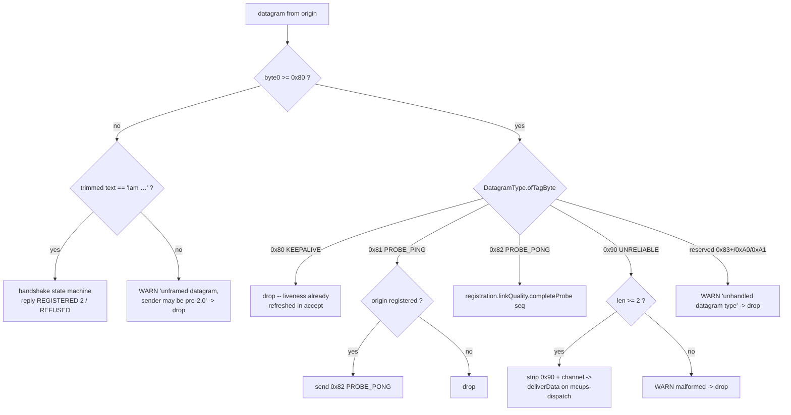

# Issue #14 — framed transport & reliable-ordered channel (implementation plan)

## Header / Association

- **Covers:** `SpartanLaboratories/WebTools#14` — *"Design discussion: a
  reliable-ordered sub-channel over the UDP transport"* (labels: `enhancement`,
  `question`). The maintainer resolved every design decision D1–D10 on 2026-09-09
  (design doc §13) and accepted the feature as the headline of `webtools-udp`
  **`2.0.0`**.
- **What this document is:** the **Stage 1** implementation plan of the staged
  `2.0.0-alphaN` series in design §12 — the **1-byte datagram-type framing
  prefix** and nothing else. It turns design §6.1 / §6.4 / §9 into a file-by-file
  change set and a 5-level test matrix. Stages 2–4 (reliable engine, public
  channel API, docs/version finalisation) get **their own plans** — see §11.
- **Approved design:** `docs/issue-14-reliable-ordered-channel-design.md`
  (decisions resolved, §13). This plan designs *within* it; where it makes a
  call the design doc left to "the implementation plan" that call is in §2 and,
  where it is genuinely the maintainer's, in §10.
- **Baseline:** `webtools-udp` `1.6.0` on `master` (Maven Central;
  `io.github.spartanlaboratories:webtools-udp`, package
  `com.spartanlabs.webtools.udp`). Working tree clean at planning time; Issue #13
  merged (PR #27), Issue #14 design doc merged (PR #29).
- **Branch model (design §12):** a long-lived `2.x` integration branch
  **`feat/2.0-framed-transport`** off `master`; this stage lands on a Stage-1
  branch **`feat/issue-14-framing-prefix`** off the integration branch, via the
  first PR of the series. The `2.0.0` cut merges the integration branch to
  `master` after Stage 4.
- **This plan document** is committed in the **same commit as the first Stage-1
  implementation commit** (§9) so `git log --follow` binds plan to code.
- **Branch:** `feat/issue-14-framing-prefix` (off `feat/2.0-framed-transport`).
- **Commit:** TBD
- **PR:** TBD  *(Stage-1 branch → `feat/2.0-framed-transport`; "PR 1 of 4" in the series)*
- **Status:** decisions OD-1–OD-4 resolved (§10, 2026-09-09 — maintainer accepted
  every recommendation); ready to implement. No production file touched yet.
- **Target version:** `webtools-udp` `1.6.0` → **`2.0.0-alpha1`** (§8). Wire
  break + public-API removal ⇒ major, per the recorded versioning convention.
  The Maven Central **publish** of `2.0.0-alpha1` is a separate maintainer-gated
  step (§10 OD-3); this plan covers the `version` declaration and the PR only.
- **Related docs:**
  - `docs/issue-14-reliable-ordered-channel-design.md` §2 / §6.1 / §6.4 / §9 / §10 / §12.
  - `docs/issue-8-binary-datagram-path-plan.md` §2.4 — the classifier-collision
    limitation this stage finally resolves; named there as a "clean-break
    protocol revision" follow-up.
  - `docs/issue-13-link-quality-probe-plan.md` — structure/§-numbering model for
    this plan; the `PING`/`PONG` probe and `PeriodicScheduler` this stage
    migrates onto tag bytes.
  - `docs/issue-12-scheduled-keepalive-plan.md` — the `KA` scheduled keepalive
    this stage migrates onto a tag byte.
  - `docs/issue-1-tier-2-plan.md` §2.1 — the canonical inbound-datagram flow the
    reworked dispatch slots into.

---

## 1. Context

### 1.1 Requirements / acceptance criteria

Not a defect — a deliberate wire break opening `webtools-udp` `2.x`. From design
§2.3, §6.1, §6.4, §9 and the §12 PR-series definition of Stage 1:

1. **Every post-`REGISTERED` datagram carries a 1-byte datagram-type tag as byte
   0.** The listener dispatches on that byte; it never again inspects an
   application payload.
2. **The handshake stays plain UTF-8 text** (`Iam` / `REGISTERED` / `REFUSED`) —
   unframed — so the bootstrap of a connection from an unknown origin still
   works by text match, and a cross-major peer mismatch **fails cleanly** (a
   typed `handshake()` failure) rather than mysteriously (a "registered"
   connection that then delivers garbage).
3. **Migrate every existing post-handshake path onto the tag:** the unreliable /
   binary application-data path, the scheduled + one-shot keepalive, and the
   `PING`/`PONG` link-quality probe.
4. **Rework the listener dispatch** on both `MultiConnectionUDPServer`
   (`HandshakeCoordinator.classify`) and `MultiConnectionUDPClient`
   (`receiveLoop`) to a single tag switch.
5. **Retire the Issue #8 consumer burden.** With byte 0 authoritative, the
   "lead every binary datagram with `0x00` or a byte `>= 0x80`" advice is
   **gone**: any payload of any bytes rides an `0x90` frame intact. The
   trimmed-UTF-8 token classifier for control traffic is **deleted**, not kept
   as a fallback (design §6.4).
6. **Reserve value-space** in the tag for the Stage-2 reliable/ack tags so
   Stage 2 adds no further wire break within `2.x`.
7. **Publish as `2.0.0-alpha1`** (version declaration + PR; Maven publish
   separate).
8. **Out of Stage 1 (Stages 2–4, not designed here):** the reliable engine
   (sequence spaces, ack bitfield, retransmit sequence buffer, reorder buffer,
   in-flight window, RTO from `Rtt`), the public channel API (`DeliveryMode` /
   `UdpChannel` — design D2 Option A), the reliable message-size cap and its
   typed errors, congestion control.

### 1.2 The Issue #8 limitation this resolves — with `path:line`

The classifier runs a trimmed-UTF-8 token match on **every** inbound datagram,
in both directions, and cannot be turned off:

- `HandshakeCoordinator.classify` — `HandshakeCoordinator.kt:128-151`: `isKeepAlive`
  / `isProbeRequest` / `isProbeReply` / `isHandshake` are tested against
  `String(bytes, UTF_8).trim()` before application data can reach `deliverData`
  (`HandshakeCoordinator.kt:210-231`).
- `MultiConnectionUDPClient.receiveLoop` — `MultiConnectionUDPClient.kt:322-336`:
  the same `when` on the trimmed text before `deliver(bytes, text)`.
- `CommonChannel.receive` — `CommonChannel.kt:66-71`: computes `text =
  String(bytes, UTF_8).trim()` for every datagram unconditionally.

Root cause: **control traffic and application traffic share one namespace — the
trimmed-UTF-8 view of byte 0…N.** A binary payload whose decode/trim equals
`KA` / `PING` / `PONG` or begins `Iam ` / `PING ` / `PONG ` is intercepted and
never delivered (`HandshakeWireFormat.kt:46-64`, `README.md:132-139`). Issue #8
§2.4 documented this as unfixable "without a framing change — a 1-byte
datagram-type tag separating control from application traffic — which is a
clean-break protocol revision". This stage *is* that revision.

---

## 2. Prior art & best practices

The design doc's §3 already surveyed the reliable-UDP library landscape in
depth. For the **framing byte specifically**, the established pattern across the
mature libraries is a single leading type/property byte on every datagram, with
a small integer type field and generous reserved space:

- **LiteNetLib** — every packet opens with a header byte whose low 5 bits are a
  `PacketProperty` enum (`Unreliable`, `Channeled`, `Ack`, `Ping`, `Pong`,
  `ConnectRequest`, `ConnectAccept`, `Disconnect`, `MtuCheck`, …) and the top
  bits carry the channel/flags. Connection-management packets and data packets
  share the one byte; the receiver switches on it before touching the payload.
  ([`PacketProperty` / `NetPacket`](https://github.com/RevenantX/LiteNetLib/blob/master/LiteNetLib/NetPacket.cs))
- **ENet** — each command carries a `command` byte (`ENET_PROTOCOL_COMMAND_*`:
  `ACKNOWLEDGE`, `CONNECT`, `PING`, `SEND_RELIABLE`, `SEND_UNRELIABLE`,
  `SEND_FRAGMENT`, …) with a flags high-bit for "acknowledge required".
  ([`enet/protocol.h`](https://github.com/lsalzman/enet/blob/master/include/enet/protocol.h))
- **QUIC (RFC 9000 §17)** — the first byte's high bits select long- vs
  short-header and the packet type; type-space is deliberately partitioned and
  reserved bits are defined to be ignored by current versions.
  ([RFC 9000 §17](https://www.rfc-editor.org/rfc/rfc9000#section-17))

Takeaways applied below:

- **One byte, switched on before any payload parse** — §2.1, §2.7–2.8.
- **Partition the value space by plane** (control / unreliable / reliable) and
  **reserve whole sub-ranges** so later additions never need another wire break
  — §2.1's table leaves `0x83–0x8F`, `0x91–0x9F`, `0xA0–0xAF`, `0xB0–0xFF`.
- **Keep the connection bootstrap legible without the framing** — QUIC keeps
  Initial packets self-describing; here the `Iam`/`REGISTERED`/`REFUSED`
  handshake stays text so a first datagram from an unknown origin (and a
  cross-version mismatch) is classifiable/diagnosable — §2.2.
- **An explicit protocol-version assertion at the bootstrap** so a wire-format
  major mismatch is a clean, early, typed failure — §2.2. (LiteNetLib rejects a
  `ConnectRequest` whose protocol id differs; ENet checks
  `ENET_PROTOCOL_VERSION`.)

---

## 3. Design

### 3.1 The datagram-type tag and its value space

Byte 0 of every **post-`REGISTERED`** datagram is a `DatagramType` tag. The
value space is partitioned so Stages 2–4 slot in with no further break:

| Byte 0 | `DatagramType` | Plane | Rest of datagram | Introduced |
|---|---|---|---|---|
| `0x00`–`0x7F` | *(none)* | — | not a valid tag; the text handshake bootstrap only (`Iam` / `REGISTERED` / `REFUSED`). Post-`REGISTERED`: malformed → drop + WARN. | — |
| `0x80` | `KEEPALIVE` | control | *(empty)* — replaces the text `KA` token | Stage 1 |
| `0x81` | `PROBE_PING` | control | 8-byte big-endian `uint64` probe sequence | Stage 1 |
| `0x82` | `PROBE_PONG` | control | 8-byte big-endian `uint64` probe sequence (echoed) | Stage 1 |
| `0x83`–`0x8F` | *reserved* | control | future transport control (MTU probe, graceful close, …) | — |
| `0x90` | `UNRELIABLE` | app data | `[channel:1]` (Stage 1: always `0x00`) + payload verbatim | Stage 1 |
| `0x91`–`0x9F` | *reserved* | app data | future unreliable variants (unreliable-sequenced / newest-wins-with-discard) | — |
| `0xA0` | *reserved →* `RELIABLE_DATA` | app data | reliable header + payload | **Stage 2** |
| `0xA1` | *reserved →* `RELIABLE_ACK` | app data | reliable header, no payload | **Stage 2** |
| `0xA2`–`0xAF` | *reserved* | app data | reliable-channel control (SACK ranges, window updates, channel open/close) | — |
| `0xB0`–`0xFF` | *reserved* | — | unallocated | — |

- Every tag is `>= 0x80`, so it cannot collide with the ASCII first byte of
  `Iam` (`0x49`), `REGISTERED`/`REFUSED` (`0x52`) or any UTF-8 text that starts
  with a character `< U+0080`. A leading continuation byte (`0x80`–`0xBF`) or
  multi-byte lead (`0xC0`+) in genuine UTF-8 text is irrelevant: **post-handshake
  text is no longer a wire concept** — application text travels inside an `0x90`
  frame like any other bytes.
- **Stage 1 emits only `0x80`, `0x81`, `0x82`, `0x90`.** A Stage-1 (`alpha1`)
  peer that receives a reserved tag (`0x83`–`0xFF`, incl. `0xA0`/`0xA1`) **drops
  it with a WARN** — it is a same-major peer running a later stage; a Stage-1 ↔
  Stage-1 session never produces one.
- `DatagramType.ofTagByte(b: Byte?): DatagramType?` → the live entry, or `null`
  for a reserved/out-of-range/`null` byte.

### 3.2 The handshake stays text; a protocol-version marker makes a mismatch fail cleanly

The `Iam <name> [<credential>]` line is **unchanged**. The server's accepted
reply changes from the bare token `REGISTERED` to **`REGISTERED <wireVersion>`**,
`wireVersion` = `2` for the `2.x` framed transport
(`TransportWireFormat.FRAMED_PROTOCOL_VERSION`). `REFUSED <reason>` is unchanged.

Cross-version outcomes — all **clean, typed, at `handshake()`**, no framed
traffic exchanged:

| Client | Server | Reply seen | `handshake()` result |
|---|---|---|---|
| `2.0` | `2.0` | `REGISTERED 2` | `Result.success` |
| `2.0` | `1.x` | `REGISTERED` (bare) | `Result.failure(IncompatibleProtocolException(remote = 1, local = 2))` |
| `1.x` | `2.0` | `REGISTERED 2` | `Result.failure(IllegalStateException("Expected 'REGISTERED' but got 'REGISTERED 2'"))` — the existing `1.x` else-branch |

- `1.x` client → `2.0` server leaves a **transient registration** on the server
  (the `2.0` server mints a `Connection` and fires `onClientConnect` before the
  client rejects the reply). It is reaped by idle detection where enabled, and
  is otherwise inert (never addressed after the client goes silent). Noted in
  §7; the **bilateral-marker** alternative that avoids it entirely is
  §10 OD-1.
- The design doc's §6.1 phrase "the handshake … negotiate[s] nothing" stands in
  spirit: this is a one-way **version assertion**, not negotiation — there is no
  downgrade path and no capability exchange.

`HandshakeWireFormat` (public) keeps the handshake surface and gains the marker:

```kotlin
object HandshakeWireFormat {
    const val HANDSHAKE_VERB = "Iam"
    const val REGISTERED_REPLY = "REGISTERED"           // still the verb
    const val REFUSED_REPLY = "REFUSED"

    @JvmOverloads
    fun handshakeMessage(name: String, credential: String = ""): String   // UNCHANGED

    /** The full accepted reply for this major: `REGISTERED 2`. */
    fun registeredMessage(): String = "$REGISTERED_REPLY $FRAMED_PROTOCOL_VERSION"

    /**
     * The wire-protocol major the reply announces: `2` for `REGISTERED 2`,
     * `1` for a bare `REGISTERED` (a pre-2.0 server), or `null` if [reply] is
     * not a `REGISTERED[ n]` line.
     */
    fun registeredProtocolVersion(reply: String): Int?

    /** True only for this build's exact accepted reply (`REGISTERED 2`). */
    fun isRegistered(reply: String): Boolean =
        registeredProtocolVersion(reply) == TransportWireFormat.FRAMED_PROTOCOL_VERSION

    fun refusedMessage(reason: String): String        // UNCHANGED
    fun isRefused(reply: String): Boolean              // UNCHANGED
    fun refusalReason(reply: String): String          // UNCHANGED
}
```

**Removed from `HandshakeWireFormat` (clean break):** `KEEPALIVE_TOKEN`,
`DEFAULT_KEEPALIVE_INTERVAL_MILLIS`, `isKeepAlive`, `PROBE_REQUEST_VERB`,
`PROBE_REPLY_VERB`, `DEFAULT_PROBE_INTERVAL_MILLIS`, `probeRequestMessage`,
`probeReplyMessage`, `isProbeRequest`, `isProbeReply`, `probeToken`. Their role
moves to `TransportWireFormat` in binary form (§3.3). The "lead binary datagrams
with `0x00` / `>= 0x80`" caveat paragraph is deleted.

New public type `IncompatibleProtocolException(val remoteVersion: Int?, val
localVersion: Int) : Exception(...)` — sibling of `HandshakeRefusedException`,
message names both versions and "both ends must be on `webtools-udp` 2.0.0+".

### 3.3 Wire-format home: a new `TransportWireFormat` + `DatagramType`

Per design §10's boundary-ring row ("`HandshakeWireFormat` (or a new
`TransportWireFormat`)"). `HandshakeWireFormat` stays **handshake-only** (§3.2).
The framed transport gets its own public home:

```kotlin
package com.spartanlabs.webtools.udp

/** The datagram-type tag carried as byte 0 of every post-`REGISTERED` datagram. */
enum class DatagramType(val tag: Byte) {
    KEEPALIVE(0x80.toByte()),
    PROBE_PING(0x81.toByte()),
    PROBE_PONG(0x82.toByte()),
    UNRELIABLE(0x90.toByte());
    // 0xA0 RELIABLE_DATA / 0xA1 RELIABLE_ACK — reserved, added in Stage 2.

    companion object {
        fun ofTagByte(b: Byte?): DatagramType?
    }
}

/**
 * The framed `webtools-udp` `2.x` transport wire format: the 1-byte
 * [DatagramType] prefix, the control-datagram encodings, and the unreliable
 * application-data frame. The handshake bootstrap stays text — see
 * [HandshakeWireFormat].
 */
object TransportWireFormat {
    /** The wire-protocol major this build speaks. */
    const val FRAMED_PROTOCOL_VERSION = 2

    /** v1 unreliable channel id — the only value Stage 1 emits or accepts. */
    const val DEFAULT_UNRELIABLE_CHANNEL: Byte = 0x00

    const val DEFAULT_KEEPALIVE_INTERVAL_MILLIS = 20_000L   // moved from HandshakeWireFormat
    const val DEFAULT_PROBE_INTERVAL_MILLIS = 1_000L        // moved from HandshakeWireFormat

    // --- control ---
    fun keepaliveDatagram(): ByteArray = byteArrayOf(DatagramType.KEEPALIVE.tag)
    fun probePingDatagram(seq: Long): ByteArray      // [0x81][seq: 8B BE]
    fun probePongDatagram(seq: Long): ByteArray      // [0x82][seq: 8B BE]
    /** The probe sequence from an `0x81`/`0x82` datagram, or `null` if malformed. */
    fun probeSequenceOf(datagram: ByteArray): Long?

    // --- unreliable application data ---
    /** `[0x90][channel][payload…]`. */
    fun unreliableDatagram(payload: ByteArray, channel: Byte = DEFAULT_UNRELIABLE_CHANNEL): ByteArray
    /** The payload of an `0x90` datagram (bytes 2…), or `null` if shorter than 2 bytes. */
    fun unreliablePayloadOf(datagram: ByteArray): ByteArray?
    /** The channel id byte of an `0x90` datagram, or `null` if malformed. */
    fun unreliableChannelOf(datagram: ByteArray): Byte?
}
```

- **Probe sequence is now binary** (8-byte BE `uint64`), not the Issue #13 ASCII
  decimal token. `LinkQualityTracker.beginProbe(): Long` /
  `completeProbe(seq: Long)` are unchanged; only the wire encoding and the
  extraction helper change. Removes the `toLongOrNull` / `"PING PONG"`
  text-parsing edge cases entirely.
- **The `0x90` channel byte is included now, always `0x00`** (design §6.2:
  "Unreliable framed overhead: 2 bytes"). It keeps the unreliable-frame layout
  stable for the Stage-3 `channel(UNRELIABLE)` handle and a later
  unreliable-sequenced mode. §10 OD-2 records the "omit until the channel API"
  alternative.
- `internal object HandshakeProtocol` drops its `isKeepAlive` / `isProbeRequest`
  / `isProbeReply` / probe-verb / keepalive-token aliases; keeps `VERB`,
  `parseHandshake`, `extraTokenCount`, `isHandshake`, and gains
  `REGISTERED_DATAGRAM` (= `HandshakeWireFormat.registeredMessage()` UTF-8
  bytes).

### 3.4 Framing the application-data path

Framing must happen at the **application-data call sites only** — never in the
shared `ClientChannel.send` / `CommonChannel.send` / `MultiConnectionUDPClient`
socket primitive, which also carries control datagrams (keepalive, `PONG`,
`REGISTERED`) that must not be double-framed.

**Client (`MultiConnectionUDPClient`):**

- `private fun sendDatagram(bytes: ByteArray): Result<Unit>` — the current body
  of `send(ByteArray)` (raw `socket.send` + `lastOutboundAtNanos` stamp). All
  control paths call this: `sendKeepAlive()`, the keepalive tick, the probe
  tick, the inbound-`PING` reply.
- `fun send(bytes: ByteArray): Result<Unit> =
  sendDatagram(TransportWireFormat.unreliableDatagram(bytes))`
- `fun send(message: String) = send(message.toByteArray(Charsets.UTF_8))` — unchanged signature.

**Server:**

- `UDPConnection.push(String)` / `push(ByteArray)` →
  `channel.send(TransportWireFormat.unreliableDatagram(bytes), peer)`.
- `UDPConnection.keepAlive()` → `channel.send(KEEPALIVE_DATAGRAM, peer)`
  (`byteArrayOf(0x80)`).
- `HandshakeCoordinator.broadcast(ByteArray)` (backs `pushToAll`) — frame once,
  then fan out; `broadcast(String)` delegates as today.
- `HandshakeCoordinator` handshake replies and the probe/keepalive ticks call
  the raw `send(bytes, to)` seam directly (unframed control — `REGISTERED 2`
  text, `0x8x` tags).

Inbound `0x90` delivery strips bytes 0–1: `deliverData(origin,
TransportWireFormat.unreliablePayloadOf(bytes)!!, String(payload,
UTF_8).trim())`. `deliverData` itself is unchanged (still picks the bytes
handler over the text handler; still drops an unregistered origin; still hands
off to the dispatch executor).

### 3.5 Listener dispatch rework — server (`HandshakeCoordinator`)

`accept(origin, bytes, text)` keeps its liveness stamp (`accept` still runs
`registrations.findByOrigin(origin)?.lastInboundAt = nanoTime()` before
classifying — any inbound datagram, framed or not, refreshes liveness). `classify`
becomes a single tag switch:

```
tag = DatagramType.ofTagByte(bytes.getOrNull(0))
when {
  tag == KEEPALIVE   -> Result.success  (log.trace)          // was: isKeepAlive(text)
  tag == PROBE_PING  -> registrations.findByOrigin(origin)?.let {
                          send(TransportWireFormat.probePongDatagram(seq), origin)
                        } ?: Result.success (log.debug "PING from unregistered")
  tag == PROBE_PONG  -> probeSequenceOf(bytes)?.let { seq ->
                          registrations.findByOrigin(origin)?.linkQuality?.completeProbe(seq) }
                        ; Result.success
  tag == UNRELIABLE  -> unreliablePayloadOf(bytes)?.let { p ->
                          deliverData(origin, p, String(p, UTF_8).trim()) }
                        ?: Result.success (log.warn "malformed 0x90 from {}")
  tag != null        -> Result.success (log.warn "unhandled datagram type 0x{} from {}", tag)  // reserved
  isHandshake(text.split(' ')) -> handleHandshake(origin, …)   // byte0 < 0x80, `Iam …`
  else               -> Result.success (log.warn
                          "unframed datagram from {}; sender may be pre-2.0, dropping", origin)
}
```

- `handleHandshake` reply sites: `send(REGISTERED_BYTES, origin)` →
  `send(HandshakeProtocol.REGISTERED_DATAGRAM, origin)` (`REGISTERED 2`), both
  the fresh-registration and the retransmit branch.
- The `Iam`-from-a-registered-origin retransmit path is unaffected — a
  retransmitted `Iam` is still unframed text with byte 0 `0x49`.
- `deliverData`, `handleHandshake`, `scheduleKeepAlive`, `scheduleProbe`,
  `sweepIdleConnections`, `broadcast`, `terminateAll` — logic otherwise
  unchanged; the keepalive tick sends `TransportWireFormat.keepaliveDatagram()`,
  the probe tick sends `TransportWireFormat.probePingDatagram(seq)`.

### 3.6 Listener dispatch rework — client (`MultiConnectionUDPClient.receiveLoop`)

```
when (DatagramType.ofTagByte(bytes.getOrNull(0))) {
  KEEPALIVE   -> log.trace("dropped keepalive from server")
  PROBE_PING  -> sendDatagram(TransportWireFormat.probePongDatagram(
                   TransportWireFormat.probeSequenceOf(bytes) ?: return@onSuccess))
                   .onFailure { log.debug("could not answer a PING", it) }
  PROBE_PONG  -> TransportWireFormat.probeSequenceOf(bytes)?.let { linkQualityTracker?.completeProbe(it) }
  UNRELIABLE  -> TransportWireFormat.unreliablePayloadOf(bytes)?.let { p ->
                   deliver(p, String(p, Charsets.UTF_8).trim()) }
                 ?: log.warn("malformed 0x90 datagram from server, dropping")
  null        -> log.warn("unframed/unknown datagram from server (byte0={}), dropping", …)  // post-start
  else        -> log.debug("unhandled datagram type from server, dropping")                 // reserved tag
}
```

- `handshake()` is untouched by this switch — it reads its single reply
  datagram synchronously (`MultiConnectionUDPClient.kt:217-235`). Only its
  reply check changes: `HandshakeWireFormat.isRegistered(reply)` now requires
  `REGISTERED 2`; a bare `REGISTERED` (or `REGISTERED n`, `n != 2`) →
  `Result.failure(IncompatibleProtocolException(HandshakeWireFormat
  .registeredProtocolVersion(reply), TransportWireFormat.FRAMED_PROTOCOL_VERSION))`;
  ordering: `isRefused` → `isRegistered` → `registeredProtocolVersion != null`
  (version mismatch) → generic `IllegalStateException`.
- `sendKeepAlive()` → `sendDatagram(TransportWireFormat.keepaliveDatagram())`.
- The `start` / `startBytes` `deliver` closure is unchanged.

### 3.7 Flow — inbound classification (server)



The client `receiveLoop` is the same switch minus the handshake branch (the
client's `handshake()` owns the `REGISTERED`/`REFUSED` reply) and with the
`PING` answer sent inline, exactly as Issue #13 established.

### 3.8 Alternatives considered

| Option | Rejected because |
|---|---|
| **Keep the trimmed-UTF-8 token classifier as a fallback** when byte 0 `< 0x80` post-registration | Re-introduces the Issue #8 ambiguity for text payloads and defeats the point of the major. Design §6.4 is explicit: byte 0 is authoritative; the classifier is deleted. |
| **Frame the handshake too** (tag `Iam`/`REGISTERED`/`REFUSED`) | A first datagram from an unknown origin then can't be told apart from stray framed data without state; the design (§6.1) keeps bootstrap legible as text. Also loses the clean text-mismatch diagnostic for a cross-version peer. |
| **Byte-identical `REGISTERED` reply** (no version marker) | A `2.0` client against a `1.x` server would "succeed" the handshake then exchange framed data the peer delivers to its app as garbage — mysterious, not clean. The marker makes it a typed `handshake()` failure. |
| **Omit the `0x90` channel byte in Stage 1** | Smaller frame on the hot snapshot path, but forces a *second* unreliable-frame layout change when the channel API / unreliable-sequenced mode lands. Design §6.2 budgets the 2 bytes. Kept as §10 OD-2. |
| **Probe sequence stays ASCII decimal after the tag** | Least code churn, but keeps the `toLongOrNull` / `"PING PONG"`-token fragility inside a binary frame. A fixed 8-byte field is cleaner and the overhead is identical. |
| **`4-byte uint32` probe sequence** | Enough range (136 years at 1 Hz) but narrows `beginProbe(): Long` and adds a wrap footnote. 8 bytes matches the type and the cost is negligible on a control datagram. |
| **Renaming `HandshakeWireFormat` → `TransportWireFormat` wholesale** | Large mechanical churn across tests for no behavioural gain; cleaner to split — handshake tokens stay in `HandshakeWireFormat`, framing gets its own object. |
| **A single monolithic `2.0.0` PR** | Design §12 D8: staged `2.0.0-alphaN` on the integration branch; each stage independently testable. This stage delivers the Issue #8 fix on its own merit. |

---

## 4. File-by-file changes

All paths under `webtools-udp/src/main/kotlin/com/spartanlabs/webtools/udp/`
unless noted. Production changes ride Stage-1 commit 1 (§9).

### 4.1 `DatagramType.kt` (new, public)
The `enum class DatagramType(val tag: Byte)` from §3.3: `KEEPALIVE` `0x80`,
`PROBE_PING` `0x81`, `PROBE_PONG` `0x82`, `UNRELIABLE` `0x90`; companion
`ofTagByte(b: Byte?): DatagramType?`. Level-2 KDoc on the type and every entry,
citing the §3.1 value-space table (which ranges are reserved and why); inner-core
comment that `0xA0`/`0xA1` are Stage-2 reserved.

### 4.2 `TransportWireFormat.kt` (new, public)
The `object TransportWireFormat` from §3.3: `FRAMED_PROTOCOL_VERSION = 2`,
`DEFAULT_UNRELIABLE_CHANNEL`, the two `DEFAULT_*_INTERVAL_MILLIS` constants
(moved from `HandshakeWireFormat`), `keepaliveDatagram`, `probePingDatagram`,
`probePongDatagram`, `probeSequenceOf`, `unreliableDatagram`,
`unreliablePayloadOf`, `unreliableChannelOf`. Level-2 KDoc on the object and
every member; the object KDoc carries the §3.1 tag table and the "both ends must
be `2.0.0`+" boundary note. Inner-core comments: the 8-byte-BE seq layout, the
2-byte `0x90` prefix, why framing is not done in the send seam (§3.4).

### 4.3 `HandshakeWireFormat.kt` (public — reduced + version marker)
- **Remove:** `KEEPALIVE_TOKEN`, `DEFAULT_KEEPALIVE_INTERVAL_MILLIS`,
  `isKeepAlive`, `PROBE_REQUEST_VERB`, `PROBE_REPLY_VERB`,
  `DEFAULT_PROBE_INTERVAL_MILLIS`, `probeRequestMessage`, `probeReplyMessage`,
  `isProbeRequest`, `isProbeReply`, `probeToken`, and the "### Link-quality
  probe" + "### Binary application payloads" / lead-byte KDoc paragraphs.
- **Add:** `registeredMessage()`, `registeredProtocolVersion(reply): Int?`;
  **change** `isRegistered` to require `REGISTERED 2` (§3.2).
- **Keep:** `HANDSHAKE_VERB`, `handshakeMessage`, `REGISTERED_REPLY` (the verb),
  `REFUSED_REPLY`, `refusedMessage`, `isRefused`, `refusalReason`.
- Class KDoc rewritten: this object is now **handshake bootstrap only**; point
  to `TransportWireFormat` for everything post-`REGISTERED`; document the
  `REGISTERED <version>` reply and the cross-version failure table (§3.2).

### 4.4 `IncompatibleProtocolException.kt` (new, public)
`class IncompatibleProtocolException(val remoteVersion: Int?, val localVersion:
Int) : Exception(...)`. Sibling of `HandshakeRefusedException`. Level-2 KDoc:
raised by `MultiConnectionUDPClient.handshake` when the server's `REGISTERED`
reply announces a different wire major; both ends must be on `webtools-udp`
2.0.0+.

### 4.5 `HandshakeProtocol.kt` (internal)
- Remove the `KEEPALIVE_TOKEN` / `DEFAULT_KEEPALIVE_INTERVAL_MILLIS` /
  `PROBE_REQUEST_VERB` / `PROBE_REPLY_VERB` / `DEFAULT_PROBE_INTERVAL_MILLIS`
  aliases and `isKeepAlive` / `isProbeRequest` / `isProbeReply`.
- Add `val REGISTERED_DATAGRAM: ByteArray = HandshakeWireFormat.registeredMessage().toByteArray(UTF_8)`.
- KDoc note updated — the "exact `KEEPALIVE_TOKEN` payload is swallowed" caveat
  is deleted (no longer true); `parseHandshake`/`isHandshake` unchanged.

### 4.6 `HandshakeCoordinator.kt` (internal)
- `classify` rewritten to the §3.5 tag switch. `accept` unchanged (liveness
  stamp stays).
- `handleHandshake`: both reply sites `send(REGISTERED_BYTES, origin)` →
  `send(HandshakeProtocol.REGISTERED_DATAGRAM, origin)`; companion
  `REGISTERED_BYTES` renamed/retargeted accordingly.
- `scheduleKeepAlive` tick: `HandshakeProtocol.KEEPALIVE_TOKEN.toByteArray()` →
  `TransportWireFormat.keepaliveDatagram()`.
- `scheduleProbe` tick: `probeRequestMessage(...).toByteArray()` →
  `TransportWireFormat.probePingDatagram(live.beginProbe())`.
- `broadcast(ByteArray)`: frame the payload with
  `TransportWireFormat.unreliableDatagram` once before the fan-out fold.
- Class KDoc: the "inbound-datagram router" bullet reworded — classifies on the
  `DatagramType` tag, not a token match; the probe-seam bullet notes the binary
  seq.

### 4.7 `UDPConnection.kt` (public, internal ctor)
- `push(String)` / `push(ByteArray)` → send
  `TransportWireFormat.unreliableDatagram(bytes)` via `channel.send`.
- `keepAlive()` → `channel.send(KEEPALIVE_DATAGRAM, peer)`; companion
  `KEEPALIVE_BYTES` → `KEEPALIVE_DATAGRAM = TransportWireFormat.keepaliveDatagram()`.
- KDoc on `push` / `keepAlive` updated: the datagram is framed
  (`0x90` / `0x80`); the "lead binary with `0x00`/`>= 0x80`" note is gone.

### 4.8 `Connection.kt` (public)
- `push(ByteArray)` default (`push(String(bytes, UTF_8))`) and `actuateBytes`
  default (`actuate { onMessage(it.toByteArray()) }`) are **unchanged** — the
  fake path is byte-agnostic; framing is `UDPConnection`'s job.
- KDoc: `push` / `push(ByteArray)` / `actuate` / `actuateBytes` — replace the
  always-on-classifier + lead-byte caveat with "the production transport frames
  this as an `0x90` unreliable datagram; any payload bytes are delivered
  intact." Interface-level `DeliveryMode` / reliable members are **not** added
  here (Stage 3).

### 4.9 `MultiConnectionUDPClient.kt` (public)
- Add `private fun sendDatagram(bytes: ByteArray): Result<Unit>` (current
  `send(ByteArray)` body); `send(ByteArray)` now frames via
  `TransportWireFormat.unreliableDatagram`; `send(String)` unchanged.
- `sendKeepAlive()` → `sendDatagram(TransportWireFormat.keepaliveDatagram())`.
- `startKeepAlive` tick → `sendDatagram` path already via `sendKeepAlive`;
  `startProbe` tick → `sendDatagram(TransportWireFormat.probePingDatagram(
  tracker.beginProbe()))`.
- `receiveLoop` `when` → the §3.6 `DatagramType` switch; the inline `PING`
  answer uses `sendDatagram`.
- `handshake()` reply check → §3.6 (`isRegistered` strict; version-mismatch →
  `IncompatibleProtocolException`).
- KDoc: `### Binary application payloads` paragraph rewritten (framed `0x90`, no
  lead-byte rule); `handshake` `@return` gains the
  `IncompatibleProtocolException` case; the "one socket / listener never sends
  application data — answers a `PING` inline" boundary note kept, retargeted to
  the tag.

### 4.10 `MultiConnectionUDPServer.kt` (public)
- No structural change (framing lives in `HandshakeCoordinator` /
  `UDPConnection`). `pushToAll(String)` / `pushToAll(ByteArray)` unchanged —
  they delegate to `coordinator.broadcast`, which now frames.
- Class KDoc: `### Binary application payloads` rewritten (framed, no lead-byte
  rule); the handshake-protocol prose notes `REGISTERED <version>` and "both
  ends must be `2.0.0`+"; the `KA` / `PING`-`PONG` descriptions point at the
  `0x80` / `0x81` / `0x82` tags.

### 4.11 `CommonChannel.kt` (internal)
- `receive` still returns `Inbound(origin, bytes, text)` with `text =
  String(bytes, UTF_8).trim()`. **Keep `text`** — `HandshakeCoordinator.classify`
  still needs it for the `Iam` bootstrap branch (byte 0 `< 0x80`). Add an
  inner-core comment: `text` is now only consulted for the handshake bootstrap;
  the tag switch works off `bytes[0]`.
- No behavioural change to the raw `send` seam.

### 4.12 `README.md` (repo root)
- Install snippet: `webtools-udp:1.6.0` → `2.0.0-alpha1`; a short note that
  `2.0.0` is a **pre-release line on an integration branch**, wire-incompatible
  with `1.x`, both ends must upgrade together.
- Components table: `HandshakeWireFormat` row — drop `KA` / `PING` / `PONG`
  from its token list; new `DatagramType` row and `TransportWireFormat` row;
  `IncompatibleProtocolException` row.
- "UDP handshake protocol" section → **"UDP transport protocol"**: the §3.1 tag
  table; `REGISTERED` → `REGISTERED <version>` in the direction table; a
  "framed transport (2.0)" paragraph — every post-handshake datagram leads with
  a `DatagramType` byte; the handshake stays text.
- "Binary application payloads" subsection: **delete** the `Iam`/`KA`/`PING`/
  `PONG` classifier caveat and the lead-byte mitigation; replace with "any
  payload bytes ride an `0x90` frame intact — no reserved first byte" and note
  the 2-byte unreliable / 1-byte control framing overhead against the ~1200-byte
  path-MTU advisory.
- "Scheduled keepalive" / "Link quality" subsections: `KA` → `0x80` frame,
  `PING`/`PONG` → `0x81`/`0x82` frames with an 8-byte sequence; no wire-token
  names.
- A "Migrating to 2.0" subsection: the wire break, `REGISTERED <version>`, the
  removed `HandshakeWireFormat` members and their `TransportWireFormat`
  replacements, the retired lead-byte rule.

### 4.13 `webtools-udp/build.gradle.kts`
- `version = "1.6.0"` → `"2.0.0-alpha1"` — its own `build:` commit in the
  Stage-1 PR (§9), *not* folded into commit 1, matching the repo's split-version
  idiom (#10–#13). Unlike #13 the version **cannot** trail into a later stage:
  a framed-wire build declaring `1.6.0` would be a lie.
- Version-comment block (rides commit 1 with the code): add
  ```
  // 2.0.0-alpha1: framed transport wire break (Issue #14, Stage 1 of the 2.0 series) -
  // every post-REGISTERED datagram leads with a 1-byte DatagramType tag (0x80 keepalive,
  // 0x81/0x82 probe PING/PONG with an 8-byte sequence, 0x90 unreliable data + channel byte);
  // handshake stays text; REGISTERED reply gains a protocol-version token (REGISTERED 2) so a
  // cross-major peer fails handshake() cleanly (IncompatibleProtocolException). Removes the
  // HandshakeWireFormat KA/PING/PONG token API and the Issue #8 "lead byte >= 0x80" burden.
  // 0xA0/0xA1 reserved for the Stage-2 reliable engine.
  ```
- `commonUdpPortLock` task list unchanged (new socket-binding tests are
  `integrationTest` / `e2eTest` / `nonfunctionalTest`, already listed).

### 4.14 Test-support fixtures
`webtools-udp/src/test/kotlin/com/spartanlabs/testing/support/webtools/udp/`
- `FakeClientChannel.kt`: `send(bytes, to)` records the **raw** bytes it is
  handed (already framed by the caller) — add a helper to assert the recorded
  datagram's `DatagramType` / payload. No signature change.
- `FakeConnection.kt`: `push` / `push(ByteArray)` record the payload as given
  (a fake does not frame). No change needed beyond confirming tests assert the
  unframed payload.
- `FakePeriodicSchedule.kt`: unchanged.
- `LogCapture.kt`: unchanged (used to assert the new WARN lines).

### 4.15 `docs/issue-14-reliable-ordered-channel-plan.md`
This document. Committed in Stage-1 commit 1. Backfill the `Commit:` / `PR:`
header fields once they exist (as done for #8–#13).

---

## 5. Documentation impact (Audience-Reach rings)

| Ring | Touched? | What moves with this change |
|---|---|---|
| **Inner core** (in-editor) | yes | Comments: the tag switch in both listeners and *why* byte 0 is authoritative; the 8-byte-BE probe sequence layout; the 2-byte `0x90` prefix and why framing is not in the send seam; why `CommonChannel.receive` still computes `text` (handshake bootstrap only); the transient-registration note on `handleHandshake`. |
| **Component ring** (KDoc) | yes | New KDoc: `DatagramType` (+ every entry, + the reserved-range rationale), `TransportWireFormat` (every member), `IncompatibleProtocolException`. Rewritten KDoc: `HandshakeWireFormat` (handshake-only; `registeredMessage` / `registeredProtocolVersion` / strict `isRegistered`), `HandshakeProtocol`, `Connection.push` / `push(ByteArray)` / `actuate` / `actuateBytes`, `UDPConnection.push` / `keepAlive`, `MultiConnectionUDPClient.send` / `sendKeepAlive` / `handshake` / class KDoc, `MultiConnectionUDPServer` class KDoc. |
| **Boundary ring** (protocol) | **yes — major.** | The framed wire protocol is a new boundary contract: the §3.1 `DatagramType` table, the `0x90` unreliable frame layout, the `0x81`/`0x82` probe encoding, the `REGISTERED <version>` handshake reply, and the "both ends must be `2.0.0`+" rule. Lands in `TransportWireFormat` / `HandshakeWireFormat` KDoc, the README "UDP transport protocol" section (renamed from "handshake protocol"), and this plan §3. A dedicated `docs/` protocol reference is **Stage 4** (design §12 PR 4). |
| **Architectural outer layer** | yes | The transport is now a framed protocol. The §3.7 classification diagram is the new canonical inbound-routing picture (supersedes the token-match fork in `docs/issue-8-*` §2.6). No new thread, no new lifecycle. |
| **README** | yes — substantial | Per the README-currency rule: a wire-protocol change, removed/renamed public API, a new public type, a dependency-coordinate version bump, and a migration note. Same commit as the implementation (§9). |

---

## 6. Test plan (5-Level hierarchy)

Package root mirrors production `com.spartanlabs.webtools.udp` →
`com.spartanlabs.testing.<level>.webtools.udp`. One class per file; each class
carries its level `@Tag`. Socket-binding classes run under `commonUdpPortLock`.
Framing helpers make datagram bytes trivial to build in-test
(`TransportWireFormat.unreliableDatagram(…)` etc.); the pure tag/format maths is
Level 4a. No new timing surface — this stage adds no threads.

### Level 1 — `testing.gating`

- **New `DatagramTypeGatingTest.kt`** (socket-free smoke): `KEEPALIVE.tag ==
  0x80.toByte()` … `UNRELIABLE.tag == 0x90.toByte()`; `ofTagByte(0x80) ==
  KEEPALIVE`; `ofTagByte(null) == null`; `ofTagByte(0x00) == null`;
  `ofTagByte(0xA0.toByte()) == null` (Stage-2 reserved).
- **New `TransportWireFormatGatingTest.kt`** (socket-free): `FRAMED_PROTOCOL_VERSION
  == 2`; `keepaliveDatagram()` is exactly `[0x80]`; `probePingDatagram(7)` →
  `probeSequenceOf` round-trips to `7`; `unreliableDatagram("hi".bytes)` →
  `unreliablePayloadOf` round-trips, `unreliableChannelOf == 0x00`, byte 0 ==
  `0x90`; `unreliablePayloadOf(byteArrayOf(0x90))` is `null`.
- **Replace probe/keepalive assertions in `HandshakeWireFormatGatingTest.kt`**:
  drop `KA` / `PING` / `PONG`; add `registeredMessage() == "REGISTERED 2"`,
  `isRegistered("REGISTERED 2")` true / `isRegistered("REGISTERED")` false,
  `registeredProtocolVersion` truth table (bare → 1, `REGISTERED 2` → 2,
  `REGISTERED x` → null).
- **Update `HandshakeCoordinatorGatingTest.kt` / `HandshakeProtocolGatingTest.kt`**:
  constructor signatures unchanged; a `0x80` inbound is dropped, a `0x90 00 …`
  inbound reaches a bound handler with the stripped payload, an unframed
  non-`Iam` text inbound is dropped.
- **Update `ProbeValidationGatingTest.kt` / `KeepAliveValidationGatingTest.kt` /
  `KeepAliveGatingTest.kt`**: expectations switch from text tokens to tag bytes;
  the probe/keepalive interval constants now resolve from `TransportWireFormat`.

### Level 2 — `testing.component`

- **New `FramingComponentTest.kt`** — not pure (exercises the classify path via
  a synchronous `HandshakeCoordinator`), covering: a `0x90` payload of arbitrary
  bytes (incl. one that trims to `"KA"`, one leading `0x00`, one leading `0x81`)
  reaches the bytes handler **verbatim** — the Issue #8 footgun is gone; a
  1-byte `0x90` is dropped with a WARN (`LogCapture`); a reserved `0xA0` inbound
  is dropped with a WARN; an unframed `"hello"` from a registered origin is
  dropped with the "sender may be pre-2.0" WARN.
- **Extend `HandshakeCoordinatorTest.kt`** (synchronous `dispatch = { it() }`,
  `FakePeriodicSchedule` for both schedulers):
  - inbound `0x80` from a registered origin → success, nothing dispatched;
  - inbound `0x81` from a **registered** origin → exactly one `0x82` datagram to
    that origin carrying the same 8-byte sequence, nothing dispatched;
  - inbound `0x81` from an **unregistered** origin → dropped, no send;
  - inbound `0x82` for a live probe → `linkQualityOf(peer)` eventually non-null;
  - `handleHandshake` fresh + retransmit both reply `REGISTERED 2` bytes;
  - `scheduleKeepAlive` tick emits `[0x80]`; `scheduleProbe` tick emits
    `0x81` + `beginProbe()` as 8-byte BE;
  - `broadcast("x")` / `broadcast(bytes)` emit `0x90 00 …` to every registration.
- **Extend `UDPConnectionTest.kt` / `UDPConnectionKeepAliveTest.kt` /
  `UDPConnectionProbeTest.kt`**: `push("x")` / `push(bytes)` hand
  `channel.send` a `0x90 00 …` datagram (assert via `FakeClientChannel`);
  `keepAlive()` hands it `[0x80]`; probe/keepalive delegation unchanged.
- **Extend `MultiConnectionUDPClientKeepAliveTest.kt` /
  `MultiConnectionUDPClientProbeTest.kt`** (internal ctor, `FakePeriodicSchedule`,
  loopback peer socket): the keepalive tick puts `[0x80]` on the wire; the probe
  tick puts `0x81` + 8-byte seq; feeding `0x82` + seq back populates
  `linkQuality()`; a garbage `0x82` (short) neither throws nor populates.
- **New `MultiConnectionUDPClientFramingTest.kt`**: `send("hi")` puts `0x90 00
  hi` on the wire (loopback peer `DatagramSocket`); inbound `0x90 00 hi` →
  `start` handler sees `"hi"`; inbound `0x90 00 <raw bytes>` → `startBytes`
  handler sees exactly those bytes; inbound `[0x80]` → dropped; inbound unframed
  `"hi"` after `start` → dropped with WARN.
- **Update `PeriodicSchedulerValidationTest.kt`**: unchanged behaviour; only the
  default-interval constant import moves.

### Level 3 — `testing.integration` (real threads / sockets)

- **Update `MultiConnectionUDPClientTest.kt` / `MultiConnectionUDPServerTest.kt`**:
  application data round-trips through the `0x90` frame; a **raw unframed**
  datagram sent straight to the server's port (bypassing `send`) is dropped —
  never reaches a handler.
- **Update `MultiConnectionUDPClientKeepAliveTest.kt` /
  `MultiConnectionUDPServerKeepAliveTest.kt` /
  `MultiConnectionUDPClientProbeTest.kt` /
  `MultiConnectionUDPServerProbeTest.kt`**: same behavioural coverage as today,
  now asserting the `0x80` / `0x81` / `0x82` frames on the wire.
- **`PeriodicSchedulerTest.kt` / `CommonChannelTest.kt` /
  `MultiConnectionUDPServerReceiveBufferTest.kt` /
  `MultiConnectionUDPServerLivenessTest.kt` /
  `MultiConnectionUDPServerAdmissionTest.kt`**: unchanged (raw seam / liveness /
  admit are framing-agnostic) — re-run to confirm.
- **New `MultiConnectionUDPProtocolVersionTest.kt`**: a fake server
  `DatagramSocket` replying a bare `REGISTERED` → `client.handshake(...)` fails
  with `IncompatibleProtocolException(remoteVersion = 1, localVersion = 2)`;
  replying `REGISTERED 2` → success; replying `REGISTERED 3` → failure with
  `remoteVersion = 3`; replying `REFUSED full` → still
  `HandshakeRefusedException` (refusal wins over version check).

### Level 4a — `testing.deterministic`

- **New `DatagramTypeTest.kt`** (pure): every byte `0x00`–`0xFF` mapped through
  `ofTagByte` yields exactly the §3.1 table's entry-or-`null`; the reserved
  ranges (`0x00`–`0x7F`, `0x83`–`0x8F`, `0x91`–`0xFF`) all `null`; `tag`
  values are the four exact bytes; `null` in → `null` out.
- **New `TransportWireFormatTest.kt`** (pure, mirrors `HandshakeWireFormatTest`):
  `frame`/`payload` round-trips for empty / 1-byte / 64 KB payloads;
  `probeSequenceOf(probePingDatagram(s)) == s` for `s` ∈ `{0, 1, 255, 2^32,
  Long.MAX_VALUE}`; big-endian byte order asserted explicitly
  (`probePingDatagram(1)` ends `…,0,0,0,0,0,0,0,1`); `probeSequenceOf` on a
  7-byte body → `null`; `unreliableDatagram`/`unreliablePayloadOf`/`…ChannelOf`
  truth table incl. a non-zero channel byte; `unreliablePayloadOf([0x90])` /
  `([])` → `null`.
- **Update `HandshakeWireFormatTest.kt`**: delete the `isKeepAlive` / probe-verb
  / `probeToken` cases; add `registeredMessage`, `registeredProtocolVersion`
  (bare `REGISTERED` → 1; `REGISTERED 2` → 2; `REGISTERED 02` → 2 or `null`
  per the parse rule — lock whichever; `REGISTERED x` → `null`; `REGISTERED 2
  3` → `null`), strict `isRegistered`.
- **Update `HandshakeProtocolTest.kt`**: delete `isKeepAlive` / `isProbe*`
  cases; `REGISTERED_DATAGRAM` decodes to `"REGISTERED 2"`.

### Level 4b — `testing.e2e`

- **New `MultiConnectionUDPFramingE2ETest.kt`** — real client + real server
  subclass over loopback:
  - **headline:** handshake → `start` → interleave `send("text")`,
    `send(byteArrayOf(0x4B, 0x41))` (trims to `"KA"` — was a footgun), a 4 KB
    binary blob starting `0x00`, and a blob starting `0x81`; every payload
    arrives at the peer **byte-exact**, in send order, and the `start` handler
    never sees a keepalive or probe frame;
  - `startKeepAlive` / `startProbe` on both sides run concurrently with the data
    stream and are classified out (no leakage to handlers);
  - `client.stop()` / `server.stop()` clean, no residual threads.
- **Update `MultiConnectionUDPClientServerE2ETest.kt` /
  `MultiConnectionUDPBinaryE2ETest.kt` / `MultiConnectionUDPKeepAliveE2ETest.kt`
  / `MultiConnectionUDPProbeE2ETest.kt` / `MultiConnectionUDPLivenessE2ETest.kt`
  / `MultiConnectionUDPHandshakeRefusalE2ETest.kt`**: same assertions, framed
  wire; the binary E2E test **drops** its "lead with `0x00`" setup and asserts
  an arbitrary first byte now survives.

### Level 4c — `testing.nonfunctional`

- **New `FramingNonFunctionalTest.kt`**:
  - a `0x90` payload whose first byte is each of all 256 values round-trips
    intact (the Issue #8 fix, exhaustively);
  - a ~60 KB framed payload round-trips (frame overhead vs the 65507 ceiling);
  - `unreliableDatagram` adds exactly 2 bytes, `keepaliveDatagram` 1 byte,
    `probePingDatagram` 9 bytes — asserted against the ~1200-byte path-MTU
    advisory;
  - 100 k random inbound byte arrays (lengths 0…64, random first byte) fed
    through `HandshakeCoordinator.accept` and the client `receiveLoop`: no
    exception escapes, no handler ever receives a control/malformed frame;
  - a truncated `0x81` / `0x82` / `0x90` never throws out of either listener.
- **Update `MultiConnectionUDPClientKeepAliveNonFunctionalTest.kt` /
  `MultiConnectionUDPServerKeepAliveNonFunctionalTest.kt` /
  `MultiConnectionUDPClientProbeNonFunctionalTest.kt` /
  `MultiConnectionUDPServerProbeNonFunctionalTest.kt` /
  `MultiConnectionUDPClientNonFunctionalTest.kt` / `HandshakeNonFunctionalTest.kt`
  / `MultiConnectionUDPServerAdmissionNonFunctionalTest.kt` /
  `MultiConnectionUDPServerLivenessNonFunctionalTest.kt`**: framed wire; a probe
  frame is still small (`< 32` bytes); unused-cost assertions unchanged.

### Level 5 — `testing.uat`

- **Extend `MultiConnectionUDPServerUatTest.kt`** with `@Disabled` scenarios:
  1. a `1.6.0` client jar against a `2.0.0-alpha1` server (and the reverse) —
     confirm `handshake()` returns a clean typed failure, no garbage delivered,
     the log names the version mismatch;
  2. a GameTools-style mixed session over a real path (WAN / NAT, `tc netem`
     for loss): per-tick binary snapshots on `send(ByteArray)` interleaved with
     text events, keepalive + probe armed — a human confirms all payloads
     arrive intact and the classifier never misroutes.

### Cannot be automated

- True interop against the **published** `1.6.0` jar — needs a cross-version
  test harness (two classpaths); the Level-3 `MultiConnectionUDPProtocolVersionTest`
  simulates the wire but not a real old peer.
- Middlebox / DPI-NAT behaviour on datagrams whose first byte is `>= 0x80`
  (some carrier NATs sniff for text protocols) — only real-path soak shows this.
- Whether the §3.1 reserved value-space is actually sufficient for Stages 2–4 —
  validated as each stage lands.

---

## 7. Risks & edge cases

- **Wire break — the headline risk.** No `1.x` ↔ `2.0` post-handshake
  interop. Mitigation: handshake stays text; `REGISTERED <version>` turns a
  mismatch into a typed `handshake()` failure (§3.2); both ends must be
  `2.0.0`+. Per standing guidance, downstream adoption is the consumer's
  concern and is **not** a gate on closing this stage / issue.
- **Transient server-side registration** when a `1.x` client hits a `2.0`
  server: `onClientConnect` fires before the client rejects `REGISTERED 2`. The
  registration is inert (never addressed once the client is silent) and is
  reaped by idle detection where `idleTimeoutMillis > 0`. §10 OD-1 (bilateral
  marker) removes it; recommended only if the maintainer wants the stricter
  behaviour now.
- **Removed public API.** `HandshakeWireFormat.KEEPALIVE_TOKEN` / probe verbs /
  helpers and the text classifier are gone. This is the point of the major;
  callers migrate to `TransportWireFormat` / `DatagramType`. A `javap` diff of
  the built jar goes in the PR (same pre-tag step as #8–#13).
- **`0x90` 2-byte overhead on the hot snapshot path.** ~1 byte net vs today's
  wasted lead byte (design §6.2); trivial against a `< 1200`-byte frame. §10
  OD-2 can shave it to 1 byte by deferring the channel byte.
- **Probe sequence encoding change (text → 8-byte BE).** Internal only —
  `LinkQualityTracker` API untouched; deterministic tests lock byte order.
- **Reserved-tag handling.** A Stage-1 `alpha1` peer WARN-drops `0xA0`/`0xA1`;
  a Stage-1 ↔ Stage-1 session never sends them, so this only bites a
  mixed-stage integration-branch build (expected, transient).
- **`String(payload).trim()` for framed text delivery.** Same trimming
  semantics the text `actuate` path has always had; the `actuateBytes` path is
  byte-exact as before (now genuinely for *all* byte patterns).
- **Concurrency:** no new thread, no new shared state, no new lock. The dispatch
  rework is pure classification on the existing listener threads; reliable
  delivery still goes via `mcup{c,s}-dispatch` for the (unchanged) unreliable
  path.
- **`accept` liveness stamp ordering.** Unchanged — `accept` stamps
  `lastInboundAt` before `classify`, so a `0x80` keepalive still refreshes
  liveness exactly as the text `KA` did.
- **Pre-existing working-tree changes:** none (clean `master` at planning).
- **`alpha1` and Maven Central:** a pre-release qualifier, distinct from the
  recorded "trailing letter = bugfix" convention. Not published in this stage
  (§10 OD-3).

---

## 8. Version

**`webtools-udp` `1.6.0` → `2.0.0-alpha1`.**

- **Major**, unambiguously: the wire format changes (framing prefix,
  `REGISTERED <version>`) and public API is **removed** (`HandshakeWireFormat`
  keepalive/probe surface, the text classifier). The recorded versioning
  convention maps a breaking change to a new major; a trailing letter is
  bugfix-only and a third-number bump is an addition — neither applies.
- **`-alpha1`** marks the first pre-release of the staged series on
  `feat/2.0-framed-transport` (design §12 D8). Subsequent stages publish
  `-alpha2` … ; the `2.0.0` final is cut when the integration branch merges to
  `master` after Stage 4.
- The `version` line moves **in this stage's PR** (its own `build:` commit,
  §9) — it cannot trail into a later stage the way #13's `1.6.0` bump did,
  because a framed-wire build must not declare a `1.x` version.
- **Maven Central publish of `2.0.0-alpha1` is a separate maintainer-gated
  step** (§10 OD-3). This plan delivers the `version` declaration and the PR.
- **Pre-tag check:** `javap` the built classes; confirm the removed members are
  gone and `DatagramType` / `TransportWireFormat` / `IncompatibleProtocolException`
  are present with the intended signatures. Paste into the PR.

---

## 9. Version control

- **Integration branch:** `feat/2.0-framed-transport` off `master` (created
  once, lives until the `2.0.0` cut).
- **Stage-1 branch:** `feat/issue-14-framing-prefix` off
  `feat/2.0-framed-transport`.
- **Working tree** is clean at planning; do not fold any unrelated change into
  these commits.
- **Commit sequence** (each a coherent unit; PR = Stage-1 branch →
  `feat/2.0-framed-transport`):
  1. `feat: add the 1-byte datagram-type framing prefix to webtools-udp (Issue #14)`
     — §4.1–§4.12 (all `src/main` + README + the `build.gradle.kts`
     version-comment block, **not** the `version` line) **plus this plan
     document**. `./gradlew :webtools-udp:compileKotlin` green; the full suite
     compiles after commit 2.
  2. `test: cover the framed transport prefix across all levels (Issue #14)`
     — §6 all levels, plus the fixture touch-ups (§4.14) and the `javap`
     verification. Every level task green.
  3. `build: bump webtools-udp to 2.0.0-alpha1 for the framed transport wire break (Issue #14)`
     — the `version` line (§4.13), split from commit 1 per the #10–#13 idiom.
- **The plan document rides in commit 1** (the first implementation stage) so
  `git log --follow docs/issue-14-reliable-ordered-channel-plan.md` binds plan
  to code. The approved design doc is already on `master` (PR #29) and thus on
  the integration branch — no move needed.
- **Commit trailer:** none — no `Co-Authored-By` / `Claude-Session` /
  "Generated with" line on commits, and no attribution footer in the PR body
  (recorded project standing instruction).
- Do not commit, push, or open the PR until the maintainer asks. After the
  `2.0.0` cut merges to `master`, delete `feat/2.0-framed-transport` and the
  stage branches (local + remote); backfill this doc's `Commit:` / `PR:` fields.

---

## 10. Decisions (resolved 2026-09-09 — maintainer accepted every recommendation)

- **OD-1 — Handshake version signalling. RESOLVED: reply-only.**
  The server answers `REGISTERED 2`; a cross-major client fails `handshake()`
  cleanly. A `1.x` client briefly registers on a `2.0` server (fires
  `onClientConnect`) before it rejects the reply — an inert, idle-reaped
  registration (§7), accepted as harmless for Stage 1. The bilateral `Iam`
  marker is not adopted now; revisit only if `onClientConnect` must never fire
  for an incompatible peer.

- **OD-2 — The `0x90` unreliable channel byte. RESOLVED: include it now.**
  Always `0x00` in Stage 1 (design §6.2 budgets 2 bytes), keeping the
  unreliable-frame layout stable for the Stage-3 `channel(UNRELIABLE)` handle
  and a future unreliable-sequenced mode. The 1 extra byte on the snapshot path
  is immaterial; a second frame revision within `2.x` is not.

- **OD-3 — Publish `2.0.0-alpha1` to Maven Central. RESOLVED: publish the alpha
  once the Stage-1 PR merges to the integration branch**, so GameTools can
  integrate against the framed wire during Stages 2–4. This remains the
  maintainer's release call executed as a separate explicit step — neither this
  plan nor the pipeline performs the Maven publish without an explicit
  instruction.

- **OD-4 — `REGISTERED` version-token format. RESOLVED: strict.**
  Exactly one canonical decimal token (`REGISTERED 2`). `REGISTERED 02`,
  `REGISTERED 2 3`, or a missing token → `null` →
  `IncompatibleProtocolException` / `IllegalStateException`. Parsed by
  `registeredProtocolVersion`.

---

## 11. Sequencing & follow-ups

**This stage (PR 1 of the design §12 series):** the framing prefix only.
Green at all 5 levels before Stage 2 opens.

**Later stages — each gets its own `docs/issue-14-*` plan, all on
`feat/2.0-framed-transport`:**

1. **Stage 2 — reliable engine (internal).** `0xA0` / `0xA1` tags promoted from
   reserved to live `DatagramType` entries; the reliable header (channel id,
   `uint16` seq with RFC 1982 arithmetic, ack + 32-bit ack bitfield); the
   retransmit sequence buffer; the bounded reorder buffer; the fixed in-flight
   window; RTO from the Issue #13 `Rtt` estimator with Karn's algorithm; the
   lazily-created `mcup{c,s}-retransmit` executor. All behind an `internal`
   surface. Publishes `2.0.0-alpha2`.
2. **Stage 3 — public channel API.** `DeliveryMode` + `UdpChannel` (design D2
   Option A); `connection.channel(RELIABLE_ORDERED)` / `channel(UNRELIABLE)`;
   the reliable message-size cap (default 1024 B, hard max ~8 KB — design D5)
   and its typed errors (`ReliableWindowFullException`,
   `ReliableMessageTooLargeException`); `UDPConnection` / client / server
   plumbing. Publishes `2.0.0-alpha3`.
3. **Stage 4 — docs + version finalisation.** README "reliable-ordered channel"
   section; the `docs/` protocol reference; the architecture section + the
   design §7.8 ack/retransmit sequence diagram; `webtools-udp` → `2.0.0`;
   merge `feat/2.0-framed-transport` → `master`; close Issue #14.

**Deferred past `2.0.0` (design §14):** congestion control (follow-up #1),
fragmentation of oversize reliable messages, multiple reliable channels,
unreliable-sequenced mode, reliable-channel session resume across a NAT rebind,
priority / partial reliability.
