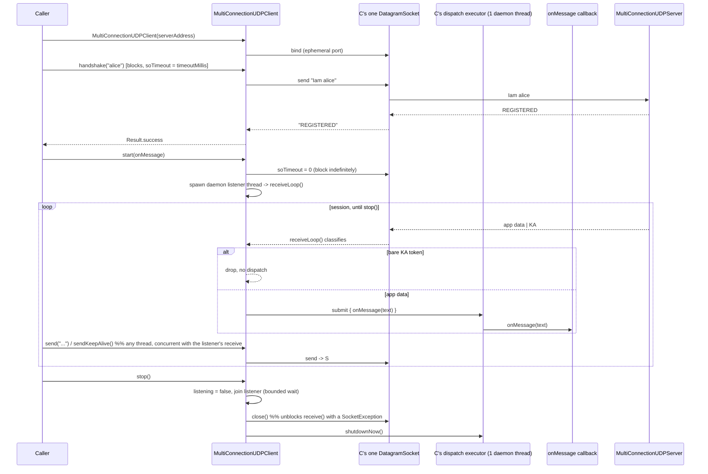

# Issue #3 — public client-side handshake support + published wire format

## Header / Association

- **Covers:** `SpartanLaboratories/WebTools#3` — *"2.0.0b: no public client-side
  handshake support; the reply-socket contract is prose-only"*. The issue title
  and body were written against the pre-Tier-2 (`2.0.0b`) wire protocol
  (`TXRXON <sendPort> <receivePort>`, dedicated port pairs, `portPairFor`). That
  protocol no longer exists — Tier 2 (`SpartanLaboratories/WebTools#1`, PR #4)
  replaced it with the single-socket multiplex described in
  [`docs/issue-1-tier-2-plan.md`](./issue-1-tier-2-plan.md) and shipped as
  `2.0.0c`, the version currently in `build.gradle.kts`. This plan re-derives
  the same three underlying asks against the **current** protocol (`Iam
  <name>` → `REGISTERED`, then everything multiplexed over that one socket to
  `COMMON_LISTEN_PORT` (9998), `KA` keepalive) rather than the stale wire
  details in the issue text.
- **Parent context:** [`docs/issue-1-tier-2-plan.md`](./issue-1-tier-2-plan.md)
  §11 "Deliberately left for later" already names this exact gap: *"A
  client-side `Connection` / `MultiConnectionUDPClient` type in WebTools so the
  downstream repos stop hand-rolling the socket — larger, separate work."*
  This plan is that work.
- **Branch:** `feat/issue-3-public-client-handshake` (off `master`).
- **Commit:** TBD — this plan document is to be committed **in the same
  commit as the implementation it describes** (§9) so `git log --follow`
  binds the two.
- **PR:** TBD.
- **Status:** planning only. No code written. **All design decisions are
  settled** — see §10; there are no remaining blocking decisions. Ready to
  implement literally.
- **Target version:** `2.0.1` (see §10 D6). Purely additive — nothing is
  removed or changed on any existing public signature — so no major bump is
  forced. **Project convention (settled by this plan):** the trailing
  pre-release letter suffix (`2.0.0a`/`b`/`c`/`d`…) is reserved for bugfix
  releases only; a non-breaking *addition* bumps the third number instead
  (`2.0.0` → `2.0.1`). The bare `2.0.0` tag itself stays reserved, per the
  Tier 2 plan, until downstream integration + cross-NAT UAT sign-off — this
  work ships from the same pre-`2.0.0`-promotion tree, as `2.0.1`, independent
  of that pending promotion.
- **Related:** `docs/issue-1-nat-traversal-plan.md`, `docs/issue-1-tier-2-plan.md`,
  `docs/issue-1-tier-2-uat.md`.

---

## 1. Context

### 1.1 What's actually true today (current source, not the issue's stale prose)

`MultiConnectionUDPServer` multiplexes all traffic for a client over one
socket, keyed by the client's post-NAT source address (`MultiConnectionUDPServer.kt:8-53`).
The wire protocol, confirmed against current source:

| Direction | Message | Sent to/from |
|---|---|---|
| client → server | `Iam <name>` | server's `COMMON_LISTEN_PORT` (9998) |
| server → client | `REGISTERED` (single token) | the `Iam` datagram's source |
| both ways | application data | port 9998, over the same socket the `Iam` was sent from |
| client → server | `KA` (keepalive, ~20 s idle cadence) | same socket; server drops it silently |
| server → client (optional) | `KA` (`Connection.keepAlive()`, server-side, cone-NAT-only) | same socket |

None of `TXRXON`, dedicated ports, or `portPairFor` exist any more — they were
removed by Tier 2 (`HandshakeProtocol.kt`, `HandshakeCoordinator.kt` no longer
reference them; confirmed by reading current source). Note the last row: a
server can optionally call `Connection.keepAlive()` on its side too
(`Connection.kt:49-62`), so a client may legitimately receive a bare `KA` from
the server, not just send one — any client-side listener must drop it the
same way the server already drops inbound `KA` from clients.

Re-deriving the issue's three complaints against this actual protocol:

**1. No client-side handshake support.** Still true. There is no
`MultiConnectionUDPClient` or equivalent in `src/main/kotlin/com/spartanlabs/webtools/`
(confirmed: no `*Client*.kt` file besides the internal `ClientChannel.kt` seam,
which is server-side). Every consumer must hand-roll: open one
`DatagramSocket`, send `Iam <name>` to port 9998, block-receive the reply **on
that same socket**, confirm it is the bare token `REGISTERED`, then keep using
that socket for everything else — including writing and owning their own
receive loop and thread for the rest of the session. Get the "same socket"
part wrong — e.g. open a second socket to listen for the reply — and the
datagram is silently lost; that failure mode is exactly what the whole NAT fix
(issue #1) exists to prevent, and nothing enforces it except KDoc prose on
`MultiConnectionUDPServer` (`MultiConnectionUDPServer.kt:9-19`).

Concretely, `MyGameTools`' own test harness
(`src/test/kotlin/com/spartanlabs/gaming/testing/integration/networking/FakeClientHarness.kt`)
already hand-rolls exactly this: one `DatagramSocket`, `handshake(name,
timeoutMillis)`, `send(message)`, `receive(timeoutMillis)`,
`sendKeepAlive()`, `close()` — and re-declares the wire literals
(`HANDSHAKE_VERB = "Iam"`, `HANDSHAKE_REPLY_VERB = "REGISTERED"`,
`KEEPALIVE_TOKEN = "KA"`) by hand because `HandshakeProtocol` is `internal`.
That harness is a *blocking* client with no owned thread — a caller drives its
own `receive()` loop. This plan ships something with a stronger contract: an
owned-thread, callback-driven client (§2.2), so no consumer — including a
future `MyGameTools` production client — has to write that loop and its
shutdown handling itself either.

**2. The wire format is not available to parse against.** Still true.
`HandshakeProtocol` is `internal object` (`HandshakeProtocol.kt:15`); its verbs
and tokens (`VERB`, `REGISTERED_REPLY`, `KEEPALIVE_TOKEN`) are re-declared as
string literals by every consumer and test harness (confirmed above, and in
`GameServer.kt`'s KDoc which restates the same three tokens in prose).

**3. `Connection` hides the handshake origin.** **No longer true — already
resolved, as a side effect of Tier 2, not this issue.** Current `Connection`
already exposes `val peer: InetSocketAddress` (`Connection.kt:22`) and `fun
push(message: String): Result<Unit>` (`Connection.kt:47`), which sends to
`peer` over the shared channel. A subclass holding a `Map<String, Connection>`
(exactly what `GameServer.kt` does: `private val players =
ConcurrentHashMap<String, Connection>()`) can already push to one specific
client — `players[name]?.push(...)` — without going through
`MultiConnectionUDPServer.pushToAll`. The issue's proposed fix item ("expose
the origin on `Connection`, or document that common-channel sends are
`pushToAll`-only by design") is satisfied by the first branch already; only
the "document it" half is outstanding, and that's a small KDoc note away from
being closed with no behavior change (§3.1/§10 D5).

### 1.2 Goal / acceptance criteria

1. A consumer can perform the handshake, and drive the entire subsequent
   session, through a small number of methods on one published WebTools type
   — with no need to hand-roll socket bookkeeping, a receive loop, a listener
   thread, or shutdown, and no need to re-derive the "one socket for
   everything" invariant.
2. The verbs and tokens of the wire format (`Iam`, `REGISTERED`, `KA`) are
   available from a single published source, so no consumer or test harness
   re-declares them as string literals.
3. `Connection`'s existing single-client send path (`peer` + `push`) is
   explicitly documented as such, closing the ambiguity the issue raised,
   with no interface change.
4. The change is purely additive: no existing public signature changes,
   nothing is removed.

---

## 2. Design

### 2.1 Publish a minimal wire-format subset, not the whole internal object (settled — §10 D1, D4)

Add a new public object, `HandshakeWireFormat`
(`src/main/kotlin/com/spartanlabs/webtools/HandshakeWireFormat.kt`), carrying
only what a client needs to *speak and listen to* the protocol:

```kotlin
object HandshakeWireFormat {
    const val HANDSHAKE_VERB = "Iam"
    const val REGISTERED_REPLY = "REGISTERED"
    const val KEEPALIVE_TOKEN = "KA"

    fun handshakeMessage(name: String): String = "$HANDSHAKE_VERB $name"
    fun isRegistered(reply: String): Boolean = reply == REGISTERED_REPLY
    fun isKeepAlive(text: String): Boolean = text == KEEPALIVE_TOKEN
}
```

`isKeepAlive` is required, not optional, given the async design (§2.2): the
client's own listener loop must recognise and drop an inbound `KA` (a server
may send one via `Connection.keepAlive()`, §1.1) before ever reaching the
consumer's callback, exactly the way `HandshakeCoordinator.accept` already
drops inbound `KA` on the server side (`HandshakeCoordinator.kt:56-57`).

`HandshakeProtocol` stays `internal` and keeps its server-only parsing
functions (`parseHandshake`, `extraTokenCount`, `isHandshake`) — a client never
needs to extract a name out of an inbound `Iam` line or count ignored trailing
tokens; those are the server's inbound-parsing concerns. Its three constants
are redefined to read from `HandshakeWireFormat`'s (`const val VERB =
HandshakeWireFormat.HANDSHAKE_VERB`, etc. — still compile-time constants, so
this compiles to the same bytecode), and its `isKeepAlive` function delegates
to `HandshakeWireFormat.isKeepAlive` (a one-line body, not a `const`, since
it's a function) so the logic, not just the literals, has one source of
truth. No other production file changes: `HandshakeCoordinator.kt` and
`UDPConnection.kt` keep referencing `HandshakeProtocol.*` unchanged.

**Rejected alternative A — publish `HandshakeProtocol` itself (drop
`internal`).** Rejected because `HandshakeProtocol` is on Maven Central once
public: per this repo's clean-break API-evolution rule, *any* future change to
it — including a purely server-side refactor of `parseHandshake`'s error
message, or adding a new internal-only verb — becomes a published API change,
even though no client ever touches that part of the surface. Splitting the
public subset out keeps that blast radius contained to the handful of members
a client actually depends on.

**Rejected alternative B — rename `HandshakeProtocol` → some internal name and
give the public object the `HandshakeProtocol` name.** Bigger diff (touches
`HandshakeCoordinator.kt`, `UDPConnection.kt`, and every existing test file in
§4 that references `HandshakeProtocol`) for a naming preference with no
functional benefit.

### 2.2 An owned-thread, async `MultiConnectionUDPClient` (settled — §10 D2, D3)

`MultiConnectionUDPClient` is the client-side mirror of
`MultiConnectionUDPServer`'s own threading model: it owns a single background
daemon listener thread that demultiplexes its one socket (data vs. keepalive),
and a single-threaded daemon dispatch executor that invokes the consumer's
message callback — the same **listener-thread-only-demuxes /
dispatch-executor-invokes-callbacks** split `MultiConnectionUDPServer` already
uses (`MultiConnectionUDPServer.kt` §"Concurrency"), for the same reason: a
slow or blocking callback must not stall the socket read loop. The one-time
handshake step stays a **blocking** call, exactly as the server's own
handshake state machine runs synchronously inline on its listener thread
(`HandshakeCoordinator.accept`) rather than through the dispatch executor —
only steady-state message delivery is asynchronous, on both sides.

```kotlin
class MultiConnectionUDPClient(
    private val serverAddress: InetAddress,
    private val serverPort: Int = MultiConnectionUDPServer.COMMON_LISTEN_PORT,
) {
    /** The one socket used for the handshake and the entire session afterward. */
    private val socket = DatagramSocket()   // bound eagerly - a construction side effect

    /** Guard flag for the listener loop, cleared by [stop]. */
    @Volatile private var listening = false

    /** Background thread that services [socket] once [start] is called. */
    private var listenerThread: Thread? = null

    /** Single daemon thread that runs the [start] callback, off the listener thread. */
    private val dispatchExecutor: ExecutorService =
        Executors.newSingleThreadExecutor { r -> Thread(r, "mcupc-dispatch").apply { isDaemon = true } }

    /** The local port [socket] is bound to - the same port every datagram, in both directions, uses. */
    val localPort: Int get() = socket.localPort

    /**
     * Sends `Iam <name>` and blocks (up to [timeoutMillis]) for the server's
     * `REGISTERED` reply, on this same socket. One-shot; call once, before [start].
     * @return [Result.success] once the server has replied `REGISTERED`, or the
     * failure that prevented it (including a timeout - the server never replied)
     */
    fun handshake(name: String, timeoutMillis: Int = HANDSHAKE_TIMEOUT_MILLIS): Result<Unit> = runCatching {
        val payload = HandshakeWireFormat.handshakeMessage(name).toByteArray(Charsets.UTF_8)
        socket.send(DatagramPacket(payload, payload.size, serverAddress, serverPort))

        socket.soTimeout = timeoutMillis
        val buffer = ByteArray(RECEIVE_BUFFER_BYTES)
        val reply = DatagramPacket(buffer, buffer.size)
        socket.receive(reply)   // throws SocketTimeoutException if the server never answers
        String(reply.data, 0, reply.length, Charsets.UTF_8).trim()
    }.flatMap { reply ->
        if (HandshakeWireFormat.isRegistered(reply)) Result.success(Unit)
        else Result.failure(IllegalStateException(
            "Expected '${HandshakeWireFormat.REGISTERED_REPLY}' but got '$reply'"
        ))
    }.onFailure { log.error("Handshake with {}:{} failed", serverAddress, serverPort, it) }

    /**
     * Starts the background listener thread: receives datagrams on [socket] until
     * [stop] is called, drops bare `KA` keepalives silently, and dispatches every
     * other datagram's decoded text to [onMessage] on the single-threaded dispatch
     * executor (never on the listener thread itself), so a slow [onMessage] cannot
     * stall the read loop.
     *
     * Call after [handshake] has succeeded. Resets the socket's read timeout (set
     * by [handshake]) back to block indefinitely, since the session listener must
     * not spuriously time out.
     * @param onMessage invoked with the decoded text of every non-keepalive datagram;
     * runs on the dispatch executor, not the caller's thread, so it must return quickly
     * @return [Result.success] once the listener thread is running, or the failure
     * that prevented starting it
     */
    fun start(onMessage: (message: String) -> Unit): Result<Unit> {
        listening = true
        return runCatching {
            socket.soTimeout = 0   // undo handshake()'s bounded wait - block indefinitely now
            listenerThread = Thread { receiveLoop(onMessage) }.apply {
                name = "mcupc-listener"
                isDaemon = true
                start()
            }
        }.onFailure { cause ->
            listening = false
            log.error("Could not start the listener thread", cause)
        }
    }

    /** Body of the listener thread: classify-and-drop `KA`, dispatch everything else. */
    private fun receiveLoop(onMessage: (String) -> Unit) {
        val buffer = ByteArray(RECEIVE_BUFFER_BYTES)
        while (listening) {
            runCatching {
                val packet = DatagramPacket(buffer, buffer.size)
                socket.receive(packet)
                String(packet.data, 0, packet.length, Charsets.UTF_8).trim()
            }.onSuccess { text ->
                if (HandshakeWireFormat.isKeepAlive(text)) {
                    log.trace("Dropped keepalive from server")
                } else {
                    // Hand delivery to the single-threaded executor so a slow onMessage
                    // never stalls the listener thread. The inner runCatching keeps a
                    // throwing handler from killing the dispatch thread.
                    dispatchExecutor.execute {
                        runCatching { onMessage(text) }.onFailure { log.warn("Message handler threw", it) }
                    }
                }
            }.onFailure { cause ->
                if (cause is SocketException) {
                    log.debug("Client socket was closed, stopping listener")
                    listening = false
                } else {
                    log.warn("Failed to handle incoming datagram: {}", cause.message, cause)
                }
            }
        }
    }

    /**
     * Sends [message] to the server over the shared socket. Safe to call from any
     * thread, including while [receiveLoop] is blocked in a receive on another.
     */
    fun send(message: String): Result<Unit> = runCatching {
        val payload = message.toByteArray(Charsets.UTF_8)
        socket.send(DatagramPacket(payload, payload.size, serverAddress, serverPort))
    }.onFailure { log.error("Could not send to {}:{}", serverAddress, serverPort, it) }

    /** Sends one minimal `KA` keepalive datagram, one-shot (mirrors [Connection.keepAlive]). */
    fun sendKeepAlive(): Result<Unit> = send(HandshakeWireFormat.KEEPALIVE_TOKEN)

    /**
     * Stops the listener thread, closes the socket, and shuts the dispatch executor.
     * Every step runs even if an earlier one failed, so a partial failure never
     * leaks the bound port. Once called, this instance should be discarded.
     */
    fun stop(): Result<Unit> {
        listening = false
        val listenerJoined = runCatching { listenerThread?.join(LISTENER_JOIN_TIMEOUT_MILLIS) }
            .map { }
            .onFailure { cause ->
                if (cause is InterruptedException) Thread.currentThread().interrupt()
                log.warn("Interrupted while waiting for the listener thread to stop")
            }
        val socketClosed = runCatching { socket.close() }
            .onFailure { cause -> log.error("Could not close the client socket", cause) }
        val executorStopped = runCatching { dispatchExecutor.shutdownNow() }.map { }
            .onFailure { log.warn("Could not cleanly shut the dispatch executor", it) }
        return listenerJoined.flatMap { socketClosed }.flatMap { executorStopped }
    }

    private companion object {
        private val log = LoggerFactory.getLogger(MultiConnectionUDPClient::class.java)
        private const val HANDSHAKE_TIMEOUT_MILLIS = 4000
        private const val RECEIVE_BUFFER_BYTES = 1024
        private const val LISTENER_JOIN_TIMEOUT_MILLIS = 1000L
    }
}
```

Notes a rookie implementer must not miss:

- **`socket.soTimeout` must be reset to `0` in `start()`.** `handshake()` sets
  a bounded `soTimeout` so it can fail on no reply instead of blocking
  forever. If `start()` does not reset it before spawning the listener
  thread, `receiveLoop`'s `socket.receive()` throws `SocketTimeoutException`
  on every idle interval forever — and `SocketTimeoutException` is **not** a
  `SocketException` subtype, so the existing `cause is SocketException` check
  does not catch it; every timeout would instead fall into the generic
  `log.warn` branch, spamming the log without ever stopping the listener. The
  `socket.soTimeout = 0` line in `start()` (shown above) is not optional.
- **Ordering contract, not enforced in code:** `handshake()` once, then
  `start()` once. Calling `start()` before a successful `handshake()`, or
  calling either twice, is undefined behaviour and is documented as such in
  KDoc rather than guarded — matching the level of guarding
  `MultiConnectionUDPServer` itself applies to its own lifecycle.
- **`stop()`'s ordering mirrors `MultiConnectionUDPServer.stop()` exactly**
  (`listening = false` → bounded `join` → close the socket → shut the
  executor down), including the same accepted quirk: the first `join` will
  almost always time out on its own, because the listener thread is blocked
  in `socket.receive()` until the socket is actually closed a few lines later
  raises the `SocketException` that lets the loop's `while (listening)` check
  finally observe `false`. This is intentional consistency with the
  already-shipped, already-reviewed server-side `stop()`, not a new bug.
- **A datagram arriving between `handshake()` returning and `start()` being
  called is not lost** — it sits in the OS socket receive buffer until
  `start()`'s loop reads it, the same as any UDP socket with nothing yet
  reading it. It is only at risk if the OS receive buffer fills before
  `start()` runs, which requires either a very slow caller or a very chatty
  server; not a new risk this design introduces.
- **`MultiConnectionUDPClient` does *not* implement `AutoCloseable`.** Neither
  does `MultiConnectionUDPServer`. Kept symmetric: lifecycle is
  `start`/`stop`, not `use { }`.



**Rejected alternative — a minimal blocking primitive with no owned thread**
(the shape this plan originally recommended, and the shape of
`FakeClientHarness` / `GameGraphics`'s `NetworkClient.kt` today: `handshake`,
`send`, a blocking `receive(timeoutMillis)` the caller loops on themselves,
`sendKeepAlive`, `close`). Superseded by explicit direction: every current
hand-rolled client already forces its consumer to write and manage its own
receive loop and thread lifecycle — that plumbing, not just the wire-format
literals, is the deeper duplication issue #3 is about. An async client that
owns its listener thread, filters keepalives, and dispatches via callback
removes that plumbing entirely, and it mirrors `MultiConnectionUDPServer`'s
already-shipped, already-reviewed threading model, so a reader who
understands one now understands both. The trade-off is real — the client now
owns two background daemon resources per instance instead of zero — but it is
the same trade-off `MultiConnectionUDPServer` already accepted for the
identical reason.

### 2.3 `Connection` origin exposure — documentation only, no code change (settled — §10 D5)

Per §1.1 item 3, no interface change is needed. `Connection.push`'s KDoc
(`Connection.kt:42-47`) gains one clause making the already-shipped capability
explicit: *"This is how a subclass sends to one specific client over the
shared channel — key connections by name or `peer` and call `push` on the one
you want; `MultiConnectionUDPServer.pushToAll` is the broadcast-to-everyone
path, not the only per-client path."* Zero behavior change; closes this part
of the issue by clarifying prose that already-shipped code already satisfies
the ask.

---

## 3. File-by-file changes

All paths under `src/main/kotlin/com/spartanlabs/webtools/` unless stated.

### 3.1 `HandshakeWireFormat.kt` (new, public)

```kotlin
package com.spartanlabs.webtools

/**
 * The public, socket-free subset of the [MultiConnectionUDPServer] wire
 * format a client needs: the verb that opens a handshake, the token that
 * confirms it, and the keepalive token (both directions) — without the
 * server's internal inbound-parsing rules ([HandshakeProtocol] stays internal
 * for those).
 */
object HandshakeWireFormat {
    /** The verb that opens a client handshake: `Iam <name>`. */
    const val HANDSHAKE_VERB = "Iam"

    /** The entire server handshake reply: a single token, no arguments. */
    const val REGISTERED_REPLY = "REGISTERED"

    /** The token either side sends on an idle interval to keep a NAT mapping warm. */
    const val KEEPALIVE_TOKEN = "KA"

    /**
     * Builds the `Iam <name>` datagram body a client sends to open a connection.
     * @param name the client's chosen name; must not contain whitespace, since
     * handshake messages are whitespace-split
     */
    fun handshakeMessage(name: String): String = "$HANDSHAKE_VERB $name"

    /**
     * True if [reply] is the server's bare handshake-accepted token.
     * @param reply the trimmed reply text
     */
    fun isRegistered(reply: String): Boolean = reply == REGISTERED_REPLY

    /**
     * True if [text] is a bare keepalive datagram (to be dropped, never dispatched
     * to application code, from either side).
     * @param text the trimmed datagram text
     */
    fun isKeepAlive(text: String): Boolean = text == KEEPALIVE_TOKEN
}
```

### 3.2 `HandshakeProtocol.kt`

- Change `const val VERB = "Iam"` → `const val VERB = HandshakeWireFormat.HANDSHAKE_VERB`,
  same for `REGISTERED_REPLY` and `KEEPALIVE_TOKEN`.
- Change `fun isKeepAlive(text: String): Boolean = text == KEEPALIVE_TOKEN` →
  `fun isKeepAlive(text: String): Boolean = HandshakeWireFormat.isKeepAlive(text)`.
- No other member changes; stays `internal`.
- Object KDoc: add one sentence noting the public subset of these tokens (and
  the keepalive check) is published as `HandshakeWireFormat`; this object
  additionally owns the server-only inbound parsing (`parseHandshake`,
  `extraTokenCount`, `isHandshake`) that a client never needs.
- No change to `HandshakeCoordinator.kt` or `UDPConnection.kt` — both keep
  referencing `HandshakeProtocol.*`, which still resolves to the same
  literals and behaviour.

### 3.3 `MultiConnectionUDPClient.kt` (new, public)

Full shape per §2.2, including:

- Fields: `socket` (`DatagramSocket`, bound in the constructor — a documented
  construction side effect, same convention as `CommonChannel`), `listening`
  (`@Volatile`), `listenerThread`, `dispatchExecutor` (single daemon thread
  named `"mcupc-dispatch"`).
- Public API: `localPort: Int`, `handshake(name, timeoutMillis =
  HANDSHAKE_TIMEOUT_MILLIS): Result<Unit>`, `start(onMessage: (String) ->
  Unit): Result<Unit>`, `send(message: String): Result<Unit>`,
  `sendKeepAlive(): Result<Unit>`, `stop(): Result<Unit>`.
- Private: `receiveLoop(onMessage)` — the listener thread's body; classifies
  every inbound datagram as keepalive (dropped, logged at `trace`) or data
  (submitted to `dispatchExecutor`, itself wrapped in `runCatching` so a
  throwing `onMessage` cannot kill the dispatch thread).
- Component-Ring KDoc on the class: the "one socket for the whole session"
  invariant and why (issue #1's NAT fix); the listener-thread /
  dispatch-executor split and why (mirrors `MultiConnectionUDPServer`); the
  "handshake is blocking, everything after `start()` is async" contract; the
  `soTimeout` reset gotcha (§2.2) called out explicitly since it is the one
  step most likely to be missed; an explicit **"do not build this on
  `UDPSendReceiveServer`"** note — `UDPSendReceiveServer` is a *two*-socket
  primitive (`sendSocket` + a separately-bound `listenSocket`,
  `UDPSendReceiveServer.kt:22-32`); reusing it here would silently
  reintroduce the exact bug issue #1 fixed, since the handshake reply would
  arrive on a different local port than the one the client's NAT mapping was
  opened from.
- Boundary-Ring KDoc paragraph mirroring `CommonChannel`'s (`CommonChannel.kt:21-29`):
  one UDP socket; the JDK permits a concurrent `send` while a `receive` is in
  progress; `socket` is received on only by the listener thread but sent on
  from any thread (`send`, `sendKeepAlive`, and the listener thread itself for
  nothing — the listener thread never sends).

### 3.4 `Connection.kt`

- `push`'s KDoc gains the one clause from §2.3. No signature change.

### 3.5 `build.gradle.kts`

- `coordinates("io.github.spartanlaboratories", "WebTools", "2.0.1")` (§10 D6).

### 3.6 `README.md`

Required — new public types and a new documented threading model.

- **Components** table: add rows for `HandshakeWireFormat` ("the published
  verbs/tokens of the handshake protocol") and `MultiConnectionUDPClient`
  ("the client-side counterpart to `MultiConnectionUDPServer`: one socket,
  one owned listener thread, one dispatch thread — performs the handshake,
  then delivers the rest of the session via callback").
- **UDP handshake protocol** section: add a short "Client-side usage"
  subsection showing the contract:
  ```kotlin
  val client = MultiConnectionUDPClient(serverAddress)
  client.handshake("alice").getOrThrow()
  client.start { message -> /* handle inbound data; runs on client's dispatch thread */ }
  client.send("hello")
  client.sendKeepAlive()   // call on a ~20s idle cadence
  // ...
  client.stop()
  ```
  and note that inbound `KA` datagrams (a server may send one via
  `Connection.keepAlive()`) are dropped automatically and never reach the
  `start` callback.
- **Install** snippet version → `2.0.1`.

### 3.7 `docs/issue-1-tier-2-plan.md`

- §11 "Deliberately left for later": tick the `MultiConnectionUDPClient` item,
  pointing at this doc.

---

## 4. Test plan (5-level hierarchy)

Test root: `src/test/kotlin/com/spartanlabs/testing/<level>/webtools/`.

### 4.1 Level 1 — gating (`testing.gating.webtools`)

| Class | Behaviours |
|---|---|
| `HandshakeWireFormatGatingTest` (new) | `HANDSHAKE_VERB == "Iam"`, `REGISTERED_REPLY == "REGISTERED"`, `KEEPALIVE_TOKEN == "KA"`; `handshakeMessage("alice") == "Iam alice"`; `isRegistered("REGISTERED")` true, `isRegistered("registered")` false; `isKeepAlive("KA")` true, `isKeepAlive("Iam x")` false. |
| `HandshakeProtocolGatingTest` (unchanged) | Still passes unmodified — `HandshakeProtocol.VERB` / `REGISTERED_REPLY` / `KEEPALIVE_TOKEN` / `isKeepAlive` resolve to the same literals and behaviour via `HandshakeWireFormat`. |

### 4.2 Level 2 — component (`testing.component.webtools`)

No new Level 2 class. `HandshakeWireFormat` is pure and fully covered at
Levels 1 and 4a (matching the existing `HandshakeProtocol` split). Like
`CommonChannel` and `MultiConnectionUDPServer` themselves,
`MultiConnectionUDPClient` owns a real socket and real threads with no
injectable seam, so its behavioural coverage lives at Levels 3, 4b, and 4c,
not 2 — consistent with how this repo already tests its other
socket-and-thread-owning types.

### 4.3 Level 3 — integration (`testing.integration.webtools`), real sockets / real threads

| Class | Behaviours |
|---|---|
| `MultiConnectionUDPClientTest` (new) | **(a)** constructing binds an ephemeral local port (`localPort` in `1..65535`). **(b)** `handshake` against a fake peer `DatagramSocket` that replies `"REGISTERED"` succeeds. **(c)** against a peer that replies anything else, fails with the expected "Expected 'REGISTERED' but got …" message. **(d)** against a peer that never replies, fails on the `receive` timeout (short `timeoutMillis` to keep the test fast; assert the underlying cause). **(e)** after `start(onMessage)`, an app datagram sent by the fake peer is delivered to `onMessage` **asynchronously** (poll/await with a timeout, since delivery is off-thread). **(f)** a bare `KA` datagram from the fake peer (simulating `Connection.keepAlive()`) is consumed silently — never reaches `onMessage` — and a subsequent real message sent right after it still arrives (the listener does not wedge). **(g)** `send` puts the exact encoded bytes on the wire to `serverAddress:serverPort`, observed by the fake peer. **(h)** `sendKeepAlive` puts the exact `"KA"` bytes on the wire. **(i)** a `send` from one thread succeeds while the listener thread is concurrently blocked in its own `receive` (mirrors `CommonChannelTest`'s "a send on one thread while another is blocked in receive both succeed" case). **(j)** a throwing `onMessage` does not kill the dispatch thread or the listener — a message sent immediately after the throwing one is still delivered. **(k)** several messages sent back-to-back by the fake peer are delivered to `onMessage` **in order** (single-threaded dispatch executor). **(l)** `stop()` joins the listener thread, closes the socket (a fresh bind on the same port afterward succeeds), and shuts the dispatch executor; a `send` after `stop()` fails. |

### 4.4 Level 4a — deterministic (`testing.deterministic.webtools`)

| Class | Behaviours |
|---|---|
| `HandshakeWireFormatTest` (new) | Exhaustive `handshakeMessage` cases (ordinary name; the documented no-whitespace precondition is the caller's responsibility, not validated); `isRegistered` truth table (`"REGISTERED"`, `"registered"`, `""`, `"REGISTERED extra"` → false, since it must be the bare token); `isKeepAlive` truth table (`"KA"`, `"ka"`, `"KA x"`, `""`, `"Iam x"`). |

### 4.5 Level 4b — e2e (`testing.e2e.webtools`)

| Class | Behaviours |
|---|---|
| `MultiConnectionUDPClientServerE2ETest` (new) | A real `MultiConnectionUDPServer` subclass paired with one or more real `MultiConnectionUDPClient` instances over loopback — the actual acceptance test for this issue, proving the public client and public server interoperate end to end with neither side hand-rolling socket code: `client.handshake(...)` succeeds and the server's `onClientConnect` fires; after the server `actuate`s a handler and the client calls `start(onMessage)`, `client.send(...)` is delivered to the server's handler and `connection.push(...)` (server side, per §2.3) is delivered to the client's `onMessage`; `server.pushToAll(...)` reaches every connected client's `onMessage`; `client.sendKeepAlive()` is consumed by the server without reaching its handler, and a server-side `connection.keepAlive()` is consumed by the client without reaching `onMessage`; a burst of N ordered messages each way arrives in order; `client.stop()` then the server's `stop()` tear down cleanly, and a fresh client/server pair can bind again afterward. |

### 4.6 Level 4c — non-functional (`testing.nonfunctional.webtools`)

| Class | Behaviours |
|---|---|
| `MultiConnectionUDPClientNonFunctionalTest` (new) | Mirrors the server-side non-functional coverage (`HandshakeNonFunctionalTest`) now that the client has the same concurrency shape: **per-session message order is preserved under a burst** (send 500 ordered messages from the server side to one client, assert `onMessage` sees `1..500` in order; document the accepted "a slow `onMessage` delays only this client's own subsequent messages" trade-off in the test KDoc, same trade-off the server already documents). **A `KA` storm from the server creates no calls to `onMessage` and does not wedge the listener** (send 100 `KA` datagrams back-to-back, then one real message, assert only the real message is dispatched). **A handler that always throws never kills the dispatch thread across many messages** (send 50 messages with a throwing `onMessage`, assert the listener/dispatch pair is still alive and a 51st, non-throwing check message is delivered). |

### 4.7 Level 5 — UAT (`testing.uat.webtools`)

No new class. Optionally (not required by this plan) a future editor of
`docs/issue-1-tier-2-uat.md` could note that Host C's manual cross-NAT session
may now be driven by the shipped `MultiConnectionUDPClient` instead of a
hand-rolled socket; left as a documentation opportunity, not a task here.

### 4.8 What cannot be automated

- Nothing new beyond what Tier 2 already documented (real-NAT behavior). This
  change adds no new untestable surface — the client is exercised end-to-end
  over loopback exactly like the server already is, including its threading
  model.

---

## 5. Documentation impact (Audience-Reach rings)

| Ring | What moves with this change |
|---|---|
| Inner Core | Level-1 comments in `MultiConnectionUDPClient`: why `start()` resets `soTimeout` to `0`; why `receiveLoop` classifies before dispatching; why the dispatch executor exists; why this class must not be composed from `UDPSendReceiveServer` (§2.2/§3.3). |
| Component Ring (KDoc) | New KDoc on `HandshakeWireFormat` and `MultiConnectionUDPClient` (full `@param`/`@return`, including the concurrency/threading contract); `HandshakeProtocol`'s object KDoc gains the "public subset lives in `HandshakeWireFormat`" note; `Connection.push`'s KDoc gains the single-client-targeting clause (§2.3). |
| Boundary Ring | `README.md` Components table + new "Client-side usage" subsection, including the `KA`-drop behaviour and the `start`-callback threading contract (§3.6). |
| Architectural Outer Layer | The sequence diagram in §2.2 is the canonical client lifecycle/threading model, parallel to the one in `docs/issue-1-tier-2-plan.md` §2.1 for the server; `docs/issue-1-tier-2-plan.md` §11 updated to point at this doc instead of listing the client as an open follow-up. |

README currency: covered by §3.6 — the same commit that adds the public types
updates the README.

---

## 6. Risks & edge cases

- **Non-breaking, purely additive.** No existing public signature changes;
  nothing is removed. No major bump is forced — see §10 D6 for the version
  actually chosen (`2.0.1`), a naming-convention/timing call, not a
  compatibility one.
- **`HandshakeWireFormat` becomes a permanent public surface the moment it
  ships** (Maven Central). Its member set is deliberately narrow (§2.1)
  precisely because everything on it is now subject to the clean-break rule
  going forward.
- **`MultiConnectionUDPClient` owns two background daemon resources per
  instance** (a listener thread, a single-thread dispatch executor) once
  `start()` is called. This is the accepted trade-off of §2.2's chosen design
  (owned-thread async client) versus the originally-considered blocking
  primitive; `stop()` must be called to release them (both are daemon
  threads, so a forgotten `stop()` does not block JVM exit, but does leak the
  bound UDP port until the process ends).
- **The `soTimeout` reset in `start()` is easy to omit and easy to miss in
  review** (§2.2) — omitting it does not crash anything, it just silently
  floods the log with timeout warnings forever without ever actually stopping
  the listener, since `SocketTimeoutException` does not satisfy the existing
  `is SocketException` check. Flagged explicitly in KDoc, an inline comment,
  and test case 4.3(e)/(f) (which would both still "pass" on a flaky delay if
  this were wrong, so nonfunctional case 4.6 "message order under a burst"
  and "no wedge after a KA storm" are the cases most likely to reveal a
  regression here — call this out to reviewers).
- **Cross-client-style head-of-line blocking does not apply here** (there is
  only one peer, the server), but a slow `onMessage` still delays delivery of
  *this client's own* subsequent messages, the same documented trade-off the
  server accepts for its own dispatch executor.
- **Duplication is not eliminated automatically.** Publishing
  `HandshakeWireFormat` and `MultiConnectionUDPClient` only removes the
  duplication in consumers that *switch* to them. `MyGameTools`'
  `FakeClientHarness` and `GameServer` and any other downstream call sites keep
  their own hand-rolled copies until each repo is updated to depend on them —
  a follow-up in those repos, not part of this change (§7).
- **`GameGraphics` is a separate, larger, pre-existing problem, not caused by
  this issue.** While investigating the reference shape (§1.1), its
  `NetworkClient.kt` / `ProtocolParsing.kt`
  (`SpartanLabsGaming/GameGraphics`) were found to still target the *removed*
  Tier 1 protocol — `TXRXON`, `MultiConnectionUDPServer.COMMON_SEND_PORT`,
  dedicated port pairs — none of which exist in current WebTools. It depends
  on `GameTools:1.6.0`, which predates the `2.0.0c` multiplex. This means
  `GameGraphics` cannot currently build against a current WebTools/GameTools
  pair at all; it is unrelated to and unaffected by this plan.
- **Timeout tuning.** `MultiConnectionUDPClient`'s default handshake timeout
  (`HANDSHAKE_TIMEOUT_MILLIS`, proposed 4000 ms, matching
  `FakeClientHarness.REPLY_TIMEOUT_MILLIS`) is a reasonable-default guess;
  `handshake` accepts an override.

---

## 7. Cross-repo impact — reports only, no action taken here

- **`MyGameTools`** (`SpartanLabsGaming/MyGameTools`, already on WebTools
  `2.0.0c`): `FakeClientHarness.kt` and any production client code could drop
  its hand-rolled `HANDSHAKE_VERB`/`HANDSHAKE_REPLY_VERB`/`KEEPALIVE_TOKEN`
  constants in favor of `HandshakeWireFormat`, and could rebuild itself on top
  of `MultiConnectionUDPClient` directly — now a stronger win than originally
  scoped, since it would also shed its own hand-rolled receive-loop/thread
  code, not just string literals. A follow-up in that repo once this ships,
  not proposed here.
- **`GameGraphics`** (`SpartanLabsGaming/GameGraphics`): unaffected by this
  change (§6) but already broken against current dependencies for unrelated
  reasons; flagged to the user separately, not fixed here.

---

## 8. Version control

- **Branch:** `feat/issue-3-public-client-handshake`, off `master`.
- **Pre-existing working-tree noise:** `.idea/workspace.xml` is already
  modified in the working tree — **not** part of this work; leave it out of
  every commit here.
- **Commit trailers** (every commit):
  ```
  Co-Authored-By: Claude Sonnet 5 <noreply@anthropic.com>
  Claude-Session: https://claude.ai/code/session_01YaD46guB14P8YJF3UqK6Kw
  ```
- **Commit sequence:**
  1. `feat: publish the handshake wire format and an async client-side handshake helper (Issue #3)`
     — §3.1–§3.4 (production), §4 (all new tests), §3.5 (`build.gradle.kts`
     version bump to `2.0.1`), §3.6 (`README.md`), §3.7
     (`docs/issue-1-tier-2-plan.md` follow-up tick), and this plan document.
     `./gradlew build` (all levels) green before committing.
  2. *(after merge)* fill this doc's `Commit:` / `PR:` header fields with the
     real SHA(s) and PR number.
- **No push, no PR, no release** until the user asks.

---

## 9. Design decisions — ALL SETTLED

No open decisions remain. Recorded here as the final, settled design.

**D1 — Wire-format API: new public `HandshakeWireFormat` object vs. publishing
`HandshakeProtocol` directly vs. renaming the internal object.**
**SETTLED: new public `HandshakeWireFormat` object** (§2.1). `HandshakeProtocol`
stays `internal` and unrenamed; its three constants and `isKeepAlive` delegate
to `HandshakeWireFormat` so the literals and logic have one source of truth.

**D2 — Client type name.**
**SETTLED: `MultiConnectionUDPClient`** — symmetric with
`MultiConnectionUDPServer`, the counterpart type it mirrors.

**D3 — Scope of the client helper: minimal blocking primitive vs. owned-thread
async client.**
**SETTLED: owned-thread async client** (§2.2) — changed from this plan's
original recommendation of a minimal blocking primitive. `MultiConnectionUDPClient`
owns a background daemon listener thread and a single-threaded daemon dispatch
executor, mirroring `MultiConnectionUDPServer`'s own listener-thread +
dispatch-executor model exactly: the listener thread only demultiplexes
(classify keepalive vs. data), the dispatch executor invokes the consumer's
`onMessage` callback so a slow handler cannot stall the socket read, and
`stop()` tears both down using the same ordering `MultiConnectionUDPServer.stop()`
already uses. `handshake()` remains a blocking one-shot call, mirroring the
server's own handshake state machine running synchronously inline rather than
through its dispatch executor.

**D4 — Should `HandshakeWireFormat` include reply/keepalive helpers
(`isRegistered`, `isKeepAlive`), or leave every consumer to write its own
equality checks?**
**SETTLED: include both.** `isRegistered` is used by `handshake()`;
`isKeepAlive` is now load-bearing for `MultiConnectionUDPClient`'s own
listener loop (§2.1) given the async design (D3) — not a speculative addition.

**D5 — `Connection` origin exposure (issue item 3): code change or
documentation-only?**
**SETTLED: documentation-only** (§2.3) — `peer` + `push` already ship today
and already satisfy the ask; no interface change.

**D6 — Version to ship as.**
**SETTLED: `2.0.1`.** Not `2.0.0d` (the trailing-letter pre-release suffix is
now a recorded project convention reserved for bugfix releases only) and not
the bare `2.0.0` (still reserved by the Tier 2 plan for after downstream
integration + cross-NAT UAT sign-off). This is a non-breaking addition, so it
bumps the third number: `2.0.0` → `2.0.1`.

---

## 10. Sequencing & follow-ups

**Order of operations:**
1. Implement §3.1–§3.4 and §4 together (production + tests), `./gradlew build`
   green.
2. Update `README.md`, `build.gradle.kts` version, and
   `docs/issue-1-tier-2-plan.md` §11 in the same commit.
3. On the user's say-so: publish, comment on issue #3 noting it was
   re-scoped against the current (Tier 2) protocol rather than the stale
   `2.0.0b` wire details in the original text, and separately raise the
   `GameGraphics` staleness finding (§6/§7) for a filing decision.

**Deliberately left for later:**
- Migrating `MyGameTools`' `FakeClientHarness` / production client code onto
  `HandshakeWireFormat` / `MultiConnectionUDPClient` — a follow-up in that
  repo.
- Any fix to `GameGraphics` — separate, larger, unrelated problem (§6).
