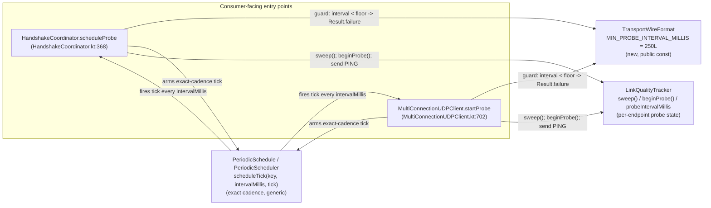

# Issue #34 — link-quality probe cadence fix (architecture)

## Header / Association

- **Covers:** `SpartanLaboratories/WebTools#34` — *"Link-quality probe fires at
  4x its configured interval (probe tick never checks due-ness)"* (label:
  `bug`). **Also fixed under #34, per the maintainer (no separate issue):** the
  latent validation-ordering bug recorded in §6.1, where a rejected call writes its
  invalid interval onto a running probe's tracker and permanently switches off
  its loss detection.
- **What this document is:** a **systems design record** for a small,
  self-contained bug fix — not a decision-support document (there is no open
  "should we do this" question) and not the implementation plan. It exists so
  the fix's shape, its one new public constant, and its adoption sweep across
  the six `PeriodicSchedule` call sites are recorded before code is written.
  There is no file-by-file breakdown and no test matrix here — those belong to
  `docs/issue-34-probe-cadence-plan.md` (named again in §8).
- **Baseline:** `webtools-udp` `2.0.0-alpha3` on `feat/2.0-framed-transport`.
  Working tree clean at time of writing.
- **Branch model:** lands **only** on the long-lived `2.x` integration branch
  `feat/2.0-framed-transport` (off `master`), mirroring the Issue #14 stage
  precedent (`docs/issue-14-reliable-channel-api-plan.md` header): a
  short-lived branch off the integration branch (e.g.
  `fix/issue-34-probe-cadence`), deleted after merge, PR targets
  `feat/2.0-framed-transport`, never `master`. **`master` is explicitly out of
  scope** — see §1.3.
- **Target version:** `webtools-udp` `2.0.0-alpha3` → **`2.0.0-alpha4`**.
- **Status:** complete. The plan (`docs/issue-34-probe-cadence-plan.md`) is
  written, and both maintainer decisions are incorporated: OD-1 adopted, and
  the validation-ordering bug fixed under #34 (§11.4). **No open decisions.**
- **Related docs:**
  - `docs/issue-13-link-quality-probe-plan.md` — origin of `Rtt`,
    `LinkQualityTracker`, `PeriodicScheduler` (née `KeepAliveScheduler`), and
    the opt-in / lazy-scheduler pattern this fix operates inside.
  - `docs/issue-14-reliable-engine-plan.md` / `issue-14-reliable-channel-api-plan.md`
    — introduced `PeriodicSchedule.scheduleTick` for the retransmit tick,
    specifically because `schedule()` cannot express a sub-250 ms/exact
    cadence (`webtools-udp/build.gradle.kts:50-51`). This fix is the second
    consumer of that seam, not a new one.
  - `docs/issue-14-reliable-ordered-channel-design.md` — house format this
    document follows.

---

## 1. Requirements

### 1.1 The ask

The opt-in link-quality probe (`HandshakeCoordinator.scheduleProbe`,
`MultiConnectionUDPClient.startProbe`) must send its `0x81` `PING` at the
cadence a consumer configures, not at whatever cadence
`PeriodicSchedule.schedule`'s internal poll-division happens to produce.

### 1.2 Root cause, stated correctly (corrects the issue's "4x" headline)

`PeriodicSchedule.schedule(key, intervalMillis, tick)` deliberately runs `tick`
at `KeepAlive.pollIntervalMillis(intervalMillis)` —
`(intervalMillis / 4).coerceIn(250, 5000)` (`KeepAlive.kt:26`) — **faster**
than the configured interval, so that a tick can re-check whether its action
is actually due (the poll-division rationale `scheduleTick`'s own KDoc states
explicitly by contrast: `schedule` "runs at `KeepAlive.pollIntervalMillis(intervalMillis)`
... rather than the requested interval itself," `PeriodicScheduler.kt:29-38`).
The keepalive tick honours that intent
(`HandshakeCoordinator.kt:353`, `MultiConnectionUDPClient.kt:671`, both gated
on `KeepAlive.isDue(...)`); the probe tick does not — it sends
unconditionally on every poll (`HandshakeCoordinator.kt:373-378`,
`MultiConnectionUDPClient.kt:705-709`).

Because `coerceIn` is a **two-sided** clamp, the resulting error is not
uniformly "4x" — it depends on which band the configured interval falls in:

| Configured `intervalMillis` | `pollIntervalMillis` result | Effective probe cadence vs. configured |
|---|---|---|
| `< 250` (e.g. `startProbe(200)`) | clamped to the `250` floor | **slower** than configured (200 ms asked, 250 ms delivered) |
| `== 250` | clamped to the `250` floor | **exactly correct** — the one interval at which today's code is already right |
| `(250, 1000)` (e.g. `startProbe(500)`) | clamped to the `250` floor | **faster**, by `intervalMillis / 250` — between 1x and 4x |
| `[1000, 20000]` | exactly `intervalMillis / 4` | **exactly 4x faster** |
| `> 20000` | clamped to the `5000` ceiling | **more than 4x faster**, by `intervalMillis / 5000` (worse as the interval grows) |

The issue's "4x" headline is correct only for the `[1000, 20000]` band — which
does include the documented default of 1000 ms, so the headline is right about
the default and wrong as a general statement. This document and its plan use
the five-row table above, not the headline, as the authoritative description of
the defect.

Note the second row: **250 ms is precisely the interval at which the current
buggy code already behaves correctly**, and the point below which the old clamp
made the probe *too slow* rather than too fast. The floor chosen in §1.3.3 is
therefore not an arbitrary round number — it is exactly the boundary of the
range the old clamp could represent faithfully.

### 1.3 Binding constraints (maintainer-decided; not revisited here)

1. **Scope: `feat/2.0-framed-transport` only, as `2.0.0-alpha4`.** `master`
   (`1.6.0` source) is out of scope — not analysed, no backport proposed.
   `webtools-udp` on Maven Central is at **`1.1.0`**
   (`repo1.maven.org` `maven-metadata.xml`, `<latest>1.1.0</latest>`), so every
   version from `1.2.0` through every `2.0.0-alphaN` — including the version
   that carries this bug — is source-only; no released artifact carries it.
   `master` is a strict ancestor of this branch
   (`git rev-list --left-right --count master...feat/2.0-framed-transport` →
   `0  18`, confirmed), so the eventual `2.0` merge carries the fix to
   `master` automatically. The Issue #14 Stage-3 plan's "Baseline: `1.6.0` on
   `master` (Maven Central; ...)" parenthetical
   (`docs/issue-14-reliable-channel-api-plan.md:22`) names **coordinates**,
   not a publication event — `docs/issue-13-link-quality-probe-plan.md:38-39`
   says plainly the `1.6.0` merge is "not yet published to Maven Central."
2. **Mechanism: `.schedule(...)` → `.scheduleTick(...)`** at the two probe
   call sites. No due-ness check is added — `scheduleTick` already delivers
   the exact requested cadence, so there is nothing to check due-ness
   *against*.
3. **Floor:** `startProbe`'s (and `scheduleProbe`'s) `intervalMillis` gets a
   documented, **enforced 250 ms minimum**, **rejecting** rather than
   clamping.
4. **One plan document** follows this architecture:
   `docs/issue-34-probe-cadence-plan.md`.

---

## 2. Research findings applied

Of everything synthesised, three conclusions actually shaped this design
(the rest — the two call sites, the fixture gap, the test literals — are
factual findings this document records rather than open questions it
resolved):

1. **The exact-cadence seam already exists, and was built for this reason.**
   `PeriodicSchedule.scheduleTick` was added in Stage 3 of Issue #14
   specifically because `schedule()` "cannot express a sub-250ms cadence"
   (`webtools-udp/build.gradle.kts:50-51`; `PeriodicScheduler.kt:29-46`). This
   determines the fix's shape: swap the call, do not touch the shared
   scheduler (§3.2).
2. **250 ms is a validated floor, not an inherited one.** Comparable UDP
   game-transport libraries default well above it (ENet 500 ms, LiteNetLib
   1000 ms, Lidgren 4000 ms); BFD's sub-50 ms figures assume ASIC/FPGA offload
   and are not comparable to a JVM-scheduled probe. This justifies keeping
   `250` as the floor value rather than picking a different number when the
   clamp is removed.
3. **Marking a probe LOST is load-bearing, not incidental state.** Per
   `LinkQualityTracker.kt:16`'s documented invariant
   ("`IN_FLIGHT -> DELIVERED | LOST`; `DELIVERED` and `LOST` are terminal"),
   `completeProbe` only matches `State.IN_FLIGHT` (`LinkQualityTracker.kt:69`).
   A very-late `PONG` past the loss horizon must find its probe already
   `LOST`, or it both poisons the RFC 6298 SRTT EWMA and flips a lost probe
   back to delivered. This rules out replacing the mutating `sweep()` with a
   lazy, read-time evaluation (§6.2) and grounds OD-1 (§10).

---

## 3. System-level design

### 3.1 What changes

Two call sites, one new constant, and one line in `LinkQualityTracker`, all
inside `webtools-udp`:

| Change | Where | Owner |
|---|---|---|
| `probeSchedule.schedule(peer, intervalMillis) { ... }` → `probeSchedule.scheduleTick(peer, intervalMillis) { ... }` | `HandshakeCoordinator.scheduleProbe`, `HandshakeCoordinator.kt:373` | `HandshakeCoordinator` |
| `probe.schedule(serverEndpoint, intervalMillis) { ... }` → `probe.scheduleTick(serverEndpoint, intervalMillis) { ... }` | `MultiConnectionUDPClient.startProbe`, `MultiConnectionUDPClient.kt:705` | `MultiConnectionUDPClient` |
| New `const val MIN_PROBE_INTERVAL_MILLIS = 250L` | `TransportWireFormat` (public object), beside `DEFAULT_PROBE_INTERVAL_MILLIS` (`TransportWireFormat.kt:49`) | `TransportWireFormat` |
| A floor check, `runCatching { require(intervalMillis >= MIN_PROBE_INTERVAL_MILLIS) { ... } }`, with the existing body chained after it via `flatMap`; duplicated verbatim | both call sites above, as the **first** operation, before the registration lookup and before the tracker is fetched or written (the ordering is load-bearing, see §6.1) | `HandshakeCoordinator` / `MultiConnectionUDPClient` respectively |
| `sweep()` becomes the first statement of `snapshot()`, so every read ages in-flight probes itself (OD-1, adopted) | `LinkQualityTracker.snapshot()`, `LinkQualityTracker.kt:101-102` | `LinkQualityTracker` |

The probe tick body itself is otherwise unchanged: `sweep()`,
`beginProbe()`/`linkQuality.beginProbe()`, send. It already runs
unconditionally on every poll — that becomes correct once the poll interval
*is* the configured interval.

### 3.2 Why the floor sits at the two probe entry points, not in `PeriodicScheduler`

`PeriodicSchedule`/`PeriodicScheduler` is a **generic** per-endpoint ticker: it
has no notion of "probe" or "keepalive," only `schedule` (poll-divided) and
`scheduleTick` (exact). `scheduleTick` is *already* shared with the
reliable-channel retransmit tick, which arms it at
`ReliableChannelEngine.DEFAULT_RETRANSMIT_TICK_MILLIS = 50L`
(`ReliableChannelEngine.kt:188`, wired at `HandshakeCoordinator.kt:307` /
`MultiConnectionUDPClient.kt:468`). A 250 ms floor inside `scheduleTick`
itself would silently break that unrelated 50 ms tick — the single most
tempting wrong place to put this fix. The floor is a **probe-specific policy**
(it protects `LinkQualityTracker`'s loss-horizon arithmetic, not the
scheduler's own contract), so it belongs where the probe's other
probe-specific policy already lives: at the two call sites that mint a
`LinkQualityTracker` and arm its schedule, expressed as a public constant on
`TransportWireFormat` — the object that already owns
`DEFAULT_PROBE_INTERVAL_MILLIS` and every other probe wire/policy constant a
consumer can reference.

`KeepAlive` and `Liveness` are `internal object`s (`KeepAlive.kt:9`,
grep-confirmed for `Liveness`), so a constant placed there could not be named
in the public KDoc on `Connection.startProbe` (`Connection.kt:231`) or
`MultiConnectionUDPClient.startProbe` (`MultiConnectionUDPClient.kt:702`).
This matches the repo's existing rule that every bound a consumer can hit is a
public `const val` (`MultiConnectionUDPServer.MIN_RECEIVE_BUFFER_BYTES` /
`MAX_UDP_PAYLOAD_BYTES` at `:547`/`:554`; `UdpChannel.DEFAULT_MAX_RELIABLE_MESSAGE_BYTES`
/ `MAX_RELIABLE_MESSAGE_BYTES` at `UdpChannel.kt:54`/`:57`), while the
private `coerceIn` constants on `KeepAlive`/`Liveness` stay reserved for
cadences the library derives internally and never hands back to a consumer.

### 3.3 Interaction diagram

No new system is introduced; the diagram exists to make explicit that the fix
touches exactly one boundary per call site (the new floor check against
`TransportWireFormat`) and reuses an existing boundary unchanged (`scheduleTick`
against `PeriodicSchedule`).

### 3.4 Loss-horizon alignment on the exact-cadence tick

With `scheduleTick(interval)` and the tick body ordered
`sweep(); beginProbe(); send(...)`, is a probe declared lost on the tick that
first finds it past the horizon, or can it slip a whole interval? It cannot
slip.

Let tick *k* start at *S_k*. `sweep()` runs at about *S_k*, then
`beginProbe()` records the probe's send time *T = S_k + δ*, where *δ* is the
sweep's duration. `scheduleWithFixedDelay` (`PeriodicScheduler.kt:104-107`)
never fires early and restarts its delay only after the task completes, so
*S_{k+3} − S_k = 3·interval + D*. Here *D* is the three tasks' durations plus
three scheduler latenesses, and *D ≥ 3δ*. The probe's age at tick *k+3*'s
sweep is therefore *S_{k+3} − T = 3·interval + D − δ > 3·interval*. So
`Rtt.isProbeLost`'s `ageMillis >= LOSS_HORIZON_INTERVALS * intervalMillis`
holds, and the probe is aged to `LOST` on tick *k+3*, never slipping to *k+4*.
At tick *k+2* its age is about *2·interval*, so it is never aged early either.
(Truncating the age to whole milliseconds cannot break this: the true age is
at least *3·interval* and the interval is a whole number of milliseconds.)

Two consequences follow:

- **Coupling the sweep to the send tick has no off-by-one risk.** That retires
  a plausible objection to keeping `sweep()` in the tick body.
- **In steady state, a read taken between ticks lags the true loss state by
  only *D − δ*.** A probe crosses its horizon at *T + 3·interval = S_{k+3} − (D − δ)*,
  just before the tick that sweeps it. That gap is accumulated drift, typically
  a few milliseconds. This is the corrected basis for OD-1's rationale (§10).
  The lag grows to a full interval only when a re-arm at a different interval
  breaks the alignment, and it is unbounded after `stopProbe()`.

---

## 4. Integration with existing systems — adoption sweep

`PeriodicSchedule` has exactly six production call sites. Every one is
accounted for below; only the two probe sites are wrong.

| Call site | Current mechanism | Correct? | Verdict |
|---|---|---|---|
| `HandshakeCoordinator.scheduleProbe` — `HandshakeCoordinator.kt:373` | `schedule()` | **No** — this defect | **In scope now** — swap to `scheduleTick` + add the floor guard |
| `MultiConnectionUDPClient.startProbe` — `MultiConnectionUDPClient.kt:705` | `schedule()` | **No** — this defect | **In scope now** — swap to `scheduleTick` + add the floor guard |
| `HandshakeCoordinator.scheduleKeepAlive` — `HandshakeCoordinator.kt:351` | `schedule()`, gated on `KeepAlive.isDue` at `:353` | Yes | No change — already implements the poll-then-check contract `schedule()` documents |
| `MultiConnectionUDPClient.startKeepAlive` — `MultiConnectionUDPClient.kt:669-670` | `schedule()`, gated on `KeepAlive.isDue` at `:671` | Yes | No change |
| `HandshakeCoordinator.reliableEngineFor` (retransmit) — `HandshakeCoordinator.kt:307` | `scheduleTick()`, exact 50 ms | Yes | No change — already the reference use of `scheduleTick` |
| `MultiConnectionUDPClient.reliableEngine` (retransmit) — `MultiConnectionUDPClient.kt:468` | `scheduleTick()`, exact 50 ms | Yes | No change |

**Checked and explicitly not a second instance of the defect:** the
idle-connection liveness sweep is not on `PeriodicSchedule` at all. It runs
its own `mcups-liveness` `ScheduledExecutorService`
(`MultiConnectionUDPServer.kt:276-298`), and
`HandshakeCoordinator.sweepIdleConnections()` gates on
`Liveness.isOverdue(reg.lastInboundAt, now, idleTimeoutMillis)`
(`HandshakeCoordinator.kt:465`) — the real timeout, correctly re-checked every
sweep — despite `Liveness.sweepIntervalMillis`
(`Liveness.kt:41`) having a `coerceIn` formula structurally identical to
`KeepAlive.pollIntervalMillis`. No change; recorded here so the sweep is not
mistaken for an overlooked third defect.

### 4.1 Test-fixture and test-literal adoption (also in scope now)

The production fix is invisible to Level-2 coverage without a fixture change:

- **`FakePeriodicSchedule`**
  (`webtools-udp/src/test/kotlin/com/spartanlabs/testing/support/webtools/udp/FakePeriodicSchedule.kt`)
  records both `schedule()` (`:40`) and `scheduleTick()` (`:50`) into the same
  `scheduleCalls` list / `scheduled` map via one `Scheduled(key, intervalMillis, tick)`
  data class (`:28`), with no field recording which method armed it. **In
  scope now:** add a discriminator (e.g. a `via` property on `Scheduled`)
  so `testing/component/webtools/udp/MultiConnectionUDPClientProbeTest.kt:87`
  (the `probe.scheduleCalls.single()` assertion — note there is a
  same-named but unrelated integration-level test file that does not use
  this fixture at all) and `HandshakeCoordinatorTest.kt:952` can assert the
  probe now arms via `scheduleTick`, not `schedule`. Blast radius is zero: the
  fixture's own two
  `override fun schedule`/`scheduleTick` bodies are the only construction
  sites, and no test destructures, `.copy()`s, or equality-asserts a whole
  `Scheduled` instance.
- **Eight test literals below the new 250 ms floor, across 4 files** — **in
  scope now**, bump to `≥250`:
  - `MultiConnectionUDPFramingE2ETest.kt:57,59` — `startProbe(50L)` ×2
    (`startKeepAlive(50L)` on the same lines is unaffected — the floor is
    probe-only)
  - `MultiConnectionUDPProbeE2ETest.kt:36,58,95,122` — `startProbe(200L)` ×4
  - `MultiConnectionUDPClientProbeTest.kt:123` (integration level) —
    `startProbe(200L)`
  - `MultiConnectionUDPClientProbeNonFunctionalTest.kt:179` —
    `startProbe(1L)`, highest-risk of the eight: it asserts nothing on the
    return value today, so left unbumped it would silently stop exercising
    the PING-racing-`stop()` scenario the test is named for.

  Every one of these bumps is zero-cost at runtime: today's clamp already
  forces an effective ≥250 ms cadence for all eight, so raising the literal
  changes what the test *asserts*, not what it *does*. One semantic note:
  `LinkQualityTracker.probeIntervalMillis` stores the configured value, so
  200→250 moves the loss horizon (`Rtt.LOSS_HORIZON_INTERVALS * intervalMillis`)
  from 600 ms to 750 ms; the affected tests' await windows have slack (6 s) to
  absorb this. `ProbeValidationGatingTest.kt` (`0`/`-1`, exercising the
  pre-existing non-positive check) and every other probe interval in the
  suite (300L/500L/5000L) are unaffected.

### 4.2 Documentation-surface adoption (also in scope now)

OD-1 (§10, adopted) adds a separate documentation touch, detailed in plan
§3.5a. `LinkQualityTracker`'s class, `sweep()` and `snapshot()` KDoc now say a
read sweeps first. And both public `stopProbe` KDocs gain one sentence on the
post-stop settling (§9).

Three KDoc blocks state the probe's interval contract as "`must be > 0`" and
need the floor added:

- `Connection.startProbe` (public default method) — `Connection.kt:228-230`.
- `MultiConnectionUDPClient.startProbe` (public) —
  `MultiConnectionUDPClient.kt:695-696`.
- `ClientChannel.scheduleProbe` (internal interface, Component-ring KDoc) —
  `ClientChannel.kt:76`.

`README.md:270-271` documents `startProbe(intervalMillis)` without stating a
minimum; add the 250 ms floor there. `README.md:281`'s "sends one tiny `0x81`
probe ... per interval" already describes the *intended* behaviour this fix
restores, so that line needs no correction — only the addition of the floor,
per the README-currency rule (this changes `startProbe`'s documented
contract, which lands on `master`, README's home).

---

## 5. Extension & stability

One new public surface: `TransportWireFormat.MIN_PROBE_INTERVAL_MILLIS`.

- **Tier: Stable Core.** It sits beside `DEFAULT_PROBE_INTERVAL_MILLIS`
  (same object, same purpose — a probe wire/policy constant a consumer reads
  and reasons against) and follows the same semver guarantee as every other
  public `const val` on `TransportWireFormat`. This is a bound, not an
  extension seam, so `@SupportedExtension`/`@RequiresOptIn` do not apply.
- **Not open for override.** `TransportWireFormat` is an `object`
  (infrastructure constant holder, not a domain type or a strategy); nothing
  about this fix creates a new hierarchy or a new strategy interface, so the
  inheritance-vs-interface question in the library-design rules does not
  arise here.
- **Policy already parameterised.** The floor's *value* (`250`) is the
  parameter; `intervalMillis` remains the consumer-supplied policy input, now
  validated against a named, public lower bound instead of an undocumented
  internal clamp.
- **Behavioural change, not a new surface.** `startProbe`/`scheduleProbe`
  already documented `intervalMillis` as "must be `> 0`" and already returned
  `Result.failure(IllegalArgumentException)` for a non-positive value; this
  fix narrows the accepted range (`[1, 249]` now fails where it previously
  silently succeeded at an effective 250 ms). Narrowing a documented bound is
  ordinarily a major-version change; here it rides a major version that is
  already in progress and not yet published — `2.0.0` is an unpublished
  `2.0.0-alphaN` pre-release series, and Maven Central's latest `webtools-udp`
  is `1.1.0` (§1.3.1), so no consumer can be depending on the narrowed
  contract. Acceptable without a deprecation path for that reason
  specifically, not because alpha versions are exempt in general.

---

## 6. Alternatives considered

### 6.1 Validation form for the new floor

Four shapes were weighed for the floor check. The maintainer's instruction was a
"`require`-enforced" floor "matching the house validation pattern", and the
chosen form is the only one that does exactly that while meeting every
technical constraint.

| Form | Verdict | Why |
|---|---|---|
| **`runCatching { require(...) }` scoped to the check alone, existing body chained after it with `flatMap`**, duplicated at both call sites | **Chosen** | This is the house pattern for a `Result`-returning function that validates an argument. Every `require` in `webtools-udp` main sits either in a constructor `init` block (which throws by design) or inside a `runCatching` in a `Result`-returning function: `HandshakeProtocol.parseHandshake` (`HandshakeProtocol.kt:55-57`), `PeriodicScheduler.schedule`/`scheduleTick` (`PeriodicScheduler.kt:81-82,88-89`). It yields `Result.failure(IllegalArgumentException)` and never throws. The `runCatching` holds **only** the `require`, and `flatMap` (`ResultExtensions.kt:19`) is `fold(onSuccess = transform, ...)`, so it catches nothing. Exceptions from the existing body propagate exactly as today, and no catch is broadened. On the client it also keeps the trailing `.onFailure { log.error(...) }` at the end of the chain, so every rejected interval is logged at ERROR exactly as today's `0`/`-1` rejection already is. |
| Explicit guard, `if (intervalMillis < MIN) return Result.failure(IllegalArgumentException(...))` | Rejected (originally chosen, reversed in the alignment pass, §11) | It does not use `require`, so it departs from the literal instruction. It has no house precedent for *argument* validation: the explicit `return Result.failure(...)` sites in this module are for **state** (`IllegalStateException("No registration...")`, `HandshakeCoordinator.kt:369-370`) or a typed domain failure (`ReliableMessageTooLargeException`), never an `IllegalArgumentException` for a bad argument. And on the client it returns *before* the trailing `.onFailure { log.error(...) }`, so it would silently stop logging `0`/`-1` rejections that are logged today. |
| Bare `require(...)` | Rejected | Would **throw** out of both methods, breaking their documented `Result`-returning contract (`README.md:12`: "Every fallible operation returns `kotlin.Result` rather than throwing"). Today's *non-positive*-interval `Result.failure` is only a `Result` because the `require` lives inside `PeriodicScheduler.schedule`'s own `runCatching` (`PeriodicScheduler.kt:80-84`). That safety net does not cover a `require` placed in the caller. |
| `runCatching { ... }` around the whole existing method body | Rejected | Would also start swallowing exceptions from unrelated statements already in those bodies (`registrations.findByOrigin`, `LinkQualityTracker` construction) that propagate uncaught today. That silently broadens what the method catches, as a side effect of a cadence fix. The chosen form avoids this by scoping the `runCatching` to the `require` alone. |

**The check must run first, and that ordering is load-bearing.** Today both
entry points write `tracker.probeIntervalMillis = intervalMillis` *before* the
interval is validated (the `> 0` check lives downstream in
`PeriodicScheduler`). When that check rejects, `arm()` is never reached and the
running schedule is not cancelled. So `startProbe(1000)` followed by
`startProbe(0)` leaves the original probe running with its tracker's interval
overwritten to `0`, and `Rtt.isProbeLost` returns `false` for any interval
`<= 0` (`Rtt.kt:69`). A rejected call permanently switches off loss detection
on a healthy running probe. Validating before any state is touched closes this
latent bug, and the new floor makes it much easier to hit, because `[1, 249]`
joins the rejected range. So the plan adds a regression guard on each side.

**Not extracted to a shared helper.** The floor constant is shared
(`TransportWireFormat.MIN_PROBE_INTERVAL_MILLIS`); the floor check is
duplicated verbatim at both sites. This follows the repo's own precedent:
the keepalive tick shares only the pure predicate `KeepAlive.isDue` and
duplicates its wiring; the retransmit tick is duplicated verbatim between
`HandshakeCoordinator.kt:307` and `MultiConnectionUDPClient.kt:468`, linked
only by a "mirrors" KDoc cross-reference, not a shared function.

### 6.2 Lazy, read-time loss evaluation instead of `sweep()`

Proposed: replace `LinkQualityTracker.sweep()`'s mutation with computing
lostness lazily inside `snapshot()`, removing the need to think about sweep
frequency at all. OD-1 (§10, adopted) gets the read freshness this was after,
safely. `snapshot()` calls the *mutating* `sweep()` first, so every read is
exact and `LOST` stays terminal. That is exactly the property the lazy variant
loses, as follows.

**Rejected.** `completeProbe` matches only `it.state == State.IN_FLIGHT`
(`LinkQualityTracker.kt:69`), and `LinkQualityTracker.kt:16` documents the
invariant "`IN_FLIGHT -> DELIVERED | LOST`; `DELIVERED` and `LOST` are
terminal." Marking a probe `LOST` is precisely what prevents a very-late
`PONG` — one arriving past the `Rtt.LOSS_HORIZON_INTERVALS`-interval horizon —
from being matched and feeding a stale, multi-second sample into the RFC 6298
SRTT EWMA. A lazy, non-mutating evaluation would leave such a probe
`IN_FLIGHT` forever, so a late reply would both poison the RTT estimate *and*
flip a probe from "lost" to "delivered" after the fact. The codebase already
understands this class of hazard: the Stage-2 `ReliableRtoEstimator`
implements Karn's algorithm for the equivalent problem on the reliable
channel's RTO.

---

## 7. Documentation impact (Audience-Reach rings)

| Ring | Touched? | What moves with the change |
|---|---|---|
| **Inner core** | yes | A short comment at each call site explaining three things a future reader is likely to second-guess: why the floor check is duplicated rather than shared (§6.1); why it must run **before** any state is touched, since reordering it reopens the latent loss-detection bug (§6.1); and why the floor lives on `TransportWireFormat` and not `KeepAlive`/`PeriodicScheduler` (§3.2). Plus a `//` comment above `MIN_PROBE_INTERVAL_MILLIS` recording why the value is 250 (§1.2), which is maintainer context kept out of the public KDoc. |
| **Component ring (KDoc)** | yes | `Connection.startProbe`, `MultiConnectionUDPClient.startProbe`, `ClientChannel.scheduleProbe` — all three restate the interval contract as "`must be >= MIN_PROBE_INTERVAL_MILLIS (250 ms)`"; new KDoc on `TransportWireFormat.MIN_PROBE_INTERVAL_MILLIS` itself. |
| **Boundary ring (protocol)** | no | No wire format change — same `0x81`/`0x82` datagrams, same cadence semantics as always documented, just now actually delivered. |
| **Architectural outer layer** | no | No new thread, no new system, no topology change — `mcup{c,s}-probe` already existed and already ran on this schedule seam. |
| **README** | yes — small | Add the 250 ms floor to the `startProbe` snippet (`README.md:270-271`); the surrounding prose (`:281`, "per interval") already describes the corrected behaviour and needs no rewrite. |

The 5-level test plan (which levels get which new/changed cases) belongs in
`docs/issue-34-probe-cadence-plan.md`, not here.

---

## 8. Decomposition

This is **exactly one plannable unit** — a ~10-line production change (two
call-site swaps, one constant, two duplicated floor checks) with a wide
test-and-doc tail, not a system decomposition. Splitting it further would
manufacture structure a fix this size does not have.

| Slug | Scope | Depends on | Landing order |
|---|---|---|---|
| `issue-34-probe-cadence` | Swap both probe call sites to `scheduleTick`; add `TransportWireFormat.MIN_PROBE_INTERVAL_MILLIS` and a duplicated `runCatching { require }` floor check that runs first at both entry points (which also fixes the validation-ordering bug); make `LinkQualityTracker.snapshot()` sweep first (OD-1); add the `FakePeriodicSchedule` `via` discriminator; bump the 8 sub-250 ms test literals; add the validation-ordering regression guards and the OD-1 test; update the interval-contract KDoc, the OD-1 KDoc and README; bump `webtools-udp` to `2.0.0-alpha4`. | none | only unit — lands directly on `feat/2.0-framed-transport` |

The single plan document, `docs/issue-34-probe-cadence-plan.md`, turns this
into the file-by-file change set and the 5-level test matrix.

---

## 9. Risks at the systems level

- **Behavioural break, contained.** Any consumer currently calling
  `startProbe`/`scheduleProbe` with an interval in `[1, 249]` today gets a
  (mis-timed, ~250 ms) probe; after this fix, the same call fails with
  `IllegalArgumentException`. Acceptable per §5: no released artifact
  (Maven Central is at `1.1.0`) is affected, and `2.0.0-alphaN` carries no
  semver stability promise yet.
- **Cadence-accuracy improvement changes downstream timing assumptions.**
  Any test or consumer that (knowingly or not) relied on the probe firing
  ~4x its configured interval — e.g. to get a fast first `LinkQuality`
  reading — now waits the full configured interval. The 8 test-literal bumps
  in §4.1 are the only place this repo's own suite depended on that, and all
  have confirmed slack.
- **No concurrency shape change.** `scheduleTick` runs on the same
  single-thread `mcup{c,s}-probe` executor `schedule` used; `LinkQualityTracker`'s
  `@Synchronized` methods keep their single-monitor design. OD-1 (§10,
  adopted) adds the one concurrency note: `snapshot()` now calls `sweep()`
  under the same monitor. That is reentrant, since both are `@Synchronized` on
  the same instance, so a consumer read holds the lock for one extra ring walk
  bounded at `windowSize`.
- **OD-1 changes one observable behaviour.** Once `stopProbe()` cancels the
  tick, nothing used to age the probes still in flight, so they stayed
  uncounted and the snapshot froze. Now a read ages them, and an unanswered one
  counts as lost once past the horizon. `packetLossRatio` can therefore settle
  for up to three probe intervals after the stop. Both public `stopProbe` KDocs
  state this (plan §3.5a). No existing assertion depends on the old frozen
  behaviour.
- **No migration needed.** No wire format, no persisted state, no schema —
  a version bump and a behavioural correction only.
- **Cross-repo impact:** not raised here, per standing instruction —
  downstream projects handle their own adoption.

---

## 10. Open decisions

**None.** OD-1 has been resolved by the maintainer: **adopted**. `sweep()` is the
first statement of `LinkQualityTracker.snapshot()` (plan §3.5a, tested in
§3.10a). Its one consumer-visible consequence is recorded in §9: the snapshot
can settle after `stopProbe()`.

**Correction to OD-1's rationale as originally recorded.** It claimed a read
between ticks "can now lag the true loss state by up to one full interval
(previously ≤ interval/4)". That overstates the steady state. After this fix
the tick period equals the interval and the horizon is exactly
`LOSS_HORIZON_INTERVALS` (3) ticks. So a probe sent on tick *k* crosses the
horizon a hair *before* tick *k+3*, which then sweeps it. By §3.4's boundary
arithmetic the gap is only the accumulated task time and scheduler lateness
of three ticks, typically a few milliseconds. The lag reaches a full interval
only after a re-arm at a *different* interval, when probes sent at the old
cadence age against the new tick grid. After `stopProbe()` it is unbounded,
because no tick sweeps again. OD-1 stands on those two cases and on making
every read exact. The original proposal, verbatim, for the record:

| # | Decision (as originally proposed) | Recommendation (as originally proposed) |
|---|---|---|
| **OD-1** | Once the probe tick runs once per interval instead of ~4x, `sweep()` runs less often, so a `snapshot()` taken between ticks can now lag the true loss state by up to one full interval (previously ≤ interval/4). Should `snapshot()` call `sweep()` at its own top, so a read always reflects the moment it is taken? | **Adopt.** `sweep()` and `snapshot()` are both `@Synchronized` on the same `LinkQualityTracker` instance, so the nesting is reentrant; the ring walk is bounded at `windowSize` (default 64, `LinkQualityTracker.kt:110`); `LOST` stays terminal, preserving the §6.2 protection. This is optional polish, not required for the cadence fix itself — the maintainer may strike it and keep the change to the two call sites plus the floor. |

---

## 11. Cross-plan alignment

The planner's own final pass over this document and its one plan
(`docs/issue-34-probe-cadence-plan.md`). With a single unit there are no
plan-to-plan seams. The alignment checked are plan ↔ architecture, both
against the code, and both against the maintainer's two binding answers.

### 11.1 What was checked

- **Seams.** `MIN_PROBE_INTERVAL_MILLIS` has the same name, type (`Long`),
  value (`250L`), home (`object TransportWireFormat`, public, `:32`) and tier
  (Stable Core) in both documents. The floor check has the same form, message
  and position at both call sites. Both documents agree that the floor never
  enters `PeriodicSchedule`/`PeriodicScheduler`.
- **Citations, spot-checked against the tree:** both probe call sites
  (`HandshakeCoordinator.kt:373`, `MultiConnectionUDPClient.kt:705`); all
  three KDoc blocks, including `ClientChannel.kt:76`, which the architect found
  and the planner's own brief had missed; the 8 sub-floor test literals in 4
  files; the two same-named `MultiConnectionUDPClientProbeTest.kt` files
  (component vs integration); every `HandshakeCoordinatorTest` `scheduleProbe`
  call (all `300L`, so none break); the `ProbeValidationGatingTest`
  assertions, which hold under the new check; the `assertIs` import claims for
  both component files; the `@Tag("integration")` convention (18 of 18
  existing files) and its Gradle binding (`includeTags` per level); and that
  `MultiConnectionUDPClient.sendDatagram` does not gate on a handshake, so the
  new Level-3 cadence test really does emit PINGs.
- **Coverage.** Cadence is corrected on both entry points. The floor is
  enforced and documented on both. The Level-3 count-over-window test Issue #34
  asks for is present. Both binding answers are honoured: branch-only on
  `feat/2.0-framed-transport` via `scheduleTick`, and a `require`-enforced
  250 ms floor that rejects rather than clamps. All six `PeriodicSchedule` call
  sites are accounted for (§4), and the liveness sweep is confirmed not to be a
  second defect.
- **Standards.** File-by-file current/replacement text; signatures with their
  error handling; a 5-level test matrix with level and full path per case;
  Audience-Reach rings; README currency; commit split and branch model.

### 11.2 What the alignment pass changed

| # | Change | Where | Why |
|---|---|---|---|
| 1 | **Validation form reversed**: explicit `return Result.failure(IAE)` → `runCatching { require(...) }.flatMap { existing body }` | arch §3.1, §6.1; plan §2, §3.2, §3.3 | The earlier resolution was wrong. The maintainer asked for a "`require`-enforced" floor "matching the house validation pattern" (restated as "`require`-backed" on resume). Every `require` in this module's main source is either in a constructor `init` or inside a `runCatching` in a `Result`-returning function, and there is no precedent for an explicit `IllegalArgumentException` return for argument validation. The chosen form satisfies the literal instruction, the `Result` contract, and the no-broadened-catch constraint all at once. The explicit form would also have silently dropped the client's existing ERROR log for `0`/`-1`. |
| 2 | **Latent bug found and recorded**, and the validation-first ordering made load-bearing | arch §6.1; plan §2, §6 | Today a rejected `startProbe(0)` after a successful arm writes `0` onto the live tracker, which permanently switches off loss aging (`Rtt.kt:69`). The fix closes it only while the check stays ahead of every state write. |
| 3 | **Two regression guards added** for that ordering | plan §3.9 (server, Level 2), §3.7c (client, Level 3) | The two call sites are duplicated code, so either could be reordered alone. The server guard is deterministic: it pre-seeds a fake-clock `LinkQualityTracker` on the live registration, with no production change. The client's tracker is `private`, so its guard runs in real time on the existing `Echoer` harness. |
| 4 | **Band table corrected**: the slow/fast crossover is **250 ms**, not 1000 ms | arch §1.2 | An error in the planner's own brief that the architect faithfully reproduced (`startProbe(500)` runs 2x *fast*, not slow). Adds the point that 250 ms is precisely the one interval today's code already gets right. |
| 5 | **Stability wording corrected** | arch §5 | It called the module "pre-1.0-stable", which is false: 1.0.0 and 1.1.0 are published. Now rests on the real reason: `2.0.0` is unpublished. |
| 6 | **Public KDoc on `MIN_PROBE_INTERVAL_MILLIS` rewritten** | plan §3.1 | It linked two `internal` symbols (unresolvable in a consumer's docs) and narrated the bug's history. It now states only the contract and links only public symbols. The "why 250" history moves to an Inner-core `//` comment and the version comment. |
| 7 | **Version comment corrected** | plan §3.12 | "Instead of up to 4x faster" contradicted the band table. It now also records the latent-bug fix. |
| 8 | **Level-3 cadence test tightened** | plan §5.1 | It now counts `0x81` frames only (`DatagramType.PROBE_PING.tag`, the idiom already used at `component/.../MultiConnectionUDPClientProbeTest.kt:120-121`) rather than any datagram, and resets the reused `DatagramPacket`'s length on every iteration. |
| 9 | **README moved into the `fix:` commit** | plan §7 | Repo precedent: Issue #14 Stage 3 put `README.md` and its plan in the `feat:` commit `a988834` and kept `test:` to tests only. |
| 10 | **Two internal contradictions removed** | plan §3.6, §5 | §3.6 said `via` had a default and then that it had none (it has none). §5 said no new test class was needed, then listed one. |

### 11.3 Shared risks that remain

- **Wall-clock tests.** Two Level-3 assertions depend on real time: the
  cadence count (`3..5` band around the correct `4`, far from the bug's
  `~17`) and the client-side latent-bug guard (a 6 s budget, identical to the
  neighbouring loss-climb test). Both are built to tolerate CI jitter.
  Neither is immune to it.
- **Type inference at `return@flatMap Result.failure(...)`** is expected to
  resolve from the declared `Result<Unit>` return type. The plan gives the
  fallback (`Result.failure<Unit>(...)`) so an implementer following it
  literally does not stall.
- **One observable ordering change:** an unregistered peer passed an interval
  below the floor now gets `IllegalArgumentException` rather than
  `IllegalStateException`. No test depends on the old order, and the new one is
  the more actionable error.
- **OD-1's post-stop settling** (§9). This is the one consumer-visible behaviour
  change OD-1 makes: `packetLossRatio` can move for up to three probe intervals
  after `stopProbe()`. Both public `stopProbe` KDocs document it, and no
  existing assertion depends on the old frozen snapshot.

### 11.4 Maintainer decisions incorporated

| Decision | Maintainer's answer | Where it landed |
|---|---|---|
| OD-1: should `snapshot()` call `sweep()` first? | **Adopt** | arch §3.1, §8, §9, §10; plan §3.5a (code + KDoc), §3.10a (test), §3.12 (changelog), §6, §7 (commit 1), §9 |
| The validation-ordering bug: its own issue, or fixed under #34? | **Fix under #34** (no separate issue) | arch + plan headers ("Covers"); plan §7 (commit-1 body, PR description), §3.12 (changelog) |

While incorporating OD-1, the planner re-derived its rationale, found it
overstated, and corrected it in §10, with the original preserved verbatim. The
correction rests on boundary arithmetic that the architect had been given but
did not record, so it is now §3.4. The planner also documented OD-1's one
consumer-visible consequence (post-stop settling) and confirmed that every
existing `LinkQualityTracker` test, and the nonfunctional 100k-probe test, stay
valid under it (plan §3.10a).

**Landing plan** (plan §7):
- Branch `fix/issue-34-probe-cadence` off `feat/2.0-framed-transport`, with
  three commits:
  - `fix:` all of `src/main` including OD-1, plus README and both Issue #34
    documents;
  - `test:` the fixture and every test;
  - `build:` the bump to `2.0.0-alpha4`.
- PR into `feat/2.0-framed-transport` with `Refs #34`, because a closing
  keyword does not fire on a merge into a non-default branch.
- #34 is closed by hand once the PR merges.

---
