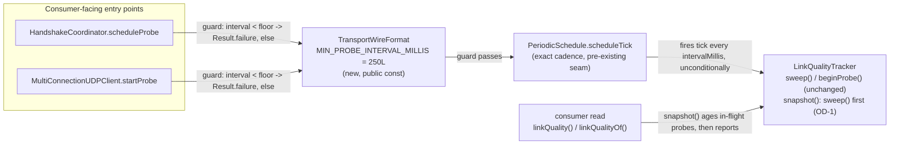

# Issue #34 — link-quality probe cadence fix (implementation plan)

## Header / Association

- **Covers:** `SpartanLaboratories/WebTools#34` — *"Link-quality probe fires at
  4x its configured interval (probe tick never checks due-ness)"* (label:
  `bug`). **Also fixed under #34, per the maintainer (no separate issue):** a
  latent validation-ordering bug found during planning. A rejected
  `startProbe`/`scheduleProbe` writes its invalid interval onto a running
  probe's tracker and permanently switches off its loss detection (§2). It is
  the same code, fixed by the same change, in the same PR.
- **What this document is:** the implementation plan for the single plannable
  unit `issue-34-probe-cadence` — a file-by-file change set and a 5-level test
  matrix. It turns the approved architecture into code; it makes no design
  decisions of its own.
- **Approved design:** `docs/issue-34-probe-cadence-architecture.md`, unit
  `issue-34-probe-cadence` (its only unit, §8). §1.2's five-row band table is
  the authoritative description of the defect; §1.3 records the four binding
  constraints; §3 the design; §10 OD-1, **resolved: adopted** (recorded in §9
  below); §11 the planner's alignment pass.
- **Baseline:** `webtools-udp` `2.0.0-alpha3` on `feat/2.0-framed-transport`.
  Working tree clean at planning time (confirmed: only this plan document is
  untracked).
- **Branch model:** short-lived branch **`fix/issue-34-probe-cadence`** off
  the long-lived integration branch `feat/2.0-framed-transport`, deleted
  (local + remote) after merge. PR targets `feat/2.0-framed-transport`,
  **never** `master` — `master` is out of scope (architecture §1.3.1).
- **This plan document** is committed in the same commit as the first
  implementation commit, so `git log --follow` binds plan to code.
- **Branch:** `fix/issue-34-probe-cadence` (off `feat/2.0-framed-transport`).
- **Commit: TBD**
- **PR: TBD**
- **Target version:** `webtools-udp` `2.0.0-alpha3` → **`2.0.0-alpha4`**.
- **Status:** planning complete. Both maintainer decisions are incorporated
  (OD-1 adopted; the validation-ordering bug fixed under #34). **No open
  decisions.** Ready for implementation.
- **Related docs:**
  - `docs/issue-34-probe-cadence-architecture.md` — the approved design this
    plan implements.
  - `docs/issue-14-reliable-channel-api-plan.md` — house format this document
    follows (§4 file-by-file, §6 test plan, §8 version, §9 version control);
    also the origin of `PeriodicSchedule.scheduleTick`, the seam this fix
    reuses, and of the Issue #34 filing itself (its own §7 risk list).
  - `docs/issue-13-link-quality-probe-plan.md` — origin of `LinkQualityTracker`
    / `Rtt` / the opt-in probe this fix corrects the cadence of.

---

## 1. Context

### 1.1 Root cause

`PeriodicSchedule.schedule(key, intervalMillis, tick)` runs `tick` at
`KeepAlive.pollIntervalMillis(intervalMillis)` —
`(intervalMillis / 4).coerceIn(250, 5000)`
(`webtools-udp/src/main/kotlin/com/spartanlabs/webtools/udp/KeepAlive.kt:25-26`)
— deliberately **faster** than the configured interval, on the contract that
each tick re-checks whether its action is actually due. The keepalive tick
honours that contract
(`webtools-udp/src/main/kotlin/com/spartanlabs/webtools/udp/HandshakeCoordinator.kt:353`,
`webtools-udp/src/main/kotlin/com/spartanlabs/webtools/udp/MultiConnectionUDPClient.kt:671`,
both gated on `KeepAlive.isDue(...)`); the probe tick does not — it sends
unconditionally on every poll:

- `HandshakeCoordinator.scheduleProbe` —
  `webtools-udp/src/main/kotlin/com/spartanlabs/webtools/udp/HandshakeCoordinator.kt:368-380`,
  the call site at `:373`.
- `MultiConnectionUDPClient.startProbe` —
  `webtools-udp/src/main/kotlin/com/spartanlabs/webtools/udp/MultiConnectionUDPClient.kt:702-710`,
  the call site at `:705`.

Because `coerceIn` is a two-sided clamp, the resulting error is **not**
uniformly "4x" — it depends on the configured-interval band (architecture
§1.2's authoritative table):

| Configured `intervalMillis` | Effective probe cadence vs. configured |
|---|---|
| `< 250` | **slower** than configured (clamped up to the 250 ms floor) |
| `== 250` | exactly correct |
| `(250, 1000)` | **faster**, by `intervalMillis / 250` — between 1x and 4x |
| `[1000, 20000]` | **exactly 4x faster** (includes the documented 1 s default) |
| `> 20000` | **more than 4x faster**, worsening as the interval grows |

The issue's "4x" headline is correct only for the `[1000, 20000]` band — this
plan and its architecture use the five-row table, not the headline, as the
defect's description.

### 1.2 Acceptance criteria (architecture §1.3, binding — not revisited here)

1. Lands only on `feat/2.0-framed-transport`, as `2.0.0-alpha4`; `master` and
   backporting are out of scope.
2. Both probe call sites move `.schedule(...)` → `.scheduleTick(...)`. No
   due-ness check is added — `scheduleTick` already delivers the exact
   requested cadence.
3. `startProbe`'s (and `scheduleProbe`'s) `intervalMillis` gets a documented,
   enforced **250 ms minimum** that **rejects** (`Result.failure`) rather than
   clamps.
4. This is the one and only plan document for the unit.

Added by maintainer decision after the architecture was approved (both
binding):

5. **OD-1 adopted.** `sweep()` becomes the first statement of
   `LinkQualityTracker.snapshot()`, so every read reflects the loss state at
   the moment it is made (§3.5a).
6. **The validation-ordering bug is fixed under #34**, not as a separate
   issue. A rejected interval must never be written onto a running probe's
   tracker (§2). Each side gets a regression test (§3.9, §3.7c).

---

## 2. Design

Two call-site swaps, one new public constant, two duplicated
`runCatching { require(...) }` floor checks, a one-line change making
`LinkQualityTracker.snapshot()` sweep first (OD-1), one test-fixture
discriminator, eight test-literal bumps, the interval-contract KDoc on three
entry points plus the read-side KDoc OD-1 touches, and a README update. No new
type, no new thread, no wire change.



The tick body at both sites is otherwise **unchanged**: `sweep()`,
`beginProbe()`, send. It already ran unconditionally on every poll; that
becomes correct once the poll interval *is* the configured interval.

**The floor check's form.** Each entry point opens with
`runCatching { require(intervalMillis >= MIN_PROBE_INTERVAL_MILLIS) { ... } }`
and chains its existing body after it with the module's own `flatMap`
(`ResultExtensions.kt:19`). That is the house pattern for a `Result`-returning
function that validates an argument: every `require` in `webtools-udp` main
sits either in a constructor `init` block, which throws by design, or inside a
`runCatching` in a `Result`-returning function (`HandshakeProtocol.kt:55-57`,
`PeriodicScheduler.kt:81-82,88-89`). The `runCatching` wraps **only** the
`require`. `flatMap` is `fold(onSuccess = transform, ...)` and catches
nothing, so an exception from the existing body still propagates exactly as it
does today. The catch is not broadened. Architecture §6.1 records why this form
was chosen over an explicit `return Result.failure(...)` guard.

**Check placement — load-bearing, not stylistic.** The check runs **first** in
both `scheduleProbe` and `startProbe`, before the registration lookup and
before the tracker is fetched or written. Today both methods write
`tracker.probeIntervalMillis = intervalMillis` *before* the interval is
validated, since the `> 0` check lives downstream in `PeriodicScheduler`. When
that check rejects, `arm()` is never reached and the running schedule is not
cancelled. So `startProbe(1000)` followed by `startProbe(0)` leaves the original
probe running with its tracker's interval overwritten to `0`, and
`Rtt.isProbeLost` returns `false` for any interval `<= 0`
(`Rtt.kt:69`). A rejected call therefore **permanently disables loss detection
on a healthy running probe**: `packetLossRatio` can only fall from then on.
Validating before any state is touched closes that latent bug. This ordering
is what closes it, so §3.9 (server, Level 2) and §3.7c (client, Level 3) add a
regression test for it on each side. The two checks are duplicated code, and
a refactor could reorder one without the other. Validating first also keeps the two duplicated checks identical at their
insertion point.

**Not proposed:** any change to `PeriodicSchedule`/`PeriodicScheduler`, to
`KeepAlive`, to the idle-liveness sweep, or to any of the four other
`PeriodicSchedule` call sites (both `scheduleKeepAlive`/`startKeepAlive` pairs,
both retransmit-tick wirings). All were swept in the architecture's §4
adoption table and found correct.

---

## 3. File-by-file changes

All production paths under
`webtools-udp/src/main/kotlin/com/spartanlabs/webtools/udp/`; all test paths
under `webtools-udp/src/test/kotlin/com/spartanlabs/testing/`.

### 3.1 `TransportWireFormat.kt` (public — one new constant)

Current (`TransportWireFormat.kt:45-49`):

```kotlin
    /**
     * The default link-quality probe interval, in milliseconds (1 s). Moved here
     * from `HandshakeWireFormat`.
     */
    const val DEFAULT_PROBE_INTERVAL_MILLIS = 1_000L
```

New — insert immediately after, still inside `object TransportWireFormat`:

```kotlin
    /**
     * The default link-quality probe interval, in milliseconds (1 s). Moved here
     * from `HandshakeWireFormat`.
     */
    const val DEFAULT_PROBE_INTERVAL_MILLIS = 1_000L

    // 250 is the edge of the range the pre-Issue-#34 poll-divided clamp could honour: below
    // it that clamp already forced a 250 ms cadence. See docs/issue-34-probe-cadence-architecture.md §1.2.
    /**
     * The minimum accepted link-quality probe interval, in milliseconds (250 ms).
     * [Connection.startProbe] and [MultiConnectionUDPClient.startProbe] fail with
     * an [IllegalArgumentException] for an `intervalMillis` below this floor - the
     * value is rejected, never silently rounded up - and send exactly one probe per
     * requested interval at or above it.
     */
    const val MIN_PROBE_INTERVAL_MILLIS = 250L
```

Public, `Stable Core` tier (architecture §5) — same object, same purpose as
`DEFAULT_PROBE_INTERVAL_MILLIS`; not an extension seam, no
`@SupportedExtension`/`@RequiresOptIn`. **Logging:** none — a `const val` has
no lifecycle to log.

**Audience split, deliberately.** The KDoc (Component ring, Level-2) states
only the consumer-facing contract and links only **public** symbols. It does
not name `HandshakeCoordinator.scheduleProbe` or `PeriodicSchedule.scheduleTick`:
both are `internal`, so neither link would resolve in a consumer's rendered
docs, and both are implementation detail the Component ring is meant to leave
out. The history of *why* the number is 250 is maintainer context, so it goes
in the Inner-core `//` comment above the declaration and in the `2.0.0-alpha4`
version comment (§3.12), not in API docs a consumer reads.

### 3.2 `HandshakeCoordinator.kt` (internal — one call-site swap + guard)

Current (`HandshakeCoordinator.kt:368-380`):

```kotlin
    override fun scheduleProbe(peer: InetSocketAddress, intervalMillis: Long): Result<Unit> {
        val reg = registrations.findByOrigin(peer)
            ?: return Result.failure(IllegalStateException("No registration for $peer"))
        val tracker = reg.linkQuality ?: LinkQualityTracker().also { reg.linkQuality = it }
        tracker.probeIntervalMillis = intervalMillis
        return probeSchedule.schedule(peer, intervalMillis) {
            // Re-fetch: a concurrent terminate()/supersede may have dropped the registration.
            val live = registrations.findByOrigin(peer)?.linkQuality ?: return@schedule
            live.sweep()
            send(TransportWireFormat.probePingDatagram(live.beginProbe()), peer)
                .onFailure { log.warn("Scheduled probe to {} failed", peer, it) }
        }
    }
```

New:

```kotlin
    override fun scheduleProbe(peer: InetSocketAddress, intervalMillis: Long): Result<Unit> {
        // Floor check duplicated verbatim in MultiConnectionUDPClient.startProbe (Issue #34) rather
        // than extracted - see docs/issue-34-probe-cadence-architecture.md §6.1. It must run before
        // any state is touched: writing probeIntervalMillis first would let a rejected call switch
        // off loss aging on a probe that is already running. The floor lives on TransportWireFormat,
        // not PeriodicSchedule, because scheduleTick is shared with the 50 ms retransmit tick.
        return runCatching {
            require(intervalMillis >= TransportWireFormat.MIN_PROBE_INTERVAL_MILLIS) {
                "intervalMillis must be >= ${TransportWireFormat.MIN_PROBE_INTERVAL_MILLIS}, was $intervalMillis"
            }
        }.flatMap {
            val reg = registrations.findByOrigin(peer)
                ?: return@flatMap Result.failure(IllegalStateException("No registration for $peer"))
            val tracker = reg.linkQuality ?: LinkQualityTracker().also { reg.linkQuality = it }
            tracker.probeIntervalMillis = intervalMillis
            probeSchedule.scheduleTick(peer, intervalMillis) {
                // Re-fetch: a concurrent terminate()/supersede may have dropped the registration.
                val live = registrations.findByOrigin(peer)?.linkQuality ?: return@scheduleTick
                live.sweep()
                send(TransportWireFormat.probePingDatagram(live.beginProbe()), peer)
                    .onFailure { log.warn("Scheduled probe to {} failed", peer, it) }
            }
        }
    }
```

Changes, in order:

1. **The floor check.** `runCatching { require(...) }` wraps only the
   `require`. On failure it is a `Result.failure(IllegalArgumentException)` and
   `flatMap` skips the rest. The message follows the house
   `"<param> must be <bound>, was <value>"` shape (`PeriodicScheduler.kt:82`).
2. **The existing body moves inside `flatMap`**, unchanged apart from two
   things. The early exit for an unknown peer becomes
   `return@flatMap Result.failure(...)` instead of a bare `return`. That is the
   same result, but it returns from the lambda rather than non-locally from the
   function. And the last expression becomes the lambda's value instead of a
   `return` statement. `flatMap` is `internal` and in the same package, and this
   file already uses it, so no import is needed. If the compiler cannot infer
   the failure's type argument, write `Result.failure<Unit>(...)`.
3. `probeSchedule.schedule` → `probeSchedule.scheduleTick`, and the tick
   lambda's label `return@schedule` → `return@scheduleTick`. The label has to
   match the call it labels, and the build fails if this one is missed.

**Error handling:** `Result<Unit>`, never throws. Nothing new is caught: the
`runCatching` holds only the `require`, and `flatMap` catches nothing, so an
exception from `registrations.findByOrigin` or tracker construction propagates
exactly as it does today. The one ordering change: an **unregistered** peer
passed an interval **below the floor** now gets `IllegalArgumentException`
rather than `IllegalStateException`. No test depends on the old order. Every
unknown-peer test uses `300L` (`HandshakeCoordinatorTest.kt:983`).
**Logging:** unchanged. This method logs nothing on failure, today or after;
the server-side ERROR line for a failed probe start lives one level up, in
`UDPConnection.startProbe`'s `.onFailure` (`UDPConnection.kt:129`), which still
fires for the new rejection just as it does today for `0`/`-1`.

### 3.3 `MultiConnectionUDPClient.kt` (public — one call-site swap + guard)

Current (`MultiConnectionUDPClient.kt:684-710`, KDoc + body):

```kotlin
    /**
     * Starts an opt-in link-quality probe: every [intervalMillis] this client sends
     * one `0x81` probe (an 8-byte big-endian sequence) to the server, and each
     * matching `0x82` reply updates a smoothed RTT / jitter / packet-loss estimate
     * readable via [linkQuality]. Off until called; runs until [stopProbe] or
     * [stop]. Backed by one daemon thread (`mcupc-probe`) created on the first
     * call. Calling this again re-arms it (last call wins). Call after [handshake]
     * - probes sent before registration go unanswered and register as loss.
     *
     * The probe requires both ends on `webtools-udp` `2.0.0`+ (as does every
     * framed datagram) - a cross-major peer is rejected at the handshake.
     *
     * @param intervalMillis probe period; must be > 0. Default
     * [TransportWireFormat.DEFAULT_PROBE_INTERVAL_MILLIS] (1 s).
     * @return [Result.success] once armed; [Result.failure] with
     * [IllegalArgumentException] for a non-positive interval or [IllegalStateException]
     * if [stop] has already run.
     */
    @JvmOverloads
    fun startProbe(intervalMillis: Long = TransportWireFormat.DEFAULT_PROBE_INTERVAL_MILLIS): Result<Unit> {
        val tracker = linkQualityTracker ?: LinkQualityTracker().also { linkQualityTracker = it }
        tracker.probeIntervalMillis = intervalMillis
        return probe.schedule(serverEndpoint, intervalMillis) {
            tracker.sweep()
            sendDatagram(TransportWireFormat.probePingDatagram(tracker.beginProbe()))
                .onFailure { log.warn("Scheduled probe send failed", it) }
        }.onFailure { log.error("Could not start the link-quality probe", it) }
    }
```

New:

```kotlin
    /**
     * Starts an opt-in link-quality probe: every [intervalMillis] this client sends
     * one `0x81` probe (an 8-byte big-endian sequence) to the server, and each
     * matching `0x82` reply updates a smoothed RTT / jitter / packet-loss estimate
     * readable via [linkQuality]. Off until called; runs until [stopProbe] or
     * [stop]. Backed by one daemon thread (`mcupc-probe`) created on the first
     * call. Calling this again re-arms it (last call wins). Call after [handshake]
     * - probes sent before registration go unanswered and register as loss.
     *
     * The probe requires both ends on `webtools-udp` `2.0.0`+ (as does every
     * framed datagram) - a cross-major peer is rejected at the handshake.
     *
     * @param intervalMillis probe period; must be >=
     * [TransportWireFormat.MIN_PROBE_INTERVAL_MILLIS] (250 ms). Default
     * [TransportWireFormat.DEFAULT_PROBE_INTERVAL_MILLIS] (1 s).
     * @return [Result.success] once armed; [Result.failure] with
     * [IllegalArgumentException] if [intervalMillis] is below the floor, or
     * [IllegalStateException] if [stop] has already run.
     */
    @JvmOverloads
    fun startProbe(intervalMillis: Long = TransportWireFormat.DEFAULT_PROBE_INTERVAL_MILLIS): Result<Unit> {
        // Floor check duplicated verbatim in HandshakeCoordinator.scheduleProbe (Issue #34) rather
        // than extracted - see docs/issue-34-probe-cadence-architecture.md §6.1. It must run before
        // any state is touched: writing probeIntervalMillis first would let a rejected call switch
        // off loss aging on a probe that is already running. The floor lives on TransportWireFormat,
        // not PeriodicSchedule, because scheduleTick is shared with the 50 ms retransmit tick.
        return runCatching {
            require(intervalMillis >= TransportWireFormat.MIN_PROBE_INTERVAL_MILLIS) {
                "intervalMillis must be >= ${TransportWireFormat.MIN_PROBE_INTERVAL_MILLIS}, was $intervalMillis"
            }
        }.flatMap {
            val tracker = linkQualityTracker ?: LinkQualityTracker().also { linkQualityTracker = it }
            tracker.probeIntervalMillis = intervalMillis
            probe.scheduleTick(serverEndpoint, intervalMillis) {
                tracker.sweep()
                sendDatagram(TransportWireFormat.probePingDatagram(tracker.beginProbe()))
                    .onFailure { log.warn("Scheduled probe send failed", it) }
            }
        }.onFailure { log.error("Could not start the link-quality probe", it) }
    }
```

Changes: the same `runCatching { require(...) }.flatMap { ... }` shape as
§3.2, with the existing body moved inside `flatMap` unchanged, and
`probe.schedule` → `probe.scheduleTick`. The tick lambda has no labelled
return here, so nothing to rename. `flatMap` is already used in this file
(`:767`); no import.

**Error handling:** `Result<Unit>`, never throws. The `runCatching` holds only
the `require`, so nothing new is caught. A side effect goes away: today a
rejected call still allocates `linkQualityTracker` and writes
`probeIntervalMillis` before failing. After this change a rejected call touches
neither, which is what closes the latent bug described in §2.
**Logging: deliberately preserved.** The trailing
`.onFailure { log.error("Could not start the link-quality probe", it) }` stays
at the **end of the whole chain**, so a floor rejection is logged at ERROR in
exactly the way today's `0`/`-1` rejection already is. That happens today
because the `> 0` check runs inside `probe.schedule(...)`, whose failure reaches
this same `.onFailure`. Placing the check *before* that `.onFailure`, which
the explicit-return guard form would have done, would silently stop logging
`0`/`-1` as well: an unannounced change to existing log output inside a cadence
fix. Keeping the log at the end of the chain avoids that.

### 3.4 `Connection.kt` (public — KDoc only)

Current (`Connection.kt:219-232`):

```kotlin
     * The default returns [Result.failure] - only the production [UDPConnection]
     * supports a probe.
     * @param intervalMillis probe period; must be > 0.
     * @return [Result.success] once armed, or the failure that prevented it
     */
    fun startProbe(intervalMillis: Long): Result<Unit> =
        Result.failure(UnsupportedOperationException("This Connection does not support a link-quality probe"))
```

New:

```kotlin
     * The default returns [Result.failure] - only the production [UDPConnection]
     * supports a probe.
     * @param intervalMillis probe period; must be >=
     * [TransportWireFormat.MIN_PROBE_INTERVAL_MILLIS] (250 ms).
     * @return [Result.success] once armed, or the failure that prevented it -
     * including [IllegalArgumentException] if [intervalMillis] is below the floor
     */
    fun startProbe(intervalMillis: Long): Result<Unit> =
        Result.failure(UnsupportedOperationException("This Connection does not support a link-quality probe"))
```

No body change — the interface default always fails regardless of
`intervalMillis` (only `UDPConnection.startProbe`, which delegates to
`ClientChannel.scheduleProbe` → `HandshakeCoordinator.scheduleProbe`, exercises
the real floor). KDoc only, so the *documented* contract is accurate no matter
which implementation a reader lands on.

### 3.5 `ClientChannel.kt` (internal interface — KDoc only)

Current (`ClientChannel.kt:70-81`):

```kotlin
     * [intervalMillis] one `PING <seq>` is sent, and each matching `PONG` updates a
     * per-connection smoothed RTT / jitter / loss estimate readable via
     * [linkQualityOf]. Last call wins - a repeat call replaces the schedule. Runs
     * until [cancelProbe], the registration is removed, or the server stops.
     * @param peer the client endpoint to probe
     * @param intervalMillis probe period; must be > 0
     * @return [Result.success] once armed; [Result.failure] with an
     * [IllegalStateException] if [peer] is not registered, or the failure that
     * prevented arming the schedule
     */
    fun scheduleProbe(peer: InetSocketAddress, intervalMillis: Long): Result<Unit>
```

New:

```kotlin
     * [intervalMillis] one `PING <seq>` is sent, and each matching `PONG` updates a
     * per-connection smoothed RTT / jitter / loss estimate readable via
     * [linkQualityOf]. Last call wins - a repeat call replaces the schedule. Runs
     * until [cancelProbe], the registration is removed, or the server stops.
     * @param peer the client endpoint to probe
     * @param intervalMillis probe period; must be >=
     * [TransportWireFormat.MIN_PROBE_INTERVAL_MILLIS] (250 ms)
     * @return [Result.success] once armed; [Result.failure] with an
     * [IllegalArgumentException] if [intervalMillis] is below the floor, an
     * [IllegalStateException] if [peer] is not registered, or the failure that
     * prevented arming the schedule
     */
    fun scheduleProbe(peer: InetSocketAddress, intervalMillis: Long): Result<Unit>
```

`TransportWireFormat` needs no new import here — same package
(`com.spartanlabs.webtools.udp`).

### 3.5a `LinkQualityTracker.kt` (internal — OD-1, adopted by the maintainer)

`webtools-udp/src/main/kotlin/com/spartanlabs/webtools/udp/LinkQualityTracker.kt`

**Code: one line.** `sweep()` becomes the first statement of `snapshot()`.
Current (`:95-107`):

```kotlin
    /**
     * An immutable snapshot, or `null` until the first probe has been delivered
     * (so a consumer never reads an un-seeded RTT). The loss ratio is over the
     * ring's terminal (DELIVERED + LOST) probes only.
     * @return the current [LinkQuality], or `null` if nothing has resolved yet
     */
    @Synchronized
    fun snapshot(): LinkQuality? {
        if (probesDelivered == 0L) return null
        val lost = ring.count { it.state == State.LOST }
        val delivered = ring.count { it.state == State.DELIVERED }
        return LinkQuality(srttMillis, rttVarMillis, Rtt.lossRatio(lost, delivered), probesSent, probesDelivered)
    }
```

New:

```kotlin
    /**
     * An immutable snapshot, or `null` until the first probe has been delivered
     * (so a consumer never reads an un-seeded RTT). The loss ratio is over the
     * ring's terminal (DELIVERED + LOST) probes only. Runs [sweep] first, so a
     * probe past the loss horizon counts as lost as of the moment of the call -
     * including after the probe schedule has stopped, when no tick sweeps again.
     * Not a pure read: it may move in-flight probes to LOST, a terminal transition.
     * @return the current [LinkQuality], or `null` if nothing has resolved yet
     */
    @Synchronized
    fun snapshot(): LinkQuality? {
        sweep() // OD-1 (Issue #34). Reentrant: sweep() is @Synchronized on this same instance.
        if (probesDelivered == 0L) return null
        val lost = ring.count { it.state == State.LOST }
        val delivered = ring.count { it.state == State.DELIVERED }
        return LinkQuality(srttMillis, rttVarMillis, Rtt.lossRatio(lost, delivered), probesSent, probesDelivered)
    }
```

`sweep()` goes **before** the `probesDelivered == 0L` early return, as the
first statement the maintainer specified. Ageing the ring does not depend on
whether a snapshot is returned, and sweeping first keeps the ring's state
consistent on every read. The tick body keeps its own `sweep()` call
(§3.2/§3.3 are otherwise unchanged): the tick still has to age probes when
nobody is reading, because that is what makes a late `PONG` find its probe
already `LOST` (architecture §6.2).

**KDoc touched by OD-1 — Component ring (internal):**

- Class KDoc (`:3-11`). Current: *"...the probe-scheduler thread calls
  [beginProbe] / [sweep], the listener thread calls [completeProbe], and any
  consumer thread calls [snapshot]; every method is `@Synchronized`
  (contention is ~2 short calls per probe interval)."* New: *"...the
  probe-scheduler thread calls [beginProbe] / [sweep], the listener thread
  calls [completeProbe], and any consumer thread calls [snapshot], which runs
  [sweep] itself first; every method is `@Synchronized` on this instance, so
  that nesting is reentrant (contention is ~2 short calls per probe interval,
  plus one per consumer read)."*
- `sweep()` (`:84`). Current: *"Marks every IN_FLIGHT probe that
  [Rtt.isProbeLost] declares as LOST (a terminal transition)."* New: append
  *"Called by each probe tick and at the start of every [snapshot].
  Idempotent at a given clock reading."*

**KDoc touched by OD-1: the Component ring's public contract.** OD-1 changes one
thing a consumer can observe. Today, once `stopProbe()` cancels the tick,
nothing ever ages the probes still in flight, so the snapshot freezes with
them uncounted. After OD-1, a read ages them. An unanswered one counts as lost
once it passes the horizon, so `packetLossRatio` can still move for up to
three probe intervals after `stopProbe()`. Both public `stopProbe` KDocs
currently promise only that *"The last [linkQuality] snapshot remains
readable"*. That stays true, and each gains one sentence stating the settling:

- `MultiConnectionUDPClient.stopProbe` (`MultiConnectionUDPClient.kt:712-716`).
  Current:
  ```kotlin
      /**
       * Stops the probe started by [startProbe]. Idempotent; [stop] also does this.
       * The last [linkQuality] snapshot remains readable.
       * @return [Result.success] once the schedule is cancelled
       */
  ```
  New:
  ```kotlin
      /**
       * Stops the probe started by [startProbe]. Idempotent; [stop] also does this.
       * The last [linkQuality] snapshot remains readable. A probe still unanswered
       * when the probe stopped is counted as lost once it passes the loss horizon,
       * so `packetLossRatio` can still settle for up to three probe intervals after
       * this call.
       * @return [Result.success] once the schedule is cancelled
       */
  ```
- `Connection.stopProbe` (`Connection.kt:242-246`). Current:
  ```kotlin
      /**
       * Stops the probe started by [startProbe]. Idempotent; [terminate] and server
       * `stop()` also do this. The last [linkQuality] snapshot remains readable.
       * @return [Result.success] once cancelled
       */
  ```
  New:
  ```kotlin
      /**
       * Stops the probe started by [startProbe]. Idempotent; [terminate] and server
       * `stop()` also do this. The last [linkQuality] snapshot remains readable. A
       * probe still unanswered when the probe stopped is counted as lost once it
       * passes the loss horizon, so `packetLossRatio` can still settle for up to
       * three probe intervals after this call.
       * @return [Result.success] once cancelled
       */
  ```

"Three probe intervals" states the horizon without naming the `internal`
`Rtt.LOSS_HORIZON_INTERVALS`, which would not resolve in a consumer's docs.
The two `linkQuality()` KDocs are deliberately left alone: they make no claim
OD-1 invalidates.

**Error handling / logging:** none. `sweep()` cannot fail (a clock read and a
bounded ring walk) and logs nothing. **Mutability:** `snapshot()` is no
longer a pure read, which is exactly the contract change the new KDoc states.
It still returns an immutable `LinkQuality`. **Cost:** one extra walk of at
most `windowSize` probes (default 64, `:110`) per read, under a monitor already
held.

**Test:** §3.10a.

---

### 3.6 Test-support: `FakePeriodicSchedule.kt` (the `via` discriminator)

`webtools-udp/src/test/kotlin/com/spartanlabs/testing/support/webtools/udp/FakePeriodicSchedule.kt`

Current (`:28`, `:40`, `:50`):

```kotlin
    data class Scheduled(val key: InetSocketAddress, val intervalMillis: Long, val tick: () -> Unit)
    ...
    override fun schedule(key: InetSocketAddress, intervalMillis: Long, tick: () -> Unit): Result<Unit> {
        val entry = Scheduled(key, intervalMillis, tick)
        ...
    override fun scheduleTick(key: InetSocketAddress, tickMillis: Long, tick: () -> Unit): Result<Unit> {
        val entry = Scheduled(key, tickMillis, tick)
        ...
```

New — add a top-level discriminator enum and a fourth `Scheduled` field, with
**no** default value (see the rationale below the code):

```kotlin
/** Which [PeriodicSchedule] method armed a [FakePeriodicSchedule.Scheduled] entry (Issue #34). */
internal enum class ScheduleMethod { POLL, TICK }
```

```kotlin
    data class Scheduled(
        val key: InetSocketAddress,
        val intervalMillis: Long,
        val tick: () -> Unit,
        val via: ScheduleMethod,
    )
    ...
    override fun schedule(key: InetSocketAddress, intervalMillis: Long, tick: () -> Unit): Result<Unit> {
        val entry = Scheduled(key, intervalMillis, tick, ScheduleMethod.POLL)
        ...
    override fun scheduleTick(key: InetSocketAddress, tickMillis: Long, tick: () -> Unit): Result<Unit> {
        val entry = Scheduled(key, tickMillis, tick, ScheduleMethod.TICK)
        ...
```

No default value on `via` — the two construction sites are exhaustive and
`ScheduleMethod` is a fixed, closed pair (which of two real interface methods
armed the entry), so a default would only hide a third construction site
appearing unnoticed. **Blast radius, verified:** `grep -rn "Scheduled("` under
`webtools-udp/src/test` finds only these two call sites; no test destructures,
`.copy()`s, or equality-asserts a whole `Scheduled` instance (both existing
assertions read `.key` / `.intervalMillis` / `.tick` individually), so no other
file needs an edit for this change to compile. KDoc on `via` states it is the
Issue #34 discriminator between the poll-divided and exact-cadence seams.
**Logging / error handling:** none — a pure data-class field on a test fixture.

---

### 3.7 Test-literal bumps (8 literals, 4 files)

All eight are `>= 250` bumps with zero runtime-behaviour cost (today's clamp
already forces an effective ≥250 ms cadence for all eight); the change is to
what each assertion *documents its own configuration as*, not what it *does*
— except the last, where it also closes a coverage gap.

**a. `webtools-udp/src/test/kotlin/com/spartanlabs/testing/e2e/webtools/udp/MultiConnectionUDPFramingE2ETest.kt:56-59`**

```kotlin
            assertTrue(client.startKeepAlive(50L).isSuccess)
            assertTrue(client.startProbe(50L).isSuccess)
            assertTrue(connection.startKeepAlive(50L).isSuccess)
            assertTrue(connection.startProbe(50L).isSuccess)
```

→

```kotlin
            assertTrue(client.startKeepAlive(50L).isSuccess)
            assertTrue(client.startProbe(250L).isSuccess)
            assertTrue(connection.startKeepAlive(50L).isSuccess)
            assertTrue(connection.startProbe(250L).isSuccess)
```

Only lines 57 and 59 (`startProbe`) change. Lines 56 and 58
(`startKeepAlive(50L)`) are **untouched** — the floor is probe-only, and
`startKeepAlive` has no such guard.

**b. `webtools-udp/src/test/kotlin/com/spartanlabs/testing/e2e/webtools/udp/MultiConnectionUDPProbeE2ETest.kt:36,58,95,122`**

Four occurrences of `startProbe(200L)` → `startProbe(250L)`, each in place:
`:36` (`if (armProbeOnConnect) connection.startProbe(200L)`), `:58`
(`assertTrue(client.startProbe(200L).isSuccess)`), `:95` (same), `:122`
(same). One semantic note applies to all four: `LinkQualityTracker`'s loss
horizon (`Rtt.LOSS_HORIZON_INTERVALS * probeIntervalMillis`) moves from 600 ms
to 750 ms; every `await(...)` these tests use has 2–8 s of slack (verified:
`:60` 3 000 ms, `:67` 3 000 ms, `:103`/`:104` 2 000 ms, `:123` 3 000 ms, `:128`
8 000 ms), so none is at risk.

**c. `webtools-udp/src/test/kotlin/com/spartanlabs/testing/integration/webtools/udp/MultiConnectionUDPClientProbeTest.kt:123`**

```kotlin
        assertTrue(client.startProbe(200L).isSuccess)
```
→
```kotlin
        assertTrue(client.startProbe(250L).isSuccess)
```

This is the **integration-level** file (real sockets, no `FakePeriodicSchedule`).
Do not confuse with the same-named **component-level** file at
`webtools-udp/src/test/kotlin/com/spartanlabs/testing/component/webtools/udp/MultiConnectionUDPClientProbeTest.kt`
(§3.8 below) — always use the full path.

**The same file also gains one new test**: the client-side regression guard
for the latent bug described in §2 (a rejected `startProbe` writing an invalid
interval onto the live tracker and switching off loss aging on the running
probe). The client's `linkQualityTracker` is `private`, so it cannot be seeded
with a fake clock the way the server side can (§3.9). This guard therefore runs
in real time at Level 3, reusing this file's own `Echoer` / `connected(peer)` /
`await` harness. It mirrors the existing
`when the peer stops echoing the loss ratio climbs and rtt stops advancing`
test (`:118-132`), with a rejected re-arm inserted before the echo stops. Place
it directly after that test:

```kotlin
    @Test
    fun `a rejected startProbe does not switch off loss detection on the probe already running`() {
        val peer = fakePeer()
        val echo = echoer(peer)
        val client = connected(peer)
        assertTrue(client.startProbe(250L).isSuccess)
        assertTrue(await(3_000L) { (client.linkQuality()?.probesDelivered ?: 0) >= 2 })

        // Pre-fix, startProbe wrote probeIntervalMillis = 0 onto the live tracker before the
        // interval was rejected, and Rtt.isProbeLost(.., 0) is always false - so loss aging on
        // the still-running probe was switched off for good and this await would time out.
        assertTrue(client.startProbe(0L).isFailure)

        echo.answering.set(false)
        assertTrue(
            await(6_000L) { (client.linkQuality()?.packetLossRatio ?: 0.0) >= 0.5 },
            "loss must still climb after a rejected re-arm",
        )
    }
```

It discriminates: if a refactor moves the `probeIntervalMillis` write back above
the floor check, the rejected `0L` lands on the live tracker, no probe is ever
aged to LOST, the ratio stays at `0.0`, and the 6 s `await` fails. With the fix
the interval stays at 250 ms and each unanswered PING is LOST after the 750 ms
horizon, so the ratio passes `0.5` well inside the budget. That is the same
budget the neighbouring loss-climb test already relies on. No new imports:
everything used is already imported for that test.

**d. `webtools-udp/src/test/kotlin/com/spartanlabs/testing/nonfunctional/webtools/udp/MultiConnectionUDPClientProbeNonFunctionalTest.kt:179`**
   (highest risk of the eight)

Current:

```kotlin
    @Test
    fun `a scheduled PING racing stop never throws out of either call`() {
        repeat(20) {
            val peer = fakePeer()
            val client = newClient(peer.localPort)
            handshake(client, peer)
            client.startProbe(1L)
            Thread.sleep(260)
            assertTrue(client.stop().isSuccess)
        }
    }
```

New — bump to the floor **and** assert the previously-ignored return value, so
a future regression that silently stops the probe from arming (e.g. a floor
check that fires when it should not) fails this test instead of passing it
vacuously:

```kotlin
    @Test
    fun `a scheduled PING racing stop never throws out of either call`() {
        repeat(20) {
            val peer = fakePeer()
            val client = newClient(peer.localPort)
            handshake(client, peer)
            assertTrue(client.startProbe(TransportWireFormat.MIN_PROBE_INTERVAL_MILLIS).isSuccess)
            Thread.sleep(260)
            assertTrue(client.stop().isSuccess)
        }
    }
```

`250L` is not merely a legal replacement for `1L`: under the *old* code
`startProbe(1L)`'s first tick fired at `KeepAlive.pollIntervalMillis(1) == 250`
ms after arming, which is exactly what produced the race against
`Thread.sleep(260)` before `stop()`. Under the *new* code,
`startProbe(250L)`'s first `scheduleTick` fires at `250` ms after arming too —
so the race window this test is named for is preserved almost exactly, not
merely "still passes." Requires a new import:
`com.spartanlabs.webtools.udp.TransportWireFormat` (not currently imported in
this file — see §1's import list, `TransportWireFormat` is absent).

**Not affected:** every other probe interval in this suite (`300L`/`500L`/`5000L`,
per the architecture's grep) and `ProbeValidationGatingTest.kt`'s `0`/`-1`
cases (§3.9 below covers what changes about *why* those still pass, not their
literals).

---

### 3.8 `MultiConnectionUDPClientProbeTest.kt` (component level — `via` proof + floor cases)

`webtools-udp/src/test/kotlin/com/spartanlabs/testing/component/webtools/udp/MultiConnectionUDPClientProbeTest.kt`

Extend the existing test at `:79-90` with the `via` assertion (current text
shown, then new):

```kotlin
    @Test
    fun `startProbe records exactly one schedule for the server endpoint at the given interval`() {
        val peer = fakePeer()
        val probe = FakePeriodicSchedule()
        val client = newClient(peer.localPort, probe)

        assertTrue(client.startProbe(300L).isSuccess)

        val call = probe.scheduleCalls.single()
        assertEquals(InetSocketAddress(loopback, peer.localPort), call.key)
        assertEquals(300L, call.intervalMillis)
    }
```

→

```kotlin
    @Test
    fun `startProbe records exactly one schedule for the server endpoint at the given interval, via scheduleTick`() {
        val peer = fakePeer()
        val probe = FakePeriodicSchedule()
        val client = newClient(peer.localPort, probe)

        assertTrue(client.startProbe(300L).isSuccess)

        val call = probe.scheduleCalls.single()
        assertEquals(InetSocketAddress(loopback, peer.localPort), call.key)
        assertEquals(300L, call.intervalMillis)
        assertEquals(ScheduleMethod.TICK, call.via, "the probe must arm via scheduleTick, not schedule (Issue #34)")
    }
```

Add one new test for the floor (below fails / at floor succeeds and arms via
`TICK`):

```kotlin
    @Test
    fun `startProbe below the 250ms floor fails with no schedule call; exactly at the floor succeeds via scheduleTick`() {
        val peer = fakePeer()
        val probe = FakePeriodicSchedule()
        val client = newClient(peer.localPort, probe)

        val below = client.startProbe(249L)
        assertTrue(below.isFailure)
        assertIs<IllegalArgumentException>(below.exceptionOrNull())
        assertTrue(probe.scheduleCalls.isEmpty(), "a rejected interval must arm nothing")

        val atFloor = client.startProbe(250L)
        assertTrue(atFloor.isSuccess)
        assertEquals(ScheduleMethod.TICK, probe.scheduleCalls.single().via)
    }
```

New import: `com.spartanlabs.testing.support.webtools.udp.ScheduleMethod`.
`assertIs` is already imported in this file (`:18`).

---

### 3.9 `HandshakeCoordinatorTest.kt` (component level — server-side `via` proof + floor cases)

`webtools-udp/src/test/kotlin/com/spartanlabs/testing/component/webtools/udp/HandshakeCoordinatorTest.kt`

Extend the existing test at `:947-964` with the `via` assertion:

```kotlin
    @Test
    fun `scheduleProbe then the recorded tick sends one 0x81 PROBE_PING and creates the estimator`() {
        val coordinator = newCoordinator()
        coordinator.accept(originA, "Iam alice")

        assertTrue(coordinator.scheduleProbe(originA, 300L).isSuccess)
        assertEquals(300L, probeSchedule.scheduled.getValue(originA).intervalMillis)
        sentBytes.clear()
        ...
```

→ (insert one line after the existing `assertEquals(300L, ...)` at `:953`):

```kotlin
    @Test
    fun `scheduleProbe then the recorded tick sends one 0x81 PROBE_PING and creates the estimator`() {
        val coordinator = newCoordinator()
        coordinator.accept(originA, "Iam alice")

        assertTrue(coordinator.scheduleProbe(originA, 300L).isSuccess)
        assertEquals(300L, probeSchedule.scheduled.getValue(originA).intervalMillis)
        assertEquals(
            ScheduleMethod.TICK,
            probeSchedule.scheduled.getValue(originA).via,
            "the probe must arm via scheduleTick, not schedule (Issue #34)",
        )
        sentBytes.clear()
        ...
```

Add one new test for the server-side floor, placed beside the existing
`scheduleProbe for an unknown peer fails` test (`:979-984`):

```kotlin
    @Test
    fun `scheduleProbe below the 250ms floor fails and arms nothing; exactly at the floor succeeds via scheduleTick`() {
        val coordinator = newCoordinator()
        coordinator.accept(originA, "Iam alice")

        val below = coordinator.scheduleProbe(originA, 249L)
        assertTrue(below.isFailure)
        assertIs<IllegalArgumentException>(below.exceptionOrNull())
        assertTrue(originA !in probeSchedule.scheduled, "a rejected interval must arm nothing")

        val atFloor = coordinator.scheduleProbe(originA, 250L)
        assertTrue(atFloor.isSuccess)
        assertEquals(ScheduleMethod.TICK, probeSchedule.scheduled.getValue(originA).via)
    }
```

Add a third test: the **server-side regression guard for the latent bug**
described in §2. A rejected `scheduleProbe` must not write its invalid interval
onto the running probe's tracker. This one is fully deterministic, with no
sleep, because the server side, unlike the client, lets a test pre-seed the
tracker with a fake clock. `scheduleProbe` reuses any tracker already on the
registration (`reg.linkQuality ?: LinkQualityTracker()...`). And
`Registrations.snapshot()` is `entries.toList()` (`Registrations.kt:131`), which
copies the list but hands back the **live** `Registration` objects, whose
`linkQuality` is a plain `var` (`Registrations.kt:69`). So the test can inject
`LinkQualityTracker(nanoClock = ...)`, the constructor seam that already exists
for exactly this purpose (`LinkQualityTracker.kt:12-15`), with no production
change:

```kotlin
    @Test
    fun `a rejected scheduleProbe leaves the running probe's loss horizon intact`() {
        var nowNanos = 0L
        val coordinator = newCoordinator()
        coordinator.accept(originA, "Iam alice")
        // Pre-seed a fake-clock tracker; scheduleProbe reuses an existing reg.linkQuality.
        coordinator.snapshot().single().linkQuality = LinkQualityTracker(nanoClock = { nowNanos })
        assertTrue(coordinator.scheduleProbe(originA, 250L).isSuccess)

        probeSchedule.tick(originA) // PING 0 at t = 0
        val seq0 = TransportWireFormat.probeSequenceOf(sentBytes.last().first)!!
        assertTrue(coordinator.accept(originA, TransportWireFormat.probePongDatagram(seq0), "").isSuccess)
        probeSchedule.tick(originA) // PING 1 at t = 0, never answered

        // Pre-fix, this wrote probeIntervalMillis = 0 onto the live tracker before rejecting,
        // and Rtt.isProbeLost(.., 0) is always false - loss aging was switched off for good.
        val rejected = coordinator.scheduleProbe(originA, 0L)
        assertIs<IllegalArgumentException>(rejected.exceptionOrNull())
        assertEquals(1, probeSchedule.scheduleCalls.size, "a rejected call must never reach the scheduler")

        nowNanos = 760_000_000L // 760 ms: just past the 3 x 250 ms loss horizon
        probeSchedule.tick(originA) // sweep() must age PING 1 to LOST

        // PING 0 DELIVERED, PING 1 LOST, PING 2 still IN_FLIGHT (not counted): 1 / (1 + 1).
        assertEquals(0.5, coordinator.linkQualityOf(originA)!!.packetLossRatio, 1e-9)
    }
```

It discriminates. If the `probeIntervalMillis` write is ever moved back above
the floor check, the rejected `0L` lands on the live tracker, `sweep()` never
ages PING 1, and the ratio is `0.0`, not `0.5`. The `scheduleCalls.size == 1`
assertion also pins that the rejection happens before the scheduler is
reached. The fake does not enforce any interval bound itself, so without the
check a `0L` would silently replace the live schedule.

New imports: `kotlin.test.assertIs` (not currently imported in this file — see
its import list, `:16-22`),
`com.spartanlabs.testing.support.webtools.udp.ScheduleMethod`, and
`com.spartanlabs.webtools.udp.LinkQualityTracker` (also absent today; it is
`internal`, visible to this same-module test source set).

---

### 3.10 `ProbeValidationGatingTest.kt` (gating level — client-side floor cases)

`webtools-udp/src/test/kotlin/com/spartanlabs/testing/gating/webtools/udp/ProbeValidationGatingTest.kt`

The existing test (`:47-62`, non-positive intervals `0L`/`-1L`) needs **no
code change** — both values are `< 250` and are now caught by the new guard
before `PeriodicScheduler`'s own `require` is ever reached, but the observable
contract (`Result.failure` with `IllegalArgumentException`, nothing sent, no
`linkQuality`) is identical, and the test asserts only on type, never on the
exception's message text. **Recorded here so the "which existing tests
change" sweep does not miss the reason this one, deliberately, does not.**

Add one new test for the floor boundary, placed after it:

```kotlin
    @Test
    fun `startProbe below the 250ms floor fails; exactly at the floor succeeds`() {
        val peer = DatagramSocket().also { opened += it }
        val client = MultiConnectionUDPClient(loopback, peer.localPort, MultiConnectionUDPServer.DEFAULT_RECEIVE_BUFFER_BYTES)
            .also { clients += it }

        val below = client.startProbe(249L)
        assertTrue(below.isFailure, "249ms must fail")
        assertIs<IllegalArgumentException>(below.exceptionOrNull())

        val atFloor = client.startProbe(250L)
        assertTrue(atFloor.isSuccess, "250ms (the floor) must succeed")

        assertTrue(client.stop().isSuccess)
    }
```

No new imports — `assertIs`, `MultiConnectionUDPServer`, `DatagramSocket` are
already imported in this file.

### 3.10a `LinkQualityTrackerTest.kt` (component level — OD-1)

`webtools-udp/src/test/kotlin/com/spartanlabs/testing/component/webtools/udp/LinkQualityTrackerTest.kt`

One new test, using the file's existing fake clock (`now` / `advance(millis)`
/ `tracker()`, `:16-24`). It is deterministic, with no socket and no timer.
Place it after the existing
`sweep moves in-flight probes past the horizon to LOST and the loss ratio reflects it`
test (`:77-97`):

```kotlin
    @Test
    fun `snapshot ages an in-flight probe past the horizon itself, with no separate sweep`() {
        val t = tracker()
        t.probeIntervalMillis = 250L                // loss horizon = 3 x 250 = 750 ms

        val answered = t.beginProbe()
        advance(20)
        t.completeProbe(answered)                   // DELIVERED; seeds the snapshot
        val unanswered = t.beginProbe()             // never answered in time

        advance(749)                                // the unanswered probe is 749 ms old
        assertEquals(0.0, assertNotNull(t.snapshot()).packetLossRatio, 0.001, "inside the horizon: not lost yet")

        advance(2)                                  // 751 ms old, and sweep() has not been called
        assertEquals(0.5, assertNotNull(t.snapshot()).packetLossRatio, 0.001, "snapshot() must age it itself")

        t.completeProbe(unanswered)                 // a PONG arriving after the read aged it
        val after = assertNotNull(t.snapshot())
        assertEquals(0.5, after.packetLossRatio, 0.001, "LOST stays terminal: a late PONG cannot un-lose it")
        assertEquals(1L, after.probesDelivered)
    }
```

What each assertion pins:
- **The 749 ms read** shows `snapshot()` is not over-eager: a probe inside the
  horizon is not aged.
- **The 751 ms read** is OD-1 itself. Without `sweep()` at the top of
  `snapshot()`, it reads `0.0`, because nothing has aged the probe.
- **The late `completeProbe`** shows that OD-1 keeps the invariant the lazy
  read-time alternative would have broken (architecture §6.2). Once a read has
  aged a probe to `LOST`, a late `PONG` cannot un-lose it or add an RTT sample.
  Without OD-1 this line would flip the ratio to `0.0` and make
  `probesDelivered` `2`.

No new imports: `assertEquals` and `assertNotNull` are already used in this
file (`:41-46`).

**Every existing test in this file stays valid under OD-1, each checked:**
- `snapshot is null before the first completeProbe` (`:27`): `sweep()` runs
  and then the `probesDelivered == 0L` return still yields `null`.
- The three RTT/duplicate tests (`:35`, `:50`, `:65`) never advance past the
  3 000 ms horizon of the default 1 000 ms interval, so nothing is aged.
- The two tests that call `t.sweep()` explicitly before reading (`:77`,
  `:100`) are unaffected, because `sweep()` is idempotent at a given clock
  reading.

So is the nonfunctional
`LinkQualityTracker survives 100k interleaved beginProbe completeProbe and snapshot`
test (`nonfunctional/.../MultiConnectionUDPClientProbeNonFunctionalTest.kt:125-171`).
It asserts only that RTT is finite and non-negative, the ratio lies in
`0.0..1.0`, and a final snapshot is non-null, all of which hold. Its busy-looping
reader now holds the monitor for one extra ring walk per read, which slightly
raises contention in a test that exists to exercise contention. That is
expected, not a regression.

---

### 3.11 `README.md` (repo root)

- **Components table** (`README.md:54`, the `Connection` row) — no edit
  needed; it already lists `startProbe` as an unchanged control-plane member
  and does not enumerate parameter contracts.
- **The `startProbe` snippet** (`README.md:268-279`) — current:

  ```kotlin
  // client
  client.startProbe()              // default 1 s; or startProbe(intervalMillis)
  ```

  New — name the floor where the parameter is introduced:

  ```kotlin
  // client
  client.startProbe()              // default 1 s; or startProbe(intervalMillis), >= 250 ms
  ```

- **The prose paragraph directly below the snippet** (`README.md:281-291`) —
  current opening sentence:

  > Each armed side sends one tiny `0x81` probe (an 8-byte big-endian
  > sequence) per interval and the peer echoes it back as `0x82`; ...

  This sentence already describes the *intended* (and, after this fix, the
  *actual*) behaviour and needs no rewrite. Insert one new sentence
  immediately after it:

  > `intervalMillis` must be at least
  > `TransportWireFormat.MIN_PROBE_INTERVAL_MILLIS` (250 ms); a lower value
  > fails the call rather than being silently rounded up.

This is the whole README edit for this fix — proportionate to a ~10-line
production change (per the README-currency rule: this changes `startProbe`'s
documented parameter contract, which lands on `master` once the integration
branch merges, so the change rides in the same commit as the code per
architecture §1.3.1's ancestor relationship).

### 3.12 `webtools-udp/build.gradle.kts`

Current tail (`:40-57`):

```kotlin
// DatagramType enum. Public channel API + real socket wiring is Stage 3.
// 2.0.0-alpha3: the public reliable channel API (Issue #14, Stage 3 of the 2.0 series) -
...
// signature is removed; additive at both the API and wire level.
version = "2.0.0-alpha3"
```

New — append a new comment paragraph and bump the version line:

```kotlin
// signature is removed; additive at both the API and wire level.
// 2.0.0-alpha4: link-quality probe cadence fix (Issue #34) - HandshakeCoordinator.scheduleProbe
// and MultiConnectionUDPClient.startProbe move from PeriodicSchedule.schedule (poll-divided,
// intervalMillis/4 clamped to 250..5000ms, with no due-ness check in the probe tick) to
// scheduleTick (exact cadence, the Stage-3 seam), so the probe now fires once per configured
// interval - previously too slow below 250 ms, exactly 4x too fast at the 1 s default, and more
// than 4x too fast above 20 s. New public TransportWireFormat.MIN_PROBE_INTERVAL_MILLIS = 250L;
// both entry points now reject an intervalMillis below it with IllegalArgumentException rather
// than silently clamping. The interval is now validated before any state is touched, which also
// fixes a rejected startProbe (e.g. 0 after a successful arm) overwriting the running probe's
// interval and permanently disabling its loss detection. LinkQualityTracker.snapshot() now sweeps
// before reporting, so linkQuality() reflects loss as of the call; a probe still unanswered at
// stopProbe() therefore settles to lost within three intervals instead of staying uncounted.
// No wire change; a behavioural correction plus a narrowed, enforced input range on an
// unpublished alpha.
version = "2.0.0-alpha4"
```

Per architecture §5, narrowing the accepted `intervalMillis` range from
"any positive value" to "`>= 250`" is, in the abstract, a breaking API change
— acceptable here without a deprecation path only because it rides an
unpublished `2.0.0-alphaN` series (Maven Central's latest `webtools-udp` is
`1.1.0`), not because alpha versions are exempt from semver in general.

---

## 4. Documentation impact (Audience-Reach rings)

| Ring | Touched? | What moves with the change |
|---|---|---|
| **Inner core** | yes | The two duplicated floor-check comments (§3.2, §3.3), explaining three things a future reader is likely to second-guess: why the check is duplicated rather than shared; why it must run **before** any state is touched, since reordering it reopens the latent loss-detection bug (§2); and why the floor lives on `TransportWireFormat` and not `KeepAlive`/`PeriodicScheduler`. Plus the `//` comment above `MIN_PROBE_INTERVAL_MILLIS` (§3.1) recording why the value is 250, which is maintainer context kept out of the public KDoc. |
| **Component ring (KDoc)** | yes | New KDoc on `TransportWireFormat.MIN_PROBE_INTERVAL_MILLIS` (§3.1); the interval contract restated as "`must be >= MIN_PROBE_INTERVAL_MILLIS (250 ms)`" on `Connection.startProbe` (§3.4), `MultiConnectionUDPClient.startProbe` (§3.3), and `ClientChannel.scheduleProbe` (§3.5); each `@return` gains the new `IllegalArgumentException` case. **OD-1 (§3.5a):** `LinkQualityTracker`'s class, `sweep()` and `snapshot()` KDoc state that a read sweeps first and is no longer a pure read. The two public `stopProbe` KDocs (`Connection`, `MultiConnectionUDPClient`) gain one sentence: `packetLossRatio` can still settle for up to three probe intervals after the probe stops. That is the one consumer-visible behaviour change OD-1 makes. |
| **Boundary ring (protocol)** | no | Same `0x81`/`0x82` datagrams, same documented cadence semantics — only now actually delivered at the configured rate. |
| **Architectural outer layer** | no | No new thread, no new system, no topology change. |
| **README** | yes — small | §3.11: the `startProbe` snippet comment gains "`>= 250 ms`"; one new sentence states the floor and its rejection (not clamping) behaviour. |

KDoc is the only ring requiring more than a comment; both apply in the same
commit as the code (§6, commit 1).

---

## 5. Test plan (5-level hierarchy)

Package `com.spartanlabs.testing.<level>.webtools.udp`, one class per file.
Every file below already exists **except one**: the new Level-3
`ProbeCadenceIntegrationTest.kt` (§5.1), which is the case Issue #34
explicitly asks for and has no existing home. Everything else is an edit to a
file already in the tree.

| Level | Path | What's new / changed and why |
|---|---|---|
| **Gating** | `webtools-udp/src/test/kotlin/com/spartanlabs/testing/gating/webtools/udp/ProbeValidationGatingTest.kt` | **Unchanged:** the existing `0L`/`-1L` non-positive case still passes, now via the new guard instead of `PeriodicScheduler`'s `require` (§3.10). **New test** (§3.10): `249L` fails with `IllegalArgumentException`; `250L` (the floor) succeeds. Client-side (`MultiConnectionUDPClient.startProbe`) only — this tier's existing `UDPConnection.startProbe` case goes through a `FakeClientChannel` that never reaches the real guard, so it is untouched. |
| **Component** | `webtools-udp/src/test/kotlin/com/spartanlabs/testing/component/webtools/udp/MultiConnectionUDPClientProbeTest.kt` | **Changed** (§3.8): the `:79-90` test gains a `via == ScheduleMethod.TICK` assertion — the direct proof the client-side probe now arms via `scheduleTick`, not `schedule`. **New test:** `249L` fails and arms nothing (`probe.scheduleCalls.isEmpty()`); `250L` succeeds and arms via `TICK`. |
| **Component** | `webtools-udp/src/test/kotlin/com/spartanlabs/testing/component/webtools/udp/HandshakeCoordinatorTest.kt` | **Changed** (§3.9): the `:947-964` test gains the same `via == ScheduleMethod.TICK` assertion for the **server**-side probe. **New test:** `249L` fails and arms nothing (`originA !in probeSchedule.scheduled`); `250L` succeeds and arms via `TICK`. Together with the client-side pair above, this is the "arms via `scheduleTick`, not `schedule`" proof on **both** entry points, and the floor validation on **both** entry points (below / at / the pre-existing non-positive cases), as required. **Second new test (latent-bug guard, §2):** a rejected `scheduleProbe(originA, 0L)` after a successful `250L` arm must leave the running probe's loss horizon intact. Deterministic, using a fake-clock `LinkQualityTracker` pre-seeded on the live registration; asserts `packetLossRatio == 0.5` once PING 1 ages past 750 ms, which would be `0.0` had the rejected `0` been written onto the tracker. |
| **Component** | `webtools-udp/src/test/kotlin/com/spartanlabs/testing/component/webtools/udp/LinkQualityTrackerTest.kt` | **New test (OD-1, §3.10a):** with the file's fake clock and no `sweep()` call, a read at 749 ms reports `0.0` and a read at 751 ms reports `0.5`, so `snapshot()` ages the probe itself. A late `completeProbe` then leaves it `0.5` with `probesDelivered == 1`, so `LOST` stays terminal. All six existing tests in the file stay valid unchanged (each checked in §3.10a). |
| **Integration** | `webtools-udp/src/test/kotlin/com/spartanlabs/testing/integration/webtools/udp/MultiConnectionUDPClientProbeTest.kt` | **Changed** (§3.7c): `startProbe(200L)` at `:123` → `startProbe(250L)`. **New test (latent-bug guard, §2, client side):** after a successful `startProbe(250L)`, a rejected `startProbe(0L)` must not switch off loss aging. The echo then stops and `packetLossRatio` must still climb past `0.5` within 6 s. Real time at Level 3, because the client's tracker is `private` and cannot take a fake clock; reuses this file's `Echoer` harness. |
| **Integration** | `webtools-udp/src/test/kotlin/com/spartanlabs/testing/integration/webtools/udp/ProbeCadenceIntegrationTest.kt` (**new**) | **The Issue #34-mandated case:** observed probe count over a fixed window matches the configured interval, against a **real** `PeriodicScheduler` (no fake). Design below. |
| **Deterministic** | *(none)* | The guard is a pure comparison already covered at gating/component; the cadence itself is a real-scheduler timing property, not a pure input→output mapping. Recorded deliberately, not by omission — matches the precedent set for this module's other timing-driven fixes (`docs/issue-14-reliable-channel-api-plan.md` §6, "every new type is either... or stateful"). |
| **E2E** | `webtools-udp/src/test/kotlin/com/spartanlabs/testing/e2e/webtools/udp/MultiConnectionUDPFramingE2ETest.kt` | **Changed** (§3.7a): `startProbe(50L)` → `startProbe(250L)` at `:57` and `:59` only; the `startKeepAlive(50L)` calls on `:56`/`:58` are untouched. |
| **E2E** | `webtools-udp/src/test/kotlin/com/spartanlabs/testing/e2e/webtools/udp/MultiConnectionUDPProbeE2ETest.kt` | **Changed** (§3.7b): `startProbe(200L)` → `startProbe(250L)` at `:36`, `:58`, `:95`, `:122`. No assertion logic changes; all `await(...)` windows have confirmed slack. |
| **Nonfunctional** | `webtools-udp/src/test/kotlin/com/spartanlabs/testing/nonfunctional/webtools/udp/MultiConnectionUDPClientProbeNonFunctionalTest.kt` | **Changed** (§3.7d): `startProbe(1L)` → `startProbe(TransportWireFormat.MIN_PROBE_INTERVAL_MILLIS)` at `:179`, **and** the previously-unchecked return value is now asserted `isSuccess`. This is the one bump that is not purely cosmetic: left as `1L`, the new guard would reject it outright and the "PING racing `stop()`" scenario the test is named for would silently stop being exercised while the test kept passing. |
| **UAT** | *(none)* | No behaviour visible to a human evaluator changes beyond "the probe now fires at the rate its own KDoc always claimed" — not a product-fit question. |

### 5.1 The Level-3 integration test, in detail

`webtools-udp/src/test/kotlin/com/spartanlabs/testing/integration/webtools/udp/ProbeCadenceIntegrationTest.kt`
(new), `@Tag("integration")`, real `MultiConnectionUDPClient` against a raw
peer `DatagramSocket` (the same shape as
`testing/gating/webtools/udp/ProbeValidationGatingTest.kt` and
`testing/integration/webtools/udp/MultiConnectionUDPClientProbeTest.kt` —
no full server needed, since only the client→peer PING cadence is under test).

**Design, and why it resists CI flakiness:**

- **Configured interval: `1000L` ms** (`TransportWireFormat.DEFAULT_PROBE_INTERVAL_MILLIS`)
  — deliberately the exact band the issue's own "4x" headline names
  (architecture §1.2's `[1000, 20000]` row), so this test is a direct
  regression guard against the reported defect, not an arbitrary interval.
- **Capture window: `4300` ms** from the moment `startProbe` returns.
  Correct behaviour delivers ticks at `scheduleWithFixedDelay`'s
  first-execution-after-`1000`ms, then every `1000`ms after each tick
  completes (`PeriodicScheduler.kt:104-107`) — i.e. approximately
  `1000, 2000, 3000, 4000` ms, **four** PINGs inside the window, with
  `300` ms of margin past the fourth before the window closes. The **old**
  buggy behaviour would instead poll every
  `KeepAlive.pollIntervalMillis(1000) == 250` ms and send unconditionally on
  every poll — roughly `4300 / 250 ≈ 17` PINGs in the same window.
- **Assertion: the observed count is in `3..5`.** This is not a tight bound on
  wall-clock scheduling (which would flake under CI load, GC pauses, or a
  slow first-tick dispatch) — it is a wide band chosen only to be **far**
  below the old behaviour's ~17 and centred on the new behaviour's exact 4,
  tolerating the tick before or after the window edge shifting the count by
  one in either direction. A CI host would have to be off by more than 3x on
  tick latency, in one direction, to falsely land in this band from the old
  code, or off by more than one whole missed/extra tick to falsely fall
  outside it from the new code — both far outside realistic scheduler jitter
  for a `ScheduledExecutorService` task with a body this cheap (build one
  8-byte datagram, one `DatagramSocket.send`).
- **No dependency on absolute inter-arrival timing.** The test counts
  datagrams received at the raw peer socket in the window; it does not assert
  on the gap between any two arrivals, which is the part of this shape that
  would otherwise be most exposed to CI jitter.
- **Counts `0x81` frames specifically, not "any datagram."** The client is
  never handshaken in this test, so today only PINGs would arrive — but
  counting untyped datagrams would silently inflate if anyone later adds a
  handshake, a keepalive, or any other traffic to the setup. Filtering on
  `DatagramType.PROBE_PING.tag` makes the assertion mean what its name says,
  and matches the idiom the component-level probe tests already use
  (`component/webtools/udp/MultiConnectionUDPClientProbeTest.kt:120-121`).
- **Resets the `DatagramPacket` length on every iteration.** A reused
  `DatagramPacket` keeps the *received* length after each `receive`, silently
  capping every subsequent read. Harmless while every PING is the same 9
  bytes, but it is a latent trap in a reused-packet loop, so the plan pins
  `packet.setLength(buffer.size)` explicitly rather than leaving an
  implementer to rediscover it.

The complete new file, including its `package` line and imports. The layout
follows the integration suite's own convention (see
`integration/webtools/udp/MultiConnectionUDPClientProbeTest.kt:1-24`):
`kotlin.test.Test`, JUnit's `@Tag`, and a `// Level 3 - ...` header comment.
There is no `@Suppress("DEPRECATION")`, because this file calls nothing
deprecated.

```kotlin
package com.spartanlabs.testing.integration.webtools.udp

import com.spartanlabs.webtools.udp.DatagramType
import com.spartanlabs.webtools.udp.MultiConnectionUDPClient
import com.spartanlabs.webtools.udp.MultiConnectionUDPServer
import com.spartanlabs.webtools.udp.TransportWireFormat
import org.junit.jupiter.api.Tag
import java.net.DatagramPacket
import java.net.DatagramSocket
import java.net.InetAddress
import java.net.SocketTimeoutException
import kotlin.test.Test
import kotlin.test.assertTrue

// Level 3 - a real MultiConnectionUDPClient probing a raw peer DatagramSocket, counting the
// 0x81 PROBE_PINGs that actually arrive over a fixed window (Issue #34): the probe must fire
// once per configured interval, not once per poll-divided quarter-interval.
@Tag("integration")
class ProbeCadenceIntegrationTest {

    private val loopback: InetAddress = InetAddress.getLoopbackAddress()

    @Test
    fun `startProbe at the documented 1s default fires roughly once per second, not once per 250ms`() {
        val peer = DatagramSocket()
        val client = MultiConnectionUDPClient(loopback, peer.localPort, MultiConnectionUDPServer.DEFAULT_RECEIVE_BUFFER_BYTES)
        try {
            assertTrue(client.startProbe(TransportWireFormat.DEFAULT_PROBE_INTERVAL_MILLIS).isSuccess)

            val deadline = System.currentTimeMillis() + 4_300L
            var count = 0
            peer.soTimeout = 200
            val buffer = ByteArray(64)
            val packet = DatagramPacket(buffer, buffer.size)
            while (System.currentTimeMillis() < deadline) {
                // Reset the length every iteration: receive() shrinks the packet to the
                // bytes actually read, which would cap every later read at that size.
                packet.setLength(buffer.size)
                try {
                    peer.receive(packet)
                    // Count 0x81 PROBE_PING only - never "any datagram" - so the assertion
                    // stays honest if this setup ever grows a handshake or a keepalive.
                    if (packet.length > 0 && buffer[0] == DatagramType.PROBE_PING.tag) count++
                } catch (_: SocketTimeoutException) {
                    // no PING in this poll slice; keep waiting for the deadline
                }
            }

            assertTrue(
                count in 3..5,
                "expected ~4 PINGs in 4.3s at a 1s interval (the old poll-divided bug would " +
                    "have sent ~17), saw $count",
            )
        } finally {
            client.stop()
            peer.close()
        }
    }
}
```

**Cannot be automated:** whether the corrected cadence "feels right" against
genuine internet RTT/jitter for real consumer traffic — the same limitation
the Issue #14 plan recorded for the retransmit tick's defaults; validated by
use, not by test.

---

## 6. Risks & edge cases

- **Behavioural break, contained.** A consumer currently calling
  `startProbe`/`scheduleProbe` with an interval in `[1, 249]` today gets a
  mistimed (~250 ms) probe; after this fix, the same call fails with
  `IllegalArgumentException`. Acceptable per architecture §5: Maven Central's
  latest `webtools-udp` is `1.1.0`, and `2.0.0-alphaN` carries no semver
  stability promise yet, so no released artifact is affected.
- **Cadence-accuracy improvement changes downstream timing.** Any test or
  consumer that (knowingly or not) relied on the probe firing ~4x its
  configured interval — e.g. for a fast first `LinkQuality` reading — now
  waits the full configured interval. The 8 test-literal bumps in §3.7 are the
  only place this repo's own suite depended on that, and all have confirmed
  slack (§3.7b, §3.7d).
- **Timing-assertion flakiness in CI.** Two new assertions touch wall-clock
  time, both at Level 3. §5.1's cadence test uses a wide `3..5` band centred
  on the correct `4` and far from the bug's `~17`, rather than a tight count
  or an inter-arrival delta. §3.7c's client-side latent-bug guard awaits a
  threshold (`packetLossRatio >= 0.5`) with a 6 s budget, the same shape and
  budget as the neighbouring loss-climb test in that file. Its server-side
  counterpart (§3.9) uses a fake clock and has no timing exposure at all.
- **A latent bug is closed as a side effect, and the fix depends on keeping
  it closed.** Today both entry points write
  `tracker.probeIntervalMillis = intervalMillis` *before* the interval is
  validated. A rejected call such as `startProbe(0)` after a successful
  `startProbe(1000)` therefore leaves the old probe running with its tracker's
  interval overwritten to `0`, and `Rtt.isProbeLost` returns `false` for any
  interval `<= 0` (`Rtt.kt:69`). Loss detection on that healthy probe is
  switched off for good, and `packetLossRatio` can only fall. Validating first,
  before any state is touched (§2), closes this. The floor raises the stakes:
  once it lands, `[1, 249]` joins `0`/`-1` as a rejected range, so a consumer
  re-arming with a too-small interval would otherwise hit this far more easily
  than before. Hence a regression guard on each side (§3.9, §3.7c), since the
  check is duplicated and could be reordered at one site without the other.
- **Logging for a rejected interval is unchanged.** Today a `0`/`-1` passed to
  `MultiConnectionUDPClient.startProbe` is logged at ERROR ("Could not start
  the link-quality probe"). After the change, every rejected interval
  (`0`/`-1` and now `[1, 249]`) is logged exactly that way, because the log
  stays at the end of the whole `runCatching { require }.flatMap { }` chain
  (§3.3). Server-side logging, in `UDPConnection.startProbe`, is untouched.
- **OD-1 changes one observable behaviour: the snapshot can settle after
  `stopProbe()`.** Today, once `stopProbe()` cancels the tick, nothing ages the
  probes still in flight, so they stay uncounted forever and the snapshot
  freezes. With `sweep()` at the top of `snapshot()`, a read ages them. An
  unanswered one becomes `LOST` once past the horizon, so `packetLossRatio` can
  rise for up to three probe intervals after the stop. This is arguably more
  correct (those probes really were lost), and both public `stopProbe` KDocs
  now say so (§3.5a). No existing assertion depends on the frozen behaviour.
  `integration/.../MultiConnectionUDPClientProbeTest.kt`'s
  `stopProbe halts the PING stream and freezes the snapshot...` runs against
  an echoing peer, so every in-flight probe is answered and nothing settles. Its
  snapshot assertion is only `linkQuality() != null` in any case.
- **What OD-1 buys, stated precisely.** In steady state, a read taken between
  ticks without OD-1 lags by only the scheduler's accumulated drift, a few
  milliseconds typically. After this fix the tick period equals the interval
  and the horizon is exactly three ticks, so a probe crosses the horizon a hair
  before the tick that sweeps it. The lag reaches a full interval only after a
  re-arm at a *different* interval (last call wins, and probes sent at the old
  cadence then age against the new one). After `stopProbe()` it is unbounded,
  as above. OD-1 makes every read exact in all three cases, at the cost of one
  bounded ring walk per read.
- **No concurrency shape change.** `scheduleTick` runs on the same
  single-thread `mcup{c,s}-probe` executor `schedule` used; `LinkQualityTracker`'s
  `@Synchronized` methods are unaffected. The lambda's early-return label
  changes from `return@schedule` to `return@scheduleTick`
  (a compile-time rename, not a behaviour change).
- **No migration needed.** No wire format, no persisted state, no schema — a
  version bump and a behavioural correction only.
- **`FakePeriodicSchedule.Scheduled` gains a required constructor parameter.**
  Verified zero blast radius beyond the fixture's own two override bodies
  (§3.6) — no other file constructs, destructures, or equality-asserts a
  `Scheduled`.
- **Cross-repo impact:** not raised, per the standing instruction — downstream
  projects handle their own adoption.
- **Pre-existing working-tree changes:** none to carry over — the tree is
  clean except for this plan document itself at the start of this work.

---

## 7. Version control

- **Integration branch:** `feat/2.0-framed-transport` (already exists).
- **Fix branch:** `fix/issue-34-probe-cadence`, off `feat/2.0-framed-transport`;
  deleted (local + remote) after the PR merges.
- **PR target:** `feat/2.0-framed-transport` — **not** `master`.
- **Working tree** is clean apart from the two Issue #34 documents
  (`docs/issue-34-probe-cadence-architecture.md` and this plan, both
  untracked); do not fold any unrelated change into these commits.
- **Commit sequence:**
  1. `fix: send the link-quality probe at its configured interval, not a poll-divided one (Issue #34)`
     — §3.1–§3.5a, i.e. all of `src/main` including the OD-1 line in
     `LinkQualityTracker.kt`, plus the inner-core comments, §3.11
     (`README.md`), and **both Issue #34 documents** (this plan and the
     architecture), so `git log --follow` binds each to the code. `README.md`
     and the design record ride here, not in the test commit, matching the
     repo's own precedent: Issue #14 Stage 3 put `README.md`, its plan and a
     design-doc edit in the `feat:` commit `a988834` and kept `test:`
     (`7446462`) to tests only. Suggested body, naming all three behaviour
     changes, since one of them has no issue of its own:
     ```
     - Arm both probe entry points on PeriodicSchedule.scheduleTick instead of the
       poll-divided schedule(), so exactly one PING goes out per configured interval.
     - Reject an intervalMillis below TransportWireFormat.MIN_PROBE_INTERVAL_MILLIS (250)
       with Result.failure(IllegalArgumentException), validated before any state is
       touched - which also fixes a rejected startProbe overwriting a running probe's
       interval and permanently disabling its loss detection.
     - LinkQualityTracker.snapshot() sweeps before reporting, so a read reflects loss
       as of the call.
     ```
  2. `test: cover the probe-cadence fix and its 250ms floor across all levels (Issue #34)`
     — §3.6–§3.10a: the fixture, every new and changed test file (including the
     two validation-ordering regression guards and the OD-1 tracker test), and
     nothing else.
  3. `build: bump webtools-udp to 2.0.0-alpha4 for the probe cadence fix (Issue #34)`
     — §3.12, the `version` line and its comment-block entry.
- **PR:** title after commit 1's subject; body references the issue as
  **`Refs #34`, not `Closes #34`**. GitHub closes an issue from a PR keyword
  only when the PR merges into the **default** branch, and this PR targets
  `feat/2.0-framed-transport`. That matches the repo's own practice: none of
  the PRs merged into the integration branch (#30–#36) carries a closing
  keyword, while PRs into `master` used `Closes #N`. The PR description names
  the same three behaviour changes as commit 1's body and states that the
  validation-ordering bug is fixed under #34 by maintainer decision, with no
  separate issue.
- **Closing #34.** It will not close itself. Per the standing
  close-once-its-own-fix-lands rule, close it by hand once this PR merges, with
  a comment naming both fixes and noting they reach `master` with the 2.0
  merge. This matches the Issue #14 precedent: a stage merged into the
  integration branch counts as landed (`docs/issue-14-reliable-channel-api-plan.md`
  header), and #14 stayed open only because Stage 4 remained.
- **Commit trailer:** none — no `Co-Authored-By`, no `Claude-Session`, no
  "Generated with" line, per the recorded project standing instruction.
- Backfill this document's `Commit:` / `PR:` header fields once they exist.

---

## 8. Interfaces with sibling units

None. Architecture §8 records this as the only plannable unit in the
decomposition — it has no dependency on, and nothing depends on, another
unit. It lands directly on `feat/2.0-framed-transport` beside the completed
Issue #14 stages, with no ordering constraint relative to any of them beyond
"after alpha3," which is already true (alpha3 is the current tip).

---

## 9. Open decisions

**None.** Both decisions this plan carried have been resolved by the maintainer:

| # | Decision | Resolution |
|---|---|---|
| **OD-1** | Should `snapshot()` call `sweep()` as its first statement, so a read always reflects the moment it is taken? | **Adopted.** Implemented in §3.5a, tested in §3.10a, riding in commit 1 (§7). Its one consumer-visible consequence is that the snapshot can settle for up to three probe intervals after `stopProbe()`. This is recorded in §6 and stated in both public `stopProbe` KDocs. |
| — | Should the validation-ordering bug (a rejected call writing its invalid interval onto a running probe's tracker, §2) get its own issue? | **No: fixed under #34.** Same code, same fix, same PR. It is named in commit 1's body and in the PR description (§7), and its two regression guards are in §3.9 and §3.7c. |

**Correction to OD-1's recorded rationale.** OD-1 was proposed on the claim
that a read between ticks could lag the true loss state "by up to one full
interval (previously ≤ interval/4)". That overstates the steady state. After
this fix the tick period equals the interval and the loss horizon is exactly
three ticks, so each probe crosses the horizon a hair before the tick that
sweeps it, and the lag is only accumulated scheduler drift, typically a few
milliseconds. The lag reaches a full interval only after a re-arm at a
different interval, and is unbounded after `stopProbe()`, when no tick sweeps
again (§6). The decision still stands on those two cases and on making every
read exact. The original proposal, verbatim, for the record:

| # | Decision (as originally proposed) | Recommendation (as originally proposed) |
|---|---|---|
| **OD-1** | Once the probe tick runs once per interval instead of ~4x, `sweep()` runs less often, so a `snapshot()` taken between ticks can now lag the true loss state by up to one full interval (previously ≤ interval/4). Should `snapshot()` call `sweep()` at its own top, so a read always reflects the moment it is taken? | **Adopt.** `sweep()` and `snapshot()` are both `@Synchronized` on the same `LinkQualityTracker` instance, so the nesting is reentrant; the ring walk is bounded at `windowSize` (default 64, `LinkQualityTracker.kt:110`); `LOST` stays terminal (`LinkQualityTracker.kt:16`), preserving the invariant that keeps a very-late `PONG` from poisoning the RTT estimate or un-losing a probe. This is optional polish, not required for the cadence fix itself — striking it leaves the change to exactly the two call sites plus the floor (§3.2–§3.5), with no other section of this plan depending on it. If adopted, it is a one-line change to `LinkQualityTracker.snapshot()` (`LinkQualityTracker.kt:101-102`, add `sweep()` as the first statement inside the existing `@Synchronized fun snapshot()`) and would ride in commit 1 (§7) alongside the rest of `src/main`, with one new component-level assertion that a `snapshot()` call between ticks reflects a loss that `sweep()` alone would not yet have recorded. |

---
