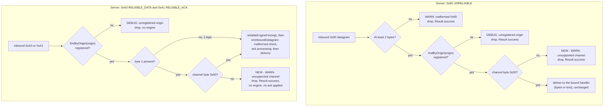
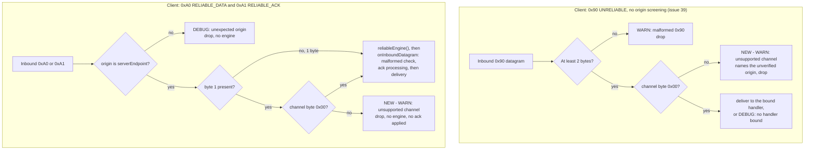

# Issue #40 — channel-byte guard (architecture)

## Header / Association

- **Covers:** `SpartanLaboratories/WebTools#40` — *"webtools-udp 2.0: receivers
  must drop non-zero channel-byte frames before the Stable Core freeze"*. This
  is the prerequisite the Issue #14 Stage-4 finalisation architecture names
  `issue-14-channel-byte-guard` (`docs/issue-14-finalisation-architecture.md`
  §9) — now that it has its own filed issue, this document and its plan use
  the `issue-40-*` slug instead.
- **What this document is:** a **systems design record** for a small,
  self-contained receiver-side fix — there is no open "should we do this"
  question (the Stage-1 interview found none) and this is not the
  implementation plan. It records the fix's shape — where each side reads the
  channel byte, the order the check runs in relative to origin screening and
  malformed-frame handling, and the one new internal wire-codec accessor —
  before code is written. There is no file-by-file breakdown and no method
  bodies here; those belong to `docs/issue-40-channel-byte-guard-plan.md`.
- **Baseline:** `webtools-udp` `2.0.0-alpha4` on `feat/2.0-framed-transport`,
  HEAD `4a70ba4`. Working tree otherwise clean at the time of writing (only
  the two untracked Issue #14 finalisation docs present, neither touched by
  this fix).
- **Branch model:** unchanged from the #34 precedent
  (`docs/issue-34-probe-cadence-architecture.md` Header): a short-lived
  branch `fix/issue-40-channel-byte-guard` off the long-lived integration
  branch `feat/2.0-framed-transport`, PR into that branch (`Refs #40`, not
  `Closes`), branch deleted after merge, issue closed by hand.
- **Target version:** `webtools-udp` `2.0.0-alpha4` → `2.0.0-alpha5`.
- **Status:** design complete. The single implementation plan
  (`docs/issue-40-channel-byte-guard-plan.md`) is written and aligned against
  this document (see "Cross-plan alignment" at the end). **No open
  decisions.** Ready for the `manager` to cut the branch and for
  implementation.
- **Commit: TBD** / **PR: TBD** — backfilled after merge, per the house
  header-backfill precedent.
- **This document and the plan ride the first implementation commit** (the
  `fix:` commit), so `git log --follow` binds design to code.
- **Related docs:**
  - `docs/issue-14-finalisation-architecture.md` — the Stage-4 document that
    names this fix as its prerequisite (§4, §9, §13 R5/R13/R15) and whose
    protocol/architecture docs will state this fix's behaviour as the
    permanent wire contract.
  - `docs/issue-14-finalisation-plan.md` — the Stage-4 plan whose §4b.2,
    §4b.3, §4d and §9 depend on this fix and, in two places (§4b.2/§4b.3),
    apply KDoc text only if this fix did not already rewrite it.
  - `docs/issue-34-probe-cadence-architecture.md` — the house format this
    document follows, and the source of the "duplicate a tiny check across
    call sites rather than extract it" precedent this fix reuses (§6.1
    there; §6 here).

---

## 1. Requirements

### 1.1 The settled ask (binding — `SpartanLaboratories/WebTools#40`)

1. Server and client: a `0x90` (UNRELIABLE), `0xA0` (RELIABLE_DATA) or `0xA1`
   (RELIABLE_ACK) datagram whose channel byte (byte 1) is not `0x00` is
   dropped with a WARN log.
2. The check runs **after** each branch's existing origin screening (an
   unregistered server-side origin, or a non-`serverEndpoint` client-side
   reliable origin, keeps its existing DEBUG drop) and **before** any payload
   delivery, ack processing, or reliable-engine creation.
3. Unchanged: liveness stamping (server `accept` stamps before classifying)
   and all channel-`0x00` behaviour. No ack is sent for a dropped frame.
4. The client `0x90` branch has no origin screening (open issue #39, out of
   scope here), so the check applies to every `0x90` on that path. #38 is
   also out of scope.
5. This fix owns the KDoc rewrite of `TransportWireFormat.DEFAULT_UNRELIABLE_CHANNEL`
   and `ReliableWireFormat.DEFAULT_RELIABLE_CHANNEL` (and any other KDoc whose
   claim this fix falsifies) to state the drop behaviour.
6. Tests at gating/component level at minimum, every applicable level
   expected, including proof that origin screening still takes priority over
   the new check.
7. Its own `build:` commit: `webtools-udp` `2.0.0-alpha4` → `2.0.0-alpha5`.
8. Lands as its own PR into `feat/2.0-framed-transport` (not `master`),
   before the Issue #14 Stage-4 branch is cut.

No open intent question was found at the interview stage; nothing above is
revisited by this design.

### 1.2 Design resolutions carried in as settled (D1–D12)

The planner resolved twelve wiring questions (D1–D12) while synthesising the
Stage-2 research; they are reproduced below. This document verified each
against the code at `4a70ba4` and found no evidence contradicting any of them
(§1.3). They are binding inputs to this design, not re-litigated:

- **D1** — read byte 1 via the codec objects: the existing public
  `TransportWireFormat.unreliableChannelOf(datagram): Byte?` for `0x90`
  (`TransportWireFormat.kt:157-158`, already public, tested, and — confirmed
  by a repo-wide grep — **unused in `src/main`**), and a new `internal`
  `ReliableWireFormat` accessor mirroring it for `0xA0`/`0xA1`. No new or
  changed **public** declaration anywhere.
- **D2** — for the reliable tags the guard reads byte 1 directly, not via the
  full-header decoders (`reliableDataHeaderOf`/`reliableAckHeaderOf`), so a
  truncated `0xA0`/`0xA1` with a non-zero byte 1 is channel-dropped with no
  engine created; a datagram with no byte 1 at all (size < 2) has no channel
  byte and falls through unchanged to the engine's own malformed handling.
- **D3** — the server `0x90` channel check sits inside `deliverData`
  (`HandshakeCoordinator.kt:270-291`), immediately after the registration
  lookup (`:271-272`) and before handler selection — not in `classify`, which
  would run before origin screening and violate requirement 2.
- **D4** — the server reliable channel check sits between the `reg == null`
  origin check (`HandshakeCoordinator.kt:187-188`) and `reliableEngineFor(reg)`
  (`:190`).
- **D5** — the client `0x90` branch's `?.let … ?:` chain
  (`MultiConnectionUDPClient.kt:539-542`) becomes an explicit
  malformed → channel → deliver/no-handler sequence, applied to every `0x90`.
- **D6** — the client reliable check sits inside the existing
  `origin != serverEndpoint` else-branch (`:548-553`), before `reliableEngine()`
  (`:554`).
- **D7** — the comparison and WARN are duplicated verbatim at all four sites,
  cross-referenced by a one-line comment naming Issue #40 and the other three
  sites — the same shape as the probe-cadence floor check
  (`HandshakeCoordinator.kt:369-375`; `MultiConnectionUDPClient.kt:704-710`;
  `docs/issue-34-probe-cadence-architecture.md` §6.1). No shared predicate, no
  `when` guard conditions.
- **D8** — a dropped frame is harmless: the server returns
  `Result.success(Unit)` (confirmed necessary — `MultiConnectionUDPServer.kt:318-332`
  logs a *second* WARN on any `Result.failure` from `coordinator.accept`); the
  client branch stays statement-form (its `when` runs inside a `Unit`-typed
  `onSuccess` block, confirmed at `MultiConnectionUDPClient.kt:519-575`).
- **D9** — the exact WARN texts, one per tag family, identical on both sides:
  - `0x90`: `"Unreliable datagram on unsupported channel 0x{} from {}; sender may be a newer 2.x, dropping"`
  - `0xA0`/`0xA1`: `"Reliable datagram on unsupported channel 0x{} from {}; sender may be a newer 2.x, dropping"`

  The first `{}` is the channel byte, rendered with
  `Integer.toHexString(channel.toInt() and 0xFF)`, the repo's existing hex
  idiom (`HandshakeCoordinator.kt:199`). The mask matters: without it, a
  channel byte of `0xFF` would render as `ffffffff`. The value is computed
  only on the drop path. The second `{}` is the datagram's actual `origin` on
  **both** sides. The client's existing WARNs say "from server", but on the
  client `0x90` path the origin is unscreened (#39), so "from server" would be
  an unverified claim in a line whose job is to identify the sender. The
  sender hint mirrors the existing `"Unframed datagram from {}; sender may be
  pre-2.0, dropping"` (`HandshakeCoordinator.kt:205`). Tests match on the
  fragment `"on unsupported channel 0x"`.
- **D10** — KDoc scope, in three parts:
  - **(a) Owned outright:** the two `DEFAULT_*_CHANNEL` lines
    (`TransportWireFormat.kt:36`, `ReliableWireFormat.kt:37`). Their text is
    the Stage-4 plan's §4b.2/§4b.3 replacement, **verbatim**
    (`docs/issue-14-finalisation-plan.md`).
  - **(b) Falsified by this fix, not quoted by Stage 4:**
    1. the `HandshakeCoordinator` class KDoc's inbound-router bullet
       (`:21-26`);
    2. its reliable-seam bullet (`:44-49`), since only a channel-`0x00`
       inbound frame now mints the engine;
    3. `accept`'s KDoc (`:119-137`);
    4. `reliableEngineFor`'s KDoc (`:293-301`);
    5. `MultiConnectionUDPClient.receiveLoop`'s one-line KDoc (`:500`);
    6. a precondition sentence on `ReliableChannelEngine.onInboundDatagram`
       (`:87-95`): callers screen origin and channel, and the engine never
       reads the channel byte.

    Plus the new accessor's own KDoc.
  - **(c) Left untouched:** every block the Stage-4 plan quotes.
- **D11** — no README change (it makes no channel-acceptance claim).
- **D12** — three-commit shape (`fix:`/`test:`/`build:`) on
  `fix/issue-40-channel-byte-guard`, PR `Refs #40` into
  `feat/2.0-framed-transport`, issue closed by hand, no attribution trailers.

### 1.3 Verification against the code (this pass)

Every citation above was re-read at `4a70ba4` during this pass (not merely
trusted): `HandshakeCoordinator.kt` `accept` (:138-146), `classify`
(:148-209), `deliverData` (:270-291), `reliableEngineFor` (:293-312),
`scheduleProbe`'s duplicated-floor-check precedent (:368-393);
`MultiConnectionUDPClient.kt` `reliableEngine()` (:455-473), `receiveLoop`
(:500-584), `startProbe`'s mirror of the same precedent (:702-724);
`MultiConnectionUDPServer.kt` `receiveLoop` (:318-332); `TransportWireFormat.kt`
(`DEFAULT_UNRELIABLE_CHANNEL` :37, `unreliableChannelOf` :157-158);
`ReliableWireFormat.kt` (`DEFAULT_RELIABLE_CHANNEL` :38, header decoders
:106-139); `ReliableChannelEngine.onInboundDatagram` (:96-130);
`DatagramType.kt` (tag values :39-56). No divergence found — **D1–D12 stand
as given**, with one clarifying note carried into §3.1 below: because
`deliverData` currently receives only the already-stripped `0x90` payload
(not the framed datagram), giving it the channel byte per D3 is a shape
change to that private method's inputs — a plan-level wiring detail, not a
public-surface change, and not pinned down further here.

---

## 2. Research findings applied

Of everything synthesised, three conclusions shaped this design (the rest —
library citations, CWE background — are supporting evidence for these):

1. **Drop, never "process as default," is the converged behaviour across
   every surveyed transport with a channel/stream/lane concept** — ENet
   (`enet_protocol_handle_send_*`, https://github.com/lsalzman/enet/blob/master/protocol.c),
   RakNet (`ReliabilityLayer.cpp`,
   https://github.com/facebookarchive/RakNet/blob/master/Source/ReliabilityLayer.cpp),
   yojimbo (`STANDARD.md`,
   https://github.com/mas-bandwidth/yojimbo/blob/main/STANDARD.md), and
   GameNetworkingSockets (fatal on an invalid lane,
   https://github.com/ValveSoftware/GameNetworkingSockets/blob/master/src/steamnetworkingsockets/clientlib/steamnetworkingsockets_snp.cpp)
   all reject rather than silently accept. RFC 9413 §5.1 "Virtuous
   Intolerance" (https://www.rfc-editor.org/rfc/rfc9413.html) is the
   normative backing this design leans on: tolerating out-of-contract input
   here would let a forward-compatibility hazard go undetected past the
   Stable Core freeze. This is why the fix is a hard per-frame drop, not a
   fallback-to-channel-0 default — which is exactly the silent-corruption
   failure mode `docs/issue-14-finalisation-architecture.md`'s OD-4 motivates
   this issue to close.
2. **A hard connection-level error (QUIC/GNS style) is disproportionate here
   and was rejected**, because this wire format's frames are self-describing
   fixed-layout per-tag records (unlike QUIC's variable frame stream, RFC 9000
   §12.4), so a per-frame drop is safe without corrupting subsequent parsing —
   the value being rejected is reserved for a *future* 2.x minor, so
   disconnecting a peer for sending it would make a mixed-version rollout of
   that future feature brittle. This grounds §6's rejection of the
   hard-disconnect alternative.
3. **Not acknowledging a dropped frame is the coherent choice, not an
   omission.** SCTP's parallel case acks an invalid-stream DATA chunk only
   because its TSN space is association-wide (RFC 9260 §3.3.10.1, §6.2); this
   protocol's seq/ack space is *per channel*
   (`ReliableWireFormat.kt:17-19`, `ReliableRetransmitBuffer.onAck` :85-101),
   so there is no channel-agnostic sequence space to ack a rejected
   channel-N frame into. This is why D8's "no ack processed" is not a gap to
   fill later but the only coherent design given the wire format's own
   per-channel sequencing (once a future minor adds real multi-channel
   support, the companion rule is simply that a sender must not use a
   channel the peer has not signalled).

A fourth, secondary finding shaped one thing this document flags as a risk
rather than resolves: **no surveyed library logs this rejection per-packet at
WARN in steady state**, and CWE-779 / the OWASP Logging Cheat Sheet treat an
attacker-triggerable log write as a DoS vector. The origin screening ahead of
the new check (requirement 2) bounds this on three of the four call sites.
The client `0x90` path (#39) is the exception, where the new WARN joins
stranger-reachable WARNs the module already emits. §10 records the risk, and
§11.1 records a module-wide follow-up candidate, rather than solving it here.

---

## 3. System-level design

### 3.1 What changes

No new system is introduced — this is a shape change to four existing
receive branches plus one new internal wire-codec accessor, all inside
`webtools-udp`:

| Change | Where | Owner |
|---|---|---|
| New internal accessor mirroring `TransportWireFormat.unreliableChannelOf`, returning byte 1 of an `0xA0`/`0xA1` datagram if present, else `null` | `ReliableWireFormat` (internal object) | `ReliableWireFormat` |
| Channel check + WARN, positioned after the origin lookup and before handler dispatch | `HandshakeCoordinator.deliverData` (server `0x90`) | `HandshakeCoordinator` |
| Channel check + WARN, positioned after the `reg == null` origin check and before `reliableEngineFor` | `HandshakeCoordinator.classify`'s `RELIABLE_DATA`/`RELIABLE_ACK` branch (server reliable) | `HandshakeCoordinator` |
| Malformed → channel → deliver sequence replacing today's `?.let … ?:` chain | `MultiConnectionUDPClient.receiveLoop`'s `UNRELIABLE` branch (client `0x90`) | `MultiConnectionUDPClient` |
| Channel check + WARN, positioned inside the `origin == serverEndpoint` branch, before `reliableEngine()` | `MultiConnectionUDPClient.receiveLoop`'s reliable branch (client reliable) | `MultiConnectionUDPClient` |
| KDoc rewrite (drop behaviour, not "always accepted") | `TransportWireFormat.DEFAULT_UNRELIABLE_CHANNEL`, `ReliableWireFormat.DEFAULT_RELIABLE_CHANNEL`, plus the D10(b) internal KDoc set | `TransportWireFormat` / `ReliableWireFormat` / `HandshakeCoordinator` / `MultiConnectionUDPClient` / `ReliableChannelEngine` |

The four call sites are independent branch-local checks, not one shared
component: each already holds the local state (a `Registration?`, an
`origin` comparison) the check needs, and duplicating four short comparisons
is cheaper — in both correctness risk and code shape — than inventing a
cross-cutting seam for something this small (see §6).

### 3.2 Interaction diagrams

Per R13 (`docs/issue-14-finalisation-architecture.md` §13): every label
containing `:`, `()`, `[]`, `/` or `;` is double-quoted, line breaks use
` `, and no label contains a bare `end`. Beyond R13, labels avoid HTML
entities (the Stage-4 alignment pass removed them for the same reason) and
the `#` character (Mermaid reads `#…;` as an entity code), so issue numbers
are written "issue 39". Subgraphs use the documented `id ["title"]` form.

**Server-side receive pipeline** (`HandshakeCoordinator.classify` /
`deliverData`):

**Client-side receive pipeline** (`MultiConnectionUDPClient.receiveLoop`):

Both diagrams must be re-validated in the PR's GitHub preview before merge,
per the standing Mermaid-rendering risk (§10).

---

## 4. Integration with existing systems — adoption sweep

Only two production call sites parse a post-handshake tag byte at all —
confirmed by grep across `webtools-udp/src/main`: `HandshakeCoordinator.classify`
and `MultiConnectionUDPClient.receiveLoop`. `UDPSendReceiveServer`,
`CommonChannel`, and `UDPConnection` never switch on `DatagramType`, so they
have nothing to adopt.

| Call site | Current channel handling | Verdict |
|---|---|---|
| `HandshakeCoordinator.deliverData` (server `0x90`) | ignored — any channel byte reaches the handler | **In scope now** — add the check (§3.1) |
| `HandshakeCoordinator.classify`'s reliable branch (server `0xA0`/`0xA1`) | ignored — `reliableEngineFor` is called regardless of channel | **In scope now** — add the check (§3.1) |
| `MultiConnectionUDPClient.receiveLoop`'s `UNRELIABLE` branch (client `0x90`) | ignored | **In scope now** — add the check (§3.1) |
| `MultiConnectionUDPClient.receiveLoop`'s reliable branch (client `0xA0`/`0xA1`) | ignored | **In scope now** — add the check (§3.1) |
| `TransportWireFormat.unreliableChannelOf` | exists, public, tested, unused in `src/main` | **Adopted by this fix** — becomes the server/client `0x90` accessor (D1) |
| `ReliableWireFormat` | has no channel accessor | **New internal member added** by this fix (D1) |
| `UDPSendReceiveServer`, `CommonChannel`, `UDPConnection` | do not parse `DatagramType` at all | **Not applicable** — no adoption gap; confirmed by grep, not assumed |
| `ReliableChannelEngine.onInboundDatagram` | never reads `header.channel` | **Left unchanged.** The screen belongs at the receive-branch level, ahead of engine creation, per D2/D4/D6 — pushing it into the engine would let a non-zero-channel `0xA0` still mint an engine before being rejected (rejected in §6) |
| KDoc claiming "the only value \[Stage 1\] emits or accepts" (`TransportWireFormat.kt:36`, `ReliableWireFormat.kt:37`) | false today (accepts any value) | **In scope now** — this fix owns the rewrite (D10(a), requirement 5) |
| Six further KDoc blocks making the same or an adjacent false claim (D10(b)) | stale | **In scope now**, since this fix is what falsifies them — not deferred to Stage 4, which only quotes the two `DEFAULT_*_CHANNEL` lines |

No existing test sends a non-zero channel through either receiver — the two
non-zero-channel tests in the suite are pure encoder tests
(`TransportWireFormatTest.kt:87`, `ReliableWireFormatTest.kt:29`, both
exercising the *encode* side only, confirmed by reading both) — so no
existing test's outcome changes; this fix is purely additive at the test
level (its own plan's job).

### 4.1 Not a second instance of an unrelated mechanism

Unlike the #34 fix (`docs/issue-34-probe-cadence-architecture.md` §4, which
had a real second instance to check — the idle-liveness sweep — and cleared
it), this fix's mechanism (a wire-format value check) has no sibling
mechanism elsewhere in the module to sweep for. The adoption question here is
fully answered by the two-call-site blast radius above.

---

## 5. Extension & stability

- **No public surface change.** `TransportWireFormat.unreliableChannelOf`
  already existed as public, Stable Core surface (unchanged signature,
  unchanged return contract); the new `ReliableWireFormat` accessor is
  `internal`, mirroring `ReliableWireFormat`'s own existing internal-object
  tier (`ReliableWireFormat.kt:36`). No interface, no new hierarchy: this is
  a **systems/infrastructure** concern (a wire-codec helper), not a domain
  type, so the inheritance-vs-interface question does not arise.
- **The drop is a Stable-Core wire behaviour, effective from this fix.** It
  ships in `2.0.0-alpha5`, a pre-release with no published artifact (Maven
  Central's `webtools-udp` latest is `1.1.0`, confirmed by the #34 precedent's
  research), so no consumer can be relying on the old silent-accept
  behaviour. Once Stage 4 freezes `2.0.0` as Stable Core
  (`docs/issue-14-finalisation-architecture.md` B1), this drop is part of
  that frozen contract — narrowing it further would need a major version;
  loosening it (accepting a specific non-zero value) is exactly the
  forward-compatible extension point the reserved channel range exists for,
  and does not need a code change here, only a future minor's own design
  pass.
- **Nothing new is parameterised.** The one accepted channel value is fixed
  at `0x00` by the wire contract itself (this build defines and emits only
  that value); there is no "policy a consumer might disagree with" — a future
  minor that wants to accept an additional channel changes the check's
  comparison, not a consumer-supplied parameter, because the acceptable
  channel set is itself part of the frozen wire contract, not local policy.
- **Stability tier: Stable Core**, for the drop behaviour and for
  `unreliableChannelOf`'s existing tier. No `@SupportedExtension`, no
  `@RequiresOptIn` — this is not an extension seam, it is a correction to
  the receive-side contract of Stable Core surface (`0x90`/`0xA0`/`0xA1`)
  that was already public/internal, matching B1's existing scope in the
  Stage-4 document (`docs/issue-14-finalisation-architecture.md` §1.2). No
  open decision on tier: this is confident, not deferred.

---

## 6. Alternatives considered

| Alternative | Rejected because |
|---|---|
| **Shared predicate/helper function** (e.g. one `isSupportedChannel(byte)` or one `screenChannel(...)` called from all four sites) | No such extraction precedent exists for a comparably tiny duplicated check in this module — the probe-cadence floor check (Issue #34) and the retransmit-tick wiring are both duplicated verbatim across their two call sites rather than shared, specifically because each call site's surrounding state (which `Result` failure to construct, which log fields are in scope, `Result` vs. statement form) differs enough that a shared function would need parameters for all of it, undermining the readability a helper is supposed to buy (D7; `docs/issue-34-probe-cadence-architecture.md` §6.1). |
| **Kotlin `when` guard conditions** (`DatagramType.UNRELIABLE if (…) ->`, stable since Kotlin 2.2.0 — https://kotlinlang.org/docs/control-flow.html) | A guard is evaluated while the `when` selects a branch, so it cannot see anything the branch body computes. The two reliable arms are comma-joined (`RELIABLE_DATA, RELIABLE_ACK ->`), and Kotlin does not allow a guard on a multi-condition branch at all. On the server `0x90` arm a guard would run before the origin lookup inside `deliverData`, violating requirement 2. Only the client `0x90` arm could legally take one, and there it would split one branch into two and need the malformed check repeated inside the guard. That buys nothing, and it would leave the four sites with two different shapes. |
| **A check inside `ReliableChannelEngine`** (reject in `onInboundDatagram` rather than before `reliableEngineFor`/`reliableEngine()`) | Per D2/D4/D6, the check must run *before* engine creation, so a non-zero-channel `0xA0` from a first-ever reliable frame never mints an engine at all. Moving the check into the engine would let exactly that engine-creation happen first, then reject the frame — observably different from the settled requirement 2, and the wrong layer besides: the engine is deliberately channel-agnostic (`ReliableChannelEngine.kt:33-41`'s `channel` parameter is what it *emits*, never read on receipt), and giving it origin/channel screening responsibility would blur its one job (ack/reorder/retransmit orchestration) with the receive-branch's screening job. |
| **Hard disconnect / connection error** (QUIC/GameNetworkingSockets style: treat a non-zero channel as a protocol violation ending the session) | Disproportionate for a value reserved for a *future* 2.x minor (§2 finding 2) — it would make a mixed-version rollout of that future feature brittle, and this wire format's frames are self-describing per-tag records, so a per-frame drop is sufficient and does not risk desynchronising the parser the way an unbounded QUIC frame stream would. |
| **Ack-before-drop** (process the piggybacked/standalone ack even on a rejected frame, since the ack fields are at fixed reliable-header offsets regardless of channel) | Rejected per §2 finding 3: the sequence space the ack refers to is per-channel, and this build has no reorder/retransmit state for any channel but `0x00` — there is nothing coherent to apply a channel-N ack against. Doing so would also mean creating (or at least consulting) per-channel state for a channel this build does not support, re-introducing the mechanism the guard exists to prevent. |
| **Per-peer/per-channel WARN throttling now** (e.g. "once per (peer, channel)") | Recorded as a module-wide follow-up candidate (§11.1), not built here. Requirement 2's origin screening already bounds the new WARN on three of the four paths. The per-datagram WARN pattern predates this fix and spans every drop site on both sides (§10), so bounding it belongs in one design for all of them, not a channel-guard-only mechanism. Building it here would be scope creep against an issue whose ask is the drop itself. |
| **Reading byte 1 inline at each call site** (`bytes.getOrNull(1)` directly, no codec accessor) | Breaks the receive paths' own convention: apart from the tag byte itself, which `DatagramType.ofTagByte` classifies, every field read goes through a `TransportWireFormat`/`ReliableWireFormat` accessor (`unreliablePayloadOf`, `probeSequenceOf`, `reliableDataHeaderOf`). D1's accessors keep the layout knowledge ("the channel is byte 1") in the codec that owns each wire format, rather than repeated at four call sites. |
| **Checking only well-formed headers** (decode with `reliableDataHeaderOf`/`reliableAckHeaderOf` first, then read `.channel` from the decoded header) | Rejected per D2. A full-header decode needs at least 10 bytes for `0xA0` and exactly 8 for `0xA1`. A *truncated* frame with a non-zero byte 1 (say, 3 bytes) would therefore decode to `null` and fall through to `reliableEngineFor` / `reliableEngine()`. That **creates the engine** (and, for the first one, its retransmit tick) before the engine's malformed check drops the frame. That breaks R15's "no reliable engine is created for it" for a datagram whose channel byte is plainly non-zero, and it logs a malformed frame where a channel violation happened. Reading byte 1 on its own keeps the two checks independent and ordered: channel first, then the engine's own decode. |

---

## 7. Documentation impact (Audience-Reach rings)

| Ring | Touched? | What moves with the change |
|---|---|---|
| **Inner core** | yes | A one-line `//` comment at each of the four call sites naming Issue #40 and cross-referencing the other three sites (D7), matching the probe-cadence precedent's inner-core comment (`docs/issue-34-probe-cadence-architecture.md` §7). |
| **Component ring (KDoc)** | yes | `TransportWireFormat.DEFAULT_UNRELIABLE_CHANNEL` and `ReliableWireFormat.DEFAULT_RELIABLE_CHANNEL` (owned by this fix, D10(a), using the Stage-4 plan's exact replacement text); the six further internal/public KDoc blocks D10(b) names (`HandshakeCoordinator`'s class KDoc bullets, `accept`, `reliableEngineFor`, `MultiConnectionUDPClient.receiveLoop`'s one-liner, a new precondition sentence on `ReliableChannelEngine.onInboundDatagram`, and the new accessor's own KDoc) — none of which Stage 4 quotes, so this fix owns their correction outright, not as a conditional. |
| **Boundary ring (protocol)** | no direct edit | `docs/webtools-udp-protocol.md` does not exist yet — Stage 4 creates it in the *next* PR on this branch and will describe this fix's behaviour as contract (`docs/issue-14-finalisation-architecture.md` §3.2, R8). The KDoc this fix writes points at that path by name (per the repo's backticked-path convention, R5) even though the file does not yet exist on this branch — the pointer dangles only between this fix's merge and Stage 4's merge, never on `master` or in a published artifact (D10(a)). |
| **Architectural outer layer** | no | No new thread, no topology change, no lock reordering — the check is a comparison inside an existing receive branch. |
| **README** | no | Makes no channel-acceptance claim today (`README.md:93-97`, `:153`, `:170`); D11 confirms no edit is needed, and Stage 4 owns every README edit before `master` regardless. |

---

## 8. Seam with Issue #14 Stage 4

This fix is the named prerequisite of `docs/issue-14-finalisation-plan.md`
§9 ("Interfaces with sibling units"). The contract in both directions:

**What Stage 4 expects from this fix** (already quoted in Stage 4's own §9,
reproduced here so this document is self-contained):
- WARN-and-drop on both sides for all three tags, in the order given in
  requirement 2, with liveness stamping and channel-`0x00` behaviour
  unchanged, tested at every applicable level, taking the version to
  `2.0.0-alpha5`.
- This fix rewrites `DEFAULT_UNRELIABLE_CHANNEL` / `DEFAULT_RELIABLE_CHANNEL`
  itself; Stage 4's §4b.2/§4b.3 apply their own text **only if** this fix did
  not already rewrite those exact lines — if this fix's wording differs from
  what those sections expect, Stage 4's executor is instructed to stop and
  report rather than overwrite silently (`docs/issue-14-finalisation-plan.md`
  §4b.2, §9).
- This fix merges into `feat/2.0-framed-transport` before the Stage-4 branch
  is cut.

**What this fix hands to Stage 4, beyond the code:**
- The exact WARN message text (D9) and the exact KDoc wording this fix
  writes on the two `DEFAULT_*_CHANNEL` constants — Stage 4's protocol doc
  ("Channel byte" section) and its malformed-input table row restate this
  fix's shipped behaviour, not a plan-time promise, per Stage 4's own R8
  ("the executor reads the merged guard's code and tests" before writing
  that section).
- One drafting note for Stage 4, **not resolved here**: Stage 4's planned
  KDoc for `MultiConnectionUDPClient.kt:126-128` / `MultiConnectionUDPServer.kt:143-146`
  currently says "the first inbound `0xA0`/`0xA1`" creates the engine
  (R1-era wording); after this fix, only a **channel-`0x00`** inbound
  `0xA0`/`0xA1` does, since a non-zero-channel one is dropped before
  `reliableEngineFor`/`reliableEngine()` is ever reached (D2/D4/D6). Stage 4's
  planning pass, not this fix, should adjust that wording — flagged here as
  the one piece of downstream text this fix's behaviour changes the truth of
  beyond what Stage 4 already anticipated in its own §9.
- **No text collision, and only anticipated drift.** Stage 4's plan edits
  `TransportWireFormat.kt`, `ReliableWireFormat.kt` and
  `MultiConnectionUDPClient.kt` (KDoc only), and neither
  `HandshakeCoordinator.kt` nor `ReliableChannelEngine.kt`
  (`docs/issue-14-finalisation-plan.md` §8, commit 4's path list).
  - In the three shared files, the only blocks Stage 4 quotes that this fix
    also changes are the two `DEFAULT_*_CHANNEL` lines Stage 4 hands over.
  - Every other edit here is in a block Stage 4 does not quote: the
    `receiveLoop` body and its one-line KDoc (`:500`), versus Stage 4's
    `:121-130`, `:210` and `:455-462`.
  - What this fix *does* move are line numbers. That affects both Stage 4's
    edit anchors below the insertions and the `path:line` citations its new
    protocol and architecture docs make into `HandshakeCoordinator.kt` and
    `MultiConnectionUDPClient.kt`. Stage 4 already anchors every edit on
    quoted "Current" text and re-verifies citations against the merged guard
    (`docs/issue-14-finalisation-architecture.md` §12), so the drift is
    anticipated.

  Within this fix's own three commits no file is edited twice, so there is no
  intra-PR anchor drift.

---

## 9. Decomposition

One plannable unit. The fix is four small, structurally identical branch
edits plus one new internal accessor and its KDoc tail — the same shape and
scale as the #34 precedent (`docs/issue-34-probe-cadence-architecture.md` §8:
"a ~10-line production change... not a system decomposition"). Splitting by
side (server unit / client unit) or by tag (`0x90` unit / reliable unit)
would manufacture seams between four checks that share one WARN-text pattern,
one accessor, and one test matrix, and would double the coordination cost for
no isolation benefit — nothing here can land or be tested independently of
the others without leaving the wire contract only half-guarded.

| Slug | Scope | Depends on | Landing order |
|---|---|---|---|
| `issue-40-channel-byte-guard` | All four receive-branch channel checks (server `0x90`/reliable, client `0x90`/reliable); the new internal `ReliableWireFormat` channel accessor; the KDoc rewrite of both `DEFAULT_*_CHANNEL` constants and the six further D10(b) KDoc blocks; tests at every applicable level including origin-screening-priority proof; the `2.0.0-alpha4` → `2.0.0-alpha5` version bump. | none | Only unit — lands directly on `feat/2.0-framed-transport`, before the Issue #14 Stage-4 branch is cut |

The plan document, `docs/issue-40-channel-byte-guard-plan.md`, turns this
into the file-by-file change set and the 5-level test matrix.

---

## 10. Risks at the systems level

- **Per-datagram WARN logging — pre-existing, and not widened by this fix
  where it matters.** Every surveyed library either drops silently or
  reports once (§2), and CWE-779 / the OWASP Logging Cheat Sheet treat an
  attacker-triggerable log write as a resource-exhaustion vector. This
  module already logs a WARN per datagram from **any** sender on several
  paths:
  - server: a malformed `0x90` (`HandshakeCoordinator.kt:179`, before origin
    screening), a reserved tag (`:199`), an unframed non-`Iam` datagram
    (`:205`);
  - client: a malformed `0x81` (`MultiConnectionUDPClient.kt:528`), a
    malformed `0x90` (`:542`), an unframed datagram (`:571`).

  Against that baseline, the new WARN is the *more* conservative one. On
  three of its four paths it sits behind origin screening, so only a
  registered server-side origin or the client's own server can trigger it.
  On the client `0x90` path, which has no origin screening (#39), it joins
  that path's existing stranger-reachable malformed-`0x90` WARN, so it adds
  no new class of exposure. A registered-but-misbehaving (or newer,
  rule-breaking) peer still produces one WARN per offending datagram. That
  is the intended loud signal of a version mismatch, but it is unbounded.
  Bounding per-datagram drop logging module-wide is a candidate follow-up
  (§11), not part of #40, whose ask is the drop itself. Note that a
  per-origin throttle does not help on an unscreened path (spoofed origins
  vary); a per-call-site rate bound does.
- **A KDoc pointer that dangles until Stage 4 lands.** The two
  `DEFAULT_*_CHANNEL` KDoc blocks use the Stage-4 plan's approved text
  verbatim (D10(a)), which names `docs/webtools-udp-protocol.md`. Stage 4
  creates that file in the next PR on this branch. Between the two merges the
  pointer names a missing file, but only on the integration branch:
  - `master` receives this branch only after Stage 4 (its §9 landing order);
  - alphas are source-only, with no published artifact;
  - Stage 4's own verification resolves every cross-reference before its
    merge (`docs/issue-14-finalisation-architecture.md` §7).

  If Stage 4 were abandoned, the pointer would need a one-line follow-up.
- **Behavioural narrowing, contained.** Any (hypothetical) consumer sending a
  non-zero channel byte today gets silent channel-0 processing; after this
  fix, that traffic is dropped with a WARN. Acceptable for the same reason
  the #34 precedent gives: `2.0.0-alphaN` carries no semver promise and no
  Maven Central artifact exists at this coordinate beyond `1.1.0`
  (`docs/issue-34-probe-cadence-architecture.md` §1.3.1).
- **No concurrency shape change.** Every check added is a same-thread
  comparison inside an already-synchronized or single-threaded receive path
  (the server's common listener thread, the client's `mcupc-listener`
  thread) — no new lock, no new thread, no change to `ReliableChannelEngine`'s
  `@Synchronized` discipline.
- **Line-number drift against the concurrently-drafted Stage-4 plan.** Both
  this fix and Stage 4 edit `HandshakeCoordinator.kt`, `MultiConnectionUDPClient.kt`,
  `TransportWireFormat.kt`, and `ReliableWireFormat.kt`. Since this fix lands
  first (requirement 8), Stage 4's plan — already written to anchor on quoted
  text rather than line numbers for exactly this reason — is the one that
  must re-verify against this fix's merged diff, not the reverse. This fix's
  own plan has no such upstream dependency to defend against.
- **A Mermaid render failure** in this document's two flowcharts, per
  GitHub's known quirks (bare `end`, unescaped punctuation, `;` in a label) —
  mitigated by the R13 rules already applied above and the required PR
  preview check.
- **Cross-repo impact:** none raised — this is a receiver-side behavioural
  fix inside `webtools-udp`'s own wire handling, on an unpublished
  pre-release coordinate; per standing instruction, downstream projects
  handle their own adoption.

---

## 11. Open decisions

**None.** Every design question the Stage-1 interview and the planner's
research synthesis raised (D1–D12) was verified against the code and left
standing (§1.3). Nothing here blocks execution.

### 11.1 Follow-up candidates (not blocking #40)

These are surfaced for the maintainer, who decides whether any becomes an
issue. This pipeline files none.

- **Bound per-datagram drop logging on the receive paths.** A module-wide
  concern that predates this fix (§10). It covers the malformed, reserved-tag,
  unframed and channel-guard WARNs on both sides.
  - *Proposed fix:* a small per-call-site rate bound. For example, the first
    occurrence, then at most one summary line per interval with a
    suppressed-count.
  - *Why not per origin:* a per-origin key is defeated by spoofing on the
    paths that lack origin screening.
  - *Why a separate issue:* it is independent of #39 and would be designed
    once for every drop site, not per issue.

---

## Cross-plan alignment (planner, 2026-09-25)

There is one plan in this decomposition, `docs/issue-40-channel-byte-guard-plan.md`,
so there were no parallel drafts to reconcile. The pass checked that plan
against this document, the binding requirement (§1.1), the Issue #14 Stage-4
plan it precedes, and the code at `4a70ba4`.

### What was checked

- **Contracts at the seams.** The only seam is Stage 4
  (`docs/issue-14-finalisation-plan.md` §9). Checked against it:
  - the plan's behaviour matches Stage 4's expectation: WARN-and-drop on
    both sides for all three tags, origin screening first, liveness
    unchanged, `2.0.0-alpha5`;
  - the plan's `DEFAULT_*_CHANNEL` KDoc text is Stage 4's §4b.2/§4b.3 text
    verbatim, so Stage 4's conditional edit is a clean no-op;
  - the check order matches Stage 4's evergreen server flowchart: origin,
    then channel, then dispatch or engine.
- **No text collision.** No block this plan edits is one Stage 4 quotes as a
  "Current" anchor, except the two handed-over `DEFAULT_*_CHANNEL` lines.
  Stage 4 edits neither `HandshakeCoordinator.kt` nor
  `ReliableChannelEngine.kt`. No test file overlaps either: Stage 4 edits
  `integration/.../MultiConnectionUDPServerTest.kt` and
  `e2e/.../MultiConnectionUDPFramingE2ETest.kt`, which this plan does not
  touch.
- **Coverage.** Every §1.1 requirement maps to a numbered acceptance
  criterion (plan §1.2), a code change (plan §3), and at least one test
  (plan §5). Each of D1–D12 is implemented as written. Every file in the
  adoption sweep (§4) is either changed or explicitly left alone with a
  reason.
- **Facts.** Every "Current" block the plan quotes from `src/main` and
  `build.gradle.kts` was compared with the file at `4a70ba4` and matches. The
  seven Stage-4 anchor strings used by the plan's content-based check each
  return the stated hit count today.
- **Standards.** Checked for:
  - file-by-file concreteness;
  - `Result`/mutability notes on every changed signature;
  - the 5-level test table with level and path;
  - the Audience-Reach table, including README;
  - the version-control recipe.

### What the pass changed in the plan

1. **Four client component tests could never have passed.** Four of the five
   new `MultiConnectionUDPClientReliableTest` cases sent datagrams to a
   client whose listener had never started. `ensureListening()` runs only on
   `start`/`startBytes`/`channel(...).actuate*`, and a reliable `send` does
   not start it. Each now binds a reliable handler first, which starts the
   listener and creates no engine. The foreign-origin case now waits for its
   specific DEBUG line, not for "any event".
2. **A vacuous assertion.** The server "no ack applied" test built its
   piggyback frame with the file's `reliableFrame` helper, which hardcodes
   `ack = 0xFFFF`. That frame could free no slot even if the guard were
   missing. It now carries `ack = 0`.
3. **A 4c test that would have failed by construction.** The registered-origin
   flood test bound a reliable handler before asserting "no engine".
   `HandshakeCoordinator.bindReliable` itself mints the engine
   (`:459-465`), so the assertion could never hold. The test is now two
   phases:
   - no handler: the flood mints no engine;
   - with a handler: the flood never disturbs the engine, and seq 0 still
     delivers first.
4. **Stronger stranger-flood oracle, and a duplicate import removed.** The
   unregistered-origin flood now asserts *no WARN of any kind*, not merely
   no channel WARN. Every such frame takes the DEBUG origin drop, so this is
   the exact "strangers cannot flood WARNs" property. The plan also no longer
   tells the executor to add a second `UdpChannel` import to
   `FramingNonFunctionalTest.kt`.
5. **KDoc carries the contract, not the history.** The draft put
   "(Issue #40)" into seven production KDoc blocks, against the brief and the
   plan's own §4 claim. All were removed. Issue numbers now appear only in the
   four `//` inner-core comments. The `accept`, `reliableEngineFor`,
   `receiveLoop` and class-bullet texts were also tightened to state the full
   screening order accurately.
6. **Cross-thread test hygiene.** Anything a client dispatch thread writes and
   the test thread reads is now a `CopyOnWriteArrayList`. The gating client
   smoke's deadline went from 1 s to the suite's usual 2 s. A bare
   `Thread.sleep` before one negative check was removed, since that check now
   runs only after the dropping branch has provably executed.
7. **The E2E ack reader** now checks the `0xA1` tag before decoding, because
   `reliableAckHeaderOf` decodes any 8-byte datagram. Its comment no longer
   claims more than the assertion proves.
8. **Version control.**
   - The Stage-4 anchor check is now content-based. The rewritten
     `DEFAULT_*_CHANNEL` KDoc shifts later lines in both codec files by
     four, so the draft's fixed `sed` line ranges would have read the wrong
     text.
   - Diffs use the merge-base form (`...`).
   - The `build.gradle.kts` edit is given as exact Current/New text.
   - Commit 1's subject was shortened to the repo's usual length, and its
     body corrected.
   - `LogCapture.kt` is now implemented with the tests (commit 2), not
     before commit 1.
9. **Architecture document (this file)** — the flowchart labels were cleaned
   of HTML entities and `#`, D9/D10 were written out in full, the
   hard-mask rationale was added, the §8 collision claim was corrected
   (Stage 4 does not edit `HandshakeCoordinator.kt`), the "checking only
   well-formed headers" alternative now names the real consequence (engine
   creation on a truncated frame), and the logging risk is placed against
   the module's pre-existing per-datagram WARNs.

Test counts are unchanged by the pass: 33 new test methods, and the full
suite is expected at 605 tests, 13 skipped, 0 failures.

### Shared risks that remain

- **Stage-4 KDoc wording (Stage 4's to adjust, not this fix's).** Stage 4's
  planned text for the engine-creation sentences (its §4d:
  `MultiConnectionUDPClient.kt` `reliableEngine()` KDoc and class KDoc,
  `MultiConnectionUDPServer.kt` class KDoc) says "the first inbound
  `0xA0`/`0xA1`". After this fix, only a channel-`0x00` one creates the
  engine. Separately, its client-side prose ("the channel-byte check applies
  on both the `0x90` and the reliable branch, after that origin screening")
  reads as if the client `0x90` branch had origin screening; it has none
  (#39), so there the check applies to every `0x90`. Both are one-phrase
  precision fixes in Stage 4's own documents.
- **Stage-4 documents are stale about this unit's identity.** They call it
  `issue-14-channel-byte-guard` and say its issue is "not yet filed". It is
  now #40, with this document and `docs/issue-40-channel-byte-guard-plan.md`.
  Stage 4's own documents were not edited by this pass.
- **Line-number drift into Stage 4.** This fix moves lines in
  `HandshakeCoordinator.kt`, `MultiConnectionUDPClient.kt`,
  `TransportWireFormat.kt` and `ReliableWireFormat.kt`. Stage 4 anchors every
  edit on quoted text and re-verifies its `path:line` citations against the
  merged guard, so this is anticipated work, not a defect.
- **The dangling `docs/webtools-udp-protocol.md` pointer** between this merge
  and Stage 4's (§10), plus per-datagram WARN logging (§10, §11.1). Both are
  accepted and recorded.
- **Loopback timing in client tests.** Mitigated by waiting on specific
  events and barrier frames, not sleeps. Residual risk is an overloaded CI
  host exceeding a 2–3 s deadline, the same exposure the existing client
  suites carry.
