# Issue #40 — channel-byte guard (implementation plan)

## Header / Association

- **Covers:** `SpartanLaboratories/WebTools#40` — *"webtools-udp 2.0: receivers
  must drop non-zero channel-byte frames before the Stable Core freeze"*.
- **What this document is:** the implementation plan for the single plannable
  unit `issue-40-channel-byte-guard` — a file-by-file change set and a 5-level
  test matrix. It turns the approved architecture into code; it makes no
  design decisions of its own.
- **Approved design:** `docs/issue-40-channel-byte-guard-architecture.md`,
  unit `issue-40-channel-byte-guard` (its only unit, §9). §1.1 the settled
  requirement; §1.2 D1–D12 the binding design resolutions; §3 the pipelines;
  §6 the alternatives rejected; §8 the seam with Issue #14 Stage 4; §10 the
  systems-level risks.
- **Baseline:** `webtools-udp` `2.0.0-alpha4` on `feat/2.0-framed-transport`,
  HEAD `4a70ba4`. Working tree otherwise clean apart from the two untracked
  Issue #14 finalisation docs (`docs/issue-14-finalisation-architecture.md`,
  `docs/issue-14-finalisation-plan.md`), which this unit does not touch.
- **Branch:** `fix/issue-40-channel-byte-guard` (off `feat/2.0-framed-transport`).
- **Commit: TBD**
- **PR: TBD**
- **Target version:** `webtools-udp` `2.0.0-alpha4` → **`2.0.0-alpha5`**.
- **Status:** planning complete. **No open decisions.** Ready for implementation.
- **Related docs:**
  - `docs/issue-40-channel-byte-guard-architecture.md` — the approved design
    this plan implements.
  - `docs/issue-34-probe-cadence-plan.md` — the house format this document
    follows (header/association shape, §4 file-by-file, §5 test-plan table
    shape, §7 version control, three-commit split), and the source of the
    duplicated-check-over-shared-helper precedent (§6.1 there) this fix reuses
    (D7).
  - `docs/issue-14-finalisation-plan.md` — the Stage-4 plan this fix
    precedes and unblocks: §4b.2/§4b.3 (the verbatim `DEFAULT_*_CHANNEL` KDoc
    text this fix applies), §4d (the engine-creation KDoc Stage 4 owns on
    `MultiConnectionUDPClient.kt:126-128` / `MultiConnectionUDPServer.kt:143-146`,
    which this fix does **not** touch), §8 (commit path lists), §9 (the
    contract Stage 4 depends on).

---

## 1. Context

### 1.1 The gap this fix closes

`HandshakeCoordinator.kt` (server) and `MultiConnectionUDPClient.kt` (client)
both parse a post-handshake tag byte, but neither ever reads byte 1 (the
channel id) of an `0x90`/`0xA0`/`0xA1` frame before acting on it:

- `HandshakeCoordinator.deliverData` (`HandshakeCoordinator.kt:270-291`) hands
  a `0x90` payload to whichever handler is bound, regardless of channel.
- `HandshakeCoordinator.classify`'s `RELIABLE_DATA, RELIABLE_ACK` branch
  (`HandshakeCoordinator.kt:185-193`) calls `reliableEngineFor(reg)`
  regardless of channel.
- `MultiConnectionUDPClient.receiveLoop`'s `UNRELIABLE` branch
  (`MultiConnectionUDPClient.kt:535-542`) delivers regardless of channel.
- `MultiConnectionUDPClient.receiveLoop`'s reliable branch
  (`MultiConnectionUDPClient.kt:544-564`) calls `reliableEngine()` regardless
  of channel.

`TransportWireFormat.DEFAULT_UNRELIABLE_CHANNEL` / `ReliableWireFormat.DEFAULT_RELIABLE_CHANNEL`
are the only values this build ever emits, but every receive path silently
accepts any value. That is a forward-compatibility hazard the moment a future
`2.x` minor reserves a non-zero channel for a real feature: today's `2.0.0`
receiver would process that traffic as if it were channel `0x00`, corrupting
the channel-`0x00` sequence space it shares (reliable) or silently
misdelivering it to the wrong handler (unreliable) — exactly the failure mode
`docs/issue-14-finalisation-architecture.md` OD-4 named and this issue exists
to close before the Stable Core freeze (architecture §2 finding 1, RFC 9413
§5.1 "Virtuous Intolerance").

### 1.2 Acceptance criteria (architecture §1.1, binding — not revisited here)

1. Server and client: a `0x90`, `0xA0` or `0xA1` datagram whose channel byte
   (byte 1) is not `0x00` is dropped with a WARN log.
2. The check runs **after** each branch's existing origin screening (an
   unregistered server-side origin, or a non-`serverEndpoint` client-side
   reliable origin, keeps its existing DEBUG drop) and **before** any payload
   delivery, ack processing, or reliable-engine creation.
3. Unchanged: liveness stamping (server `accept` stamps before classifying)
   and all channel-`0x00` behaviour. No ack is sent for a dropped frame.
4. The client `0x90` branch has no origin screening (#39, out of scope), so
   the check applies to every `0x90` on that path. #38 is also out of scope.
5. This fix owns the KDoc rewrite of `TransportWireFormat.DEFAULT_UNRELIABLE_CHANNEL`
   and `ReliableWireFormat.DEFAULT_RELIABLE_CHANNEL`, plus every other KDoc
   block whose claim this fix falsifies (architecture D10(b)).
6. Tests at every applicable level, including proof that origin screening
   takes priority over the new check.
7. Its own `build:` commit: `webtools-udp` `2.0.0-alpha4` → `2.0.0-alpha5`.
8. Lands as its own PR into `feat/2.0-framed-transport` (not `master`), before
   the Issue #14 Stage-4 branch is cut.

---

## 2. Design

One shape, duplicated at four receive-branch call sites, plus one new
internal wire-codec accessor and its KDoc tail — no new type, no new thread,
no shared helper (D7; architecture §6 rejects extraction). Every site shares
one condition form: `channel != null && channel != <DEFAULT constant>`. Full
rationale for every choice below is recorded in the architecture document
(§1.2 D1–D12, §6); this section only restates the shape being implemented.

```mermaid
flowchart TD
    subgraph SU ["Server: 0x90 UNRELIABLE, in deliverData"]
        S90ORG{"findByOrigin registered?"} -->|"no"| S90DBG["DEBUG drop, unchanged"]
        S90ORG -->|"yes"| S90CH{"channel == 0x00?"}
        S90CH -->|"no"| S90WARN["WARN: unsupported channel, drop"]
        S90CH -->|"yes"| S90DELIVER["deliver to the bound handler"]
    end

    subgraph SR ["Server: 0xA0/0xA1, in classify"]
        SRORG{"findByOrigin registered?"} -->|"no"| SRDBG["DEBUG drop, no engine"]
        SRORG -->|"yes"| SRCH{"channel == 0x00 or absent?"}
        SRCH -->|"no"| SRWARN["WARN: unsupported channel, drop, no engine"]
        SRCH -->|"yes"| SRENGINE["reliableEngineFor, then onInboundDatagram"]
    end

    subgraph CU ["Client: 0x90, no origin screen - issue 39"]
        C90CH{"channel == 0x00 or absent?"} -->|"no"| C90WARN["WARN: unsupported channel, names the sender, drop"]
        C90CH -->|"yes"| C90DELIVER["deliver, or DEBUG no handler"]
    end

    subgraph CR ["Client: 0xA0/0xA1, in receiveLoop"]
        CRORG{"origin == serverEndpoint?"} -->|"no"| CRDBG["DEBUG drop, no engine"]
        CRORG -->|"yes"| CRCH{"channel == 0x00 or absent?"}
        CRCH -->|"no"| CRWARN["WARN: unsupported channel, drop, no engine"]
        CRCH -->|"yes"| CRENGINE["reliableEngine, then onInboundDatagram"]
    end
```



**Single stage.** This is a ~30-line production change across two files plus
one new accessor (architecture §9: "the same shape and scale as the #34
precedent... not a system decomposition"). It lands in one PR, three commits
(§8): `fix:` (production + both planning docs), `test:`, `build:`.

---

## 3. File-by-file changes

All production paths under
`webtools-udp/src/main/kotlin/com/spartanlabs/webtools/udp/`; all test paths
under `webtools-udp/src/test/kotlin/com/spartanlabs/testing/`. Every edit
below quotes the exact current text (read at `4a70ba4`) and the exact new
text — apply by exact match, not by line number (line numbers drift after the
first edit in each file).

### 3.1 `ReliableWireFormat.kt` (internal) — new accessor + KDoc rewrite

**New accessor.** Insert immediately after `reliableAckHeaderOf` and before
the `// --- big-endian primitives` comment.

Current (`ReliableWireFormat.kt:126-141`):
```kotlin
    /**
     * The decoded header of an `0xA1` [datagram], or `null` unless it is
     * exactly 8 bytes.
     * @param datagram a received `0xA1` datagram
     * @return the decoded [ReliableAckHeader], or `null` if malformed
     */
    fun reliableAckHeaderOf(datagram: ByteArray): ReliableAckHeader? {
        if (datagram.size != RELIABLE_ACK_BYTES) return null
        return ReliableAckHeader(
            channel = datagram[1],
            ack = readUShort(datagram, 2),
            ackBitfield = readUInt(datagram, 4),
        )
    }

    // --- big-endian primitives, mirroring TransportWireFormat.probeDatagram/probeSequenceOf ---
```
New:
```kotlin
    /**
     * The decoded header of an `0xA1` [datagram], or `null` unless it is
     * exactly 8 bytes.
     * @param datagram a received `0xA1` datagram
     * @return the decoded [ReliableAckHeader], or `null` if malformed
     */
    fun reliableAckHeaderOf(datagram: ByteArray): ReliableAckHeader? {
        if (datagram.size != RELIABLE_ACK_BYTES) return null
        return ReliableAckHeader(
            channel = datagram[1],
            ack = readUShort(datagram, 2),
            ackBitfield = readUInt(datagram, 4),
        )
    }

    /**
     * The channel id byte of an `0xA0`/`0xA1` [datagram] (byte 1), or `null` if the
     * datagram has no byte 1. Reads that byte alone - unlike [reliableDataHeaderOf] /
     * [reliableAckHeaderOf] it needs no complete header - so a receiver can screen the
     * channel of a truncated frame too. Mirrors [TransportWireFormat.unreliableChannelOf].
     * @param datagram a received `0xA0` or `0xA1` datagram
     * @return the channel byte, or `null` if the datagram is shorter than 2 bytes
     */
    fun reliableChannelOf(datagram: ByteArray): Byte? =
        if (datagram.size < 1 + CHANNEL_BYTES) null else datagram[1]

    // --- big-endian primitives, mirroring TransportWireFormat.probeDatagram/probeSequenceOf ---
```
`CHANNEL_BYTES` is the existing `private const val CHANNEL_BYTES = 1`
(`ReliableWireFormat.kt:47`) — no new constant, no import (same file).

**`DEFAULT_RELIABLE_CHANNEL` KDoc rewrite (D10(a); Issue #14 Stage-4 plan
§4b.3's exact replacement text — this fix is the PR that plan anticipates).**

Current (`ReliableWireFormat.kt:37`):
```kotlin
    /** The v1 reliable channel id — the only value this stage emits or accepts. */
```
New:
```kotlin
    /**
     * The reliable channel id this build emits, always `0x00`. A receiver drops a datagram
     * whose channel byte is non-zero, with a WARN; see `docs/webtools-udp-protocol.md` for the
     * full channel-byte contract.
     */
```
Nothing else in this file changes: the class KDoc (`:3-9`), the `### Layout`
block (`:11-34`), and the two `@param channel` lines (`:64`, `:88`) are all
quoted "DO NOT TOUCH" anchors for Stage 4 (§9 below, §6 risks) — Stage 4 owns
them.

### 3.2 `TransportWireFormat.kt` (public) — KDoc rewrite only

**`DEFAULT_UNRELIABLE_CHANNEL` KDoc rewrite (D10(a); Stage-4 plan §4b.2's
exact replacement text).**

Current (`TransportWireFormat.kt:36`):
```kotlin
    /** The v1 unreliable channel id — the only value Stage 1 emits or accepts. */
```
New:
```kotlin
    /**
     * The unreliable channel id this build emits, always `0x00`. A receiver drops a datagram
     * whose channel byte is non-zero, with a WARN; see `docs/webtools-udp-protocol.md` for the
     * full channel-byte contract.
     */
```
Nothing else in this file changes: the datagram-tag table (`:12-18`), the
"Boundary note" (`:28-30`), and `unreliableDatagram`'s `@param channel`
(`:129-130`) are all Stage-4 "DO NOT TOUCH" anchors (§9, §6). The existing
public `unreliableChannelOf` (`:157-158`) is unchanged — this fix only wires
its already-existing return value into `HandshakeCoordinator` (§3.3) and
`MultiConnectionUDPClient` (§3.4); per architecture D1 it was public, tested,
and unused in `src/main` before this fix.

### 3.3 `HandshakeCoordinator.kt` (internal) — two receive-branch guards + KDoc

**3.3.1 `deliverData` (server `0x90`) — new `channel` parameter + guard.**

Current (`HandshakeCoordinator.kt:270-291`):
```kotlin
    private fun deliverData(origin: InetSocketAddress, bytes: ByteArray, text: String): Result<Unit> {
        val registration = registrations.findByOrigin(origin)
            ?: return Result.success(Unit).also { log.debug("Dropped datagram from unregistered {}", origin) }
        // A bytes handler, if bound, wins over a text handler - the two are mutually
        // exclusive in practice (bind/bindBytes null the other) but check bytes first.
        val bytesHandler = registration.onBytes
        val textHandler = registration.onMessage
        // Hand delivery to the single-threaded executor so a slow handler never stalls the
        // listener thread (and therefore the handshake). The inner runCatching keeps a
        // throwing handler from killing the dispatch thread.
        return when {
            bytesHandler != null -> runCatching {
                dispatch { runCatching { bytesHandler(bytes) }.onFailure { log.warn("Handler for {} threw", origin, it) } }
            }

            textHandler != null -> runCatching {
                dispatch { runCatching { textHandler(text) }.onFailure { log.warn("Handler for {} threw", origin, it) } }
            }

            else -> Result.success(Unit).also { log.debug("No handler bound for {}, dropping", origin) }
        }
    }
```
New:
```kotlin
    /**
     * Delivers a `0x90` payload to [origin]'s bound handler. Screening order: [origin] must be
     * registered (otherwise dropped at DEBUG), then [channel] must be
     * [TransportWireFormat.DEFAULT_UNRELIABLE_CHANNEL] (otherwise dropped with a WARN), and only
     * then is a handler selected. Every drop returns [Result.success].
     */
    private fun deliverData(origin: InetSocketAddress, channel: Byte?, bytes: ByteArray, text: String): Result<Unit> {
        val registration = registrations.findByOrigin(origin)
            ?: return Result.success(Unit).also { log.debug("Dropped datagram from unregistered {}", origin) }
        // Issue #40: after origin screening, before handler selection. Duplicated verbatim at the
        // other three receive-branch channel checks - HandshakeCoordinator.classify's
        // RELIABLE_DATA/RELIABLE_ACK branch, and MultiConnectionUDPClient.receiveLoop's UNRELIABLE
        // and reliable branches - rather than extracted; see
        // docs/issue-40-channel-byte-guard-architecture.md §6 for why.
        if (channel != null && channel != TransportWireFormat.DEFAULT_UNRELIABLE_CHANNEL) {
            return Result.success(Unit).also {
                log.warn(
                    "Unreliable datagram on unsupported channel 0x{} from {}; sender may be a newer 2.x, dropping",
                    Integer.toHexString(channel.toInt() and 0xFF), origin,
                )
            }
        }
        // A bytes handler, if bound, wins over a text handler - the two are mutually
        // exclusive in practice (bind/bindBytes null the other) but check bytes first.
        val bytesHandler = registration.onBytes
        val textHandler = registration.onMessage
        // Hand delivery to the single-threaded executor so a slow handler never stalls the
        // listener thread (and therefore the handshake). The inner runCatching keeps a
        // throwing handler from killing the dispatch thread.
        return when {
            bytesHandler != null -> runCatching {
                dispatch { runCatching { bytesHandler(bytes) }.onFailure { log.warn("Handler for {} threw", origin, it) } }
            }

            textHandler != null -> runCatching {
                dispatch { runCatching { textHandler(text) }.onFailure { log.warn("Handler for {} threw", origin, it) } }
            }

            else -> Result.success(Unit).also { log.debug("No handler bound for {}, dropping", origin) }
        }
    }
```

**3.3.2 The `UNRELIABLE` branch's call site — pass the channel byte.**

Current (`HandshakeCoordinator.kt:176-183`):
```kotlin
            DatagramType.UNRELIABLE -> {
                val payload = TransportWireFormat.unreliablePayloadOf(bytes)
                if (payload == null) {
                    Result.success(Unit).also { log.warn("Malformed 0x90 datagram from {}, dropping", origin) }
                } else {
                    deliverData(origin, payload, String(payload, Charsets.UTF_8).trim())
                }
            }
```
New:
```kotlin
            DatagramType.UNRELIABLE -> {
                val payload = TransportWireFormat.unreliablePayloadOf(bytes)
                if (payload == null) {
                    Result.success(Unit).also { log.warn("Malformed 0x90 datagram from {}, dropping", origin) }
                } else {
                    deliverData(origin, TransportWireFormat.unreliableChannelOf(bytes), payload, String(payload, Charsets.UTF_8).trim())
                }
            }
```

**3.3.3 The `RELIABLE_DATA, RELIABLE_ACK` branch (server reliable) — three-way `when`.**

Current (`HandshakeCoordinator.kt:185-193`):
```kotlin
            DatagramType.RELIABLE_DATA, DatagramType.RELIABLE_ACK -> {
                val reg = registrations.findByOrigin(origin)
                if (reg == null) {
                    Result.success(Unit).also { log.debug("Reliable datagram from unregistered {}, dropped", origin) }
                } else {
                    val delivered = reliableEngineFor(reg).onInboundDatagram(bytes) // never throws (Stage 2 contract)
                    deliverReliable(reg, delivered)
                }
            }
```
New:
```kotlin
            DatagramType.RELIABLE_DATA, DatagramType.RELIABLE_ACK -> {
                val reg = registrations.findByOrigin(origin)
                val channel = ReliableWireFormat.reliableChannelOf(bytes)
                when {
                    reg == null ->
                        Result.success(Unit).also { log.debug("Reliable datagram from unregistered {}, dropped", origin) }

                    // Issue #40: after origin screening, before engine creation/ack processing.
                    // Duplicated verbatim at the other three receive-branch channel checks -
                    // HandshakeCoordinator.deliverData, and MultiConnectionUDPClient.receiveLoop's
                    // UNRELIABLE and reliable branches - rather than extracted; see
                    // docs/issue-40-channel-byte-guard-architecture.md §6 for why.
                    channel != null && channel != ReliableWireFormat.DEFAULT_RELIABLE_CHANNEL ->
                        Result.success(Unit).also {
                            log.warn(
                                "Reliable datagram on unsupported channel 0x{} from {}; sender may be a newer 2.x, dropping",
                                Integer.toHexString(channel.toInt() and 0xFF), origin,
                            )
                        }

                    else -> {
                        val delivered = reliableEngineFor(reg).onInboundDatagram(bytes) // never throws (Stage 2 contract)
                        deliverReliable(reg, delivered)
                    }
                }
            }
```
Same shape as the pre-existing `PROBE_PING` branch's `when`
(`HandshakeCoordinator.kt:155-167`), which already relies on smart casts from
earlier branch conditions. `ReliableWireFormat` is `internal` in the same
package (`com.spartanlabs.webtools.udp`) — no new import.

**Error handling / mutability:** both sites stay `Result<Unit>`, never throw;
`channel` is a `val`. No new failure mode — a dropped frame is
`Result.success(Unit)` (D8: the server's `receiveLoop` logs a *second* WARN on
any `Result.failure`, `MultiConnectionUDPServer.kt:318-330`, so a harmless
drop must stay `success`).

**Logging.** New WARN events, one per family, emitted only on the drop path:
`"Unreliable datagram on unsupported channel 0x{} from {}; sender may be a
newer 2.x, dropping"` and `"Reliable datagram on unsupported channel 0x{}
from {}; sender may be a newer 2.x, dropping"` — `{}` args are
`Integer.toHexString(channel.toInt() and 0xFF)` then `origin` (D9). No new
DEBUG/INFO/TRACE events; the pre-existing DEBUG drops are unchanged.

**3.3.4 KDoc — class KDoc bullets (D10(b)(1),(2)).**

Current (`HandshakeCoordinator.kt:21-26`):
```kotlin
 * - the **inbound-datagram router** - [accept] classifies every datagram on its
 *   [DatagramType] tag (byte 0): a `0x80` keepalive (dropped), a `0x81`/`0x82`
 *   probe, or a `0x90` unreliable frame whose stripped payload is handed to the
 *   dispatch executor for the bound handler. An unframed `Iam` (byte 0 `< 0x80`)
 *   runs the handshake state machine; any other unframed datagram is dropped with
 *   a WARN (a pre-`2.0` sender);
```
New:
```kotlin
 * - the **inbound-datagram router** - [accept] classifies every datagram on its
 *   [DatagramType] tag (byte 0): a `0x80` keepalive (dropped), a `0x81`/`0x82`
 *   probe, or a `0x90` unreliable frame whose stripped payload is handed to the
 *   dispatch executor for the bound handler - only on channel `0x00`; a `0x90`,
 *   `0xA0` or `0xA1` on any other channel is dropped with a WARN. An unframed
 *   `Iam` (byte 0 `< 0x80`) runs the handshake state machine; any other unframed
 *   datagram is dropped with a WARN (a pre-`2.0` sender);
```
Current (`HandshakeCoordinator.kt:44-49`):
```kotlin
 * - the **reliable-ordered channel seam** - an inbound `0xA0`/`0xA1`, or a
 *   `sendReliable`/`bindReliable` call, lazily mints a per-connection
 *   [ReliableChannelEngine] and arms its `mcups-retransmit` tick
 *   ([reliableEngineFor]); delivered payloads reach [Registration.onReliable]
 *   via the dispatch executor, in order ([deliverReliable]); the engine is
 *   closed and its tick cancelled on [deregister] or a same-name supersede.
```
New:
```kotlin
 * - the **reliable-ordered channel seam** - an inbound `0xA0`/`0xA1` on channel
 *   `0x00` (one on any other channel is dropped before it reaches the engine), or a
 *   `sendReliable`/`bindReliable` call, lazily mints a per-connection
 *   [ReliableChannelEngine] and arms its `mcups-retransmit` tick
 *   ([reliableEngineFor]); delivered payloads reach [Registration.onReliable]
 *   via the dispatch executor, in order ([deliverReliable]); the engine is
 *   closed and its tick cancelled on [deregister] or a same-name supersede.
```

**3.3.5 KDoc — `accept` (D10(b)(3), `HandshakeCoordinator.kt:119-137`).**

Current:
```kotlin
    /**
     * The single entry point the listener loop calls for every inbound datagram.
     * Classifies before acting on the [DatagramType] tag (byte 0): a `0x80`
     * keepalive is dropped (success, no dispatch); a `0x81`/`0x82` probe is
     * answered / folded; a `0x90` frame's stripped payload is routed to the bound
     * handler; an unframed `Iam` runs the handshake state machine inline; anything
     * else is dropped with a WARN. When idle detection is enabled, `accept` also
     * stamps the origin's last-inbound time and clears any prior TIMEOUT latch,
     * before classifying.
     *
     * @param origin the datagram's post-NAT source - where any reply is addressed
     * @param bytes the exact-length datagram body; the tag switch works off
     * `bytes[0]` and, for a `0x90` frame, the stripped payload is what reaches a
     * bound bytes handler
     * @param text the trimmed datagram text - now consulted only for the unframed
     * `Iam` handshake-bootstrap branch
     * @return [Result.success] if handled or harmlessly ignored, or [Result.failure]
     * if a recognised handshake was malformed or its reply could not be delivered
     */
```
New:
```kotlin
    /**
     * The single entry point the listener loop calls for every inbound datagram.
     * Classifies before acting on the [DatagramType] tag (byte 0): a `0x80`
     * keepalive is dropped (success, no dispatch); a `0x81`/`0x82` probe is
     * answered / folded; a `0x90` frame from a registered origin has its stripped
     * payload routed to the bound handler; an `0xA0`/`0xA1` from a registered
     * origin is fed to that connection's [ReliableChannelEngine]
     * ([reliableEngineFor]). A `0x90`, `0xA0` or `0xA1` from an unregistered
     * origin is dropped at DEBUG; one from a registered origin whose channel byte
     * (byte 1) is not `0x00` is dropped with a WARN - nothing is delivered, no
     * acknowledgement in it is applied, and no engine is created for it. An
     * unframed `Iam` runs the handshake state machine inline; anything else is
     * dropped with a WARN. When idle detection is enabled, `accept` also stamps
     * the origin's last-inbound time and clears any prior TIMEOUT latch, before
     * classifying - for every datagram from a registered origin, dropped or not.
     *
     * @param origin the datagram's post-NAT source - where any reply is addressed
     * @param bytes the exact-length datagram body; the tag switch works off
     * `bytes[0]` and, for a `0x90` frame, the stripped payload is what reaches a
     * bound bytes handler
     * @param text the trimmed datagram text - now consulted only for the unframed
     * `Iam` handshake-bootstrap branch
     * @return [Result.success] if handled or harmlessly ignored, or [Result.failure]
     * if a recognised handshake was malformed or its reply could not be delivered
     */
```

**3.3.6 KDoc — `reliableEngineFor` (D10(b)(4), `HandshakeCoordinator.kt:293-301`).**

Current:
```kotlin
    /**
     * Returns [reg]'s [ReliableChannelEngine], minting one and arming its
     * `mcups-retransmit` tick on first use (§3.3): created lazily on the
     * *first* of an app-thread `sendReliable`/`bindReliable` or an inbound
     * `0xA0`/`0xA1` for [reg] - trigger (2) is not optional, or a peer whose
     * application never opens the channel would never ack, wedging the
     * sender's window. `@Synchronized` so a listener-thread inbound and an
     * app-thread send cannot mint two engines for one peer.
     */
```
New:
```kotlin
    /**
     * Returns [reg]'s [ReliableChannelEngine], minting one and arming its
     * `mcups-retransmit` tick on first use (§3.3): created lazily on the
     * *first* of an app-thread `sendReliable`/`bindReliable` or an inbound
     * channel-`0x00` `0xA0`/`0xA1` for [reg] - trigger (2) is not optional, or a
     * peer whose application never opens the channel would never ack, wedging
     * the sender's window. An inbound datagram on any other channel is dropped
     * before this is called, so it never creates an engine. `@Synchronized` so a
     * listener-thread inbound and an app-thread send cannot mint two engines for
     * one peer.
     */
```

**Ring / files DO NOT TOUCH inside this file:** none — this fix owns every
KDoc block it touches in `HandshakeCoordinator.kt`; Stage 4 does not edit this
file at all (architecture §8).

### 3.4 `MultiConnectionUDPClient.kt` (public) — two receive-branch guards + KDoc

**3.4.1 The `UNRELIABLE` branch (client `0x90`) — explicit malformed → channel → deliver sequence.**

Current (`MultiConnectionUDPClient.kt:535-542`):
```kotlin
                    DatagramType.UNRELIABLE ->
                        // Decode just the stripped payload here - NOT some already-computed
                        // whole-datagram text - or a handler would see the tag/channel bytes as
                        // replacement characters (§3.12 of the Stage-3 plan).
                        TransportWireFormat.unreliablePayloadOf(bytes)?.let { payload ->
                            deliverUnreliable?.invoke(payload, String(payload, Charsets.UTF_8).trim())
                                ?: log.debug("No unreliable handler bound, dropping")
                        } ?: log.warn("Malformed 0x90 datagram from server, dropping")
```
New:
```kotlin
                    DatagramType.UNRELIABLE -> {
                        // Decode just the stripped payload here - NOT some already-computed
                        // whole-datagram text - or a handler would see the tag/channel bytes as
                        // replacement characters (§3.12 of the Stage-3 plan).
                        val payload = TransportWireFormat.unreliablePayloadOf(bytes)
                        val channel = TransportWireFormat.unreliableChannelOf(bytes)
                        when {
                            payload == null -> log.warn("Malformed 0x90 datagram from server, dropping")

                            // Issue #40: this branch has no origin screen (#39), so the channel check
                            // applies to every 0x90. After the malformed check, before delivery.
                            // Duplicated verbatim at the other three receive-branch channel checks -
                            // HandshakeCoordinator.deliverData and its RELIABLE_DATA/RELIABLE_ACK
                            // branch, and this listener's reliable branch below - rather than
                            // extracted; see docs/issue-40-channel-byte-guard-architecture.md §6.
                            channel != null && channel != TransportWireFormat.DEFAULT_UNRELIABLE_CHANNEL ->
                                log.warn(
                                    "Unreliable datagram on unsupported channel 0x{} from {}; sender may be a newer 2.x, dropping",
                                    Integer.toHexString(channel.toInt() and 0xFF), origin,
                                )

                            else -> deliverUnreliable?.invoke(payload, String(payload, Charsets.UTF_8).trim())
                                ?: log.debug("No unreliable handler bound, dropping")
                        }
                    }
```
Do **not** write `payload == null || channel == null` as one guard condition
— every site uses the same `channel != null && channel != DEFAULT` form (D7);
`payload == null` is its own, separate branch, checked first, because a
malformed (too-short) frame is a different failure than an unsupported
channel.

**3.4.2 The reliable branch (client `0xA0`/`0xA1`) — three-way `when`.**

Current (`MultiConnectionUDPClient.kt:544-564`):
```kotlin
                    DatagramType.RELIABLE_DATA, DatagramType.RELIABLE_ACK -> {
                        // Client-side counterpart of the server's registrations.findByOrigin guard
                        // (§12 B2): the socket is unconnected, so a stray/spoofed reliable datagram
                        // must not mint the engine or reach the application handler.
                        if (origin != serverEndpoint) {
                            log.debug(
                                "Reliable datagram from unexpected origin {} (expected {}), dropped",
                                origin, serverEndpoint,
                            )
                        } else {
                            val delivered = reliableEngine().onInboundDatagram(bytes) // never throws (Stage 2 contract)
                            val handler = deliverReliable
                            if (handler == null) {
                                if (delivered.isNotEmpty()) {
                                    log.debug("No reliable handler bound, dropping {} payload(s)", delivered.size)
                                }
                            } else {
                                delivered.forEach(handler)
                            }
                        }
                    }
```
New:
```kotlin
                    DatagramType.RELIABLE_DATA, DatagramType.RELIABLE_ACK -> {
                        // Client-side counterpart of the server's registrations.findByOrigin guard
                        // (§12 B2): the socket is unconnected, so a stray/spoofed reliable datagram
                        // must not mint the engine or reach the application handler.
                        val channel = ReliableWireFormat.reliableChannelOf(bytes)
                        when {
                            origin != serverEndpoint ->
                                log.debug(
                                    "Reliable datagram from unexpected origin {} (expected {}), dropped",
                                    origin, serverEndpoint,
                                )

                            // Issue #40: after origin screening, before engine creation/ack
                            // processing. Duplicated verbatim at the other three receive-branch
                            // channel checks - HandshakeCoordinator.deliverData and its
                            // RELIABLE_DATA/RELIABLE_ACK branch, and this listener's UNRELIABLE
                            // branch above - rather than extracted; see
                            // docs/issue-40-channel-byte-guard-architecture.md §6 for why.
                            channel != null && channel != ReliableWireFormat.DEFAULT_RELIABLE_CHANNEL ->
                                log.warn(
                                    "Reliable datagram on unsupported channel 0x{} from {}; sender may be a newer 2.x, dropping",
                                    Integer.toHexString(channel.toInt() and 0xFF), origin,
                                )

                            else -> {
                                val delivered = reliableEngine().onInboundDatagram(bytes) // never throws (Stage 2 contract)
                                val handler = deliverReliable
                                if (handler == null) {
                                    if (delivered.isNotEmpty()) {
                                        log.debug("No reliable handler bound, dropping {} payload(s)", delivered.size)
                                    }
                                } else {
                                    delivered.forEach(handler)
                                }
                            }
                        }
                    }
```
`ReliableWireFormat` is `internal` in the same package — no new import. Both
`when` blocks run inside the existing `.onSuccess { (bytes, origin) -> ... }`
lambda (`MultiConnectionUDPClient.kt:519` onward), which already destructures
`origin` into scope — no signature change needed to reach it from the
`UNRELIABLE` branch (D8: client branches stay statement-form, `Unit`-typed).

**Error handling / mutability:** `channel` is a `val`; no new failure mode —
every branch above still just logs and returns `Unit` (the surrounding
`.onSuccess` block is already `Unit`-typed).

**Logging.** Same two WARN texts as §3.3, same args. On the `0x90` path the
`{}` origin is the datagram's actual (unscreened) sender — **not** the string
`"server"` the neighbouring malformed-`0x90` WARN uses — because this path has
no origin screen (#39) and a line whose job is to identify the sender must
not assert an unverified claim (architecture D9).

**3.4.3 KDoc — `receiveLoop`'s one-line KDoc (D10(b)(5), `MultiConnectionUDPClient.kt:500`).**

Current:
```kotlin
    /** Body of the listener thread: switch on the [DatagramType] tag, deliver the stripped `0x90` payload. */
```
New:
```kotlin
    /**
     * Body of the listener thread: switch on the [DatagramType] tag and deliver the stripped
     * payload of a `0x90` on channel `0x00`; a `0x90`, `0xA0` or `0xA1` on any other channel is
     * dropped with a WARN, before any delivery, acknowledgement processing or engine creation.
     */
```

**DO NOT TOUCH inside this file:** the class KDoc's "Reliable-ordered channel"
paragraph (`:121-128`, Stage-4 owns the engine-creation sentence at `:126-128`),
`reliableEngine()`'s own KDoc (`:455-462`, Stage-4 owns it), and `:210`
(Stage-4's `KA` → `0x80` KDoc fix). None of those blocks are edited here.

### 3.5 `ReliableChannelEngine.kt` (internal) — precondition sentence (D10(b)(6))

Current (`ReliableChannelEngine.kt:87-95`):
```kotlin
    /**
     * Feeds one inbound `0xA0`/`0xA1` datagram to the engine: ack/bitfield
     * processing always runs first (forwarding never-retransmitted samples to
     * the RTO estimator, per Karn's algorithm), then, for `0xA0`, the payload
     * is handed to the reorder buffer. Never throws - a malformed or
     * unrecognized [datagram] is WARN-logged and yields an empty list.
     * @param datagram one received datagram, tag byte included
     * @return every payload newly deliverable in order as of this call, oldest first
     */
```
New:
```kotlin
    /**
     * Feeds one inbound `0xA0`/`0xA1` datagram to the engine: ack/bitfield
     * processing always runs first (forwarding never-retransmitted samples to
     * the RTO estimator, per Karn's algorithm), then, for `0xA0`, the payload
     * is handed to the reorder buffer. Never throws - a malformed or
     * unrecognized [datagram] is WARN-logged and yields an empty list.
     *
     * Precondition: the caller has already screened [datagram]'s origin and channel byte -
     * this engine never reads the channel byte itself and has no origin of its own to check.
     * An `0xA0`/`0xA1` whose channel byte is not [ReliableWireFormat.DEFAULT_RELIABLE_CHANNEL]
     * must be dropped by the caller before it ever reaches here.
     * @param datagram one received datagram, tag byte included
     * @return every payload newly deliverable in order as of this call, oldest first
     */
```
No code change in this file — `onInboundDatagram`'s body, and everything
else, is unchanged (architecture §4: "left unchanged... the screen belongs at
the receive-branch level").

### 3.6 Files this fix does not touch

`DatagramType.kt`; `TransportWireFormat.kt:12-18`, `:28-30`, `:129-130`;
`ReliableWireFormat.kt:3-9`, `:64`, `:88`; `MultiConnectionUDPClient.kt:121-130`,
`:210`, `:455-462`; anything in `MultiConnectionUDPServer.kt`,
`UDPSendReceiveServer.kt`, `DisconnectReason.kt`; `README.md` (§4 below, D11).
All of these are either Stage-4-quoted anchors (architecture §8, §9) or
outside this fix's blast radius (architecture §4's adoption sweep — confirmed
by grep, not assumed, that no other production call site parses a
post-handshake tag byte).

### 3.7 Test support: `LogCapture.kt`

`webtools-udp/src/test/kotlin/com/spartanlabs/testing/support/webtools/udp/LogCapture.kt`

`logback-test.xml` roots at INFO, so a DEBUG origin-screening drop is
otherwise invisible to a test — add an optional level override and a strict
level-match helper so a test can assert the DEBUG drop *positively* (not just
"no WARN").

Current (entire file):
```kotlin
package com.spartanlabs.testing.support.webtools.udp

import ch.qos.logback.classic.Level
import ch.qos.logback.classic.Logger
import ch.qos.logback.classic.spi.ILoggingEvent
import ch.qos.logback.core.read.ListAppender
import org.slf4j.LoggerFactory

/**
 * Attaches a logback [ListAppender] to the logger of [type] for the duration of
 * [block], so a test can assert on what the class under test logged.
 *
 * The appender is always detached again, even if [block] throws.
 *
 * @param type the class whose logger to capture (its logger name is `type.name`)
 * @param block run with the live list of captured events in scope
 * @return whatever [block] returns
 */
internal fun <T> captureLogsOf(type: Class<*>, block: (events: List<ILoggingEvent>) -> T): T {
    val logger = LoggerFactory.getLogger(type) as Logger
    val appender = ListAppender<ILoggingEvent>().apply { start() }
    logger.addAppender(appender)
    try {
        return block(appender.list)
    } finally {
        logger.detachAppender(appender)
        appender.stop()
    }
}

/** True if any captured event at or above [Level.WARN] contains [fragment] in its formatted message. */
internal fun List<ILoggingEvent>.hasWarnContaining(fragment: String): Boolean =
    any { it.level.isGreaterOrEqual(Level.WARN) && it.formattedMessage.contains(fragment) }
```
New (entire file):
```kotlin
package com.spartanlabs.testing.support.webtools.udp

import ch.qos.logback.classic.Level
import ch.qos.logback.classic.Logger
import ch.qos.logback.classic.spi.ILoggingEvent
import ch.qos.logback.core.read.ListAppender
import org.slf4j.LoggerFactory

/**
 * Attaches a logback [ListAppender] to the logger of [type] for the duration of
 * [block], so a test can assert on what the class under test logged.
 *
 * The appender is always detached again, even if [block] throws. `logback-test.xml` roots at
 * INFO, so a DEBUG (or lower) event is otherwise invisible to a test; pass [level] to lower
 * that logger's own level for the duration of [block] - the previous level (possibly `null`,
 * meaning "inherit from root") is always restored afterward, even if [block] throws.
 *
 * @param type the class whose logger to capture (its logger name is `type.name`)
 * @param level if non-`null`, this logger's own level for the duration of [block] only
 * @param block run with the live list of captured events in scope
 * @return whatever [block] returns
 */
internal fun <T> captureLogsOf(type: Class<*>, level: Level? = null, block: (events: List<ILoggingEvent>) -> T): T {
    val logger = LoggerFactory.getLogger(type) as Logger
    val previousLevel = logger.level
    if (level != null) logger.level = level
    val appender = ListAppender<ILoggingEvent>().apply { start() }
    logger.addAppender(appender)
    try {
        return block(appender.list)
    } finally {
        logger.detachAppender(appender)
        appender.stop()
        if (level != null) logger.level = previousLevel
    }
}

/** True if any captured event at or above [Level.WARN] contains [fragment] in its formatted message. */
internal fun List<ILoggingEvent>.hasWarnContaining(fragment: String): Boolean =
    any { it.level.isGreaterOrEqual(Level.WARN) && it.formattedMessage.contains(fragment) }

/** True if any captured event is at exactly [level] (not "at or above") and contains [fragment]. */
internal fun List<ILoggingEvent>.hasEventAt(level: Level, fragment: String): Boolean =
    any { it.level == level && it.formattedMessage.contains(fragment) }
```
The new `level` parameter sits **before** `block`, so every existing
trailing-lambda call site (`captureLogsOf(X::class.java) { events -> ... }`)
still compiles unchanged: `level` takes its default (`null`) and the trailing
lambda still binds to `block`. **Error handling:** none — a test-only
fixture; `logger.level = previousLevel` in `finally` cannot itself throw
(a plain field write). **Mutability:** `previousLevel` is a `val` snapshot
taken once, before any mutation.

---

## 4. Documentation impact (Audience-Reach rings)

| Ring | Touched? | What moves with the change |
|---|---|---|
| **Inner core** | yes | One `//` comment at each of the four receive-branch call sites (§3.3, §3.4), naming Issue #40, stating its position (after origin screening, before delivery/ack processing/engine creation), naming the other three sites, and pointing to `docs/issue-40-channel-byte-guard-architecture.md` §6 for why the check is duplicated rather than extracted — same shape as the probe-cadence precedent (`docs/issue-34-probe-cadence-architecture.md` §7). Every pre-existing inner-core comment in the touched branches is preserved verbatim: `// never throws (Stage 2 contract)`, `(§12 B2)`, `(§3.12 of the Stage-3 plan)`. |
| **Component ring (KDoc)** | yes | The two `DEFAULT_*_CHANNEL` lines (§3.1, §3.2, owned outright, Stage-4 plan's exact text); the new `reliableChannelOf` accessor's own KDoc (§3.1); six further blocks this fix falsifies and Stage 4 does not quote (§3.3.4–§3.3.6, §3.4.3, §3.5) — `HandshakeCoordinator`'s class KDoc (two bullets), `accept`, `reliableEngineFor`, `MultiConnectionUDPClient.receiveLoop`'s one-liner, `ReliableChannelEngine.onInboundDatagram`'s precondition. No issue numbers appear in any KDoc block — only in the `//` inner-core comments, matching Stage 4's own cleanup direction. |
| **Boundary ring (protocol)** | no direct edit | `docs/webtools-udp-protocol.md` does not exist yet — Stage 4 creates it in the *next* PR on this branch and will state this fix's shipped behaviour as the permanent wire contract (architecture §7, §8). The two `DEFAULT_*_CHANNEL` KDoc blocks this fix writes name that path by its backticked-path convention even though the file does not yet exist on this branch; the pointer dangles only between this fix's merge and Stage 4's merge, never on `master` (§6 risks). |
| **Architectural outer layer** | no | No new thread, no topology change, no lock reordering — every check is a same-thread comparison inside an already-synchronized or single-threaded receive path. |
| **README** | no (D11) | `README.md` makes no channel-acceptance claim today (confirmed at `README.md:93-97`, `:153`, `:170`) — nothing here for this fix to update. Stage 4 owns every README edit that lands before `master` regardless. |

---

## 5. Test plan (5-level hierarchy)

Package `com.spartanlabs.testing.<level>.webtools.udp`, one class per file,
JUnit 5 (`kotlin.test.Test`/`assert*` + `org.junit.jupiter.api.Tag`), a
`// Level N - ...` header comment on every new file. Every existing test's
outcome is unaffected except the two Level-4c tests named below (architecture
§4: "no existing test sends a non-zero channel through either receiver").

| Level | Path | What's new / changed and why |
|---|---|---|
| Gating | `.../gating/webtools/udp/ReliableWireFormatGatingTest.kt` | **New test** (§5.1): `reliableChannelOf` smoke — reads byte 1, `null` when absent. |
| Gating | `.../gating/webtools/udp/ChannelByteGuardGatingTest.kt` (**new**) | **New file** (§5.1): a socket-free `HandshakeCoordinator` smoke (channel-`0x01` `0x90`/`0xA0` dropped, channel-`0x00` `0x90` delivered) and one fast real-socket client smoke. |
| Component | `.../component/webtools/udp/FramingComponentTest.kt` | **4 new tests** (§5.2): channel-`0x01` WARN + never-delivered; `0xFF` hex-mask pin; unregistered-origin priority (DEBUG, positively asserted); channel-`0x00` delivered after a dropped frame. |
| Component | `.../component/webtools/udp/HandshakeCoordinatorReliableTest.kt` | **7 new tests** (§5.2): no-engine-yet WARN (both `0xA0`/`0xA1`); the issue's exact hazard (decoy then real seq 0); no-ack-applied (standalone + piggyback); control (channel-`0x00` ack frees the window); truncated + non-zero channel (guard wins, engine never warns); truncated + channel-`0x00`/absent (engine's own malformed path unchanged); unregistered origin (DEBUG wins). |
| Component | `.../component/webtools/udp/HandshakeCoordinatorTest.kt` | **1 new test** (§5.2): a channel-`0x01` `0x90`/`0xA0`/`0xA1` from a registered origin each still refresh `lastInboundAt` and clear `timedOut`. |
| Component | `.../component/webtools/udp/MultiConnectionUDPClientFramingTest.kt` | **2 new tests** (§5.2): channel-`0x01` `0x90` from the peer dropped, channel-`0x00` barrier is the only delivery; channel-`0x01` `0x90` from a foreign socket — WARN names the real (unscreened) sender (pins #39's current behaviour). |
| Component | `.../component/webtools/udp/MultiConnectionUDPClientReliableTest.kt` | **5 new tests** (§5.2), each starting the client's listener first by binding a reliable handler (which creates no engine): channel-`0x01` `0xA0` dropped/no engine, channel-`0x00` mints one; channel-`0x01` `0xA1` dropped/no engine; no-ack-applied then channel-`0x00` frees the window; channel-`0x01` `0xA0` from a foreign origin keeps the DEBUG drop; truncated + non-zero channel dropped. |
| Integration | `.../integration/webtools/udp/ChannelByteGuardIntegrationTest.kt` (**new**) | **2 new tests** (§5.3): a real `MultiConnectionUDPServer` subclass + raw socket sees only the channel-`0x00` frames and logs both WARNs; a real `MultiConnectionUDPClient` against a raw "server" socket, same proof. |
| Deterministic | `.../deterministic/webtools/udp/ReliableWireFormatTest.kt` | **4 new tests** (§5.4): the `reliableChannelOf` truth table (absent → `null`, every representative channel on data/ack frames, agreement with the full header decoder). |
| Deterministic | `.../deterministic/webtools/udp/TransportWireFormatTest.kt` | **1 new test** (§5.4): `unreliableChannelOf` for a `0xFF` channel (the file's existing non-default-channel case used `0x7`; `0xFF` was the one representative value missing). |
| E2E | `.../e2e/webtools/udp/MultiConnectionUDPChannelGuardE2ETest.kt` (**new**) | **1 new test** (§5.5): the issue's headline scenario as an application sees it — a simulated newer-2.x peer interleaving channel-`0x01` with channel-`0x00` on both planes against a real server. |
| Nonfunctional | `.../nonfunctional/webtools/udp/FramingNonFunctionalTest.kt` | **1 existing test's oracle updated, 1 new test** (§5.6): the 100k-fuzz test's oracle now counts only channel-`0x00` `0x90` frames as deliverable (it would otherwise fail — §6); a new 10k flood proves an unregistered origin's channel-non-zero `0x90`/`0xA0`/`0xA1` traffic produces **no WARN of any kind**, no delivery and no engine (strangers cannot flood WARNs through the guard). |
| Nonfunctional | `.../nonfunctional/webtools/udp/ReliableChannelNonFunctionalTest.kt` | **1 existing test renamed/pinned, 2 new tests** (§5.6): the truncation-length test now pins byte 1 to `0x00` (its original intent, silently redirected by this fix otherwise); a sibling loop covers the channel-drop path's own never-throw property; a new two-phase 10k flood from a registered origin proves the channel-non-zero traffic mints no engine and, once an engine exists, never disturbs it (seq 0 still delivers first). |
| UAT | `.../uat/webtools/udp/MultiConnectionUDPServerUatTest.kt` | **Comment-only append** (§5.7) to the existing `@Disabled` reliable-channel scenario — no new `@Test`. |

### 5.1 Gating (Level 1)

**`ReliableWireFormatGatingTest.kt`** — add `kotlin.test.assertNull` to the
import list (currently `Test`, `assertEquals`, `assertNotNull`), then add:
```kotlin
    @Test
    fun `reliableChannelOf reads byte 1, or null when absent`() {
        val framed = ReliableWireFormat.reliableDataDatagram(
            seq = 0, ack = 0, ackBitfield = 0, payload = byteArrayOf(1), channel = 0x05,
        )
        assertEquals(0x05.toByte(), ReliableWireFormat.reliableChannelOf(framed))
        assertNull(ReliableWireFormat.reliableChannelOf(byteArrayOf(0xA0.toByte())))
    }
```

**`ChannelByteGuardGatingTest.kt` (new file, complete contents):**
```kotlin
package com.spartanlabs.testing.gating.webtools.udp

import com.spartanlabs.testing.support.webtools.udp.FakeConnection
import com.spartanlabs.testing.support.webtools.udp.FakePeriodicSchedule
import com.spartanlabs.webtools.udp.Admission
import com.spartanlabs.webtools.udp.DeliveryMode
import com.spartanlabs.webtools.udp.HandshakeCoordinator
import com.spartanlabs.webtools.udp.MultiConnectionUDPClient
import com.spartanlabs.webtools.udp.MultiConnectionUDPServer
import com.spartanlabs.webtools.udp.ReliableWireFormat
import com.spartanlabs.webtools.udp.TransportWireFormat
import com.spartanlabs.webtools.udp.UdpChannel
import org.junit.jupiter.api.Tag
import java.net.DatagramPacket
import java.net.DatagramSocket
import java.net.InetAddress
import java.net.InetSocketAddress
import java.util.concurrent.CopyOnWriteArrayList
import kotlin.test.Test
import kotlin.test.assertContentEquals
import kotlin.test.assertEquals
import kotlin.test.assertTrue

// Level 1 - a fast pre-commit gate proving the channel-byte guard (Issue #40) exists on both
// sides: a socket-free HandshakeCoordinator smoke, and one real-socket client smoke.
@Tag("gating")
class ChannelByteGuardGatingTest {

    private val loopback: InetAddress = InetAddress.getLoopbackAddress()
    private val origin = InetSocketAddress(loopback, 43001)

    private val retransmitSchedule = FakePeriodicSchedule()

    private fun newCoordinator() = HandshakeCoordinator(
        newConnection = { name, peer, _ -> FakeConnection(name, peer) },
        sender = { _, _ -> Result.success(Unit) },
        onRegistered = {},
        admit = { _, _, _ -> Admission.Admitted },
        dispatch = { it() },
        onDisconnect = { _, _ -> },
        idleTimeoutMillis = 0L,
        keepAliveSchedule = FakePeriodicSchedule(),
        probeSchedule = FakePeriodicSchedule(),
        retransmitSchedule = retransmitSchedule,
        reliableMaxMessageBytes = UdpChannel.DEFAULT_MAX_RELIABLE_MESSAGE_BYTES,
    )

    @Test
    fun `server drops a channel-0x01 0x90 and 0xA0, delivering only the channel-0x00 frame and arming no schedule`() {
        val coordinator = newCoordinator()
        coordinator.accept(origin, "Iam alice")
        val received = mutableListOf<ByteArray>()
        coordinator.bindBytes(origin, received::add)

        val nonZeroFrame = TransportWireFormat.unreliableDatagram(byteArrayOf(1), channel = 0x01)
        assertTrue(coordinator.accept(origin, nonZeroFrame, "").isSuccess)
        assertTrue(received.isEmpty(), "a channel-0x01 0x90 must not be delivered")

        val zeroFrame = TransportWireFormat.unreliableDatagram(byteArrayOf(2))
        assertTrue(coordinator.accept(origin, zeroFrame, "").isSuccess)
        assertContentEquals(byteArrayOf(2), received.single())

        val reliableNonZero = ReliableWireFormat.reliableDataDatagram(
            seq = 0, ack = 0xFFFF, ackBitfield = 0, payload = byteArrayOf(9), channel = 0x01,
        )
        assertTrue(coordinator.accept(origin, reliableNonZero, "").isSuccess)
        assertTrue(retransmitSchedule.scheduleCalls.isEmpty(), "a channel-0x01 0xA0 must arm no retransmit schedule")
    }

    @Test
    fun `client loopback smoke - a channel-0x01 0x90 is dropped, the following channel-0x00 barrier arrives alone`() {
        val peer = DatagramSocket()
        val client = MultiConnectionUDPClient(loopback, peer.localPort, MultiConnectionUDPServer.DEFAULT_RECEIVE_BUFFER_BYTES)
        try {
            // CopyOnWriteArrayList: the handler appends on the client's dispatch thread while
            // this test thread polls and reads it (see FramingNonFunctionalTest's note on a
            // plain list intermittently throwing ConcurrentModificationException).
            val received = CopyOnWriteArrayList<ByteArray>()
            assertTrue(client.channel(DeliveryMode.UNRELIABLE).actuateBytes { received += it }.isSuccess)

            // The listener handles datagrams one at a time, in arrival order, so once the
            // channel-0x00 barrier is delivered the channel-0x01 frame sent before it has
            // already been processed - and must not have been delivered.
            val nonZero = TransportWireFormat.unreliableDatagram(byteArrayOf(1), channel = 0x01)
            peer.send(DatagramPacket(nonZero, nonZero.size, loopback, client.localPort))
            val barrier = TransportWireFormat.unreliableDatagram(byteArrayOf(9))
            peer.send(DatagramPacket(barrier, barrier.size, loopback, client.localPort))

            val deadline = System.currentTimeMillis() + 2_000
            while (received.isEmpty() && System.currentTimeMillis() < deadline) Thread.sleep(10)

            assertEquals(listOf(listOf<Byte>(9)), received.map { it.toList() })
        } finally {
            client.stop()
            peer.close()
        }
    }
}
```

### 5.2 Component (Level 2)

**`FramingComponentTest.kt`** — add imports `ch.qos.logback.classic.Level` and
`com.spartanlabs.testing.support.webtools.udp.hasEventAt` to the existing
import list; add four tests (place after the existing
`a reserved 0xA2 inbound is dropped with a WARN` test):
```kotlin
    @Test
    fun `a channel-0x01 0x90 from a registered origin is dropped with the unsupported-channel WARN, never delivered`() {
        val coordinator = newCoordinator()
        coordinator.accept(origin, "Iam alice")
        val receivedBytes = mutableListOf<ByteArray>()
        coordinator.bindBytes(origin, receivedBytes::add)
        val framed = TransportWireFormat.unreliableDatagram(byteArrayOf(1), channel = 0x01)

        captureLogsOf(HandshakeCoordinator::class.java) { events ->
            assertTrue(coordinator.accept(origin, framed, String(framed, Charsets.UTF_8).trim()).isSuccess)
            assertTrue(events.hasWarnContaining("Unreliable datagram on unsupported channel 0x1 from"))
        }
        assertTrue(receivedBytes.isEmpty(), "must not reach the bound bytes handler")

        val receivedText = mutableListOf<String>()
        coordinator.bind(origin, receivedText::add) // rebinds - bind() nulls the bytes handler
        val secondFramed = TransportWireFormat.unreliableDatagram(byteArrayOf(2), channel = 0x01)
        assertTrue(coordinator.accept(origin, secondFramed, String(secondFramed, Charsets.UTF_8).trim()).isSuccess)
        assertTrue(receivedText.isEmpty(), "must not reach the bound text handler either")
    }

    @Test
    fun `a channel-0xFF 0x90 logs the masked hex byte, never the sign-extended int`() {
        val coordinator = newCoordinator()
        coordinator.accept(origin, "Iam alice")
        val framed = TransportWireFormat.unreliableDatagram(byteArrayOf(1), channel = 0xFF.toByte())

        captureLogsOf(HandshakeCoordinator::class.java) { events ->
            assertTrue(coordinator.accept(origin, framed, "").isSuccess)
            assertTrue(events.hasWarnContaining("on unsupported channel 0xff from"))
            assertTrue(events.none { it.formattedMessage.contains("ffffffff") }, "must mask to a single byte, not sign-extend")
        }
    }

    @Test
    fun `a channel-0x01 0x90 from an unregistered origin keeps the DEBUG drop - origin screening wins`() {
        val coordinator = newCoordinator()
        val framed = TransportWireFormat.unreliableDatagram(byteArrayOf(1), channel = 0x01)

        captureLogsOf(HandshakeCoordinator::class.java, Level.DEBUG) { events ->
            assertTrue(coordinator.accept(origin, framed, "").isSuccess)
            assertTrue(events.none { it.formattedMessage.contains("on unsupported channel") }, "origin screening must run first")
            assertTrue(events.hasEventAt(Level.DEBUG, "Dropped datagram from unregistered"))
        }
    }

    @Test
    fun `a channel-0x00 frame after a dropped channel-0x01 frame is still delivered`() {
        val coordinator = newCoordinator()
        coordinator.accept(origin, "Iam alice")
        val received = mutableListOf<ByteArray>()
        coordinator.bindBytes(origin, received::add)

        val dropped = TransportWireFormat.unreliableDatagram(byteArrayOf(1), channel = 0x01)
        assertTrue(coordinator.accept(origin, dropped, "").isSuccess)
        val delivered = TransportWireFormat.unreliableDatagram(byteArrayOf(2))
        assertTrue(coordinator.accept(origin, delivered, "").isSuccess)

        assertContentEquals(byteArrayOf(2), received.single())
    }
```

**`HandshakeCoordinatorReliableTest.kt`** — add imports
`ch.qos.logback.classic.Level`,
`com.spartanlabs.testing.support.webtools.udp.captureLogsOf`,
`com.spartanlabs.testing.support.webtools.udp.hasEventAt`,
`com.spartanlabs.testing.support.webtools.udp.hasWarnContaining`,
`com.spartanlabs.webtools.udp.ReliableChannelEngine`. Change the existing
`reliableFrame` helper to accept a channel:

Current:
```kotlin
    private fun reliableFrame(seq: Int = 0, payload: ByteArray = byteArrayOf(1)): ByteArray =
        ReliableWireFormat.reliableDataDatagram(seq = seq, ack = 0xFFFF, ackBitfield = 0, payload = payload)
```
New:
```kotlin
    private fun reliableFrame(
        seq: Int = 0,
        payload: ByteArray = byteArrayOf(1),
        channel: Byte = ReliableWireFormat.DEFAULT_RELIABLE_CHANNEL,
    ): ByteArray =
        ReliableWireFormat.reliableDataDatagram(seq = seq, ack = 0xFFFF, ackBitfield = 0, payload = payload, channel = channel)
```
Add seven tests (place after the existing
`an inbound 0xA0 from an unregistered origin creates no engine and no schedule` test):
```kotlin
    @Test
    fun `an inbound channel-0x01 0xA0 or 0xA1 from a registered origin with no engine yet is dropped with a WARN, arming no schedule`() {
        val coordinator = newCoordinator()
        coordinator.accept(originA, "Iam alice")

        captureLogsOf(HandshakeCoordinator::class.java) { events ->
            assertTrue(coordinator.accept(originA, reliableFrame(channel = 0x01), "").isSuccess)
            assertTrue(events.hasWarnContaining("Reliable datagram on unsupported channel 0x1 from"))
        }
        assertTrue(retransmitSchedule.scheduleCalls.isEmpty())

        val ack = ReliableWireFormat.reliableAckDatagram(ack = 0, ackBitfield = 0, channel = 0x01)
        captureLogsOf(HandshakeCoordinator::class.java) { events ->
            assertTrue(coordinator.accept(originA, ack, "").isSuccess)
            assertTrue(events.hasWarnContaining("Reliable datagram on unsupported channel 0x1 from"))
        }
        assertTrue(retransmitSchedule.scheduleCalls.isEmpty())
    }

    @Test
    fun `a channel-0x01 0xA0 seq 0 does not deliver - the following channel-0x00 0xA0 seq 0 delivers exactly once`() {
        val coordinator = newCoordinator()
        coordinator.accept(originA, "Iam alice")
        val received = mutableListOf<ByteArray>()
        coordinator.bindReliable(originA) { received += it }

        assertTrue(coordinator.accept(originA, reliableFrame(seq = 0, payload = byteArrayOf(1), channel = 0x01), "").isSuccess)
        assertTrue(coordinator.accept(originA, reliableFrame(seq = 0, payload = byteArrayOf(2)), "").isSuccess)

        assertEquals(listOf(listOf<Byte>(2)), received.map { it.toList() })
    }

    @Test
    fun `no ack is applied from a channel-0x01 0xA1 or a channel-0x01 0xA0 piggyback - the window stays full`() {
        val coordinator = newCoordinator()
        coordinator.accept(originA, "Iam alice")
        repeat(256) { i -> assertTrue(coordinator.sendReliable(originA, byteArrayOf(i.toByte())).isSuccess) }

        val standaloneAck = ReliableWireFormat.reliableAckDatagram(ack = 0, ackBitfield = 0, channel = 0x01)
        assertTrue(coordinator.accept(originA, standaloneAck, "").isSuccess)
        assertIs<ReliableWindowFullException>(
            coordinator.sendReliable(originA, byteArrayOf(1)).exceptionOrNull(),
            "a channel-0x01 standalone ack must not free the window",
        )

        // Built directly, not via reliableFrame(): that helper hardcodes ack = 0xFFFF (the
        // nothing-received sentinel), which would free no slot even if the guard were missing -
        // this frame must carry ack = 0 so that only the guard keeps the window full.
        val piggybackAck = ReliableWireFormat.reliableDataDatagram(
            seq = 0, ack = 0, ackBitfield = 0, payload = byteArrayOf(9), channel = 0x01,
        )
        assertTrue(coordinator.accept(originA, piggybackAck, "").isSuccess)
        assertIs<ReliableWindowFullException>(
            coordinator.sendReliable(originA, byteArrayOf(1)).exceptionOrNull(),
            "a channel-0x01 0xA0 piggybacking ack=0 must not free the window either",
        )
    }

    @Test
    fun `control - a channel-0x00 0xA1 ack does free the window, per ReliableRetransmitBuffer onAck`() {
        val coordinator = newCoordinator()
        coordinator.accept(originA, "Iam alice")
        repeat(256) { i -> assertTrue(coordinator.sendReliable(originA, byteArrayOf(i.toByte())).isSuccess) }

        val ack = ReliableWireFormat.reliableAckDatagram(ack = 0, ackBitfield = 0)
        assertTrue(coordinator.accept(originA, ack, "").isSuccess)

        assertTrue(coordinator.sendReliable(originA, byteArrayOf(1)).isSuccess, "a channel-0x00 ack must free exactly one window slot")
    }

    @Test
    fun `a truncated 0xA0 with a non-zero channel byte is dropped by the channel guard, never reaching the engine's malformed check`() {
        val coordinator = newCoordinator()
        coordinator.accept(originA, "Iam alice")
        val truncated = byteArrayOf(0xA0.toByte(), 0x01, 0x00)

        captureLogsOf(HandshakeCoordinator::class.java) { coordinatorEvents ->
            captureLogsOf(ReliableChannelEngine::class.java) { engineEvents ->
                assertTrue(coordinator.accept(originA, truncated, "").isSuccess)
                assertTrue(coordinatorEvents.hasWarnContaining("Reliable datagram on unsupported channel 0x1 from"))
                assertTrue(engineEvents.none { it.formattedMessage.contains("Malformed 0xA0") })
            }
        }
        assertTrue(retransmitSchedule.scheduleCalls.isEmpty())
    }

    @Test
    fun `a truncated 0xA0 with no channel byte, or channel-0x00, still reaches the engine's own malformed check unchanged`() {
        val coordinator = newCoordinator()
        coordinator.accept(originA, "Iam alice")

        captureLogsOf(ReliableChannelEngine::class.java) { events ->
            assertTrue(coordinator.accept(originA, byteArrayOf(0xA0.toByte()), "").isSuccess)
            assertTrue(events.hasWarnContaining("Malformed 0xA0"))
        }
        captureLogsOf(ReliableChannelEngine::class.java) { events ->
            assertTrue(coordinator.accept(originA, byteArrayOf(0xA0.toByte(), 0x00, 0x00), "").isSuccess)
            assertTrue(events.hasWarnContaining("Malformed 0xA0"))
        }
    }

    @Test
    fun `a channel-0x01 0xA0 from an unregistered origin keeps the DEBUG drop, arming no schedule`() {
        val coordinator = newCoordinator()
        val framed = reliableFrame(channel = 0x01)

        captureLogsOf(HandshakeCoordinator::class.java, Level.DEBUG) { events ->
            assertTrue(coordinator.accept(originA, framed, "").isSuccess)
            assertTrue(events.none { it.formattedMessage.contains("on unsupported channel") })
            assertTrue(events.hasEventAt(Level.DEBUG, "Reliable datagram from unregistered"))
        }
        assertTrue(retransmitSchedule.scheduleCalls.isEmpty())
    }
```

**`HandshakeCoordinatorTest.kt`** — add import
`com.spartanlabs.webtools.udp.ReliableWireFormat`; add one test directly after
the existing `accept refreshes lastInboundAt for data, a 0x80 keepalive and a
retransmitted Iam when tracking is on` test (`:632-650`):
```kotlin
    @Test
    fun `accept refreshes lastInboundAt and clears timedOut for a channel-0x01 0x90, 0xA0 and 0xA1 too`() {
        idleTimeoutMillis = 200L
        val coordinator = newCoordinator()
        coordinator.accept(originA, "Iam alice")
        val reg = coordinator.snapshot().single()

        reg.lastInboundAt = 0L
        reg.timedOut = true
        coordinator.accept(originA, TransportWireFormat.unreliableDatagram(byteArrayOf(1), channel = 0x01), "")
        assertTrue(reg.lastInboundAt > 0L, "a channel-0x01 0x90 must still refresh lastInboundAt")
        assertFalse(reg.timedOut, "a channel-0x01 0x90 must still clear the timedOut latch")

        reg.lastInboundAt = 0L
        reg.timedOut = true
        coordinator.accept(
            originA,
            ReliableWireFormat.reliableDataDatagram(seq = 0, ack = 0xFFFF, ackBitfield = 0, payload = byteArrayOf(1), channel = 0x01),
            "",
        )
        assertTrue(reg.lastInboundAt > 0L, "a channel-0x01 0xA0 must still refresh lastInboundAt")
        assertFalse(reg.timedOut, "a channel-0x01 0xA0 must still clear the timedOut latch")

        reg.lastInboundAt = 0L
        reg.timedOut = true
        coordinator.accept(originA, ReliableWireFormat.reliableAckDatagram(ack = 0, ackBitfield = 0, channel = 0x01), "")
        assertTrue(reg.lastInboundAt > 0L, "a channel-0x01 0xA1 must still refresh lastInboundAt")
        assertFalse(reg.timedOut, "a channel-0x01 0xA1 must still clear the timedOut latch")
    }
```

**`MultiConnectionUDPClientFramingTest.kt`** — add imports
`com.spartanlabs.testing.support.webtools.udp.captureLogsOf`,
`com.spartanlabs.testing.support.webtools.udp.hasWarnContaining`,
`com.spartanlabs.webtools.udp.DeliveryMode`,
`java.util.concurrent.CopyOnWriteArrayList`, `kotlin.test.assertEquals`. Add
two tests (place after the existing
`an unframed datagram after start is dropped, never reaching the handler` test):
```kotlin
    @Test
    fun `a channel-0x01 0x90 from the peer is dropped with a WARN - the following channel-0x00 frame is the only delivery`() {
        val peer = fakePeer()
        val client = newClient(peer.localPort)
        val received = CopyOnWriteArrayList<ByteArray>()
        assertTrue(client.channel(DeliveryMode.UNRELIABLE).actuateBytes(received::add).isSuccess)

        captureLogsOf(MultiConnectionUDPClient::class.java) { events ->
            val nonZero = TransportWireFormat.unreliableDatagram(byteArrayOf(1), channel = 0x01)
            peer.send(DatagramPacket(nonZero, nonZero.size, loopback, client.localPort))
            val barrier = TransportWireFormat.unreliableDatagram(byteArrayOf(9))
            peer.send(DatagramPacket(barrier, barrier.size, loopback, client.localPort))

            val deadline = System.currentTimeMillis() + 2_000
            while (received.isEmpty() && System.currentTimeMillis() < deadline) Thread.sleep(20)

            assertTrue(events.hasWarnContaining("Unreliable datagram on unsupported channel 0x1 from"))
        }
        assertEquals(1, received.size)
        assertContentEquals(byteArrayOf(9), received.single())
    }

    @Test
    fun `a channel-0x01 0x90 from a foreign socket is dropped with a WARN naming the actual sender - pins the no-origin-screen behaviour (issue 39)`() {
        val peer = fakePeer()
        val client = newClient(peer.localPort)
        val received = CopyOnWriteArrayList<ByteArray>()
        assertTrue(client.channel(DeliveryMode.UNRELIABLE).actuateBytes(received::add).isSuccess)
        val foreign = fakePeer()

        captureLogsOf(MultiConnectionUDPClient::class.java) { events ->
            val nonZero = TransportWireFormat.unreliableDatagram(byteArrayOf(1), channel = 0x01)
            foreign.send(DatagramPacket(nonZero, nonZero.size, loopback, client.localPort))

            val deadline = System.currentTimeMillis() + 2_000
            while (!events.hasWarnContaining("on unsupported channel") && System.currentTimeMillis() < deadline) {
                Thread.sleep(20)
            }

            // This test intentionally pins today's behaviour: the client 0x90 branch has no
            // origin screen (#39), so the WARN names whatever socket actually sent the frame,
            // not "server". #39's own fix will change what this test asserts.
            assertTrue(
                events.hasWarnContaining("Unreliable datagram on unsupported channel 0x1 from") &&
                    events.hasWarnContaining(":" + foreign.localPort),
                "the WARN must name the actual (unscreened) sender, not \"server\"",
            )
        }
        // The WARN branch and the delivery branch are exclusive, so once the WARN is logged this
        // frame can no longer be delivered - no extra sleep is needed before the negative check.
        assertTrue(received.isEmpty(), "nothing must be delivered")
    }
```

**`MultiConnectionUDPClientReliableTest.kt`** — add imports
`ch.qos.logback.classic.Level`,
`com.spartanlabs.testing.support.webtools.udp.hasEventAt`,
`com.spartanlabs.webtools.udp.ReliableWindowFullException`,
`java.util.concurrent.CopyOnWriteArrayList`. Add five tests (place after the
existing
`an 0xA0 from a foreign origin mints no engine and delivers nothing - only the server endpoint may`
test).

**Every one of these tests must start the client's listener first.** The
client reads its socket only once `ensureListening()` has run, via `start`,
`startBytes` or a `channel(...).actuate*` call. A reliable `send` does not
start it (`MultiConnectionUDPClient.kt:484-498`). Binding a reliable handler
starts the listener but creates no engine (`:410-419`), so
`retransmit.scheduleCalls` stays empty until the first reliable send or the
first accepted inbound frame.
```kotlin
    @Test
    fun `a channel-0x01 0xA0 from the server endpoint is dropped with a WARN and mints no engine - a following channel-0x00 0xA0 delivers and mints one`() {
        val peer = fakePeer()
        val retransmit = FakePeriodicSchedule()
        val client = newClient(peer.localPort, retransmit)
        val received = CopyOnWriteArrayList<ByteArray>()
        assertTrue(client.channel(DeliveryMode.RELIABLE_ORDERED).actuateBytes { received += it }.isSuccess)

        captureLogsOf(MultiConnectionUDPClient::class.java) { events ->
            val nonZero = ReliableWireFormat.reliableDataDatagram(
                seq = 0, ack = 0xFFFF, ackBitfield = 0, payload = byteArrayOf(1), channel = 0x01,
            )
            peer.send(DatagramPacket(nonZero, nonZero.size, loopback, client.localPort))

            val deadline = System.currentTimeMillis() + 2_000
            while (events.none { it.formattedMessage.contains("on unsupported channel") } && System.currentTimeMillis() < deadline) {
                Thread.sleep(20)
            }
            assertTrue(events.hasWarnContaining("Reliable datagram on unsupported channel 0x1 from"))
        }
        assertTrue(received.isEmpty())
        assertTrue(retransmit.scheduleCalls.isEmpty(), "a channel-0x01 0xA0 must mint no engine")

        val zero = ReliableWireFormat.reliableDataDatagram(seq = 0, ack = 0xFFFF, ackBitfield = 0, payload = byteArrayOf(2))
        peer.send(DatagramPacket(zero, zero.size, loopback, client.localPort))
        val deadline2 = System.currentTimeMillis() + 2_000
        while (received.isEmpty() && System.currentTimeMillis() < deadline2) Thread.sleep(20)
        assertContentEquals(byteArrayOf(2), received.single())
        assertTrue(retransmit.scheduleCalls.isNotEmpty(), "the channel-0x00 frame must mint the engine")
    }

    @Test
    fun `a channel-0x01 0xA1 from the server endpoint is dropped with a WARN and mints no engine`() {
        val peer = fakePeer()
        val retransmit = FakePeriodicSchedule()
        val client = newClient(peer.localPort, retransmit)
        assertTrue(client.channel(DeliveryMode.RELIABLE_ORDERED).actuateBytes { }.isSuccess) // starts the listener only

        captureLogsOf(MultiConnectionUDPClient::class.java) { events ->
            val ack = ReliableWireFormat.reliableAckDatagram(ack = 0, ackBitfield = 0, channel = 0x01)
            peer.send(DatagramPacket(ack, ack.size, loopback, client.localPort))

            val deadline = System.currentTimeMillis() + 2_000
            while (events.none { it.formattedMessage.contains("on unsupported channel") } && System.currentTimeMillis() < deadline) {
                Thread.sleep(20)
            }
            assertTrue(events.hasWarnContaining("Reliable datagram on unsupported channel 0x1 from"))
        }
        assertTrue(retransmit.scheduleCalls.isEmpty())
    }

    @Test
    fun `no ack is applied from a channel-0x01 0xA1 - the window stays full until a channel-0x00 ack arrives`() {
        val peer = fakePeer()
        val client = newClient(peer.localPort)
        assertTrue(client.channel(DeliveryMode.RELIABLE_ORDERED).actuateBytes { }.isSuccess) // starts the listener
        repeat(256) { i -> assertTrue(client.channel(DeliveryMode.RELIABLE_ORDERED).send(byteArrayOf(i.toByte())).isSuccess) }

        captureLogsOf(MultiConnectionUDPClient::class.java) { events ->
            val nonZeroAck = ReliableWireFormat.reliableAckDatagram(ack = 0, ackBitfield = 0, channel = 0x01)
            peer.send(DatagramPacket(nonZeroAck, nonZeroAck.size, loopback, client.localPort))
            val deadline = System.currentTimeMillis() + 2_000
            while (events.none { it.formattedMessage.contains("on unsupported channel") } && System.currentTimeMillis() < deadline) {
                Thread.sleep(20)
            }
            assertTrue(events.hasWarnContaining("Reliable datagram on unsupported channel 0x1 from"))
        }
        assertIs<ReliableWindowFullException>(
            client.channel(DeliveryMode.RELIABLE_ORDERED).send(byteArrayOf(1)).exceptionOrNull(),
            "a channel-0x01 ack must not free the window",
        )

        val zeroAck = ReliableWireFormat.reliableAckDatagram(ack = 0, ackBitfield = 0)
        peer.send(DatagramPacket(zeroAck, zeroAck.size, loopback, client.localPort))
        val deadline2 = System.currentTimeMillis() + 2_000
        var freed = false
        while (!freed && System.currentTimeMillis() < deadline2) {
            freed = client.channel(DeliveryMode.RELIABLE_ORDERED).send(byteArrayOf(2)).isSuccess
            if (!freed) Thread.sleep(20)
        }
        assertTrue(freed, "a channel-0x00 ack must eventually free a window slot")
    }

    @Test
    fun `a channel-0x01 0xA0 from a foreign origin keeps the DEBUG unexpected-origin drop, arming no schedule`() {
        val peer = fakePeer()
        val retransmit = FakePeriodicSchedule()
        val client = newClient(peer.localPort, retransmit)
        assertTrue(client.channel(DeliveryMode.RELIABLE_ORDERED).actuateBytes { }.isSuccess) // starts the listener only
        val foreign = fakePeer()

        captureLogsOf(MultiConnectionUDPClient::class.java, Level.DEBUG) { events ->
            val framed = ReliableWireFormat.reliableDataDatagram(
                seq = 0, ack = 0xFFFF, ackBitfield = 0, payload = byteArrayOf(1), channel = 0x01,
            )
            foreign.send(DatagramPacket(framed, framed.size, loopback, client.localPort))

            // Wait for the specific DEBUG drop, not merely "any event": at DEBUG this logger may
            // emit other lines, and the assertions below must run only after this frame is handled.
            val deadline = System.currentTimeMillis() + 2_000
            while (!events.hasEventAt(Level.DEBUG, "Reliable datagram from unexpected origin") &&
                System.currentTimeMillis() < deadline
            ) {
                Thread.sleep(20)
            }

            assertTrue(events.hasEventAt(Level.DEBUG, "Reliable datagram from unexpected origin"))
            assertTrue(events.none { it.formattedMessage.contains("on unsupported channel") })
        }
        assertTrue(retransmit.scheduleCalls.isEmpty())
    }

    @Test
    fun `a truncated 0xA0 with a non-zero channel byte from the server endpoint is dropped with a WARN, arming no schedule`() {
        val peer = fakePeer()
        val retransmit = FakePeriodicSchedule()
        val client = newClient(peer.localPort, retransmit)
        assertTrue(client.channel(DeliveryMode.RELIABLE_ORDERED).actuateBytes { }.isSuccess) // starts the listener only
        val truncated = byteArrayOf(0xA0.toByte(), 0x01, 0x00)

        captureLogsOf(MultiConnectionUDPClient::class.java) { events ->
            peer.send(DatagramPacket(truncated, truncated.size, loopback, client.localPort))
            val deadline = System.currentTimeMillis() + 2_000
            while (events.none { it.formattedMessage.contains("on unsupported channel") } && System.currentTimeMillis() < deadline) {
                Thread.sleep(20)
            }
            assertTrue(events.hasWarnContaining("Reliable datagram on unsupported channel 0x1 from"))
        }
        assertTrue(retransmit.scheduleCalls.isEmpty())
    }
```

### 5.3 Integration (Level 3)

**`ChannelByteGuardIntegrationTest.kt` (new file, complete contents).** Test
(a) binds the fixed `COMMON_LISTEN_PORT` (9998) via a real
`MultiConnectionUDPServer` subclass, so it is serialised by the existing
`CommonUdpPortLock` Gradle build service (`webtools-udp/build.gradle.kts`,
which applies to the `integrationTest` task). Test (b) binds only ephemeral
ports and needs no such serialisation.
```kotlin
package com.spartanlabs.testing.integration.webtools.udp

import com.spartanlabs.testing.support.webtools.udp.captureLogsOf
import com.spartanlabs.testing.support.webtools.udp.hasWarnContaining
import com.spartanlabs.webtools.udp.Connection
import com.spartanlabs.webtools.udp.DeliveryMode
import com.spartanlabs.webtools.udp.HandshakeCoordinator
import com.spartanlabs.webtools.udp.MultiConnectionUDPClient
import com.spartanlabs.webtools.udp.MultiConnectionUDPServer
import com.spartanlabs.webtools.udp.ReliableWireFormat
import com.spartanlabs.webtools.udp.TransportWireFormat
import org.junit.jupiter.api.Tag
import java.net.DatagramPacket
import java.net.DatagramSocket
import java.net.InetAddress
import java.net.InetSocketAddress
import java.util.concurrent.CopyOnWriteArrayList
import kotlin.test.Test
import kotlin.test.assertContentEquals
import kotlin.test.assertTrue

// Level 3 - the channel-byte guard end to end (Issue #40), against a real MultiConnectionUDPServer
// and a real MultiConnectionUDPClient over loopback. Mirrors MultiConnectionUDPServerE2ETest's
// raw-socket-peer shape for the server side, and FramingNonFunctionalTest's raw-server shape for
// the client side (webtools-udp/src/test/kotlin/com/spartanlabs/testing/nonfunctional/webtools/udp/FramingNonFunctionalTest.kt:140-149).
@Tag("integration")
class ChannelByteGuardIntegrationTest {

    private val loopback: InetAddress = InetAddress.getLoopbackAddress()

    private class EchoServer : MultiConnectionUDPServer() {
        val unreliable = CopyOnWriteArrayList<ByteArray>()
        val reliable = CopyOnWriteArrayList<ByteArray>()
        override fun onClientConnect(connection: Connection) {
            connection.channel(DeliveryMode.UNRELIABLE).actuateBytes { unreliable += it }
            connection.channel(DeliveryMode.RELIABLE_ORDERED).actuateBytes { reliable += it }
        }
    }

    @Test
    fun `a real server delivers only the channel-0x00 frames and logs both channel WARNs`() {
        val server = EchoServer()
        val socket = DatagramSocket()
        try {
            val iam = "Iam channel-guard-it".toByteArray(Charsets.UTF_8)
            socket.send(DatagramPacket(iam, iam.size, loopback, MultiConnectionUDPServer.COMMON_LISTEN_PORT))
            socket.soTimeout = 5_000
            val reply = DatagramPacket(ByteArray(64), 64)
            socket.receive(reply)
            assertContentEquals("REGISTERED 2".toByteArray(Charsets.UTF_8), reply.data.copyOf(reply.length))
            Thread.sleep(100) // let onClientConnect bind both handlers before traffic arrives

            captureLogsOf(HandshakeCoordinator::class.java) { events ->
                val u1 = TransportWireFormat.unreliableDatagram(byteArrayOf(1), channel = 0x01)
                val u2 = TransportWireFormat.unreliableDatagram(byteArrayOf(2))
                val r1 = ReliableWireFormat.reliableDataDatagram(
                    seq = 0, ack = 0xFFFF, ackBitfield = 0, payload = byteArrayOf(3), channel = 0x01,
                )
                val r2 = ReliableWireFormat.reliableDataDatagram(seq = 0, ack = 0xFFFF, ackBitfield = 0, payload = byteArrayOf(4))
                listOf(u1, u2, r1, r2).forEach { framed ->
                    socket.send(DatagramPacket(framed, framed.size, loopback, MultiConnectionUDPServer.COMMON_LISTEN_PORT))
                }

                val deadline = System.currentTimeMillis() + 3_000
                while ((server.unreliable.isEmpty() || server.reliable.isEmpty()) && System.currentTimeMillis() < deadline) {
                    Thread.sleep(20)
                }

                assertTrue(events.hasWarnContaining("Unreliable datagram on unsupported channel 0x1 from"))
                assertTrue(events.hasWarnContaining("Reliable datagram on unsupported channel 0x1 from"))
            }

            assertTrue(server.unreliable.size == 1 && server.unreliable[0].contentEquals(byteArrayOf(2)))
            assertTrue(server.reliable.size == 1 && server.reliable[0].contentEquals(byteArrayOf(4)))
        } finally {
            socket.close()
            runCatching { server.stop() }
        }
    }

    @Test
    fun `a real client delivers only the channel-0x00 frames and logs both channel WARNs`() {
        val rawServer = DatagramSocket()
        val client = MultiConnectionUDPClient(loopback, rawServer.localPort)
        try {
            val handshakeThread = Thread {
                val packet = DatagramPacket(ByteArray(256), 256)
                rawServer.soTimeout = 5_000
                rawServer.receive(packet)
                val clientOrigin = InetSocketAddress(packet.address, packet.port)
                val reg = "REGISTERED 2".toByteArray(Charsets.UTF_8)
                rawServer.send(DatagramPacket(reg, reg.size, clientOrigin.address, clientOrigin.port))
            }.apply { start() }
            assertTrue(client.handshake("channel-guard-it").isSuccess)
            handshakeThread.join(5_000)

            val unreliable = CopyOnWriteArrayList<ByteArray>()
            val reliable = CopyOnWriteArrayList<ByteArray>()
            assertTrue(client.channel(DeliveryMode.UNRELIABLE).actuateBytes { unreliable += it }.isSuccess)
            assertTrue(client.channel(DeliveryMode.RELIABLE_ORDERED).actuateBytes { reliable += it }.isSuccess)

            val clientEndpoint = InetSocketAddress(loopback, client.localPort)
            captureLogsOf(MultiConnectionUDPClient::class.java) { events ->
                val u1 = TransportWireFormat.unreliableDatagram(byteArrayOf(1), channel = 0x01)
                val u2 = TransportWireFormat.unreliableDatagram(byteArrayOf(2))
                val r1 = ReliableWireFormat.reliableDataDatagram(
                    seq = 0, ack = 0xFFFF, ackBitfield = 0, payload = byteArrayOf(3), channel = 0x01,
                )
                val r2 = ReliableWireFormat.reliableDataDatagram(seq = 0, ack = 0xFFFF, ackBitfield = 0, payload = byteArrayOf(4))
                listOf(u1, u2, r1, r2).forEach { framed ->
                    rawServer.send(DatagramPacket(framed, framed.size, clientEndpoint.address, clientEndpoint.port))
                }

                val deadline = System.currentTimeMillis() + 3_000
                while ((unreliable.isEmpty() || reliable.isEmpty()) && System.currentTimeMillis() < deadline) {
                    Thread.sleep(20)
                }

                assertTrue(events.hasWarnContaining("Unreliable datagram on unsupported channel 0x1 from"))
                assertTrue(events.hasWarnContaining("Reliable datagram on unsupported channel 0x1 from"))
            }

            assertTrue(unreliable.size == 1 && unreliable[0].contentEquals(byteArrayOf(2)))
            assertTrue(reliable.size == 1 && reliable[0].contentEquals(byteArrayOf(4)))
        } finally {
            runCatching { client.stop() }
            runCatching { rawServer.close() }
        }
    }
}
```

### 5.4 Deterministic (Level 4a)

**`ReliableWireFormatTest.kt`** — add four tests (place after the existing
`reliableDataDatagram carries a non-default channel byte` test; no new imports
— `DatagramType`, `ReliableWireFormat`, `assertEquals`, `assertNull` are
already imported):
```kotlin
    @Test
    fun `reliableChannelOf is null for a datagram shorter than 2 bytes`() {
        assertNull(ReliableWireFormat.reliableChannelOf(ByteArray(0)))
        assertNull(ReliableWireFormat.reliableChannelOf(byteArrayOf(DatagramType.RELIABLE_DATA.tag)))
    }

    @Test
    fun `reliableChannelOf reads byte 1 of an 0xA0 datagram`() {
        assertEquals(0x00.toByte(), ReliableWireFormat.reliableChannelOf(byteArrayOf(DatagramType.RELIABLE_DATA.tag, 0x00)))
    }

    @Test
    fun `reliableChannelOf matches every representative channel byte on both data and ack frames`() {
        for (channel in listOf(0x00, 0x01, 0x7F, 0x80, 0xFF).map { it.toByte() }) {
            val data = ReliableWireFormat.reliableDataDatagram(0, 0, 0, byteArrayOf(9), channel = channel)
            val ack = ReliableWireFormat.reliableAckDatagram(0, 0, channel = channel)
            assertEquals(channel, ReliableWireFormat.reliableChannelOf(data))
            assertEquals(channel, ReliableWireFormat.reliableChannelOf(ack))
        }
    }

    @Test
    fun `reliableChannelOf agrees with the full header decoder for every well-formed frame`() {
        for (channel in listOf(0x00, 0x01, 0xFF).map { it.toByte() }) {
            val data = ReliableWireFormat.reliableDataDatagram(1, 2, 3, byteArrayOf(9), channel = channel)
            val ack = ReliableWireFormat.reliableAckDatagram(2, 3, channel = channel)
            assertEquals(ReliableWireFormat.reliableDataHeaderOf(data)!!.channel, ReliableWireFormat.reliableChannelOf(data))
            assertEquals(ReliableWireFormat.reliableAckHeaderOf(ack)!!.channel, ReliableWireFormat.reliableChannelOf(ack))
        }
    }
```

**`TransportWireFormatTest.kt`** — add one test (place after the existing
`unreliableDatagram carries a non-zero channel byte` test; no new imports):
```kotlin
    @Test
    fun `unreliableChannelOf reads a 0xFF channel byte without sign-extension`() {
        val framed = TransportWireFormat.unreliableDatagram(byteArrayOf(1), channel = 0xFF.toByte())
        assertEquals(0xFF.toByte(), TransportWireFormat.unreliableChannelOf(framed))
    }
```

### 5.5 E2E (Level 4b)

**`MultiConnectionUDPChannelGuardE2ETest.kt` (new file, complete contents):**
```kotlin
package com.spartanlabs.testing.e2e.webtools.udp

import com.spartanlabs.webtools.udp.Connection
import com.spartanlabs.webtools.udp.DatagramType
import com.spartanlabs.webtools.udp.DeliveryMode
import com.spartanlabs.webtools.udp.MultiConnectionUDPServer
import com.spartanlabs.webtools.udp.ReliableWireFormat
import com.spartanlabs.webtools.udp.TransportWireFormat
import org.junit.jupiter.api.Tag
import java.net.DatagramPacket
import java.net.DatagramSocket
import java.net.InetAddress
import java.net.SocketTimeoutException
import java.util.concurrent.CopyOnWriteArrayList
import kotlin.test.Test
import kotlin.test.assertEquals
import kotlin.test.assertTrue

/**
 * Level 4b - the issue's headline scenario as an application sees it (Issue #40): a simulated
 * newer-2.x peer interleaves channel-0x01 traffic with its channel-0x00 stream on both the
 * unreliable and reliable planes against a real MultiConnectionUDPServer. The application must
 * see exactly the channel-0x00 traffic, the reliable messages in order with none lost as a
 * "duplicate", and the peer must receive an ack covering the channel-0x00 reliable sequence.
 */
@Tag("e2e")
class MultiConnectionUDPChannelGuardE2ETest {

    private val loopback: InetAddress = InetAddress.getLoopbackAddress()

    private class EchoServer : MultiConnectionUDPServer() {
        val unreliable = CopyOnWriteArrayList<String>()
        val reliable = CopyOnWriteArrayList<String>()
        override fun onClientConnect(connection: Connection) {
            connection.channel(DeliveryMode.UNRELIABLE).actuate { unreliable += it }
            connection.channel(DeliveryMode.RELIABLE_ORDERED).actuateBytes { reliable += String(it, Charsets.UTF_8) }
        }
    }

    @Test
    fun `a newer-2x peer interleaving channel-0x01 with channel-0x00 on both planes is seen only on channel-0x00`() {
        val server = EchoServer()
        val socket = DatagramSocket()
        try {
            val iam = "Iam newer-2x-peer".toByteArray(Charsets.UTF_8)
            socket.send(DatagramPacket(iam, iam.size, loopback, MultiConnectionUDPServer.COMMON_LISTEN_PORT))
            socket.soTimeout = 5_000
            socket.receive(DatagramPacket(ByteArray(64), 64)) // REGISTERED 2
            Thread.sleep(100)

            // 20 unreliable messages, alternating channel 0x01 (rejected) and channel 0x00 (delivered).
            for (i in 0 until 20) {
                val channel = if (i % 2 == 0) 0x01.toByte() else TransportWireFormat.DEFAULT_UNRELIABLE_CHANNEL
                val framed = TransportWireFormat.unreliableDatagram("u$i".toByteArray(Charsets.UTF_8), channel = channel)
                socket.send(DatagramPacket(framed, framed.size, loopback, MultiConnectionUDPServer.COMMON_LISTEN_PORT))
            }

            // A reliable stream: each channel-0x00 seq n is preceded by a channel-0x01 frame
            // reusing the same seq n - the guard must drop the decoy without disturbing the real
            // frame's ordering or delivery, and without the reorder buffer ever seeing seq n twice.
            val expectedReliable = (0 until 5).map { "r$it" }
            for (seq in 0 until 5) {
                val decoy = ReliableWireFormat.reliableDataDatagram(
                    seq = seq, ack = 0xFFFF, ackBitfield = 0,
                    payload = "decoy$seq".toByteArray(Charsets.UTF_8), channel = 0x01,
                )
                socket.send(DatagramPacket(decoy, decoy.size, loopback, MultiConnectionUDPServer.COMMON_LISTEN_PORT))

                val real = ReliableWireFormat.reliableDataDatagram(
                    seq = seq, ack = 0xFFFF, ackBitfield = 0, payload = "r$seq".toByteArray(Charsets.UTF_8),
                )
                socket.send(DatagramPacket(real, real.size, loopback, MultiConnectionUDPServer.COMMON_LISTEN_PORT))
            }

            val deadline = System.currentTimeMillis() + 3_000
            while (server.reliable.size < expectedReliable.size && System.currentTimeMillis() < deadline) {
                Thread.sleep(20)
            }
            assertEquals(expectedReliable, server.reliable.toList(), "the reliable events must arrive in order with none lost as a duplicate")

            // The server never sends reliable data here, so its acks arrive as standalone 0xA1s
            // from its retransmit tick. The last one must cover seq 4: the channel-0x00 reliable
            // plane stays fully acknowledged despite the interleaved decoys.
            socket.soTimeout = 3_000
            var lastAck = -1
            val ackDeadline = System.currentTimeMillis() + 3_000
            while (lastAck < 4 && System.currentTimeMillis() < ackDeadline) {
                val packet = DatagramPacket(ByteArray(64), 64)
                try {
                    socket.receive(packet)
                } catch (_: SocketTimeoutException) {
                    break
                }
                val bytes = packet.data.copyOf(packet.length)
                // Check the tag first: reliableAckHeaderOf decodes any 8-byte datagram.
                if (bytes.getOrNull(0) != DatagramType.RELIABLE_ACK.tag) continue
                val header = ReliableWireFormat.reliableAckHeaderOf(bytes)
                if (header != null) lastAck = header.ack
            }
            assertEquals(4, lastAck, "the peer must have received an ack covering seq 4, the last channel-0x00 reliable frame")

            val delivered20 = (1 until 20 step 2).map { "u$it" }
            assertEquals(delivered20.size, server.unreliable.size)
            assertTrue(server.unreliable.toList().sortedBy { it.removePrefix("u").toInt() } == delivered20)
        } finally {
            socket.close()
            runCatching { server.stop() }
        }
    }
}
```

### 5.6 Nonfunctional (Level 4c)

**`FramingNonFunctionalTest.kt` — the fuzz oracle that WOULD FAIL after this
fix unless updated.** The existing test
`100k random inbound byte arrays never throw and only ever deliver a genuine
0x90 payload` (`:94-112`) expects every random `0x90` of ≥ 2 bytes to be
delivered; after this fix, only the ~1/256 whose byte 1 happens to be `0x00`
still are. Replace it (no new imports — `TransportWireFormat` is already
imported):

Current:
```kotlin
    @Test
    fun `100k random inbound byte arrays never throw and only ever deliver a genuine 0x90 payload`() {
        val delivered = mutableListOf<ByteArray>()
        val coordinator = newCoordinator(delivered)
        val random = Random(42)
        val expected = mutableListOf<ByteArray>()

        repeat(100_000) {
            val bytes = ByteArray(random.nextInt(0, 65)) { random.nextInt(0, 256).toByte() }
            val result = coordinator.accept(origin, bytes, "")
            assertTrue(result.isSuccess || result.isFailure, "accept must return a Result, never throw")
            if (bytes.getOrNull(0) == DatagramType.UNRELIABLE.tag && bytes.size >= 2) {
                expected += TransportWireFormat.unreliablePayloadOf(bytes)!!
            }
        }

        assertEquals(expected.size, delivered.size, "only genuine 0x90 frames were ever delivered")
        expected.indices.forEach { i -> assertContentEquals(expected[i], delivered[i]) }
    }
```
New:
```kotlin
    @Test
    fun `100k random inbound byte arrays never throw and only ever deliver a genuine channel-0x00 0x90 payload`() {
        val delivered = mutableListOf<ByteArray>()
        val coordinator = newCoordinator(delivered)
        val random = Random(42)
        val expected = mutableListOf<ByteArray>()
        var nonZeroChannelFed = 0

        repeat(100_000) {
            val bytes = ByteArray(random.nextInt(0, 65)) { random.nextInt(0, 256).toByte() }
            val result = coordinator.accept(origin, bytes, "")
            assertTrue(result.isSuccess || result.isFailure, "accept must return a Result, never throw")
            if (bytes.getOrNull(0) == DatagramType.UNRELIABLE.tag && bytes.size >= 2) {
                // Issue #40: about 255/256 of these carry a non-zero random channel byte and are
                // now dropped - only a genuine channel-0x00 0x90 frame is still expected to be
                // delivered.
                if (bytes[1] == TransportWireFormat.DEFAULT_UNRELIABLE_CHANNEL) {
                    expected += TransportWireFormat.unreliablePayloadOf(bytes)!!
                } else {
                    nonZeroChannelFed++
                }
            }
        }

        assertTrue(nonZeroChannelFed > 0, "the fuzz must have exercised the channel guard at least once")
        assertEquals(expected.size, delivered.size, "only genuine channel-0x00 0x90 frames were ever delivered")
        expected.indices.forEach { i -> assertContentEquals(expected[i], delivered[i]) }
    }
```
The renamed test's own name states the tightened oracle; the counting +
per-element content-equality against `expected` (built *only* from
channel-`0x00` frames) is what pins "no delivered payload came from a
non-zero-channel frame" — anything that slipped past the guard would show up
either as a size mismatch or a content mismatch at some index.

Add one new test (place directly after it):
```kotlin
    @Test
    fun `10000 channel-non-zero frames from an unregistered origin produce no WARN, no delivery and no engine`() {
        val delivered = mutableListOf<ByteArray>()
        val strangerOrigin = InetSocketAddress(loopback, 44002)
        val retransmitSchedule = FakePeriodicSchedule()
        val coordinator = HandshakeCoordinator(
            newConnection = { name, peer, _ -> FakeConnection(name, peer) },
            sender = { _, _ -> Result.success(Unit) },
            onRegistered = {},
            admit = { _, _, _ -> Admission.Admitted },
            dispatch = { it() },
            onDisconnect = { _, _ -> },
            idleTimeoutMillis = 0L,
            keepAliveSchedule = FakePeriodicSchedule(),
            probeSchedule = FakePeriodicSchedule(),
            retransmitSchedule = retransmitSchedule,
            reliableMaxMessageBytes = UdpChannel.DEFAULT_MAX_RELIABLE_MESSAGE_BYTES,
        )
        coordinator.bindBytes(strangerOrigin, delivered::add) // never registered - bind is a no-op

        captureLogsOf(HandshakeCoordinator::class.java) { events ->
            for (i in 0 until 10_000) {
                val channel = (1 + (i % 255)).toByte()
                val frame = when (i % 3) {
                    0 -> TransportWireFormat.unreliableDatagram(byteArrayOf(1), channel = channel)
                    1 -> ReliableWireFormat.reliableDataDatagram(seq = 0, ack = 0xFFFF, ackBitfield = 0, payload = byteArrayOf(1), channel = channel)
                    else -> ReliableWireFormat.reliableAckDatagram(ack = 0, ackBitfield = 0, channel = channel)
                }
                assertTrue(coordinator.accept(strangerOrigin, frame, "").isSuccess)
            }
            // Every frame here is well-formed and comes from an unregistered origin, so each one
            // takes the existing DEBUG origin-screening drop: not one WARN of any kind may appear.
            assertTrue(
                events.none { it.level.isGreaterOrEqual(Level.WARN) },
                "a stranger's channel-non-zero traffic must never produce a WARN",
            )
        }
        assertTrue(delivered.isEmpty())
        assertTrue(retransmitSchedule.scheduleCalls.isEmpty())
    }
```
This test needs three new imports added to the file:
`ch.qos.logback.classic.Level`,
`com.spartanlabs.testing.support.webtools.udp.captureLogsOf`, and
`com.spartanlabs.webtools.udp.ReliableWireFormat`. (`Admission`,
`FakeConnection`, `FakePeriodicSchedule`, `HandshakeCoordinator`,
`InetSocketAddress`, `TransportWireFormat` and `UdpChannel` are already
imported. Do not add a second `UdpChannel` import.)

**`ReliableChannelNonFunctionalTest.kt` — the truncation-length test this fix
silently redirects.** `every truncation length of an 0xA0 or 0xA1 fed to
HandshakeCoordinator accept never throws` (`:135-146`) fills byte 1 with the
loop index (`1` for every length ≥ 2), so after this fix every such length
now exercises the channel-drop path instead of the engine's own malformed
path the test was written to cover. Replace it with a channel-`0x00`-pinned
version plus a sibling covering the channel-drop path (no new imports):

Current:
```kotlin
    @Test
    fun `every truncation length of an 0xA0 or 0xA1 fed to HandshakeCoordinator accept never throws`() {
        val coordinator = newCoordinator()
        coordinator.accept(origin, "Iam trunc")

        for (tag in listOf(0xA0.toByte(), 0xA1.toByte())) {
            for (len in 0..12) {
                val truncated = ByteArray(len) { if (it == 0) tag else it.toByte() }
                val result = runCatching { coordinator.accept(origin, truncated, "") }
                assertTrue(result.getOrNull()?.isSuccess ?: false, "tag 0x${tag.toString(16)} length $len must not throw/fail")
            }
        }
    }
```
New:
```kotlin
    @Test
    fun `every truncation length of a channel-0x00 0xA0 or 0xA1 fed to HandshakeCoordinator accept never throws`() {
        val coordinator = newCoordinator()
        coordinator.accept(origin, "Iam trunc")

        for (tag in listOf(0xA0.toByte(), 0xA1.toByte())) {
            for (len in 0..12) {
                // Byte 1 (the channel) pinned to 0x00 (Issue #40): this loop's intent is the
                // engine's own malformed-header handling, not the channel guard - a non-zero byte 1
                // would be dropped by the guard before ever reaching the engine. See the sibling
                // test below for the channel-drop path's own never-throw property.
                val truncated = ByteArray(len) { if (it == 0) tag else if (it == 1) 0x00 else it.toByte() }
                val result = runCatching { coordinator.accept(origin, truncated, "") }
                assertTrue(result.getOrNull()?.isSuccess ?: false, "tag 0x${tag.toString(16)} length $len must not throw/fail")
            }
        }
    }

    @Test
    fun `every truncation length of a channel-0x01 0xA0 or 0xA1 fed to HandshakeCoordinator accept never throws - the channel-drop path`() {
        val coordinator = newCoordinator()
        coordinator.accept(origin, "Iam trunc-channel")

        for (tag in listOf(0xA0.toByte(), 0xA1.toByte())) {
            for (len in 0..12) {
                val truncated = ByteArray(len) { if (it == 0) tag else if (it == 1) 0x01 else it.toByte() }
                val result = runCatching { coordinator.accept(origin, truncated, "") }
                assertTrue(result.getOrNull()?.isSuccess ?: false, "tag 0x${tag.toString(16)} length $len must not throw/fail")
            }
        }
    }
```

Add one new test (place after the 100k-fuzz reliable test). It runs in two
phases because `HandshakeCoordinator.bindReliable` itself mints the engine
(`HandshakeCoordinator.kt:459-465`, "arm the tick even for the receive-only
case"). Binding the handler before the flood would put an entry in
`scheduleCalls` before any frame arrives, so the "mints no engine" assertion
could never hold.
- **Phase 1:** no handler and no engine. Proves the flood alone mints none.
- **Phase 2:** with the handler bound, so an engine exists. Proves the flood
  delivers nothing, never touches that engine's sequence space, and a real
  channel-`0x00` seq 0 still delivers first.
```kotlin
    @Test
    fun `10000 channel-non-zero reliable frames from a registered origin mint no engine and never disturb one - a channel-0x00 seq 0 still delivers afterward`() {
        val retransmitSchedule = FakePeriodicSchedule()
        val coordinator = HandshakeCoordinator(
            newConnection = { name, peer, _ -> FakeConnection(name, peer) },
            sender = { _, _ -> Result.success(Unit) },
            onRegistered = {},
            admit = { _, _, _ -> Admission.Admitted },
            dispatch = { it() },
            onDisconnect = { _, _ -> },
            idleTimeoutMillis = 0L,
            keepAliveSchedule = FakePeriodicSchedule(),
            probeSchedule = FakePeriodicSchedule(),
            retransmitSchedule = retransmitSchedule,
            reliableMaxMessageBytes = UdpChannel.DEFAULT_MAX_RELIABLE_MESSAGE_BYTES,
        )
        coordinator.accept(origin, "Iam channel-flood")
        val random = Random(2040)
        fun flood() = repeat(5_000) {
            val channel = (1 + random.nextInt(255)).toByte()
            // Each decoy reuses seq 0, and each decoy ack names seq 0: if either leaked past the
            // guard, the real channel-0x00 seq 0 below would be treated as a duplicate.
            val frame = if (random.nextBoolean()) {
                ReliableWireFormat.reliableDataDatagram(seq = 0, ack = 0, ackBitfield = 0, payload = byteArrayOf(1), channel = channel)
            } else {
                ReliableWireFormat.reliableAckDatagram(ack = 0, ackBitfield = 0, channel = channel)
            }
            assertTrue(coordinator.accept(origin, frame, "").isSuccess)
        }

        // Phase 1 - no handler bound, so no engine exists: the flood must not mint one.
        flood()
        assertTrue(retransmitSchedule.scheduleCalls.isEmpty(), "channel-non-zero frames must mint no engine")

        // Phase 2 - bindReliable mints the engine (one schedule); a second flood must leave it
        // untouched: nothing delivered, no second engine, and seq 0 still unconsumed.
        val received = mutableListOf<ByteArray>()
        assertTrue(coordinator.bindReliable(origin) { received += it }.isSuccess)
        assertEquals(1, retransmitSchedule.scheduleCalls.size, "bindReliable mints exactly one engine")
        flood()
        assertTrue(received.isEmpty(), "no channel-non-zero frame may be delivered")
        assertEquals(1, retransmitSchedule.scheduleCalls.size, "the flood must not mint a second engine")

        val zero = ReliableWireFormat.reliableDataDatagram(seq = 0, ack = 0xFFFF, ackBitfield = 0, payload = byteArrayOf(9))
        assertTrue(coordinator.accept(origin, zero, "").isSuccess)
        assertEquals(listOf(listOf<Byte>(9)), received.map { it.toList() })
    }
```
No new imports: `Admission`, `FakeConnection`, `FakePeriodicSchedule`,
`HandshakeCoordinator`, `ReliableWireFormat`, `UdpChannel`, `Random`,
`assertEquals` and `assertTrue` are already imported by this file.

### 5.7 UAT (Level 5)

`MultiConnectionUDPServerUatTest.kt` is `@Disabled`, manual, comment-only.
Append to the existing
`a GameTools-style session interleaves reliable events and unreliable
snapshots over a real lossy path` scenario (`:192`), inserting the following
between the existing step 3 / PASS (d) / FAIL block (ending `:221`) and the
method's closing `}` (`:222`) — no new `@Test`:
```kotlin
        // 4. (Issue #40) While the session in steps 1-3 is running, from the same NAT'd machine's
        //    raw socket harness (bypassing the library's own channel(...).send, which never emits a
        //    non-zero channel), interleave a handful of channel-0x01 0x90 and 0xA0 frames among the
        //    normal channel-0x00 unreliable snapshots and reliable events.
        // PASS (e): the server log shows exactly one WARN per such frame, each naming the channel
        //           byte and the sender's address/port - an operator reading the log can tell which
        //           peer sent an unsupported channel and how often; the game's snapshot and
        //           reliable-event handlers never see any of them; the channel-0x00 traffic in steps
        //           1-3 is completely unaffected by their presence.
        // FAIL (e): any of the injected frames is delivered to a handler, the server log is silent
        //           about them, or a WARN does not identify the sending peer.
```

**Cannot be automated:** whether an operator scanning a real production log
actually notices and correctly diagnoses the new WARN under real traffic
volume — the same class of limitation the probe-cadence and Stage-1 UAT
scenarios already record; validated by use, not by test.

---

## 6. Risks & edge cases

- **Two existing tests change behaviour, not by accident.**
  `FramingNonFunctionalTest`'s 100k-fuzz oracle (§5.6) would fail outright
  after commit 1 lands without commit 2's update — about 255/256 of its
  random `0x90` frames carry a non-zero channel byte and are now dropped.
  `ReliableChannelNonFunctionalTest`'s truncation-length test (§5.6) does not
  fail, but silently stops exercising the engine's own malformed-header path
  for every length ≥ 2, since its hand-rolled byte 1 was already non-zero;
  its rename + channel-`0x00` pin restores that coverage and a sibling test
  covers the channel-drop path explicitly. Both are called out again in §8
  (version control): commit 1 alone leaves the fuzz oracle red.
- **A per-datagram WARN from a registered-but-misbehaving peer is a bounded,
  intended loud signal, not a regression.** Three of the four call sites sit
  behind origin screening, so only a registered server-side origin or the
  client's own configured server endpoint can trigger the new WARN; the
  client's `0x90` path (#39, no origin screen) joins that path's existing
  stranger-reachable malformed-`0x90` WARN, adding no new class of exposure
  (architecture §10). Bounding per-datagram drop logging module-wide (a
  per-call-site rate limit) is recorded there as a **non-blocking follow-up
  candidate** (architecture §11.1) — not built by this fix, whose ask is the
  drop itself.
- **A dangling doc pointer, transient and never on `master`.** The two
  `DEFAULT_*_CHANNEL` KDoc blocks name `docs/webtools-udp-protocol.md`, which
  does not exist until the Issue #14 Stage-4 PR creates it on this same
  integration branch. Between this fix's merge and Stage 4's, the pointer
  names a missing file — but only on `feat/2.0-framed-transport`; `master`
  only receives this branch after Stage 4 merges, and no `2.0.0-alphaN` is
  published to Maven Central (architecture §10).
- **Client-test loopback timing, made deterministic where it matters.** Every
  new test that involves a real socket polls against a bounded deadline
  (2–3 s) rather than using a bare `Thread.sleep`, and none asserts on an
  inter-arrival delta. Each waits for a *specific* event — the exact WARN or
  DEBUG line, a barrier delivery, or a send that succeeds — before its
  assertions. Negative checks ("nothing delivered", "no engine") run only
  after the dropping branch has provably executed. Either its own log line
  was observed, or a later barrier frame was delivered. The client listener
  handles datagrams one at a time in arrival order, and loopback preserves
  send order in practice, which the existing
  `FramingNonFunctionalTest`/`ReliableChannelNonFunctionalTest` "a following
  real frame still arrives" tests already rely on. Anything written by a
  dispatch thread and read by the test thread is a `CopyOnWriteArrayList`.
- **A client test must start the listener before it sends.**
  `MultiConnectionUDPClient` reads its socket only after `ensureListening()`
  (`start`, `startBytes`, `channel(...).actuate*`); a reliable `send` does not
  start it. Every client-side test in §5 therefore binds a handler first.
  Binding a reliable handler starts the listener but creates no engine. By
  contrast, the server's `bindReliable` *does* mint an engine
  (`HandshakeCoordinator.kt:459-465`), which is why §5.6's server flood test
  asserts "no engine" before binding.
- **Two Level-3/4b tests bind the fixed port 9998.**
  `ChannelByteGuardIntegrationTest`'s server-side test and
  `MultiConnectionUDPChannelGuardE2ETest`'s test both start a real
  `MultiConnectionUDPServer` subclass, which binds `COMMON_LISTEN_PORT`
  (9998, `MultiConnectionUDPServer.kt`). Both are covered by the existing
  `CommonUdpPortLock` Gradle build service (`webtools-udp/build.gradle.kts:73-87`),
  which already serialises `test`, `integrationTest`, `e2eTest`, and
  `nonfunctionalTest` against each other — no build change needed.
  `ChannelByteGuardIntegrationTest`'s client-side test binds only ephemeral
  ports and needs no such serialisation.
- **No public-surface change, and no breaking change beyond the intended
  behavioural narrowing.** The only new declaration is
  `ReliableWireFormat.reliableChannelOf`, inside an `internal object` — not
  visible to a consumer. `deliverData`'s new `channel: Byte?` parameter is on
  a `private` method. The behavioural narrowing itself (a non-zero channel
  byte, previously silently processed as channel `0x00`, is now dropped) is
  acceptable without a deprecation path because it ships in `2.0.0-alpha5`, a
  pre-release with no published Maven Central artifact beyond `1.1.0`
  (architecture §5, mirroring the #34 precedent).
- **No concurrency shape change.** Every new comparison runs on an
  already-synchronized or single-threaded receive path (the server's common
  listener thread inside `HandshakeCoordinator.classify`/`deliverData`; the
  client's `mcupc-listener` thread inside `receiveLoop`) — no new lock, no
  new thread, no change to `ReliableChannelEngine`'s `@Synchronized`
  discipline (confirmed unchanged, §3.5).
- **No wire format, no persisted state, no schema change.** A behavioural
  correction to the receive side only; nothing a sender emits changes.
- **Cross-repo impact:** not raised, per the standing instruction — downstream
  projects handle their own adoption of `webtools-udp`'s pre-release
  coordinate.
- **Pre-existing working-tree changes:** the tree carries the two untracked
  Issue #14 finalisation documents at the start of this work; they belong to
  a different unit and must never be staged in any of this fix's commits
  (§8).

---

## 7. Interfaces with sibling units

The sibling is `issue-14-finalisation` (Stage 4), which names this fix as its
prerequisite (`docs/issue-14-finalisation-architecture.md` §9,
`docs/issue-14-finalisation-plan.md` §9). Contract, both directions:

**What this fix expects from Stage 4 (nothing — this fix has no dependency on
Stage 4):** none. This is the only plannable unit in the architecture's
decomposition (architecture §9) and lands **before** the Stage-4 branch is
cut.

**What this fix hands to Stage 4:**
- WARN-and-drop on both sides for all three tags (`0x90`/`0xA0`/`0xA1`), in
  the order given in acceptance criterion 2, with liveness stamping and
  channel-`0x00` behaviour unchanged, tested at every applicable level,
  taking `webtools-udp` to `2.0.0-alpha5`.
- The exact WARN message texts (§3.3/§3.4) and the exact KDoc wording on
  `TransportWireFormat.DEFAULT_UNRELIABLE_CHANNEL` /
  `ReliableWireFormat.DEFAULT_RELIABLE_CHANNEL` (§3.1, §3.2) — Stage 4's plan
  §4b.2/§4b.3 applies its own text to those two lines **only if** this fix
  did not already rewrite them; since this fix's wording is the Stage-4
  plan's own text verbatim, Stage 4's executor should find those two lines
  already correct and make no further edit to them.
- One drafting note, **left for Stage 4, not resolved here**: Stage 4's
  planned KDoc for `MultiConnectionUDPClient.kt:126-128` and
  `MultiConnectionUDPServer.kt:143-146` (its own §4d) says "the first inbound
  `0xA0`/`0xA1`" mints the engine. After this fix, only a **channel-`0x00`**
  inbound `0xA0`/`0xA1` does (a non-`0x00` one is dropped before
  `reliableEngine()`/`reliableEngineFor` is ever reached). Stage 4's own
  planning pass adjusts that wording when it writes those two blocks — this
  fix does not pre-empt it, since neither block is quoted or edited here
  (§3.6).
- **No text collision.** This fix and Stage 4 share three files
  (`TransportWireFormat.kt`, `ReliableWireFormat.kt`, `MultiConnectionUDPClient.kt`),
  but the only lines both quote are the two `DEFAULT_*_CHANNEL` KDocs handed
  over above; every other block this fix edits (`HandshakeCoordinator.kt` in
  full, `ReliableChannelEngine.kt`, and the `MultiConnectionUDPClient.kt`
  receive-branch bodies + `receiveLoop`'s one-line KDoc) is outside Stage 4's
  quoted anchors (architecture §8).
- **Line-number drift.** Stage 4's plan is already written to anchor on
  quoted "Current" text rather than line numbers for exactly this reason
  (architecture §10) — Stage 4, landing second, is the one that re-verifies
  against this fix's merged diff, not the reverse.

---

## 8. Version control

- **Fix branch:** `fix/issue-40-channel-byte-guard`, cut off an up-to-date
  `feat/2.0-framed-transport` (`git fetch` then fast-forward-merge/rebase
  onto `origin/feat/2.0-framed-transport` before branching).
- **PR target:** `feat/2.0-framed-transport` — **not** `master`. Body `Refs
  #40`, not `Closes #40` (GitHub only closes an issue from a PR keyword when
  the PR merges into the *default* branch; none of the prior PRs into this
  integration branch carry a closing keyword — same precedent as #34).
- **Working tree:** clean apart from the two untracked Issue #14 finalisation
  documents, which belong to a different unit. Stage every commit below by
  **explicit path** — never `git add -A` / `git add .` — so those two files
  are never accidentally picked up.
- **Verification before each commit:** `./gradlew :webtools-udp:gatingTest`
  must pass before commit 1 and again before commit 2.
- **Commit sequence** (subjects follow the repo's `<type>: <summary> (Issue
  #40)` style; precedent: `git show --stat bc6f8b1 1c4aa3b bfbf76a`, the #34
  three-commit split):

  1. `fix: drop 0x90/0xA0/0xA1 frames on a non-zero channel byte after origin screening (Issue #40)`
     — every `src/main` change (§3.1–§3.5) plus both planning documents.
     Paths:
     - `webtools-udp/src/main/kotlin/com/spartanlabs/webtools/udp/ReliableWireFormat.kt`
     - `webtools-udp/src/main/kotlin/com/spartanlabs/webtools/udp/TransportWireFormat.kt`
     - `webtools-udp/src/main/kotlin/com/spartanlabs/webtools/udp/HandshakeCoordinator.kt`
     - `webtools-udp/src/main/kotlin/com/spartanlabs/webtools/udp/MultiConnectionUDPClient.kt`
     - `webtools-udp/src/main/kotlin/com/spartanlabs/webtools/udp/ReliableChannelEngine.kt`
     - `docs/issue-40-channel-byte-guard-architecture.md`
     - `docs/issue-40-channel-byte-guard-plan.md`

     Suggested body:
     ```
     - Add ReliableWireFormat.reliableChannelOf, mirroring TransportWireFormat's existing
       unreliableChannelOf, and wire both into the four receive branches that previously
       ignored the channel byte entirely.
     - Server (HandshakeCoordinator) and client (MultiConnectionUDPClient) now drop a 0x90,
       0xA0, or 0xA1 whose channel byte is non-zero, with a WARN naming the channel and
       sender, after existing origin screening and before any delivery, ack processing, or
       reliable-engine creation. No ack is sent for a dropped frame; channel-0x00 traffic and
       liveness stamping are unchanged.
     - Rewrite the DEFAULT_UNRELIABLE_CHANNEL / DEFAULT_RELIABLE_CHANNEL KDoc, which claimed
       0x00 was the only value "accepted" while receivers accepted any value, to state the
       drop; and correct the internal KDoc this behaviour change falsifies.
     ```

     Known-red note: this commit alone leaves
     `FramingNonFunctionalTest`'s fuzz-oracle test red until commit 2 lands
     (§6) — the same shape as the #34 precedent, whose test-literal bumps
     rode its own `test:` commit. Run
     `./gradlew :webtools-udp:gatingTest` before committing (it does not
     exercise the affected nonfunctional test).

  2. `test: cover the channel-byte guard across all levels (Issue #40)` —
     every test and test-support change (§5), and nothing else. Paths:
     - `webtools-udp/src/test/kotlin/com/spartanlabs/testing/support/webtools/udp/LogCapture.kt`
     - `webtools-udp/src/test/kotlin/com/spartanlabs/testing/gating/webtools/udp/ReliableWireFormatGatingTest.kt`
     - `webtools-udp/src/test/kotlin/com/spartanlabs/testing/gating/webtools/udp/ChannelByteGuardGatingTest.kt` (new)
     - `webtools-udp/src/test/kotlin/com/spartanlabs/testing/component/webtools/udp/FramingComponentTest.kt`
     - `webtools-udp/src/test/kotlin/com/spartanlabs/testing/component/webtools/udp/HandshakeCoordinatorReliableTest.kt`
     - `webtools-udp/src/test/kotlin/com/spartanlabs/testing/component/webtools/udp/HandshakeCoordinatorTest.kt`
     - `webtools-udp/src/test/kotlin/com/spartanlabs/testing/component/webtools/udp/MultiConnectionUDPClientFramingTest.kt`
     - `webtools-udp/src/test/kotlin/com/spartanlabs/testing/component/webtools/udp/MultiConnectionUDPClientReliableTest.kt`
     - `webtools-udp/src/test/kotlin/com/spartanlabs/testing/integration/webtools/udp/ChannelByteGuardIntegrationTest.kt` (new)
     - `webtools-udp/src/test/kotlin/com/spartanlabs/testing/deterministic/webtools/udp/ReliableWireFormatTest.kt`
     - `webtools-udp/src/test/kotlin/com/spartanlabs/testing/deterministic/webtools/udp/TransportWireFormatTest.kt`
     - `webtools-udp/src/test/kotlin/com/spartanlabs/testing/e2e/webtools/udp/MultiConnectionUDPChannelGuardE2ETest.kt` (new)
     - `webtools-udp/src/test/kotlin/com/spartanlabs/testing/nonfunctional/webtools/udp/FramingNonFunctionalTest.kt`
     - `webtools-udp/src/test/kotlin/com/spartanlabs/testing/nonfunctional/webtools/udp/ReliableChannelNonFunctionalTest.kt`
     - `webtools-udp/src/test/kotlin/com/spartanlabs/testing/uat/webtools/udp/MultiConnectionUDPServerUatTest.kt`

     Run `./gradlew :webtools-udp:gatingTest` again before committing.

  3. `build: bump webtools-udp to 2.0.0-alpha5 for the channel-byte guard (Issue #40)`
     — path: `webtools-udp/build.gradle.kts` (the `version =` line and its
     comment-ladder entry only). Existing ladder entries are never edited.

     Current (`webtools-udp/build.gradle.kts:69-71`, the end of the `alpha4`
     entry and the version line):
     ```kotlin
     // No wire change; a behavioural correction plus a narrowed, enforced input range on an
     // unpublished alpha.
     version = "2.0.0-alpha4"
     ```
     New (the two `alpha4` lines unchanged, the `alpha5` entry appended, the
     version line bumped):
     ```kotlin
     // No wire change; a behavioural correction plus a narrowed, enforced input range on an
     // unpublished alpha.
     // 2.0.0-alpha5: receiver-side channel-byte guard (Issue #40) - HandshakeCoordinator and
     // MultiConnectionUDPClient now drop a 0x90/0xA0/0xA1 whose channel byte is non-zero, with a
     // WARN naming the channel and sender, after existing origin screening and before any
     // delivery, ack processing, or reliable-engine creation - closing the forward-compatibility
     // hazard of silently treating a future 2.x minor's reserved channel as channel 0x00 ahead of
     // the Stable Core freeze. New internal ReliableWireFormat.reliableChannelOf, mirroring the
     // existing public TransportWireFormat.unreliableChannelOf (now wired in for the first time).
     // Liveness stamping and all channel-0x00 behaviour unchanged; no ack is sent for a dropped
     // frame. No public API change; the drop is a receive-side behavioural narrowing on an
     // unpublished alpha.
     version = "2.0.0-alpha5"
     ```

- **Before opening the PR:** run every level task
  (`gatingTest`, `componentTest`, `integrationTest`, `deterministicTest`,
  `e2eTest`, `nonfunctionalTest`, `uatTest`), then the full
  `./gradlew :webtools-udp:test`. Expected result: **605 tests, 13 skipped, 0
  failures** — gating 78, component 223, integration 109, deterministic 89,
  e2e 33, nonfunctional 60, uat 13 (all `@Disabled`). (Baseline at `4a70ba4`:
  572 tests, 13 skipped, 0 failures — gating 75, component 204, integration
  107, deterministic 84, e2e 32, nonfunctional 57. This fix adds 3 + 19 + 2 +
  5 + 1 + 3 = 33 new test methods, no new `@Test` at Level 5.)
- **Public-surface check.** After commit 1, run:
  ```
  git diff feat/2.0-framed-transport...HEAD -- webtools-udp/src/main
  ```
  and confirm the only added *declaration* is `fun reliableChannelOf(...)`,
  and that it sits inside `internal object ReliableWireFormat`. Confirm
  `deliverData`'s modifier is unchanged with:
  ```
  git grep -n "private fun deliverData" -- webtools-udp/src/main/kotlin/com/spartanlabs/webtools/udp/HandshakeCoordinator.kt
  ```
  Every other changed line is either a KDoc comment, an inner-core `//`
  comment, or a body-only change inside an already-`private`/`internal`
  member.
- **Stage-4 anchor check — by content, not line number.** The rewritten
  `DEFAULT_*_CHANNEL` KDoc (1 line → 5) shifts every later line in
  `TransportWireFormat.kt` and `ReliableWireFormat.kt` by four. So Stage 4's
  `:129-130`, `:64` and `:88` anchors now sit at different line numbers, and
  a line-number check would read the wrong text. Check the diff's shape and
  the anchors' text instead:
  ```
  # 1. Files Stage 4 edits that this fix must not touch at all - each must print nothing:
  git diff feat/2.0-framed-transport...HEAD -- webtools-udp/src/main/kotlin/com/spartanlabs/webtools/udp/DatagramType.kt webtools-udp/src/main/kotlin/com/spartanlabs/webtools/udp/MultiConnectionUDPServer.kt webtools-udp/src/main/kotlin/com/spartanlabs/webtools/udp/UDPSendReceiveServer.kt webtools-udp/src/main/kotlin/com/spartanlabs/webtools/udp/DisconnectReason.kt README.md

  # 2. The shared files - inspect every hunk:
  git diff -U0 feat/2.0-framed-transport...HEAD -- webtools-udp/src/main/kotlin/com/spartanlabs/webtools/udp/TransportWireFormat.kt
  #    exactly one hunk: the DEFAULT_UNRELIABLE_CHANNEL KDoc (1 line removed, 5 added)
  git diff -U0 feat/2.0-framed-transport...HEAD -- webtools-udp/src/main/kotlin/com/spartanlabs/webtools/udp/ReliableWireFormat.kt
  #    exactly two hunks: the DEFAULT_RELIABLE_CHANNEL KDoc, and the added reliableChannelOf block
  git diff -U0 feat/2.0-framed-transport...HEAD -- webtools-udp/src/main/kotlin/com/spartanlabs/webtools/udp/MultiConnectionUDPClient.kt
  #    hunks only at receiveLoop's KDoc and inside receiveLoop's UNRELIABLE and reliable
  #    branches - none in the class KDoc, at the lastOutboundAt KDoc, or at reliableEngine()'s KDoc

  # 3. Every Stage-4 "Current" anchor still present verbatim (expected hit counts in brackets):
  git grep -c -F "(Stage 1: always \`0x00\`) + payload verbatim" -- webtools-udp/src/main/kotlin/com/spartanlabs/webtools/udp/TransportWireFormat.kt   # [1]
  git grep -c -F "reserves are encoded/decoded by \`ReliableWireFormat\`" -- webtools-udp/src/main/kotlin/com/spartanlabs/webtools/udp/TransportWireFormat.kt   # [1]
  git grep -c -F "the unreliable channel id; Stage 1 only ever emits" -- webtools-udp/src/main/kotlin/com/spartanlabs/webtools/udp/TransportWireFormat.kt   # [1]
  git grep -c -F "keeps Stage 3's dispatch-wiring diff clean" -- webtools-udp/src/main/kotlin/com/spartanlabs/webtools/udp/ReliableWireFormat.kt   # [1]
  git grep -c -F "the reliable channel id; this stage only ever emits [DEFAULT_RELIABLE_CHANNEL]" -- webtools-udp/src/main/kotlin/com/spartanlabs/webtools/udp/ReliableWireFormat.kt   # [2]
  git grep -c -F "\`channel(RELIABLE_ORDERED)\` call or the first inbound \`0xA0\`/\`0xA1\`, whichever" -- webtools-udp/src/main/kotlin/com/spartanlabs/webtools/udp/MultiConnectionUDPClient.kt   # [1]
  git grep -c -F "app-thread \`channel(RELIABLE_ORDERED).send\`/\`actuate*\` call or an inbound" -- webtools-udp/src/main/kotlin/com/spartanlabs/webtools/udp/MultiConnectionUDPClient.kt   # [1]
  ```
  Any deviation means an edit leaked into a Stage-4-owned block. Revert that
  part before opening the PR.
- **No commit touches `integration/.../MultiConnectionUDPServerTest.kt` or
  `e2e/.../MultiConnectionUDPFramingE2ETest.kt`** — confirm with
  `git diff feat/2.0-framed-transport...HEAD --stat` before opening the PR;
  those two files are Stage 4's own test commit's to edit (architecture §8).
- **No AI attribution** on any commit or the PR body — no `Co-Authored-By`,
  no `Claude-Session`, no "Generated with" line, per the standing project
  instruction.
- **After merge:** delete `fix/issue-40-channel-byte-guard` (local + remote).
  Close `SpartanLaboratories/WebTools#40` by hand with a resolution comment
  naming the merge (precedent: `gh issue view 34 --repo SpartanLaboratories/WebTools --comments`).
  The Issue #14 Stage-4 branch is not cut until after this merges
  (architecture §9, acceptance criterion 8).
- Backfill this document's `Commit:` / `PR:` header fields, and its
  `Status:` line, once they exist — a small follow-up `docs:` PR, matching
  the `docs/issue-34-probe-cadence-plan.md` precedent's own header-backfill
  step.

---

## 9. Open decisions

**None.** Architecture §11 records that every design question the Stage-1
interview and the planner's research synthesis raised (D1–D12) was verified
against the code and left standing. This plan introduces no further question:
every test shape, WARN text, and KDoc wording above follows directly from a
binding D-resolution or an existing repo convention (the #34 precedent's
duplicated-check shape, the `LogCapture`/`FakePeriodicSchedule` test-fixture
idioms already in the suite).

---

## 10. Sequencing & follow-ups

**Order of operations:**

1. Fetch and fast-forward `feat/2.0-framed-transport`; cut
   `fix/issue-40-channel-byte-guard` from it.
2. Implement §3.1–§3.5 (production only); run
   `./gradlew :webtools-udp:gatingTest`; commit 1 (§8), staging by explicit
   path.
3. Implement §3.7 (`LogCapture.kt`) and §5 (every test file); run
   `./gradlew :webtools-udp:gatingTest`; commit 2 (§8).
4. Implement §8's `build.gradle.kts` ladder entry + version bump; commit 3.
5. Run every level task, then `./gradlew :webtools-udp:test`; confirm 605
   tests, 13 skipped, 0 failures (§8).
6. Run the public-surface check and the Stage-4 anchor check (§8).
7. Open the PR into `feat/2.0-framed-transport`, `Refs #40`.
8. After merge: delete the branch; close #40 by hand; backfill this plan's
   header.
9. Only then: the Issue #14 Stage-4 branch (`docs/issue-14-stage4-finalisation`)
   is cut off the now-updated `feat/2.0-framed-transport` (architecture §9,
   Stage-4 plan §8) — a follow-up outside this fix's own scope.

**Deliberately left for later, not part of this fix:**
- Bounding per-datagram drop logging module-wide (a per-call-site rate
  limit), covering this fix's new WARNs alongside the pre-existing
  malformed/reserved-tag/unframed WARNs on both sides — architecture §11.1
  records it as a maintainer-decided follow-up candidate, not filed by this
  pipeline.
- Issues #38 (handshake accepts an empty name) and #39 (client screens
  origins only on the reliable branch) — both out of scope per acceptance
  criterion 4 and already filed separately.
- The Issue #14 Stage-4 KDoc adjustment to the "first inbound `0xA0`/`0xA1`"
  engine-creation wording on `MultiConnectionUDPClient.kt:126-128` /
  `MultiConnectionUDPServer.kt:143-146` (§7) — Stage 4's own planning pass,
  not this fix's.

