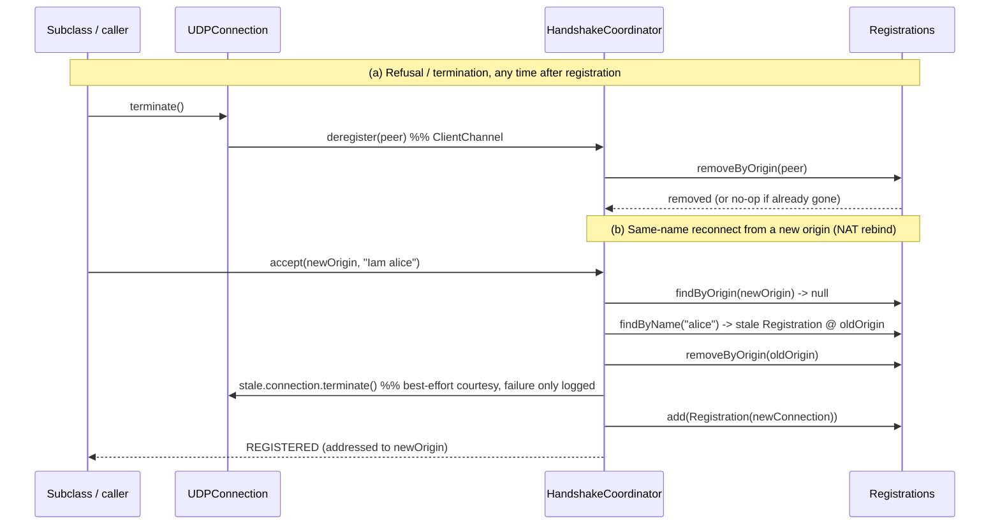

# Issue #5 — prune stale/refused registrations so `pushToAll` stops addressing dead origins

## Header / Association

- **Covers:** `SpartanLaboratories/WebTools#5` — *"Registrations never prunes a
  stale/refused entry, so pushToAll can keep addressing dead origins"*. Priority
  is stated as low / non-blocking, not a regression — this predates `2.0.0c` and
  nothing currently depends on it being fixed. Surfaced while upgrading
  `SpartanLabsGaming/MyGameTools` to `2.0.0c` (`SpartanLabsGaming/MyGameTools#18`).
- **Branch:** `fix/issue-5-prune-stale-registrations` (off `master`).
- **Commit:** TBD — this plan document is to be committed **in the same
  commit as the implementation it describes** (§8) so `git log --follow` binds
  the two.
- **PR:** TBD.
- **Status:** implemented on `fix/issue-5-prune-stale-registrations`; `./gradlew
  build` green (130 tests, 0 failures). Awaiting commit.
- **Target version:** `2.0.1a` (see §7 for why this is a bugfix-letter release,
  not a third-number bump).
- **Related:** `docs/issue-3-public-client-handshake-plan.md` (current wire
  protocol / `HandshakeCoordinator` shape, unaffected by this fix).

---

## 1. Context

### 1.1 Root cause (current source, confirmed by reading it directly)

`Registrations` (`src/main/kotlin/com/spartanlabs/webtools/Registrations.kt`)
is append-only: `add` (`Registrations.kt:39-41`) is the only mutator; there is
no `remove*` of any kind. Two independent gaps follow from that single fact:

1. **`Connection.terminate()` never reaches `Registrations`.**
   `Connection.terminate()`'s contract (`Connection.kt:35-40`) is "unregister
   this connection's message handler... until `actuate` is called again" —
   i.e. *unbind, not deregister*. Its only implementation, `UDPConnection.terminate()`
   (`UDPConnection.kt:38-40`), calls `channel.unbind(peer)`, and
   `HandshakeCoordinator`'s `ClientChannel.unbind` override (`HandshakeCoordinator.kt:102-104`)
   only nulls `Registration.onMessage` — the `Registration` itself stays in
   `Registrations` forever. So when a `MultiConnectionUDPServer` subclass
   refuses a client one layer up (e.g. over its own capacity) and calls
   `terminate()`, or a caller `terminate()`s any connection for any other
   reason, the entry is still fully present for `broadcast`/`pushToAll`.

2. **A same-name reconnect from a new origin never removes the old one.**
   `handleHandshake` (`HandshakeCoordinator.kt:64-79`) keys its "already
   registered?" check purely on **origin** (`registrations.findByOrigin(origin)`).
   A client that reconnects under the same name from a new origin (NAT rebind)
   fails that origin lookup, so it takes the "new connection" branch and gets
   a second, independent `Registration` — the first one, now permanently
   unreachable at its old origin, is never removed.

3. **The only bulk-clear path is `stop()`'s `terminateAll()`**
   (`HandshakeCoordinator.kt:135-138`, called from `MultiConnectionUDPServer.stop()`),
   which tears down every registration at once, at server shutdown — not a
   per-entry pruning mechanism.

Consequence: `HandshakeCoordinator.broadcast` / `MultiConnectionUDPServer.pushToAll`
(`MultiConnectionUDPServer.kt:146-149`) addresses **every entry ever
registered for the server instance's lifetime**, including refused and
stale/rebound origins. A subclass that keeps its own roster (e.g. a player map
keyed by name) and broadcasts by iterating *that* naturally excludes these;
anything calling the base class's `pushToAll` directly does not.

### 1.2 Acceptance criteria

1. Calling `Connection.terminate()` removes that connection's `Registration`
   entirely — not just its message handler — so it is no longer addressed by
   `broadcast` / `pushToAll` and cannot be rebound via `actuate`.
2. A new `Iam <name>` from an origin that does not match any existing
   registration, but whose **name** does, supersedes the old registration for
   that name: the old one is terminated and removed, the new one takes its
   place, before the new one is added.
3. `stop()`'s existing `terminateAll()` behavior is unaffected (still tears
   down every connection at shutdown; now additionally leaves `Registrations`
   empty, which is a strict improvement, not a behavior change any test relies
   on).
4. No public signature changes. `Connection.terminate()` keeps its existing
   `(): Result<Unit>` shape; only its documented *behavior* changes (§6 flags
   this explicitly — it is the one place this fix has a real, if non-breaking,
   behavioral consequence for existing callers).

---

## 2. Design

### 2.1 Chosen mechanism: eager removal, funneled through two paths, no sweep

The issue explicitly leaves the mechanism to my judgment while naming "eager
removal in `terminate()`" as a candidate. That candidate is what I'm
recommending, for both of the two staleness-producing events named in the
issue, via two distinct paths that both bottom out in `Registrations`:

**(a) Termination/refusal → `Registrations` is the source of truth, mutated
through the existing `ClientChannel` seam.** Rename `ClientChannel.unbind`
(`ClientChannel.kt:26-34`) to `deregister`, and change what
`HandshakeCoordinator`'s implementation of it does: instead of nulling
`Registration.onMessage`, it removes the whole `Registration` for that peer
from `Registrations`. `UDPConnection.terminate()` calls `channel.deregister(peer)`
instead of `channel.unbind(peer)`. Because `UDPConnection` is always
constructed with the coordinator itself as its `ClientChannel`
(`HandshakeCoordinator`'s own class KDoc already states this invariant,
`HandshakeCoordinator.kt:21`), any call to `connection.terminate()` — whether
from a subclass refusing a client, or from `terminateAll()` at shutdown — now
always eagerly prunes `Registrations` too, with no new plumbing.

**(b) Same-name reconnect → `HandshakeCoordinator` mutates its own
`Registrations` directly, not through `Connection.terminate()`.** In the
"origin not found" branch of `handleHandshake`, look up an existing
registration by **name** (`Registrations.findByName`, new). If one exists (it
must be under a *different* origin — if the origin matched, the "known
origin" branch above would already have handled it), the coordinator removes
it directly (`Registrations.removeByOrigin`, new) and *also* calls
`stale.connection.terminate()` as a best-effort courtesy (its own failure is
logged, not propagated — the new registration proceeds regardless), before
minting and adding the new one.

Removal in (b) is done directly by the coordinator rather than solely by
delegating to `stale.connection.terminate()`, for one concrete reason:
`HandshakeCoordinator`'s own unit tests (`HandshakeCoordinatorTest`,
`HandshakeCoordinatorGatingTest`) inject a `newConnection` factory that
returns a socket-free `FakeConnection`, decoupled from the coordinator's
`ClientChannel` — calling `.terminate()` on it does not, and should not have
to, reach back into a specific `Registrations` instance to be a valid fake.
Making the coordinator itself authoritative for its own registry keeps that
test seam clean and keeps pruning correct regardless of what a given
`Connection` implementation's `terminate()` happens to do. In production,
where `Connection` is always the real `UDPConnection` wired back to the same
coordinator, the two paths (direct removal, and the courtesy `terminate()`
call routing through `deregister` → `removeByOrigin` again) simply agree —
the second is a harmless no-op once the first has already run.



### 2.2 Rejected alternative: a periodic idle-timeout sweep

Rejected. A sweep needs a staleness criterion — typically "no activity for N
seconds" — which requires new state (a last-seen timestamp on `Registration`)
and a background timer/thread that does not exist today. The issue names
exactly two concrete staleness-producing *events* (termination/refusal, and a
same-name reconnect), both of which are already precisely observable at the
moment they happen; there is no third, time-based staleness source in this
codebase to justify the extra state and a new background thread for a
low-priority, non-regression fix. Eager removal at the two named events is a
strictly smaller, fully-sufficient change.

### 2.3 Rejected alternative: a separate `dispose()`/`refuse()` method instead of repurposing `terminate()`

Considered, to avoid changing `terminate()`'s documented "resumable via
`actuate()`" contract. Rejected: nothing in this repo's tests or production
code relies on calling `actuate()` again on a connection after `terminate()`
(confirmed by grep — the only `terminate()` call sites are `terminateAll()`
at shutdown and this fix's own new supersession path), and the issue's own
suggested direction is specifically "eager removal in `terminate()`". Adding a
second lifecycle method purely to preserve a contract nothing currently
exercises would grow the public `Connection` surface for no present benefit.
The behavioral consequence for any *downstream* caller that assumed
resumability is real, however, and is called out explicitly in §6 and §7
rather than silently absorbed.

---

## 3. File-by-file changes

All paths under `src/main/kotlin/com/spartanlabs/webtools/` unless stated.

### 3.1 `Registrations.kt`

Add two members, no removals:

```kotlin
/**
 * Looks a client up by its registered name.
 * @param name the name to match, compared by value
 * @return the registration currently held under that name, or `null`
 */
fun findByName(name: String): Registration? =
    entries.firstOrNull { it.connection.name == name }

/**
 * Removes the registration for [origin], if one exists.
 * @param origin the handshake origin to remove
 * @return `true` if an entry was removed, `false` if none matched (already gone, or never existed)
 */
fun removeByOrigin(origin: InetSocketAddress): Boolean {
    val match = entries.firstOrNull { it.origin == origin } ?: return false
    return entries.remove(match)
}
```

Class KDoc gains one clause: entries are pruned via `removeByOrigin` when a
connection terminates or is superseded by a same-name reconnect from a new
origin — see `HandshakeCoordinator`.

### 3.2 `ClientChannel.kt`

Rename `unbind` → `deregister`; change its contract, not just its name:

```kotlin
/**
 * Fully removes the registration for [peer]: clears any bound handler and
 * drops the entry from the registry entirely, so it is no longer addressed
 * by broadcast/target-all operations and cannot be rebound via [bind]
 * afterward. No-op if [peer] is not (or is no longer) currently registered.
 * @param peer the client endpoint to deregister
 */
fun deregister(peer: InetSocketAddress)
```

### 3.3 `HandshakeCoordinator.kt`

- `handleHandshake`: in the "origin not found" branch, look up and supersede
  a stale same-name registration before minting the new one:

  ```kotlin
  registrations.findByOrigin(origin)?.let {
      log.info("Repeating handshake reply for already-registered origin {}", origin)
      send(REGISTERED_BYTES, origin)
  } ?: run {
      registrations.findByName(name)?.let { stale ->
          log.info("Superseding stale registration for '{}': {} -> {}", name, stale.origin, origin)
          registrations.removeByOrigin(stale.origin)
          stale.connection.terminate()
              .onFailure { log.warn("Failed to terminate superseded connection '{}'", name, it) }
      }
      val connection = newConnection(name, origin, this)
      registrations.add(Registration(connection))
      log.info("Registered connection '{}' for {}", name, origin)
      send(REGISTERED_BYTES, origin).map { onRegistered(connection) }
  }
  ```

- `override fun unbind` → rename to `override fun deregister`, body changed
  to remove the whole registration:

  ```kotlin
  override fun deregister(peer: InetSocketAddress) {
      if (registrations.removeByOrigin(peer)) {
          log.info("Deregistered connection for {}", peer)
      }
  }
  ```

- Class KDoc's first bullet ("the handshake state machine...") gains a
  clause: "...; a first `Iam` from a name that is already registered under a
  different, now-stale origin (e.g. after a NAT rebind) supersedes it — the
  stale registration is terminated and removed before the new one is added."

### 3.4 `UDPConnection.kt`

```kotlin
override fun terminate(): Result<Unit> =
    runCatching { channel.deregister(peer) }
        .onFailure { log.error("Could not terminate connection '{}'", name, it) }
```

Class KDoc's "`[actuate] / [terminate]` register and unregister this
connection's message handler" clause is corrected: `terminate` now fully
deregisters, not just unregisters the handler.

### 3.5 `Connection.kt`

`terminate()`'s KDoc rewritten to state the new, final contract:

```kotlin
/**
 * Fully deregisters this connection: its message handler is cleared and its
 * registration is removed from the server entirely, so it is no longer
 * addressed by [MultiConnectionUDPServer.pushToAll] and any subsequent
 * datagram from [peer] is dropped as unregistered. This is final — calling
 * [actuate] again afterward is a silent no-op, since there is no longer a
 * registration to bind against; the client must complete a fresh `Iam`
 * handshake to be registered again.
 *
 * Call this whenever a connection becomes stale from the application's point
 * of view — e.g. an application-level refusal (over capacity, banned, etc.)
 * discovered only after the WebTools-level handshake already completed.
 * @return [Result.success] once deregistered, or the failure that prevented it
 */
fun terminate(): Result<Unit>
```

`actuate()`'s KDoc gains one clause: calling it on a connection that has been
`terminate()`d is a silent no-op (see `terminate()`).

### 3.6 `MultiConnectionUDPServer.kt`

`pushToAll`'s KDoc gains a clause clarifying what "registered" now precisely
means: "'Registered' here means *currently* registered — a connection that
has been `terminate()`d, or superseded by a same-name reconnect from a new
origin, is pruned and no longer addressed."

### 3.7 `README.md`

Required — this changes the described handshake-protocol behavior (§ user's
global README-currency rule: a protocol behavior change updates the README in
the same commit). In the "UDP handshake protocol" section, after the existing
sentence about retransmits, add:

> A fresh `Iam` under a name that is already registered under a different
> origin (e.g. after a NAT rebind) supersedes that stale registration; the old
> origin is no longer addressed by `pushToAll`. `Connection.terminate()` fully
> deregisters the connection, not just its message handler — e.g. an
> application-level refusal discovered after the handshake already completed
> should call it so the refused client is not addressed by future broadcasts.

### 3.8 `build.gradle.kts`

`coordinates("io.github.spartanlaboratories", "WebTools", "2.0.1")` →
`"2.0.1a"` (§7).

---

## 4. Test plan (5-level hierarchy)

Test root: `src/test/kotlin/com/spartanlabs/testing/<level>/webtools/`. No new
test classes — this fix extends existing coverage of the exact units it
touches (`Registrations`, `HandshakeCoordinator`, `UDPConnection`), consistent
with how those units are already tested.

### 4.1 Level 1 — gating (`testing.gating.webtools`)

`HandshakeCoordinatorGatingTest` — add one fast case:

- A new `Iam` under an existing name, from a different origin, leaves
  `coordinator.size == 1` (supersession, not accumulation).

### 4.2 Level 2 — component (`testing.component.webtools`)

`RegistrationsTest` — add cases for the two new members:

- `findByName` returns the matching entry / `null` when no name matches.
- `removeByOrigin` removes the matching entry and returns `true`; returns
  `false` and leaves the list untouched when nothing matches; a subsequent
  `findByOrigin`/`snapshot` no longer sees the removed entry.

`HandshakeCoordinatorTest` — add/change:

- Rename `"bind then unbind toggles delivery"` → `"bind then deregister
  removes the registration entirely"`: call `coordinator.deregister(originA)`
  (the `ClientChannel` method), assert not just that delivery stops but that
  `coordinator.size` drops to `0` and a subsequent `"Iam alice"` from
  `originA` is treated as a **brand-new** registration (calls `newConnection`
  again), not a retransmit.
- New: `"a new Iam under an existing name from a different origin supersedes
  the stale registration"` — using `FakeConnection`, assert: `coordinator.size`
  stays `1` (not `2`); the stale `FakeConnection.terminateCalls == 1`; the
  surviving `snapshot().single().connection.name == "alice"` with the *new*
  origin; and `broadcast` afterward reaches only the new origin.
- New: `"terminating the real connection removes it from Registrations end to
  end"` — construct a coordinator whose `newConnection` returns a **real**
  `UDPConnection(name, peer, channel)`, not `FakeConnection` (proves the
  `terminate()` → `channel.deregister` → `Registrations.removeByOrigin`
  wiring, not just the fake's recorded call count): register one client,
  assert `coordinator.size == 1`; call `connection.terminate()`; assert
  `coordinator.size == 0` and that a subsequent datagram from that origin is
  now dropped as unregistered (not "registered but not actuated").

`UDPConnectionTest` — rename `"terminate unbinds peer"` →
`"terminate deregisters peer"`, asserting against `FakeClientChannel`'s
renamed recording list (`deregistered`, see below) instead of `unbound`.

`FakeClientChannel` (`testing/support/webtools/`) — rename the `unbind`
override to `deregister` and its recording list `unbound` → `deregistered`,
matching the production rename.

### 4.3 Level 3 — integration (`testing.integration.webtools`), real sockets

`MultiConnectionUDPServerTest` — add two `@Order`-ed cases after the existing
`pushToAll`/data-routing cases and before the `stop()` case:

- `"terminate removes a connection from pushToAll's targets"` — handshake two
  real client sockets (e.g. `kappa`, `kappaSurvivor`), call
  `connectionNamed("kappa").terminate()`, then `server.pushToAll(...)`; assert
  the survivor's socket receives it and the terminated client's socket
  receives **nothing** within a short timeout (reusing the existing
  `assertNoReplyTo`-style pattern, adapted to check an already-open socket
  rather than opening a new one for a handshake).
- `"a same-name reconnect from a new origin supersedes the stale registration"`
  — handshake a socket as `"Iam lambda"`, then handshake a **second**, fresh
  socket also as `"Iam lambda"` (simulating a NAT rebind), then
  `server.pushToAll(...)`; assert the fresh socket receives it and the stale
  socket receives nothing.

### 4.4 Levels 4a/4b/4c and 5

No changes needed. `Registrations`/`HandshakeCoordinator` have no new pure
input→output surface beyond what §4.1/4.2 already cover (4a); the full-stack
flow is already exercised by the Level 3 real-socket cases above and by the
existing E2E suite, which this fix does not change the shape of (4b); no new
concurrency risk is introduced — `Registrations` stays backed by the same
`CopyOnWriteArrayList`, and `removeByOrigin`/`findByName` are read-then-remove
over the same structure `add`/`findByOrigin` already use safely under
concurrent access (4c); nothing here needs human/UAT judgment (5).

### 4.5 What cannot be automated

Nothing new. This is a fully deterministic, socket-optional fix; every new
behavior is exercised at Levels 1–3 above.

---

## 5. Documentation impact (Audience-Reach rings)

| Ring | What moves with this change |
|---|---|
| Inner Core | Inline comment on the `handleHandshake` supersession branch explaining why removal is done directly against `Registrations` rather than solely via `stale.connection.terminate()` (§2.1(b) rationale). |
| Component Ring (KDoc) | `Connection.terminate()` (new, final contract) and `actuate()` (no-op-after-terminate clause); `ClientChannel.deregister` (renamed + recontracted); `UDPConnection`'s class KDoc; `Registrations`'s class KDoc (pruning clause); `HandshakeCoordinator`'s class KDoc (supersession clause); `MultiConnectionUDPServer.pushToAll`'s KDoc (what "registered" means now). |
| Boundary Ring | `README.md` "UDP handshake protocol" section (§3.7) — this is a protocol-behavior change, not just an internal refactor. |
| Architectural Outer Layer | The sequence diagram in §2.1 is the canonical reference for both pruning flows; no existing architecture doc needs updating beyond this plan itself. |

README currency: covered by §3.7 — the same commit that changes the behavior
updates the README.

---

## 6. Risks & edge cases

- **Behavioral (non-signature) change to a published interface method.**
  `Connection.terminate()` keeps its exact signature but changes from
  "unbind, resumable via `actuate()`" to "fully deregister, final." No test or
  production call site in *this* repo relies on the old resumable behavior
  (confirmed by grep across `src/main` and `src/test`), but this is a
  cross-repo-visible behavior change for any consumer (notably
  `SpartanLabsGaming/MyGameTools`) that might have assumed `terminate()` +
  `actuate()` could resume a connection without a new handshake. Recommend a
  quick check of `MyGameTools`' own `Connection` usage before this ships, or
  at minimum flagging it in the release notes/issue comment when this closes.
- **Same-name collisions that are not reconnects.** If two distinct clients
  legitimately pick the same name from different origins (not a NAT rebind of
  one client), the second now silently evicts the first's registration. This
  is exactly the behavior the issue asks for ("a client that reconnects under
  the same name... gets a fresh registration, but the old one... is never
  removed") and WebTools has no identity concept beyond the caller-supplied
  name to distinguish the two cases — this is an accepted, pre-existing
  ambiguity the issue's own suggested direction resolves in favor of
  supersession, not a new risk this fix introduces.
- **`terminateAll()` (used by `stop()`) now also empties `Registrations` as a
  side effect**, since it calls `connection.terminate()` on every entry. This
  is a strict improvement (previously `Registrations` stayed non-empty after
  `stop()`); no test asserts the old, stale-but-full state.
- **No new concurrency risk.** `removeByOrigin`/`findByName` operate over the
  same `CopyOnWriteArrayList` that `add`/`findByOrigin` already use safely
  under concurrent listener-thread/caller-thread access; nothing new is
  introduced here that the existing structure doesn't already handle.
- **Not a wire/protocol compatibility break.** The `Iam`/`REGISTERED`/`KA`
  wire format is unchanged; this is purely server-side bookkeeping.

---

## 7. Version to ship as

**Recommendation: `2.0.1a`**, not `2.0.2`. Per this project's recorded
convention (settled in `docs/issue-3-public-client-handshake-plan.md` §9 D6):
the trailing pre-release letter suffix is reserved for bugfix releases; a
non-breaking *addition* bumps the third number instead. This change adds no
new public API and no new capability — it fixes broken bookkeeping behavior,
which is squarely a bugfix by that same convention, so it takes a letter
suffix off the current released version (`2.0.1` → `2.0.1a`), the same
pattern already used for `2.0.0a`/`b`/`c`/`d`. This is not treated as an open
decision — the convention already determines it — but is called out
explicitly since it's the first bugfix release to land after `2.0.1` and thus
the first time the convention is applied to a base other than `2.0.0`.

---

## 8. Version control

- **Branch:** `fix/issue-5-prune-stale-registrations`, off `master`.
- **Pre-existing working-tree noise:** `.idea/workspace.xml` and `.gitignore`
  are already modified in the working tree — **not** part of this work; leave
  them out of every commit here.
- **Commit trailers** (every commit):
  ```
  Co-Authored-By: Claude Sonnet 5 <noreply@anthropic.com>
  Claude-Session: https://claude.ai/code/session_01W3FTxBoiCajVkEQfj9qyvx
  ```
- **Commit sequence:**
  1. `fix: prune stale/refused registrations from Registrations (Issue #5)` —
     §3.1–§3.6 (production), §4 (all test changes), §3.8 (`build.gradle.kts`
     version bump to `2.0.1a`), §3.7 (`README.md`), and this plan document.
     `./gradlew build` (all levels) green before committing.
  2. *(after merge)* fill this doc's `Commit:` / `PR:` header fields with the
     real SHA(s) and PR number.
- **No push, no PR, no release** until the user asks.

---

## 9. Sequencing & follow-ups

**Order of operations:**
1. Implement §3.1–§3.6 and §4 together (production + tests), `./gradlew build`
   green.
2. Update `README.md` and `build.gradle.kts` version in the same commit.
3. On the user's say-so: publish, comment on issue #5 noting the fix and the
   `Connection.terminate()` behavior change, and separately flag the
   `MyGameTools` compatibility check from §6 for the user's own follow-up in
   that repo (not performed here — cross-repo).

**Deliberately left for later:**
- Any change to `MyGameTools`' `GameServer` to actually *call*
  `connection.terminate()` on an application-level refusal (it does not
  today, per the issue's own description) — a follow-up in that repo, now
  meaningful to do since this fix makes `terminate()` actually prune the
  registration. Not performed here.
- A `Connection`-level "why was I terminated" reason/cause is not added;
  `terminate()` stays a bare signal, matching its existing shape.
