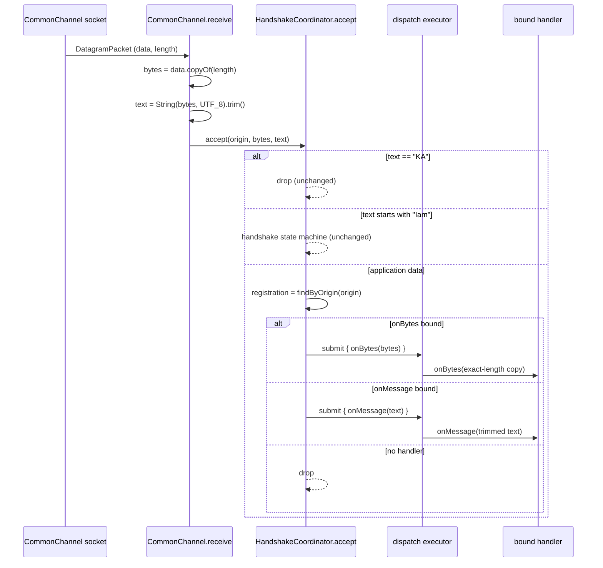

# Issue #8 — expose a raw binary datagram path on the webtools-udp send/receive surface

## Header / Association

- **Covers:** `SpartanLaboratories/WebTools#8` — *"Expose a binary datagram path
  on Connection / MultiConnectionUDPClient"* (label: `enhancement`). The public
  send/receive surface of `webtools-udp` is text-only: `Connection.push(String)`,
  `MultiConnectionUDPClient.send(String)`, and every inbound datagram is decoded
  `String(data, 0, len, UTF_8).trim()`. A binary protocol has to base64 into a
  `String` (~33% overhead) and still risks `.trim()` corrupting a payload whose
  first/last byte is ASCII whitespace.
- **Module:** `webtools-udp` only (`io.github.spartanlaboratories:webtools-udp`,
  package `com.spartanlabs.webtools.udp`). No other module is touched.
- **Branch:** `feat/issue-8-binary-datagram-path` (off `master`).
- **Commit:** `5fe3f94` (`feat: expose a raw binary datagram path on the
  webtools-udp send/receive surface (Issue #8)` — implementation + tests + this
  plan doc), followed by `175e92f` (`build: bump webtools-udp to 1.1.0`).
- **PR:** [#17](https://github.com/SpartanLaboratories/WebTools/pull/17), merged
  to `master` as `cbef98d`.
- **Status:** landed. Implemented as designed; the four QA-remediation additions
  in §11 were folded in. Design decisions settled in §9 (the user took the
  recommendation on each of D1 interface evolution/version, D2 receive-buffer
  size, D3 inbound callback shape).
- **Target version:** `webtools-udp` `1.0.0` → **`1.1.0`** (non-breaking
  addition; see §7).
- **Related:** `docs/issue-3-public-client-handshake-plan.md` (current wire
  protocol, `MultiConnectionUDPClient` shape), `docs/issue-5-prune-stale-registrations-plan.md`,
  `docs/split-into-three-modules-plan.md` (module layout, per-module versions).
- **Consumer context (not tracked here):** unblocks `SpartanLabsGaming/MyGameTools`'
  planned binary `SnapshotCodec` (its roadmap §7). Per standing guidance the
  downstream adoption is that repo's concern; this plan closes once the
  `webtools-udp` change lands.

---

## 1. Context

### 1.1 What is text-only today (current source, read directly)

| Concern | Location | Behaviour |
|---|---|---|
| Server → client send | `UDPConnection.push(message: String)` `UDPConnection.kt:43-45` | `channel.send(message.toByteArray(Charsets.UTF_8), peer)` |
| Server broadcast | `HandshakeCoordinator.broadcast(message: String)` `HandshakeCoordinator.kt:137-142` | `message.toByteArray(Charsets.UTF_8)` then per-peer send |
| Client send | `MultiConnectionUDPClient.send(message: String)` `MultiConnectionUDPClient.kt:200-203` | `message.toByteArray(Charsets.UTF_8)` |
| Server receive/decode | `CommonChannel.receive` `CommonChannel.kt:50-56` | `String(packet.data, 0, packet.length, Charsets.UTF_8).trim()` into `Inbound(origin, text)` `CommonChannel.kt:14` |
| Client receive/decode | `MultiConnectionUDPClient.receiveLoop` `MultiConnectionUDPClient.kt:165-192` | same `String(...).trim()` |
| Server inbound handler | `Connection.actuate(onMessage: (String) -> Unit)` `Connection.kt:35` → `ClientChannel.bind` `ClientChannel.kt:27` → `Registration.onMessage: ((String) -> Unit)?` `Registrations.kt:19-20` | trimmed text delivered on the dispatch executor |
| Client inbound handler | `MultiConnectionUDPClient.start(onMessage: (String) -> Unit)` `MultiConnectionUDPClient.kt:147` | trimmed text delivered on the dispatch executor |

The socket layer underneath is already byte-capable: `CommonChannel.send(bytes:
ByteArray, to)` `CommonChannel.kt:65-67` and `ClientChannel.send(bytes:
ByteArray, to)` `ClientChannel.kt:19` both take raw bytes. It is only the public
surface that forces text, plus there is no bytes-**in** path at all.

### 1.2 Why `.trim()` matters, and why it is load-bearing

`.trim()` (Kotlin: strip leading/trailing chars `<= ' '`) is applied on **both**
receive paths and its result drives three things in
`HandshakeCoordinator.accept` `HandshakeCoordinator.kt:58-65`:

1. `HandshakeProtocol.isKeepAlive(text)` — `text == "KA"` → drop, no dispatch.
2. `HandshakeProtocol.isHandshake(text.split(' '))` — first token `== "Iam"` →
   run the handshake state machine.
3. otherwise → `deliverData(origin, text)` → the bound `onMessage`.

On the client, `receiveLoop` runs only check 1 before dispatching.

So `.trim()` cannot simply be removed: it is what lets `" KA "` or a
newline-padded `Iam alice` still classify correctly. But it also means a binary
payload whose first or last byte is `0x00..0x20` is silently reshaped before
delivery, and a payload of exactly `4B 41` ("KA") is swallowed (already
documented for the text case in `HandshakeProtocol.kt:11-14`).

### 1.3 Goal / acceptance criteria

1. A consumer can send a raw `ByteArray` as one datagram from both
   `Connection` (server → client) and `MultiConnectionUDPClient` (client →
   server), with the bytes placed on the wire verbatim — no encoding, no trim.
2. A consumer can register an inbound handler that receives the **exact**
   datagram payload (right-sized, undecoded, untrimmed) instead of a trimmed
   `String`, on both the server (`Connection`) and client sides.
3. The `String` send/receive API keeps working unchanged and stays the default;
   the `String` send methods become thin UTF-8 wrappers over the byte methods.
4. The handshake (`Iam` / `REGISTERED` / `KA`) stays text and its
   classification behaviour is **byte-for-byte unchanged** — adding the binary
   path must not alter which datagrams are treated as handshake vs keepalive vs
   application data.
5. The change is a non-breaking addition: `webtools-udp` `1.1.0` (see §9 D1).

---

## 2. Design

### 2.1 Send: `ByteArray` overloads, `String` becomes the wrapper

Overloading on `String` vs `ByteArray` for a **value** argument is already the
house pattern — `UDPSendReceiveServer.send(byteArray: ByteArray)` /
`send(message: String)` (`UDPSendReceiveServer.kt:47-60`). Apply it:

- `Connection.push(bytes: ByteArray): Result<Unit>` — new; `push(message:
  String)` delegates via `push(message.toByteArray(Charsets.UTF_8))`.
- `MultiConnectionUDPClient.send(bytes: ByteArray): Result<Unit>` — new;
  `send(message: String)` delegates.
- `MultiConnectionUDPServer.pushToAll(bytes: ByteArray): Result<Unit>` and
  `HandshakeCoordinator.broadcast(bytes: ByteArray): Result<Unit>` — new;
  the `String` forms delegate. (Natural completion — a binary protocol that can
  target one client but not broadcast would be half a path.)

No wire change: `DatagramSocket.send` already copies the payload into the OS
buffer synchronously, so no defensive copy is needed on the send side.

### 2.2 Receive: carry raw bytes alongside the trimmed text; classify on text, deliver either

The safe split: keep `text` (trimmed) as the value that drives classification,
exactly as today, and carry a parallel `bytes` value (an exact-length copy) that
is used **only** for delivery to a bytes handler.

`CommonChannel.Inbound` `CommonChannel.kt:14` grows a field:

```kotlin
internal data class Inbound(
    val origin: InetSocketAddress,
    val bytes: ByteArray,   // exact-length copy of the datagram body, decoupled from the reused buffer
    val text: String,       // String(bytes, UTF_8).trim() - identical to today's value
)
```

`CommonChannel.receive` `CommonChannel.kt:50-56`:

```kotlin
socket.receive(packet)
val origin = InetSocketAddress(packet.address, packet.port)
val bytes = packet.data.copyOf(packet.length)      // right-sized; the next receive() reuses `packet.data`
val text = String(bytes, Charsets.UTF_8).trim()    // unchanged semantics
Inbound(origin, bytes, text)
```

`HandshakeCoordinator.accept` keeps classifying on `text` — **no change to the
`when` in `HandshakeCoordinator.kt:58-65`** — but now also receives `bytes` and
passes it into `deliverData`:

```kotlin
fun accept(origin: InetSocketAddress, bytes: ByteArray, text: String): Result<Unit> = when {
    HandshakeProtocol.isKeepAlive(text)               -> Result.success(Unit).also { log.trace(...) }
    HandshakeProtocol.isHandshake(text.split(' '))    -> handleHandshake(origin, text.split(' '))
    else                                             -> deliverData(origin, bytes, text)
}

// retained for the existing component/gating tests that call accept(origin, text):
fun accept(origin: InetSocketAddress, text: String): Result<Unit> =
    accept(origin, text.toByteArray(Charsets.UTF_8), text)
```

`deliverData` picks the handler:

```kotlin
private fun deliverData(origin: InetSocketAddress, bytes: ByteArray, text: String): Result<Unit> {
    val registration = registrations.findByOrigin(origin) ?: return Result.success(Unit).also { log.debug(...) }
    val bytesHandler = registration.onBytes
    val textHandler  = registration.onMessage
    return when {
        bytesHandler != null -> runCatching { dispatch { runCatching { bytesHandler(bytes) }.onFailure { log.warn(...) } } }
        textHandler  != null -> runCatching { dispatch { runCatching { textHandler(text) }.onFailure { log.warn(...) } } }
        else                 -> Result.success(Unit).also { log.debug("No handler bound for {}, dropping", origin) }
    }
}
```

The **exact-length copy** (`copyOf(length)`) is deliberate and not negotiable:
the listener reuses `packet.data` on the very next `receive()`, so handing the
dispatch executor a slice of the live buffer would be a data race. The text path
is already safe here only because `String(...)` copies.

`MultiConnectionUDPClient.receiveLoop` `MultiConnectionUDPClient.kt:165-192` gets
the mirror treatment: compute `bytes = packet.data.copyOf(packet.length)` and
`text = String(bytes, UTF_8).trim()`, keep `if (isKeepAlive(text)) drop`, then
dispatch `bytes` or `text` per whichever of `start` / `startBytes` armed the
listener (§2.4).

### 2.3 Inbound callback shape — two methods, text stays the default (settled, §9 D3)

- `Connection.actuate(onMessage: (String) -> Unit)` — **unchanged**. Trimmed
  UTF-8 text. Still the default and the common case.
- `Connection.actuateBytes(onMessage: (bytes: ByteArray) -> Unit): Result<Unit>`
  — new. Hands the handler an exact-length copy of each inbound datagram: no
  UTF-8 decode, no `.trim()`.
- Mirrored on the client as `start` (unchanged) / `startBytes` (new), and on the
  server as `start` (unchanged) / `startBytes` (new, actuate-all with a bytes
  handler).

**One handler per connection.** `actuate` and `actuateBytes` are mutually
exclusive — the last call wins; binding one clears the other
(`Registration.onMessage` / `Registration.onBytes`, one nulled when the other is
set, in `HandshakeCoordinator.bind` / `bindBytes`). A consumer that wants both
views decodes inside a bytes handler.

**Rejected — overload `actuate` / `start` on the lambda type**
(`(String) -> Unit` vs `(ByteArray) -> Unit`). Kotlin overload resolution is
ambiguous for a bare lambda (`conn.actuate { }`), and even
`conn.actuate { it.something }` resolves only when the body pins the type. A
distinct verb removes the footgun entirely.

**Rejected — a single `Datagram(bytes, text)` value type through one callback.**
Either it changes `actuate`/`start`'s signature (clean-break `2.0.0`, forces
every existing text consumer to migrate to `it.text`) or it still needs a second
method anyway. Bundling a trimmed-text view and a raw-bytes view in one object
also invites "which one is authoritative" confusion — the two views have
genuinely different semantics (one is lossy by design). Two crisp methods keep
each contract obvious.

### 2.4 The binary-vs-text classifier ambiguity (design limitation, documented not fixed)

The `Iam` / `KA` classifier runs on **every** inbound datagram and must stay
always-on: a retransmitted `Iam` (NAT rebind / supersede,
`HandshakeCoordinator.kt:81-86`) legitimately arrives mid-session, and `KA`
keepalives flow for the whole session. So a binary application payload whose
UTF-8 decode, after trimming ASCII whitespace, is exactly `KA`, or begins with
`Iam ` (bytes `49 61 6D 20`), will be intercepted by the handshake/keepalive
machinery and never reach `actuateBytes`. A payload trimming to exactly `Iam`
(no following token) is classified as a handshake and then fails
`parseHandshake` `HandshakeProtocol.kt:46-50` → `accept` returns
`Result.failure` and the datagram is dropped with a logged warning.

This is a pre-existing property for text (`HandshakeProtocol.kt:11-14`), and
this plan does not change it. Fixing it properly needs a framing change — a
1-byte datagram-type tag separating control from application traffic — which is
a clean-break protocol revision, out of scope here and noted as a follow-up
(§10).

**Mitigation offered to consumers (documentation only):** lead every binary
application datagram with a byte that cannot start `Iam` or `KA` and is not
ASCII whitespace — e.g. `0x00`, or any byte `>= 0x80` (a version/format tag).
This deterministically sidesteps both classifiers. Stated in
`HandshakeWireFormat` KDoc and the README.

### 2.5 Receive buffer ceiling — raised to 65507 (settled, §9 D2)

Both receive loops read into a fixed `RECEIVE_BUFFER_BYTES = 1024` buffer
(`MultiConnectionUDPServer.kt:192`, `MultiConnectionUDPClient.kt:240`). A
datagram larger than 1024 bytes is silently truncated to 1024 on receive.
Harmless for the handshake and for short text; directly in the way of "compact
binary per-tick world-state deltas", which can exceed 1 KB.

`RECEIVE_BUFFER_BYTES` is raised to **65507** (the maximum UDP payload over IPv4)
on both receive paths, so the library never truncates a well-formed datagram.
Because delivery is a `packet.data.copyOf(packet.length)`, the per-datagram copy
cost still tracks the actual payload size — the only new cost is one 64 KiB
backing array per listener (one per `MultiConnectionUDPServer`, one per
`MultiConnectionUDPClient`). Real-network use should still keep frames under the
path MTU (~1200 bytes) to avoid IP fragmentation and loss; the README says so.
Note this also lets an oversized **text** message arrive whole instead of
truncated — an intentional, accepted side effect.

### 2.6 Flow (server side, one inbound datagram)



---

## 3. File-by-file changes

All paths under `webtools-udp/src/main/kotlin/com/spartanlabs/webtools/udp/`
unless noted.

### 3.1 `Connection.kt` (public interface)

- Add `fun push(bytes: ByteArray): Result<Unit>` — default body
  `push(String(bytes, Charsets.UTF_8))` (source-compat shim, see §9 D1). KDoc:
  raw datagram payload, sent verbatim, no encoding; `UDPConnection` overrides the
  default to put the bytes on the wire unchanged.
- Add `fun actuateBytes(onMessage: (bytes: ByteArray) -> Unit): Result<Unit>` —
  default body `actuate { onMessage(it.toByteArray(Charsets.UTF_8)) }`
  (source-compat shim). KDoc: hands the handler an exact-length copy of each
  inbound datagram — no decode, no `.trim()`; mutually exclusive with `actuate`
  (last call wins); handshake/keepalive datagrams are filtered upstream and never
  delivered.
- `push(message: String)` KDoc: note it is a UTF-8 wrapper over `push(ByteArray)`.
- `actuate` KDoc: note the trimmed-UTF-8 contract and cross-reference
  `actuateBytes` for binary protocols.

### 3.2 `UDPConnection.kt`

- `override fun push(bytes: ByteArray): Result<Unit> = channel.send(bytes, peer).onFailure { log.error(...) }`.
- `override fun push(message: String): Result<Unit> = push(message.toByteArray(Charsets.UTF_8))`.
- `override fun actuateBytes(onMessage: (ByteArray) -> Unit): Result<Unit> =
  runCatching { channel.bindBytes(peer, onMessage) }.onFailure { log.error("Could not actuate (bytes) connection '{}'", name, it) }`.
- `actuate` and `keepAlive` unchanged.

### 3.3 `ClientChannel.kt` (internal interface)

- Add `fun bindBytes(peer: InetSocketAddress, onMessage: (ByteArray) -> Unit)`.
  KDoc mirrors `bind` `ClientChannel.kt:21-27`; note that binding a bytes handler
  clears any text handler for `peer`, and vice versa.
- `send(bytes: ByteArray, to)` already present — unchanged.

### 3.4 `Registrations.kt`

- `Registration` `Registrations.kt:16-21`: add
  `@Volatile var onBytes: ((ByteArray) -> Unit)? = null`. KDoc: `onMessage` and
  `onBytes` are mutually exclusive — `HandshakeCoordinator.bind` / `bindBytes`
  set one and null the other; the listener thread reads whichever is non-null,
  hence `@Volatile`.

### 3.5 `HandshakeCoordinator.kt`

- `accept(origin, text)` → primary `accept(origin, bytes: ByteArray, text: String)`
  with the classification `when` **unchanged**; retain a 2-arg
  `accept(origin, text)` delegating with `bytes = text.toByteArray(UTF_8)` for
  the existing component/gating tests.
- `deliverData(origin, text)` → `deliverData(origin, bytes: ByteArray, text: String)`
  per §2.2 — bytes handler wins over text handler; no-handler drop unchanged.
- `bind(peer, onMessage)` override `HandshakeCoordinator.kt:111-113`: also set
  `onBytes = null`.
- Add `bindBytes(peer, onMessage)` override:
  `registrations.findByOrigin(peer)?.let { it.onBytes = onMessage; it.onMessage = null }`.
- Add `actuateAllBytes(onMessage: (ByteArray) -> Unit): Result<Unit>` — mirror of
  `actuateAll` `HandshakeCoordinator.kt:127-130` calling `connection.actuateBytes`.
- Add `broadcast(bytes: ByteArray): Result<Unit>` — mirror of `broadcast(message)`
  `HandshakeCoordinator.kt:137-142` without the `toByteArray`; `broadcast(message:
  String)` delegates.

### 3.6 `CommonChannel.kt`

- `Inbound` `CommonChannel.kt:14`: add `bytes: ByteArray` (order: `origin, bytes,
  text`). Keep it a `data class`; add a one-line comment that it is `internal`
  and only ever read field-wise, so the `ByteArray`-in-`data class`
  `equals`/`hashCode` identity caveat is a non-issue. (Alternative: plain class —
  see §6.)
- `receive(buffer)` `CommonChannel.kt:50-56`: build `bytes = packet.data.copyOf(packet.length)`
  first, derive `text` from it, return `Inbound(origin, bytes, text)`.
- `send` unchanged.

### 3.7 `MultiConnectionUDPServer.kt`

- `receiveLoop` `MultiConnectionUDPServer.kt:100-114`: replace the destructuring
  `.flatMap { (origin, text) -> coordinator.accept(origin, text) }` with
  `.flatMap { inbound -> coordinator.accept(inbound.origin, inbound.bytes, inbound.text) }`.
- Add `fun startBytes(onClientMessage: (ByteArray) -> Unit): Result<Unit>` →
  `coordinator.actuateAllBytes(onClientMessage)`. KDoc mirrors `start`
  `MultiConnectionUDPServer.kt:136-139`.
- Add `fun pushToAll(bytes: ByteArray): Result<Unit>` →
  `coordinator.broadcast(bytes)`; `pushToAll(message: String)` delegates. KDoc
  mirrors `pushToAll` `MultiConnectionUDPServer.kt:149-152`.
- Class KDoc: short "Binary application payloads" paragraph — post-handshake data
  may be raw bytes via `Connection.push(ByteArray)` / `actuateBytes` /
  `startBytes` / `pushToAll(ByteArray)`; the `Iam`/`KA` classifier still runs on
  every datagram (§2.4 caveat + the lead-byte mitigation).
- `RECEIVE_BUFFER_BYTES` `MultiConnectionUDPServer.kt:192`: `1024` → `65507`
  (§2.5).

### 3.8 `MultiConnectionUDPClient.kt`

- Add `fun send(bytes: ByteArray): Result<Unit>` — raw send to
  `serverAddress:serverPort`; `send(message: String)`
  `MultiConnectionUDPClient.kt:200-203` delegates.
- Add `fun startBytes(onMessage: (bytes: ByteArray) -> Unit): Result<Unit>` —
  arms the listener with a bytes handler; mutually exclusive with `start`, same
  one-shot ordering contract.
- Refactor `receiveLoop` `MultiConnectionUDPClient.kt:165-192` to close over an
  internal `deliver: (bytes: ByteArray, text: String) -> Unit` set by `start`
  (`{ _, text -> dispatch { onMessage(text) } }`) or `startBytes`
  (`{ bytes, _ -> dispatch { onMessage(bytes) } }`); compute `bytes`/`text` as in
  §2.2; keepalive check on `text` unchanged.
- `sendKeepAlive` `MultiConnectionUDPClient.kt:210` unchanged (sends `"KA"` text).
- Class KDoc: "Binary application payloads" note mirroring §3.7; the `KA`
  classifier still runs on every inbound datagram.
- `RECEIVE_BUFFER_BYTES` `MultiConnectionUDPClient.kt:240`: `1024` → `65507`
  (§2.5). The constant is shared by `receiveLoop` and `handshake`
  `MultiConnectionUDPClient.kt:116`; `handshake`'s buffer is a one-shot
  allocation, so sharing the larger size is harmless (no need for a second
  constant).

### 3.9 `HandshakeProtocol.kt` / `HandshakeWireFormat.kt`

- No behavioural change.
- `HandshakeWireFormat` (public) object KDoc: add a short note that application
  data may be raw binary (`Connection.push(ByteArray)` etc.), that the `Iam` /
  `KA` classifier runs on every datagram, and the lead-byte mitigation (§2.4).
- `HandshakeProtocol` KDoc `HandshakeProtocol.kt:11-14`: extend the existing
  "exact `KEEPALIVE_TOKEN` payload is swallowed" note to name the binary case and
  the `Iam`-prefix case.

### 3.10 Test-support fixtures

`webtools-udp/src/test/kotlin/com/spartanlabs/testing/support/webtools/udp/`

- `FakeClientChannel.kt`: add
  `boundBytes: MutableMap<InetSocketAddress, (ByteArray) -> Unit>`, a `bindBytes`
  override (clearing the text entry for that peer, matching production), a
  `sentBytes: MutableList<Pair<ByteArray, InetSocketAddress>>` recording the raw
  bytes of every `send`, and `fun deliverBytes(peer, bytes)`. Keep the existing
  `Sent(text, to)` list and `deliver` for the current tests.
- `FakeConnection.kt`: add `pushedBytes: MutableList<ByteArray>`, override
  `push(bytes: ByteArray)`, override `actuateBytes` recording `lastOnBytes`.
  Existing text members unchanged.

### 3.11 `webtools-udp/build.gradle.kts`

- Add an explicit `version = "1.1.0"` (overrides the root `allprojects { version
  = "1.0.0" }` for this subproject only — the split plan §2.3 already anticipates
  the three modules diverging). `webtools-scraping` / `webtools-browser` stay at
  `1.0.0`.

### 3.12 `README.md` (repo root)

- Install snippet: `webtools-udp:1.0.0` → `1.1.0`.
- `webtools-udp` Components table: `Connection` row — mention `push(String)` /
  `push(ByteArray)` and `actuate` / `actuateBytes`; `MultiConnectionUDPClient`
  row — mention `send(ByteArray)` / `startBytes`.
- "UDP handshake protocol" section: new "Binary application payloads" subsection —
  the byte-in/byte-out surface, the exact-length no-trim delivery contract, the
  classifier caveat, the "lead with `0x00` or a byte `>= 0x80`" recommendation,
  the 65507-byte hard cap, and the path-MTU advisory (~1200 bytes for internet
  use).
- "Client-side usage" snippet: optional `startBytes` / `send(bytes)` example.

### 3.13 `docs/issue-8-binary-datagram-path-plan.md`

- This document, committed with the implementation (§8).

---

## 4. Test plan (5-level hierarchy)

Test root: `webtools-udp/src/test/kotlin/com/spartanlabs/testing/<level>/webtools/udp/`,
`@Tag("<level>")`, one class per production type — **extend existing classes**
except where a new class is called out. Port-9998 tasks stay serialised by the
`commonUdpPortLock` build service.

### 4.1 Level 1 — gating (`testing.gating.webtools.udp`)

`UDPConnectionGatingTest` (extend, socket-free over `FakeClientChannel`):

| Behaviour |
|---|
| `push(ByteArray)` forwards the exact bytes to `channel.send` with `peer`, and propagates success |
| `push(ByteArray)` propagates a channel send failure |
| a payload with leading/trailing whitespace bytes (`byteArrayOf(0x20, 0x41, 0x20)`) is forwarded **verbatim** — no trim on the send path |

### 4.2 Level 2 — component (`testing.component.webtools.udp`)

`UDPConnectionTest` (extend):

| Behaviour |
|---|
| `push(ByteArray)` forwards the exact bytes to `channel.send` with `peer` |
| `push(String)` is a UTF-8 wrapper over `push(ByteArray)` (send a multi-byte string, assert `sentBytes` == its UTF-8 encoding) |
| `actuateBytes` calls `channel.bindBytes` for `peer` and propagates the `Result` |

`HandshakeCoordinatorTest` (extend, synchronous dispatch, recording fakes):

| Behaviour |
|---|
| `accept` routes application data to a bound **bytes** handler with the exact undecoded bytes (`accept(originA, byteArrayOf(0x00, 0x20, 0x4B), text)` → handler sees exactly those 3 bytes) |
| a **bytes** payload that trims to `"KA"` is still dropped as a keepalive — reaches neither handler |
| a **bytes** payload whose decoded text begins with `"Iam "` is classified as a handshake — does not reach the bytes handler (documents §2.4) |
| `bindBytes` clears a previously bound text handler; `bind` clears a previously bound bytes handler (mutual exclusion) |
| `deliverData` with no handler bound drops a binary datagram (parity with text) |
| a throwing bytes handler does not propagate out of `accept` |
| `actuateAllBytes` actuates every registered connection via `actuateBytes` |
| `broadcast(ByteArray)` sends the exact bytes to every registered peer, addressed to the observed origin (not a payload-claimed address) |
| existing 2-arg `accept(origin, text)` tests still pass unchanged |

### 4.3 Level 3 — integration (`testing.integration.webtools.udp`), real sockets

`MultiConnectionUDPClientTest` (extend, against a fake peer `DatagramSocket`):

| Behaviour |
|---|
| `send(ByteArray)` puts the exact bytes on the wire (payload with leading/trailing spaces and an embedded `0x00`; peer compares byte-for-byte) |
| after `startBytes`, an inbound datagram is delivered to the bytes handler with **no trim and exact length** (peer sends `byteArrayOf(0x20, 0xC3, 0x28, 0x20)` — surrounding spaces + invalid UTF-8; handler sees exactly those 4 bytes) |
| a binary payload ending in `0x0A` / `0x20` survives intact via `startBytes` where `String(...).trim()` would corrupt it |
| a bare `KA` is still dropped when the listener was armed with `startBytes` |
| `send(String)` still round-trips as UTF-8 (regression) |

`CommonChannelTest` (extend):

| Behaviour |
|---|
| `receive` exposes the exact datagram bytes alongside the trimmed text (send `" x \n"` → `inbound.text == "x"`, `inbound.bytes` is the 4 raw bytes) |
| `inbound.bytes` is an independent copy — a second `receive` into the same buffer does not mutate the first result |
| a datagram larger than 1024 bytes (e.g. 4 KiB) is received whole, `inbound.bytes.size == 4096` — locks the buffer bump to 65507 at the `CommonChannel` level |

`MultiConnectionUDPServerTest` (extend, if it already drives `accept` over a real
socket): one binary client→handler delivery case; otherwise leave to 4b.
*(Superseded — see §11: real-socket server binary coverage was added here during
QA remediation.)*

### 4.4 Level 4a — deterministic (`testing.deterministic.webtools.udp`)

No new pure function is introduced (delivery is `ByteArray.copyOf`, classification
is unchanged). No new class. `HandshakeProtocolTest` / `HandshakeWireFormatTest`
stay green unmodified.

### 4.5 Level 4b — e2e (`testing.e2e.webtools.udp`)

**New class** `MultiConnectionUDPBinaryE2ETest` — keeps the existing
`MultiConnectionUDPClientServerE2ETest` readable; real server subclass +
real `MultiConnectionUDPClient` over loopback:

| Behaviour |
|---|
| client → server: a payload of bytes `0x00..0xFF` sent via `client.send(bytes)` arrives byte-identical at a `connection.actuateBytes` handler |
| server → client: `connection.push(bytes)` arrives byte-identical at `client.startBytes`'s handler |
| `server.pushToAll(bytes)` reaches the client's bytes handler byte-identical |
| a payload of exactly `byteArrayOf(0x4B, 0x41)` ("KA") is swallowed end to end (documents the caveat) |
| a burst of N ordered binary frames arrives in order (single-threaded dispatch) |
| mixed: one client on `start` (text), another on `startBytes` on the same server — each gets its own view of the same `pushToAll` |
| clean teardown; a fresh client/server pair rebinds afterward |

### 4.6 Level 4c — non-functional (`testing.nonfunctional.webtools.udp`)

`MultiConnectionUDPClientNonFunctionalTest` (extend):

| Behaviour |
|---|
| per-session order preserved under a burst of binary frames via `startBytes` (mirror of the existing text burst) |
| a `KA` storm from the peer creates no calls to the bytes handler and does not wedge the listener |
| a throwing bytes handler never kills the dispatch thread across many frames |
| **datagram-size ceiling:** an 8 KiB binary payload (well over the old 1024 limit) round-trips whole via `startBytes`, proving the buffer bump to 65507; document that a payload above 65507 is still truncated |

### 4.7 Level 5 — UAT (`testing.uat.webtools.udp`)

No new class. `MultiConnectionUDPServerUatTest` (`@Disabled`) may later gain a
manual binary-echo scenario; not required here.

### 4.8 What cannot be automated

- Real-NAT behaviour of binary datagrams (same as text — already out of automated
  scope per the issue #1 docs).
- Path-MTU fragmentation/loss for datagrams between ~1200 and 65507 bytes on a
  real internet path — loopback tests never see it. Documented as a caveat for
  binary consumers (keep frames under path MTU for internet use).
- Interop with `MyGameTools`' actual `SnapshotCodec` — that repo's concern.

---

## 5. Documentation impact (Audience-Reach rings)

| Ring | What moves with this change |
|---|---|
| Inner Core | Comments in `CommonChannel.receive` / both `receiveLoop`s on why `bytes` is a `copyOf(length)` and not a buffer slice; comment on `Inbound`'s `ByteArray` field; comment in `deliverData` / client `receiveLoop` on bytes-handler-wins ordering. |
| Component Ring (KDoc) | New KDoc on `Connection.push(ByteArray)`, `Connection.actuateBytes`, `MultiConnectionUDPClient.send(ByteArray)` / `startBytes`, `MultiConnectionUDPServer.startBytes` / `pushToAll(ByteArray)`, `HandshakeCoordinator.broadcast(ByteArray)` / `actuateAllBytes`, `ClientChannel.bindBytes`; updated KDoc on the `String` `push`/`send`/`actuate` members (now wrappers / cross-refs); `Registration.onBytes`. |
| Boundary Ring | `README.md` "UDP handshake protocol" gains a "Binary application payloads" subsection: the byte in/out surface, the exact-length no-trim contract, the always-on classifier caveat, the lead-byte mitigation, the 65507-byte hard cap, and the path-MTU advisory. `HandshakeWireFormat` KDoc — the public doc surface a binary consumer reads — carries the same caveat + mitigation. |
| Architectural Outer Layer | The §2.6 sequence diagram is the canonical inbound-datagram routing picture with the text/bytes fork. This plan records the design limitation in §2.4 and names the framing-tag follow-up (§10). |

README currency: the same commit that adds the API updates the README and the
version snippet (§8).

---

## 6. Risks & edge cases

- **`.trim()` / classification interaction — the central hazard.** Mitigated by
  design: `text` (trimmed) still drives classification with the `when` in
  `HandshakeCoordinator.accept` unchanged; `bytes` is a parallel value used only
  for delivery. Handshake and keepalive detection are byte-for-byte identical to
  today. Locked by 4.2 (a binary payload trimming to `KA` still dropped; one
  whose text starts with `Iam ` still routed to the handshake path) and 4.3 (a
  binary payload that `.trim()` would corrupt survives via `startBytes`).
- **Binary-vs-text ambiguity on receive (§2.4).** The always-on classifier can
  intercept a binary payload that decodes/trims to a control token. Not fixable
  without a framing change (follow-up §10). Consumer mitigation (lead byte
  `0x00` / `>= 0x80`) is documented, not enforced.
- **Receive-buffer ceiling.** Raised to 65507 (§2.5, §9 D2), so the library no
  longer truncates a well-formed datagram. A payload above 65507 is still
  truncated, and real-network path MTU still limits usable frame size (~1200
  bytes) — both documented for consumers.
- **`Connection` interface growth.** New methods carry default bodies →
  source- and binary-compatible → non-breaking (`1.1.0`, §9 D1). The defaults are
  lossy (UTF-8 round-trip) for any *external* `Connection` implementor that does
  not override them; the only production implementor, `UDPConnection`, overrides
  both, and the test fakes are updated (§3.10).
- **`Inbound` gains a `ByteArray` field in a `data class`** — `equals` /
  `hashCode` / `copy` now involve an identity-compared array. `Inbound` is
  `internal` and only read field-wise (`CommonChannelTest` uses `.text` /
  `.origin`; `HandshakeCoordinator` no longer destructures after §3.7). Low risk;
  a comment notes it. Alternative: demote to a plain class.
- **Handler mutual exclusivity.** Calling both `actuate` and `actuateBytes` on
  one connection — only the last wins. Documented; a both-views consumer decodes
  inside a bytes handler.
- **Per-datagram allocation.** One `ByteArray.copyOf` per inbound datagram.
  For a bytes consumer it replaces the `String` allocation. For a text consumer
  it is now a `≤`-buffer-size array copy **plus** the `String`. Negligible;
  a possible optimisation (defer the copy until a bytes handler is known to be
  bound) is noted as a follow-up, not done here.
- **Dispatch-executor buffer aliasing** — avoided by the exact-length copy; a
  slice of the live receive buffer would be a data race with the next
  `receive()`.
- **Cross-repo.** No wire-format or shared-type change — raw datagram bodies were
  always opaque on the wire; `Iam` / `REGISTERED` / `KA` are untouched. An older
  `MyGameTools` build keeps working on the `String` API; a new one calls the new
  methods. No matching change is forced in any other repo.
- **Shared test fixtures** (`FakeConnection`, `FakeClientChannel`) are used across
  the gating / component / non-functional levels — the additions are purely
  additive, existing usages compile unchanged.

---

## 7. Versioning

`webtools-udp` `1.0.0` → **`1.1.0`** (settled, §9 D1), set as an explicit
`version` in `webtools-udp/build.gradle.kts` (the other two modules stay
`1.0.0`). This is a non-breaking addition: no existing signature changes, nothing
is removed, the new `Connection` members have default bodies (§3.1). The
trailing-letter suffix stays reserved for bugfix-only releases per the recorded
project convention.

---

## 8. Version control

- **Branch:** `feat/issue-8-binary-datagram-path`, off `master`.
- **Pre-existing working-tree noise:** `.gitignore` is modified in the working
  tree (per `git status` at planning time) — **not** part of this work. Leave it
  out of every commit here; flag it for a separate commit.
- **Commit trailers** (every commit):
  ```
  Co-Authored-By: Claude Sonnet 5 <noreply@anthropic.com>
  Claude-Session: https://claude.ai/code/session_01W3FTxBoiCajVkEQfj9qyvx
  ```
- **Commit sequence:**
  1. `feat: raise the webtools-udp datagram receive buffer to 65507 bytes` —
     the `RECEIVE_BUFFER_BYTES` change in `CommonChannel` /
     `MultiConnectionUDPServer` and `MultiConnectionUDPClient` (§3.6–§3.8, §2.5),
     the 4.3 `CommonChannelTest` "large datagram received whole" case, **and this
     plan document** (so `git log --follow docs/issue-8-*` binds to the first
     stage of the work). `./gradlew :webtools-udp:build` green.
  2. `feat: expose a raw binary datagram path on the webtools-udp send/receive surface (Issue #8)`
     — the rest of §3.1–§3.10 (production + test-support fixtures), §4 (all
     new/changed tests), §3.11 (`build.gradle.kts` → `1.1.0`), §3.12
     (`README.md`). `./gradlew :webtools-udp:build` green (every level) before
     committing.
     - Folding both commits into one is acceptable if the reviewer prefers a
       single unit; if split, the buffer change plus the plan doc come first.
  3. *(after merge)* backfill this doc's `Commit:` / `PR:` header fields with the
     real SHA(s) and PR number.
- **No push, no PR, no publish, no release** until the user asks.

---

## 9. Resolved decisions

All three were resolved by the user, each taking the plan's recommendation. No
open decisions remain; the plan is executable as written.

**D1 — `Connection` interface evolution and version. SETTLED: default-bodied
shims, `webtools-udp` `1.1.0`.** `push(ByteArray)` and `actuateBytes` are added
to the `Connection` interface with default bodies that round-trip through the
existing `String` members (`push(String(bytes, UTF_8))` /
`actuate { onMessage(it.toByteArray(UTF_8)) }`), so the addition is source- and
binary-compatible and no external implementor is forced to change. `UDPConnection`
overrides both with real raw-byte behaviour (§3.1–§3.2). Ship `1.1.0` (§7). The
rejected alternative was abstract methods + a clean-break `2.0.0`.

**D2 — Receive buffer size. SETTLED: raise `RECEIVE_BUFFER_BYTES` to 65507** (max
UDP payload over IPv4) on both receive paths — `CommonChannel` /
`MultiConnectionUDPServer` and `MultiConnectionUDPClient.receiveLoop` (§2.5,
§3.6–§3.8). Per-datagram delivery is `packet.data.copyOf(packet.length)`, so the
copy cost tracks the real payload size; the only new cost is one 64 KiB backing
array per listener. Oversized text messages now also arrive whole — an accepted
side effect. Rejected alternatives: 8192, or leaving 1024 and raising separately.

**D3 — Inbound raw-bytes callback shape. SETTLED: two distinct methods, text
stays the default.** `actuate` / `start` are unchanged (trimmed UTF-8 text, still
the default path); `actuateBytes` (on `Connection`) and `startBytes` (on
`MultiConnectionUDPClient` and `MultiConnectionUDPServer`) are new and deliver an
exact-length, undecoded, untrimmed copy. The two handlers are mutually exclusive
per connection — binding one clears the other, last call wins (§2.3, §3.4–§3.5).
Rejected: overloading `actuate` / `start` on the lambda type (Kotlin
overload-resolution ambiguity), and a single `Datagram(bytes, text)` value type
(changes the existing signature → clean-break `2.0.0`, migrates every text
consumer).

---

## 10. Sequencing & follow-ups

**Order of operations:**
1. Land the buffer bump to 65507 + its test + this plan doc (commit 1, §8).
2. Implement §3.1–§3.10 and §4 (production + tests);
   `./gradlew :webtools-udp:build` green at every level.
3. Update `README.md` and `webtools-udp/build.gradle.kts` version — same commit
   as step 2.
4. On the user's say-so: publish `webtools-udp` `1.1.0`; comment on issue #8 that
   the library-side change has landed (downstream adoption tracked separately,
   per standing guidance).

**Deliberately left for later:**
- A datagram-type framing tag (1 byte separating control from application
  traffic) that would remove the §2.4 classifier ambiguity entirely — a
  clean-break protocol revision, its own issue.
- Deferring the inbound `copyOf` until a bytes handler is known to be bound, to
  keep the text path allocation-neutral — a micro-optimisation, only if profiling
  says it matters.

## 11. QA-remediation additions (post-plan)

Two QA passes were run on the implementation. The first surfaced 8
documentation findings (send-side payload-size contract missing on the byte
methods; `Connection.push(String)` KDoc stated an inverted contract;
non-interpolating `$VERB`/`$HANDSHAKE_VERB` in KDoc; inbound-truncation sentence
absent at the `*Bytes` call sites; four minors) — all fixed. A `.gitattributes`
(`*.kt`/`*.kts text eol=lf`) was added and two test files re-saved LF after an
editor had rewritten them CRLF.

The second pass returned 4 low-severity test-coverage-placement findings. The
plan had deferred two of them (§4's "leave to 4b" for the server socket path;
the manual UAT scenario, formerly listed here). **At the user's explicit
direction during QA, all four were closed**, superseding those deferrals:

- **L1 gating** — `HandshakeCoordinatorGatingTest` +2: a bound bytes handler
  gets the exact undecoded bytes; a payload trimming to `KA` is still dropped
  when a bytes handler is bound.
- **L2 component** — `RegistrationsTest` +1: `Registration.onBytes` defaults
  `null` and is settable independently of `onMessage` at that layer.
- **L3 integration** — `MultiConnectionUDPServerTest` +2 (`@Order(14)`/`(15)`,
  after every text case, before `stop`): a re-actuated bytes handler receives a
  client datagram byte-identical with no trim/decode; `pushToAll(ByteArray)` puts
  the payload on a real client socket verbatim. Isolated from the `PER_CLASS`
  ordered suite by using fresh per-test sockets and re-binding only the one
  connection under test — the shared server fixture is untouched.
- **L5 UAT** — `MultiConnectionUDPServerUatTest` +1 `@Disabled`: a NAT'd client
  round-trips a raw binary blob through an `actuateBytes` echo handler.
