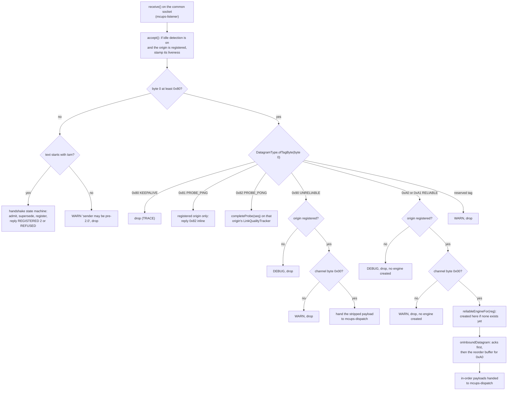
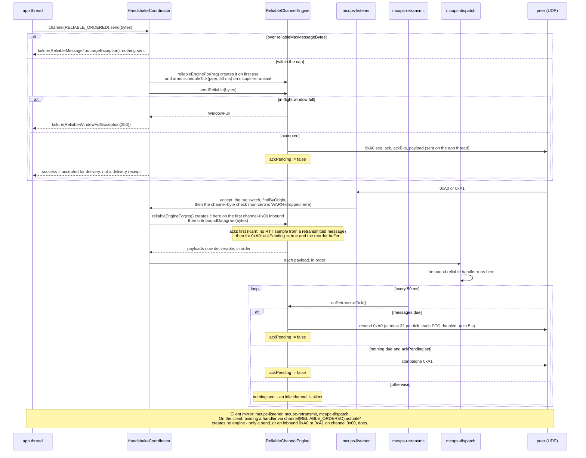

# webtools-udp architecture

Applies to `webtools-udp` `2.x`. How the module is put together: its
components, every thread it can start, the locks and the delivery-ordering
guarantees, the server, client and connection lifecycles, and the path a
datagram takes in each direction. The bytes themselves are specified in
[webtools-udp-protocol.md](webtools-udp-protocol.md). Code is authoritative on
any conflict with this document.

History (decision records, not current fact):
[design](issue-14-reliable-ordered-channel-design.md) (its §7.8 diagram is
superseded by §9 below) ·
[Stage 1 plan](issue-14-reliable-ordered-channel-plan.md) ·
[Stage 2 plan](issue-14-reliable-engine-plan.md) ·
[Stage 3 plan](issue-14-reliable-channel-api-plan.md) ·
[Stage 4 plan](issue-14-finalisation-plan.md) ·
[Issue #34 probe-cadence fix](issue-34-probe-cadence-architecture.md).

## 1. Scope & audience

For a maintainer reasoning about concurrency, a contributor onboarding into
the thread model, and a reviewer checking a proposed change against the
existing topology; any change to a thread, lock or lifecycle updates this
document directly.

## 2. Component map

| Component | Visibility | Role |
|---|---|---|
| `MultiConnectionUDPServer` | public (abstract) | Binds the common port; owns the listener and dispatch threads and the three lazily-created schedulers; exposes `start*` / `pushToAll*` / `stop`; subclass hooks `onClientConnect`, `admit`, `onClientDisconnect` |
| `MultiConnectionUDPClient` | public | One socket; `handshake`; its own listener and dispatch threads; `channel(mode)`; keepalive/probe conveniences; at most one reliable engine |
| `Connection` / `UDPConnection` | public / public (internal constructor) | One named peer: `channel(mode)`, the deprecated `push`/`actuate*`, `terminate`, keepalive/probe control. `UDPConnection` is the production implementation — it owns no socket and delegates to `ClientChannel` |
| `UdpChannel` / `DeliveryMode` | public | The delivery-mode-scoped send/bind view, and the mode enum |
| `Admission`, `DisconnectReason`, `LinkQuality` | public | `admit`'s result, the disconnect reasons, the probe's snapshot value |
| `HandshakeWireFormat`, `TransportWireFormat`, `DatagramType` | public | The handshake text format, the framed control/unreliable codec, the tag-byte enum |
| `HandshakeRefusedException`, `IncompatibleProtocolException`, `ReliableSendFailure` (+ `ReliableWindowFullException`, `ReliableMessageTooLargeException`) | public | Typed `Result.failure` payloads — never thrown |
| `UDPSendReceiveServer` | public | A standalone two-socket primitive **outside** the connection stack (§10) |
| `HandshakeCoordinator` | internal | The server's handshake state machine, tag-byte router and `ClientChannel` implementation; owns `Registrations` |
| `ClientChannel` | internal | The seam through which `UDPConnection` reaches the coordinator: send, bind, deregister, keepalive, probe, reliable |
| `Registrations` / `Registration` | internal | Copy-on-write registry of connected clients and their per-peer state (handlers, liveness stamps, reliable engine, link-quality tracker) |
| `CommonChannel` | internal | Wraps the server's one socket |
| `PeriodicSchedule` / `PeriodicScheduler` | internal | The per-endpoint repeating-task seam: `schedule` (poll-divided, keepalive) and `scheduleTick` (exact cadence, probe and retransmit), each backed by one lazily-created daemon executor |
| `ReliableChannelEngine` | internal | One reliable plane per connection: send, ack processing, retransmit tick, reorder, close |
| `ReliableRetransmitBuffer`, `ReliableReorderBuffer`, `ReliableRtoEstimator`, `ReliableWireFormat`, `SerialSequence` | internal | The engine's parts: the in-flight window, the receive reorder window, the private RTO estimator, the `0xA0`/`0xA1` codec, RFC 1982 arithmetic |
| `LinkQualityTracker`, `Rtt`, `KeepAlive`, `Liveness`, `HandshakeProtocol` | internal | The probe's estimator, RTT/RTO maths, keepalive and idle-sweep timing rules, `Iam` parsing |
| `UnreliableConnectionChannel`, `UnsupportedUdpChannel`, `ReliableConnectionChannel` | internal | The `UdpChannel` implementations behind `Connection.channel` |

Ownership: the server owns one `HandshakeCoordinator`, which owns
`Registrations` (0..N `Registration`s); each `Registration` may own one
`ReliableChannelEngine` and one `LinkQualityTracker`. A client owns at most
one of each for its single server session
(`MultiConnectionUDPServer.kt:254`, `Registrations.kt:50,87`).

## 3. Thread inventory

11 threads, every one named — at most 6 server-side, 5 client-side, all
daemon:

| Side | Thread | Created | Runs |
|---|---|---|---|
| server | `mcups-listener` | eagerly, at construction | receive; `accept` (liveness stamp); the tag switch; the handshake including `admit`/`onClientConnect`; inline `0x82` replies; reliable ack processing |
| server | `mcups-dispatch` | eagerly | every message handler (unreliable and reliable) and `onClientDisconnect` |
| server | `mcups-liveness` | at construction, only if `idleTimeoutMillis > 0` | the idle sweep |
| server | `mcups-keepalive` | lazily, on the first `startKeepAlive` | the keepalive tick, poll-divided (`KeepAlive.pollIntervalMillis`) |
| server | `mcups-probe` | lazily, on the first `startProbe` | the probe tick, exact cadence (`scheduleTick`) |
| server | `mcups-retransmit` | lazily, on the first reliable engine | the retransmit tick, exact cadence (`scheduleTick`) |
| client | `mcupc-listener` | lazily, on the first `ensureListening()` (`start`, `startBytes`, any `channel(...).actuate*`) | receive; the tag switch; inline `0x82` replies; reliable ack processing |
| client | `mcupc-dispatch` | eagerly | handlers |
| client | `mcupc-keepalive` | lazily | the keepalive tick |
| client | `mcupc-probe` | lazily | the probe tick |
| client | `mcupc-retransmit` | lazily | the retransmit tick |

A reliable message's first transmission runs on the **caller's** thread,
inside `send`; retransmits and standalone acks run on the side's own
`-retransmit` thread.

## 4. Outbound send paths

| Traffic | Runs on |
|---|---|
| First transmission of an unreliable `send`/`push`/`pushToAll` | caller's thread |
| First transmission of a reliable `send` (`0xA0`) | caller's thread |
| A retransmitted `0xA0` / a standalone `0xA1` | the side's `-retransmit` thread |
| An inline `0x82` probe reply | the listener thread |
| A scheduled keepalive `0x80` | the side's `-keepalive` thread |
| A one-shot keepalive (`sendKeepAlive()` / `Connection.keepAlive()`) | caller's thread |
| A scheduled probe `0x81` | the side's `-probe` thread |
| The client's `Iam` handshake datagram | caller's thread (`handshake()` blocks until the reply or the timeout) |
| `REGISTERED`/`REFUSED` handshake reply | the listener thread (server-side) |

## 5. Opt-in / zero-cost features

| Feature | Thread(s) | Created |
|---|---|---|
| Idle-connection detection | `mcups-liveness` | at construction, only if `idleTimeoutMillis > 0` |
| Scheduled keepalive | `mcup{c,s}-keepalive` | lazily, on the first `startKeepAlive` |
| Link-quality probe | `mcup{c,s}-probe` | lazily, on the first `startProbe` |
| Reliable-ordered channel | `mcup{c,s}-retransmit` | lazily, on first engine creation (§7 below) |

A consumer that opts into none of these pays for no extra thread and no
per-datagram cost beyond the tag switch.

## 6. Inbound dispatch flow

Server:

The two "channel byte 0x00?" decisions are the channel-byte guard's (Issue
#40). On the server, the `0x90` check sits inside `deliverData`, right after
the registration lookup. The reliable check sits after the `reg == null`
check and before `reliableEngineFor`.

Client differences, in prose (flowcharts have no note syntax):
- The client's loop runs on `mcupc-listener`.
- There is no liveness stamp and no handshake branch. The client reads its
  one `REGISTERED`/`REFUSED` reply inside `handshake()`, before the listener
  starts, so a byte-0 `< 0x80` datagram in the session is simply
  WARN-dropped.
- There is no per-origin registration table, so the "origin registered?"
  branches do not apply. **Only the reliable branch screens origin**
  (`origin == serverEndpoint`). The `0x80`, `0x81`, `0x82` and `0x90`
  branches have **no origin screening at all** — any source's datagram is
  processed (the gap tracked as
  [#39](https://github.com/SpartanLaboratories/WebTools/issues/39)).
- The channel-byte check runs on both data branches, but differently:
  - **reliable branch:** inside the `serverEndpoint` check, before the engine
    is touched, so a non-server source is still dropped at DEBUG whatever
    its channel byte;
  - **`0x90` branch:** it has no origin screening to come after, so the check
    applies to **every** `0x90`, whatever its source. A stranger's
    non-zero-channel `0x90` therefore gets the channel WARN, which names the
    datagram's actual origin.
- The client answers every valid `0x81`.
- The client's reserved-tag drop is DEBUG, not WARN.

## 7. Lifecycles

- **Server `stop()`:** `stopNotifying` → `terminateAll` → listener join (<= 1 s)
  → close the socket → liveness → keepalive → probe → retransmit → dispatch.
  Every step runs even if an earlier one fails. **No `onClientDisconnect`
  fires.**
- **Client `stop()`:** `stopped = true` → `listening = false` → join →
  keepalive → probe → retransmit → `engine.close()` → close the socket →
  dispatch. Each step is its own `runCatching`.
- **Connection states:** register, then one of: a supersede → `SUPERSEDED`;
  `terminate()` → `TERMINATED`; the idle sweep → `TIMEOUT`, notify-only, the
  connection stays addressable.
- **No goodbye on the wire:** neither `terminate()` nor either side's `stop()`
  sends the peer anything — wire protocol 2 has no disconnect datagram (a
  graceful close is one of the reserved future control tags). A peer learns
  that the other side has gone only through its own idle detection.
- **Reliable-engine creation/teardown:**
  - **Client:** created on the first reliable **send**, or on the first
    inbound `0xA0`/`0xA1` that comes from `serverEndpoint` **on channel
    `0x00`** — **not** on `channel(RELIABLE_ORDERED).actuate*`.
  - **Server:** created on the first send, the first `bindReliable`
    (`actuate*`/`startReliable`), or the first inbound `0xA0`/`0xA1` on
    channel `0x00` from a registered origin.
  - **Neither side** creates an engine for a non-zero-channel frame, which
    is dropped before the engine is reached.
  - **Teardown:** either side's `terminate()`, a supersede, or `stop()`
    closes the engine and discards every in-flight or buffered message.

## 8. Concurrency & ordering

- `ReliableChannelEngine` is `@Synchronized`. Lock order is always **engine →
  buffer**, never reversed.
- Three threads contend for the engine per connection: the app thread
  (`send`), the listener (inbound), and the retransmit tick. The 32-per-tick
  cap bounds how long the tick holds the lock.
- `reliableEngineFor`, `reliableEngine()`, and `ensureListening()` are
  `@Synchronized`; `ensureListening()` is idempotent.
- Each side has **one** single-threaded dispatch executor, serialising
  unreliable **and** reliable delivery. **Head-of-line blocking on the
  reliable plane therefore also delays unreliable delivery to that
  connection.**

## 9. The as-built reliable sequence

Server-side. `Coord` is not a thread — it is the `HandshakeCoordinator` code
the calling thread runs.

## 10. `UDPSendReceiveServer` note

This type deliberately has **no** `DeliveryMode`/`UdpChannel` surface and
never will. It is a standalone two-socket primitive (a separate `sendSocket`
and `listenSocket`) with no handshake and no registration — there is no
`Connection` to key a `ReliableChannelEngine` or a retransmit schedule to.
Giving it one would mean standing up a second, parallel reliability stack
for a primitive nobody builds a session on. Source:
`UDPSendReceiveServer.kt:30-38`.
